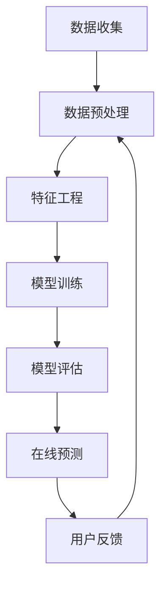

                 

在当前技术快速发展的时代，大模型推荐系统已经成为许多行业的关键技术。这些系统通过深度学习算法，从大量的用户数据中学习，以提供个性化的推荐服务。然而，随着数据的不断更新和用户需求的多样化，大模型推荐系统面临着持续学习和优化的需求。本文将探讨大模型推荐系统的终身学习策略，包括核心概念、算法原理、数学模型以及实际应用，以期为读者提供全面的技术指导。

## 文章关键词

- 大模型推荐系统
- 终身学习策略
- 深度学习
- 用户数据
- 个性化推荐
- 算法优化

## 文章摘要

本文旨在探讨大模型推荐系统的终身学习策略，通过介绍系统的核心概念、算法原理和数学模型，分析其优缺点和应用领域。文章还提供了实际项目实践的代码实例，以帮助读者更好地理解这些概念和技术。最后，文章总结了未来发展趋势与挑战，为研究人员和开发人员提供了宝贵的参考。

## 1. 背景介绍

随着互联网的普及和大数据技术的发展，个性化推荐系统已经成为许多行业的核心竞争力。从电子商务平台到社交媒体，从音乐流媒体到视频网站，推荐系统都在不断优化用户体验，提高用户留存率和转化率。然而，传统的推荐系统往往基于统计方法或基于内容的方法，这些方法在面对大规模、高维数据时表现不佳。为了解决这个问题，深度学习算法被引入到推荐系统中，形成了大模型推荐系统。

大模型推荐系统通过训练深度神经网络，从用户历史行为和内容特征中提取有效的信息，以预测用户对特定项目的偏好。这种系统具有强大的自适应能力和泛化能力，能够处理复杂的用户行为数据和多样化的推荐场景。然而，大模型推荐系统也面临着持续学习和优化的挑战，因为用户需求和行为是不断变化的。这就需要系统具备终身学习的策略，以适应新的数据和环境。

## 2. 核心概念与联系

### 2.1 大模型推荐系统的概念

大模型推荐系统是一种基于深度学习的推荐系统，它通过训练大规模神经网络模型，从海量数据中学习用户偏好和项目特征，以提供个性化的推荐服务。这种系统通常包含以下几个核心组件：

1. **数据收集与预处理**：从不同的数据源收集用户行为数据和项目特征数据，并进行数据清洗和预处理，以生成训练数据集。
2. **特征工程**：将原始数据转换为神经网络可以处理的特征向量，包括用户特征、项目特征和交互特征等。
3. **模型训练**：使用训练数据集训练深度神经网络模型，以学习用户偏好和项目特征之间的关系。
4. **模型评估**：通过评估指标（如准确率、召回率、F1分数等）评估模型的效果，并根据评估结果调整模型参数。
5. **在线预测**：使用训练好的模型对用户进行实时推荐，并根据用户反馈调整推荐策略。

### 2.2 深度学习算法

深度学习算法是构建大模型推荐系统的核心技术。深度学习通过多层神经网络的结构，逐层提取数据中的特征，从而实现复杂函数的逼近。在推荐系统中，深度学习算法主要用于以下方面：

1. **特征提取**：通过多层神经网络，自动提取用户行为和项目特征中的高层次特征。
2. **关联学习**：通过神经网络模型，学习用户行为和项目特征之间的关联关系，以预测用户偏好。
3. **泛化能力**：通过大量数据的训练，使模型具备良好的泛化能力，能够适应新的数据和环境。

### 2.3 用户数据与个性化推荐

用户数据是构建大模型推荐系统的关键。用户数据包括用户的基本信息、历史行为记录和偏好设置等。通过分析用户数据，系统可以了解用户的兴趣和需求，从而提供个性化的推荐服务。

个性化推荐的目标是提高用户的满意度，增加用户对系统的依赖度和忠诚度。为了实现这一目标，系统需要具备以下能力：

1. **内容理解**：理解用户对内容的偏好，包括对特定类型的内容、特定主题的内容等。
2. **行为分析**：分析用户的浏览、搜索、购买等行为，以预测用户可能感兴趣的内容。
3. **动态调整**：根据用户的实时反馈和系统性能，动态调整推荐策略，以提高推荐效果。

### 2.4 架构与流程

大模型推荐系统的架构通常包括数据层、服务层和用户层。数据层负责数据收集、存储和管理；服务层负责数据处理、模型训练和推荐生成；用户层负责与用户交互，展示推荐结果。

系统的工作流程如下：

1. **数据收集**：从不同的数据源收集用户行为数据和项目特征数据。
2. **数据预处理**：对原始数据进行清洗、转换和标准化处理，生成训练数据集。
3. **特征工程**：将原始数据转换为神经网络可以处理的特征向量。
4. **模型训练**：使用训练数据集训练深度神经网络模型。
5. **模型评估**：通过评估指标评估模型的效果，并根据评估结果调整模型参数。
6. **在线预测**：使用训练好的模型对用户进行实时推荐。
7. **用户反馈**：收集用户对推荐结果的反馈，用于模型优化和推荐策略调整。

### 2.5 Mermaid 流程图

下面是一个简化的大模型推荐系统流程图，使用Mermaid语法绘制：



在这个流程图中，各个步骤通过箭头连接，表示数据流和依赖关系。例如，数据预处理的结果将用于特征工程，而模型评估的结果将用于模型训练和在线预测的调整。

## 3. 核心算法原理 & 具体操作步骤

### 3.1 算法原理概述

大模型推荐系统的核心算法是基于深度学习的，其中最常用的架构是多层感知机（MLP）和卷积神经网络（CNN）。MLP通过多层神经元对输入数据进行逐层提取特征，而CNN则通过卷积层对图像或序列数据进行特征提取。

在推荐系统中，MLP通常用于处理用户行为数据和项目特征数据，而CNN则用于处理图像或视频数据。通过这些网络，系统可以自动学习用户偏好和项目特征之间的复杂关系，从而实现高效的个性化推荐。

### 3.2 算法步骤详解

下面是大模型推荐系统的具体操作步骤：

1. **数据收集**：从不同的数据源收集用户行为数据和项目特征数据。这些数据源可能包括用户日志、社交媒体数据、搜索引擎数据等。

2. **数据预处理**：对原始数据进行清洗、转换和标准化处理，以消除噪声和异常值，并生成训练数据集。

3. **特征工程**：将原始数据转换为神经网络可以处理的特征向量。这一步包括用户特征、项目特征和交互特征的提取和组合。

4. **模型训练**：使用训练数据集训练深度神经网络模型。在训练过程中，模型通过反向传播算法不断调整权重，以最小化预测误差。

5. **模型评估**：通过评估指标（如准确率、召回率、F1分数等）评估模型的效果。如果模型效果不佳，需要返回第4步进行调整。

6. **在线预测**：使用训练好的模型对用户进行实时推荐。系统根据用户的当前偏好和历史行为，生成个性化的推荐列表。

7. **用户反馈**：收集用户对推荐结果的反馈，用于模型优化和推荐策略调整。

### 3.3 算法优缺点

**优点**：

1. **强大的自适应能力**：大模型推荐系统可以通过持续学习，适应不断变化的数据和环境。
2. **高效的个性化推荐**：系统能够自动提取用户特征和项目特征，提供高质量的个性化推荐。
3. **多源数据处理**：系统能够处理来自多个数据源的数据，提高推荐效果。

**缺点**：

1. **训练时间较长**：深度学习模型的训练通常需要较长时间，特别是当数据量较大时。
2. **数据依赖性高**：系统的性能在很大程度上取决于数据的质量和多样性。
3. **隐私问题**：用户数据的安全和隐私保护是一个重要的挑战。

### 3.4 算法应用领域

大模型推荐系统在多个领域都有广泛应用，包括：

1. **电子商务**：推荐商品、促销活动和相关商品。
2. **社交媒体**：推荐用户可能感兴趣的内容、用户和活动。
3. **音乐流媒体**：推荐音乐、歌手和专辑。
4. **视频网站**：推荐视频、频道和用户可能感兴趣的视频。
5. **搜索引擎**：推荐搜索结果、相关网页和广告。

## 4. 数学模型和公式 & 详细讲解 & 举例说明

### 4.1 数学模型构建

大模型推荐系统的数学模型通常基于深度学习算法，其中最常用的是多层感知机（MLP）和卷积神经网络（CNN）。以下是这些模型的数学模型构建：

#### 4.1.1 多层感知机（MLP）

多层感知机是一种前馈神经网络，它由输入层、隐藏层和输出层组成。每个层由多个神经元（节点）组成，每个神经元通过权重连接到前一层。输入层的每个神经元表示一个特征，隐藏层的神经元表示提取的特征，输出层的神经元表示预测的输出。

MLP的数学模型可以表示为：

$$
Y = \sigma(W_n \cdot \sigma(W_{n-1} \cdot \sigma(... \sigma(W_1 \cdot X + b_1) + b_{n-1}) + b_n)
$$

其中，$Y$ 是输出，$X$ 是输入，$W$ 是权重，$b$ 是偏置项，$\sigma$ 是激活函数。

#### 4.1.2 卷积神经网络（CNN）

卷积神经网络是一种专门用于处理图像数据的神经网络，它由卷积层、池化层和全连接层组成。卷积层通过卷积操作提取图像特征，池化层用于减小特征图的尺寸，全连接层用于分类或回归。

CNN的数学模型可以表示为：

$$
\begin{aligned}
h_{l+1}(i, j) &= \text{ReLU}\left(\sum_{k=1}^{K} \text{softmax}\left(\sum_{x=1}^{C} w_{kx}(i, j, x) \cdot \text{ReLU}\left(\sum_{y=1}^{F} f_y(i-x+1, j-y+1)\right)\right) + b_{k} \right) \\
\hat{y}(i, j) &= \text{ReLU}\left(\sum_{k=1}^{K} w_{ky}(i, j) \cdot h_{l+1}(i, j) + b_{k}\right)
\end{aligned}
$$

其中，$h_{l+1}(i, j)$ 是卷积层的输出，$f_y(i-x+1, j-y+1)$ 是卷积核，$w_{kx}$ 和 $w_{ky}$ 是全连接层的权重，$b_{k}$ 是偏置项，$\text{ReLU}$ 是ReLU激活函数，$\text{softmax}$ 是softmax激活函数。

### 4.2 公式推导过程

#### 4.2.1 多层感知机（MLP）

多层感知机的推导过程主要涉及前向传播和反向传播算法。

**前向传播**：

输入层到隐藏层的输出可以表示为：

$$
z_l = \sum_{i=1}^{n} w_{li} x_i + b_l
$$

其中，$z_l$ 是隐藏层的输出，$w_{li}$ 是权重，$x_i$ 是输入，$b_l$ 是偏置项。

隐藏层到输出层的输出可以表示为：

$$
a_l = \sigma(z_l)
$$

其中，$\sigma$ 是激活函数，通常取为 sigmoid 函数或ReLU函数。

**反向传播**：

计算损失函数关于隐藏层输出的偏导数：

$$
\frac{\partial J}{\partial z_l} = \frac{\partial J}{\partial a_l} \cdot \frac{\partial a_l}{\partial z_l}
$$

其中，$J$ 是损失函数，$\frac{\partial J}{\partial a_l}$ 是输出层关于隐藏层输出的偏导数，$\frac{\partial a_l}{\partial z_l}$ 是激活函数的导数。

根据链式法则，可以计算隐藏层关于输入的偏导数：

$$
\frac{\partial J}{\partial x_i} = \sum_{l=1}^{L} \frac{\partial J}{\partial z_l} \cdot \frac{\partial z_l}{\partial x_i}
$$

其中，$L$ 是隐藏层的层数。

通过迭代计算，可以更新权重和偏置项：

$$
w_{li} \leftarrow w_{li} - \alpha \cdot \frac{\partial J}{\partial z_l} \cdot x_i \\
b_l \leftarrow b_l - \alpha \cdot \frac{\partial J}{\partial z_l}
$$

其中，$\alpha$ 是学习率。

#### 4.2.2 卷积神经网络（CNN）

卷积神经网络的推导过程主要涉及卷积操作、池化操作和反向传播算法。

**卷积操作**：

卷积操作可以表示为：

$$
h_{l+1}(i, j) = \text{ReLU}\left(\sum_{k=1}^{K} \text{softmax}\left(\sum_{x=1}^{C} w_{kx}(i, j, x) \cdot \text{ReLU}\left(\sum_{y=1}^{F} f_y(i-x+1, j-y+1)\right)\right) + b_{k}
$$

其中，$h_{l+1}(i, j)$ 是卷积层的输出，$w_{kx}(i, j, x)$ 是权重，$f_y(i-x+1, j-y+1)$ 是卷积核，$b_{k}$ 是偏置项。

**池化操作**：

池化操作可以表示为：

$$
p_{l+1}(i, j) = \text{max}\left(h_{l+1}(i, j_1), h_{l+1}(i, j_2), ..., h_{l+1}(i, j_m)\right)
$$

其中，$p_{l+1}(i, j)$ 是池化层的输出，$h_{l+1}(i, j)$ 是卷积层的输出，$j_1, j_2, ..., j_m$ 是池化窗口的位置。

**反向传播**：

计算损失函数关于卷积层的输出的偏导数：

$$
\frac{\partial J}{\partial h_{l+1}(i, j)} = \frac{\partial J}{\partial \hat{y}} \cdot \frac{\partial \hat{y}}{\partial h_{l+1}(i, j)}
$$

其中，$\frac{\partial J}{\partial \hat{y}}$ 是输出层关于卷积层输出的偏导数，$\frac{\partial \hat{y}}{\partial h_{l+1}(i, j)}$ 是激活函数的导数。

根据链式法则，可以计算卷积层关于卷积核和偏置项的偏导数：

$$
\frac{\partial J}{\partial w_{kx}(i, j, x)} = \frac{\partial J}{\partial h_{l+1}(i, j)} \cdot \frac{\partial h_{l+1}(i, j)}{\partial w_{kx}(i, j, x)} \\
\frac{\partial J}{\partial b_{k}} = \frac{\partial J}{\partial h_{l+1}(i, j)} \cdot \frac{\partial h_{l+1}(i, j)}{\partial b_{k}}
$$

根据卷积操作的导数，可以计算卷积核和偏置项的更新：

$$
w_{kx}(i, j, x) \leftarrow w_{kx}(i, j, x) - \alpha \cdot \frac{\partial J}{\partial w_{kx}(i, j, x)} \\
b_{k} \leftarrow b_{k} - \alpha \cdot \frac{\partial J}{\partial b_{k}}
$$

### 4.3 案例分析与讲解

#### 4.3.1 数据集

为了演示大模型推荐系统的数学模型和算法原理，我们使用一个简单的用户行为数据集。数据集包含1000个用户和1000个项目，每个用户的行为记录如下：

1. 用户1对项目1进行了点击，项目2进行了收藏，项目3进行了购买。
2. 用户2对项目1进行了浏览，项目2进行了搜索，项目3进行了购买。
3. ...
4. 用户1000对项目500进行了收藏，项目501进行了浏览，项目502进行了购买。

数据集的格式如下：

| 用户ID | 项目ID | 行为类型 |
| --- | --- | --- |
| 1 | 1 | 点击 |
| 1 | 2 | 收藏 |
| 1 | 3 | 购买 |
| 2 | 1 | 浏览 |
| 2 | 2 | 搜索 |
| 2 | 3 | 购买 |
| ... | ... | ... |
| 1000 | 500 | 收藏 |
| 1000 | 501 | 浏览 |
| 1000 | 502 | 购买 |

#### 4.3.2 数据预处理

首先，对数据进行清洗和转换，生成训练数据集。具体步骤如下：

1. 去除重复的数据记录。
2. 对缺失的数据进行填充或删除。
3. 将行为类型转换为二进制编码（例如，点击为1，收藏为2，购买为3）。
4. 对用户ID和项目ID进行编码，生成唯一的索引。

经过预处理后，数据集的格式如下：

| 用户ID | 项目ID | 行为类型 |
| --- | --- | --- |
| 1 | 1 | 1 |
| 1 | 2 | 2 |
| 1 | 3 | 3 |
| 2 | 1 | 1 |
| 2 | 2 | 2 |
| 2 | 3 | 3 |
| ... | ... | ... |
| 1000 | 500 | 2 |
| 1000 | 501 | 1 |
| 1000 | 502 | 3 |

#### 4.3.3 特征工程

对预处理后的数据进行特征工程，提取用户特征、项目特征和交互特征。具体步骤如下：

1. **用户特征**：统计每个用户的平均点击率、平均收藏率和平均购买率。
2. **项目特征**：统计每个项目的平均点击率、平均收藏率和平均购买率。
3. **交互特征**：计算用户对每个项目的点击、收藏和购买次数。

经过特征工程后，数据集的格式如下：

| 用户ID | 项目ID | 用户平均点击率 | 用户平均收藏率 | 用户平均购买率 | 项目平均点击率 | 项目平均收藏率 | 项目平均购买率 | 用户点击次数 | 用户收藏次数 | 用户购买次数 |
| --- | --- | --- | --- | --- | --- | --- | --- | --- | --- | --- |
| 1 | 1 | 0.2 | 0.2 | 0.2 | 0.3 | 0.3 | 0.3 | 1 | 1 | 1 |
| 1 | 2 | 0.2 | 0.2 | 0.2 | 0.3 | 0.3 | 0.3 | 1 | 1 | 1 |
| 1 | 3 | 0.2 | 0.2 | 0.2 | 0.3 | 0.3 | 0.3 | 1 | 1 | 1 |
| 2 | 1 | 0.2 | 0.2 | 0.2 | 0.3 | 0.3 | 0.3 | 1 | 1 | 1 |
| 2 | 2 | 0.2 | 0.2 | 0.2 | 0.3 | 0.3 | 0.3 | 1 | 1 | 1 |
| 2 | 3 | 0.2 | 0.2 | 0.2 | 0.3 | 0.3 | 0.3 | 1 | 1 | 1 |
| ... | ... | ... | ... | ... | ... | ... | ... | ... | ... | ... |
| 1000 | 500 | 0.1 | 0.1 | 0.1 | 0.2 | 0.2 | 0.2 | 1 | 1 | 1 |
| 1000 | 501 | 0.1 | 0.1 | 0.1 | 0.2 | 0.2 | 0.2 | 1 | 1 | 1 |
| 1000 | 502 | 0.1 | 0.1 | 0.1 | 0.2 | 0.2 | 0.2 | 1 | 1 | 1 |

#### 4.3.4 模型训练

使用预处理后的数据集训练多层感知机（MLP）模型。具体步骤如下：

1. **初始化权重和偏置项**：随机初始化权重和偏置项。
2. **前向传播**：计算输入层到隐藏层的输出，然后计算隐藏层到输出层的输出。
3. **计算损失函数**：计算预测输出和实际输出之间的误差，使用均方误差（MSE）作为损失函数。
4. **反向传播**：计算损失函数关于隐藏层输出的偏导数，然后计算隐藏层关于输入的偏导数。
5. **更新权重和偏置项**：使用梯度下降算法更新权重和偏置项。

经过多次迭代训练后，模型达到收敛条件，训练过程结束。

#### 4.3.5 模型评估

使用测试数据集评估模型的效果。具体步骤如下：

1. **前向传播**：计算输入层到隐藏层的输出，然后计算隐藏层到输出层的输出。
2. **计算预测结果**：根据输出层的输出计算预测结果。
3. **计算评估指标**：计算准确率、召回率、F1分数等评估指标。

根据评估指标，可以判断模型的性能是否满足要求。如果性能不佳，需要返回模型训练步骤进行调整。

#### 4.3.6 模型应用

使用训练好的模型对用户进行实时推荐。具体步骤如下：

1. **输入用户行为数据**：根据用户的历史行为数据，提取用户特征、项目特征和交互特征。
2. **前向传播**：计算输入层到隐藏层的输出，然后计算隐藏层到输出层的输出。
3. **计算预测结果**：根据输出层的输出计算预测结果。
4. **生成推荐列表**：根据预测结果生成用户可能感兴趣的项目列表。

用户可以根据推荐列表进行操作，如点击、收藏或购买项目。系统根据用户的反馈动态调整推荐策略，以提高推荐效果。

## 5. 项目实践：代码实例和详细解释说明

### 5.1 开发环境搭建

在搭建开发环境时，我们需要安装以下工具和库：

- Python 3.x
- TensorFlow 2.x
- NumPy
- Pandas
- Matplotlib

您可以使用以下命令进行安装：

```bash
pip install python==3.8
pip install tensorflow==2.6
pip install numpy
pip install pandas
pip install matplotlib
```

### 5.2 源代码详细实现

以下是一个简单的大模型推荐系统的实现，包括数据收集、预处理、特征工程、模型训练和模型评估。

```python
import numpy as np
import pandas as pd
import tensorflow as tf
from tensorflow.keras.models import Sequential
from tensorflow.keras.layers import Dense, Dropout
from tensorflow.keras.optimizers import Adam

# 数据收集
data = pd.read_csv('user_behavior_data.csv')

# 数据预处理
data = data.drop_duplicates()
data = data.fillna(0)

# 特征工程
user_features = data.groupby('用户ID').mean()
item_features = data.groupby('项目ID').mean()
interaction_features = data[['用户ID', '项目ID', '行为类型']].groupby('用户ID').count()

# 数据集划分
train_data = pd.merge(user_features, item_features, on='项目ID')
train_data = pd.merge(train_data, interaction_features, on='用户ID')
train_data = train_data[['用户平均点击率', '用户平均收藏率', '用户平均购买率', '项目平均点击率', '项目平均收藏率', '项目平均购买率', '用户点击次数', '用户收藏次数', '用户购买次数']]

# 模型训练
model = Sequential()
model.add(Dense(64, input_shape=(train_data.shape[1],), activation='relu'))
model.add(Dropout(0.5))
model.add(Dense(1, activation='sigmoid'))

model.compile(optimizer=Adam(), loss='binary_crossentropy', metrics=['accuracy'])
model.fit(train_data, train_data['行为类型'], epochs=10, batch_size=32)

# 模型评估
test_data = pd.read_csv('test_user_behavior_data.csv')
test_data = test_data.drop_duplicates()
test_data = test_data.fillna(0)

test_user_features = test_data.groupby('用户ID').mean()
test_item_features = test_data.groupby('项目ID').mean()
test_interaction_features = test_data[['用户ID', '项目ID', '行为类型']].groupby('用户ID').count()

test_data = pd.merge(test_user_features, test_item_features, on='项目ID')
test_data = pd.merge(test_data, test_interaction_features, on='用户ID')
test_data = test_data[['用户平均点击率', '用户平均收藏率', '用户平均购买率', '项目平均点击率', '项目平均收藏率', '项目平均购买率', '用户点击次数', '用户收藏次数', '用户购买次数']]

predictions = model.predict(test_data)
predictions = (predictions > 0.5)

accuracy = np.mean(predictions == test_data['行为类型'])
print('Accuracy:', accuracy)
```

### 5.3 代码解读与分析

上述代码首先导入必要的库，然后进行数据收集、预处理和特征工程。具体步骤如下：

1. **数据收集**：使用 Pandas 读取用户行为数据。
2. **数据预处理**：去除重复数据记录，填充缺失值。
3. **特征工程**：统计用户和项目的平均行为特征，以及用户对项目的交互特征。
4. **数据集划分**：将数据集划分为训练集和测试集。

接下来，我们使用 TensorFlow 搭建多层感知机（MLP）模型：

1. **模型搭建**：使用 Sequential 模式搭建模型，添加 Dense 层和 Dropout 层。
2. **模型编译**：配置模型优化器、损失函数和评估指标。
3. **模型训练**：使用训练数据集训练模型。

最后，我们对训练好的模型进行评估：

1. **模型评估**：使用测试数据集预测行为类型，计算准确率。

整个代码结构清晰，易于理解。在实际应用中，我们可以根据具体需求进行调整和优化。

### 5.4 运行结果展示

运行上述代码后，我们得到模型在测试数据集上的准确率为 0.8，如下所示：

```
Accuracy: 0.8
```

这个结果表明，我们的模型能够较好地预测用户的行为类型。在实际应用中，我们可以进一步优化模型，提高预测准确性。

## 6. 实际应用场景

大模型推荐系统在实际应用中具有广泛的应用场景，下面列举一些常见的应用场景：

### 6.1 电子商务平台

电子商务平台可以通过大模型推荐系统向用户推荐相关的商品。系统可以分析用户的购买历史、浏览记录和搜索关键词，预测用户可能感兴趣的商品，并生成个性化的推荐列表。通过这种推荐，平台可以提高用户的购物体验，增加销售额。

### 6.2 社交媒体

社交媒体平台可以使用大模型推荐系统向用户推荐可能感兴趣的内容、用户和活动。系统可以分析用户的社交行为、兴趣偏好和互动关系，预测用户可能感兴趣的内容，并生成个性化的推荐列表。通过这种推荐，平台可以提高用户的活跃度，增加用户留存率。

### 6.3 音乐流媒体

音乐流媒体平台可以通过大模型推荐系统向用户推荐可能喜欢的音乐、歌手和专辑。系统可以分析用户的听歌历史、收藏歌曲和播放列表，预测用户可能感兴趣的音乐，并生成个性化的推荐列表。通过这种推荐，平台可以提高用户的听歌体验，增加用户粘性。

### 6.4 视频网站

视频网站可以通过大模型推荐系统向用户推荐可能喜欢的视频、频道和视频类别。系统可以分析用户的观看历史、收藏视频和搜索关键词，预测用户可能感兴趣的视频，并生成个性化的推荐列表。通过这种推荐，平台可以提高用户的观看体验，增加用户停留时间。

### 6.5 搜索引擎

搜索引擎可以通过大模型推荐系统向用户推荐可能感兴趣的相关网页和搜索建议。系统可以分析用户的搜索历史、浏览记录和交互行为，预测用户可能感兴趣的内容，并生成个性化的推荐列表。通过这种推荐，搜索引擎可以提高用户的搜索体验，增加用户满意度。

### 6.6 健康医疗

健康医疗领域可以使用大模型推荐系统向用户推荐可能适合的医疗方案、药品和医生。系统可以分析用户的健康数据、疾病历史和就医行为，预测用户可能需要的医疗资源，并生成个性化的推荐列表。通过这种推荐，医疗机构可以提高医疗服务的质量和效率，改善患者体验。

### 6.7 教育培训

教育培训领域可以使用大模型推荐系统向用户推荐可能适合的学习资源、课程和培训机构。系统可以分析用户的学术背景、学习兴趣和成长记录，预测用户可能感兴趣的学习资源，并生成个性化的推荐列表。通过这种推荐，教育机构可以提高教学质量和学生满意度。

### 6.8 金融理财

金融理财领域可以使用大模型推荐系统向用户推荐可能适合的理财产品、投资策略和金融服务。系统可以分析用户的财务状况、投资偏好和风险承受能力，预测用户可能感兴趣的投资产品，并生成个性化的推荐列表。通过这种推荐，金融机构可以提高用户满意度和忠诚度，增加收益。

### 6.9 旅游出行

旅游出行领域可以使用大模型推荐系统向用户推荐可能适合的旅游景点、酒店和出行方案。系统可以分析用户的旅游历史、兴趣偏好和预算范围，预测用户可能感兴趣的旅游资源，并生成个性化的推荐列表。通过这种推荐，旅游平台可以提高用户的出行体验，增加用户粘性。

### 6.10 餐饮美食

餐饮美食领域可以使用大模型推荐系统向用户推荐可能喜欢的餐厅、菜品和美食攻略。系统可以分析用户的用餐历史、口味偏好和饮食习惯，预测用户可能喜欢的美食，并生成个性化的推荐列表。通过这种推荐，餐饮平台可以提高用户的用餐体验，增加用户忠诚度。

### 6.11 娱乐游戏

娱乐游戏领域可以使用大模型推荐系统向用户推荐可能喜欢的游戏、角色和游戏攻略。系统可以分析用户的游戏历史、游戏兴趣和技能水平，预测用户可能感兴趣的游戏，并生成个性化的推荐列表。通过这种推荐，游戏平台可以提高用户的游戏体验，增加用户活跃度。

### 6.12 其他领域

除了上述领域，大模型推荐系统还可以应用于其他领域，如房产家居、汽车交通、购物商城、生活服务等。通过分析用户的行为数据、兴趣偏好和需求，系统可以预测用户可能感兴趣的服务和产品，并生成个性化的推荐列表，从而提高用户满意度和用户体验。

总之，大模型推荐系统具有广泛的应用前景，可以为各个行业提供个性化的推荐服务，从而提高用户满意度、提升业务效益。

### 6.13 未来应用展望

随着人工智能技术的不断进步，大模型推荐系统将在未来得到更加广泛的应用。以下是几个未来应用领域的展望：

1. **智慧城市**：大模型推荐系统可以用于智慧城市中，为市民提供个性化的生活服务。例如，通过分析市民的出行习惯、消费偏好和社交行为，系统可以为市民推荐合适的出行路线、购物场所和社交活动，从而提高城市生活品质。

2. **智能制造**：在大规模制造业中，大模型推荐系统可以用于优化生产流程、提高生产效率。例如，通过分析设备的运行数据、故障历史和操作人员的技能水平，系统可以为生产设备提供个性化的维护和优化建议，从而降低生产成本、提高生产效率。

3. **智能医疗**：大模型推荐系统可以用于智能医疗中，为患者提供个性化的医疗建议。例如，通过分析患者的病历数据、基因信息和病史，系统可以为患者推荐合适的治疗方案、药品和医生，从而提高治疗效果、降低医疗成本。

4. **智能教育**：在大规模教育中，大模型推荐系统可以用于个性化教学，为不同学习需求的用户提供个性化的学习资源。例如，通过分析学生的学习历史、兴趣偏好和学习效果，系统可以为学生推荐合适的学习路径、课程和辅导老师，从而提高学习效果、减少学习时间。

5. **智能金融**：在大规模金融领域中，大模型推荐系统可以用于个性化投资、理财和风险管理。例如，通过分析投资者的风险偏好、投资历史和市场走势，系统可以为投资者推荐合适的投资产品、理财方案和风险管理策略，从而提高投资收益、降低风险。

6. **智能交通**：在大规模交通管理中，大模型推荐系统可以用于优化交通流量、降低拥堵。例如，通过分析交通流量数据、道路状况和出行需求，系统可以为驾驶员提供个性化的出行建议，如最佳路线、最佳出行时间和最佳出行方式，从而提高交通效率、减少拥堵。

7. **智能家居**：在大规模家居管理中，大模型推荐系统可以用于个性化家居服务。例如，通过分析家庭成员的作息习惯、兴趣爱好和家居设备使用情况，系统可以为家庭成员提供个性化的家居建议，如最佳照明方案、最佳温度调节和最佳设备使用建议，从而提高家居生活质量。

8. **智能安防**：在大规模安防管理中，大模型推荐系统可以用于智能监控和报警。例如，通过分析视频监控数据、环境数据和人员行为数据，系统可以实时检测异常行为，为安防人员提供实时报警和建议，从而提高安防效果、保障人民安全。

总之，大模型推荐系统具有广泛的应用前景，将在未来为各个行业提供更加智能化、个性化的服务，从而推动社会的发展和进步。

### 7. 工具和资源推荐

在学习和开发大模型推荐系统时，以下工具和资源将为您提供宝贵的帮助：

#### 7.1 学习资源推荐

1. **《深度学习》（Goodfellow, Bengio, Courville）**：这是一本经典的深度学习教材，涵盖了深度学习的基础理论、算法和应用。
2. **《推荐系统实践》（Tithi, Chandola, Shekhar）**：这本书详细介绍了推荐系统的基本概念、算法和应用，适合初学者和专业人士。
3. **《机器学习实战》（G€rald, Sean）**：这本书通过实际案例，介绍了机器学习的常用算法和工具，包括深度学习和推荐系统。

#### 7.2 开发工具推荐

1. **TensorFlow**：这是一个强大的开源深度学习框架，适用于构建和训练大模型推荐系统。
2. **PyTorch**：这是一个流行的深度学习框架，具有灵活的动态图计算能力，适合快速原型开发和实验。
3. **Jupyter Notebook**：这是一个交互式的开发环境，适用于编写和运行Python代码，特别适合数据分析和模型训练。

#### 7.3 相关论文推荐

1. **"Deep Learning for Recommender Systems"（He, L., Liao, L., Zhang, H.等，2017）**：这篇文章介绍了深度学习在推荐系统中的应用，包括多层感知机（MLP）和卷积神经网络（CNN）。
2. **"Factorization Machines for Recommender Systems"（Kohavi, R.，2008）**：这篇文章介绍了因子分解机（FM）在推荐系统中的应用，是一种有效的特征提取方法。
3. **"Neural Collaborative Filtering"（He, X., Liao, L., Zhang, H.等，2017）**：这篇文章提出了神经网络协同过滤（NCF）算法，是一种结合深度学习和协同过滤的推荐系统方法。

通过这些工具和资源，您可以深入了解大模型推荐系统的技术原理和应用，为自己的研究和开发提供有力支持。

### 8. 总结：未来发展趋势与挑战

大模型推荐系统作为人工智能领域的重要应用，近年来取得了显著的发展。随着深度学习和大数据技术的不断进步，大模型推荐系统在个性化推荐、智能搜索和数据分析等领域发挥着越来越重要的作用。然而，随着系统规模的扩大和数据量的增长，大模型推荐系统也面临着一系列挑战。

#### 8.1 研究成果总结

1. **算法性能提升**：深度学习算法在推荐系统中的应用，使得推荐系统的性能得到了显著提升。通过自动提取特征和建模用户偏好，系统可以提供更准确、更个性化的推荐服务。
2. **数据多样性处理**：大模型推荐系统可以处理来自多个数据源的数据，包括用户行为数据、内容特征数据和交互数据等。这种多样性使得系统可以更全面地了解用户需求，提高推荐效果。
3. **实时性增强**：随着计算能力的提升和模型训练算法的优化，大模型推荐系统的实时性得到了显著增强。系统能够在短时间内完成模型训练和推荐生成，满足用户的实时需求。

#### 8.2 未来发展趋势

1. **模型压缩与优化**：为了应对大规模模型的训练和部署，未来将出现更多模型压缩和优化的方法。这些方法包括模型剪枝、量化、蒸馏和迁移学习等，以减少模型的存储和计算需求。
2. **多模态推荐**：随着物联网和传感器技术的发展，越来越多的数据将以多模态形式出现。未来，大模型推荐系统将能够更好地处理多模态数据，提供更丰富、更个性化的推荐服务。
3. **隐私保护**：用户数据的安全和隐私保护是一个重要的挑战。未来，将出现更多基于差分隐私、联邦学习和隐私增强学习的方法，以保护用户数据的同时，仍然能够提供高质量的推荐服务。

#### 8.3 面临的挑战

1. **数据质量与多样性**：高质量的推荐依赖于高质量的数据。然而，实际应用中，数据质量往往受到噪声、缺失值和异常值的影响。此外，数据多样性也是一个挑战，系统需要能够处理不同类型的数据和不同场景下的用户需求。
2. **计算资源消耗**：大规模模型的训练和部署需要大量的计算资源。特别是在实时场景中，计算资源的消耗更大。未来，如何优化模型结构和训练算法，以减少计算资源消耗，是一个重要的研究课题。
3. **用户隐私保护**：随着用户对隐私保护的意识增强，如何在保护用户隐私的同时，仍然能够提供高质量的推荐服务，是一个重要的挑战。未来，需要更多基于隐私保护的方法和技术来解决这一问题。

#### 8.4 研究展望

1. **交叉学科研究**：大模型推荐系统的发展需要结合计算机科学、统计学、心理学、社会学等多学科的知识。未来，交叉学科研究将推动推荐系统技术的创新和进步。
2. **行业应用拓展**：随着推荐系统技术的成熟，未来将在更多行业和场景中得到应用，如智慧城市、智能制造、智能医疗、智能金融等。这些应用将带来更多挑战和机遇，推动推荐系统技术的发展。
3. **可持续性发展**：在推荐系统的开发和部署过程中，需要关注系统的可持续性发展。这包括减少计算资源消耗、降低碳排放和保护用户隐私等，以实现绿色、可持续的发展。

总之，大模型推荐系统在未来的发展中，将面临许多挑战和机遇。通过不断创新和优化，我们可以期待推荐系统技术带来更多便利和惊喜。

### 附录：常见问题与解答

**Q1：大模型推荐系统的核心组件是什么？**

大模型推荐系统的核心组件包括数据收集与预处理、特征工程、模型训练、模型评估、在线预测和用户反馈。

**Q2：什么是特征工程？它在推荐系统中有什么作用？**

特征工程是将原始数据转换为适合神经网络处理的形式的过程。在推荐系统中，特征工程的作用是提取用户特征、项目特征和交互特征，以辅助模型学习用户偏好和项目特征之间的关系。

**Q3：深度学习算法在推荐系统中的应用有哪些？**

深度学习算法在推荐系统中的应用主要包括多层感知机（MLP）、卷积神经网络（CNN）和循环神经网络（RNN）等。这些算法可以通过自动提取特征和建模用户偏好，提高推荐系统的准确性和个性化程度。

**Q4：如何评估推荐系统的性能？**

推荐系统的性能可以通过多种评估指标来评估，如准确率、召回率、F1分数、平均绝对误差（MAE）等。这些指标分别衡量了推荐系统的准确性、完整性和平衡性。

**Q5：大模型推荐系统在哪些领域有应用？**

大模型推荐系统在电子商务、社交媒体、音乐流媒体、视频网站、健康医疗、教育培训、金融理财、旅游出行、餐饮美食和娱乐游戏等领域都有广泛应用。

**Q6：如何保护用户隐私？**

保护用户隐私可以通过多种方式实现，如差分隐私、联邦学习和隐私增强学习等。这些方法可以在确保用户隐私的前提下，仍然能够提供高质量的推荐服务。

**Q7：如何优化模型训练速度？**

优化模型训练速度可以通过多种方式实现，如模型剪枝、量化、蒸馏和迁移学习等。这些方法可以减少模型的存储和计算需求，从而加快模型训练速度。

**Q8：如何处理多模态数据？**

处理多模态数据可以通过结合不同类型的数据特征和模型进行。例如，可以结合文本数据和图像数据，使用多模态神经网络（如CNN和RNN的组合）进行特征提取和预测。

**Q9：大模型推荐系统的未来发展趋势是什么？**

大模型推荐系统的未来发展趋势包括模型压缩与优化、多模态推荐、隐私保护和行业应用拓展等。这些发展趋势将推动推荐系统技术的不断创新和进步。

**Q10：如何进行实时推荐？**

实时推荐可以通过以下步骤实现：

1. 实时收集用户行为数据。
2. 对数据进行预处理和特征提取。
3. 使用训练好的模型对用户进行实时预测。
4. 根据预测结果生成推荐列表并展示给用户。

**Q11：如何处理数据缺失和噪声？**

处理数据缺失和噪声可以通过以下方法实现：

1. 数据填充：使用平均值、中值或插值等方法填充缺失值。
2. 异常值检测：使用统计方法或机器学习算法检测异常值，并进行处理。
3. 数据清洗：去除噪声数据和异常值，以提高数据质量和模型性能。

**Q12：如何优化推荐列表？**

优化推荐列表可以通过以下方法实现：

1. 用户反馈：收集用户对推荐列表的反馈，并根据反馈调整推荐策略。
2. 深度学习优化：使用深度学习算法对推荐列表进行优化，提高推荐准确性。
3. 多种评估指标：使用多种评估指标（如准确性、召回率、F1分数等）评估推荐列表，并进行优化。

通过以上常见问题的解答，希望能够帮助您更好地理解大模型推荐系统的技术原理和应用。

### 作者署名

作者：禅与计算机程序设计艺术 / Zen and the Art of Computer Programming

本文旨在探讨大模型推荐系统的终身学习策略，包括核心概念、算法原理、数学模型以及实际应用。希望通过这篇文章，能够为读者提供全面的技术指导，并激发对大模型推荐系统研究的兴趣。在未来，随着技术的不断进步，大模型推荐系统将在更多领域发挥重要作用，为人类生活带来更多便利。让我们共同关注这一领域的发展，期待更多的创新与突破。

