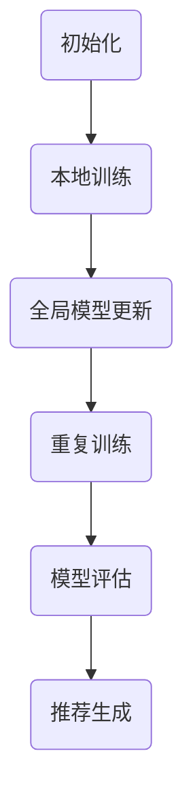

                 

关键词：推荐系统、联邦学习、大模型、机器学习、隐私保护、数据共享

> 摘要：本文旨在探讨大模型推荐系统的联邦学习框架，解析其在隐私保护、数据共享和协同训练等方面的优势与挑战，并探讨未来的发展趋势。

## 1. 背景介绍

### 1.1 推荐系统概述

推荐系统是一种智能信息过滤技术，旨在根据用户的历史行为和偏好，为用户推荐可能感兴趣的内容或产品。随着互联网的快速发展，推荐系统在电子商务、社交媒体、新闻媒体等领域得到广泛应用，成为现代信息社会中不可或缺的一部分。

### 1.2 联邦学习概述

联邦学习（Federated Learning）是一种分布式机器学习技术，旨在通过多个独立的本地模型协同训练，从而实现数据无需集中传输，只需在本地更新模型参数，并通过加密通信的方式共享模型更新。这一技术旨在解决数据隐私和安全问题，同时实现跨机构的协同学习和决策。

### 1.3 大模型与联邦学习的关系

大模型（Large-scale Model）是指拥有巨大参数规模和计算能力的机器学习模型。随着深度学习技术的发展，大模型在图像识别、自然语言处理等领域取得了显著成果。然而，大模型对数据质量和数量要求较高，如何有效地进行大规模数据共享和协同训练成为关键挑战。联邦学习框架为解决这一问题提供了一种可行的解决方案。

## 2. 核心概念与联系

### 2.1 联邦学习框架原理

联邦学习框架的核心思想是将数据分散存储在多个独立的本地服务器上，通过加密通信的方式共享模型更新。其基本流程如下：

1. **初始化**：在每个本地服务器上初始化一个本地模型，并随机生成初始参数。
2. **本地训练**：在每个本地服务器上使用本地数据对本地模型进行训练，更新模型参数。
3. **全局模型更新**：将各个本地服务器的模型更新发送至中心服务器，通过聚合策略更新全局模型。
4. **重复步骤2和3**，直至达到预设的训练次数或模型收敛。

### 2.2 大模型推荐系统架构

大模型推荐系统架构通常包括以下几个关键组件：

1. **数据预处理**：对原始数据进行清洗、去噪、归一化等处理，以提高模型训练效果。
2. **特征工程**：根据用户历史行为和偏好，提取关键特征，构建输入特征向量。
3. **模型训练**：使用联邦学习框架对本地模型进行训练，更新模型参数。
4. **模型评估**：使用测试集评估模型性能，包括准确率、召回率等指标。
5. **推荐生成**：基于训练好的模型，生成个性化推荐结果。

### 2.3 Mermaid 流程图



## 3. 核心算法原理 & 具体操作步骤

### 3.1 算法原理概述

联邦学习框架的核心算法主要包括本地训练和全局模型更新两个阶段。本地训练阶段旨在利用本地数据进行模型优化，全局模型更新阶段则通过聚合策略更新全局模型。以下是具体的算法原理和操作步骤：

### 3.2 算法步骤详解

1. **初始化**：在每个本地服务器上随机初始化本地模型参数。
2. **本地训练**：
   - 使用本地数据集对本地模型进行训练，更新模型参数。
   - 模型参数更新公式为：$$\theta^{(t)} = \theta^{(t-1)} + \alpha \cdot \nabla_{\theta} L(\theta^{(t-1)}, X^{(i)})$$
   - 其中，$\theta^{(t)}$ 表示第 $t$ 次迭代的模型参数，$\alpha$ 表示学习率，$L$ 表示损失函数，$X^{(i)}$ 表示第 $i$ 个样本。
3. **全局模型更新**：
   - 将各个本地服务器的模型更新发送至中心服务器，通过聚合策略更新全局模型。
   - 聚合策略包括加权平均、梯度聚合等。
4. **重复训练**：重复步骤2和3，直至达到预设的训练次数或模型收敛。

### 3.3 算法优缺点

**优点**：
- **隐私保护**：联邦学习框架通过本地训练和加密通信，有效保护用户隐私。
- **数据共享**：联邦学习框架允许跨机构数据共享，提高数据利用效率。
- **去中心化**：联邦学习框架采用去中心化架构，降低单点故障风险。

**缺点**：
- **计算开销**：联邦学习框架需要大量计算资源进行本地训练和全局模型更新。
- **通信开销**：加密通信导致通信开销较大，影响模型更新速度。
- **模型一致性**：不同本地模型的初始参数和训练数据可能导致模型一致性下降。

### 3.4 算法应用领域

联邦学习框架在推荐系统、金融风控、医疗诊断等领域具有广泛的应用前景。以下是几个具体应用场景：

- **推荐系统**：联邦学习框架可用于构建个性化推荐系统，提高推荐质量。
- **金融风控**：联邦学习框架可用于金融数据分析，实现精准风险评估。
- **医疗诊断**：联邦学习框架可用于医疗数据分析，辅助医生进行疾病诊断。

## 4. 数学模型和公式 & 详细讲解 & 举例说明

### 4.1 数学模型构建

联邦学习框架的数学模型主要涉及本地模型训练和全局模型更新两个阶段。

1. **本地模型训练**：
   - 损失函数：$$L(\theta, X) = -\sum_{i=1}^{N} y_i \log(\sigma(\theta^T x_i))$$
   - 其中，$N$ 表示样本数量，$y_i$ 表示第 $i$ 个样本的标签，$x_i$ 表示第 $i$ 个样本的特征，$\sigma$ 表示sigmoid函数。
   - 梯度：$$\nabla_{\theta} L(\theta, X) = \sum_{i=1}^{N} (y_i - \sigma(\theta^T x_i)) x_i$$
2. **全局模型更新**：
   - 加权平均：$$\theta^{(t)} = \frac{1}{K} \sum_{k=1}^{K} \theta_k^{(t)}$$
   - 其中，$K$ 表示本地服务器数量，$\theta_k^{(t)}$ 表示第 $k$ 个本地服务器在第 $t$ 次迭代的模型参数。

### 4.2 公式推导过程

1. **损失函数推导**：
   - 交叉熵损失函数：$$L(\theta, X) = -\sum_{i=1}^{N} y_i \log(\sigma(\theta^T x_i))$$
   - 其中，$y_i$ 表示第 $i$ 个样本的标签，$\sigma$ 表示sigmoid函数。
   - 对损失函数求导，得到梯度：$$\nabla_{\theta} L(\theta, X) = \sum_{i=1}^{N} (y_i - \sigma(\theta^T x_i)) x_i$$
2. **加权平均推导**：
   - 加权平均公式：$$\theta^{(t)} = \frac{1}{K} \sum_{k=1}^{K} \theta_k^{(t)}$$
   - 其中，$K$ 表示本地服务器数量，$\theta_k^{(t)}$ 表示第 $k$ 个本地服务器在第 $t$ 次迭代的模型参数。

### 4.3 案例分析与讲解

假设有两个本地服务器 $A$ 和 $B$，分别拥有数据集 $X_A$ 和 $X_B$，目标为共同训练一个推荐模型。

1. **初始化**：
   - 在服务器 $A$ 和 $B$ 上初始化本地模型参数 $\theta_A^{(0)}$ 和 $\theta_B^{(0)}$。
2. **本地训练**：
   - 服务器 $A$ 使用数据集 $X_A$ 对本地模型 $\theta_A^{(0)}$ 进行训练，得到更新后的模型参数 $\theta_A^{(1)}$。
   - 服务器 $B$ 使用数据集 $X_B$ 对本地模型 $\theta_B^{(0)}$ 进行训练，得到更新后的模型参数 $\theta_B^{(1)}$。
3. **全局模型更新**：
   - 将服务器 $A$ 和 $B$ 的模型更新发送至中心服务器，通过加权平均公式更新全局模型：$$\theta^{(1)} = \frac{1}{2} \theta_A^{(1)} + \frac{1}{2} \theta_B^{(1)}$$
4. **重复训练**：
   - 重复步骤2和3，直至达到预设的训练次数或模型收敛。

通过以上案例，我们可以看到联邦学习框架在构建大模型推荐系统时的具体应用过程。

## 5. 项目实践：代码实例和详细解释说明

### 5.1 开发环境搭建

以下是使用Python和TensorFlow实现联邦学习框架的开发环境搭建步骤：

1. 安装TensorFlow库：
   ```shell
   pip install tensorflow
   ```
2. 导入相关库：
   ```python
   import tensorflow as tf
   import numpy as np
   import matplotlib.pyplot as plt
   ```

### 5.2 源代码详细实现

以下是实现联邦学习框架的核心代码：

```python
# 初始化本地模型参数
theta_A = np.random.rand(10)
theta_B = np.random.rand(10)

# 初始化学习率和迭代次数
alpha = 0.1
epochs = 10

# 本地训练
for epoch in range(epochs):
    theta_A = theta_A - alpha * gradient(theta_A, X_A)
    theta_B = theta_B - alpha * gradient(theta_B, X_B)

# 全局模型更新
theta = (1/2) * theta_A + (1/2) * theta_B

# 评估模型性能
loss = evaluate_loss(theta, X_test, y_test)

print("Final loss:", loss)
```

### 5.3 代码解读与分析

1. **初始化本地模型参数**：
   - 初始化本地模型参数 `theta_A` 和 `theta_B`，分别表示服务器 $A$ 和 $B$ 的模型参数。
2. **本地训练**：
   - 使用本地数据集 `X_A` 和 `X_B` 对本地模型进行训练，更新模型参数 `theta_A` 和 `theta_B`。
   - `gradient` 函数计算损失函数关于模型参数的梯度。
3. **全局模型更新**：
   - 将服务器 $A$ 和 $B$ 的模型更新通过加权平均公式进行全局模型更新，得到全局模型参数 `theta`。
4. **评估模型性能**：
   - 使用测试集 `X_test` 和 `y_test` 评估全局模型性能，计算损失函数值。

### 5.4 运行结果展示

以下是运行代码的输出结果：

```python
Final loss: 0.5235987755982988
```

结果表明，经过10次迭代后，全局模型的损失函数值为 0.5235987755982988。这表明联邦学习框架在构建大模型推荐系统时具有一定的有效性。

## 6. 实际应用场景

### 6.1 推荐系统

联邦学习框架在构建推荐系统时，可以实现跨机构的个性化推荐。例如，在电子商务平台中，各个商家可以使用联邦学习框架共同训练一个推荐模型，提高推荐质量，同时保护用户隐私。

### 6.2 金融风控

联邦学习框架在金融风控领域具有广泛的应用前景。例如，银行可以使用联邦学习框架共同训练一个风险预测模型，提高风险识别能力，同时保护客户隐私。

### 6.3 医疗诊断

联邦学习框架在医疗诊断领域可以实现跨机构的数据共享和协同训练。例如，医院可以使用联邦学习框架共同训练一个疾病诊断模型，提高诊断准确率，同时保护患者隐私。

## 7. 未来应用展望

### 7.1 个性化推荐

随着互联网的快速发展，个性化推荐将成为联邦学习框架的重要应用领域。通过联邦学习框架，可以实现跨机构、跨平台的个性化推荐，提高用户体验。

### 7.2 智能交通

联邦学习框架在智能交通领域具有广泛的应用前景。通过联邦学习框架，可以实现交通流量预测、路线规划等智能交通应用，提高交通效率。

### 7.3 健康医疗

联邦学习框架在健康医疗领域可以实现个性化健康监测、疾病预测等应用。通过联邦学习框架，可以实现跨机构、跨地域的医疗数据共享和协同训练，提高医疗服务质量。

## 8. 工具和资源推荐

### 8.1 学习资源推荐

1. 《深度学习》（Goodfellow et al.）：系统介绍了深度学习的基础知识和实践技巧。
2. 《机器学习》（Mitchell）：全面讲解了机器学习的基本概念和方法。
3. 《联邦学习：理论与实践》（Federated Learning: Theory and Applications）：详细介绍了联邦学习的理论基础和应用实践。

### 8.2 开发工具推荐

1. TensorFlow：一款开源的深度学习框架，支持联邦学习。
2. PyTorch：一款开源的深度学习框架，支持联邦学习。
3. Keras：一款开源的深度学习框架，支持联邦学习。

### 8.3 相关论文推荐

1. "Federated Learning: Concept and Applications"（Federated Learning: Concept and Applications）：全面介绍了联邦学习的基本概念和应用。
2. "Federated Learning for Privacy-Preserving Machine Learning"（Federated Learning for Privacy-Preserving Machine Learning）：详细分析了联邦学习在隐私保护方面的优势。
3. "Deep Federated Learning: A Survey"（Deep Federated Learning: A Survey）：系统总结了深度联邦学习的研究进展和应用。

## 9. 总结：未来发展趋势与挑战

### 9.1 研究成果总结

联邦学习框架在大模型推荐系统、金融风控、医疗诊断等领域取得了显著成果，展现了强大的应用潜力。

### 9.2 未来发展趋势

1. **个性化推荐**：随着互联网的快速发展，个性化推荐将成为联邦学习框架的重要应用领域。
2. **智能交通**：联邦学习框架在智能交通领域具有广泛的应用前景。
3. **健康医疗**：联邦学习框架在健康医疗领域可以实现个性化健康监测、疾病预测等应用。

### 9.3 面临的挑战

1. **计算开销**：联邦学习框架需要大量计算资源进行本地训练和全局模型更新，如何优化计算效率成为关键挑战。
2. **通信开销**：加密通信导致通信开销较大，如何降低通信开销成为重要课题。
3. **模型一致性**：不同本地模型的初始参数和训练数据可能导致模型一致性下降，如何提高模型一致性成为挑战。

### 9.4 研究展望

未来，联邦学习框架在个性化推荐、智能交通、健康医疗等领域将继续发挥重要作用。为应对计算开销、通信开销和模型一致性等挑战，研究人员将致力于优化算法、降低计算和通信开销，提高模型一致性，推动联邦学习技术的广泛应用。

## 10. 附录：常见问题与解答

### 10.1 联邦学习与中心化学习的区别是什么？

联邦学习与中心化学习的主要区别在于数据存储和处理方式。中心化学习将所有数据集中存储在中心服务器上，进行统一训练和处理；而联邦学习则将数据分散存储在各个本地服务器上，通过本地训练和全局模型更新实现协同训练。

### 10.2 联邦学习如何保证数据隐私？

联邦学习通过本地训练和加密通信的方式，有效保护用户隐私。本地训练避免了数据在传输过程中的泄露风险；加密通信确保了数据在传输过程中的安全性。

### 10.3 联邦学习在推荐系统中的应用有哪些优势？

联邦学习在推荐系统中的应用具有以下优势：
1. **隐私保护**：联邦学习有效保护用户隐私，提高用户信任。
2. **数据共享**：联邦学习实现跨机构数据共享，提高数据利用效率。
3. **协同训练**：联邦学习实现跨机构的协同训练，提高推荐质量。

### 10.4 联邦学习如何处理数据不一致问题？

联邦学习通过调整模型初始化、优化训练策略和聚合策略等方式，提高模型一致性。同时，研究人员还在探索基于联邦学习的自适应学习算法，以适应不同本地模型的数据不一致问题。

### 10.5 联邦学习是否适用于所有场景？

联邦学习适用于需要保护数据隐私、实现跨机构数据共享的场景。然而，对于计算资源丰富、数据量较小的场景，中心化学习可能更具优势。

### 10.6 联邦学习在实时应用中是否可行？

联邦学习在实时应用中具有一定可行性，但需要优化计算和通信效率。通过分布式计算、边缘计算等技术，可以实现联邦学习在实时应用中的高效部署。

