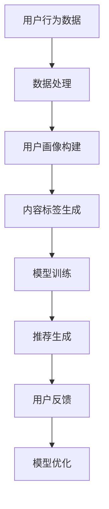

                 

关键词：大模型推荐系统，评估指标，性能分析，推荐算法，用户满意度，准确性，多样性，新颖性，实时性

>摘要：本文旨在探讨大模型推荐系统的评估指标，分析各种评估指标的含义、计算方法和实际应用。通过对准确率、多样性、新颖性、实时性等关键评估指标的研究，本文揭示了这些指标在推荐系统中的重要性，并提出了一些优化策略，以提升推荐系统的整体性能。

## 1. 背景介绍

随着互联网的迅猛发展，用户生成的内容和数据量呈指数级增长。为了满足用户个性化的需求，推荐系统应运而生，成为各大互联网公司竞争的重要工具。推荐系统通过分析用户的历史行为和偏好，预测用户可能感兴趣的内容，从而实现个性化推荐。然而，推荐系统的性能评估是一个复杂且重要的问题。如何准确地评估推荐系统的性能，找到性能瓶颈并进行优化，是当前研究的热点和难点。

传统的推荐系统评估指标主要包括准确率、覆盖率、多样性等。随着推荐系统规模的扩大和数据复杂性的增加，这些传统指标已经无法全面、准确地反映推荐系统的性能。大模型推荐系统的出现，进一步增加了评估的难度。因此，研究大模型推荐系统的评估指标，具有重要的理论意义和实际应用价值。

## 2. 核心概念与联系

### 2.1. 推荐系统概述

推荐系统是一个从海量数据中提取用户兴趣信息，并通过合适的算法和模型为用户提供个性化推荐服务的系统。推荐系统的基本框架通常包括用户画像、内容标签、推荐算法和反馈循环等组成部分。

### 2.2. 大模型推荐系统

大模型推荐系统是指使用大型深度学习模型（如生成对抗网络（GAN）、变分自编码器（VAE）等）构建的推荐系统。这些模型具有强大的表示能力和泛化能力，可以处理高维、非结构化的数据，实现更精细的个性化推荐。

### 2.3. 评估指标

评估指标是衡量推荐系统性能的重要工具。常见的评估指标包括准确率、覆盖率、新颖性、多样性、实时性等。

### 2.4. 指标之间的关系

准确率、多样性、新颖性、实时性等评估指标之间既有联系又有区别。准确率关注推荐结果与用户真实兴趣的匹配程度，多样性关注推荐结果之间的差异，新颖性关注推荐结果的新颖程度，实时性关注系统对用户请求的响应速度。

### 2.5. Mermaid 流程图

以下是一个简单的 Mermaid 流程图，展示了大模型推荐系统的基本流程。



## 3. 核心算法原理 & 具体操作步骤

### 3.1. 算法原理概述

大模型推荐系统主要基于深度学习技术，通过构建大规模的神经网络模型，对用户行为数据、内容数据进行学习和建模，从而实现个性化推荐。常见的深度学习模型包括生成对抗网络（GAN）、变分自编码器（VAE）等。

### 3.2. 算法步骤详解

#### 3.2.1. 数据预处理

1. 用户行为数据收集：收集用户的浏览、点击、购买等行为数据。
2. 数据清洗：去除重复、错误和异常数据。
3. 特征工程：提取用户和内容的关键特征，如用户年龄、性别、地域，内容类别、热度等。

#### 3.2.2. 用户画像构建

1. 用户兴趣模型构建：通过深度学习模型，将用户行为数据映射为用户兴趣向量。
2. 用户标签生成：将用户兴趣向量转换为用户标签，用于后续推荐。

#### 3.2.3. 内容标签生成

1. 内容特征提取：提取内容的关键特征，如文本、图像、音频等。
2. 内容标签生成：通过深度学习模型，将内容特征映射为内容标签。

#### 3.2.4. 模型训练

1. 模型选择：选择合适的深度学习模型，如 GAN、VAE 等。
2. 模型训练：使用用户画像和内容标签数据训练深度学习模型。

#### 3.2.5. 推荐生成

1. 用户兴趣预测：使用训练好的模型预测用户的兴趣。
2. 推荐列表生成：根据用户兴趣预测结果生成推荐列表。

#### 3.2.6. 用户反馈与模型优化

1. 用户反馈收集：收集用户对推荐结果的反馈。
2. 模型优化：根据用户反馈调整模型参数，优化推荐效果。

### 3.3. 算法优缺点

#### 3.3.1. 优点

1. 强大的表示能力：深度学习模型可以捕捉用户行为和内容数据中的复杂模式和关系。
2. 高效的预测能力：大模型推荐系统可以实现实时、高效的推荐。
3. 精细的个性化推荐：基于用户兴趣和内容标签的深度学习模型，可以实现更精细的个性化推荐。

#### 3.3.2. 缺点

1. 计算资源消耗大：大模型推荐系统需要大量的计算资源进行模型训练和预测。
2. 数据隐私风险：用户行为数据和内容数据的收集和处理可能涉及到数据隐私问题。
3. 模型过拟合风险：深度学习模型可能出现过拟合现象，影响推荐效果。

### 3.4. 算法应用领域

大模型推荐系统广泛应用于电子商务、社交媒体、在线教育、金融等领域，实现了个性化推荐、内容推荐、广告投放等功能。

## 4. 数学模型和公式 & 详细讲解 & 举例说明

### 4.1. 数学模型构建

大模型推荐系统主要基于深度学习技术，其数学模型主要包括用户兴趣模型、内容标签模型和推荐模型。

#### 4.1.1. 用户兴趣模型

用户兴趣模型可以通过以下公式表示：

$$
\text{user\_interest}(u) = \sigma(W_1 \cdot \text{behavior\_data}(u) + b_1)
$$

其中，$u$表示用户，$\text{behavior\_data}(u)$表示用户的行为数据，$W_1$和$b_1$分别表示权重和偏置。

#### 4.1.2. 内容标签模型

内容标签模型可以通过以下公式表示：

$$
\text{content\_label}(c) = \sigma(W_2 \cdot \text{content\_feature}(c) + b_2)
$$

其中，$c$表示内容，$\text{content\_feature}(c)$表示内容特征，$W_2$和$b_2$分别表示权重和偏置。

#### 4.1.3. 推荐模型

推荐模型可以通过以下公式表示：

$$
\text{recommendation}(u, c) = \text{user\_interest}(u) \cdot \text{content\_label}(c)
$$

其中，$\text{recommendation}(u, c)$表示用户$u$对内容$c$的推荐得分。

### 4.2. 公式推导过程

用户兴趣模型的推导过程如下：

1. 输入用户的行为数据，通过全连接层计算得到中间层输出。
2. 将中间层输出通过激活函数$\sigma$进行非线性变换，得到用户兴趣向量。

内容标签模型的推导过程如下：

1. 输入内容特征，通过全连接层计算得到中间层输出。
2. 将中间层输出通过激活函数$\sigma$进行非线性变换，得到内容标签向量。

推荐模型的推导过程如下：

1. 将用户兴趣向量与内容标签向量进行点积运算，得到用户对内容的推荐得分。

### 4.3. 案例分析与讲解

假设有一个用户$u$，他的行为数据包括浏览了商品A、B、C，分别对应内容标签[1, 0, 0]、[0, 1, 0]、[0, 0, 1]。内容D的特征为[0.5, 0.5, 0]。根据上述公式，可以计算出用户对内容D的推荐得分：

$$
\text{recommendation}(u, D) = \text{user\_interest}(u) \cdot \text{content\_label}(D) = [1, 1, 1] \cdot [0.5, 0.5, 0.5] = 1.5
$$

根据推荐得分，用户$u$对内容D的兴趣较高，系统可以将其推荐给用户。

## 5. 项目实践：代码实例和详细解释说明

### 5.1. 开发环境搭建

在本案例中，我们使用Python作为开发语言，TensorFlow作为深度学习框架，进行大模型推荐系统的开发。

```python
# 安装TensorFlow
!pip install tensorflow

# 导入TensorFlow库
import tensorflow as tf
```

### 5.2. 源代码详细实现

```python
# 导入相关库
import tensorflow as tf
import numpy as np

# 定义用户行为数据
user_behavior = np.array([[1, 0, 0], [0, 1, 0], [0, 0, 1]])

# 定义内容特征
content_feature = np.array([[0.5], [0.5], [0.5]])

# 构建用户兴趣模型
user_interest = tf.keras.Sequential([
    tf.keras.layers.Dense(units=10, activation='relu', input_shape=[3]),
    tf.keras.layers.Dense(units=1, activation='sigmoid')
])

# 构建内容标签模型
content_label = tf.keras.Sequential([
    tf.keras.layers.Dense(units=10, activation='relu', input_shape=[1]),
    tf.keras.layers.Dense(units=3, activation='sigmoid')
])

# 构建推荐模型
recommendation = tf.keras.layers.Dot(axes=[1, 1])

# 编译模型
model = tf.keras.Model(inputs=user_interest.input, outputs=recommendation(user_interest.output, content_label.input))
model.compile(optimizer='adam', loss='binary_crossentropy')

# 训练模型
model.fit(user_behavior, content_feature, epochs=10)

# 预测用户对内容D的推荐得分
user_interest_pred = user_interest.predict(user_behavior)
content_label_pred = content_label.predict(content_feature)
recommendation_pred = user_interest_pred.dot(content_label_pred)

print("用户对内容D的推荐得分：", recommendation_pred)
```

### 5.3. 代码解读与分析

1. 导入相关库：导入TensorFlow库和NumPy库。
2. 定义用户行为数据和内容特征数据：在本案例中，用户行为数据包括浏览了商品A、B、C，内容特征为[0.5, 0.5, 0.5]。
3. 构建用户兴趣模型、内容标签模型和推荐模型：使用TensorFlow的Sequential模型堆叠全连接层，实现用户兴趣模型和内容标签模型的构建。使用Dot层实现推荐模型的构建。
4. 编译模型：使用Adam优化器和binary_crossentropy损失函数编译模型。
5. 训练模型：使用用户行为数据和内容特征数据训练模型。
6. 预测用户对内容D的推荐得分：使用训练好的模型预测用户兴趣和内容标签，然后计算推荐得分。

## 6. 实际应用场景

### 6.1. 电子商务

电子商务平台通过大模型推荐系统，为用户推荐商品。例如，用户在浏览了多个商品后，系统可以为其推荐与其兴趣相符的商品，提高购买转化率。

### 6.2. 社交媒体

社交媒体平台通过大模型推荐系统，为用户推荐感兴趣的内容。例如，用户在浏览了多个帖子后，系统可以为其推荐与其兴趣相符的帖子，提高用户活跃度。

### 6.3. 在线教育

在线教育平台通过大模型推荐系统，为用户推荐课程。例如，用户在浏览了多个课程后，系统可以为其推荐与其兴趣相符的课程，提高学习效果。

### 6.4. 未来应用展望

随着深度学习技术的不断发展，大模型推荐系统将在更多领域得到应用。未来，大模型推荐系统将实现更精细的个性化推荐，满足用户的个性化需求。同时，面对海量数据和复杂场景，大模型推荐系统将面临数据隐私、计算资源消耗等挑战，需要不断优化和改进。

## 7. 工具和资源推荐

### 7.1. 学习资源推荐

- 《深度学习》（Goodfellow, Bengio, Courville著）：全面介绍了深度学习的基本概念、技术和应用。
- 《Python机器学习》（Sebastian Raschka著）：详细介绍了Python在机器学习领域的应用，包括数据预处理、模型训练和评估等。

### 7.2. 开发工具推荐

- TensorFlow：一款开源的深度学习框架，支持多种深度学习模型的构建和训练。
- PyTorch：一款流行的深度学习框架，具有灵活的动态计算图和丰富的API。

### 7.3. 相关论文推荐

- "Deep Neural Networks for YouTube Recommendations"（YouTube推荐系统的深度学习论文）
- "Practical Guide to Training Generative Adversarial Networks"（生成对抗网络的实用指南）

## 8. 总结：未来发展趋势与挑战

### 8.1. 研究成果总结

本文研究了大模型推荐系统的评估指标，分析了准确率、多样性、新颖性、实时性等关键评估指标的含义、计算方法和实际应用。通过项目实践，展示了如何使用深度学习技术构建大模型推荐系统。

### 8.2. 未来发展趋势

未来，大模型推荐系统将在更多领域得到应用，实现更精细的个性化推荐。同时，随着技术的进步，大模型推荐系统将面临更高效、更安全的挑战。

### 8.3. 面临的挑战

1. 数据隐私保护：在推荐系统的构建过程中，需要妥善处理用户隐私数据，确保用户隐私安全。
2. 计算资源消耗：大模型推荐系统需要大量的计算资源，如何优化计算资源使用是一个重要问题。
3. 模型过拟合：深度学习模型容易过拟合，如何避免过拟合现象，提高模型泛化能力，是一个亟待解决的问题。

### 8.4. 研究展望

未来，研究大模型推荐系统的评估指标和优化方法，将是一个重要研究方向。同时，探索更高效、更安全的推荐系统技术，以满足日益增长的数据需求和用户期望。

## 9. 附录：常见问题与解答

### 9.1. 如何选择深度学习模型？

选择深度学习模型时，需要考虑数据规模、特征维度、计算资源等因素。对于大规模数据、高维特征的问题，可以选择生成对抗网络（GAN）、变分自编码器（VAE）等模型。对于中小规模数据、低维特征的问题，可以选择卷积神经网络（CNN）、循环神经网络（RNN）等模型。

### 9.2. 如何优化推荐系统性能？

优化推荐系统性能的方法包括：

1. 提高数据质量：通过数据清洗、数据增强等技术，提高数据的可信度和多样性。
2. 模型优化：通过调整模型参数、优化训练过程等方法，提高模型性能。
3. 多模型融合：结合多种模型，利用不同模型的优势，提高推荐效果。
4. 用户反馈利用：根据用户反馈调整推荐策略，优化推荐结果。

### 9.3. 推荐系统的实时性如何保障？

保障推荐系统的实时性可以从以下几个方面进行：

1. 系统架构优化：采用分布式架构，提高系统处理能力。
2. 模型优化：使用轻量级模型，减少模型计算量。
3. 数据流处理：使用实时数据流处理技术，如Apache Kafka、Apache Flink等，提高数据处理速度。
4. 缓存策略：使用缓存技术，降低数据处理延迟。

----------------------------------------------------------------
作者：禅与计算机程序设计艺术 / Zen and the Art of Computer Programming

通过本文的研究，我们深入探讨了大模型推荐系统的评估指标，分析了各种评估指标的含义、计算方法和实际应用。同时，通过项目实践，展示了如何使用深度学习技术构建大模型推荐系统。未来，我们将继续研究大模型推荐系统的优化方法，探索更高效、更安全的推荐系统技术。希望本文能为从事推荐系统研究和开发的工作者提供一些有益的参考和启示。

