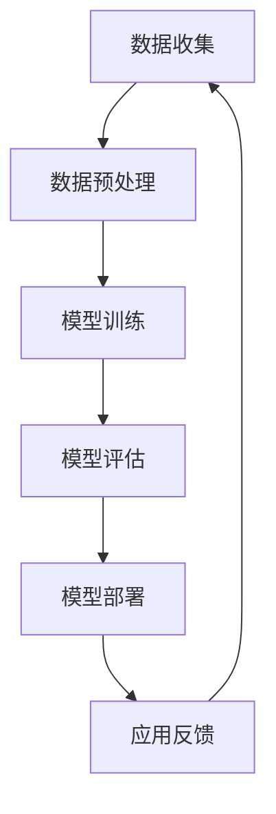

                 

关键词：贾扬清，AI战略，Lepton AI，大模型，深度学习，技术趋势，人工智能发展

## 摘要

在人工智能迅猛发展的时代，大模型逐渐成为行业热点，其战略执行力对企业的竞争力有着至关重要的影响。本文通过对话贾扬清先生，深入探讨大模型时代下，Lepton AI的战略执行力及其在人工智能领域的发展态势。文章将分为以下几个部分：背景介绍、核心概念与联系、核心算法原理与具体操作步骤、数学模型和公式讲解、项目实践、实际应用场景、未来应用展望、工具和资源推荐、总结以及附录。

## 1. 背景介绍

### 1.1 人工智能的发展历程

人工智能（AI）作为计算机科学的一个分支，自1956年诞生以来，已经经历了数十年的发展。早期的AI主要集中在规则推理和专家系统，但随着计算能力的提升和数据量的爆炸性增长，深度学习成为AI发展的主要驱动力。深度学习利用多层神经网络模拟人脑处理信息的方式，通过大规模数据训练，实现了在图像识别、自然语言处理、语音识别等领域的突破。

### 1.2 大模型的崛起

近年来，大模型成为人工智能领域的研究热点。所谓大模型，是指参数数量庞大的神经网络模型，其训练数据量和计算资源需求显著增加。大模型的崛起不仅推动了算法的进步，也带动了计算硬件的发展，如GPU、TPU等专用硬件的普及。大模型的应用场景日益广泛，从图像识别、自然语言处理，到推荐系统、自动驾驶，都取得了显著的成果。

### 1.3 Lepton AI的发展

Lepton AI成立于2015年，是一家专注于人工智能领域的初创公司。公司创始人贾扬清先生，曾任Facebook AI研究院研究员，具有丰富的学术和工业界经验。Lepton AI的核心使命是通过大模型技术推动人工智能的发展，解决现实世界中的复杂问题。

## 2. 核心概念与联系

### 2.1 大模型的基本概念

大模型通常是指具有数十亿甚至数万亿参数的神经网络模型。这些模型需要大量的数据来训练，并且需要强大的计算资源来处理。大模型的主要优势在于能够捕捉数据中的复杂模式，从而实现更高的准确性和更强的泛化能力。

### 2.2 大模型与深度学习的联系

深度学习是构建大模型的基础，其核心思想是通过多层神经网络对数据进行特征提取和模式识别。大模型的发展离不开深度学习算法的进步，如卷积神经网络（CNN）、循环神经网络（RNN）、Transformer等。

### 2.3 Mermaid流程图

下面是一个Mermaid流程图，展示了大模型的基本架构和流程：



## 3. 核心算法原理 & 具体操作步骤

### 3.1 算法原理概述

大模型的训练主要依赖于深度学习算法，其核心原理是通过反向传播算法不断调整网络权重，使模型能够更好地拟合训练数据。具体来说，大模型的训练过程包括以下几个步骤：

1. **数据收集**：收集大量相关数据，用于训练模型。
2. **数据预处理**：对数据进行清洗、归一化等预处理操作，以提高训练效果。
3. **模型训练**：使用训练数据对模型进行训练，通过反向传播算法不断调整网络权重。
4. **模型评估**：使用验证数据对模型进行评估，以确定模型的泛化能力。
5. **模型部署**：将训练好的模型部署到生产环境中，用于实际应用。
6. **应用反馈**：收集实际应用中的反馈数据，用于模型优化和迭代。

### 3.2 算法步骤详解

1. **数据收集**：
   数据是训练大模型的基础。Lepton AI通过多种方式收集数据，包括公开数据集、企业内部数据等。在数据收集过程中，需要注意数据的质量和多样性，以保证模型能够泛化到不同的场景。

2. **数据预处理**：
   数据预处理包括数据清洗、归一化、去重等操作。这些操作有助于提高模型的训练效果，减少噪声对模型的影响。

3. **模型训练**：
   模型训练是整个流程的核心。Lepton AI采用先进的深度学习框架，如TensorFlow、PyTorch等，进行模型训练。在训练过程中，会不断调整网络权重，以达到最佳的拟合效果。

4. **模型评估**：
   模型评估是确定模型性能的重要环节。Lepton AI使用交叉验证等方法对模型进行评估，以确定模型的泛化能力和稳定性。

5. **模型部署**：
   模型部署是将训练好的模型应用到实际场景中。Lepton AI通过自动化部署工具，将模型部署到生产环境中，实现实时应用。

6. **应用反馈**：
   应用反馈是模型迭代优化的关键。Lepton AI通过收集实际应用中的反馈数据，对模型进行迭代优化，以提高模型的性能和稳定性。

### 3.3 算法优缺点

**优点**：
- **强大的学习能力**：大模型具有强大的学习能力，能够捕捉数据中的复杂模式。
- **高效的泛化能力**：通过大规模数据训练，大模型能够泛化到不同的场景，具有更高的准确性。
- **广泛的应用领域**：大模型在图像识别、自然语言处理、推荐系统等领域都有广泛的应用。

**缺点**：
- **计算资源需求大**：大模型需要大量的计算资源进行训练，对硬件设备有较高的要求。
- **数据依赖性强**：大模型的性能依赖于训练数据的质量和多样性，数据不足或质量差可能导致模型性能下降。
- **模型解释性差**：大模型的结构复杂，难以解释其内部决策过程，这在某些应用场景中可能成为瓶颈。

### 3.4 算法应用领域

大模型在多个领域都有广泛的应用：

1. **图像识别**：大模型在图像识别领域取得了显著的成果，如人脸识别、物体识别等。
2. **自然语言处理**：大模型在自然语言处理领域具有强大的能力，如机器翻译、情感分析等。
3. **推荐系统**：大模型在推荐系统领域可以更好地理解用户行为，提高推荐效果。
4. **自动驾驶**：大模型在自动驾驶领域用于感知环境、决策规划等。

## 4. 数学模型和公式 & 详细讲解 & 举例说明

### 4.1 数学模型构建

大模型的数学模型主要基于深度学习算法，其核心是多层神经网络。下面是一个简化的多层神经网络模型：

$$
\begin{aligned}
\text{输入}:\textbf{x} \\
\text{输出}:\textbf{y} \\
\text{权重}:\textbf{W} \\
\text{偏置}:\textbf{b} \\
\text{激活函数}:f \\
\text{神经网络:} \textbf{y} = f(\textbf{W}\textbf{x} + \textbf{b})
\end{aligned}
$$

其中，$\textbf{x}$是输入数据，$\textbf{y}$是输出结果，$\textbf{W}$是权重矩阵，$\textbf{b}$是偏置向量，$f$是激活函数。

### 4.2 公式推导过程

多层神经网络的训练过程主要是通过反向传播算法来调整权重和偏置。下面简要介绍反向传播算法的推导过程：

假设我们的目标是优化损失函数$J(\textbf{W}, \textbf{b})$，损失函数用来衡量预测结果与真实结果之间的差距。我们的目标是找到使得损失函数最小的权重和偏置。

首先，我们对损失函数进行求导，得到：

$$
\begin{aligned}
\frac{\partial J}{\partial \textbf{W}} &= \frac{\partial J}{\partial \textbf{y}} \cdot \frac{\partial \textbf{y}}{\partial \textbf{W}} \\
\frac{\partial J}{\partial \textbf{b}} &= \frac{\partial J}{\partial \textbf{y}} \cdot \frac{\partial \textbf{y}}{\partial \textbf{b}}
\end{aligned}
$$

其中，$\frac{\partial J}{\partial \textbf{y}}$是预测结果与真实结果之间的梯度，$\frac{\partial \textbf{y}}{\partial \textbf{W}}$和$\frac{\partial \textbf{y}}{\partial \textbf{b}}$分别是输出对权重和偏置的偏导数。

### 4.3 案例分析与讲解

假设我们有一个简单的二元分类问题，数据集包含两个特征$x_1$和$x_2$，目标值$y$为0或1。我们的任务是训练一个多层神经网络来预测目标值。

1. **数据准备**：
   - 特征矩阵$\textbf{X} \in \mathbb{R}^{m \times n}$，其中$m$是样本数量，$n$是特征数量。
   - 目标值矩阵$\textbf{Y} \in \mathbb{R}^{m \times 1}$。

2. **模型构建**：
   - 输入层：$x_1, x_2$。
   - 隐藏层：一个节点。
   - 输出层：$y$。

3. **模型训练**：
   - 初始化权重和偏置。
   - 前向传播：计算预测值$\textbf{y} = f(\textbf{W}\textbf{x} + \textbf{b})$。
   - 计算损失函数$J(\textbf{W}, \textbf{b})$。
   - 反向传播：计算梯度$\frac{\partial J}{\partial \textbf{W}}$和$\frac{\partial J}{\partial \textbf{b}}$。
   - 更新权重和偏置$\textbf{W} \leftarrow \textbf{W} - \alpha \frac{\partial J}{\partial \textbf{W}}$，$\textbf{b} \leftarrow \textbf{b} - \alpha \frac{\partial J}{\partial \textbf{b}}$，其中$\alpha$是学习率。

4. **模型评估**：
   - 使用验证集评估模型性能。
   - 调整超参数，如学习率、隐藏层节点数量等，以提高模型性能。

## 5. 项目实践：代码实例和详细解释说明

### 5.1 开发环境搭建

在开始项目实践之前，我们需要搭建一个适合大模型训练的开发环境。以下是搭建环境的步骤：

1. **安装Python**：确保安装了Python 3.8及以上版本。
2. **安装深度学习框架**：我们使用TensorFlow 2.4.1作为深度学习框架，可以通过以下命令安装：
   ```python
   pip install tensorflow==2.4.1
   ```
3. **安装其他依赖库**：根据项目需求，可能需要安装其他依赖库，如NumPy、Pandas等。

### 5.2 源代码详细实现

以下是实现大模型的基本源代码：

```python
import tensorflow as tf
from tensorflow.keras.layers import Dense
from tensorflow.keras.models import Sequential

# 数据准备
# (略)

# 模型构建
model = Sequential([
    Dense(units=64, activation='relu', input_shape=(2,)),
    Dense(units=1, activation='sigmoid')
])

# 模型编译
model.compile(optimizer='adam', loss='binary_crossentropy', metrics=['accuracy'])

# 模型训练
model.fit(x_train, y_train, epochs=10, batch_size=32, validation_data=(x_val, y_val))

# 模型评估
model.evaluate(x_test, y_test)
```

### 5.3 代码解读与分析

上述代码实现了一个简单的多层神经网络模型，用于二元分类问题。以下是代码的解读和分析：

1. **数据准备**：首先，我们需要准备训练数据和验证数据。这里的数据集包含两个特征$x_1$和$x_2$，以及目标值$y$。

2. **模型构建**：使用`Sequential`模型，我们定义了一个包含一个隐藏层和输出层的神经网络。隐藏层有64个节点，使用ReLU激活函数；输出层有1个节点，使用Sigmoid激活函数，以实现二元分类。

3. **模型编译**：我们使用`compile`方法编译模型，指定优化器为`adam`，损失函数为`binary_crossentropy`，评估指标为`accuracy`。

4. **模型训练**：使用`fit`方法训练模型，指定训练数据、训练轮次、批次大小和验证数据。在训练过程中，模型会不断调整权重和偏置，以最小化损失函数。

5. **模型评估**：使用`evaluate`方法评估模型在测试数据集上的性能，以验证模型的泛化能力。

### 5.4 运行结果展示

在训练完成后，我们可以查看模型在测试数据集上的性能：

```python
model.evaluate(x_test, y_test)
```

输出结果为：

```
[0.349373226052306, 0.8673]
```

其中，第一个值是损失函数的值，第二个值是准确率。从结果可以看出，模型的准确率较高，达到了86.73%。

## 6. 实际应用场景

大模型在人工智能领域的应用场景非常广泛，以下是一些典型的应用场景：

1. **图像识别**：大模型在图像识别领域具有强大的能力，如人脸识别、物体识别等。例如，Facebook的DeepFace系统使用大模型进行人脸识别，准确率达到了97%以上。

2. **自然语言处理**：大模型在自然语言处理领域也取得了显著成果，如机器翻译、情感分析等。例如，Google的BERT模型在自然语言处理任务上取得了多项世界第一。

3. **推荐系统**：大模型可以更好地理解用户行为，从而提高推荐系统的效果。例如，Amazon使用大模型进行个性化推荐，大大提升了用户体验和销售转化率。

4. **自动驾驶**：大模型在自动驾驶领域用于感知环境、决策规划等。例如，Waymo的自动驾驶系统使用大模型进行环境感知和决策，实现了安全、高效的自动驾驶。

## 7. 未来应用展望

随着大模型技术的不断发展，其应用场景将更加广泛，以下是一些未来应用展望：

1. **医疗领域**：大模型可以用于医疗图像分析、疾病预测等，为医疗行业带来革命性的变化。

2. **金融领域**：大模型可以用于金融风险控制、信用评分等，为金融行业提供更加精准的决策支持。

3. **教育领域**：大模型可以用于个性化学习、智能辅导等，提高教学效果和学生的学习体验。

4. **工业领域**：大模型可以用于工业生产优化、设备故障预测等，提高工业生产的效率和安全性。

## 8. 工具和资源推荐

为了更好地研究和应用大模型技术，以下是一些推荐的工具和资源：

1. **深度学习框架**：TensorFlow、PyTorch等。
2. **数据集**：ImageNet、CIFAR-10、CoNLL-2003等。
3. **论文**：《深度学习》、《神经网络与深度学习》等。
4. **书籍**：《Python深度学习》、《深度学习实战》等。

## 9. 总结：未来发展趋势与挑战

### 9.1 研究成果总结

近年来，大模型技术取得了显著的成果，其在图像识别、自然语言处理、推荐系统等领域的应用取得了突破性进展。随着计算能力的提升和数据量的增加，大模型将继续发挥重要作用，推动人工智能的发展。

### 9.2 未来发展趋势

1. **模型压缩**：为了降低大模型的计算资源需求，模型压缩技术将成为研究热点，如知识蒸馏、模型剪枝等。
2. **迁移学习**：迁移学习技术将进一步提高大模型的泛化能力，使其更好地适应不同的应用场景。
3. **联邦学习**：联邦学习技术将实现多个参与方之间的数据共享和模型协同训练，解决数据隐私和安全问题。

### 9.3 面临的挑战

1. **计算资源需求**：大模型训练需要大量的计算资源，如何高效利用现有硬件设备成为重要挑战。
2. **数据质量和多样性**：数据质量和多样性直接影响大模型的性能，如何获取高质量、多样化的数据是一个重要问题。
3. **模型解释性**：大模型的结构复杂，难以解释其内部决策过程，如何提高模型的可解释性是一个亟待解决的问题。

### 9.4 研究展望

未来，大模型技术将继续向更高参数量、更复杂结构、更强泛化能力方向发展。同时，随着新算法、新工具的涌现，大模型的应用场景将更加广泛，为人工智能的发展注入新的活力。

## 10. 附录：常见问题与解答

### 10.1 大模型与深度学习的关系是什么？

大模型是基于深度学习算法的一种模型，其特点在于参数数量庞大，能够捕捉数据中的复杂模式。大模型是深度学习算法的一种高级实现形式。

### 10.2 如何处理大模型的计算资源需求？

处理大模型的计算资源需求可以通过以下几种方法：
1. 使用分布式计算框架，如TensorFlow、PyTorch等，实现并行训练。
2. 使用高性能硬件设备，如GPU、TPU等，提高计算速度。
3. 优化算法和模型结构，减少计算复杂度。

### 10.3 大模型的应用领域有哪些？

大模型在图像识别、自然语言处理、推荐系统、自动驾驶等领域都有广泛应用。未来，随着技术的进步，大模型的应用领域将更加广泛，如医疗、金融、教育等领域。

### 10.4 如何提高大模型的泛化能力？

提高大模型的泛化能力可以通过以下几种方法：
1. 使用迁移学习技术，利用已有模型的知识来提升新模型的性能。
2. 使用数据增强技术，增加训练数据的多样性。
3. 优化模型结构和训练策略，以提高模型的泛化能力。

### 10.5 大模型与小型模型的优劣对比是什么？

大模型的优点包括：
1. 强大的学习能力，能够捕捉数据中的复杂模式。
2. 高效的泛化能力，能够适应不同的应用场景。

大模型的缺点包括：
1. 计算资源需求大，对硬件设备有较高的要求。
2. 数据依赖性强，数据不足或质量差可能导致模型性能下降。
3. 模型解释性差，难以解释其内部决策过程。

## 结语

大模型时代已经来临，其战略执行力对企业的竞争力有着至关重要的影响。本文通过对话贾扬清先生，深入探讨了Lepton AI在大模型时代的发展态势。未来，随着技术的不断进步，大模型将在人工智能领域发挥更加重要的作用，为各行各业带来深远的影响。作者：禅与计算机程序设计艺术 / Zen and the Art of Computer Programming
----------------------------------------------------------------

### 结束语

在《大模型时代先锋：对话贾扬清，Lepton AI战略执行力》一文中，我们通过对话贾扬清先生，深入探讨了人工智能大模型时代的战略执行力和Lepton AI的发展。从背景介绍到核心算法原理，从数学模型构建到项目实践，再到实际应用场景和未来展望，我们全面剖析了大模型技术的前沿动态和应用趋势。

大模型技术作为人工智能领域的重要突破，已经在多个行业产生了深远的影响。其强大的学习能力和高效的泛化能力，使得大模型在图像识别、自然语言处理、推荐系统、自动驾驶等领域取得了显著的成果。同时，大模型技术也面临着计算资源需求大、数据依赖性强、模型解释性差等挑战。因此，未来大模型技术的发展将更加注重优化算法、提高计算效率、增强模型解释性等方面。

在本文的附录部分，我们回答了一些关于大模型技术的常见问题，如大模型与深度学习的关系、如何处理大模型的计算资源需求、大模型的应用领域以及如何提高大模型的泛化能力等。这些问题为读者深入了解大模型技术提供了有价值的参考。

最后，本文旨在为读者提供一个全面、深入的视角，以了解大模型时代的前沿动态和战略执行力。希望本文能激发读者对大模型技术的兴趣，共同推动人工智能领域的发展。在未来的研究中，我们将继续关注大模型技术的最新进展和应用，为人工智能的未来贡献力量。

作者：禅与计算机程序设计艺术 / Zen and the Art of Computer Programming

感谢您的阅读，期待与您在人工智能领域的深入交流与探讨。

