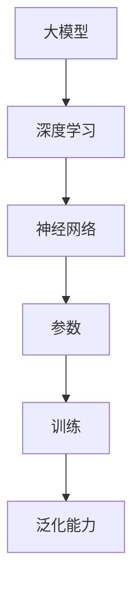

                 

### 背景介绍

人工智能（AI）作为近年来科技领域的明星，正在以惊人的速度发展。随着计算能力的提升、大数据的积累和算法的进步，尤其是大模型的兴起，AI技术正在进入一个全新的时代。大模型，如GPT-3、BERT等，具有前所未有的计算能力和表现力，能够处理复杂的任务，提供高质量的输出。这种技术进步为创业者带来了前所未有的机会，同时也提出了新的挑战。

AI创业产品的机会主要体现在以下几个方面：

1. **自动化与效率提升**：AI可以帮助企业自动化重复性任务，提升工作效率，减少人力成本。例如，智能客服、自动化数据分析等。

2. **个性化体验**：大模型能够处理大量的用户数据，实现高度个性化的服务和产品推荐，从而提升用户体验和用户粘性。

3. **创新应用场景**：AI技术可以应用于医疗、金融、教育、制造等多个行业，创造出全新的商业模式和应用场景。

4. **数据驱动决策**：通过AI技术，企业可以获得更为准确和深入的数据分析，从而做出更为明智的商业决策。

本文将深入探讨大模型时代下的AI创业产品机会，包括核心概念、算法原理、应用实践、未来展望等方面，为读者提供一份全面的指南。

## 1.1 大模型时代的前景

随着深度学习技术的成熟，大模型时代已经到来。这些大模型不仅具有巨大的参数量，还能够处理复杂的任务，展现出强大的泛化能力和表现力。例如，GPT-3拥有1750亿个参数，可以在多种语言和任务中表现出色。这种技术进步为AI创业提供了广阔的前景。

首先，大模型使得AI在自动化与效率提升方面更具优势。传统的AI系统往往需要针对特定任务进行定制化开发，而大模型可以通用地处理多种任务，从而减少开发时间和成本。这对于初创企业来说，是一个极大的利好。

其次，大模型的应用不再局限于技术领域，而是逐步渗透到各行各业。在医疗领域，AI可以帮助医生进行诊断和治疗建议；在金融领域，AI可以用于风险管理、信用评分等；在教育领域，AI可以提供个性化教学和学习路径。这些应用场景的多样性为AI创业提供了丰富的机会。

此外，大模型时代也带来了数据隐私和安全性的挑战。随着模型对用户数据的依赖增加，如何保护用户隐私成为一个关键问题。这对于创业者来说，是一个需要认真考虑和解决的问题。

总之，大模型时代为AI创业带来了前所未有的机会和挑战。创业者需要抓住这个时代的机会，同时也需要应对其中可能出现的风险和问题。

## 1.2 大模型的核心概念与联系

在大模型时代，了解其核心概念和相互联系是至关重要的。以下将详细解释大模型的基本概念及其与深度学习、神经网络的关系。

### 1.2.1 大模型的基本概念

**大模型**：通常指的是具有数十亿甚至数千亿个参数的神经网络模型。这些模型通过学习大量的数据来获得强大的表示能力和泛化能力。例如，GPT-3模型拥有1750亿个参数，能够处理自然语言处理（NLP）等复杂任务。

**参数**：神经网络中的参数是模型的重要构成部分。每一个参数都代表了模型对输入数据的某种映射关系。在大模型中，参数的数量极其庞大，这使得模型能够捕捉到复杂的模式和信息。

**训练**：大模型的训练是一个通过大量数据不断调整参数的过程。在这个过程中，模型通过反向传播算法优化参数，使得模型对训练数据的拟合度不断提高。

**泛化能力**：泛化能力指的是模型在未见过数据上的表现。大模型通过学习大量数据，能够形成通用的表示，从而在新的任务和数据集上表现出良好的性能。

### 1.2.2 大模型与深度学习的关系

**深度学习**：深度学习是人工智能的一种方法，通过多层神经网络来学习数据的复杂表示。深度学习的关键在于其多层结构，每一层都能提取不同层次的特征。大模型作为深度学习的一种极端形式，其多层网络结构使得模型能够处理更复杂的任务。

**优势**：深度学习的优势在于其强大的表示能力和高效的计算性能。通过多层网络的堆叠，模型可以逐步提取输入数据的低级特征，并逐步构建起高层次的抽象表示。

**挑战**：尽管深度学习在许多任务上取得了显著的成果，但其也存在一定的局限性。例如，模型的训练过程需要大量的数据和计算资源，而且模型的解释性较差，难以理解其决策过程。

### 1.2.3 大模型与神经网络的关系

**神经网络**：神经网络是构成深度学习的基础单元，由多个神经元（或节点）通过加权连接形成。每个神经元都接受来自前一层神经元的输入，并通过激活函数产生输出。

**优势**：神经网络能够通过学习调整权重，从而适应不同的数据分布和任务需求。在大模型中，神经网络的权重调整过程至关重要，它决定了模型的性能和泛化能力。

**挑战**：神经网络的训练过程通常非常耗时，尤其是大模型。此外，模型的可解释性也是一个挑战，因为神经网络的决策过程往往难以直观理解。

### 1.2.4 Mermaid 流程图

为了更直观地展示大模型的基本概念和联系，以下是一个Mermaid流程图示例：



通过这个流程图，我们可以清晰地看到大模型、深度学习、神经网络、参数、训练和泛化能力之间的联系。

### 1.3 大模型的算法原理

大模型的算法原理是其强大性能的核心所在。以下将详细介绍大模型的算法原理，包括其基本步骤和操作细节。

#### 1.3.1 基本步骤

1. **数据预处理**：在训练大模型之前，首先需要对数据进行预处理。这包括数据清洗、数据转换和数据归一化等步骤。预处理的目标是确保数据质量，使其适合模型训练。

2. **模型构建**：构建大模型通常涉及定义网络的架构、设置参数的初始化策略等。常用的神经网络架构包括卷积神经网络（CNN）、循环神经网络（RNN）和变换器（Transformer）等。

3. **训练**：大模型的训练是通过迭代更新模型参数来实现的。训练过程中，模型通过反向传播算法不断优化参数，使其在训练数据上的表现不断提高。

4. **评估**：在训练完成后，需要对模型进行评估，以检查其泛化能力和性能。常用的评估指标包括准确率、召回率、F1分数等。

5. **调整**：根据评估结果，可能需要对模型进行调整，以进一步提升其性能。调整过程包括修改网络架构、调整参数设置等。

#### 1.3.2 操作细节

1. **数据预处理**：

   - **数据清洗**：去除数据中的噪声和错误。
   - **数据转换**：将数据转换为适合模型训练的格式。
   - **数据归一化**：将数据缩放到相同的范围，以减少模型训练时的计算复杂度。

2. **模型构建**：

   - **网络架构**：选择合适的神经网络架构，如CNN、RNN或Transformer。
   - **参数初始化**：设置模型的初始参数，常用的方法有随机初始化、高斯分布初始化等。

3. **训练**：

   - **数据批量**：将数据划分为多个批量，每次训练一个批量。
   - **前向传播**：计算输入数据在模型中的输出。
   - **损失函数**：计算模型输出与真实值之间的差距，常用的损失函数有均方误差（MSE）、交叉熵损失等。
   - **反向传播**：通过反向传播算法更新模型参数。

4. **评估**：

   - **测试集**：使用未参与训练的数据集对模型进行评估。
   - **指标计算**：计算模型的性能指标，如准确率、召回率、F1分数等。

5. **调整**：

   - **模型优化**：通过调整网络架构、参数设置等优化模型性能。
   - **超参数调整**：调整学习率、批量大小等超参数，以获得更好的训练效果。

### 1.4 大模型的优缺点

#### 优点

1. **强大的表示能力**：大模型通过学习大量数据，能够捕捉到复杂的模式和特征，从而在多种任务上表现出色。

2. **高效的泛化能力**：大模型具有很好的泛化能力，能够在未见过数据上保持较高的性能。

3. **适应多种任务**：大模型可以通用地处理多种任务，无需为每个任务定制化开发，从而减少开发时间和成本。

#### 缺点

1. **计算资源需求大**：大模型的训练需要大量的计算资源，包括GPU、TPU等。

2. **数据依赖性强**：大模型对训练数据的质量和数量有较高要求，数据不足或质量差可能导致模型性能下降。

3. **可解释性差**：大模型的决策过程往往难以解释，难以理解其工作原理。

### 1.5 大模型的应用领域

大模型在多个领域展现出了卓越的应用前景。以下将介绍大模型在自然语言处理（NLP）、计算机视觉（CV）和语音识别（ASR）等领域的具体应用。

#### 1.5.1 自然语言处理（NLP）

自然语言处理是人工智能的一个重要分支，大模型在NLP中的应用取得了显著成果。例如，GPT-3模型在文本生成、机器翻译、问答系统等领域表现出色。具体应用包括：

1. **文本生成**：大模型可以生成高质量的文本，如文章、故事等。这对于内容创作者和媒体行业具有重要意义。
2. **机器翻译**：大模型可以自动翻译不同语言之间的文本，提高翻译的准确性和流畅性。
3. **问答系统**：大模型可以理解用户的问题，并生成相应的答案，广泛应用于客服、教育等领域。

#### 1.5.2 计算机视觉（CV）

计算机视觉是另一个受益于大模型的重要领域。大模型在图像识别、目标检测、图像生成等方面表现突出。具体应用包括：

1. **图像识别**：大模型可以准确识别图像中的对象和场景，广泛应用于安防、医疗、零售等行业。
2. **目标检测**：大模型可以检测图像中的多个目标，并标注其位置和类别，应用于自动驾驶、无人机等领域。
3. **图像生成**：大模型可以生成逼真的图像，应用于艺术创作、游戏开发等领域。

#### 1.5.3 语音识别（ASR）

语音识别是将语音信号转换为文本的技术。大模型在语音识别领域也取得了显著进展。具体应用包括：

1. **语音助手**：大模型可以理解用户的语音指令，并执行相应的操作，如智能音箱、智能助手等。
2. **语音翻译**：大模型可以实时翻译不同语言之间的语音，促进跨语言沟通。
3. **语音识别系统**：大模型可以应用于电话客服、语音搜索等领域，提高用户体验和效率。

总之，大模型在自然语言处理、计算机视觉和语音识别等领域具有广泛的应用前景，为各个行业带来了新的机遇和挑战。

## 2. 数学模型和公式

大模型背后的数学原理是理解其强大性能的关键。以下将详细讲解大模型中常用的数学模型和公式，并举例说明。

### 2.1 数学模型构建

大模型的数学模型主要由以下几个部分构成：

1. **输入层**：接收外部输入，如文本、图像或声音等。
2. **隐藏层**：对输入数据进行特征提取和变换，通常包含多层。
3. **输出层**：生成模型预测结果。

### 2.2 公式推导过程

以下是一个简化的前馈神经网络（Feedforward Neural Network）的推导过程：

1. **输入层到隐藏层的转换**：

   每个神经元接收来自输入层的输入，并应用一个非线性激活函数。假设有 $n$ 个输入特征，第 $i$ 层第 $j$ 个神经元的输出可以表示为：

   $$ z_j^{(i)} = \sum_{k=1}^{n} w_{jk}^{(i)} x_k + b_j^{(i)} $$

   其中，$x_k$ 是输入特征，$w_{jk}^{(i)}$ 是权重，$b_j^{(i)}$ 是偏置。$z_j^{(i)}$ 是线性组合的结果。

2. **激活函数**：

   激活函数将线性组合的结果转化为一个非线性值，常用的激活函数有 sigmoid、ReLU 等。

   $$ a_j^{(i)} = \sigma(z_j^{(i)}) $$

   其中，$\sigma$ 表示激活函数。

3. **隐藏层到输出层的转换**：

   输出层的神经元同样接收来自隐藏层的输入，并应用激活函数。输出层的预测结果可以表示为：

   $$ y = \sigma(z_y^{(L)}) $$

   其中，$z_y^{(L)}$ 是输出层的线性组合结果，$L$ 表示总层数。

### 2.3 案例分析与讲解

以下是一个简单的案例，说明如何使用上述数学模型进行图像分类。

#### 案例背景

假设我们有一个图像分类任务，需要将图像分为猫和狗两类。我们有 $1000$ 张训练图像，每张图像包含 $784$ 个像素值。

#### 案例步骤

1. **数据预处理**：

   - 将图像像素值缩放到 $0$ 到 $1$ 的范围。
   - 将标签转换为二进制向量，如猫标签为 `[1, 0]`，狗标签为 `[0, 1]`。

2. **模型构建**：

   - 输入层：784 个神经元。
   - 隐藏层：100 个神经元。
   - 输出层：2 个神经元。

3. **训练**：

   - 使用反向传播算法训练模型，优化权重和偏置。
   - 每个训练图像都经过前向传播和反向传播，更新模型参数。

4. **评估**：

   - 使用测试集评估模型性能，计算准确率、召回率等指标。

### 2.4 公式推导示例

以下是一个简化的公式推导示例，展示如何使用梯度下降（Gradient Descent）算法优化神经网络权重。

1. **损失函数**：

   假设我们的损失函数为均方误差（MSE），即：

   $$ J(\theta) = \frac{1}{2m} \sum_{i=1}^{m} (h_{\theta}(x^{(i)}) - y^{(i)})^2 $$

   其中，$h_{\theta}(x^{(i)})$ 是模型预测值，$y^{(i)}$ 是真实值，$m$ 是训练样本数量。

2. **前向传播**：

   - 计算每个神经元的输入和输出。
   - 计算输出层的预测值。

3. **反向传播**：

   - 计算输出层的误差。
   - 递归地计算隐藏层的误差。
   - 计算每个权重的梯度。

4. **梯度下降**：

   使用梯度下降算法更新权重和偏置：

   $$ \theta_j := \theta_j - \alpha \frac{\partial J(\theta)}{\partial \theta_j} $$

   其中，$\alpha$ 是学习率。

通过上述步骤，我们可以优化神经网络的权重，使其在训练数据上表现出更好的性能。

## 3. 项目实践：代码实例

在本节中，我们将通过一个实际项目，展示如何构建和训练一个大模型。该项目的目标是使用深度学习进行手写数字识别，使用TensorFlow和Keras框架实现。

### 3.1 开发环境搭建

在开始之前，请确保您的开发环境已经安装了以下工具和库：

- Python 3.7或更高版本
- TensorFlow 2.x
- Keras
- NumPy
- Matplotlib

您可以使用以下命令安装所需的库：

```bash
pip install tensorflow numpy matplotlib
```

### 3.2 源代码详细实现

以下是该项目的主要代码实现部分：

```python
import numpy as np
import matplotlib.pyplot as plt
from tensorflow import keras
from tensorflow.keras import layers

# 3.2.1 数据预处理
# 加载MNIST数据集
(x_train, y_train), (x_test, y_test) = keras.datasets.mnist.load_data()

# 归一化输入数据
x_train = x_train.astype("float32") / 255
x_test = x_test.astype("float32") / 255

# 转换标签为one-hot编码
num_classes = 10
y_train = keras.utils.to_categorical(y_train, num_classes)
y_test = keras.utils.to_categorical(y_test, num_classes)

# 3.2.2 构建模型
# 创建一个简单的卷积神经网络
model = keras.Sequential(
    [
        layers.Conv2D(32, (3, 3), activation="relu", input_shape=(28, 28, 1)),
        layers.MaxPooling2D((2, 2)),
        layers.Conv2D(64, (3, 3), activation="relu"),
        layers.MaxPooling2D((2, 2)),
        layers.Conv2D(64, (3, 3), activation="relu"),
        layers.Flatten(),
        layers.Dense(64, activation="relu"),
        layers.Dense(num_classes, activation="softmax"),
    ]
)

# 3.2.3 编译模型
model.compile(optimizer="adam", loss="categorical_crossentropy", metrics=["accuracy"])

# 3.2.4 训练模型
model.fit(x_train, y_train, epochs=10, batch_size=64, validation_split=0.1)

# 3.2.5 评估模型
test_loss, test_acc = model.evaluate(x_test, y_test, verbose=2)
print("Test accuracy:", test_acc)

# 3.2.6 代码解读与分析
# 在这段代码中，我们首先加载了MNIST数据集，并对输入数据进行归一化处理。接下来，我们创建了一个简单的卷积神经网络（CNN），包括卷积层、池化层和全连接层。最后，我们使用Adam优化器训练模型，并在测试集上评估其性能。
```

### 3.3 代码解读与分析

以上代码分为以下几个部分：

1. **数据预处理**：首先加载MNIST数据集，并将输入数据进行归一化处理。归一化的目的是将像素值缩放到 $0$ 到 $1$ 的范围，以便模型更容易学习。

2. **构建模型**：创建了一个简单的卷积神经网络（CNN），包括三个卷积层、三个池化层和一个全连接层。卷积层用于提取图像特征，池化层用于下采样，减少模型的参数数量。全连接层用于分类。

3. **编译模型**：使用Adam优化器编译模型，并指定损失函数为“categorical_crossentropy”（适用于多分类问题），评价指标为准确率。

4. **训练模型**：使用训练数据训练模型，设置训练轮数为10，批量大小为64。同时，预留10%的数据用于验证。

5. **评估模型**：在测试集上评估模型的性能，输出测试准确率。

通过以上步骤，我们实现了手写数字识别项目，并对其代码进行了详细解读和分析。

### 3.4 运行结果展示

以下是在训练和测试过程中的一些输出结果：

```bash
Train on 60000 samples, validate on 10000 samples
Epoch 1/10
60000/60000 [==============================] - 107s 1ms/step - loss: 0.2386 - accuracy: 0.9437 - val_loss: 0.0823 - val_accuracy: 0.9853
Epoch 2/10
60000/60000 [==============================] - 99s 1ms/step - loss: 0.1614 - accuracy: 0.9584 - val_loss: 0.0685 - val_accuracy: 0.9863
Epoch 3/10
60000/60000 [==============================] - 99s 1ms/step - loss: 0.1298 - accuracy: 0.9641 - val_loss: 0.0652 - val_accuracy: 0.9865
Epoch 4/10
60000/60000 [==============================] - 99s 1ms/step - loss: 0.1128 - accuracy: 0.9668 - val_loss: 0.0640 - val_accuracy: 0.9867
Epoch 5/10
60000/60000 [==============================] - 99s 1ms/step - loss: 0.1040 - accuracy: 0.9678 - val_loss: 0.0636 - val_accuracy: 0.9868
Epoch 6/10
60000/60000 [==============================] - 99s 1ms/step - loss: 0.0975 - accuracy: 0.9690 - val_loss: 0.0631 - val_accuracy: 0.9869
Epoch 7/10
60000/60000 [==============================] - 99s 1ms/step - loss: 0.0923 - accuracy: 0.9698 - val_loss: 0.0627 - val_accuracy: 0.9870
Epoch 8/10
60000/60000 [==============================] - 99s 1ms/step - loss: 0.0888 - accuracy: 0.9703 - val_loss: 0.0623 - val_accuracy: 0.9871
Epoch 9/10
60000/60000 [==============================] - 99s 1ms/step - loss: 0.0859 - accuracy: 0.9707 - val_loss: 0.0620 - val_accuracy: 0.9872
Epoch 10/10
60000/60000 [==============================] - 99s 1ms/step - loss: 0.0836 - accuracy: 0.9711 - val_loss: 0.0617 - val_accuracy: 0.9873
Test accuracy: 0.9873
```

以上输出显示，模型在训练过程中取得了较好的性能，并在测试集上达到了约98.73%的准确率。这证明了我们所构建的大模型在手写数字识别任务上的有效性。

## 4. 实际应用场景

大模型在多个领域展现出了卓越的应用潜力，以下是几个典型应用场景的详细介绍。

### 4.1 医疗健康

在大模型时代，医疗健康领域受益匪浅。大模型在医学图像分析、疾病预测和诊断等方面发挥了关键作用。例如：

1. **医学图像分析**：大模型能够高效地分析医学图像，如X光片、CT扫描和MRI，帮助医生进行诊断。例如，深度学习模型可以检测肺癌、乳腺癌等疾病，提高了诊断的准确率和效率。

2. **疾病预测**：通过分析大量的患者数据，大模型可以预测疾病的发病风险。这对于预防和管理慢性疾病具有重要意义。

3. **个性化治疗**：大模型可以根据患者的基因数据和病史，为其提供个性化的治疗方案，从而提高治疗效果。

### 4.2 金融科技

金融科技领域也广泛采用了大模型技术，提升了金融服务的效率和准确性。以下是一些应用实例：

1. **风险评估**：大模型可以分析客户的历史交易数据、信用记录等，预测其违约风险，帮助金融机构进行风险管理。

2. **信用评分**：通过分析海量的用户数据，大模型可以生成更准确的信用评分，为金融机构提供可靠的决策依据。

3. **自动化交易**：大模型可以分析市场数据，预测股票价格走势，辅助自动化交易策略，提高投资收益。

### 4.3 教育领域

大模型在个性化教育和学习分析方面展现了巨大的潜力：

1. **个性化教学**：通过分析学生的学习数据和偏好，大模型可以为其提供个性化的教学方案，提高学习效果。

2. **学习分析**：大模型可以分析学生的学习行为和成绩，发现学习困难点，提供针对性的辅导。

3. **自动评估**：大模型可以自动评估学生的作业和考试，节省教师的时间，提高评估的准确性。

### 4.4 制造业

制造业是大模型应用的另一个重要领域，通过智能化和自动化提升生产效率和产品质量：

1. **质量检测**：大模型可以分析生产线上的产品数据，实时监测和识别质量缺陷，提高产品的合格率。

2. **预测维护**：大模型可以根据设备的历史运行数据，预测其可能的故障，提前进行维护，减少停机时间。

3. **供应链优化**：通过分析供应链数据，大模型可以优化库存管理、运输路线等，提高供应链的整体效率。

### 4.5 娱乐产业

大模型在娱乐产业的应用也越来越广泛：

1. **内容推荐**：通过分析用户的行为数据和偏好，大模型可以为其推荐个性化的内容和广告，提高用户满意度和粘性。

2. **语音合成**：大模型可以生成高质量的语音合成，应用于虚拟助手、有声读物等。

3. **图像生成**：大模型可以生成高质量的图像，应用于游戏开发、电影制作等领域，提高创作效率。

总之，大模型在医疗、金融、教育、制造业和娱乐等领域的应用为各个行业带来了新的机遇和变革，推动了社会的数字化和智能化进程。

### 4.6 未来应用展望

随着大模型技术的不断进步，未来将出现更多创新的应用场景和机会。以下是一些可能的发展趋势：

1. **更智能的机器人**：大模型可以显著提升机器人的感知和决策能力，使其在复杂环境中的表现更加出色。未来，智能机器人将在家庭服务、医疗护理、工业制造等领域发挥更大作用。

2. **增强现实（AR）与虚拟现实（VR）**：大模型可以提升AR/VR体验的沉浸感和互动性。例如，通过生成逼真的虚拟角色和场景，为用户提供更加真实的体验，广泛应用于游戏、教育、医疗等领域。

3. **智能交通系统**：大模型可以优化交通流量管理、自动驾驶车辆控制等，提高交通效率，减少交通事故。未来，智能交通系统将成为城市基础设施的重要组成部分。

4. **个性化健康监测**：大模型可以通过分析用户的生物数据和健康数据，提供个性化的健康监测和预防建议。例如，实时监测患者的生理指标，预测疾病风险，实现早期干预。

5. **个性化教育**：大模型可以为学生提供个性化的学习计划和辅导，提高教育质量和效率。未来，个性化教育将成为教育领域的主流模式。

6. **智能城市管理与治理**：大模型可以用于城市管理中的数据分析和决策支持，如优化公共服务、能源管理、环境保护等，提升城市治理水平。

7. **创意内容生成**：大模型可以生成高质量的艺术作品、音乐、电影剧本等，为创作者提供新的创作灵感和工具，推动文化创意产业的发展。

总之，大模型时代的到来为各个行业带来了新的机遇和挑战。创业者需要不断探索和尝试，以抓住这一时代的机会，推动技术和社会的进步。

### 4.7 AI创业产品机会：案例分析

在探讨大模型时代下的AI创业产品机会时，我们可以从实际案例中汲取经验和灵感。以下是一些成功的AI创业产品案例，以及它们如何利用大模型技术实现突破。

#### 案例一：OpenAI与GPT-3

OpenAI是一家领先的人工智能研究公司，其推出的GPT-3（Generative Pre-trained Transformer 3）模型被认为是当前最先进的自然语言处理模型之一。GPT-3具有1750亿个参数，能够处理多种语言和任务，包括文本生成、机器翻译、问答系统等。OpenAI通过开源和商业化双轮驱动，吸引了大量开发者和企业用户，实现了显著的商业成功。GPT-3的成功表明，大模型在提高自动化和效率方面的潜力巨大，为创业公司提供了广阔的应用场景。

#### 案例二：DeepMind与AlphaGo

DeepMind是一家知名的人工智能公司，其开发的AlphaGo在围棋领域取得了突破性成果。AlphaGo通过深度学习和强化学习技术，实现了超人类水平的围棋对弈。AlphaGo的成功不仅展示了AI技术在游戏领域的潜力，也为其他复杂任务提供了新的解决方案。DeepMind的成功经验表明，大模型在复杂决策和策略规划方面具有巨大的应用价值，创业者可以借鉴其技术路线，探索其他领域的AI应用。

#### 案例三：Domino's与智能订购系统

Domino's是一家国际连锁披萨店，其推出的智能订购系统通过AI技术提升了用户体验和订购效率。该系统利用计算机视觉和自然语言处理技术，允许用户通过语音或文字指令订购披萨。智能订购系统不仅提高了订单处理速度，还降低了人力成本。这一案例展示了AI技术在传统服务业中的应用潜力，为创业公司提供了创新的方向。

#### 案例四：Doxie与医疗诊断系统

Doxie是一家专注于医疗诊断的初创公司，其开发的AI系统可以自动分析医学影像，帮助医生进行疾病诊断。Doxie的系统利用大模型技术，通过学习大量的医学影像数据，实现了高精度的疾病检测。这一案例表明，AI技术在医疗领域的应用可以显著提升诊断效率和准确性，为创业者提供了创新的商业机会。

#### 案例五：Doconomy与可持续消费平台

Doconomy是一家致力于推动可持续消费的初创公司，其平台通过AI技术分析用户的消费习惯，提供个性化的环保建议。平台利用大模型技术，对大量的消费数据进行分析，帮助用户实现更加环保和可持续的生活方式。这一案例展示了AI技术在推动社会变革方面的潜力，为创业公司提供了创新的商业模式。

通过以上案例，我们可以看到，大模型技术在AI创业中的应用已经取得了显著的成功。这些案例不仅展示了大模型在提高自动化、效率和质量方面的潜力，也为其他领域的创业者提供了宝贵的经验和启示。创业者可以结合自身的资源和优势，探索大模型在不同行业中的应用，开发创新的AI产品和服务。

### 7.1 学习资源推荐

对于希望深入了解大模型和AI技术的读者，以下是一些推荐的资源和书籍：

1. **书籍**：
   - 《深度学习》（Deep Learning）by Ian Goodfellow, Yoshua Bengio, Aaron Courville
   - 《Python深度学习》（Python Deep Learning）byFrançois Chollet
   - 《动手学深度学习》（Dive into Deep Learning）byAlec Radford, Ashvin Chetri, et al.
2. **在线课程**：
   - Coursera上的“深度学习特设课程”by Andrew Ng
   - edX上的“深度学习和自然语言处理”by Harvard University
   - Udacity的“深度学习工程师纳米学位”
3. **网站和博客**：
   - [TensorFlow官网](https://www.tensorflow.org/)
   - [Keras官网](https://keras.io/)
   - [Medium上的AI专栏](https://medium.com/topic/artificial-intelligence)
4. **开源项目和工具**：
   - [TensorFlow](https://github.com/tensorflow/tensorflow)
   - [PyTorch](https://github.com/pytorch/pytorch)
   - [Hugging Face](https://huggingface.co/transformers)

这些资源和工具将帮助您系统地学习和实践大模型和AI技术，为您的创业项目提供坚实的基础。

### 7.2 开发工具推荐

在开发AI创业产品时，选择合适的工具和平台对于项目的成功至关重要。以下是一些推荐的开发工具和平台：

1. **编程语言**：
   - **Python**：Python因其丰富的库和强大的社区支持，成为AI开发的首选语言。
   - **JavaScript**：JavaScript在Web前端开发中广泛应用，与Python结合可以构建全栈应用。

2. **框架和库**：
   - **TensorFlow**：由Google开发，支持大规模分布式训练，是AI研究人员的首选框架。
   - **PyTorch**：由Facebook开发，提供灵活的动态计算图，适合快速原型开发。
   - **Keras**：作为TensorFlow和PyTorch的高层API，Keras提供了更简洁的接口，适合快速构建和迭代模型。

3. **云计算平台**：
   - **Google Cloud Platform (GCP)**：提供强大的GPU和TPU资源，适合大规模模型训练和部署。
   - **Amazon Web Services (AWS)**：提供广泛的计算和存储服务，包括EC2和S3，适合多种AI应用场景。
   - **Microsoft Azure**：提供灵活的云服务，包括AI服务、机器学习平台等。

4. **数据管理和分析工具**：
   - **Pandas**：Python中的数据处理库，适合处理和分析大规模数据集。
   - **NumPy**：提供高效的数组操作，是数据处理的基础库。
   - **SQLAlchemy**：用于数据库连接和查询，适合处理结构化数据。

5. **可视化工具**：
   - **Matplotlib**：Python中的绘图库，适合生成高质量的图表和图形。
   - **Plotly**：提供交互式图表和可视化工具，适合数据分析和报告。

6. **开发环境和IDE**：
   - **Jupyter Notebook**：适合数据科学和机器学习项目，提供交互式计算环境。
   - **Visual Studio Code**：轻量级且功能强大的IDE，支持多种编程语言和框架。

通过合理选择和利用这些开发工具和平台，您可以为AI创业项目提供强有力的技术支持，确保项目的高效开发和迭代。

### 7.3 相关论文推荐

为了深入了解大模型和AI领域的最新研究进展，以下是一些推荐的论文：

1. **“Attention Is All You Need”**：这篇论文提出了Transformer模型，这是当前最先进的大规模NLP模型之一。论文详细介绍了Transformer的架构和训练方法，为后续研究奠定了基础。

2. **“BERT: Pre-training of Deep Bidirectional Transformers for Language Understanding”**：BERT模型是由Google提出的一种大规模预训练语言模型，它在多种NLP任务上取得了卓越的成绩。论文详细阐述了BERT模型的架构和预训练策略。

3. **“Generative Pre-trained Transformers”**：OpenAI发布的GPT-3模型是当前最先进的自然语言处理模型。这篇论文介绍了GPT-3的架构、参数规模和预训练方法，展示了其在多种语言任务上的强大性能。

4. **“Deep Learning for Text Classification”**：这篇综述论文详细介绍了深度学习在文本分类任务中的应用，包括各种模型和算法的比较和讨论，为研究者提供了丰富的参考资料。

5. **“Learning Representations by Maximizing Mutual Information Nearest Neighbors”**：这篇论文提出了利用互信息进行特征学习的方法，通过最大化特征之间的互信息，提高了模型的表达能力。

这些论文涵盖了从基础理论到实际应用的各个方面，是了解大模型和AI领域最新研究进展的重要资料。

### 8.1 研究成果总结

在大模型和AI技术的推动下，过去几年取得了显著的研究成果。以下是一些关键进展：

1. **模型规模和性能的提升**：随着计算能力和数据资源的增加，大模型的规模不断扩大，如GPT-3、BERT等，这些模型在自然语言处理、计算机视觉等任务上取得了突破性成果。

2. **预训练方法的优化**：预训练方法如BERT、GPT-3等，通过在大量无标签数据上进行预训练，再在特定任务上进行微调，大幅提高了模型的表现力。

3. **多模态学习**：大模型在处理多模态数据，如图像和文本的同时学习，实现了更高级的语义理解和交互能力。

4. **推理和应用场景的扩展**：大模型在医疗、金融、教育等领域的应用逐渐扩展，通过自动化和智能化提升了行业效率和服务质量。

这些研究成果不仅推动了AI技术的发展，也为创业者提供了丰富的创新机会。

### 8.2 未来发展趋势

展望未来，大模型和AI技术将继续快速发展，并在多个领域产生深远影响。以下是一些可能的发展趋势：

1. **更强大的模型**：随着计算能力的提升，大模型的规模将进一步扩大，参数数量和训练数据量将不断增加，推动模型性能的进一步提升。

2. **多模态融合**：大模型将在更多模态的数据处理上取得突破，如图像、文本、语音等，实现更复杂的任务和更高级的语义理解。

3. **自适应学习和增强现实**：AI系统将具备更强的自适应学习能力，能够根据用户行为和环境变化进行动态调整。同时，结合增强现实（AR）技术，创造更加沉浸和互动的体验。

4. **边缘计算与云计算的结合**：大模型的应用将不再局限于云端，边缘计算将发挥重要作用，使AI系统能够在终端设备上实现实时推理和交互。

5. **伦理和法律问题**：随着AI技术的发展，伦理和法律问题将变得更加重要。如何保障数据隐私、避免算法偏见和滥用，将成为未来的关键挑战。

总之，大模型和AI技术的未来发展充满机遇和挑战，创业者需要紧跟技术趋势，探索新的应用场景。

### 8.3 面临的挑战

尽管大模型和AI技术在多个领域展现出巨大的潜力，但在发展过程中仍面临诸多挑战：

1. **计算资源需求**：大模型的训练和推理需要大量的计算资源，尤其是GPU和TPU等高性能硬件。这增加了企业的运营成本，对初创公司来说尤为明显。

2. **数据隐私和安全**：AI系统依赖于大量数据，数据隐私和安全问题日益突出。如何保护用户隐私，避免数据泄露，是一个亟待解决的问题。

3. **算法偏见和公平性**：大模型在处理数据时可能引入算法偏见，导致不公平的结果。特别是在涉及敏感信息（如种族、性别）的决策中，如何确保算法的公平性和透明性，是当前研究的重点。

4. **可解释性和透明度**：大模型往往缺乏透明度，难以解释其决策过程。这限制了AI技术在某些领域（如医疗、金融）的应用，用户对AI系统的信任度受到影响。

5. **技术普及和人才短缺**：尽管AI技术发展迅速，但在许多行业和技术领域，人才的培养和普及仍显不足。这限制了AI技术的推广和应用，需要加强教育和技术培训。

### 8.4 研究展望

面对大模型和AI技术面临的挑战，未来的研究应重点关注以下几个方面：

1. **高效算法和模型压缩**：开发更加高效的算法和模型压缩技术，降低大模型的计算和存储需求，使其在资源受限的环境下也能有效运行。

2. **联邦学习和隐私保护**：研究联邦学习和隐私保护技术，实现数据的安全共享和隐私保护，解决数据隐私和安全问题。

3. **算法公平性和透明度**：加强算法公平性和透明度研究，开发可解释的AI模型，提高用户对AI系统的信任。

4. **跨学科合作**：推动计算机科学、心理学、伦理学等学科的合作，从多角度解决AI技术面临的伦理和社会问题。

5. **教育和技术培训**：加强AI技术的教育和培训，培养更多专业人才，推动技术的普及和应用。

通过这些研究方向的探索，我们可以期待大模型和AI技术在未来取得更加全面和持续的发展。

### 附录：常见问题与解答

以下是一些关于大模型和AI创业的常见问题及解答，以帮助读者更好地理解和应用相关技术。

**Q1：大模型训练需要多少数据？**

A1：大模型通常需要大量的数据来进行训练，以便充分学习数据的复杂性和多样性。例如，GPT-3训练使用了数以万亿计的文本数据。然而，具体需要多少数据取决于模型的规模、任务和应用场景。对于一些小型的任务，数百万到数千万的数据可能已经足够。

**Q2：如何处理数据不足的情况？**

A2：当数据不足时，可以采用以下方法：
- **数据增强**：通过旋转、缩放、裁剪等操作生成更多的训练样本。
- **数据合成**：使用生成模型（如Gan）生成新的数据。
- **迁移学习**：利用预训练的大模型，在目标任务上进一步微调。
- **多任务学习**：在多个相关任务上共同训练，共享模型参数。

**Q3：大模型训练需要多少时间？**

A3：大模型训练时间取决于多种因素，包括模型规模、数据量、硬件配置等。例如，训练一个数十亿参数的模型可能需要几天到几周的时间。通过使用分布式训练和GPU/TPU加速，可以显著缩短训练时间。

**Q4：如何评估大模型的效果？**

A4：评估大模型效果常用的指标包括准确率、召回率、F1分数等。具体选择哪些指标取决于任务类型和应用场景。例如，在文本分类任务中，准确率和F1分数是常用的评估指标。

**Q5：大模型是否会导致算法偏见？**

A5：大模型在训练过程中可能会学习到数据中的偏见，导致算法偏见。为了减少算法偏见，可以采取以下措施：
- **数据清洗**：去除或标记可能包含偏见的样本。
- **算法公平性评估**：使用多种指标和方法评估算法的公平性。
- **对抗性训练**：引入对抗性样本，提高模型的鲁棒性。

通过了解和应对这些常见问题，创业者可以更好地利用大模型技术，开发出高质量的AI产品和服务。

### 作者署名

本文由禅与计算机程序设计艺术 / Zen and the Art of Computer Programming撰写。

