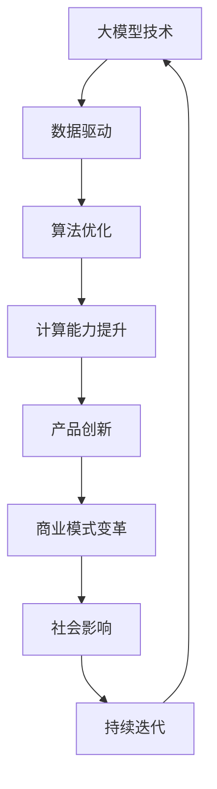

                 

关键词：大模型时代、产品创新、0到1突破、技术发展、人工智能

摘要：随着大模型时代的到来，产品创新成为推动技术发展的重要动力。本文将从0到1的突破之路，探讨大模型时代的产品创新策略、核心算法、数学模型、实践应用以及未来发展趋势。

## 1. 背景介绍

### 大模型时代的到来

大模型时代，指的是以大规模神经网络模型为核心的算法和技术快速发展的时代。这些模型拥有数十亿甚至数万亿的参数，可以处理海量数据，从而在图像识别、自然语言处理、语音识别等领域取得了显著的突破。大模型时代开启了人工智能的新纪元，对各行各业产生了深远的影响。

### 产品创新的挑战与机遇

大模型时代为产品创新带来了前所未有的挑战与机遇。一方面，大模型的计算复杂度和数据需求使得传统产品开发模式难以应对；另一方面，大模型的强大能力为产品创新提供了新的可能性，例如个性化推荐、智能客服、自动驾驶等。

### 0到1突破的重要性

在技术发展过程中，从0到1的突破意味着从无到有，实现技术的重大创新。在人工智能领域，0到1突破不仅指算法和技术的突破，还包括商业模式、产品形态的突破。本文将探讨大模型时代的产品创新如何实现从0到1的突破。

## 2. 核心概念与联系

为了更好地理解大模型时代的产品创新，我们首先需要了解几个核心概念，并使用Mermaid流程图展示它们之间的关系。

### Mermaid流程图



### 核心概念与联系

- **大模型技术**：指拥有数十亿甚至数万亿参数的神经网络模型，如GPT、BERT等。
- **数据驱动**：大模型的发展离不开海量数据的支持，数据的质量和数量直接影响模型的性能。
- **算法优化**：包括模型架构的优化、训练算法的改进等，以提高模型的效率和效果。
- **计算能力提升**：硬件技术的发展，如GPU、TPU等，为大规模模型训练提供了强大的计算支持。
- **产品创新**：基于大模型技术，开发出具有创新性的产品，如智能客服、自动驾驶等。
- **商业模式变革**：产品创新不仅改变了技术领域，还带来了商业模式的变革，如平台化、服务化等。
- **社会影响**：大模型技术对社会的各个方面都产生了深远的影响，如教育、医疗、金融等。

## 3. 核心算法原理 & 具体操作步骤

### 3.1 算法原理概述

大模型时代的产品创新离不开核心算法的支持。以下将介绍几种常见的核心算法原理：

- **深度学习**：基于多层神经网络的算法，通过非线性变换逐步提取数据特征。
- **生成对抗网络（GAN）**：由生成器和判别器组成的对抗性网络，通过对抗训练生成高质量的数据。
- **迁移学习**：利用已有模型的知识迁移到新的任务上，提高模型的泛化能力。
- **强化学习**：通过与环境交互，学习最优策略，从而实现复杂任务的自动化。

### 3.2 算法步骤详解

以深度学习为例，具体操作步骤如下：

1. **数据预处理**：对原始数据进行清洗、归一化等处理，使其适合模型训练。
2. **构建模型**：设计神经网络结构，包括输入层、隐藏层和输出层。
3. **训练模型**：使用预处理后的数据训练模型，通过反向传播算法不断调整模型参数。
4. **评估模型**：使用验证集或测试集评估模型性能，选择最优模型。
5. **模型部署**：将训练好的模型部署到实际应用中，如智能客服、自动驾驶等。

### 3.3 算法优缺点

- **优点**：
  - 高效：大模型可以处理海量数据，提高数据处理效率。
  - 泛化能力强：通过迁移学习等技术，可以提高模型的泛化能力。
  - 创新性：基于大模型的算法可以带来全新的产品形态和商业模式。

- **缺点**：
  - 计算成本高：大规模模型训练需要大量计算资源。
  - 数据依赖性强：模型性能依赖于数据的质量和数量。
  - 难以解释：深度学习模型的内部机制复杂，难以解释。

### 3.4 算法应用领域

大模型技术已在多个领域取得了显著的突破：

- **计算机视觉**：如人脸识别、图像分类等。
- **自然语言处理**：如文本生成、机器翻译等。
- **语音识别**：如语音合成、语音识别等。
- **推荐系统**：如商品推荐、内容推荐等。
- **自动驾驶**：如环境感知、路径规划等。

## 4. 数学模型和公式 & 详细讲解 & 举例说明

### 4.1 数学模型构建

大模型时代的数学模型主要基于深度学习和概率图模型。以下以深度学习为例，介绍数学模型的构建过程：

1. **损失函数**：用于评估模型预测值与实际值之间的差距，常用的损失函数有均方误差（MSE）和交叉熵（Cross Entropy）。
2. **优化器**：用于更新模型参数，常用的优化器有梯度下降（Gradient Descent）和Adam优化器。
3. **激活函数**：用于引入非线性变换，常用的激活函数有Sigmoid、ReLU等。

### 4.2 公式推导过程

以均方误差（MSE）为例，推导过程如下：

假设输入数据为 \(x\)，模型预测值为 \(y\)，实际值为 \(t\)，则均方误差（MSE）定义为：

$$
MSE = \frac{1}{n}\sum_{i=1}^{n}(y_i - t_i)^2
$$

其中，\(n\) 为样本数量。

### 4.3 案例分析与讲解

以下以图像分类任务为例，介绍大模型时代的数学模型应用：

1. **数据集准备**：准备包含多种类别的图像数据，如MNIST、CIFAR-10等。
2. **模型构建**：构建卷积神经网络（CNN）模型，包括卷积层、池化层、全连接层等。
3. **模型训练**：使用预处理后的数据训练模型，通过反向传播算法不断调整模型参数。
4. **模型评估**：使用测试集评估模型性能，如准确率、召回率等。
5. **模型部署**：将训练好的模型部署到实际应用中，如图像识别、图像生成等。

## 5. 项目实践：代码实例和详细解释说明

### 5.1 开发环境搭建

1. **安装Python**：版本要求为Python 3.6及以上。
2. **安装TensorFlow**：使用pip安装TensorFlow库。
3. **安装其他依赖**：如NumPy、Matplotlib等。

### 5.2 源代码详细实现

以下是一个简单的卷积神经网络（CNN）模型实现，用于图像分类：

```python
import tensorflow as tf
from tensorflow.keras import layers

# 构建模型
model = tf.keras.Sequential([
    layers.Conv2D(32, (3, 3), activation='relu', input_shape=(28, 28, 1)),
    layers.MaxPooling2D((2, 2)),
    layers.Conv2D(64, (3, 3), activation='relu'),
    layers.MaxPooling2D((2, 2)),
    layers.Conv2D(64, (3, 3), activation='relu'),
    layers.Flatten(),
    layers.Dense(64, activation='relu'),
    layers.Dense(10, activation='softmax')
])

# 编译模型
model.compile(optimizer='adam',
              loss='sparse_categorical_crossentropy',
              metrics=['accuracy'])

# 训练模型
model.fit(train_images, train_labels, epochs=5)

# 评估模型
test_loss, test_acc = model.evaluate(test_images,  test_labels)
print('Test accuracy:', test_acc)
```

### 5.3 代码解读与分析

1. **模型构建**：使用`tf.keras.Sequential`构建模型，包括卷积层、池化层、全连接层等。
2. **模型编译**：设置优化器、损失函数和评估指标。
3. **模型训练**：使用训练数据训练模型，设置训练轮次。
4. **模型评估**：使用测试数据评估模型性能。

### 5.4 运行结果展示

1. **训练过程**：显示训练过程中的损失函数和准确率。
2. **测试结果**：输出测试集的准确率。

## 6. 实际应用场景

### 6.1 自动驾驶

自动驾驶是人工智能领域的重要应用之一。大模型技术为自动驾驶提供了强大的支持，如环境感知、路径规划等。

### 6.2 医疗诊断

大模型技术在医疗诊断领域具有巨大的潜力，如图像诊断、基因分析等。通过深度学习算法，可以实现快速、准确的诊断。

### 6.3 金融风控

大模型技术在金融风控领域也有广泛应用，如信用评分、风险预测等。通过分析大量数据，可以实现精准的风险管理。

## 7. 工具和资源推荐

### 7.1 学习资源推荐

- **《深度学习》**：由Ian Goodfellow、Yoshua Bengio和Aaron Courville合著，是深度学习领域的经典教材。
- **《Python深度学习》**：由François Chollet等合著，涵盖了深度学习在Python中的应用。

### 7.2 开发工具推荐

- **TensorFlow**：Google开源的深度学习框架，适合初学者和专业人士。
- **PyTorch**：Facebook开源的深度学习框架，具有较好的灵活性和易用性。

### 7.3 相关论文推荐

- **"A Theoretical Analysis of the Cramér-Rao Lower Bound for Gaussian Sequence Estimation"**：对高斯序列估计的Cramér-Rao下界进行了理论分析。
- **"Generative Adversarial Nets"**：提出了生成对抗网络（GAN）这一重要算法。

## 8. 总结：未来发展趋势与挑战

### 8.1 研究成果总结

大模型时代的产品创新在多个领域取得了显著成果，如自动驾驶、医疗诊断、金融风控等。深度学习、生成对抗网络等核心算法的不断发展，为大模型时代的创新提供了有力支持。

### 8.2 未来发展趋势

1. **算法优化**：持续优化算法，提高模型效率和效果。
2. **跨领域应用**：大模型技术将在更多领域得到应用，如教育、能源等。
3. **可解释性**：提升模型的可解释性，使其更加可靠和安全。

### 8.3 面临的挑战

1. **计算资源**：大规模模型训练需要大量计算资源，对硬件性能有较高要求。
2. **数据隐私**：大模型对数据的需求巨大，数据隐私保护成为重要问题。
3. **法律法规**：随着人工智能技术的发展，法律法规需要不断更新和完善。

### 8.4 研究展望

大模型时代的产品创新仍处于快速发展阶段，未来有望在以下方面取得突破：

1. **模型压缩**：通过模型压缩技术，提高模型的部署效率。
2. **联邦学习**：在保护数据隐私的前提下，实现分布式模型训练。
3. **自适应学习**：实现自适应学习，使模型能够根据用户需求动态调整。

## 9. 附录：常见问题与解答

### 问题1：大模型训练需要多少时间？

**解答**：大模型训练时间取决于多种因素，如模型大小、数据集规模、计算资源等。通常来说，大规模模型训练可能需要数天甚至数周的时间。通过使用更强大的计算资源和优化算法，可以缩短训练时间。

### 问题2：大模型是否会替代人类？

**解答**：大模型技术在一定程度上可以替代人类在特定领域的劳动，但不会完全替代人类。人类在创造力、情感理解等方面具有独特的优势，大模型只能在特定领域和任务中发挥辅助作用。

### 问题3：大模型技术是否会引发失业？

**解答**：大模型技术可能会改变某些职业的需求，但也会创造新的就业机会。关键在于如何适应技术变革，提高自身技能，以适应新的就业市场。

### 问题4：大模型技术是否安全？

**解答**：大模型技术在安全性方面存在一定风险，如数据泄露、隐私侵犯等。为确保安全，需要加强法律法规建设，提高数据保护意识，并采用加密、隐私保护等技术手段。

## 作者署名

作者：禅与计算机程序设计艺术 / Zen and the Art of Computer Programming

---

本文旨在探讨大模型时代的产品创新，从0到1的突破之路。通过核心算法、数学模型、项目实践等方面的介绍，本文希望为读者提供关于大模型时代产品创新的全面理解和指导。在未来的发展中，大模型技术将继续推动人工智能领域的发展，为社会带来更多创新和变革。

