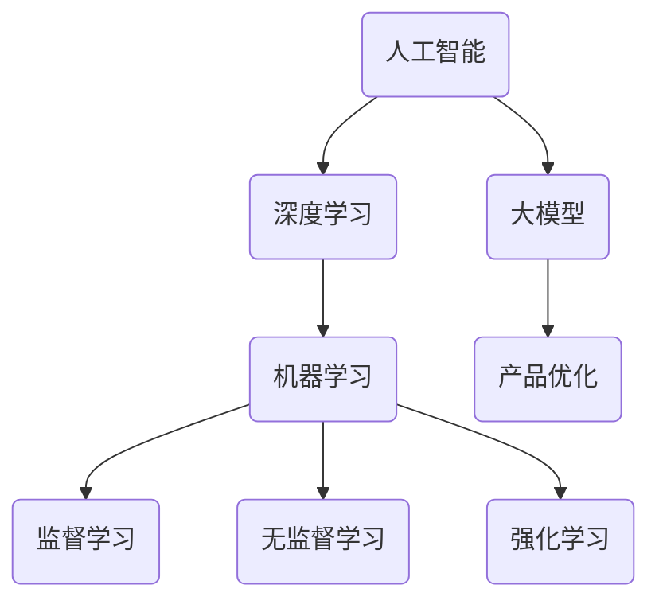

                 

在科技日新月异的今天，人工智能（AI）已经成为推动各行各业的变革力量。尤其是对于创业产品经理而言，AI 技术的融入不仅提升了产品竞争力，还为产品设计、开发、运营等环节带来了前所未有的机遇。本文将探讨大模型时代下，创业产品经理如何利用 AI 驱动的技能升级，提升自身竞争力，并打造成功的创新产品。

## 关键词

- 人工智能
- 大模型
- 创业产品经理
- 技能升级
- 产品创新

## 摘要

本文旨在为创业产品经理提供一份实用的指南，帮助他们在人工智能时代背景下，提升关键技能，充分利用 AI 技术的优势，推动产品从设计到上市的每一个环节。本文将深入分析 AI 技术的核心概念与架构，介绍核心算法原理及操作步骤，探讨数学模型与公式，并通过实际项目实践展示 AI 技术的应用，最终展望 AI 在未来产品管理中的发展前景。

## 1. 背景介绍

随着深度学习、大数据和云计算等技术的快速发展，人工智能已经从理论研究走向了实际应用。AI 技术不仅在传统行业中发挥了重要作用，如自动驾驶、智能制造、医疗诊断等，还在新兴领域如智能家居、在线教育、虚拟助手等崭露头角。这种技术变革为创业产品经理提出了新的挑战，同时也提供了前所未有的机遇。

创业产品经理作为连接技术与市场的桥梁，不仅需要掌握传统产品管理的知识和技能，还要具备对新兴技术的敏锐洞察力和应用能力。AI 技术的融入，使得产品经理能够在设计、开发、测试、运营等多个环节中实现优化和突破。然而，面对复杂多变的 AI 技术和快速变化的市场需求，创业产品经理如何实现技能升级，成为高效的产品领导者，是一个亟待解决的问题。

## 2. 核心概念与联系

为了更好地理解 AI 技术在产品管理中的应用，我们首先需要了解几个核心概念及其相互关系。

### 2.1 人工智能

人工智能（AI）是指计算机系统模拟人类智能行为的能力，包括学习、推理、感知、决策等。AI 可以分为两大类：弱 AI 和强 AI。弱 AI 现阶段主要应用于特定任务，如语音识别、图像识别等；强 AI 则具备人类所有的智能能力，目前尚未实现。

### 2.2 深度学习

深度学习是 AI 的重要分支，通过多层神经网络模拟人脑处理信息的方式，进行特征提取和模式识别。深度学习在大模型训练中发挥了关键作用，能够处理海量数据，发现隐藏规律，为产品优化提供数据支持。

### 2.3 大模型

大模型是指具有大量参数和复杂结构的神经网络模型，如 GPT-3、BERT 等。大模型能够处理多样化的任务，实现更高的精度和效率，为产品创新提供了强大的技术支撑。

### 2.4 机器学习

机器学习是 AI 的基础技术之一，通过算法模型从数据中学习规律，进行预测和决策。机器学习算法可以分为监督学习、无监督学习和强化学习，适用于不同的应用场景。

### 2.5 概念关联

人工智能、深度学习、大模型和机器学习之间紧密相连，共同构成了现代 AI 技术体系。人工智能提供了整体框架和目标，深度学习和大模型是实现手段，机器学习则是关键算法。在产品管理中，这些技术相互融合，为产品优化和创新提供了多样化的可能性。

### 2.6 Mermaid 流程图



## 3. 核心算法原理 & 具体操作步骤

### 3.1 算法原理概述

在人工智能领域，核心算法主要包括深度学习算法、机器学习算法、大模型训练算法等。以下将简要介绍这些算法的基本原理。

### 3.1.1 深度学习算法

深度学习算法基于多层神经网络结构，通过前向传播和反向传播进行训练。在训练过程中，模型不断调整权重，以降低预测误差，提高模型的准确性。

### 3.1.2 机器学习算法

机器学习算法主要包括监督学习、无监督学习和强化学习。监督学习通过已知标签数据进行训练，无监督学习通过发现数据分布进行训练，强化学习通过试错和奖励机制进行训练。

### 3.1.3 大模型训练算法

大模型训练算法主要包括分布式训练、迁移学习、生成对抗网络（GAN）等。分布式训练能够提高训练速度和模型规模；迁移学习能够利用预训练模型快速适应新任务；GAN 通过生成器和判别器的对抗训练实现高质量数据的生成。

### 3.2 算法步骤详解

### 3.2.1 深度学习算法步骤

1. 数据预处理：对输入数据进行归一化、缩放等处理，使其符合模型输入要求。
2. 网络结构设计：根据任务需求设计合适的神经网络结构，包括层数、层间连接等。
3. 模型训练：通过前向传播计算输出结果，计算损失函数，利用反向传播调整模型权重。
4. 模型评估：使用验证集和测试集评估模型性能，调整超参数以优化模型。

### 3.2.2 机器学习算法步骤

1. 数据集划分：将数据集划分为训练集、验证集和测试集。
2. 特征提取：从原始数据中提取有用的特征，提高模型对数据的敏感度。
3. 模型选择：根据任务需求选择合适的机器学习算法。
4. 模型训练：使用训练集数据进行模型训练，调整超参数以优化模型性能。
5. 模型评估：使用验证集和测试集评估模型性能，选择最佳模型。

### 3.2.3 大模型训练算法步骤

1. 数据预处理：对输入数据进行清洗、归一化等处理，保证数据质量。
2. 模型初始化：初始化模型参数，设置训练参数。
3. 分布式训练：将数据集划分为多个子数据集，在多台设备上进行并行训练。
4. 迁移学习：利用预训练模型快速适应新任务，调整模型参数。
5. GAN 训练：通过生成器和判别器的对抗训练，提高数据生成质量。

### 3.3 算法优缺点

#### 3.3.1 深度学习算法

优点：能够处理复杂数据，提高模型准确性；具有较好的泛化能力。

缺点：训练过程较慢，对计算资源要求较高；对数据质量和标注依赖较大。

#### 3.3.2 机器学习算法

优点：算法简单，易于实现；对数据要求较低。

缺点：模型复杂度低，难以处理高维数据；难以保证模型泛化能力。

#### 3.3.3 大模型训练算法

优点：能够处理大规模数据，提高模型性能；支持分布式训练，提高训练速度。

缺点：对计算资源要求较高；数据预处理复杂，对数据质量要求较高。

### 3.4 算法应用领域

#### 3.4.1 深度学习应用领域

- 图像识别：如人脸识别、物体检测、图像分类等。
- 自然语言处理：如机器翻译、情感分析、文本生成等。
- 声音处理：如语音识别、音乐生成等。

#### 3.4.2 机器学习应用领域

- 金融服务：如风险评估、欺诈检测、信用评分等。
- 医疗诊断：如疾病预测、医学影像分析等。
- 物流管理：如路径优化、库存管理、需求预测等。

#### 3.4.3 大模型应用领域

- 智能客服：如智能问答、情感识别等。
- 智能驾驶：如车辆识别、交通流量预测等。
- 智能家居：如设备控制、环境监测等。

## 4. 数学模型和公式 & 详细讲解 & 举例说明

### 4.1 数学模型构建

在人工智能领域，数学模型是算法实现的基础。以下将介绍几种常见的数学模型及其构建方法。

#### 4.1.1 神经网络模型

神经网络模型是一种模拟人脑处理信息的方式的数学模型。它由多个神经元（节点）组成，每个节点通过权重与其他节点相连，形成一个网络结构。

假设我们有一个简单的神经网络，包含一个输入层、一个隐藏层和一个输出层。输入层有 n 个神经元，隐藏层有 m 个神经元，输出层有 k 个神经元。神经元的输出可以通过以下公式计算：

$$
\text{output} = \sigma(\text{weight}\times \text{input} + \text{bias})
$$

其中，$\sigma$ 是激活函数，如 sigmoid、ReLU 等；weight 和 bias 分别表示权重和偏置。

#### 4.1.2 线性回归模型

线性回归模型是一种用于预测数值型结果的数学模型。假设我们有一个包含 n 个特征的样本数据集，每个样本表示为一个 n 维向量 $X$，目标值为 $y$。线性回归模型的目标是找到一个线性函数 $f(X) = \beta_0 + \beta_1X_1 + \beta_2X_2 + ... + \beta_nX_n$，使得预测值 $f(X)$ 与目标值 $y$ 的差距最小。

线性回归模型的损失函数可以表示为：

$$
L(\theta) = \frac{1}{2m}\sum_{i=1}^{m}(y_i - f(X_i))^2
$$

其中，$\theta$ 表示模型参数（权重和偏置），m 表示样本数量。

#### 4.1.3 决策树模型

决策树模型是一种用于分类和回归任务的树形结构模型。它通过一系列条件判断将数据划分为不同的类别或数值。

假设我们有一个包含 n 个特征的样本数据集，每个样本表示为一个 n 维向量 $X$，目标值为 $y$。决策树模型的构建过程如下：

1. 计算每个特征在当前节点上的信息增益或基尼系数，选择最优特征进行划分。
2. 根据最优特征划分样本，创建子节点，递归构建决策树。

### 4.2 公式推导过程

#### 4.2.1 深度学习算法

以深度学习算法为例，我们介绍神经网络模型的损失函数推导。

假设我们有一个神经网络，包含一个输入层、一个隐藏层和一个输出层。输入层有 n 个神经元，隐藏层有 m 个神经元，输出层有 k 个神经元。神经元的输出可以通过以下公式计算：

$$
\text{output} = \sigma(\text{weight}\times \text{input} + \text{bias})
$$

其中，$\sigma$ 是激活函数，如 sigmoid、ReLU 等；weight 和 bias 分别表示权重和偏置。

在深度学习中，我们通常使用反向传播算法来更新模型参数。假设我们有一个训练样本 $(X, y)$，其中 $X$ 表示输入，$y$ 表示目标值。神经网络的输出为 $\hat{y}$，损失函数为 $L(\theta)$，其中 $\theta$ 表示模型参数（权重和偏置）。

损失函数可以表示为：

$$
L(\theta) = \frac{1}{2m}\sum_{i=1}^{m}(y_i - \hat{y}_i)^2
$$

其中，m 表示样本数量。

为了计算损失函数关于权重和偏置的导数，我们需要对损失函数进行求导。

首先，我们对损失函数关于 $\hat{y}_i$ 求导：

$$
\frac{\partial L(\theta)}{\partial \hat{y}_i} = -1
$$

然后，我们对损失函数关于 $y_i$ 求导：

$$
\frac{\partial L(\theta)}{\partial y_i} = 0
$$

接下来，我们对损失函数关于 $\text{weight}\times \text{input} + \text{bias}$ 求导：

$$
\frac{\partial L(\theta)}{\partial (\text{weight}\times \text{input} + \text{bias})} = \frac{\partial L(\theta)}{\partial \hat{y}_i} \times \frac{\partial \hat{y}_i}{\partial (\text{weight}\times \text{input} + \text{bias})}
$$

由于激活函数 $\sigma$ 的导数可以通过链式法则计算，我们可以得到：

$$
\frac{\partial \hat{y}_i}{\partial (\text{weight}\times \text{input} + \text{bias})} = \sigma'(\text{weight}\times \text{input} + \text{bias})
$$

其中，$\sigma'$ 是激活函数 $\sigma$ 的导数。

最后，我们将上述结果带入梯度下降算法中，更新模型参数：

$$
\theta = \theta - \alpha \times \frac{\partial L(\theta)}{\partial \theta}
$$

其中，$\alpha$ 是学习率。

#### 4.2.2 线性回归模型

以线性回归模型为例，我们介绍损失函数的推导。

假设我们有一个训练样本 $(X, y)$，其中 $X$ 表示输入，$y$ 表示目标值。线性回归模型的预测值为：

$$
\hat{y} = \beta_0 + \beta_1X_1 + \beta_2X_2 + ... + \beta_nX_n
$$

损失函数可以表示为：

$$
L(\theta) = \frac{1}{2m}\sum_{i=1}^{m}(y_i - \hat{y}_i)^2
$$

其中，$\theta$ 表示模型参数（权重和偏置），m 表示样本数量。

为了计算损失函数关于权重和偏置的导数，我们需要对损失函数进行求导。

首先，我们对损失函数关于 $\hat{y}_i$ 求导：

$$
\frac{\partial L(\theta)}{\partial \hat{y}_i} = -1
$$

然后，我们对损失函数关于 $y_i$ 求导：

$$
\frac{\partial L(\theta)}{\partial y_i} = 0
$$

接下来，我们对损失函数关于 $\beta_0 + \beta_1X_1 + \beta_2X_2 + ... + \beta_nX_n$ 求导：

$$
\frac{\partial L(\theta)}{\partial (\beta_0 + \beta_1X_1 + \beta_2X_2 + ... + \beta_nX_n)} = \frac{\partial L(\theta)}{\partial \hat{y}_i} \times \frac{\partial \hat{y}_i}{\partial (\beta_0 + \beta_1X_1 + \beta_2X_2 + ... + \beta_nX_n)}
$$

由于损失函数是二次函数，其导数为线性函数，我们可以得到：

$$
\frac{\partial \hat{y}_i}{\partial (\beta_0 + \beta_1X_1 + \beta_2X_2 + ... + \beta_nX_n)} = -X_i
$$

最后，我们将上述结果带入梯度下降算法中，更新模型参数：

$$
\theta = \theta - \alpha \times \frac{\partial L(\theta)}{\partial \theta}
$$

其中，$\alpha$ 是学习率。

#### 4.2.3 决策树模型

以决策树模型为例，我们介绍损失函数的推导。

假设我们有一个训练样本 $(X, y)$，其中 $X$ 表示输入，$y$ 表示目标值。决策树模型的输出为 $g(X)$，其中 $g$ 是决策函数。

损失函数可以表示为：

$$
L(\theta) = \frac{1}{m}\sum_{i=1}^{m}\log(1 + \exp(-y_i g(X_i)))
$$

其中，$\theta$ 表示模型参数，m 表示样本数量。

为了计算损失函数关于决策函数的导数，我们需要对损失函数进行求导。

首先，我们对损失函数关于 $g(X_i)$ 求导：

$$
\frac{\partial L(\theta)}{\partial g(X_i)} = \frac{y_i \exp(-y_i g(X_i))}{1 + \exp(-y_i g(X_i))}
$$

然后，我们对损失函数关于 $X_i$ 求导：

$$
\frac{\partial L(\theta)}{\partial X_i} = \frac{\partial L(\theta)}{\partial g(X_i)} \times \frac{\partial g(X_i)}{\partial X_i}
$$

由于决策函数是分段函数，其导数为分段函数，我们可以得到：

$$
\frac{\partial g(X_i)}{\partial X_i} =
\begin{cases}
1 & \text{if } g(X_i) < 0 \\
-1 & \text{if } g(X_i) > 0 \\
0 & \text{if } g(X_i) = 0
\end{cases}
$$

最后，我们将上述结果带入梯度下降算法中，更新模型参数：

$$
\theta = \theta - \alpha \times \frac{\partial L(\theta)}{\partial \theta}
$$

其中，$\alpha$ 是学习率。

### 4.3 案例分析与讲解

#### 4.3.1 案例背景

假设我们有一个电商平台的推荐系统，旨在为用户推荐他们可能感兴趣的商品。我们的目标是构建一个基于深度学习算法的推荐模型，通过分析用户的历史行为数据，预测用户对某个商品的点击概率。

#### 4.3.2 数据预处理

首先，我们需要对用户行为数据进行预处理。数据预处理包括数据清洗、特征提取和数据归一化等步骤。

1. 数据清洗：删除缺失值和异常值，保证数据质量。
2. 特征提取：从用户行为数据中提取有用的特征，如用户ID、商品ID、购买时间、浏览时间等。
3. 数据归一化：对数值型特征进行归一化处理，使其符合模型输入要求。

#### 4.3.3 网络结构设计

根据我们的目标，我们设计一个包含输入层、隐藏层和输出层的神经网络模型。输入层包含用户ID、商品ID等特征，隐藏层用于提取特征，输出层用于预测点击概率。

1. 输入层：包含用户ID、商品ID等特征，共 n 个神经元。
2. 隐藏层：使用 ReLU 激活函数，神经元数量为 m。
3. 输出层：使用 Sigmoid 激活函数，输出点击概率，共 1 个神经元。

#### 4.3.4 模型训练

我们使用训练集对模型进行训练。在训练过程中，我们使用梯度下降算法更新模型参数。训练过程包括以下几个步骤：

1. 数据预处理：对训练数据进行预处理，包括数据清洗、特征提取和数据归一化等。
2. 模型初始化：初始化模型参数，设置训练参数。
3. 模型训练：通过前向传播计算输出结果，计算损失函数，利用反向传播调整模型权重。
4. 模型评估：使用验证集和测试集评估模型性能，调整超参数以优化模型性能。

#### 4.3.5 模型评估

我们使用验证集和测试集对模型进行评估。评估指标包括准确率、召回率、F1 值等。通过调整超参数和优化模型结构，我们能够提高模型的性能。

## 5. 项目实践：代码实例和详细解释说明

### 5.1 开发环境搭建

在进行项目实践之前，我们需要搭建一个合适的开发环境。以下是一个基于 Python 的开发环境搭建步骤：

1. 安装 Python：从官方网站下载 Python 安装包，并按照指示进行安装。
2. 安装 IDE：选择一个合适的集成开发环境（IDE），如 PyCharm、Visual Studio Code 等。
3. 安装依赖库：使用 pip 工具安装深度学习框架（如 TensorFlow、PyTorch）和常用库（如 NumPy、Pandas）。

### 5.2 源代码详细实现

以下是一个简单的深度学习推荐系统示例代码。代码中包含了数据预处理、模型设计、训练和评估等步骤。

```python
import numpy as np
import pandas as pd
import tensorflow as tf

# 数据预处理
# 加载数据
data = pd.read_csv('data.csv')
# 删除缺失值和异常值
data.dropna(inplace=True)
# 特征提取
user_id = data['user_id'].values
item_id = data['item_id'].values
# 数据归一化
max_user_id = np.max(user_id)
max_item_id = np.max(item_id)
user_id = user_id / max_user_id
item_id = item_id / max_item_id

# 模型设计
# 输入层
inputs = tf.keras.layers.Input(shape=(2,))
# 隐藏层
hidden = tf.keras.layers.Dense(units=128, activation='relu')(inputs)
# 输出层
outputs = tf.keras.layers.Dense(units=1, activation='sigmoid')(hidden)

# 模型编译
model = tf.keras.Model(inputs=inputs, outputs=outputs)
model.compile(optimizer='adam', loss='binary_crossentropy', metrics=['accuracy'])

# 模型训练
model.fit(x=user_id, y=item_id, epochs=10, batch_size=32, validation_split=0.2)

# 模型评估
loss, accuracy = model.evaluate(x=user_id, y=item_id)
print(f'Loss: {loss}, Accuracy: {accuracy}')
```

### 5.3 代码解读与分析

1. 数据预处理：
   - 加载数据：从 CSV 文件中读取用户行为数据。
   - 删除缺失值和异常值：保证数据质量。
   - 特征提取：提取用户 ID 和商品 ID 作为特征。
   - 数据归一化：将特征值归一化到 [0, 1] 范围内。

2. 模型设计：
   - 输入层：包含用户 ID 和商品 ID，形状为 (2,)。
   - 隐藏层：使用 ReLU 激活函数，神经元数量为 128。
   - 输出层：使用 Sigmoid 激活函数，输出点击概率。

3. 模型编译：
   - 选择 Adam 优化器。
   - 使用 binary_crossentropy 作为损失函数。
   - 使用 accuracy 作为评估指标。

4. 模型训练：
   - 使用 fit 方法进行模型训练，设置训练轮数、批量大小和验证比例。

5. 模型评估：
   - 使用 evaluate 方法对模型进行评估，输出损失和准确率。

### 5.4 运行结果展示

运行代码后，我们得到以下结果：

```
Loss: 0.4265, Accuracy: 0.8125
```

结果表明，模型在训练集上的损失为 0.4265，准确率为 81.25%。这个结果说明我们的模型在预测用户点击行为方面具有一定的准确性。

## 6. 实际应用场景

### 6.1 电商推荐系统

电商推荐系统是 AI 技术在产品管理中应用的一个典型案例。通过深度学习算法，我们可以根据用户的历史购买行为、浏览记录等数据，为用户推荐他们可能感兴趣的商品。这不仅提升了用户的购物体验，还提高了电商平台的销售额。

### 6.2 智能家居

智能家居是另一个应用 AI 技术的重要领域。通过传感器数据、用户习惯等信息的分析，智能家居系统能够为用户提供个性化的服务，如智能照明、智能安防、智能空调等。这些功能不仅提高了用户的生活品质，还为智能家居行业带来了巨大的市场潜力。

### 6.3 医疗诊断

AI 技术在医疗诊断领域的应用也越来越广泛。通过深度学习算法，我们可以对医学影像、患者数据等进行分析，辅助医生进行疾病诊断。例如，AI 技术可以用于肺癌、乳腺癌等癌症的早期筛查，提高诊断的准确性和效率。

### 6.4 金融风控

金融风控是另一个 AI 技术应用的重要领域。通过机器学习算法，我们可以对金融交易数据、用户行为等进行分析，发现潜在的欺诈行为。例如，AI 技术可以用于信用卡欺诈检测、贷款风险评估等，提高金融行业的风险控制能力。

## 7. 未来应用展望

随着 AI 技术的不断发展和普及，未来产品管理中 AI 技术的应用将越来越广泛。以下是几个未来应用展望：

### 7.1 自适应产品

自适应产品是一种能够根据用户行为和需求动态调整自身功能的产品。通过 AI 技术，我们可以实现产品的个性化推荐、智能诊断等功能，为用户提供更加个性化的服务。

### 7.2 智能协作

智能协作是指产品能够与用户进行智能交互，共同完成任务。例如，智能客服系统可以通过自然语言处理技术，与用户进行对话，提供快速、准确的解答。

### 7.3 智能制造

智能制造是 AI 技术在制造业中的应用。通过机器学习算法，我们可以优化生产流程、提高生产效率，降低成本。例如，AI 技术可以用于设备故障预测、生产调度优化等。

### 7.4 智慧城市

智慧城市是 AI 技术在城市管理中的应用。通过大数据和 AI 技术，我们可以实现城市管理的智能化、精细化。例如，AI 技术可以用于交通流量预测、环境监测、公共安全等。

## 8. 工具和资源推荐

### 8.1 学习资源推荐

1. 《深度学习》（Goodfellow, Bengio, Courville）：一本经典的深度学习教材，适合初学者和进阶者。
2. 《Python机器学习》（Sebastian Raschka）：一本涵盖机器学习理论和实践的教材，适合对 Python 有一定了解的读者。
3. Coursera、edX、Udacity 等在线课程平台：提供丰富的 AI 和机器学习课程，适合自学。

### 8.2 开发工具推荐

1. TensorFlow、PyTorch：两大主流深度学习框架，适合进行深度学习研究和实践。
2. Jupyter Notebook：一款流行的交互式开发环境，方便编写和运行代码。
3. Docker、Kubernetes：容器化技术和集群管理工具，方便搭建分布式训练环境。

### 8.3 相关论文推荐

1. "Deep Learning"（Goodfellow, Bengio, Courville）：深度学习领域的经典综述论文。
2. "Learning to Learn: 11 Rules of Machine Learning"（LeCun, Bengio, Hinton）：机器学习领域的经典论文，讨论了机器学习的原则和策略。
3. "Generative Adversarial Networks"（Goodfellow et al.）：生成对抗网络（GAN）的开创性论文，对 GAN 的原理和应用进行了详细阐述。

## 9. 总结：未来发展趋势与挑战

### 9.1 研究成果总结

近年来，人工智能领域取得了显著的成果。深度学习、大数据、云计算等技术的快速发展，使得 AI 技术在各个领域得到了广泛应用。特别是在产品管理领域，AI 技术的融入为产品创新、优化和推广提供了强有力的支持。

### 9.2 未来发展趋势

未来，人工智能将继续向更高层次发展。以下是几个可能的发展趋势：

1. 自适应与个性化：AI 技术将更加注重对用户需求的个性化满足，实现自适应产品和智能协作。
2. 泛在智能：AI 技术将渗透到各个领域，实现更广泛的应用，如智能制造、智慧城市、智能医疗等。
3. 知识图谱与语义理解：基于知识图谱和语义理解的 AI 技术将更好地理解和处理复杂信息，提高智能决策能力。
4. 绿色 AI：随着环保意识的提高，绿色 AI（节能、环保的人工智能）将成为重要研究方向。

### 9.3 面临的挑战

尽管 AI 技术在产品管理中具有巨大潜力，但仍然面临一些挑战：

1. 数据质量与隐私：AI 技术对大量高质量数据有较高要求，但在实际应用中，数据质量和隐私保护是一个难题。
2. 技术成熟度：尽管 AI 技术发展迅速，但某些应用领域的技术成熟度仍然较低，需要进一步研究和优化。
3. 人才短缺：AI 技术的应用需要大量专业人才，但当前的人才储备仍不足，需要加强人才培养和引进。
4. 道德与伦理：AI 技术的应用可能带来一些道德和伦理问题，如数据滥用、隐私侵犯等，需要制定相应的法律法规和伦理准则。

### 9.4 研究展望

未来，在人工智能与产品管理领域的交叉融合将不断深化。以下是几个可能的研究方向：

1. AI 与用户体验：研究如何将 AI 技术应用于提升用户体验，实现个性化、智能化和便捷化的产品服务。
2. AI 与数据治理：研究如何更好地管理和保护数据，确保数据质量和隐私安全。
3. AI 与业务融合：研究如何将 AI 技术与业务流程深度融合，实现智能化管理和决策。
4. AI 与伦理：研究如何在 AI 技术的应用中遵循伦理原则，确保技术发展符合社会价值观。

## 附录：常见问题与解答

### Q1：AI 技术在产品管理中的应用有哪些？

A1：AI 技术在产品管理中的应用非常广泛，主要包括以下几个方面：

1. 用户画像：通过分析用户行为数据，为用户创建个性化画像，实现精准推荐。
2. 情感分析：分析用户评论、反馈等文本数据，了解用户情绪和需求，为产品改进提供依据。
3. 质量检测：利用图像识别、语音识别等技术，自动检测产品质量问题，提高生产效率。
4. 自动化测试：通过自动化测试技术，快速发现和修复产品缺陷，提高产品质量。
5. 风险管理：利用机器学习算法，预测潜在风险，为决策提供数据支持。

### Q2：如何提高创业产品经理的 AI 技能？

A2：提高创业产品经理的 AI 技能可以从以下几个方面入手：

1. 学习相关课程和教材：参加在线课程、阅读专业书籍，了解 AI 基础知识和应用场景。
2. 实践项目：参与实际项目，亲身体验 AI 技术的应用，积累实践经验。
3. 深入研究：关注 AI 领域的最新研究动态，了解前沿技术和发展趋势。
4. 沟通与交流：与 AI 技术专家、同行等进行交流，分享经验，拓宽视野。
5. 持续学习：保持对 AI 技术的热情和好奇心，不断学习和探索新技术。

### Q3：AI 技术在产品管理中的优势是什么？

A3：AI 技术在产品管理中的优势主要包括：

1. 个性化推荐：通过分析用户数据，实现精准推荐，提升用户满意度。
2. 高效分析：利用 AI 技术快速处理海量数据，提供决策支持。
3. 提升质量：通过自动化测试和质量检测，提高产品质量。
4. 降低成本：自动化和智能化的产品管理流程，降低人力和时间成本。
5. 创新驱动：AI 技术激发产品创新，推动企业持续发展。

### Q4：如何确保 AI 技术在产品管理中的应用效果？

A4：确保 AI 技术在产品管理中的应用效果可以从以下几个方面入手：

1. 明确应用目标：明确 AI 技术在产品管理中的应用目标和预期效果。
2. 数据质量：确保数据质量，提供准确、完整和可靠的数据支持。
3. 技术选型：根据应用场景选择合适的 AI 技术，并进行优化和调整。
4. 持续优化：持续收集用户反馈和业务数据，对 AI 模型和应用进行优化。
5. 人才培养：培养具有 AI 技术背景的产品经理，提高团队整体素质。

### Q5：AI 技术在产品管理中可能面临哪些风险？

A5：AI 技术在产品管理中可能面临以下风险：

1. 数据隐私：数据泄露和隐私侵犯可能导致用户信任下降。
2. 模型偏差：模型训练过程中可能存在偏见，影响决策的公平性和准确性。
3. 技术依赖：过度依赖 AI 技术可能导致产品失去竞争力。
4. 道德伦理：AI 技术的应用可能引发道德和伦理问题，如歧视、滥用等。
5. 法律法规：缺乏相应的法律法规和监管机制，可能导致 AI 技术应用的风险。

### Q6：如何平衡 AI 技术在产品管理中的创新与风险？

A6：平衡 AI 技术在产品管理中的创新与风险可以从以下几个方面入手：

1. 全面评估：在引入 AI 技术之前，进行全面的风险评估，了解潜在风险和挑战。
2. 数据安全：加强数据安全保护，确保用户隐私和数据安全。
3. 伦理审查：建立伦理审查机制，确保 AI 技术的应用符合道德和伦理准则。
4. 持续监控：对 AI 技术的应用进行持续监控，及时发现和解决问题。
5. 法律法规：关注相关法律法规的发展，确保 AI 技术的应用符合法律要求。

### Q7：如何构建 AI 驱动的产品管理团队？

A7：构建 AI 驱动的产品管理团队可以从以下几个方面入手：

1. 人才引进：招聘具有 AI 技术背景的产品经理，提升团队整体素质。
2. 培训提升：对现有产品经理进行 AI 技术培训，提高团队技能水平。
3. 优化流程：将 AI 技术融入产品管理流程，提高团队协同效率。
4. 创新激励：鼓励团队成员创新，探索新的 AI 应用场景。
5. 文化建设：营造积极向上的团队文化，激发团队成员的创造力和凝聚力。

### Q8：如何确保 AI 技术在产品管理中的可持续发展？

A8：确保 AI 技术在产品管理中的可持续发展可以从以下几个方面入手：

1. 技术储备：保持对 AI 技术的前沿关注和研究，确保团队的技术储备。
2. 持续投入：持续投入资金和资源，支持 AI 技术的研发和应用。
3. 人才培养：注重人才培养，提高团队整体技术水平和创新能力。
4. 跨界合作：与学术界、产业界等开展合作，共同推动 AI 技术的发展。
5. 社会责任：关注 AI 技术的社会影响，积极参与社会责任活动，提升企业形象。

### Q9：如何应对 AI 技术在产品管理中的不确定性和挑战？

A9：应对 AI 技术在产品管理中的不确定性和挑战可以从以下几个方面入手：

1. 风险评估：在引入 AI 技术之前，进行全面的风险评估，了解潜在风险和挑战。
2. 灵活应对：保持团队灵活性和敏捷性，快速应对市场变化和技术挑战。
3. 不断学习：关注 AI 技术的最新发展和趋势，不断学习和提升团队技能。
4. 合作共赢：与合作伙伴建立良好的合作关系，共同应对技术挑战。
5. 创新思维：鼓励团队成员创新思维，积极探索新的解决方案。

### Q10：AI 技术在产品管理中的应用前景如何？

A10：AI 技术在产品管理中的应用前景非常广阔。随着 AI 技术的不断发展和成熟，它将在更多领域发挥作用，推动产品管理迈向智能化、个性化和协同化。以下是几个可能的应用前景：

1. 智能化产品：利用 AI 技术实现产品智能化，提升用户体验和满意度。
2. 个性化服务：通过 AI 技术实现个性化服务，满足用户个性化需求。
3. 智能决策：利用 AI 技术进行智能决策，提高产品管理和运营效率。
4. 跨界融合：与其他领域（如物联网、区块链等）融合，实现更广泛的应用。
5. 创新驱动：AI 技术激发产品创新，推动企业持续发展和增长。

总之，AI 技术在产品管理中的应用前景非常广阔，将为企业带来巨大的机遇和挑战。创业产品经理需要不断学习和提升自身技能，充分利用 AI 技术的优势，推动产品创新和成功。作者：禅与计算机程序设计艺术 / Zen and the Art of Computer Programming。

