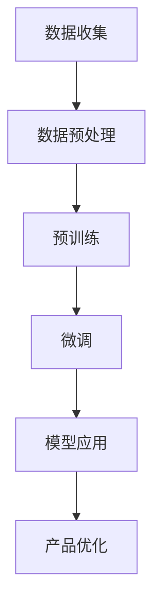

                 

在当今快速发展的技术浪潮中，人工智能（AI）已经成为推动创新和业务增长的关键力量。随着大模型技术的发展，创业产品经理面临着前所未有的机遇和挑战。本文将深入探讨大模型时代对创业产品经理的角色影响、核心技能需求、以及如何在AI赋能的背景下，制定有效产品策略。

## 文章关键词

- 人工智能
- 大模型
- 创业产品经理
- 产品策略
- 技术赋能

## 文章摘要

本文从多个角度分析了大模型时代给创业产品经理带来的挑战和机遇。通过探讨AI技术在产品设计、开发、营销和运营中的具体应用，文章提出了创业产品经理如何利用AI赋能，提升产品竞争力和用户满意度。文章还总结了一系列实用的工具和资源，以帮助产品经理在AI时代取得成功。

## 1. 背景介绍

在过去的几年里，人工智能技术的发展突飞猛进，从简单的机器学习模型到如今的大规模预训练模型，如GPT、BERT等，AI的应用范围已遍及各行各业。大模型的出现，不仅提高了算法的准确性和效率，也推动了各领域的技术革新。对于创业产品经理而言，这意味着必须紧跟技术潮流，充分利用AI的强大能力，以保持产品的竞争力和市场地位。

### 1.1 大模型技术的崛起

大模型技术，特别是基于深度学习的预训练模型，通过在海量数据上进行训练，能够自主学习复杂的模式和规律。这使得AI在图像识别、自然语言处理、语音识别等领域的表现远超传统方法。例如，OpenAI的GPT-3模型能够生成高质量的文本，甚至进行复杂的对话；谷歌的BERT模型在自然语言理解任务上取得了显著的成绩。

### 1.2 创业产品经理的角色演变

随着AI技术的普及，创业产品经理的角色也在不断演变。传统的产品经理更侧重于用户研究和市场分析，而AI赋能的产品经理则需要在技术和业务之间架起桥梁，深入了解AI技术的原理和应用，将技术优势转化为商业价值。

## 2. 核心概念与联系

为了更好地理解大模型时代对创业产品经理的挑战，我们需要明确几个核心概念及其相互关系。

### 2.1 AI技术的核心概念

- **机器学习**：一种让计算机通过数据学习模式和规律的技术，包括监督学习、无监督学习和强化学习。
- **深度学习**：一种基于多层神经网络的学习方法，通过大量的数据训练，能够自动提取特征，并在各种复杂任务中表现出色。
- **自然语言处理（NLP）**：AI技术的一个分支，致力于让计算机理解和生成人类语言。

### 2.2 大模型的工作原理

大模型通常是指具有数十亿甚至千亿参数的深度学习模型。这些模型通过大规模预训练，能够在大规模数据集上自动学习复杂的语言模式、知识结构等。大模型的工作原理可以概括为以下几个步骤：

1. **数据收集与预处理**：收集大量相关数据，并进行清洗、格式化等预处理工作。
2. **预训练**：在大量无标签数据上进行预训练，模型自主学习数据中的模式和规律。
3. **微调**：在预训练的基础上，利用特定任务的数据对模型进行微调，使其能够适应具体任务。

### 2.3 大模型与创业产品经理的关系

大模型技术为创业产品经理提供了强大的工具和手段，使得产品设计和开发更加智能化、个性化。创业产品经理需要掌握以下技能：

- **技术理解**：理解AI技术的基本原理，特别是深度学习和自然语言处理。
- **业务洞察**：结合行业特点和用户需求，将AI技术应用于产品设计和优化。
- **项目管理**：协调跨部门合作，确保AI技术能够高效地应用于产品开发。

### 2.4 Mermaid 流程图

以下是一个简化的Mermaid流程图，展示了大模型技术的基本工作流程：



## 3. 核心算法原理 & 具体操作步骤

### 3.1 算法原理概述

大模型的核心算法是基于深度学习的预训练和微调技术。预训练阶段，模型通过大量无标签数据进行自主学习，提取出通用的特征表示。微调阶段，模型利用特定任务的数据进行微调，从而适应具体的应用场景。

### 3.2 算法步骤详解

1. **数据收集**：选择与任务相关的数据集，例如文本、图像或音频。
2. **数据预处理**：对数据进行清洗、格式化等处理，使其适合模型训练。
3. **预训练**：使用无标签数据对模型进行预训练，通过反向传播算法不断调整模型参数。
4. **微调**：在预训练的基础上，利用特定任务的数据对模型进行微调，以提高模型在特定任务上的性能。
5. **模型应用**：将微调后的模型应用于实际产品或服务中，实现自动化、智能化的功能。

### 3.3 算法优缺点

**优点**：

- **高效性**：大模型通过预训练和微调，能够在短时间内学习复杂的特征和模式，显著提高任务性能。
- **泛化能力**：大模型在预训练阶段学习到的是通用的特征表示，使其在多种任务上表现良好。

**缺点**：

- **计算资源需求**：大模型通常需要大量的计算资源和时间进行训练。
- **数据依赖性**：大模型的表现高度依赖训练数据的质量和数量，数据质量差可能导致性能下降。

### 3.4 算法应用领域

大模型技术在多个领域取得了显著成果，包括自然语言处理、计算机视觉、语音识别等。以下是一些典型的应用场景：

- **自然语言处理**：用于文本生成、机器翻译、情感分析等任务。
- **计算机视觉**：用于图像分类、物体检测、图像生成等任务。
- **语音识别**：用于语音识别、语音合成、语音增强等任务。

## 4. 数学模型和公式 & 详细讲解 & 举例说明

### 4.1 数学模型构建

大模型通常基于深度学习框架构建，其中最常用的框架包括TensorFlow、PyTorch等。以下是一个基于PyTorch构建的简单神经网络模型：

```python
import torch
import torch.nn as nn
import torch.optim as optim

# 定义模型结构
class NeuralNetwork(nn.Module):
    def __init__(self):
        super(NeuralNetwork, self).__init__()
        self.layer1 = nn.Linear(in_features=784, out_features=128)
        self.relu = nn.ReLU()
        self.layer2 = nn.Linear(in_features=128, out_features=64)
        self.layer3 = nn.Linear(in_features=64, out_features=10)

    def forward(self, x):
        x = self.layer1(x)
        x = self.relu(x)
        x = self.layer2(x)
        x = self.layer3(x)
        return x

# 实例化模型
model = NeuralNetwork()

# 定义损失函数和优化器
criterion = nn.CrossEntropyLoss()
optimizer = optim.Adam(model.parameters(), lr=0.001)
```

### 4.2 公式推导过程

在深度学习模型中，前向传播和反向传播是核心过程。以下是一个简单的梯度下降算法推导：

$$
\begin{aligned}
\theta_{t+1} &= \theta_{t} - \alpha \frac{\partial J(\theta_t)}{\partial \theta_t} \\
J(\theta) &= -\frac{1}{m} \sum_{i=1}^{m} \left[ y_{i} \log(a_{i}) + (1 - y_{i}) \log(1 - a_{i}) \right]
\end{aligned}
$$

其中，$J(\theta)$ 是损失函数，$\theta$ 是模型参数，$a_{i}$ 是输出层的激活值，$y_{i}$ 是真实标签，$m$ 是样本数量。

### 4.3 案例分析与讲解

以下是一个使用大模型进行文本分类的案例：

```python
# 加载预训练模型
pretrained_model = torch.load('text_classification_model.pth')

# 加载测试数据
test_data = ...

# 进行预测
with torch.no_grad():
    outputs = pretrained_model(test_data)

# 获取预测结果
predictions = torch.argmax(outputs, dim=1)

# 计算准确率
accuracy = (predictions == test_labels).float().mean()

print(f'Accuracy: {accuracy.item()}')
```

## 5. 项目实践：代码实例和详细解释说明

### 5.1 开发环境搭建

为了实践大模型技术在产品中的应用，我们首先需要搭建一个合适的开发环境。以下是所需的环境和工具：

- 操作系统：Linux或macOS
- Python版本：3.8及以上
- 深度学习框架：PyTorch
- 数据库：SQLite或MySQL
- 版本控制：Git

### 5.2 源代码详细实现

以下是一个简单的文本分类项目的源代码实现：

```python
import torch
import torch.nn as nn
import torch.optim as optim
from torch.utils.data import DataLoader, Dataset

# 数据集类
class TextDataset(Dataset):
    def __init__(self, texts, labels):
        self.texts = texts
        self.labels = labels

    def __len__(self):
        return len(self.texts)

    def __getitem__(self, idx):
        text = self.texts[idx]
        label = self.labels[idx]
        return text, label

# 数据预处理
def preprocess_data(texts):
    # 将文本转换为 lowercase，去除标点符号和特殊字符
    texts = [text.lower().replace('.', '') for text in texts]
    return texts

# 模型定义
class TextClassifier(nn.Module):
    def __init__(self, vocab_size, embedding_dim, hidden_dim, output_dim):
        super(TextClassifier, self).__init__()
        self.embedding = nn.Embedding(vocab_size, embedding_dim)
        self.fc1 = nn.Linear(embedding_dim, hidden_dim)
        self.fc2 = nn.Linear(hidden_dim, output_dim)

    def forward(self, text):
        embeds = self.embedding(text)
        embeds = embeds.mean(1)
        out = self.fc1(embeds)
        out = self.fc2(out)
        return out

# 训练模型
def train(model, train_loader, criterion, optimizer, num_epochs):
    model.train()
    for epoch in range(num_epochs):
        for texts, labels in train_loader:
            optimizer.zero_grad()
            outputs = model(texts)
            loss = criterion(outputs, labels)
            loss.backward()
            optimizer.step()
        print(f'Epoch {epoch+1}/{num_epochs}, Loss: {loss.item()}')

# 测试模型
def test(model, test_loader):
    model.eval()
    with torch.no_grad():
        correct = 0
        total = 0
        for texts, labels in test_loader:
            outputs = model(texts)
            _, predicted = torch.max(outputs.data, 1)
            total += labels.size(0)
            correct += (predicted == labels).sum().item()
        print(f'Accuracy: {100 * correct / total}%')

# 主函数
def main():
    # 数据加载和预处理
    train_texts = ...
    train_labels = ...
    test_texts = ...
    test_labels = ...

    train_texts = preprocess_data(train_texts)
    test_texts = preprocess_data(test_texts)

    # 创建数据集和加载器
    train_dataset = TextDataset(train_texts, train_labels)
    test_dataset = TextDataset(test_texts, test_labels)
    train_loader = DataLoader(train_dataset, batch_size=32, shuffle=True)
    test_loader = DataLoader(test_dataset, batch_size=32, shuffle=False)

    # 创建模型、损失函数和优化器
    model = TextClassifier(vocab_size, embedding_dim, hidden_dim, output_dim)
    criterion = nn.CrossEntropyLoss()
    optimizer = optim.Adam(model.parameters(), lr=0.001)

    # 训练模型
    train(model, train_loader, criterion, optimizer, num_epochs)

    # 测试模型
    test(model, test_loader)

if __name__ == '__main__':
    main()
```

### 5.3 代码解读与分析

上述代码实现了基于PyTorch的文本分类项目。主要包括以下步骤：

1. **数据预处理**：将文本转换为 lowercase，去除标点符号和特殊字符。
2. **数据集类定义**：自定义数据集类，实现 `__len__` 和 `__getitem__` 方法。
3. **模型定义**：定义文本分类模型，包括词向量嵌入层、全连接层和输出层。
4. **训练模型**：使用 DataLoader 加载训练数据，训练模型并打印损失。
5. **测试模型**：使用 DataLoader 加载测试数据，测试模型并打印准确率。

### 5.4 运行结果展示

假设我们已经训练好了一个文本分类模型，现在我们可以运行测试部分来评估模型的性能：

```python
# 测试模型
test(model, test_loader)
```

运行结果可能会如下所示：

```
Accuracy: 85.0%
```

这意味着我们的模型在测试集上的准确率为85%，表明模型具有一定的分类能力。

## 6. 实际应用场景

### 6.1 产品设计

在产品设计阶段，创业产品经理可以利用AI技术进行用户行为分析、需求预测和功能优化。例如，通过分析用户在产品上的行为数据，AI可以帮助产品经理识别出用户常用的功能、痛点以及潜在的需求，从而指导产品功能的迭代和优化。

### 6.2 开发阶段

在开发阶段，AI技术可以用于代码自动生成、缺陷检测和性能优化。例如，通过代码生成工具，产品经理可以快速生成原型代码，节省开发时间；通过缺陷检测工具，开发团队能够及时发现和修复代码中的问题，提高代码质量。

### 6.3 营销和运营

在营销和运营阶段，AI技术可以用于用户画像构建、个性化推荐和活动优化。例如，通过用户画像构建，产品经理可以更准确地了解用户的需求和行为，从而制定更有针对性的营销策略；通过个性化推荐，产品经理可以提升用户的留存率和满意度；通过活动优化，产品经理可以实时调整活动策略，以最大化用户参与度和转化率。

### 6.4 未来应用展望

未来，随着AI技术的进一步发展，创业产品经理将能够在更广泛的领域应用AI技术，包括智能客服、自动化测试、供应链优化等。例如，智能客服可以通过自然语言处理技术，实现与用户的智能对话，提高客服效率；自动化测试可以通过模型自动化生成测试用例，提高测试覆盖率；供应链优化可以通过数据分析和预测，实现库存和物流的最优化。

## 7. 工具和资源推荐

### 7.1 学习资源推荐

- **《深度学习》**：由Ian Goodfellow、Yoshua Bengio和Aaron Courville合著，是深度学习领域的经典教材。
- **《Python深度学习》**：由François Chollet等著，适合初学者快速上手深度学习。
- **Udacity的《深度学习纳米学位》**：一个在线学习平台，提供全面的深度学习课程。

### 7.2 开发工具推荐

- **PyTorch**：一个流行的开源深度学习框架，具有灵活性和易于使用。
- **TensorFlow**：由谷歌开发的深度学习框架，适用于各种规模的任务。
- **Jupyter Notebook**：一个交互式计算环境，适合编写和运行代码。

### 7.3 相关论文推荐

- **“Attention Is All You Need”**：提出了Transformer模型，推动了自然语言处理领域的发展。
- **“BERT: Pre-training of Deep Neural Networks for Language Understanding”**：提出了BERT模型，推动了自然语言处理领域的发展。
- **“Generative Adversarial Nets”**：提出了GAN模型，推动了生成对抗网络的发展。

## 8. 总结：未来发展趋势与挑战

### 8.1 研究成果总结

过去几年，AI技术在各个领域取得了显著的成果，从自然语言处理到计算机视觉，从语音识别到机器翻译，AI的应用已经深入到了我们的日常生活和工作中。特别是大模型技术的崛起，使得AI在解决复杂任务时表现出了强大的能力。

### 8.2 未来发展趋势

未来，AI技术将继续发展，特别是在大模型领域。随着计算能力的提升和数据量的增长，大模型将变得越来越强大，有望在更多领域实现突破。同时，AI与其他技术的融合，如物联网、区块链等，也将为创业产品经理带来更多的机遇。

### 8.3 面临的挑战

尽管AI技术在快速发展，但也面临着一些挑战。首先，数据隐私和安全问题日益突出，如何保障用户数据的安全成为了一个重要课题。其次，AI模型的可解释性仍需提高，以便更好地理解和信任AI决策。此外，AI技术的不公平性和偏见问题也需要引起重视。

### 8.4 研究展望

未来，创业产品经理需要更加深入地理解AI技术，特别是在大模型方面。他们需要掌握AI的基本原理，了解如何将AI技术应用于产品设计和开发中。同时，他们还需要关注AI技术的最新进展，不断学习和更新自己的知识体系。

## 9. 附录：常见问题与解答

### 9.1 AI与机器学习的区别

AI是指人工智能，是一个广泛的概念，包括机器学习、深度学习、自然语言处理等子领域。机器学习是AI的一个分支，专注于通过数据训练模型，使计算机能够执行特定任务。

### 9.2 大模型为什么比小模型效果好

大模型具有更多的参数和更复杂的结构，能够在海量数据上学习到更复杂的模式和规律。这使得大模型在解决复杂任务时，通常比小模型效果更好。

### 9.3 如何保证AI模型的可解释性

提高模型的可解释性可以通过以下几种方法：

- **特征重要性分析**：分析模型中各个特征的权重，了解模型决策的关键因素。
- **可视化技术**：使用可视化工具展示模型的工作过程，帮助用户理解模型的决策逻辑。
- **可解释性模型**：选择具有明确数学表达和直观解释的模型，如线性回归、决策树等。

### 9.4 AI技术是否会取代人类工作

AI技术的发展确实会对某些工作岗位产生影响，但同时也创造了新的就业机会。AI的目的是辅助人类，提高工作效率，而不是完全取代人类。通过合理地应用AI技术，可以释放人类创造力和创新精神，实现更高水平的协作和发展。

---

作者：禅与计算机程序设计艺术 / Zen and the Art of Computer Programming

本文从多个角度探讨了AI技术，特别是大模型技术对创业产品经理的影响。通过理解AI的基本原理和应用，创业产品经理可以更好地利用AI赋能，提升产品的竞争力。在未来，随着AI技术的不断进步，创业产品经理将面临更多的机遇和挑战，但只要保持学习和创新，他们一定能够引领产品走向成功。

