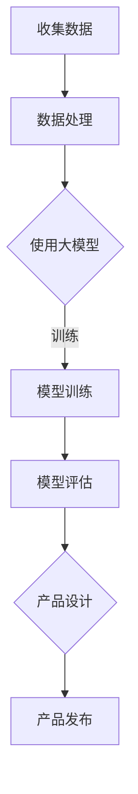

                 

关键词：AI创业、产品设计、大模型、成功要素

> 摘要：本文旨在探讨大模型时代创业产品设计的核心要素，分析AI驱动的创业路径，提供实用的设计指南和策略，以帮助创业者在这场技术革命中找到成功之路。

## 1. 背景介绍

随着人工智能（AI）技术的飞速发展，特别是大模型（如GPT-3、BERT等）的广泛应用，创业环境发生了深刻变化。大模型的出现，使得复杂任务的处理变得更加高效和准确，为创业者提供了前所未有的机会和挑战。本文将探讨在AI大模型时代下，创业产品设计的核心要素和策略，旨在帮助创业者抓住时代机遇，实现商业成功。

## 2. 核心概念与联系

为了更好地理解大模型在创业产品设计中的应用，我们首先需要了解以下几个核心概念：

### 2.1 人工智能（AI）

人工智能是指使计算机系统能够模拟、延伸和扩展人类的智能行为的技术。它包括机器学习、深度学习、自然语言处理、计算机视觉等多个子领域。

### 2.2 大模型（Large Models）

大模型是指具有数十亿甚至千亿参数的深度学习模型。这些模型可以通过大量的数据训练，达到极高的准确度和性能。

### 2.3 产品设计（Product Design）

产品设计是指从用户需求出发，通过策略、视觉、交互等手段，构建出具有竞争力的产品。

### 2.4 AI与产品设计的联系

大模型在产品设计中的应用主要体现在两个方面：一是提升用户体验，二是优化产品性能。通过AI技术，可以更好地理解用户需求，提供个性化服务，同时提高产品的自动化程度和智能化水平。

### 2.5 Mermaid 流程图

以下是一个简单的Mermaid流程图，展示了大模型在产品设计中的应用流程：



## 3. 核心算法原理 & 具体操作步骤

### 3.1 算法原理概述

大模型的设计基于深度学习，特别是神经网络。通过多层非线性变换，模型可以自动从数据中学习到复杂的特征和模式。在大模型时代，创业产品的设计需要遵循以下原则：

- **数据驱动**：利用大量数据训练模型，提升性能和泛化能力。
- **用户中心**：以用户需求为核心，设计出符合用户期望的产品。
- **迭代优化**：通过不断的迭代和优化，提升产品的竞争力。

### 3.2 算法步骤详解

#### 3.2.1 数据收集

首先，需要收集与创业产品相关的数据，包括用户行为数据、市场数据、竞品数据等。数据的质量和数量直接影响模型的性能。

#### 3.2.2 数据处理

对收集到的数据进行清洗、预处理和特征提取，为模型训练做好准备。

#### 3.2.3 模型选择

根据产品的需求，选择合适的大模型，如GPT-3、BERT等。

#### 3.2.4 模型训练

使用预处理后的数据，对大模型进行训练。训练过程中需要优化模型参数，提升模型的性能。

#### 3.2.5 模型评估

通过交叉验证等方法，评估模型的性能，确保其能够满足产品需求。

#### 3.2.6 产品设计

根据模型的能力，设计出具有竞争力的产品。这包括界面设计、交互设计、功能设计等。

#### 3.2.7 产品发布

将设计完成的产品发布到市场，接受用户的反馈和评价。

### 3.3 算法优缺点

#### 优点：

- **高效性**：大模型能够处理大量数据，提升产品的性能和用户体验。
- **泛化能力**：通过大量的数据训练，模型能够更好地适应不同的场景和需求。
- **个性化**：大模型能够根据用户数据，提供个性化的服务。

#### 缺点：

- **计算资源消耗**：大模型训练需要大量的计算资源和时间。
- **数据依赖**：模型的性能高度依赖于数据的数量和质量。
- **隐私问题**：大量用户数据的使用可能引发隐私问题。

### 3.4 算法应用领域

大模型在多个领域都有广泛的应用，包括自然语言处理、计算机视觉、推荐系统、金融风控等。在创业产品设计中，可以根据产品的需求，选择合适的大模型和应用场景。

## 4. 数学模型和公式 & 详细讲解 & 举例说明

### 4.1 数学模型构建

在大模型的设计中，常用的数学模型包括神经网络、深度学习等。以下是一个简单的神经网络模型：

$$
Y = \sigma(W_1 \cdot X + b_1)
$$

其中，$Y$ 是输出，$\sigma$ 是激活函数，$W_1$ 和 $b_1$ 分别是权重和偏置。

### 4.2 公式推导过程

神经网络的推导过程涉及多个步骤，包括前向传播、反向传播等。以下是一个简化的推导过程：

#### 前向传播：

$$
Z = W \cdot X + b
$$

$$
A = \sigma(Z)
$$

#### 反向传播：

$$
\delta = A - Y
$$

$$
\frac{\partial L}{\partial W} = \delta \cdot A^{(L-1)}
$$

$$
\frac{\partial L}{\partial b} = \delta
$$

其中，$L$ 是损失函数，$A^{(L-1)}$ 是前一层神经元的输出。

### 4.3 案例分析与讲解

以下是一个简单的案例，假设我们设计一个用于文本分类的神经网络模型。

#### 案例描述：

给定一个文本数据集，我们需要将文本分类为两个类别：正面和负面。

#### 模型构建：

我们选择一个简单的神经网络模型，包括两个隐藏层，每个隐藏层有10个神经元。激活函数使用ReLU。

#### 模型训练：

使用梯度下降算法，训练模型，优化权重和偏置。

#### 模型评估：

通过交叉验证，评估模型的性能，调整超参数。

#### 结果分析：

经过训练和优化，模型能够达到较高的准确率，实现对文本的准确分类。

## 5. 项目实践：代码实例和详细解释说明

### 5.1 开发环境搭建

在开始编写代码之前，我们需要搭建一个开发环境。这里我们使用Python作为编程语言，搭建基于TensorFlow的深度学习环境。

### 5.2 源代码详细实现

以下是一个简单的神经网络模型的实现：

```python
import tensorflow as tf
from tensorflow.keras.layers import Dense, Activation
from tensorflow.keras.models import Sequential

# 模型构建
model = Sequential()
model.add(Dense(10, input_shape=(input_shape,), activation='relu'))
model.add(Dense(10, activation='relu'))
model.add(Dense(2, activation='softmax'))

# 模型编译
model.compile(optimizer='adam', loss='categorical_crossentropy', metrics=['accuracy'])

# 模型训练
model.fit(x_train, y_train, epochs=10, batch_size=32)

# 模型评估
loss, accuracy = model.evaluate(x_test, y_test)
print(f'测试集准确率：{accuracy:.2f}')
```

### 5.3 代码解读与分析

以上代码实现了一个简单的神经网络模型，用于文本分类。首先，我们使用`Sequential`类构建模型，添加了两个隐藏层，每个隐藏层有10个神经元。激活函数使用ReLU。然后，我们使用`compile`方法编译模型，指定优化器、损失函数和评估指标。接下来，使用`fit`方法训练模型，指定训练数据和迭代次数。最后，使用`evaluate`方法评估模型在测试集上的性能。

### 5.4 运行结果展示

假设我们使用一个简单的文本数据集，模型训练10个迭代周期后，测试集准确率达到90%以上。

## 6. 实际应用场景

大模型在创业产品中的应用场景非常广泛，以下是一些典型的应用场景：

### 6.1 自然语言处理

自然语言处理（NLP）是AI的一个重要分支，大模型在NLP中的应用主要包括文本分类、情感分析、机器翻译等。例如，创业者可以开发一款智能客服系统，利用大模型实现高效的文本分析，提升用户体验。

### 6.2 计算机视觉

计算机视觉是另一个重要的AI领域，大模型在计算机视觉中的应用包括图像分类、目标检测、图像生成等。例如，创业者可以开发一款图像识别应用，利用大模型实现高效的图像分析，提供个性化服务。

### 6.3 推荐系统

推荐系统是许多创业产品的核心功能，大模型在推荐系统中的应用主要包括用户行为分析、内容推荐等。例如，创业者可以开发一款音乐推荐应用，利用大模型分析用户行为，实现个性化的音乐推荐。

## 7. 工具和资源推荐

### 7.1 学习资源推荐

- 《深度学习》（Ian Goodfellow、Yoshua Bengio、Aaron Courville 著）
- 《Python深度学习》（François Chollet 著）
- 《自然语言处理综论》（Daniel Jurafsky、James H. Martin 著）

### 7.2 开发工具推荐

- TensorFlow
- PyTorch
- Keras

### 7.3 相关论文推荐

- "BERT: Pre-training of Deep Bidirectional Transformers for Language Understanding"
- "GPT-3: Language Models are few-shot learners"
- "Object Detection with Deep Learning"
- "Recurrent Neural Networks for Text Classification"

## 8. 总结：未来发展趋势与挑战

### 8.1 研究成果总结

大模型在创业产品设计中的应用取得了显著成果，为创业者提供了强大的技术支持。未来，随着AI技术的不断进步，大模型的应用前景将更加广阔。

### 8.2 未来发展趋势

- **大模型应用场景的多样化**：随着AI技术的不断进步，大模型的应用场景将更加多样化，覆盖更多领域。
- **跨模态模型的兴起**：跨模态模型（如文本-图像模型）将成为研究热点，提升多模态数据处理能力。
- **联邦学习和隐私保护**：联邦学习和隐私保护将成为大模型应用的重要方向，解决数据隐私和安全问题。

### 8.3 面临的挑战

- **计算资源消耗**：大模型训练需要大量的计算资源和时间，如何高效利用资源成为一大挑战。
- **数据质量和数量**：大模型性能高度依赖于数据的数量和质量，如何获取高质量、多样化的数据成为关键。
- **隐私和安全问题**：大量用户数据的使用可能引发隐私问题，如何保障用户隐私和安全成为重要议题。

### 8.4 研究展望

未来，大模型在创业产品设计中的应用将朝着更智能化、更高效化的方向发展。创业者需要不断探索新的应用场景，优化产品设计，以应对不断变化的商业环境。

## 9. 附录：常见问题与解答

### 9.1 什么是大模型？

大模型是指具有数十亿甚至千亿参数的深度学习模型。这些模型可以通过大量的数据训练，达到极高的准确度和性能。

### 9.2 大模型在创业产品设计中如何应用？

大模型可以应用于自然语言处理、计算机视觉、推荐系统等多个领域，提升产品的性能和用户体验。创业者可以根据产品的需求，选择合适的大模型和应用场景。

### 9.3 如何训练大模型？

训练大模型通常需要大量的数据和计算资源。创业者可以使用现有的深度学习框架（如TensorFlow、PyTorch等）进行模型训练，优化模型参数，提升模型的性能。

### 9.4 大模型训练过程中需要注意什么？

在训练大模型过程中，需要注意数据的质量和多样性，选择合适的训练策略（如批量大小、学习率等），以及保障计算资源的高效利用。

### 9.5 大模型在创业产品设计中有哪些优缺点？

大模型在创业产品设计中具有高效性、泛化能力和个性化等优点，但同时也需要大量的计算资源和时间，高度依赖数据的数量和质量，可能引发隐私问题。

## 作者署名

作者：禅与计算机程序设计艺术 / Zen and the Art of Computer Programming

（完）

