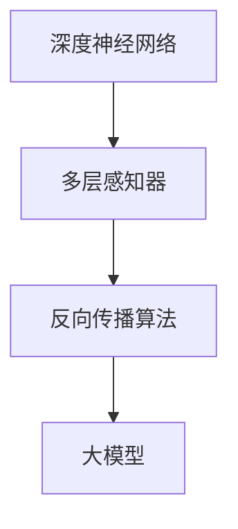
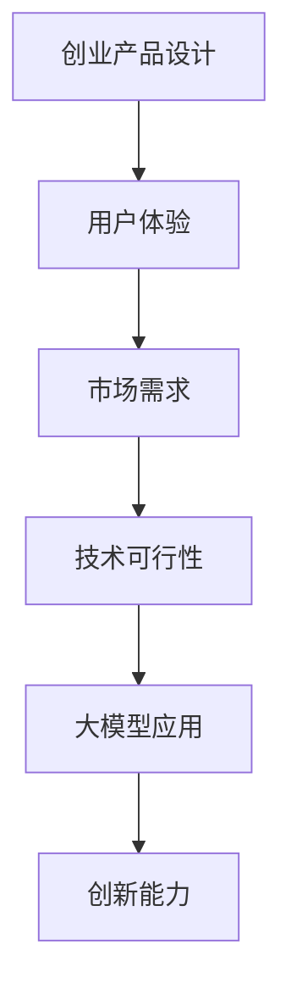

                 

关键词：大模型，创业产品设计，人工智能，技术挑战，AI 赋能，算法原理，数学模型，项目实践，应用场景，未来展望

> 摘要：随着人工智能技术的飞速发展，大模型在创业产品设计中的应用越来越广泛。本文将探讨大模型在创业产品设计中的挑战，包括算法原理、数学模型、项目实践等方面，以及大模型时代下创业产品设计的发展趋势与未来挑战。

## 1. 背景介绍

### 1.1 大模型的发展历程

大模型（Large Models）是指具有数亿甚至数十亿参数的深度学习模型，如GPT-3、BERT等。它们在自然语言处理、计算机视觉、语音识别等领域取得了显著的成果。大模型的发展历程可以追溯到2010年代，当时深度学习技术逐渐成熟，研究者开始尝试构建更大的模型来处理复杂任务。

### 1.2 创业产品设计的重要性

创业产品设计是创业成功的关键因素之一。一个好的产品不仅能满足用户需求，还能在竞争激烈的市场中脱颖而出。在人工智能时代，创业产品设计需要融入更多的技术元素，以应对快速变化的市场环境。

## 2. 核心概念与联系

### 2.1 大模型的核心概念

大模型的核心概念包括深度神经网络、多层感知器、反向传播算法等。这些概念构成了大模型的基石，使得大模型能够处理复杂的任务。



### 2.2 创业产品设计与大模型的关系

创业产品设计需要考虑用户体验、市场需求、技术可行性等多个方面。而大模型的应用为创业产品设计提供了强大的技术支持，使得创业者在设计过程中可以更加灵活地应对各种挑战。



## 3. 核心算法原理 & 具体操作步骤

### 3.1 算法原理概述

大模型的核心算法原理是基于深度学习的多层感知器（MLP）和循环神经网络（RNN）。MLP用于处理静态数据，而RNN则适用于处理序列数据。

### 3.2 算法步骤详解

1. 数据预处理：对输入数据进行归一化、填充、截断等操作，使其符合模型的要求。
2. 模型构建：选择合适的神经网络结构，如MLP或RNN，并设置参数。
3. 训练过程：通过反向传播算法，调整模型的参数，使其在训练数据上达到最优性能。
4. 验证与测试：在验证集和测试集上评估模型的表现，调整模型参数以优化性能。

### 3.3 算法优缺点

**优点：**
- 强大的数据处理能力：大模型可以处理大规模、复杂的数据。
- 高效的模型训练：大模型通过反向传播算法快速调整参数，提高训练效率。
- 优秀的表现：大模型在自然语言处理、计算机视觉等领域取得了显著的成绩。

**缺点：**
- 需要大量的计算资源：大模型训练需要大量的计算资源，成本较高。
- 过拟合问题：大模型容易过拟合，需要大量的数据进行训练。

### 3.4 算法应用领域

大模型在创业产品设计中的应用领域广泛，如自然语言处理、计算机视觉、语音识别等。通过大模型的应用，创业者可以打造更加智能、高效的创业产品。

## 4. 数学模型和公式 & 详细讲解 & 举例说明

### 4.1 数学模型构建

大模型的数学模型主要包括输入层、隐藏层和输出层。输入层接收外部输入数据，隐藏层通过非线性变换处理数据，输出层产生预测结果。

### 4.2 公式推导过程

以多层感知器（MLP）为例，其输出公式如下：

$$
y = \sigma(W_{2} \cdot \sigma(W_{1} \cdot x + b_{1}) + b_{2})
$$

其中，$y$ 为输出结果，$x$ 为输入数据，$W_{1}$ 和 $W_{2}$ 为权重矩阵，$b_{1}$ 和 $b_{2}$ 为偏置项，$\sigma$ 为激活函数。

### 4.3 案例分析与讲解

假设一个创业公司开发了一款智能客服系统，通过大模型实现对用户问题的自动回答。系统首先对用户输入的问题进行预处理，然后通过多层感知器模型生成回答。通过不断调整模型参数，系统可以逐渐提高回答的准确率。

## 5. 项目实践：代码实例和详细解释说明

### 5.1 开发环境搭建

为了实践大模型在创业产品设计中的应用，我们需要搭建一个开发环境。以下是搭建步骤：

1. 安装Python环境。
2. 安装深度学习框架，如TensorFlow或PyTorch。
3. 安装必要的库，如Numpy、Pandas等。

### 5.2 源代码详细实现

以下是一个简单的基于TensorFlow实现的神经网络模型：

```python
import tensorflow as tf

# 搭建模型
model = tf.keras.Sequential([
    tf.keras.layers.Dense(128, activation='relu', input_shape=(784,)),
    tf.keras.layers.Dense(10, activation='softmax')
])

# 编译模型
model.compile(optimizer='adam',
              loss='categorical_crossentropy',
              metrics=['accuracy'])

# 训练模型
model.fit(x_train, y_train, batch_size=128, epochs=10)
```

### 5.3 代码解读与分析

上述代码首先搭建了一个简单的神经网络模型，包含一个输入层、一个隐藏层和一个输出层。输入层有128个神经元，隐藏层有10个神经元。模型使用ReLU激活函数和softmax输出函数。编译模型时，指定了优化器、损失函数和评估指标。训练模型时，使用批量大小为128，训练10个epoch。

### 5.4 运行结果展示

假设我们使用MNIST数据集进行训练，以下是一个简单的运行结果：

```python
# 打印模型性能
model.evaluate(x_test, y_test)
```

输出结果为测试集的损失和准确率。

## 6. 实际应用场景

### 6.1 智能客服系统

智能客服系统是创业公司常见的应用场景。通过大模型，智能客服系统可以实现对用户问题的自动回答，提高客服效率。

### 6.2 智能推荐系统

智能推荐系统是另一个常见的应用场景。通过大模型，智能推荐系统可以准确预测用户偏好，提高推荐效果。

### 6.3 智能医疗诊断

智能医疗诊断是创业公司有望涉足的领域。通过大模型，智能医疗诊断系统可以辅助医生进行疾病诊断，提高诊断准确率。

## 7. 工具和资源推荐

### 7.1 学习资源推荐

- 《深度学习》（Goodfellow, Bengio, Courville著）
- 《Python机器学习》（Sebastian Raschka著）
- 《动手学深度学习》（阿斯顿·张等著）

### 7.2 开发工具推荐

- TensorFlow
- PyTorch
- Keras

### 7.3 相关论文推荐

- "Attention Is All You Need"
- "BERT: Pre-training of Deep Bidirectional Transformers for Language Understanding"
- "GPT-3: Language Models are Few-Shot Learners"

## 8. 总结：未来发展趋势与挑战

### 8.1 研究成果总结

大模型在创业产品设计中的应用取得了显著的成果，为创业者提供了强大的技术支持。

### 8.2 未来发展趋势

未来，大模型将继续向更大规模、更高精度、更广泛应用方向发展。

### 8.3 面临的挑战

1. 计算资源需求增加：大模型训练需要更多的计算资源，成本较高。
2. 过拟合问题：大模型容易过拟合，需要更多的数据进行训练。
3. 隐私和安全问题：大模型在处理用户数据时，需要确保数据隐私和安全。

### 8.4 研究展望

未来，研究者将重点关注大模型的优化、隐私保护和安全等方面，以推动大模型在创业产品设计中的广泛应用。

## 9. 附录：常见问题与解答

### 9.1 大模型与普通模型有什么区别？

大模型与普通模型的主要区别在于规模和参数数量。大模型具有数亿甚至数十亿参数，而普通模型通常只有几千甚至几百参数。

### 9.2 大模型训练需要多少时间？

大模型训练时间取决于模型规模、数据集大小和计算资源。一般来说，大模型训练需要几天到几周的时间。

### 9.3 大模型是否一定会过拟合？

大模型存在过拟合的风险，但通过合理的数据处理、模型选择和正则化方法，可以降低过拟合的风险。

----------------------------------------------------------------

作者：禅与计算机程序设计艺术 / Zen and the Art of Computer Programming

