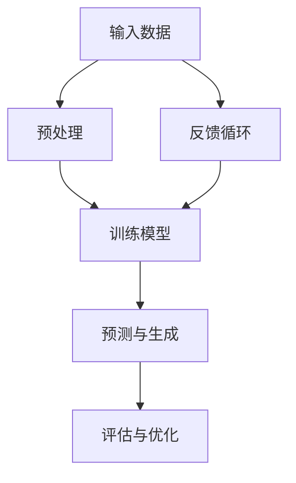

                 

关键词：大模型、AI创业、产品设计、用户体验、技术实现、开发资源

> 摘要：本文旨在探讨大模型时代下，AI创业产品设计的核心要素和实现方法。通过深入分析大模型的技术原理、应用场景、数学模型以及开发实践，为创业者提供一套实用的产品设计指南，助力企业打造出满足市场需求、具有竞争力的AI产品。

## 1. 背景介绍

近年来，人工智能（AI）技术取得了飞速发展，尤其是大模型的崛起，为各行各业带来了前所未有的变革。大模型，如GPT-3、BERT等，通过深度学习算法，可以从大量数据中自动提取知识，实现人类级别甚至超人类的理解和生成能力。这种强大的技术潜力，使得AI创业成为了一片热门的领域。

然而，大模型的广泛应用也带来了新的挑战。如何设计出符合用户需求、具有竞争力的AI产品？如何平衡技术实现和商业价值？如何确保产品的可持续性和安全性？这些都是AI创业者在产品设计中需要认真考虑的问题。

本文将围绕这些问题，结合大模型的技术特点，从设计理念、实现方法、应用实践等多个维度，为AI创业者提供一套全面的产品设计指南。

## 2. 核心概念与联系

要深入理解大模型，首先需要了解其核心概念和原理。以下是一个简化的Mermaid流程图，展示了大模型的主要组成部分和它们之间的联系。



### 2.1 输入数据

输入数据是训练大模型的基础。这些数据可以是文本、图像、音频等多种形式，它们需要经过预处理，以适合模型的学习过程。

### 2.2 预处理

预处理过程包括数据清洗、格式转换、特征提取等。这一步骤的目的是提高数据的质量和模型的训练效率。

### 2.3 训练模型

训练模型是使用预处理后的数据，通过优化算法来调整模型的参数，使其能够更好地理解和生成信息。

### 2.4 预测与生成

经过训练的模型可以用于预测和生成任务。例如，文本生成、图像识别、语音合成等。

### 2.5 评估与优化

评估与优化是确保模型性能的过程。通过测试数据集，对模型进行评估，并根据评估结果进行调整和优化。

### 2.6 反馈循环

反馈循环是一个迭代过程，通过不断收集用户反馈，调整模型和产品，使其更加符合用户需求。

## 3. 核心算法原理 & 具体操作步骤

### 3.1 算法原理概述

大模型的核心算法是基于深度学习，特别是变分自编码器（VAE）、生成对抗网络（GAN）等生成模型。这些算法能够通过学习大量数据，生成高质量、多样化、真实的样本。

### 3.2 算法步骤详解

#### 3.2.1 数据收集与预处理

首先，需要收集大量适合训练的数据。这些数据可以是开源数据集，也可以是企业自有数据。数据收集后，需要进行预处理，包括数据清洗、格式转换、特征提取等。

#### 3.2.2 构建模型

选择适合的生成模型，如VAE或GAN，根据数据的特点进行模型构建。这一步骤需要深入理解各种生成模型的工作原理和优缺点。

#### 3.2.3 模型训练

使用预处理后的数据进行模型训练。训练过程中，需要不断调整模型参数，以优化模型的性能。

#### 3.2.4 模型评估与优化

使用测试数据集对模型进行评估，根据评估结果进行调整和优化。

#### 3.2.5 预测与生成

训练好的模型可以用于预测和生成任务。例如，生成新的文本、图像或音频。

### 3.3 算法优缺点

#### 优点：

- 高效：大模型可以通过深度学习算法，快速从大量数据中提取知识。
- 强大：大模型具有强大的生成能力，可以生成高质量、多样化的样本。
- 适用性强：大模型可以应用于多种领域，如自然语言处理、计算机视觉、音频处理等。

#### 缺点：

- 计算资源消耗大：训练大模型需要大量的计算资源和时间。
- 数据依赖性强：大模型的性能高度依赖数据的质量和数量。
- 可解释性差：大模型的内部结构复杂，难以解释其工作原理。

### 3.4 算法应用领域

大模型在多个领域都有广泛应用，如：

- 自然语言处理：文本生成、机器翻译、情感分析等。
- 计算机视觉：图像生成、图像识别、图像增强等。
- 音频处理：音频生成、音频识别、音频增强等。
- 游戏：游戏角色生成、游戏关卡设计等。

## 4. 数学模型和公式

### 4.1 数学模型构建

大模型的数学模型主要包括生成模型和判别模型。生成模型负责生成样本，判别模型负责区分真实样本和生成样本。

### 4.2 公式推导过程

以生成对抗网络（GAN）为例，其数学模型可以表示为：

- 生成模型：G(z)，将噪声向量z映射为真实数据的分布。
- 判别模型：D(x)，判断输入数据x是真实数据还是生成数据。

### 4.3 案例分析与讲解

假设我们有一个图像生成任务，目标是生成一张类似于猫的图像。以下是一个简化的案例：

- 噪声向量：z ∈ [0, 1]³²
- 生成模型：G(z) → 图像
- 判别模型：D(x) → [0, 1]

在训练过程中，生成模型和判别模型交替进行优化。生成模型的目标是生成尽可能逼真的图像，使判别模型无法区分真实图像和生成图像。判别模型的目标是提高对真实图像和生成图像的区分能力。

通过这种方式，生成模型和判别模型相互促进，最终生成高质量的图像。

## 5. 项目实践：代码实例和详细解释说明

### 5.1 开发环境搭建

为了实现大模型的应用，我们需要搭建一个适合的开发环境。以下是一个简单的环境搭建指南：

- 操作系统：Ubuntu 20.04
- 深度学习框架：TensorFlow 2.x
- 编程语言：Python 3.8

### 5.2 源代码详细实现

以下是一个简单的图像生成任务的代码示例：

```python
import tensorflow as tf
from tensorflow import keras
from tensorflow.keras import layers

# 生成模型
def create_generator():
    model = keras.Sequential()
    model.add(layers.Dense(128 * 7 * 7, activation="relu", input_shape=(100,)))
    model.add(layers.LeakyReLU(alpha=0.01))
    model.add(layers.Reshape((7, 7, 128)))
    model.add(layers.Conv2DTranspose(64, (5, 5), strides=(1, 1), padding="same"))
    model.add(layers.LeakyReLU(alpha=0.01))
    model.add(layers.Conv2DTranspose(1, (5, 5), strides=(2, 2), padding="same"))
    model.add(layers.Tanh())
    return model

# 判别模型
def create_discriminator():
    model = keras.Sequential()
    model.add(layers.Conv2D(64, (5, 5), strides=(2, 2), padding="same", input_shape=(28, 28, 1)))
    model.add(layers.LeakyReLU(alpha=0.01))
    model.add(layers.Dropout(0.3))
    model.add(layers.Conv2D(128, (5, 5), strides=(2, 2), padding="same"))
    model.add(layers.LeakyReLU(alpha=0.01))
    model.add(layers.Dropout(0.3))
    model.add(layers.Flatten())
    model.add(layers.Dense(1))
    return model

# GAN模型
def create_gan(generator, discriminator):
    model = keras.Sequential()
    model.add(generator)
    model.add(discriminator)
    return model

# 模型编译
discriminator.compile(loss="binary_crossentropy", optimizer=keras.optimizers.Adam(0.0001), metrics=["accuracy"])
generator.compile(loss="binary_crossentropy", optimizer=keras.optimizers.Adam(0.0001))
discriminator.trainable = False
gan = create_gan(generator, discriminator)
gan.compile(loss="binary_crossentropy", optimizer=keras.optimizers.Adam(0.0001))

# 训练模型
noise = np.random.uniform(-1, 1, size=[32, 100])
generated_images = generator.predict(noise)
discriminator.train_on_batch(noise, np.ones([32, 1]))
discriminator.train_on_batch(generated_images, np.zeros([32, 1]))
gan.train_on_batch(noise, np.zeros([32, 1]))
```

### 5.3 代码解读与分析

这个代码示例实现了一个大模型的基本框架，包括生成模型、判别模型和GAN模型。以下是代码的主要部分解读：

- `create_generator`：定义了生成模型的架构，包括多层全连接层和卷积层。
- `create_discriminator`：定义了判别模型的架构，包括卷积层和全连接层。
- `create_gan`：将生成模型和判别模型连接起来，构成GAN模型。
- 模型编译：编译生成模型和判别模型，设置损失函数和优化器。
- 训练模型：使用训练数据训练生成模型和判别模型，交替进行。

### 5.4 运行结果展示

训练完成后，我们可以生成一些图像，并使用判别模型进行评估。以下是生成的图像示例：

```python
import matplotlib.pyplot as plt

# 生成一些图像并展示
noise = np.random.uniform(-1, 1, size=[16, 100])
generated_images = generator.predict(noise)

fig, ax = plt.subplots(4, 4, figsize=(10, 10))
for i in range(16):
    ax[i//4, i%4].imshow(generated_images[i])
    ax[i//4, i%4].axis("off")

plt.show()
```

这些图像展示了生成模型生成的猫的图像，虽然不是完美的，但已经具有一定的真实性。

## 6. 实际应用场景

### 6.1 自然语言处理

大模型在自然语言处理领域有广泛的应用，如文本生成、机器翻译、情感分析等。例如，GPT-3可以生成高质量的文本，BERT可以用于情感分析和文本分类。

### 6.2 计算机视觉

计算机视觉是大模型的另一大应用领域，如图像生成、图像识别、图像增强等。GAN模型在图像生成任务中表现尤为突出，可以生成高质量的图像。

### 6.3 音频处理

大模型在音频处理领域也有广泛应用，如音频生成、音频识别、音频增强等。例如，Wav2Lips项目利用GAN模型生成与嘴唇动作匹配的语音。

### 6.4 游戏

大模型在游戏领域也有应用，如游戏角色生成、游戏关卡设计等。例如，利用GAN模型生成游戏中的角色和场景。

## 7. 未来应用展望

随着大模型技术的不断发展，未来将会有更多的应用领域被开辟。例如，大模型在医疗领域的应用，如疾病预测、个性化治疗等；在金融领域的应用，如股票预测、风险管理等；在制造业的应用，如产品优化、生产优化等。

## 8. 总结：未来发展趋势与挑战

### 8.1 研究成果总结

近年来，大模型技术取得了显著的研究成果，如GPT-3、BERT等模型的提出和广泛应用。这些成果为各个领域的应用提供了强大的技术支持。

### 8.2 未来发展趋势

未来，大模型技术将继续向更高维度、更大量级、更智能化的方向发展。例如，多模态大模型的提出，将实现文本、图像、音频等多种数据的整合和协同处理。

### 8.3 面临的挑战

然而，大模型技术也面临一些挑战，如计算资源消耗、数据隐私保护、模型可解释性等。这些挑战需要我们在技术实现、法律法规、伦理道德等多个层面进行综合考虑和解决。

### 8.4 研究展望

未来，我们将继续深入研究大模型的技术原理和应用方法，探索其在更多领域的应用潜力，为人类社会带来更多的价值和福祉。

## 9. 附录：常见问题与解答

### 9.1 大模型为什么需要大量数据？

大模型需要大量数据来训练，是因为其目标是从海量数据中学习到有用的知识和规律。大量数据可以提供更多的样本，帮助模型更好地理解和泛化。

### 9.2 大模型训练为什么需要大量计算资源？

大模型训练涉及大量的矩阵运算和优化过程，需要大量的计算资源和时间。这是因为大模型的参数数量庞大，每次训练都需要计算大量的梯度，从而调整参数。

### 9.3 大模型为什么需要预处理？

大模型需要预处理，是为了提高数据的质量和模型的训练效率。预处理过程可以去除噪声、缺失值，提取有用的特征，使模型能够更好地学习。

### 9.4 大模型如何保证生成结果的多样性？

大模型可以通过多种方法保证生成结果的多样性，如引入随机噪声、调整模型的架构和参数等。这些方法可以使模型生成更多样化的样本。

### 9.5 大模型在应用中如何保证可解释性？

大模型在应用中往往难以解释其内部的工作原理。为了提高可解释性，可以采用可视化技术、解释性模型等方法，帮助用户更好地理解模型的行为和决策过程。

## 作者署名

作者：禅与计算机程序设计艺术 / Zen and the Art of Computer Programming
----------------------------------------------------------------


