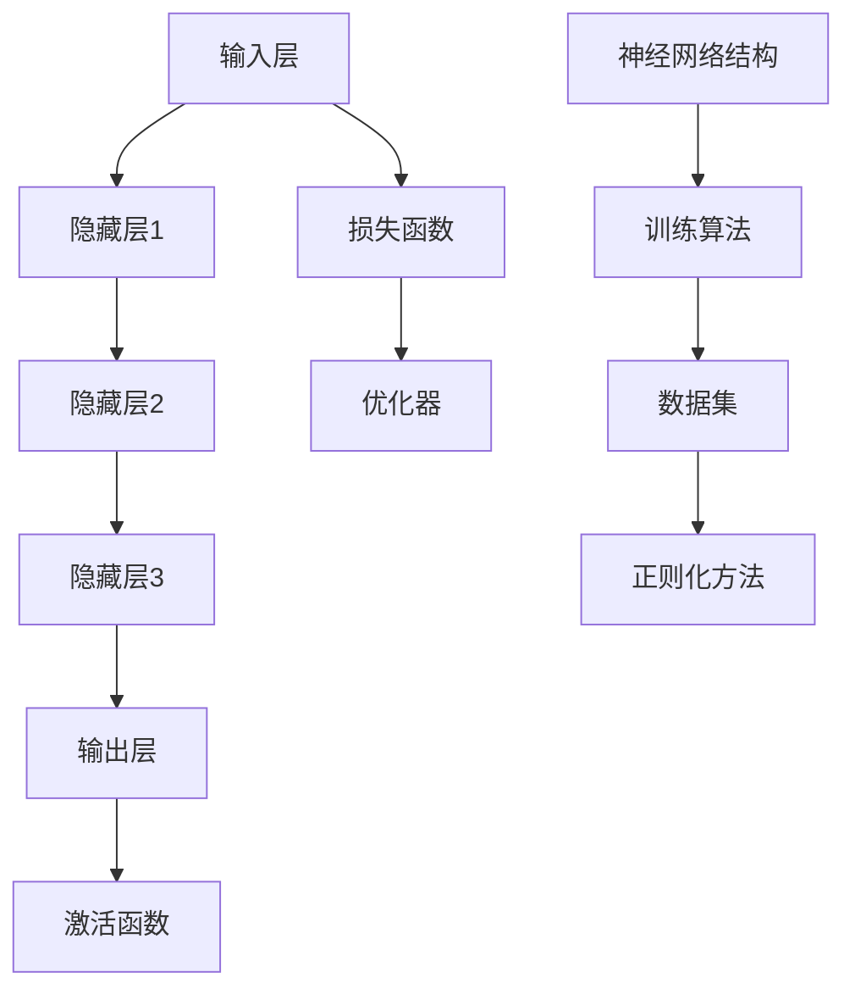

                 

随着人工智能（AI）技术的不断进步，大模型已经成为推动科技创新和产业变革的重要力量。本文旨在探讨大模型时代下的AI创业产品趋势，分析其核心概念、算法原理、应用场景及未来发展方向，为创业者提供有价值的参考。

## 文章关键词
- 人工智能
- 大模型
- 创业产品
- 趋势分析
- 技术创新

## 文章摘要
本文将首先介绍大模型的概念及其在AI领域的重要性，随后分析大模型的核心算法原理、数学模型，并通过具体实例阐述大模型在创业产品中的应用实践。最后，文章将探讨大模型时代的未来发展趋势及其面临的挑战，为读者提供全方位的视角。

## 1. 背景介绍

在过去的几十年里，人工智能技术经历了从规则驱动到数据驱动，再到当前的大模型驱动的演变。早期的AI系统依赖于预定义的规则和算法，而随着计算能力的提升和海量数据的出现，基于深度学习的大模型逐渐成为主流。

大模型，尤其是近年来出现的大型语言模型、图像模型等，具有参数数量巨大、计算复杂度高、泛化能力强的特点。例如，GPT-3拥有超过1750亿个参数，可以生成连贯的自然语言文本；BERT模型在处理文本数据时，表现出色，广泛应用于搜索引擎、问答系统等。

大模型的出现，不仅提高了AI系统的性能和效率，也为创业者在产品创新方面提供了新的思路和方向。在AI创业领域，大模型的运用已经成为一种趋势，它正深刻地改变着各个行业，从金融、医疗、教育到娱乐、零售等，都在积极拥抱这一技术变革。

## 2. 核心概念与联系

### 2.1 大模型的概念

大模型，即大规模的人工神经网络模型，其核心思想是通过训练大量参数来捕捉数据中的复杂结构和规律。与传统的小型模型相比，大模型具有以下几个显著特点：

- **参数规模巨大**：大模型拥有数百万甚至数十亿个参数，这使得模型能够捕捉到数据中的微小变化。
- **计算复杂度高**：由于参数数量庞大，大模型的训练和推理过程需要大量的计算资源。
- **泛化能力强**：通过大量的数据训练，大模型能够更好地泛化到未见过的数据上，提高模型的实际应用价值。

### 2.2 大模型的核心算法原理

大模型的核心算法主要基于深度学习，特别是基于大规模数据集的监督学习。深度学习是一种通过多层神经网络对数据进行建模和预测的方法。其基本原理包括：

- **输入层**：接收输入数据，并将其传递到下一层。
- **隐藏层**：对输入数据进行特征提取和变换，逐层抽象出更高级的特征。
- **输出层**：根据隐藏层输出的特征进行预测或分类。

### 2.3 大模型的架构

大模型的架构通常包括以下几个部分：

- **神经网络结构**：如卷积神经网络（CNN）、循环神经网络（RNN）、Transformer等。
- **训练算法**：如随机梯度下降（SGD）、Adam优化器等。
- **激活函数**：如ReLU、Sigmoid、Tanh等，用于增加网络的非线性。
- **损失函数**：如交叉熵损失、均方误差（MSE）等，用于评估模型的预测误差。

### 2.4 大模型与现有技术的联系

大模型与现有技术，如传统机器学习、自然语言处理（NLP）、计算机视觉（CV）等，有着紧密的联系。一方面，大模型借鉴了传统机器学习的思想，如优化算法、正则化方法等；另一方面，大模型在NLP和CV等领域的突破，也为这些领域带来了新的发展机遇。

例如，在NLP领域，大模型如BERT、GPT等已经显著提高了文本分类、机器翻译、问答系统等任务的性能。在CV领域，大模型如ResNet、EfficientNet等，通过深层网络结构和高效的计算方法，实现了图像分类、目标检测、图像生成等任务的突破。

下面是一个使用Mermaid绘制的关于大模型架构的流程图：



## 3. 核心算法原理 & 具体操作步骤

### 3.1 算法原理概述

大模型的算法原理主要基于深度学习的思想，通过多层神经网络对数据进行建模。深度学习的基本过程包括以下步骤：

1. **数据预处理**：对输入数据进行清洗、标准化等处理，以便模型更好地训练。
2. **模型初始化**：初始化神经网络参数，如权重和偏置。
3. **前向传播**：将输入数据传递到网络中，通过各层的非线性变换，最终得到输出。
4. **计算损失**：通过损失函数计算输出结果与真实标签之间的误差。
5. **反向传播**：将误差反向传播到网络的各层，更新网络参数。
6. **优化参数**：使用优化算法（如SGD、Adam等）调整网络参数，减少损失。

### 3.2 算法步骤详解

1. **数据预处理**：
   - 清洗数据：去除噪声、异常值等。
   - 标准化数据：将数据缩放到相同范围，如[0, 1]或[-1, 1]。
   - 分割数据集：将数据集分为训练集、验证集和测试集。

2. **模型初始化**：
   - 权重初始化：可以使用随机初始化、高斯分布等。
   - 偏置初始化：通常设置为0或小的常数。

3. **前向传播**：
   - 将输入数据传递到网络的输入层。
   - 通过各层的非线性变换，如ReLU、Sigmoid等。
   - 将隐藏层的输出传递到下一层，直至输出层。

4. **计算损失**：
   - 使用损失函数（如交叉熵、均方误差等）计算输出结果与真实标签之间的误差。
   - 损失值越小，表示模型预测结果越接近真实值。

5. **反向传播**：
   - 将损失值反向传播到网络的各层。
   - 使用梯度下降等优化算法，更新网络参数。

6. **优化参数**：
   - 根据反向传播的梯度信息，使用优化算法调整网络参数。
   - 更新模型权重和偏置。

### 3.3 算法优缺点

**优点**：

- **强大的泛化能力**：通过大量数据训练，大模型能够更好地泛化到未见过的数据上。
- **灵活的架构**：大模型可以应用于多种任务，如分类、回归、生成等。
- **高效的处理能力**：大模型在处理大规模数据时，表现出较高的效率和准确性。

**缺点**：

- **计算复杂度高**：大模型的训练和推理过程需要大量的计算资源。
- **对数据需求量大**：大模型需要大量高质量的数据进行训练，否则可能导致过拟合。
- **可解释性差**：大模型内部参数众多，使得模型难以解释和理解。

### 3.4 算法应用领域

大模型的应用领域非常广泛，包括但不限于以下几个方面：

- **自然语言处理（NLP）**：如文本分类、机器翻译、问答系统等。
- **计算机视觉（CV）**：如图像分类、目标检测、图像生成等。
- **语音识别**：如语音合成、语音识别等。
- **推荐系统**：如个性化推荐、商品推荐等。
- **游戏AI**：如游戏策略、角色控制等。

## 4. 数学模型和公式 & 详细讲解 & 举例说明

### 4.1 数学模型构建

大模型的数学模型主要基于多层感知机（MLP）和卷积神经网络（CNN）等架构。以下是一个简单的多层感知机模型：

$$
\begin{aligned}
    z_1 &= W_1 \cdot x + b_1 \\
    a_1 &= \sigma(z_1) \\
    z_2 &= W_2 \cdot a_1 + b_2 \\
    a_2 &= \sigma(z_2) \\
    \hat{y} &= W_3 \cdot a_2 + b_3
\end{aligned}
$$

其中，$x$ 是输入向量，$W_1, W_2, W_3$ 是权重矩阵，$b_1, b_2, b_3$ 是偏置向量，$\sigma$ 是激活函数（如ReLU、Sigmoid等），$\hat{y}$ 是输出向量。

### 4.2 公式推导过程

以多层感知机为例，我们首先定义输入层、隐藏层和输出层的节点数分别为 $n_1, n_2, n_3$。输入向量为 $x \in \mathbb{R}^{n_1}$，隐藏层输出为 $a_1 \in \mathbb{R}^{n_2}$，输出层输出为 $a_2 \in \mathbb{R}^{n_3}$。

1. **输入层到隐藏层的变换**：

$$
z_1 = W_1 \cdot x + b_1
$$

2. **隐藏层到隐藏层的变换**：

$$
z_2 = W_2 \cdot a_1 + b_2
$$

3. **输出层到隐藏层的变换**：

$$
\hat{y} = W_3 \cdot a_2 + b_3
$$

4. **激活函数**：

$$
a_1 = \sigma(z_1) \\
a_2 = \sigma(z_2)
$$

其中，$\sigma$ 是激活函数，常用的有ReLU、Sigmoid、Tanh等。

### 4.3 案例分析与讲解

假设我们有一个二分类问题，输入层节点数为10，隐藏层节点数为5，输出层节点数为1。我们使用ReLU作为激活函数。

1. **初始化参数**：

$$
W_1 \in \mathcal{R}^{10 \times 5}, b_1 \in \mathcal{R}^{5}, W_2 \in \mathcal{R}^{5 \times 5}, b_2 \in \mathcal{R}^{5}, W_3 \in \mathcal{R}^{5 \times 1}, b_3 \in \mathcal{R}^{1}
$$

2. **前向传播**：

$$
z_1 = W_1 \cdot x + b_1 \\
a_1 = \max(0, z_1) \\
z_2 = W_2 \cdot a_1 + b_2 \\
a_2 = \max(0, z_2) \\
\hat{y} = W_3 \cdot a_2 + b_3
$$

3. **计算损失**：

$$
L = -\sum_{i=1}^{m} y_i \cdot \log(\hat{y}_i) + (1 - y_i) \cdot \log(1 - \hat{y}_i)
$$

其中，$m$ 是样本数量，$y_i$ 是真实标签，$\hat{y}_i$ 是预测概率。

4. **反向传播**：

$$
\frac{\partial L}{\partial W_3} = \frac{\partial L}{\partial \hat{y}} \cdot \frac{\partial \hat{y}}{\partial W_3} = (1 - \hat{y}) \cdot a_2 \\
\frac{\partial L}{\partial b_3} = \frac{\partial L}{\partial \hat{y}} \cdot \frac{\partial \hat{y}}{\partial b_3} = (1 - \hat{y}) \cdot a_2 \\
\frac{\partial L}{\partial W_2} = \frac{\partial L}{\partial z_2} \cdot \frac{\partial z_2}{\partial W_2} = (1 - a_2) \cdot W_3 \cdot (1 - a_1) \cdot x \\
\frac{\partial L}{\partial b_2} = \frac{\partial L}{\partial z_2} \cdot \frac{\partial z_2}{\partial b_2} = (1 - a_2) \cdot W_3 \cdot (1 - a_1) \\
\frac{\partial L}{\partial W_1} = \frac{\partial L}{\partial z_1} \cdot \frac{\partial z_1}{\partial W_1} = (1 - \sigma(z_1)) \cdot W_2 \cdot (1 - \sigma(z_2)) \cdot x \\
\frac{\partial L}{\partial b_1} = \frac{\partial L}{\partial z_1} \cdot \frac{\partial z_1}{\partial b_1} = (1 - \sigma(z_1)) \cdot W_2 \cdot (1 - \sigma(z_2))
$$

5. **更新参数**：

$$
W_1 = W_1 - \alpha \cdot \frac{\partial L}{\partial W_1} \\
b_1 = b_1 - \alpha \cdot \frac{\partial L}{\partial b_1} \\
W_2 = W_2 - \alpha \cdot \frac{\partial L}{\partial W_2} \\
b_2 = b_2 - \alpha \cdot \frac{\partial L}{\partial b_2} \\
W_3 = W_3 - \alpha \cdot \frac{\partial L}{\partial W_3} \\
b_3 = b_3 - \alpha \cdot \frac{\partial L}{\partial b_3}
$$

其中，$\alpha$ 是学习率。

## 5. 项目实践：代码实例和详细解释说明

### 5.1 开发环境搭建

在本文的实践部分，我们将使用Python和PyTorch框架来搭建一个简单的多层感知机模型。以下是搭建开发环境的基本步骤：

1. **安装Python**：确保已经安装了Python 3.7或更高版本。
2. **安装PyTorch**：在命令行中运行以下命令：

   ```
   pip install torch torchvision
   ```

3. **验证安装**：在Python中运行以下代码，验证PyTorch是否安装成功：

   ```python
   import torch
   import torchvision
   print(torch.__version__)
   print(torchvision.__version__)
   ```

### 5.2 源代码详细实现

以下是使用PyTorch实现多层感知机模型的源代码：

```python
import torch
import torch.nn as nn
import torch.optim as optim

# 定义多层感知机模型
class MLP(nn.Module):
    def __init__(self, input_size, hidden_size, output_size):
        super(MLP, self).__init__()
        self.fc1 = nn.Linear(input_size, hidden_size)
        self.relu = nn.ReLU()
        self.fc2 = nn.Linear(hidden_size, output_size)
    
    def forward(self, x):
        out = self.fc1(x)
        out = self.relu(out)
        out = self.fc2(out)
        return out

# 参数设置
input_size = 10
hidden_size = 5
output_size = 1
learning_rate = 0.01
num_epochs = 100

# 初始化模型、损失函数和优化器
model = MLP(input_size, hidden_size, output_size)
criterion = nn.BCELoss()
optimizer = optim.SGD(model.parameters(), lr=learning_rate)

# 数据集准备（示例）
x = torch.randn(64, input_size)  # 生成64个随机输入样本
y = torch.randn(64, output_size)  # 生成64个随机标签

# 训练模型
for epoch in range(num_epochs):
    model.zero_grad()
    outputs = model(x)
    loss = criterion(outputs, y)
    loss.backward()
    optimizer.step()
    if (epoch + 1) % 10 == 0:
        print(f'Epoch [{epoch+1}/{num_epochs}], Loss: {loss.item():.4f}')

# 保存模型
torch.save(model.state_dict(), 'mlp.pth')
```

### 5.3 代码解读与分析

1. **模型定义**：
   - `MLP` 类继承自 `nn.Module`，这是PyTorch中的基础模型类。
   - `__init__` 方法中，我们定义了两个全连接层 `fc1` 和 `fc2`，以及ReLU激活函数 `relu`。

2. **前向传播**：
   - `forward` 方法定义了数据在前向传播过程中经过的路径。输入数据首先通过第一个全连接层 `fc1`，然后经过ReLU激活函数 `relu`，最后通过第二个全连接层 `fc2` 生成输出。

3. **损失函数和优化器**：
   - 使用 `nn.BCELoss()` 定义二元交叉熵损失函数，适用于二分类问题。
   - 使用 `optim.SGD()` 定义随机梯度下降优化器，设置学习率为 `0.01`。

4. **训练过程**：
   - 模型在一个包含64个随机输入样本和标签的数据集上进行训练。
   - 在每个训练epoch中，模型会计算损失值、反向传播梯度并更新参数。

5. **模型保存**：
   - 将训练好的模型参数保存到文件 `mlp.pth`，便于后续加载和使用。

### 5.4 运行结果展示

在完成代码编写和测试后，我们可以在终端中运行以下命令来训练模型：

```
python mlp_train.py
```

训练过程中，会打印每个epoch的损失值，以监控模型训练的进展。最终，模型将被保存到 `mlp.pth` 文件中。

## 6. 实际应用场景

大模型在创业产品中的应用已经相当广泛，以下是一些典型应用场景：

### 6.1 自然语言处理（NLP）

- **文本分类**：利用大模型进行新闻、社交媒体等文本数据的自动分类，应用于信息过滤、舆情分析等领域。
- **机器翻译**：大模型如GPT-3已经展示了在机器翻译中的强大能力，可用于实现实时翻译、自动摘要等功能。
- **问答系统**：通过大模型构建智能问答系统，应用于客服、教育等领域。

### 6.2 计算机视觉（CV）

- **图像分类**：大模型可以高效地进行图像分类，应用于安防监控、医疗诊断等领域。
- **目标检测**：如YOLO、SSD等大模型在目标检测任务中表现出色，广泛应用于自动驾驶、视频监控等领域。
- **图像生成**：大模型如GAN（生成对抗网络）可以生成逼真的图像，应用于游戏设计、艺术创作等领域。

### 6.3 语音识别

- **语音识别**：大模型在语音识别任务中具有很高的准确率，应用于智能客服、语音助手等领域。
- **语音合成**：大模型如WaveNet在语音合成任务中表现优异，可用于实现自然流畅的语音输出。

### 6.4 其他领域

- **推荐系统**：大模型在推荐系统中的应用，可以更准确地预测用户喜好，提高推荐质量。
- **游戏AI**：大模型可以构建智能化的游戏对手，提高游戏体验和竞技水平。
- **金融风控**：大模型在金融风控中的应用，可以更准确地识别和预测风险，提高金融安全。

## 7. 未来应用展望

随着大模型技术的不断发展，未来其在各个领域中的应用将更加广泛和深入。以下是一些可能的发展趋势：

### 7.1 更高效的大模型

- **模型压缩**：通过模型剪枝、量化等方法，降低大模型的参数规模和计算复杂度，提高模型在资源受限环境中的应用性能。
- **分布式训练**：利用分布式计算资源进行大模型的训练，加速模型训练过程，降低训练成本。

### 7.2 更智能的交互

- **多模态交互**：结合语音、图像、文本等多模态数据，实现更加自然和智能的人机交互。
- **个性化服务**：通过分析用户行为和偏好，提供更加个性化的服务和推荐。

### 7.3 更广泛的产业应用

- **智能制造**：大模型在智能制造中的应用，可以优化生产流程、提高生产效率。
- **智慧城市**：大模型在智慧城市中的应用，可以提升城市管理和公共服务水平。

## 8. 工具和资源推荐

### 8.1 学习资源推荐

- **书籍**：
  - 《深度学习》（Goodfellow, Bengio, Courville）——深度学习领域的经典教材。
  - 《动手学深度学习》——适合初学者的实践导向教材。
- **在线课程**：
  - Coursera的《深度学习》课程——由吴恩达教授主讲。
  - Udacity的《深度学习纳米学位》——提供动手实践机会。

### 8.2 开发工具推荐

- **框架**：
  - PyTorch——广泛应用于深度学习研究和应用的框架。
  - TensorFlow——Google推出的开源深度学习框架。
- **环境**：
  - Google Colab——免费的在线Jupyter Notebook环境，适合进行深度学习实验。
  - AWS SageMaker——提供全面的机器学习服务，适用于模型训练和部署。

### 8.3 相关论文推荐

- **基础论文**：
  - “A Theoretical Analysis of the Vulnerability of Neural Networks to Adversarial Examples”（Goodfellow et al., 2014）——关于神经网络对抗攻击的研究。
  - “Generative Adversarial Nets”（Goodfellow et al., 2014）——关于生成对抗网络（GAN）的论文。
- **最新研究**：
  - “BERT: Pre-training of Deep Bidirectional Transformers for Language Understanding”（Devlin et al., 2019）——BERT模型的提出。
  - “GPT-3: Language Models are few-shot learners”（Brown et al., 2020）——GPT-3模型的提出。

## 9. 总结：未来发展趋势与挑战

### 9.1 研究成果总结

大模型技术的发展取得了显著的成果，其在自然语言处理、计算机视觉、语音识别等领域的应用已经取得了突破性进展。大模型不仅提高了AI系统的性能和效率，也为创业者在产品创新方面提供了新的思路和方向。

### 9.2 未来发展趋势

- **更高效的大模型**：通过模型压缩、分布式训练等技术，实现大模型在资源受限环境中的应用。
- **更智能的交互**：结合多模态数据，实现更加自然和智能的人机交互。
- **更广泛的产业应用**：大模型将在智能制造、智慧城市等领域发挥更大的作用。

### 9.3 面临的挑战

- **计算资源需求**：大模型的训练和推理过程需要大量的计算资源，如何高效地利用现有资源仍是一个挑战。
- **数据隐私和安全**：在大模型训练和应用过程中，如何保护用户数据隐私和安全是一个重要问题。
- **模型解释性**：大模型内部参数众多，如何提高模型的解释性和可解释性，使其更易于被用户理解和使用。

### 9.4 研究展望

未来，大模型技术将继续发展，并在更多领域得到应用。同时，研究者也将致力于解决大模型面临的挑战，如提高计算效率、保护数据隐私、增强模型解释性等。这将为AI技术的发展带来新的机遇和挑战。

## 附录：常见问题与解答

### 1. 什么是大模型？

大模型是指参数规模巨大、计算复杂度高、泛化能力强的神经网络模型。常见的如GPT-3、BERT等，其参数数量达到数十亿级别。

### 2. 大模型的训练过程是怎样的？

大模型的训练过程主要包括数据预处理、模型初始化、前向传播、计算损失、反向传播和参数优化等步骤。通过迭代这个过程，模型不断调整内部参数，提高预测性能。

### 3. 大模型有哪些优缺点？

大模型的优点包括强大的泛化能力、灵活的架构和高效的处理能力。缺点则包括计算复杂度高、对数据需求量大和可解释性差。

### 4. 大模型在哪些领域有应用？

大模型在自然语言处理、计算机视觉、语音识别、推荐系统、游戏AI等领域有广泛应用。如文本分类、机器翻译、图像分类、目标检测、语音合成等任务。

### 5. 如何优化大模型的性能？

优化大模型性能的方法包括模型压缩、分布式训练、正则化方法等。通过这些方法，可以提高模型的计算效率、降低过拟合风险和提高预测性能。

### 6. 大模型训练时需要注意什么？

大模型训练时需要注意数据质量、训练策略、超参数设置等方面。如选择合适的数据集、合理调整学习率、使用适当的优化器等。

### 7. 大模型的研究方向有哪些？

大模型的研究方向包括模型压缩、分布式训练、多模态交互、模型解释性、安全与隐私等。这些方向为AI技术的发展提供了新的机遇和挑战。

