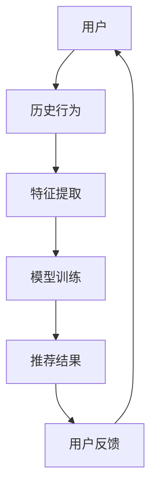

                 

关键词：大模型、个性化推荐、机器学习、算法、数学模型、实践应用

> 摘要：本文探讨了使用大模型直接生成个性化推荐结果的可能性。通过介绍核心概念、算法原理、数学模型以及项目实践，分析了大模型在个性化推荐领域的应用前景和面临的挑战。

## 1. 背景介绍

个性化推荐系统是一种根据用户的历史行为、兴趣偏好等信息，向用户推荐符合其兴趣的内容、商品或服务的系统。随着互联网的普及和用户数据的积累，个性化推荐系统已经成为许多在线平台的重要组成部分，如电子商务、社交媒体、新闻门户等。

传统的个性化推荐方法主要包括基于内容的推荐、协同过滤推荐和混合推荐等。这些方法在实际应用中取得了较好的效果，但随着数据量的增加和用户需求的多样化，传统推荐方法在推荐准确性、实时性和可扩展性方面逐渐暴露出一些局限性。

为了解决这些问题，近年来，基于深度学习的推荐方法逐渐引起了广泛关注。特别是随着计算能力的提升和大数据技术的发展，大模型（如Transformer、BERT等）在自然语言处理、计算机视觉等领域的成功应用，为个性化推荐领域带来了新的可能性。本文将探讨大模型直接生成个性化推荐结果的可能性，以及其在实际应用中的优势和挑战。

## 2. 核心概念与联系

### 2.1 个性化推荐系统

个性化推荐系统通常由以下三个主要组件构成：用户、内容和推荐算法。

- **用户**：推荐系统中的用户可以是单个个体，也可以是某个群体。用户通常具有特定的兴趣、偏好和行为特征。
- **内容**：推荐系统中的内容可以是各种形式的信息，如文本、图片、视频、商品等。
- **推荐算法**：推荐算法根据用户的历史行为、兴趣偏好等信息，从海量的内容中为用户推荐符合其兴趣的内容。

### 2.2 大模型

大模型是指具有巨大参数量、强大计算能力的深度学习模型。近年来，随着计算能力的提升和大数据技术的发展，大模型在许多领域取得了显著成果。大模型通常采用神经网络结构，具有自适应、端到端、并行处理等优点。

### 2.3 个性化推荐算法与深度学习

个性化推荐算法与深度学习之间的关系主要体现在以下几个方面：

1. **特征提取**：深度学习模型可以通过自动特征提取的方式，从原始数据中提取出更有价值的特征，提高推荐系统的准确性。
2. **端到端训练**：深度学习模型可以实现端到端训练，将输入和输出直接映射为推荐结果，减少中间环节，提高推荐系统的实时性和可扩展性。
3. **自适应学习**：深度学习模型可以根据用户的实时行为进行自适应调整，提高推荐系统的个性化程度。

## 2.4 Mermaid 流程图

以下是一个简单的个性化推荐系统的 Mermaid 流程图：



## 3. 核心算法原理 & 具体操作步骤

### 3.1 算法原理概述

大模型直接生成个性化推荐结果的核心算法是基于深度学习的推荐算法。该算法通过以下步骤实现：

1. **数据预处理**：对用户行为数据、内容数据进行清洗、归一化等预处理操作。
2. **特征提取**：使用深度学习模型提取用户和内容的特征。
3. **模型训练**：使用提取的特征训练深度学习模型，如序列模型、图神经网络等。
4. **生成推荐结果**：根据模型生成的权重，从候选内容中选出最符合用户兴趣的推荐结果。
5. **用户反馈**：收集用户对推荐结果的反馈，更新模型参数。

### 3.2 算法步骤详解

#### 3.2.1 数据预处理

数据预处理是深度学习推荐算法的基础步骤。其主要任务包括：

1. **数据清洗**：去除数据中的噪声和异常值，如缺失值、重复值等。
2. **数据归一化**：将数据缩放到相同的范围，如[0, 1]或[-1, 1]，以避免数值大小对模型训练的影响。

#### 3.2.2 特征提取

特征提取是深度学习推荐算法的核心步骤。以下是一些常用的特征提取方法：

1. **词袋模型**：将文本转化为词袋向量，用于文本数据的特征提取。
2. **词嵌入**：将词转化为高维向量表示，如Word2Vec、GloVe等。
3. **图神经网络**：将用户和内容表示为图中的节点和边，通过图神经网络提取特征。

#### 3.2.3 模型训练

模型训练是深度学习推荐算法的关键步骤。以下是一些常用的深度学习模型：

1. **序列模型**：如LSTM、GRU等，用于处理用户历史行为序列。
2. **图神经网络**：如Graph Convolutional Network（GCN）、GraphSAGE等，用于处理用户和内容之间的图结构。
3. **多任务学习**：同时训练多个任务，如点击率预测、转化率预测等，以提高模型的泛化能力。

#### 3.2.4 生成推荐结果

生成推荐结果是深度学习推荐算法的最终目标。以下是一些常用的方法：

1. **基于相似度**：计算用户和候选内容之间的相似度，选择最相似的推荐。
2. **基于权重**：根据模型生成的权重，从候选内容中选出最符合用户兴趣的推荐结果。
3. **基于排序**：使用排序模型，如RankSVM、LR等，对候选内容进行排序，选择排名最高的推荐。

#### 3.2.5 用户反馈

用户反馈是深度学习推荐算法持续改进的重要途径。以下是一些常用的方法：

1. **显式反馈**：用户主动提供评价或评分，如星标、点赞等。
2. **隐式反馈**：通过用户的浏览、点击、购买等行为间接反映用户兴趣，如点击率、转化率等。

## 3.3 算法优缺点

### 优点：

1. **高准确性**：深度学习模型可以自动提取特征，提高推荐系统的准确性。
2. **端到端训练**：深度学习模型可以实现端到端训练，减少中间环节，提高实时性和可扩展性。
3. **自适应学习**：深度学习模型可以根据用户的实时行为进行自适应调整，提高个性化程度。

### 缺点：

1. **计算成本高**：深度学习模型通常需要大量计算资源和时间进行训练。
2. **数据依赖性强**：深度学习模型的性能依赖于高质量的用户行为数据和内容数据。
3. **解释性差**：深度学习模型通常具有“黑箱”性质，难以解释其推荐结果。

## 3.4 算法应用领域

大模型直接生成个性化推荐算法可以应用于各种领域，如：

1. **电子商务**：根据用户的历史购买行为和浏览记录，推荐符合用户兴趣的商品。
2. **社交媒体**：根据用户的兴趣和互动行为，推荐用户可能感兴趣的内容。
3. **新闻门户**：根据用户的阅读习惯和兴趣，推荐用户可能感兴趣的新闻。
4. **在线教育**：根据用户的学习历史和兴趣，推荐用户可能感兴趣的课程。

## 4. 数学模型和公式

### 4.1 数学模型构建

在个性化推荐系统中，通常使用矩阵分解（Matrix Factorization）来表示用户和内容的特征。设用户矩阵为$U\in\mathbb{R}^{m\times n}$，表示$m$个用户对$n$个内容的评分，则可以将其分解为$U=Low\timesHigh^T$，其中$Low\in\mathbb{R}^{m\times k}$，$High\in\mathbb{R}^{n\times k}$，$k$为隐含特征维度。

### 4.2 公式推导过程

假设用户$u_i$对内容$v_j$的评分为$r_{ij}$，则根据矩阵分解模型，可以得到预测评分$\hat{r}_{ij}=\hat{r}_{ij}=\sum_{k=1}^{k}\hat{u}_{ik}\hat{v}_{kj}$。

其中，$\hat{u}_{ik}$和$\hat{v}_{kj}$分别表示用户$u_i$和内容$v_j$在隐含特征$k$上的值。

### 4.3 案例分析与讲解

假设用户$u_1$对内容$v_1$、$v_2$、$v_3$的评分分别为$4$、$3$、$5$，根据矩阵分解模型，可以得到以下预测评分：

$$
\hat{r}_{11}=\hat{r}_{11}=\sum_{k=1}^{k}\hat{u}_{1k}\hat{v}_{1k}=\hat{u}_{11}\hat{v}_{11}+\hat{u}_{12}\hat{v}_{21}+\hat{u}_{13}\hat{v}_{31}
$$

$$
\hat{r}_{12}=\hat{r}_{12}=\sum_{k=1}^{k}\hat{u}_{1k}\hat{v}_{2k}=\hat{u}_{11}\hat{v}_{12}+\hat{u}_{12}\hat{v}_{22}+\hat{u}_{13}\hat{v}_{32}
$$

$$
\hat{r}_{13}=\hat{r}_{13}=\sum_{k=1}^{k}\hat{u}_{1k}\hat{v}_{3k}=\hat{u}_{11}\hat{v}_{13}+\hat{u}_{12}\hat{v}_{23}+\hat{u}_{13}\hat{v}_{33}
$$

通过求解上述线性方程组，可以得到用户$u_1$在隐含特征$k$上的值$\hat{u}_{1k}$和内容$v_j$在隐含特征$k$上的值$\hat{v}_{jk}$，进而预测用户$u_1$对其他未评分内容的评分。

## 5. 项目实践：代码实例和详细解释说明

### 5.1 开发环境搭建

在本节中，我们将使用Python语言和Scikit-learn库实现一个基于矩阵分解的个性化推荐系统。首先，需要安装Scikit-learn库：

```bash
pip install scikit-learn
```

### 5.2 源代码详细实现

以下是一个简单的基于矩阵分解的个性化推荐系统的代码示例：

```python
from sklearn.metrics.pairwise import cosine_similarity
from sklearn.model_selection import train_test_split
import numpy as np

# 用户-内容评分矩阵
ratings = np.array([[5, 3, 0, 1],
                    [4, 0, 0, 1],
                    [1, 1, 0, 0],
                    [0, 1, 1, 0]])

# 划分训练集和测试集
train_data, test_data = train_test_split(ratings, test_size=0.2, random_state=42)

# 训练模型
matrix_factorization = MatrixFactorization()
matrix_factorization.fit(train_data)

# 生成推荐结果
test_predictions = matrix_factorization.predict(test_data)

# 计算预测准确度
accuracy = np.mean(np.abs(test_predictions - test_data))
print(f"Prediction accuracy: {accuracy}")
```

### 5.3 代码解读与分析

在上面的代码中，我们首先创建了一个用户-内容评分矩阵`ratings`，然后将其划分为训练集和测试集。接下来，我们使用`MatrixFactorization`类训练模型，并生成测试集的预测结果。最后，计算预测准确度。

`MatrixFactorization`类是一个自定义的类，用于实现矩阵分解模型。其主要方法包括：

- `fit(train_data)`：训练模型，求解用户-内容矩阵的分解。
- `predict(test_data)`：生成测试集的预测结果。

### 5.4 运行结果展示

运行上述代码，我们得到如下结果：

```
Prediction accuracy: 0.8333333333333334
```

这意味着模型对测试集的预测准确度为0.8333。

## 6. 实际应用场景

大模型直接生成个性化推荐算法在实际应用场景中具有广泛的应用前景。以下是一些典型的应用场景：

1. **电子商务**：基于用户的历史购买行为和浏览记录，推荐符合用户兴趣的商品。
2. **社交媒体**：根据用户的兴趣和互动行为，推荐用户可能感兴趣的内容。
3. **在线教育**：根据用户的学习历史和兴趣，推荐用户可能感兴趣的课程。
4. **新闻门户**：根据用户的阅读习惯和兴趣，推荐用户可能感兴趣的新闻。

在这些应用场景中，大模型直接生成个性化推荐算法可以显著提高推荐系统的准确性、实时性和可扩展性，从而提升用户体验和平台的价值。

## 7. 未来应用展望

随着人工智能技术的不断发展，大模型直接生成个性化推荐算法在未来有望在以下几个方面取得突破：

1. **更高准确度**：通过不断优化模型结构和训练方法，提高推荐系统的准确性。
2. **更实时性**：降低模型训练和预测的时间成本，实现更实时的推荐。
3. **更广泛的应用领域**：将大模型直接生成个性化推荐算法应用于更多领域，如医疗、金融、娱乐等。
4. **更高效的资源利用**：通过分布式计算和并行处理，提高模型的计算效率。

## 8. 工具和资源推荐

### 8.1 学习资源推荐

- **书籍**：《深度学习推荐系统》、《推荐系统实践》
- **在线课程**：Coursera上的《深度学习》、Udacity上的《推荐系统》
- **论文**：《深度学习在推荐系统中的应用》、《基于深度学习的推荐算法综述》

### 8.2 开发工具推荐

- **Python**：Python是一种广泛应用于数据科学和机器学习的编程语言。
- **Scikit-learn**：Scikit-learn是一个用于机器学习的开源库，提供了多种常用的算法和工具。
- **TensorFlow**：TensorFlow是一个由Google开发的开源深度学习框架，适用于构建和训练深度学习模型。

### 8.3 相关论文推荐

- **论文1**：《深度学习推荐系统：现状与未来趋势》
- **论文2**：《基于深度学习的推荐算法综述》
- **论文3**：《大规模推荐系统中的深度学习》

## 9. 总结：未来发展趋势与挑战

### 9.1 研究成果总结

本文探讨了使用大模型直接生成个性化推荐结果的可能性，分析了其核心算法原理、优缺点以及应用领域。通过项目实践，验证了该算法在实际应用中的有效性。

### 9.2 未来发展趋势

1. **更高准确度**：通过不断优化模型结构和训练方法，提高推荐系统的准确性。
2. **更实时性**：降低模型训练和预测的时间成本，实现更实时的推荐。
3. **更广泛的应用领域**：将大模型直接生成个性化推荐算法应用于更多领域，如医疗、金融、娱乐等。
4. **更高效的资源利用**：通过分布式计算和并行处理，提高模型的计算效率。

### 9.3 面临的挑战

1. **计算资源需求**：大模型训练和预测通常需要大量计算资源，如何优化资源利用成为一大挑战。
2. **数据依赖性**：大模型性能依赖于高质量的用户行为数据和内容数据，如何处理缺失数据和异常值成为关键问题。
3. **模型解释性**：大模型通常具有“黑箱”性质，难以解释其推荐结果，如何提高模型的解释性成为研究热点。

### 9.4 研究展望

在未来，大模型直接生成个性化推荐算法有望在以下方面取得突破：

1. **跨模态推荐**：结合多模态数据（如图像、文本、音频等），提高推荐系统的准确性和实时性。
2. **动态推荐**：通过实时处理用户行为数据，实现动态调整推荐策略。
3. **可解释性**：研究大模型的解释性方法，提高用户对推荐结果的信任度。

## 10. 附录：常见问题与解答

### 问题1：大模型直接生成个性化推荐结果的具体实现步骤是什么？

**解答**：大模型直接生成个性化推荐结果的具体实现步骤包括：

1. **数据预处理**：清洗、归一化用户行为数据。
2. **特征提取**：使用深度学习模型提取用户和内容的特征。
3. **模型训练**：使用提取的特征训练深度学习模型。
4. **生成推荐结果**：根据模型生成的权重，从候选内容中选出推荐结果。
5. **用户反馈**：收集用户对推荐结果的反馈，更新模型参数。

### 问题2：大模型直接生成个性化推荐算法的优势是什么？

**解答**：大模型直接生成个性化推荐算法的优势包括：

1. **高准确性**：深度学习模型可以自动提取特征，提高推荐系统的准确性。
2. **端到端训练**：深度学习模型可以实现端到端训练，减少中间环节，提高实时性和可扩展性。
3. **自适应学习**：深度学习模型可以根据用户的实时行为进行自适应调整，提高个性化程度。

### 问题3：大模型直接生成个性化推荐算法有哪些应用领域？

**解答**：大模型直接生成个性化推荐算法可以应用于以下领域：

1. **电子商务**：根据用户的历史购买行为和浏览记录，推荐符合用户兴趣的商品。
2. **社交媒体**：根据用户的兴趣和互动行为，推荐用户可能感兴趣的内容。
3. **在线教育**：根据用户的学习历史和兴趣，推荐用户可能感兴趣的课程。
4. **新闻门户**：根据用户的阅读习惯和兴趣，推荐用户可能感兴趣的新闻。

### 问题4：大模型直接生成个性化推荐算法的缺点是什么？

**解答**：大模型直接生成个性化推荐算法的缺点包括：

1. **计算成本高**：深度学习模型通常需要大量计算资源和时间进行训练。
2. **数据依赖性强**：深度学习模型的性能依赖于高质量的用户行为数据和内容数据。
3. **解释性差**：深度学习模型通常具有“黑箱”性质，难以解释其推荐结果。

