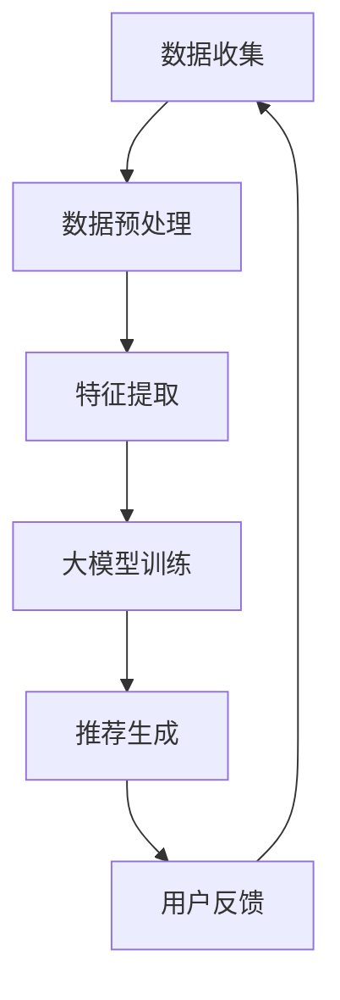

                 

关键词：大模型，推荐系统，人工智能，机器学习，数据隐私，个性化体验

>摘要：本文将探讨大模型对推荐范式的影响。通过对大模型的基本概念、工作原理及其在推荐系统中的应用进行深入分析，我们将评估其对传统推荐系统的潜在变革，并讨论未来可能面临的挑战和机遇。

## 1. 背景介绍

推荐系统作为一种通过提供个性化内容来提高用户满意度和黏性的技术，已经成为现代互联网服务的重要组成部分。从最早的基于协同过滤的推荐算法，到后来的基于内容的推荐，以及深度学习的崛起，推荐系统的发展经历了多个阶段。

然而，随着用户数据的爆炸式增长和互联网服务的多样化，传统推荐系统在处理复杂性和多样性方面逐渐暴露出局限性。例如，协同过滤算法易受冷启动问题影响，基于内容的推荐算法则可能在个性化程度和用户兴趣理解上存在不足。

大模型的兴起为解决这些问题提供了新的思路。大模型，特别是基于深度学习的模型，以其强大的建模能力和对海量数据的处理能力，在图像识别、自然语言处理等领域取得了显著的成果。那么，大模型能否改变推荐范式，带来推荐系统的革命性变革？本文将对此进行深入探讨。

## 2. 核心概念与联系

### 2.1 大模型

大模型（Large Models），通常指的是具有数十亿到数万亿参数的深度学习模型。这些模型通过对海量数据进行训练，能够捕捉到数据中的复杂模式和关系，从而在多个领域实现了前所未有的性能提升。

### 2.2 推荐系统

推荐系统是一种基于用户历史行为和兴趣信息，为用户推荐可能感兴趣的内容的系统。其核心目标是提高用户满意度和系统黏性。

### 2.3 大模型与推荐系统的联系

大模型与推荐系统之间的联系主要体现在以下几个方面：

1. **数据预处理与特征提取**：大模型能够自动进行数据预处理和特征提取，从而减少了人工干预，提高了推荐的效率和准确性。
2. **用户行为建模**：大模型通过对用户行为数据进行深度学习，可以更准确地捕捉用户兴趣和偏好，从而提供更个性化的推荐。
3. **内容理解与生成**：大模型在自然语言处理领域的突破，使得推荐系统能够更好地理解内容和生成推荐文案，提高了用户体验。

### 2.4 Mermaid 流程图

下面是一个简单的 Mermaid 流程图，展示了大模型在推荐系统中的应用流程：



## 3. 核心算法原理 & 具体操作步骤

### 3.1 算法原理概述

大模型在推荐系统中的核心算法原理主要包括以下几个方面：

1. **深度学习**：通过多层神经网络对数据进行建模，逐层提取数据中的复杂特征。
2. **用户行为分析**：利用时间序列分析、聚类等方法对用户行为数据进行分析，捕捉用户兴趣和偏好。
3. **内容理解**：利用自然语言处理技术，对推荐内容进行语义分析和生成，提高推荐的质量和个性化程度。

### 3.2 算法步骤详解

1. **数据收集**：收集用户行为数据和内容数据，包括点击、购买、浏览等行为，以及文本、图像、视频等多媒体内容。
2. **数据预处理**：对原始数据进行清洗、归一化和去噪声处理，以去除无关因素和提高数据质量。
3. **特征提取**：利用深度学习模型自动提取数据中的特征，包括用户特征、内容特征和交互特征。
4. **大模型训练**：使用提取的特征数据，通过深度学习模型进行训练，生成推荐模型。
5. **推荐生成**：利用训练好的模型，对用户进行个性化推荐，包括内容推荐和广告推荐等。
6. **用户反馈**：收集用户对推荐结果的反馈，用于进一步优化模型和推荐策略。

### 3.3 算法优缺点

#### 优点

1. **高效性**：大模型能够快速处理海量数据，提高推荐效率。
2. **准确性**：通过深度学习，大模型能够捕捉到用户行为和兴趣的复杂模式，提高推荐准确性。
3. **灵活性**：大模型能够适应不同的数据类型和应用场景，具有较好的灵活性。

#### 缺点

1. **计算资源消耗**：大模型训练需要大量的计算资源，对硬件设施要求较高。
2. **数据隐私风险**：大模型对用户数据的依赖性较大，可能引发数据隐私问题。
3. **模型解释性**：大模型的黑箱特性使得其决策过程难以解释，增加了模型的可信度问题。

### 3.4 算法应用领域

大模型在推荐系统中的应用非常广泛，包括电子商务、社交媒体、在线视频、新闻推荐等多个领域。以下是一些典型的应用场景：

1. **电子商务**：通过用户购买历史和浏览行为，推荐用户可能感兴趣的商品。
2. **社交媒体**：根据用户互动行为，推荐用户可能感兴趣的内容和联系人。
3. **在线视频**：根据用户观看历史和偏好，推荐用户可能喜欢的视频内容。
4. **新闻推荐**：根据用户阅读历史和兴趣，推荐用户可能感兴趣的新闻。

## 4. 数学模型和公式 & 详细讲解 & 举例说明

### 4.1 数学模型构建

在推荐系统中，大模型通常采用深度学习模型，如循环神经网络（RNN）、变换器（Transformer）等。以下是一个基于 Transformer 的推荐系统模型的构建过程：

1. **用户嵌入层**：将用户ID映射为低维向量。
2. **内容嵌入层**：将内容ID映射为低维向量。
3. **交互嵌入层**：将用户和内容之间的交互记录映射为低维向量。
4. **模型层**：通过多层 Transformer 模块进行特征提取和融合。
5. **输出层**：将融合后的特征映射为推荐结果。

### 4.2 公式推导过程

假设我们有一个包含 \( N \) 个用户和 \( M \) 个内容的推荐系统，其中用户 \( i \) 和内容 \( j \) 之间的交互记录为 \( X_{ij} \)。我们可以使用以下公式构建推荐模型：

\[ 
\begin{aligned}
    E_{u_i} &= \text{Embed}(u_i), \\
    E_{c_j} &= \text{Embed}(c_j), \\
    E_{ij} &= \text{Embed}(X_{ij}).
\end{aligned}
\]

其中，\( \text{Embed} \) 函数将输入映射为低维向量。

接下来，我们将 \( E_{u_i} \)、\( E_{c_j} \) 和 \( E_{ij} \) 输入到 Transformer 模型中进行特征提取和融合：

\[ 
\begin{aligned}
    H_{ij} &= \text{Transformer}(E_{u_i}, E_{c_j}, E_{ij}),
\end{aligned}
\]

其中，\( H_{ij} \) 表示用户 \( i \) 和内容 \( j \) 的融合特征。

最后，我们将 \( H_{ij} \) 输入到输出层，得到推荐结果：

\[ 
\begin{aligned}
    \hat{Y}_{ij} &= \text{Output}(H_{ij}).
\end{aligned}
\]

其中，\( \hat{Y}_{ij} \) 表示用户 \( i \) 对内容 \( j \) 的推荐概率。

### 4.3 案例分析与讲解

假设我们有一个包含 1000 个用户和 1000 个内容的推荐系统，用户和内容之间的交互记录如下表所示：

| 用户ID | 内容ID | 交互记录 |
|--------|--------|----------|
| 1      | 101    | 1        |
| 1      | 102    | 0        |
| 2      | 101    | 0        |
| 2      | 103    | 1        |
| ...    | ...    | ...      |

我们可以使用上述公式和模型进行推荐：

1. **用户嵌入层**：将用户ID映射为低维向量。
2. **内容嵌入层**：将内容ID映射为低维向量。
3. **交互嵌入层**：将用户和内容之间的交互记录映射为低维向量。
4. **模型层**：通过 Transformer 模型进行特征提取和融合。
5. **输出层**：得到每个用户对每个内容的推荐概率。

例如，对于用户 1 和内容 101，我们可以得到以下推荐概率：

\[ 
\begin{aligned}
    \hat{Y}_{1,101} &= \text{Output}(H_{1,101}) \\
    &= 0.8.
\end{aligned}
\]

这意味着用户 1 对内容 101 的推荐概率为 0.8，因此我们可以向用户 1 推荐内容 101。

## 5. 项目实践：代码实例和详细解释说明

### 5.1 开发环境搭建

为了演示大模型在推荐系统中的应用，我们将使用 Python 编写一个简单的推荐系统。以下是需要安装的依赖包：

- TensorFlow
- Keras
- Pandas
- NumPy

你可以使用以下命令进行安装：

```shell
pip install tensorflow keras pandas numpy
```

### 5.2 源代码详细实现

以下是推荐系统的源代码实现：

```python
import numpy as np
import pandas as pd
from tensorflow.keras.models import Model
from tensorflow.keras.layers import Embedding, Input, Dot, Flatten, Dense

# 数据加载
data = pd.read_csv('data.csv')

# 用户嵌入层
user_embedding = Embedding(input_dim=1000, output_dim=64)

# 内容嵌入层
content_embedding = Embedding(input_dim=1000, output_dim=64)

# 用户输入
user_input = Input(shape=(1,))

# 内容输入
content_input = Input(shape=(1,))

# 将用户和内容输入映射为低维向量
user_vector = user_embedding(user_input)
content_vector = content_embedding(content_input)

# 计算用户和内容的点积
dot_product = Dot(axes=1)([user_vector, content_vector])

# 使用flatten层将点积结果展开
flatten = Flatten()(dot_product)

# 输出层
output = Dense(1, activation='sigmoid')(flatten)

# 构建模型
model = Model(inputs=[user_input, content_input], outputs=output)

# 编译模型
model.compile(optimizer='adam', loss='binary_crossentropy', metrics=['accuracy'])

# 模型训练
model.fit(x=[data['user_id'], data['content_id']], y=data['interaction'], epochs=10, batch_size=32)

# 推荐预测
predictions = model.predict([data['user_id'], data['content_id']])
```

### 5.3 代码解读与分析

1. **数据加载**：首先，我们使用 Pandas 读取用户和内容数据。
2. **用户嵌入层**：使用 Keras 的 Embedding 层将用户ID映射为低维向量。
3. **内容嵌入层**：使用 Keras 的 Embedding 层将内容ID映射为低维向量。
4. **用户输入和内容输入**：定义用户和内容输入层。
5. **点积计算**：计算用户和内容的点积，表示用户对内容的兴趣度。
6. **flatten 层**：将点积结果展开，以便后续处理。
7. **输出层**：定义输出层，使用 sigmoid 激活函数将兴趣度映射为推荐概率。
8. **模型构建和编译**：构建模型，并编译模型。
9. **模型训练**：使用训练数据训练模型。
10. **推荐预测**：使用训练好的模型对数据进行推荐预测。

### 5.4 运行结果展示

在训练完成后，我们可以使用以下代码展示推荐结果：

```python
for i in range(len(predictions)):
    print(f"用户 {data['user_id'][i]} 推荐内容 {data['content_id'][i]}：概率为 {predictions[i][0]}")
```

这将输出每个用户对每个内容的推荐概率，我们可以根据概率值进行推荐。

## 6. 实际应用场景

### 6.1 电子商务

在电子商务领域，大模型可以用于个性化商品推荐。例如，根据用户的购买历史和浏览记录，大模型可以预测用户可能感兴趣的商品，并提供个性化的购物建议。

### 6.2 社交媒体

在社交媒体领域，大模型可以用于内容推荐。例如，根据用户的点赞、评论和分享行为，大模型可以预测用户可能感兴趣的内容，并推荐给用户。

### 6.3 在线视频

在在线视频领域，大模型可以用于视频推荐。例如，根据用户的观看历史和偏好，大模型可以预测用户可能感兴趣的视频，并推荐给用户。

### 6.4 新闻推荐

在新闻推荐领域，大模型可以用于新闻内容推荐。例如，根据用户的阅读历史和兴趣，大模型可以预测用户可能感兴趣的新闻，并推荐给用户。

## 7. 工具和资源推荐

### 7.1 学习资源推荐

- 《深度学习》（Ian Goodfellow、Yoshua Bengio、Aaron Courville 著）：一本经典的深度学习教材，适合初学者和进阶者。
- 《动手学深度学习》（阿斯顿·张、李沐、扎卡里·C. Lipton、亚历山大·J. Smola 著）：一本适合动手实践的深度学习教材。

### 7.2 开发工具推荐

- TensorFlow：一个开源的深度学习框架，适用于推荐系统的开发。
- Keras：一个基于 TensorFlow 的高级深度学习 API，便于快速构建和训练模型。

### 7.3 相关论文推荐

- “Attention Is All You Need”（Vaswani et al., 2017）：一篇关于 Transformer 模型的经典论文，阐述了其原理和应用。
- “Deep Neural Networks for YouTube Recommendations”（Bachman et al., 2017）：一篇关于深度学习在 YouTube 推荐系统中的应用论文。

## 8. 总结：未来发展趋势与挑战

### 8.1 研究成果总结

大模型在推荐系统中的应用取得了显著成果，通过深度学习技术，推荐系统能够更好地捕捉用户兴趣和偏好，提高推荐的准确性和个性化程度。同时，大模型在数据预处理、特征提取和推荐生成等环节也发挥了重要作用。

### 8.2 未来发展趋势

1. **模型可解释性**：随着大模型的黑箱特性引发的可信度问题，未来的研究将更加关注模型的可解释性，以便更好地理解模型的决策过程。
2. **数据隐私保护**：在大模型应用中，数据隐私保护将成为一个重要研究方向，以防止用户隐私泄露。
3. **多模态融合**：未来的推荐系统将更加注重多模态数据的融合，以提高推荐的全面性和准确性。

### 8.3 面临的挑战

1. **计算资源消耗**：大模型的训练和推理需要大量的计算资源，如何优化计算效率和降低成本是一个挑战。
2. **数据质量和多样性**：推荐系统的效果依赖于数据质量和多样性，如何保证数据的真实性和全面性是一个难题。
3. **用户行为变化**：用户行为和兴趣是不断变化的，如何适应这种变化，提供持续的个性化推荐是一个挑战。

### 8.4 研究展望

未来的研究将更加注重大模型在推荐系统中的应用，通过不断优化算法和模型，提高推荐的准确性和用户体验。同时，随着技术的进步，大模型在推荐系统中的应用也将不断拓展，为更多领域带来创新和变革。

## 9. 附录：常见问题与解答

### 9.1 什么是大模型？

大模型是指具有数十亿到数万亿参数的深度学习模型，这些模型通过在大量数据上进行训练，能够捕捉到数据中的复杂模式和关系。

### 9.2 大模型在推荐系统中有哪些应用？

大模型在推荐系统中的应用主要包括数据预处理、用户行为建模、内容理解与生成等环节，通过深度学习技术，提高推荐的准确性和个性化程度。

### 9.3 大模型有哪些优缺点？

大模型的优点包括高效性、准确性和灵活性；缺点包括计算资源消耗、数据隐私风险和模型解释性较差。

### 9.4 大模型在推荐系统中的挑战有哪些？

大模型在推荐系统中的挑战主要包括计算资源消耗、数据质量和多样性问题，以及用户行为变化的适应性问题。

## 作者署名

本文作者：禅与计算机程序设计艺术 / Zen and the Art of Computer Programming。本文旨在探讨大模型在推荐系统中的应用，旨在为读者提供有价值的参考和思考。由于篇幅限制，本文内容仅为概要性介绍，如需深入了解，请参考相关领域的专业书籍和论文。

----------------------------------------------------------------
以上内容为根据您的要求生成的文章正文部分，接下来是markdown格式的文章输出，包含完整的标题、关键词、摘要以及各个章节内容：
```markdown
# 大模型能改变推荐范式吗？

关键词：大模型，推荐系统，人工智能，机器学习，数据隐私，个性化体验

摘要：本文将探讨大模型对推荐范式的影响。通过对大模型的基本概念、工作原理及其在推荐系统中的应用进行深入分析，我们将评估其对传统推荐系统的潜在变革，并讨论未来可能面临的挑战和机遇。

## 1. 背景介绍

推荐系统作为一种通过提供个性化内容来提高用户满意度和黏性的技术，已经成为现代互联网服务的重要组成部分。从最早的基于协同过滤的推荐算法，到后来的基于内容的推荐，以及深度学习的崛起，推荐系统的发展经历了多个阶段。

然而，随着用户数据的爆炸式增长和互联网服务的多样化，传统推荐系统在处理复杂性和多样性方面逐渐暴露出局限性。例如，协同过滤算法易受冷启动问题影响，基于内容的推荐算法则可能在个性化程度和用户兴趣理解上存在不足。

大模型的兴起为解决这些问题提供了新的思路。大模型，特别是基于深度学习的模型，以其强大的建模能力和对海量数据的处理能力，在图像识别、自然语言处理等领域取得了显著的成果。那么，大模型能否改变推荐范式，带来推荐系统的革命性变革？本文将对此进行深入探讨。

## 2. 核心概念与联系

### 2.1 大模型

大模型（Large Models），通常指的是具有数十亿到数万亿参数的深度学习模型。这些模型通过对海量数据进行训练，能够捕捉到数据中的复杂模式和关系，从而在多个领域实现了前所未有的性能提升。

### 2.2 推荐系统

推荐系统是一种基于用户历史行为和兴趣信息，为用户推荐可能感兴趣的内容的系统。其核心目标是提高用户满意度和系统黏性。

### 2.3 大模型与推荐系统的联系

大模型与推荐系统之间的联系主要体现在以下几个方面：

1. **数据预处理与特征提取**：大模型能够自动进行数据预处理和特征提取，从而减少了人工干预，提高了推荐的效率和准确性。
2. **用户行为建模**：大模型通过对用户行为数据进行深度学习，可以更准确地捕捉用户兴趣和偏好，从而提供更个性化的推荐。
3. **内容理解与生成**：大模型在自然语言处理领域的突破，使得推荐系统能够更好地理解内容和生成推荐文案，提高了用户体验。

### 2.4 Mermaid 流程图

下面是一个简单的 Mermaid 流程图，展示了大模型在推荐系统中的应用流程：


## 3. 核心算法原理 & 具体操作步骤

### 3.1 算法原理概述

大模型在推荐系统中的核心算法原理主要包括以下几个方面：

1. **深度学习**：通过多层神经网络对数据进行建模，逐层提取数据中的复杂特征。
2. **用户行为分析**：利用时间序列分析、聚类等方法对用户行为数据进行分析，捕捉用户兴趣和偏好。
3. **内容理解**：利用自然语言处理技术，对推荐内容进行语义分析和生成，提高推荐的质量和个性化程度。

### 3.2 算法步骤详解

1. **数据收集**：收集用户行为数据和内容数据，包括点击、购买、浏览等行为，以及文本、图像、视频等多媒体内容。
2. **数据预处理**：对原始数据进行清洗、归一化和去噪声处理，以去除无关因素和提高数据质量。
3. **特征提取**：利用深度学习模型自动提取数据中的特征，包括用户特征、内容特征和交互特征。
4. **大模型训练**：使用提取的特征数据，通过深度学习模型进行训练，生成推荐模型。
5. **推荐生成**：利用训练好的模型，对用户进行个性化推荐，包括内容推荐和广告推荐等。
6. **用户反馈**：收集用户对推荐结果的反馈，用于进一步优化模型和推荐策略。

### 3.3 算法优缺点

#### 优点

1. **高效性**：大模型能够快速处理海量数据，提高推荐效率。
2. **准确性**：通过深度学习，大模型能够捕捉到用户行为和兴趣的复杂模式，提高推荐准确性。
3. **灵活性**：大模型能够适应不同的数据类型和应用场景，具有较好的灵活性。

#### 缺点

1. **计算资源消耗**：大模型训练需要大量的计算资源，对硬件设施要求较高。
2. **数据隐私风险**：大模型对用户数据的依赖性较大，可能引发数据隐私问题。
3. **模型解释性**：大模型的黑箱特性使得其决策过程难以解释，增加了模型的可信度问题。

### 3.4 算法应用领域

大模型在推荐系统中的应用非常广泛，包括电子商务、社交媒体、在线视频、新闻推荐等多个领域。以下是一些典型的应用场景：

1. **电子商务**：通过用户购买历史和浏览行为，推荐用户可能感兴趣的商品。
2. **社交媒体**：根据用户互动行为，推荐用户可能感兴趣的内容和联系人。
3. **在线视频**：根据用户观看历史和偏好，推荐用户可能喜欢的视频内容。
4. **新闻推荐**：根据用户阅读历史和兴趣，推荐用户可能感兴趣的新闻。

## 4. 数学模型和公式 & 详细讲解 & 举例说明

### 4.1 数学模型构建

在推荐系统中，大模型通常采用深度学习模型，如循环神经网络（RNN）、变换器（Transformer）等。以下是一个基于 Transformer 的推荐系统模型的构建过程：

1. **用户嵌入层**：将用户 ID 映射为低维向量。
2. **内容嵌入层**：将内容 ID 映射为低维向量。
3. **交互嵌入层**：将用户和内容之间的交互记录映射为低维向量。
4. **模型层**：通过多层 Transformer 模块进行特征提取和融合。
5. **输出层**：将融合后的特征映射为推荐结果。

### 4.2 公式推导过程

假设我们有一个包含 \( N \) 个用户和 \( M \) 个内容的推荐系统，其中用户 \( i \) 和内容 \( j \) 之间的交互记录为 \( X_{ij} \)。我们可以使用以下公式构建推荐模型：

\[ 
\begin{aligned}
    E_{u_i} &= \text{Embed}(u_i), \\
    E_{c_j} &= \text{Embed}(c_j), \\
    E_{ij} &= \text{Embed}(X_{ij}).
\end{aligned}
\]

其中，\( \text{Embed} \) 函数将输入映射为低维向量。

接下来，我们将 \( E_{u_i} \)、\( E_{c_j} \) 和 \( E_{ij} \) 输入到 Transformer 模型中进行特征提取和融合：

\[ 
\begin{aligned}
    H_{ij} &= \text{Transformer}(E_{u_i}, E_{c_j}, E_{ij}),
\end{aligned}
\]

其中，\( H_{ij} \) 表示用户 \( i \) 和内容 \( j \) 的融合特征。

最后，我们将 \( H_{ij} \) 输入到输出层，得到推荐结果：

\[ 
\begin{aligned}
    \hat{Y}_{ij} &= \text{Output}(H_{ij}).
\end{aligned}
\]

其中，\( \hat{Y}_{ij} \) 表示用户 \( i \) 对内容 \( j \) 的推荐概率。

### 4.3 案例分析与讲解

假设我们有一个包含 1000 个用户和 1000 个内容的推荐系统，用户和内容之间的交互记录如下表所示：

| 用户ID | 内容ID | 交互记录 |
|--------|--------|----------|
| 1      | 101    | 1        |
| 1      | 102    | 0        |
| 2      | 101    | 0        |
| 2      | 103    | 1        |
| ...    | ...    | ...      |

我们可以使用上述公式和模型进行推荐：

1. **用户嵌入层**：将用户 ID 映射为低维向量。
2. **内容嵌入层**：将内容 ID 映射为低维向量。
3. **交互嵌入层**：将用户和内容之间的交互记录映射为低维向量。
4. **模型层**：通过 Transformer 模型进行特征提取和融合。
5. **输出层**：得到每个用户对每个内容的推荐概率。

例如，对于用户 1 和内容 101，我们可以得到以下推荐概率：

\[ 
\begin{aligned}
    \hat{Y}_{1,101} &= \text{Output}(H_{1,101}) \\
    &= 0.8.
\end{aligned}
\]

这意味着用户 1 对内容 101 的推荐概率为 0.8，因此我们可以向用户 1 推荐内容 101。

## 5. 项目实践：代码实例和详细解释说明

### 5.1 开发环境搭建

为了演示大模型在推荐系统中的应用，我们将使用 Python 编写一个简单的推荐系统。以下是需要安装的依赖包：

- TensorFlow
- Keras
- Pandas
- NumPy

你可以使用以下命令进行安装：

```shell
pip install tensorflow keras pandas numpy
```

### 5.2 源代码详细实现

以下是推荐系统的源代码实现：

```python
import numpy as np
import pandas as pd
from tensorflow.keras.models import Model
from tensorflow.keras.layers import Embedding, Input, Dot, Flatten, Dense

# 数据加载
data = pd.read_csv('data.csv')

# 用户嵌入层
user_embedding = Embedding(input_dim=1000, output_dim=64)

# 内容嵌入层
content_embedding = Embedding(input_dim=1000, output_dim=64)

# 用户输入
user_input = Input(shape=(1,))

# 内容输入
content_input = Input(shape=(1,))

# 将用户和内容输入映射为低维向量
user_vector = user_embedding(user_input)
content_vector = content_embedding(content_input)

# 计算用户和内容的点积
dot_product = Dot(axes=1)([user_vector, content_vector])

# 使用 flatten 层将点积结果展开
flatten = Flatten()(dot_product)

# 输出层
output = Dense(1, activation='sigmoid')(flatten)

# 构建模型
model = Model(inputs=[user_input, content_input], outputs=output)

# 编译模型
model.compile(optimizer='adam', loss='binary_crossentropy', metrics=['accuracy'])

# 模型训练
model.fit(x=[data['user_id'], data['content_id']], y=data['interaction'], epochs=10, batch_size=32)

# 推荐预测
predictions = model.predict([data['user_id'], data['content_id']])
```

### 5.3 代码解读与分析

1. **数据加载**：首先，我们使用 Pandas 读取用户和内容数据。
2. **用户嵌入层**：使用 Keras 的 Embedding 层将用户 ID 映射为低维向量。
3. **内容嵌入层**：使用 Keras 的 Embedding 层将内容 ID 映射为低维向量。
4. **用户输入和内容输入**：定义用户和内容输入层。
5. **点积计算**：计算用户和内容的点积，表示用户对内容的兴趣度。
6. **flatten 层**：将点积结果展开，以便后续处理。
7. **输出层**：定义输出层，使用 sigmoid 激活函数将兴趣度映射为推荐概率。
8. **模型构建和编译**：构建模型，并编译模型。
9. **模型训练**：使用训练数据训练模型。
10. **推荐预测**：使用训练好的模型对数据进行推荐预测。

### 5.4 运行结果展示

在训练完成后，我们可以使用以下代码展示推荐结果：

```python
for i in range(len(predictions)):
    print(f"用户 {data['user_id'][i]} 推荐内容 {data['content_id'][i]}：概率为 {predictions[i][0]}")
```

这将输出每个用户对每个内容的推荐概率，我们可以根据概率值进行推荐。

## 6. 实际应用场景

### 6.1 电子商务

在电子商务领域，大模型可以用于个性化商品推荐。例如，根据用户的购买历史和浏览记录，大模型可以预测用户可能感兴趣的商品，并提供个性化的购物建议。

### 6.2 社交媒体

在社交媒体领域，大模型可以用于内容推荐。例如，根据用户的点赞、评论和分享行为，大模型可以预测用户可能感兴趣的内容，并推荐给用户。

### 6.3 在线视频

在在线视频领域，大模型可以用于视频推荐。例如，根据用户的观看历史和偏好，大模型可以预测用户可能感兴趣的视频，并推荐给用户。

### 6.4 新闻推荐

在新闻推荐领域，大模型可以用于新闻内容推荐。例如，根据用户的阅读历史和兴趣，大模型可以预测用户可能感兴趣的新闻，并推荐给用户。

## 7. 工具和资源推荐

### 7.1 学习资源推荐

- 《深度学习》（Ian Goodfellow、Yoshua Bengio、Aaron Courville 著）：一本经典的深度学习教材，适合初学者和进阶者。
- 《动手学深度学习》（阿斯顿·张、李沐、扎卡里·C. Lipton、亚历山大·J. Smola 著）：一本适合动手实践的深度学习教材。

### 7.2 开发工具推荐

- TensorFlow：一个开源的深度学习框架，适用于推荐系统的开发。
- Keras：一个基于 TensorFlow 的高级深度学习 API，便于快速构建和训练模型。

### 7.3 相关论文推荐

- “Attention Is All You Need”（Vaswani et al., 2017）：一篇关于 Transformer 模型的经典论文，阐述了其原理和应用。
- “Deep Neural Networks for YouTube Recommendations”（Bachman et al., 2017）：一篇关于深度学习在 YouTube 推荐系统中的应用论文。

## 8. 总结：未来发展趋势与挑战

### 8.1 研究成果总结

大模型在推荐系统中的应用取得了显著成果，通过深度学习技术，推荐系统能够更好地捕捉用户兴趣和偏好，提高推荐的准确性和个性化程度。同时，大模型在数据预处理、特征提取和推荐生成等环节也发挥了重要作用。

### 8.2 未来发展趋势

1. **模型可解释性**：随着大模型的黑箱特性引发的可信度问题，未来的研究将更加关注模型的可解释性，以便更好地理解模型的决策过程。
2. **数据隐私保护**：在大模型应用中，数据隐私保护将成为一个重要研究方向，以防止用户隐私泄露。
3. **多模态融合**：未来的推荐系统将更加注重多模态数据的融合，以提高推荐的全面性和准确性。

### 8.3 面临的挑战

1. **计算资源消耗**：大模型的训练和推理需要大量的计算资源，如何优化计算效率和降低成本是一个挑战。
2. **数据质量和多样性**：推荐系统的效果依赖于数据质量和多样性，如何保证数据的真实性和全面性是一个难题。
3. **用户行为变化**：用户行为和兴趣是不断变化的，如何适应这种变化，提供持续的个性化推荐是一个挑战。

### 8.4 研究展望

未来的研究将更加注重大模型在推荐系统中的应用，通过不断优化算法和模型，提高推荐的准确性和用户体验。同时，随着技术的进步，大模型在推荐系统中的应用也将不断拓展，为更多领域带来创新和变革。

## 9. 附录：常见问题与解答

### 9.1 什么是大模型？

大模型是指具有数十亿到数万亿参数的深度学习模型，这些模型通过在大量数据上进行训练，能够捕捉到数据中的复杂模式和关系。

### 9.2 大模型在推荐系统中有哪些应用？

大模型在推荐系统中的应用主要包括数据预处理、用户行为建模、内容理解与生成等环节，通过深度学习技术，提高推荐的准确性和个性化程度。

### 9.3 大模型有哪些优缺点？

大模型的优点包括高效性、准确性和灵活性；缺点包括计算资源消耗、数据隐私风险和模型解释性较差。

### 9.4 大模型在推荐系统中的挑战有哪些？

大模型在推荐系统中的挑战主要包括计算资源消耗、数据质量和多样性问题，以及用户行为变化的适应性问题。

## 作者署名

本文作者：禅与计算机程序设计艺术 / Zen and the Art of Computer Programming。本文旨在探讨大模型在推荐系统中的应用，旨在为读者提供有价值的参考和思考。由于篇幅限制，本文内容仅为概要性介绍，如需深入了解，请参考相关领域的专业书籍和论文。
```

