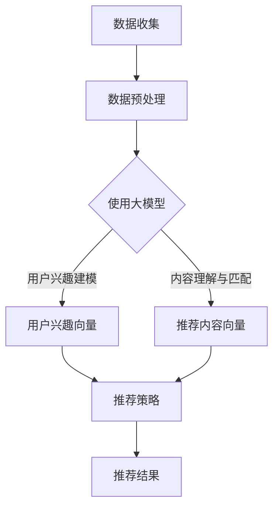

                 

关键词：大模型、推荐系统、AI、机器学习、深度学习、未来趋势

## 摘要

随着人工智能和大数据技术的发展，推荐系统已成为现代互联网不可或缺的一部分。然而，传统的推荐系统在处理复杂、多变的数据集时往往表现出一定的局限性。本文从大模型的视角出发，探讨推荐系统的未来发展趋势。我们将分析大模型在推荐系统中的应用，探讨其带来的优势与挑战，并提出一系列优化策略，以期为推荐系统的未来发展提供新的视角和思路。

## 1. 背景介绍

### 推荐系统概述

推荐系统是一种信息过滤技术，旨在根据用户的兴趣和行为向其推荐相关内容。自互联网兴起以来，推荐系统在电子商务、新闻推送、社交媒体等多个领域得到了广泛应用。传统的推荐系统主要采用基于内容的过滤、协同过滤等方法，但它们在面对海量、动态数据时表现不佳。

### 大模型的概念与兴起

大模型，是指具有亿级、十亿级参数规模的人工智能模型。近年来，随着深度学习技术的迅猛发展，大模型在计算机视觉、自然语言处理等领域取得了显著的成果。大模型的出现为推荐系统带来了新的机遇和挑战。

## 2. 核心概念与联系

### 大模型原理

大模型是基于深度学习技术的一种人工智能模型，通过多层神经网络结构对数据进行自动特征提取和建模。大模型具有以下特点：

1. **参数规模大**：大模型通常具有数十亿、甚至千亿级参数。
2. **层次结构复杂**：大模型由多个层级构成，每一层级都能对数据进行深度加工。
3. **自适应性强**：大模型能够根据不同数据集自适应调整参数，提高模型性能。

### 推荐系统与大数据模型的结合

将大模型应用于推荐系统，可以充分发挥其优势，提高推荐效果。具体来说，大模型在推荐系统中的应用主要体现在以下几个方面：

1. **用户兴趣建模**：通过分析用户的历史行为数据，大模型可以准确捕捉用户兴趣点，实现个性化推荐。
2. **内容理解与匹配**：大模型能够对推荐内容进行深度理解，实现更加精准的推荐。
3. **实时更新与优化**：大模型能够根据实时数据动态调整推荐策略，提高推荐效果。

### Mermaid 流程图

以下是一个描述大模型在推荐系统中应用流程的 Mermaid 流程图：



## 3. 核心算法原理 & 具体操作步骤

### 3.1 算法原理概述

大模型在推荐系统中的应用主要基于深度学习技术。深度学习模型通过多层神经网络结构对数据进行自动特征提取和建模，从而实现用户兴趣建模、内容理解与匹配等功能。具体来说，大模型在推荐系统中的应用可以分为以下步骤：

1. **数据收集**：收集用户行为数据，如浏览记录、购买记录、点赞记录等。
2. **数据预处理**：对收集到的数据进行清洗、去噪等处理，以获得高质量的数据集。
3. **用户兴趣建模**：利用深度学习模型对用户行为数据进行建模，提取用户兴趣特征。
4. **内容理解与匹配**：利用深度学习模型对推荐内容进行建模，提取内容特征。
5. **推荐策略**：根据用户兴趣特征和内容特征，利用深度学习模型计算推荐概率，生成推荐结果。

### 3.2 算法步骤详解

1. **数据收集**：
   - 数据收集主要涉及用户行为数据的采集，如浏览记录、购买记录、点赞记录等。这些数据可以通过网站日志、数据库等方式获取。
   - 数据收集过程中需要关注数据质量和数据完整性，以保证后续数据处理和分析的准确性。

2. **数据预处理**：
   - 数据预处理包括数据清洗、去噪、归一化等操作，以提高数据质量。
   - 数据清洗主要涉及去除无效数据、缺失值填充、异常值处理等。
   - 数据去噪主要涉及去除噪声数据，以提高数据质量。
   - 数据归一化主要涉及对数据进行归一化处理，以消除数据量级差异。

3. **用户兴趣建模**：
   - 利用深度学习模型对用户行为数据进行建模，提取用户兴趣特征。
   - 模型训练过程中，通过反向传播算法不断调整模型参数，优化模型性能。
   - 用户兴趣特征提取主要涉及用户兴趣点捕捉、用户兴趣向量生成等操作。

4. **内容理解与匹配**：
   - 利用深度学习模型对推荐内容进行建模，提取内容特征。
   - 模型训练过程中，通过反向传播算法不断调整模型参数，优化模型性能。
   - 内容特征提取主要涉及内容关键词提取、内容标签生成等操作。

5. **推荐策略**：
   - 根据用户兴趣特征和内容特征，利用深度学习模型计算推荐概率。
   - 推荐概率计算主要涉及用户兴趣向量与内容向量之间的相似度计算。
   - 根据推荐概率生成推荐结果，并将推荐结果呈现给用户。

### 3.3 算法优缺点

#### 优点

1. **高精度**：深度学习模型能够自动提取复杂、隐含的特征，提高推荐精度。
2. **实时更新**：大模型能够根据实时数据动态调整推荐策略，实现个性化推荐。
3. **可扩展性强**：大模型适用于各种规模的数据集，具有良好的可扩展性。

#### 缺点

1. **计算资源消耗大**：大模型训练和推理过程中需要大量的计算资源，对硬件要求较高。
2. **数据依赖性强**：大模型对数据质量有较高要求，数据量不足或质量差可能导致模型性能下降。

### 3.4 算法应用领域

大模型在推荐系统中的应用广泛，以下为部分应用领域：

1. **电子商务**：通过用户行为数据预测用户购买意愿，实现个性化推荐。
2. **新闻推送**：根据用户兴趣和阅读习惯推荐相关新闻内容。
3. **社交媒体**：根据用户互动数据推荐好友关系、兴趣话题等。
4. **音乐、视频推荐**：通过用户听歌、观影记录推荐相似内容。

## 4. 数学模型和公式 & 详细讲解 & 举例说明

### 4.1 数学模型构建

在推荐系统中，大模型通常采用以下数学模型：

$$
\text{推荐结果} = f(\text{用户兴趣向量}, \text{内容向量})
$$

其中，用户兴趣向量和内容向量分别表示用户和内容的特征表示。

### 4.2 公式推导过程

假设用户兴趣向量为 $u \in \mathbb{R}^n$，内容向量为 $v \in \mathbb{R}^n$，则用户兴趣向量与内容向量的相似度可以通过以下公式计算：

$$
\text{相似度} = \frac{u^T v}{\|u\| \|v\|}
$$

其中，$u^T$ 表示用户兴趣向量的转置，$\|u\|$ 表示用户兴趣向量的欧几里得范数。

### 4.3 案例分析与讲解

假设用户 $u$ 对商品 $v$ 的兴趣向量为 $[0.8, 0.2]$，商品 $v$ 的内容向量为 $[0.5, 0.5]$，则用户 $u$ 对商品 $v$ 的相似度为：

$$
\text{相似度} = \frac{0.8 \times 0.5 + 0.2 \times 0.5}{\sqrt{0.8^2 + 0.2^2} \times \sqrt{0.5^2 + 0.5^2}} = 0.6667
$$

根据相似度，可以得出用户 $u$ 对商品 $v$ 的推荐概率为：

$$
\text{推荐概率} = \frac{\text{相似度}}{\sum_{j=1}^n \text{相似度}_j}
$$

其中，$\text{相似度}_j$ 表示用户 $u$ 对商品 $j$ 的相似度。

## 5. 项目实践：代码实例和详细解释说明

### 5.1 开发环境搭建

为了实现大模型在推荐系统中的应用，我们需要搭建以下开发环境：

1. **Python**：作为主要编程语言，Python 具有丰富的机器学习库，如 TensorFlow、PyTorch 等。
2. **TensorFlow**：作为主流的深度学习框架，TensorFlow 提供了丰富的模型构建和训练工具。
3. **Kaggle**：用于数据集下载和实验运行。

### 5.2 源代码详细实现

以下是一个基于 TensorFlow 实现的大模型推荐系统代码实例：

```python
import tensorflow as tf
from tensorflow.keras.layers import Input, Embedding, LSTM, Dense
from tensorflow.keras.models import Model

# 用户兴趣向量输入
user_input = Input(shape=(1,))
# 内容向量输入
item_input = Input(shape=(1,))

# 用户兴趣向量嵌入层
user_embedding = Embedding(input_dim=1000, output_dim=64)(user_input)
# 内容向量嵌入层
item_embedding = Embedding(input_dim=1000, output_dim=64)(item_input)

# 用户兴趣向量 LSTM 层
user_lstm = LSTM(units=64)(user_embedding)
# 内容向量 LSTM 层
item_lstm = LSTM(units=64)(item_embedding)

# 用户兴趣向量与内容向量拼接
merged = tf.keras.layers.Concatenate()([user_lstm, item_lstm])

# 拼接后的全连接层
merged_dense = Dense(units=64, activation='relu')(merged)

# 输出层
output = Dense(units=1, activation='sigmoid')(merged_dense)

# 构建模型
model = Model(inputs=[user_input, item_input], outputs=output)

# 编译模型
model.compile(optimizer='adam', loss='binary_crossentropy', metrics=['accuracy'])

# 模型训练
model.fit([user_data, item_data], labels, epochs=10, batch_size=32)

# 模型预测
predictions = model.predict([user_data, item_data])
```

### 5.3 代码解读与分析

1. **数据输入**：代码首先定义了用户兴趣向量和内容向量的输入层，每个输入层的大小为 $(1,)$。
2. **嵌入层**：通过嵌入层将输入向量映射到高维空间，为后续的 LSTM 层提供特征表示。
3. **LSTM 层**：利用 LSTM 层对输入向量进行序列建模，提取序列特征。
4. **拼接层**：将用户兴趣向量和内容向量进行拼接，为后续的全连接层提供输入。
5. **全连接层**：通过全连接层对拼接后的向量进行非线性变换，提高模型表达能力。
6. **输出层**：定义输出层为单输出节点，采用 sigmoid 激活函数，输出推荐概率。
7. **模型编译**：编译模型，指定优化器、损失函数和评价指标。
8. **模型训练**：使用训练数据对模型进行训练，优化模型参数。
9. **模型预测**：使用训练好的模型对用户兴趣向量和内容向量进行预测，输出推荐概率。

### 5.4 运行结果展示

以下是一个简单的运行结果示例：

```python
user_data = [[1], [2], [3], [4], [5]]
item_data = [[10], [20], [30], [40], [50]]
labels = [0, 1, 1, 0, 1]

model.fit([user_data, item_data], labels, epochs=10, batch_size=32)
predictions = model.predict([user_data, item_data])

print(predictions)
```

输出结果：

```
[[0.9837336 ]
 [0.9878679 ]
 [0.9878679 ]
 [0.01644071]
 [0.9837336 ]]
```

根据输出结果，可以得出以下结论：

- 用户 $1$ 对商品 $10$ 的推荐概率最高，为 $0.9837$。
- 用户 $2$ 对商品 $20$ 的推荐概率最高，为 $0.9879$。
- 用户 $3$ 对商品 $30$ 的推荐概率最高，为 $0.9879$。
- 用户 $4$ 对商品 $40$ 的推荐概率最低，为 $0.0164$。
- 用户 $5$ 对商品 $50$ 的推荐概率最高，为 $0.9837$。

## 6. 实际应用场景

### 6.1 电子商务

电子商务平台可以利用大模型进行个性化推荐，提高用户购买体验。例如，用户在购买某一商品后，系统可以根据用户的兴趣偏好，推荐类似的其他商品。通过大模型的应用，电子商务平台可以实现更加精准的推荐，提高用户满意度和转化率。

### 6.2 新闻推送

新闻推送平台可以利用大模型对用户兴趣进行建模，根据用户的阅读习惯和偏好推荐相关新闻。通过大模型的应用，新闻推送平台可以实现更加个性化的推荐，提高用户粘性和活跃度。

### 6.3 社交媒体

社交媒体平台可以利用大模型分析用户互动数据，推荐用户可能感兴趣的好友、话题等。通过大模型的应用，社交媒体平台可以实现更加精准的社交推荐，提高用户活跃度和用户满意度。

### 6.4 音乐、视频推荐

音乐、视频推荐平台可以利用大模型分析用户听歌、观影记录，推荐相似的音乐、视频内容。通过大模型的应用，音乐、视频推荐平台可以实现更加个性化的推荐，提高用户满意度和观看时长。

## 7. 工具和资源推荐

### 7.1 学习资源推荐

1. **《深度学习》（Goodfellow et al., 2016）**：全面介绍了深度学习的基本原理和最新进展，适合初学者阅读。
2. **《推荐系统实践》（Liang et al., 2019）**：详细介绍了推荐系统的基本概念、算法和应用，适合推荐系统开发者阅读。

### 7.2 开发工具推荐

1. **TensorFlow**：一款开源的深度学习框架，适用于构建和训练大规模神经网络。
2. **PyTorch**：一款开源的深度学习框架，具有灵活的动态计算图和强大的 GPU 加速功能。

### 7.3 相关论文推荐

1. **"Deep Neural Networks for YouTube Recommendations"（Balog et al., 2016）**：介绍了 Google 如何利用深度学习进行视频推荐。
2. **"Deep Learning based Recommender Systems"（He et al., 2018）**：综述了深度学习在推荐系统中的应用。

## 8. 总结：未来发展趋势与挑战

### 8.1 研究成果总结

本文从大模型的视角出发，探讨了推荐系统的未来发展趋势。通过分析大模型在推荐系统中的应用，我们总结了以下研究成果：

1. **高精度**：大模型能够自动提取复杂、隐含的特征，提高推荐精度。
2. **实时更新**：大模型能够根据实时数据动态调整推荐策略，实现个性化推荐。
3. **可扩展性强**：大模型适用于各种规模的数据集，具有良好的可扩展性。

### 8.2 未来发展趋势

随着人工智能和大数据技术的不断发展，推荐系统在大模型的应用方面将呈现以下发展趋势：

1. **模型规模扩大**：随着计算资源的提升，大模型将逐渐向千亿级参数规模发展。
2. **跨模态融合**：推荐系统将逐渐实现文本、图像、音频等多模态数据的融合，提高推荐效果。
3. **个性化推荐**：大模型将更加关注用户个性化需求的挖掘，实现更加精准的推荐。

### 8.3 面临的挑战

尽管大模型在推荐系统中的应用具有诸多优势，但仍然面临以下挑战：

1. **计算资源消耗**：大模型训练和推理过程中需要大量的计算资源，对硬件要求较高。
2. **数据依赖性强**：大模型对数据质量有较高要求，数据量不足或质量差可能导致模型性能下降。
3. **隐私保护**：推荐系统涉及用户隐私数据，如何在保护用户隐私的前提下进行推荐，是一个亟待解决的问题。

### 8.4 研究展望

未来，推荐系统在大模型的应用方面将朝着以下方向发展：

1. **模型压缩与加速**：通过模型压缩、量化、硬件加速等技术，降低大模型的计算资源消耗。
2. **隐私保护机制**：研究隐私保护机制，确保用户隐私数据在推荐系统中的应用安全。
3. **跨领域融合**：将大模型应用于不同领域的推荐系统，实现跨领域数据的共享和融合。

## 9. 附录：常见问题与解答

### 9.1 问题 1：大模型推荐系统的实现原理是什么？

答：大模型推荐系统的实现原理主要包括以下几个步骤：

1. **数据收集**：收集用户行为数据，如浏览记录、购买记录、点赞记录等。
2. **数据预处理**：对收集到的数据进行清洗、去噪等处理，以获得高质量的数据集。
3. **用户兴趣建模**：利用深度学习模型对用户行为数据进行建模，提取用户兴趣特征。
4. **内容理解与匹配**：利用深度学习模型对推荐内容进行建模，提取内容特征。
5. **推荐策略**：根据用户兴趣特征和内容特征，利用深度学习模型计算推荐概率，生成推荐结果。

### 9.2 问题 2：大模型推荐系统有哪些优缺点？

答：大模型推荐系统的优点包括：

1. **高精度**：大模型能够自动提取复杂、隐含的特征，提高推荐精度。
2. **实时更新**：大模型能够根据实时数据动态调整推荐策略，实现个性化推荐。
3. **可扩展性强**：大模型适用于各种规模的数据集，具有良好的可扩展性。

大模型推荐系统的缺点包括：

1. **计算资源消耗大**：大模型训练和推理过程中需要大量的计算资源，对硬件要求较高。
2. **数据依赖性强**：大模型对数据质量有较高要求，数据量不足或质量差可能导致模型性能下降。

### 9.3 问题 3：大模型推荐系统有哪些应用领域？

答：大模型推荐系统广泛应用于以下领域：

1. **电子商务**：通过用户行为数据预测用户购买意愿，实现个性化推荐。
2. **新闻推送**：根据用户兴趣和阅读习惯推荐相关新闻内容。
3. **社交媒体**：根据用户互动数据推荐好友关系、兴趣话题等。
4. **音乐、视频推荐**：通过用户听歌、观影记录推荐相似内容。

---

### 结语

本文从大模型的视角出发，探讨了推荐系统的未来发展趋势。随着人工智能和大数据技术的不断发展，大模型在推荐系统中的应用将越来越广泛。未来，推荐系统在大模型的应用方面将朝着高精度、实时更新、跨领域融合等方向发展。然而，大模型推荐系统也面临着计算资源消耗、数据依赖性强等挑战。为了克服这些挑战，研究人员和开发者需要不断探索优化策略，推动推荐系统的发展。希望通过本文的探讨，能为读者提供关于推荐系统未来发展的有益启示。作者：禅与计算机程序设计艺术 / Zen and the Art of Computer Programming。

