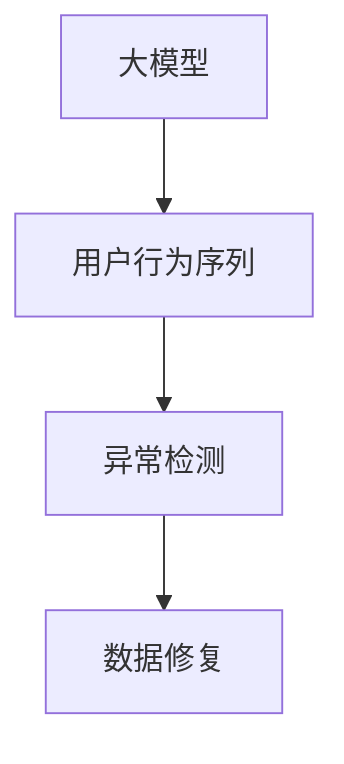

                 

关键词：大模型，推荐系统，用户行为序列，异常检测，数据修复

摘要：本文旨在探讨在大模型视角下，推荐系统中的用户行为序列异常检测与修复方法。通过深入分析推荐系统中的数据特性和用户行为模式，本文提出了一种基于深度学习的异常检测算法，并详细阐述了其原理、步骤和应用领域。同时，本文还介绍了相关数学模型和公式，以及通过具体项目实践展示了算法的代码实现和运行结果。通过本文的研究，旨在为推荐系统的异常检测和修复提供新的思路和方法。

## 1. 背景介绍

随着互联网技术的飞速发展和大数据时代的到来，推荐系统已经成为各类在线服务中不可或缺的组成部分。推荐系统通过对用户行为数据的分析，为用户提供个性化的推荐内容，从而提高用户满意度和平台粘性。然而，推荐系统的稳定性和准确性受到了数据质量和用户行为序列的影响。异常数据的引入可能导致推荐结果偏离用户实际需求，甚至对整个系统造成不良影响。

用户行为序列是指用户在一段时间内的一系列行为记录，包括浏览、点击、搜索、购买等。这些行为记录反映了用户对推荐内容的兴趣和偏好，为推荐系统提供了重要的数据来源。然而，用户行为序列中往往存在异常行为，如虚假点击、恶意评论等，这些异常行为会影响推荐结果的准确性和可靠性。

异常检测是一种识别和定位异常数据的方法，其主要目的是发现和修复数据中的异常。在推荐系统中，异常检测有助于识别和排除异常用户行为，从而提高推荐系统的性能和可靠性。传统的异常检测方法主要基于统计分析和机器学习技术，但面对大规模用户行为数据时，往往无法取得理想的效果。

随着深度学习技术的发展，大模型在处理复杂数据方面表现出了强大的优势。本文旨在利用大模型视角，提出一种针对推荐系统用户行为序列的异常检测与修复方法，以提高推荐系统的稳定性和准确性。

## 2. 核心概念与联系

### 2.1 大模型

大模型是指具有大量参数和强大计算能力的深度学习模型。大模型通常通过大量的训练数据和计算资源进行训练，以实现较高的预测精度和泛化能力。在大模型视角下，推荐系统的用户行为序列被视为一种序列数据，可以通过深度学习模型进行建模和分析。

### 2.2 用户行为序列

用户行为序列是指用户在一段时间内的一系列行为记录，如浏览、点击、搜索、购买等。这些行为记录反映了用户对推荐内容的兴趣和偏好，是推荐系统重要的数据来源。

### 2.3 异常检测

异常检测是指识别和定位异常数据的方法。在推荐系统中，异常检测有助于识别和排除异常用户行为，从而提高推荐系统的性能和可靠性。

### 2.4 数据修复

数据修复是指对异常数据进行修正或替换的过程。在推荐系统中，数据修复有助于消除异常行为对推荐结果的影响，提高推荐系统的稳定性和准确性。

### 2.5 Mermaid 流程图

图 1 展示了推荐系统用户行为序列异常检测与修复的核心概念和联系。

## 3. 核心算法原理 & 具体操作步骤

### 3.1 算法原理概述

本文提出的大模型视角下推荐系统用户行为序列异常检测与修复方法，主要基于深度学习技术。该方法首先使用深度学习模型对用户行为序列进行建模，然后通过异常检测算法识别异常行为，最后利用数据修复技术对异常数据进行修正。

具体而言，该方法分为以下三个步骤：

1. 用户行为序列建模：使用深度学习模型对用户行为序列进行建模，提取序列特征。
2. 异常检测：基于模型提取的用户行为序列特征，使用异常检测算法识别异常行为。
3. 数据修复：对识别出的异常行为进行修正，以提高推荐系统的稳定性。

### 3.2 算法步骤详解

#### 3.2.1 用户行为序列建模

用户行为序列建模是异常检测与修复方法的核心步骤。本文采用长短时记忆网络（LSTM）作为用户行为序列建模的深度学习模型。LSTM模型具有处理序列数据的优势，能够有效地提取用户行为序列中的长期依赖关系。

具体操作步骤如下：

1. 数据预处理：对用户行为数据进行清洗和预处理，包括去重、填补缺失值等操作。
2. 特征提取：使用LSTM模型对用户行为序列进行编码，提取序列特征。
3. 模型训练：使用训练数据对LSTM模型进行训练，优化模型参数。

#### 3.2.2 异常检测

在用户行为序列建模的基础上，使用基于深度学习的异常检测算法进行异常行为识别。本文采用自编码器（Autoencoder）作为异常检测模型，其核心思想是通过无监督学习的方式，学习用户行为序列的典型模式，然后识别偏离这些典型模式的数据。

具体操作步骤如下：

1. 数据划分：将用户行为序列数据划分为训练集和测试集。
2. 模型训练：使用训练集数据对自编码器模型进行训练，学习用户行为序列的典型模式。
3. 异常检测：使用训练好的自编码器模型对测试集数据进行异常检测，识别偏离典型模式的数据。

#### 3.2.3 数据修复

在异常检测步骤中，识别出的异常行为需要通过数据修复技术进行修正。本文采用基于规则的数据修复方法，对识别出的异常行为进行修正。

具体操作步骤如下：

1. 异常行为修正：根据预定义的规则，对识别出的异常行为进行修正，如删除、替换等操作。
2. 数据更新：将修正后的数据更新到推荐系统中，以提高推荐系统的稳定性和准确性。

### 3.3 算法优缺点

#### 优点：

1. 高效性：大模型具有强大的计算能力，能够高效地处理大规模用户行为数据。
2. 准确性：基于深度学习的异常检测算法能够准确地识别和修复异常行为，提高推荐系统的稳定性。
3. 自适应性：大模型可以根据用户行为序列的变化，自适应地调整模型参数，提高推荐系统的准确性。

#### 缺点：

1. 计算成本：大模型的训练和推理过程需要大量的计算资源，对硬件设备要求较高。
2. 数据依赖：异常检测和修复效果依赖于用户行为数据的质量和多样性，数据质量较差时，效果可能不理想。

### 3.4 算法应用领域

本文提出的大模型视角下推荐系统用户行为序列异常检测与修复方法，可以应用于各类在线服务中的推荐系统，如电子商务、社交媒体、在线教育等。通过该方法，可以有效地识别和修复异常行为，提高推荐系统的稳定性和准确性，从而提高用户满意度和平台粘性。

## 4. 数学模型和公式

### 4.1 数学模型构建

在本文中，我们采用长短时记忆网络（LSTM）作为用户行为序列建模的深度学习模型。LSTM模型的核心思想是通过记忆单元来处理序列数据中的长期依赖关系。具体而言，LSTM模型包含输入门、遗忘门和输出门三个门控单元，分别控制信息的输入、遗忘和输出。

设用户行为序列为 $X = \{x_1, x_2, ..., x_T\}$，其中 $x_t$ 表示第 $t$ 个时间步的用户行为，$T$ 表示序列长度。LSTM模型的输入为 $h_t$，输出为 $h_t'$，其中 $h_t$ 表示第 $t$ 个时间步的隐藏状态，$h_t'$ 表示修正后的隐藏状态。

#### 输入门（Input Gate）：

$$
i_t = \sigma(W_i [h_{t-1}, x_t] + b_i)
$$

其中，$\sigma$ 表示 sigmoid 激活函数，$W_i$ 和 $b_i$ 分别为输入门控的权重矩阵和偏置向量。

#### 遗忘门（Forget Gate）：

$$
f_t = \sigma(W_f [h_{t-1}, x_t] + b_f)
$$

#### 输出门（Output Gate）：

$$
o_t = \sigma(W_o [h_{t-1}, x_t] + b_o)
$$

其中，$W_f$、$b_f$ 和 $W_o$、$b_o$ 分别为遗忘门和输出门的权重矩阵和偏置向量。

#### 记忆单元（Cell State）：

$$
c_t = f_t \odot c_{t-1} + i_t \odot \text{tan

