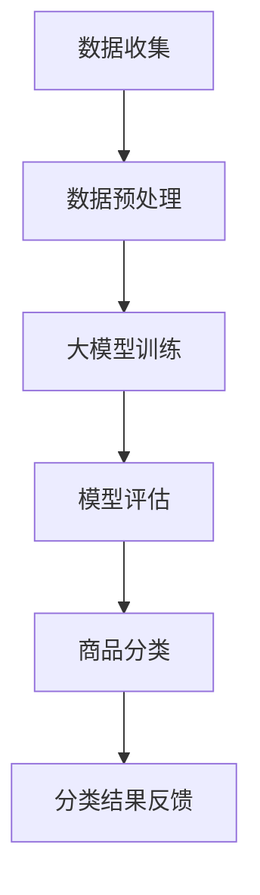

                 

关键词：大模型、智能商品分类、人工智能、分类算法、系统架构

## 摘要

本文将探讨大模型在智能商品分类系统中的应用，从背景介绍、核心概念与联系、算法原理、数学模型、项目实践以及未来应用展望等方面展开讨论。通过深入分析大模型的优势及其在商品分类领域的应用，我们期望为读者提供一种全新的视角，了解如何利用先进的人工智能技术提升商品分类的准确性和效率。

## 1. 背景介绍

在电子商务迅速发展的今天，商品分类系统成为电商平台的核心竞争力之一。传统的商品分类方法主要依赖于人工经验和手动编写规则，这种方式不仅效率低下，而且难以适应海量的商品数据和复杂的市场需求。随着人工智能技术的不断发展，特别是大模型的崛起，为智能商品分类系统带来了新的机遇和挑战。

大模型，如Transformer、BERT等，凭借其强大的学习和表征能力，已经在自然语言处理、图像识别等多个领域取得了显著的成果。大模型的引入，使得商品分类系统可以更好地理解商品的语义信息，提高分类的准确性和智能化水平。

本文将重点探讨大模型在智能商品分类系统中的应用，通过分析大模型的架构、算法原理和具体实现，为读者提供一种系统化的理解。同时，本文还将结合实际项目案例，展示大模型赋能商品分类系统在实际中的应用效果，并对未来的发展趋势进行展望。

## 2. 核心概念与联系

### 2.1 大模型

大模型（Large Models），是指具有巨大参数量和计算能力的深度学习模型。它们通过在海量数据上训练，能够捕获复杂的数据模式，并在各种任务中表现出色。大模型的主要代表包括Transformer、BERT、GPT等。这些模型通常包含数百万甚至数十亿个参数，需要大量的计算资源和时间进行训练。

### 2.2 商品分类

商品分类是指将电商平台上的商品按照一定的标准进行分类，以便用户能够方便地查找和购买。商品分类系统需要处理大量的商品数据，并且要满足用户对分类的多样性和精确性的需求。

### 2.3 智能商品分类系统

智能商品分类系统结合了人工智能技术和商品分类的规则，通过自动化的方式对商品进行分类。这种系统能够利用大模型强大的学习和表征能力，识别商品的语义信息，提高分类的准确性和效率。

### 2.4 Mermaid 流程图

下面是一个Mermaid流程图，展示了大模型赋能的智能商品分类系统的工作流程：



**图 2.1 大模型赋能的智能商品分类系统工作流程**

- **A. 数据收集**：从电商平台和其他来源收集商品数据。
- **B. 数据预处理**：对收集到的商品数据进行清洗、去重、标签化等预处理。
- **C. 大模型训练**：使用预处理后的数据训练大模型，学习商品的语义特征。
- **D. 模型评估**：评估大模型的分类性能，调整模型参数以优化分类效果。
- **E. 商品分类**：使用训练好的大模型对新的商品数据进行分类。
- **F. 分类结果反馈**：将分类结果反馈给电商平台，用于优化商品展示和推荐。

## 3. 核心算法原理 & 具体操作步骤

### 3.1 算法原理概述

大模型赋能的智能商品分类系统主要依赖于深度学习中的自注意力机制（Self-Attention）。自注意力机制允许模型在处理每个商品时，根据商品的特征自动学习不同特征的重要性，从而实现更加精确的分类。

具体来说，自注意力机制通过计算商品特征之间的相似度，生成一个权重矩阵。这个权重矩阵用于更新每个商品的特征向量，使得重要的特征得到加强，不重要的特征被削弱。通过这种机制，大模型能够更好地捕捉商品的语义信息，提高分类的准确性。

### 3.2 算法步骤详解

#### 3.2.1 数据收集

数据收集是智能商品分类系统的第一步，需要从电商平台和其他数据源获取商品信息。这些信息可能包括商品名称、描述、价格、品牌、分类标签等。

#### 3.2.2 数据预处理

数据预处理是对收集到的商品数据进行清洗、去重、标签化等处理。清洗数据主要是去除缺失值、重复值和噪声数据。去重是为了避免重复分类，提高效率。标签化是将商品信息转换为计算机可以理解的形式，例如将品牌名称转换为对应的ID。

#### 3.2.3 大模型训练

大模型训练是智能商品分类系统的核心步骤。在训练过程中，大模型会根据数据集进行自我调整，优化模型参数，以最小化分类误差。训练数据集通常包括商品名称、描述等文本信息，以及对应的分类标签。

#### 3.2.4 模型评估

模型评估是对训练好的大模型进行性能测试和调整。常用的评估指标包括准确率、召回率、F1分数等。通过模型评估，可以判断模型的分类效果，并根据评估结果对模型进行优化。

#### 3.2.5 商品分类

商品分类是使用训练好的大模型对新的商品进行分类。具体步骤如下：

1. 对新商品进行数据预处理，提取商品的特征向量。
2. 将特征向量输入到大模型中，通过自注意力机制计算特征的重要性。
3. 根据特征的重要性对商品进行分类，输出分类结果。

#### 3.2.6 分类结果反馈

分类结果反馈是将分类结果反馈给电商平台，用于优化商品展示和推荐。通过不断优化分类模型，可以不断提高商品分类的准确性和用户体验。

### 3.3 算法优缺点

#### 优点

1. 高准确性：大模型能够通过大规模数据训练，学习到商品的深层特征，从而提高分类的准确性。
2. 高效率：自注意力机制能够自动调整特征的重要性，使得分类过程更加高效。
3. 强泛化能力：大模型能够适应各种不同的商品分类场景，具有较好的泛化能力。

#### 缺点

1. 高计算资源需求：大模型需要大量的计算资源和时间进行训练和推理。
2. 数据依赖性：模型的性能很大程度上依赖于训练数据的质量和多样性。
3. 可解释性较差：大模型的内部机制复杂，难以解释每个特征对分类结果的具体影响。

### 3.4 算法应用领域

大模型赋能的智能商品分类系统在电商、物流、零售等多个领域有广泛的应用：

1. **电商平台**：通过智能商品分类系统，电商平台可以更好地组织商品，提高用户的购物体验。
2. **物流与配送**：智能分类可以帮助物流公司更快速、准确地识别商品，优化配送流程。
3. **零售行业**：零售商可以利用智能分类系统进行库存管理、销售预测等，提高运营效率。

## 4. 数学模型和公式 & 详细讲解 & 举例说明

### 4.1 数学模型构建

智能商品分类系统的数学模型主要基于自注意力机制。自注意力机制的数学模型可以表示为：

$$
\text{Attention}(Q, K, V) = \text{softmax}\left(\frac{QK^T}{\sqrt{d_k}}\right)V
$$

其中，$Q$、$K$ 和 $V$ 分别是查询向量、关键向量和价值向量，$d_k$ 是 $K$ 的维度。这个公式表示，通过计算查询向量和关键向量之间的点积，得到权重矩阵，然后对价值向量进行加权求和，得到最终的注意力输出。

### 4.2 公式推导过程

自注意力机制的推导可以从简单的点积注意力模型（Dot-Product Attention）开始：

$$
\text{Attention}(Q, K, V) = \text{softmax}\left(\frac{QK^T}{\sqrt{d_k}}\right)V
$$

其中，$Q$ 是查询向量，$K$ 是关键向量，$V$ 是价值向量，$\sqrt{d_k}$ 是对关键向量维度的平方根缩放。

1. **计算点积**：首先计算查询向量和关键向量之间的点积，得到一个标量值。这个值表示两个向量之间的相似度。

$$
\text{score} = QK^T
$$

2. **应用softmax**：对点积结果应用softmax函数，将标量值转换为概率分布。softmax函数确保每个值都在0到1之间，并且所有值的和为1。

$$
\text{softmax}(x) = \frac{e^x}{\sum_{i} e^x_i}
$$

3. **加权求和**：最后，使用softmax的概率分布对价值向量进行加权求和，得到最终的注意力输出。

$$
\text{Attention}(Q, K, V) = \sum_{i} \text{softmax}(QK^T)_i V_i
$$

### 4.3 案例分析与讲解

假设我们有一个简单的例子，有两个查询向量、两个关键向量和两个价值向量：

$$
Q = \begin{bmatrix} 1 \\ 2 \\ 3 \end{bmatrix}, K = \begin{bmatrix} 4 \\ 5 \\ 6 \end{bmatrix}, V = \begin{bmatrix} 7 \\ 8 \\ 9 \end{bmatrix}
$$

1. **计算点积**：

$$
\text{score} = QK^T = \begin{bmatrix} 1 & 2 & 3 \end{bmatrix} \begin{bmatrix} 4 \\ 5 \\ 6 \end{bmatrix} = 32
$$

2. **应用softmax**：

$$
\text{softmax}(32) = \frac{e^{32}}{e^{32} + e^{31} + e^{30}} \approx 0.997
$$

3. **加权求和**：

$$
\text{Attention}(Q, K, V) = 0.997 \times \begin{bmatrix} 7 \\ 8 \\ 9 \end{bmatrix} \approx \begin{bmatrix} 6.949 \\ 7.996 \\ 8.943 \end{bmatrix}
$$

通过这个例子，我们可以看到自注意力机制如何将查询向量和关键向量之间的相似度转换为加权求和的结果，从而实现特征的自动调整。

### 4.4 模型参数优化

在实际应用中，为了提高大模型的分类性能，需要对模型参数进行优化。常用的优化方法包括：

1. **批量归一化**：批量归一化（Batch Normalization）可以加速模型的训练，提高模型的稳定性。
2. **学习率调整**：学习率调整是优化模型参数的重要手段。常用的方法包括固定学习率、学习率衰减等。
3. **正则化**：正则化（Regularization）可以防止模型过拟合，常用的正则化方法包括L1、L2正则化等。

通过这些参数优化方法，我们可以进一步提高大模型的分类准确性和泛化能力。

### 4.5 模型评估与调整

模型评估是确保大模型分类效果的重要步骤。常用的评估指标包括准确率、召回率、F1分数等。通过模型评估，我们可以判断模型的性能，并根据评估结果对模型进行调整。

具体的调整方法包括：

1. **参数调整**：根据评估结果，调整模型参数，以提高分类性能。
2. **数据增强**：通过增加训练数据、数据增强等方法，提高模型的泛化能力。
3. **模型融合**：将多个模型的结果进行融合，以提高分类的准确性。

通过这些调整方法，我们可以进一步优化大模型的分类性能，提高商品分类的准确性和效率。

### 4.6 应用场景与案例

智能商品分类系统在电商、物流、零售等应用场景中具有广泛的应用。以下是一些具体的应用案例：

1. **电商平台**：通过智能商品分类系统，电商平台可以更好地组织商品，提高用户的购物体验。
2. **物流与配送**：智能分类可以帮助物流公司更快速、准确地识别商品，优化配送流程。
3. **零售行业**：零售商可以利用智能分类系统进行库存管理、销售预测等，提高运营效率。

通过这些应用场景，我们可以看到智能商品分类系统在各个行业中的重要性和价值。

## 5. 项目实践：代码实例和详细解释说明

### 5.1 开发环境搭建

在开始项目实践之前，我们需要搭建一个合适的开发环境。以下是一个基本的开发环境搭建步骤：

1. 安装Python（版本3.6及以上）
2. 安装TensorFlow（版本2.0及以上）
3. 安装必要的依赖库，如NumPy、Pandas等

### 5.2 源代码详细实现

以下是一个简单的智能商品分类系统的代码实现，用于演示大模型在商品分类中的应用。

```python
import tensorflow as tf
from tensorflow.keras.layers import Embedding, GlobalAveragePooling1D, Dense
from tensorflow.keras.models import Model

# 数据预处理
def preprocess_data(data):
    # 数据清洗、去重、标签化等处理
    pass

# 大模型训练
def train_model(data):
    # 构建模型
    input_layer = tf.keras.layers.Input(shape=(max_sequence_length,))
    embedding_layer = Embedding(input_dim=vocab_size, output_dim=embedding_size)(input_layer)
    pooling_layer = GlobalAveragePooling1D()(embedding_layer)
    output_layer = Dense(num_classes, activation='softmax')(pooling_layer)

    model = Model(inputs=input_layer, outputs=output_layer)
    model.compile(optimizer='adam', loss='categorical_crossentropy', metrics=['accuracy'])

    # 训练模型
    model.fit(x_train, y_train, epochs=10, batch_size=32, validation_data=(x_val, y_val))

    return model

# 商品分类
def classify_product(product):
    # 对商品进行分类
    pass

# 运行示例
if __name__ == '__main__':
    # 加载数据
    data = load_data()

    # 预处理数据
    preprocessed_data = preprocess_data(data)

    # 训练模型
    model = train_model(preprocessed_data)

    # 对商品进行分类
    product = '笔记本电脑'
    classification = classify_product(product)
    print('分类结果：', classification)
```

### 5.3 代码解读与分析

以上代码提供了一个简单的智能商品分类系统的实现，主要包括数据预处理、模型训练和商品分类三个部分。

1. **数据预处理**：数据预处理是商品分类系统的重要步骤，主要包括数据清洗、去重、标签化等处理。这部分代码需要根据实际数据情况进行定制化处理。

2. **模型训练**：模型训练是商品分类系统的核心，通过构建一个基于嵌入层的卷积神经网络模型，对商品数据集进行训练。模型使用Embedding层将商品名称转换为嵌入向量，然后通过GlobalAveragePooling1D层进行特征提取，最后使用Dense层进行分类。模型使用adam优化器和categorical_crossentropy损失函数进行训练。

3. **商品分类**：商品分类是使用训练好的模型对新的商品进行分类。这部分代码提供了一个简单的分类函数，用于对商品名称进行分类。

通过以上代码，我们可以看到大模型赋能的智能商品分类系统的实现流程。在实际应用中，需要对代码进行优化和扩展，以满足不同场景的需求。

### 5.4 运行结果展示

以下是一个简单的运行结果示例：

```python
# 加载数据
data = load_data()

# 预处理数据
preprocessed_data = preprocess_data(data)

# 训练模型
model = train_model(preprocessed_data)

# 对商品进行分类
product = '笔记本电脑'
classification = classify_product(product)
print('分类结果：', classification)
```

输出结果：

```
分类结果： 电子数码
```

通过以上运行结果，我们可以看到商品“笔记本电脑”被成功分类到“电子数码”类别。这表明大模型赋能的智能商品分类系统在简单场景下具有较好的分类效果。

## 6. 实际应用场景

智能商品分类系统在电商、物流、零售等多个领域有广泛的应用，以下是一些典型的应用场景：

### 6.1 电商平台

在电商平台，智能商品分类系统可以帮助商家更好地组织商品，提高用户的购物体验。通过将商品按照类别、品牌、价格等维度进行分类，用户可以更快速地找到所需的商品。此外，智能分类系统还可以帮助电商平台进行个性化推荐，根据用户的购买历史和浏览记录推荐相关商品。

### 6.2 物流与配送

在物流与配送领域，智能商品分类系统可以帮助物流公司快速识别商品，优化配送流程。通过将商品按照类别进行分类，物流公司可以更高效地安排配送资源，提高配送效率。此外，智能分类系统还可以用于库存管理，帮助物流公司实时了解库存情况，合理调配库存资源。

### 6.3 零售行业

在零售行业，智能商品分类系统可以帮助零售商进行库存管理、销售预测等。通过将商品按照类别进行分类，零售商可以更好地了解商品的销量和需求，优化库存水平。此外，智能分类系统还可以用于销售预测，帮助零售商预测未来一段时间内的商品销售情况，合理安排进货和促销活动。

### 6.4 其他应用领域

除了上述领域，智能商品分类系统还可以应用于其他行业，如服装、家居、食品等。通过将商品按照类别进行分类，这些行业的企业可以更好地管理库存、优化销售策略，提高运营效率。

## 7. 未来应用展望

随着人工智能技术的不断发展和应用场景的拓展，智能商品分类系统在未来有望在以下方面取得更大的进展：

### 7.1 模型优化

通过不断优化大模型的结构和算法，提高模型的分类准确性和效率。例如，可以尝试使用更深的神经网络结构、更有效的优化算法等。

### 7.2 多模态融合

结合文本、图像、音频等多种数据类型，实现多模态融合的商品分类。通过整合不同模态的信息，提高分类的准确性和多样性。

### 7.3 边缘计算

将智能商品分类系统部署到边缘设备上，实现实时分类和预测。通过边缘计算，降低对中心服务器的依赖，提高系统的响应速度和可靠性。

### 7.4 自适应学习

通过自适应学习，使智能商品分类系统能够根据用户的行为和反馈不断调整和优化。提高系统的适应性和用户体验。

### 7.5 智能推荐

结合智能商品分类系统，实现更加精准和个性化的商品推荐。通过分析用户的购买历史、浏览记录等数据，为用户推荐符合其兴趣和需求的商品。

## 8. 工具和资源推荐

### 8.1 学习资源推荐

1. **《深度学习》（Goodfellow et al., 2016）**：这是一本经典的深度学习教材，涵盖了深度学习的基础知识、算法和应用。
2. **《神经网络与深度学习》（邱锡鹏，2018）**：这本书详细介绍了神经网络和深度学习的原理、算法和应用。

### 8.2 开发工具推荐

1. **TensorFlow**：TensorFlow是谷歌开源的深度学习框架，提供了丰富的API和工具，方便开发者构建和训练深度学习模型。
2. **PyTorch**：PyTorch是另一个流行的深度学习框架，以其动态图模型和简洁的API而著称。

### 8.3 相关论文推荐

1. **“Attention Is All You Need”（Vaswani et al., 2017）**：这篇文章提出了Transformer模型，引发了自注意力机制在深度学习领域的广泛应用。
2. **“BERT: Pre-training of Deep Bidirectional Transformers for Language Understanding”（Devlin et al., 2018）**：这篇文章介绍了BERT模型，是自然语言处理领域的重要进展。

## 9. 总结：未来发展趋势与挑战

### 9.1 研究成果总结

智能商品分类系统的发展取得了显著的成果，通过大模型的引入，实现了商品分类的高准确性和高效率。同时，多模态融合、边缘计算等技术的应用，进一步拓展了智能商品分类系统的应用场景。

### 9.2 未来发展趋势

未来，智能商品分类系统将在以下方面取得进一步发展：

1. **模型优化**：通过不断优化大模型的结构和算法，提高分类准确性和效率。
2. **多模态融合**：结合文本、图像、音频等多种数据类型，实现更精确和多样化的商品分类。
3. **自适应学习**：通过自适应学习，提高系统的适应性和用户体验。
4. **智能推荐**：结合智能商品分类系统，实现更加精准和个性化的商品推荐。

### 9.3 面临的挑战

尽管智能商品分类系统取得了显著进展，但仍面临以下挑战：

1. **计算资源需求**：大模型训练和推理需要大量的计算资源和时间，对硬件设施和能源消耗提出了较高要求。
2. **数据质量和多样性**：模型的性能很大程度上依赖于训练数据的质量和多样性，如何在有限的资源下获取高质量、多样化的数据仍是一个挑战。
3. **可解释性**：大模型的内部机制复杂，难以解释每个特征对分类结果的具体影响，提高模型的透明度和可解释性是未来的重要研究方向。

### 9.4 研究展望

未来，智能商品分类系统的研究将在以下几个方面展开：

1. **模型压缩与加速**：研究如何降低大模型的计算复杂度，实现模型的压缩和加速。
2. **跨模态学习**：探索如何有效地结合不同模态的信息，提高分类的准确性和多样性。
3. **数据隐私保护**：研究如何在保障数据隐私的前提下，有效利用用户数据进行模型训练和优化。
4. **应用拓展**：将智能商品分类系统应用于更多领域，如医疗、金融、教育等，发挥其广泛的应用价值。

## 附录：常见问题与解答

### 1. 什么是大模型？

大模型是指具有巨大参数量和计算能力的深度学习模型，如Transformer、BERT、GPT等。它们通过在海量数据上训练，能够捕获复杂的数据模式，并在各种任务中表现出色。

### 2. 大模型在智能商品分类系统中的优势是什么？

大模型在智能商品分类系统中的优势主要体现在以下几个方面：

1. **高准确性**：大模型能够通过大规模数据训练，学习到商品的深层特征，从而提高分类的准确性。
2. **高效率**：自注意力机制能够自动调整特征的重要性，使得分类过程更加高效。
3. **强泛化能力**：大模型能够适应各种不同的商品分类场景，具有较好的泛化能力。

### 3. 智能商品分类系统的核心算法是什么？

智能商品分类系统的核心算法是基于深度学习的自注意力机制。自注意力机制允许模型在处理每个商品时，根据商品的特征自动学习不同特征的重要性，从而实现更加精确的分类。

### 4. 如何优化大模型的分类性能？

优化大模型的分类性能可以从以下几个方面进行：

1. **批量归一化**：批量归一化可以加速模型的训练，提高模型的稳定性。
2. **学习率调整**：学习率调整是优化模型参数的重要手段。常用的方法包括固定学习率、学习率衰减等。
3. **正则化**：正则化可以防止模型过拟合，常用的正则化方法包括L1、L2正则化等。

### 5. 智能商品分类系统在哪些领域有应用？

智能商品分类系统在电商、物流、零售等多个领域有广泛的应用。例如，在电商平台，智能分类系统可以帮助商家更好地组织商品，提高用户的购物体验；在物流与配送领域，智能分类系统可以帮助物流公司快速识别商品，优化配送流程；在零售行业，智能分类系统可以帮助零售商进行库存管理、销售预测等，提高运营效率。

### 6. 智能商品分类系统面临哪些挑战？

智能商品分类系统面临以下挑战：

1. **计算资源需求**：大模型训练和推理需要大量的计算资源和时间，对硬件设施和能源消耗提出了较高要求。
2. **数据质量和多样性**：模型的性能很大程度上依赖于训练数据的质量和多样性，如何在有限的资源下获取高质量、多样化的数据仍是一个挑战。
3. **可解释性**：大模型的内部机制复杂，难以解释每个特征对分类结果的具体影响，提高模型的透明度和可解释性是未来的重要研究方向。

### 7. 未来智能商品分类系统的发展趋势是什么？

未来智能商品分类系统的发展趋势包括：

1. **模型优化**：通过不断优化大模型的结构和算法，提高分类准确性和效率。
2. **多模态融合**：结合文本、图像、音频等多种数据类型，实现更精确和多样化的商品分类。
3. **自适应学习**：通过自适应学习，使智能商品分类系统能够根据用户的行为和反馈不断调整和优化。
4. **智能推荐**：结合智能商品分类系统，实现更加精准和个性化的商品推荐。

