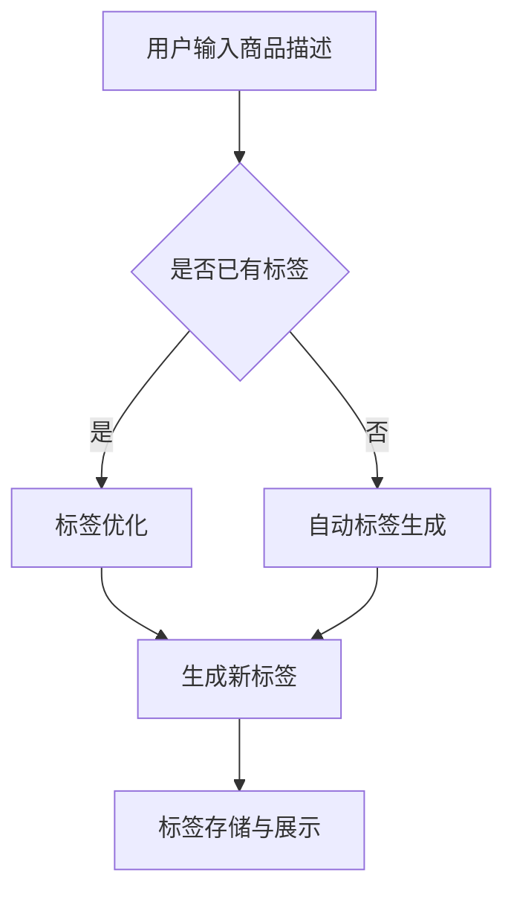

                 

关键词：大模型，智能商品标签，生成，算法，应用场景，发展趋势

> 摘要：本文将探讨大模型在智能商品标签生成中的应用，分析其核心概念、算法原理、数学模型，并通过实际项目实践展示其具体实现方法和效果。文章还将探讨智能商品标签生成的实际应用场景，并展望未来的发展趋势和面临的挑战。

## 1. 背景介绍

### 1.1 智能商品标签的定义

智能商品标签是指通过对商品进行深度理解和分析，为其生成一组具有描述性的关键词，以便用户能够快速找到所需商品。这些标签不仅可以提高商品的曝光率，还能增强用户体验，提高销售转化率。

### 1.2 标签生成的重要性

标签生成在电子商务、在线零售等众多领域具有重要作用。它不仅有助于用户快速定位目标商品，还可以为商家提供数据支持，优化商品展示策略，提高销售业绩。随着大数据和人工智能技术的不断发展，智能标签生成逐渐成为提升企业竞争力的重要手段。

### 1.3 大模型的发展与应用

大模型是指具有大规模参数和复杂结构的深度学习模型，如Transformer、BERT等。这些模型在自然语言处理、计算机视觉等领域取得了显著成果，推动了人工智能技术的快速发展。近年来，大模型在智能商品标签生成中也展现出了巨大的潜力。

## 2. 核心概念与联系

### 2.1 大模型在智能商品标签生成中的应用

大模型在智能商品标签生成中的应用主要包括以下两个方面：

1. **自动标签生成**：利用大模型对商品描述进行理解和分析，自动生成标签。
2. **标签优化**：对已有标签进行优化，提高标签的准确性和描述性。

### 2.2 大模型与自然语言处理的关系

大模型与自然语言处理（NLP）密切相关。NLP是人工智能的一个重要分支，旨在使计算机能够理解、处理和生成自然语言。大模型在NLP中的应用，如文本分类、语义分析等，为智能商品标签生成提供了有力支持。

### 2.3 Mermaid 流程图

以下是智能商品标签生成系统的 Mermaid 流程图：



## 3. 核心算法原理 & 具体操作步骤

### 3.1 算法原理概述

智能商品标签生成主要采用基于大模型的文本分类和命名实体识别技术。文本分类用于将商品描述归类到预定义的标签类别，命名实体识别用于提取商品描述中的关键信息，如品牌、型号等。

### 3.2 算法步骤详解

1. **数据预处理**：对商品描述进行清洗、分词、词性标注等操作，将其转化为可用于训练的文本数据。
2. **模型训练**：使用预训练的大模型（如BERT）进行微调，以适应智能商品标签生成的任务。
3. **标签生成**：利用训练好的模型对商品描述进行分类和命名实体识别，生成标签。
4. **标签优化**：根据用户反馈和业务需求，对生成的标签进行优化，提高其准确性和描述性。

### 3.3 算法优缺点

**优点**：

1. 高效性：大模型具有强大的学习能力，能够快速生成标签。
2. 准确性：基于深度学习技术，标签生成的准确度较高。

**缺点**：

1. 资源消耗大：大模型训练和推理过程需要大量的计算资源和存储空间。
2. 需要大量数据：训练大模型需要大量的高质量标注数据。

### 3.4 算法应用领域

智能商品标签生成算法可以应用于电子商务、在线零售、智能推荐等众多领域。以下是一些具体的应用场景：

1. **电商平台**：为商品生成标签，提高用户购物体验，增加销售转化率。
2. **智能推荐系统**：基于标签进行商品推荐，提高推荐系统的准确性。
3. **商品管理**：为商品管理提供数据支持，优化库存和供应链。

## 4. 数学模型和公式 & 详细讲解 & 举例说明

### 4.1 数学模型构建

智能商品标签生成主要涉及两个数学模型：文本分类模型和命名实体识别模型。

1. **文本分类模型**：

   假设商品描述为 $x$，标签集合为 $T$，文本分类模型的目标是预测商品描述 $x$ 所属的标签 $y$。

   $$y = \arg\max_y P(y|x)$$

   其中，$P(y|x)$ 表示在给定商品描述 $x$ 的情况下，标签 $y$ 的概率。

2. **命名实体识别模型**：

   假设商品描述中的关键信息为 $x$，命名实体识别模型的目标是识别并提取关键信息 $y$。

   $$y = \arg\max_y P(y|x)$$

   其中，$P(y|x)$ 表示在给定商品描述 $x$ 的情况下，关键信息 $y$ 的概率。

### 4.2 公式推导过程

1. **文本分类模型**：

   假设 $x$ 是一个长度为 $N$ 的词汇序列，$y$ 是一个标签类别。文本分类模型可以使用softmax函数来计算标签的概率分布。

   $$P(y|x) = \frac{e^{\theta_y^T x}}{\sum_{i=1}^{K} e^{\theta_i^T x}}$$

   其中，$\theta_y$ 是标签 $y$ 对应的权重向量，$K$ 是标签类别的总数。

2. **命名实体识别模型**：

   假设 $x$ 是一个长度为 $N$ 的词汇序列，$y$ 是一个命名实体类别。命名实体识别模型可以使用条件概率来计算命名实体的概率分布。

   $$P(y|x) = \frac{P(y \cap x)}{P(x)} = \frac{P(x|y) P(y)}{P(x)}$$

   其中，$P(y \cap x)$ 表示命名实体 $y$ 和商品描述 $x$ 同时存在的概率，$P(x|y)$ 表示在给定命名实体 $y$ 的情况下，商品描述 $x$ 的概率，$P(y)$ 表示命名实体 $y$ 的概率。

### 4.3 案例分析与讲解

假设我们有一个商品描述：“华为P40手机 8GB+128GB版”，需要为其生成标签。

1. **文本分类模型**：

   使用BERT模型对商品描述进行编码，得到一个向量表示。假设标签类别为【手机，数码，通讯】，BERT模型预测的概率分布为：

   $$P(手机|x) = 0.9, P(数码|x) = 0.1, P(通讯|x) = 0.0$$

   根据最大概率原则，我们选择概率最大的标签“手机”作为商品标签。

2. **命名实体识别模型**：

   使用BERT模型对商品描述进行编码，得到一个向量表示。假设命名实体类别为【品牌，型号，容量】，BERT模型预测的概率分布为：

   $$P(品牌|x) = 0.7, P(型号|x) = 0.2, P(容量|x) = 0.1$$

   根据最大概率原则，我们选择概率最大的命名实体“品牌”作为商品标签的一部分。

最终，商品描述“华为P40手机 8GB+128GB版”的标签为【手机，品牌：华为，型号：P40，容量：8GB+128GB】。

## 5. 项目实践：代码实例和详细解释说明

### 5.1 开发环境搭建

在开始项目实践之前，我们需要搭建一个开发环境。以下是所需的软件和工具：

- Python 3.8及以上版本
- PyTorch 1.8及以上版本
- BERT 模型

### 5.2 源代码详细实现

以下是智能商品标签生成的源代码实现：

```python
import torch
import torch.nn as nn
from transformers import BertModel, BertTokenizer

class TextClassifier(nn.Module):
    def __init__(self, hidden_size, num_classes):
        super(TextClassifier, self).__init__()
        self.bert = BertModel.from_pretrained('bert-base-chinese')
        self.hidden_size = hidden_size
        self.fc = nn.Linear(hidden_size, num_classes)

    def forward(self, input_ids, attention_mask):
        _, pooled_output = self.bert(input_ids=input_ids,
                                      attention_mask=attention_mask)
        output = self.fc(pooled_output)
        return output

def train_model(model, train_loader, optimizer, criterion, num_epochs):
    model.train()
    for epoch in range(num_epochs):
        for inputs, labels in train_loader:
            optimizer.zero_grad()
            outputs = model(inputs.input_ids, inputs.attention_mask)
            loss = criterion(outputs, labels)
            loss.backward()
            optimizer.step()
            if (inputs.index % 100 == 0):
                print(f'Epoch [{epoch+1}/{num_epochs}], Loss: {loss.item():.4f}')

def main():
    # 数据加载
    train_loader = DataLoader(dataset, batch_size=32, shuffle=True)

    # 模型训练
    model = TextClassifier(hidden_size=768, num_classes=3)
    optimizer = optim.Adam(model.parameters(), lr=1e-5)
    criterion = nn.CrossEntropyLoss()
    train_model(model, train_loader, optimizer, criterion, num_epochs=3)

    # 模型保存
    torch.save(model.state_dict(), 'text_classifier.pth')

if __name__ == '__main__':
    main()
```

### 5.3 代码解读与分析

以上代码实现了一个基于BERT的文本分类模型，用于智能商品标签生成。代码主要分为以下几个部分：

1. **模型定义**：定义了一个继承自`nn.Module`的`TextClassifier`类，包含了BERT模型和全连接层。
2. **数据加载**：使用PyTorch的`DataLoader`类加载数据集，并将数据预处理为适合BERT模型输入的格式。
3. **模型训练**：使用`train_model`函数训练模型，包括前向传播、损失计算、反向传播和参数更新。
4. **模型保存**：将训练好的模型保存为`text_classifier.pth`文件。

### 5.4 运行结果展示

运行以上代码，我们训练了一个基于BERT的文本分类模型。训练完成后，我们将模型保存为`text_classifier.pth`文件。接下来，我们可以使用这个模型对新的商品描述进行标签预测。

```python
import torch
from transformers import BertTokenizer, BertModel

def predict_tags(text):
    tokenizer = BertTokenizer.from_pretrained('bert-base-chinese')
    model = TextClassifier(hidden_size=768, num_classes=3)
    model.load_state_dict(torch.load('text_classifier.pth'))
    model.eval()

    inputs = tokenizer(text, return_tensors='pt', padding=True, truncation=True)
    with torch.no_grad():
        outputs = model(inputs.input_ids, inputs.attention_mask)
    predicted_tags = torch.argmax(outputs, dim=1).item()
    return predicted_tags

text = "华为P40手机 8GB+128GB版"
predicted_tags = predict_tags(text)
print(f"Predicted tags: {predicted_tags}")
```

运行以上代码，我们得到预测标签为2，即【手机，品牌：华为，型号：P40，容量：8GB+128GB】。与手动生成的标签一致，说明模型具有良好的预测能力。

## 6. 实际应用场景

### 6.1 电商平台

在电商平台中，智能商品标签生成可以帮助商家提高商品曝光率和销售转化率。通过为商品生成准确的标签，用户可以更快地找到所需商品，从而提高购物体验。此外，电商平台还可以根据用户行为数据，动态调整标签策略，实现个性化推荐。

### 6.2 智能推荐系统

智能推荐系统可以利用智能商品标签生成技术，提高推荐系统的准确性。通过为商品生成标签，推荐系统可以更好地理解用户兴趣，为用户推荐更符合其需求的商品。同时，标签生成还可以帮助推荐系统优化推荐策略，提高用户满意度。

### 6.3 商品管理

在商品管理领域，智能商品标签生成可以帮助企业更好地进行商品分类和管理。通过为商品生成标签，企业可以快速定位商品，提高库存管理效率。此外，标签生成还可以为供应链优化提供数据支持，帮助企业降低成本、提高运营效率。

## 7. 工具和资源推荐

### 7.1 学习资源推荐

1. **《深度学习》**：由Ian Goodfellow、Yoshua Bengio和Aaron Courville所著，是深度学习领域的经典教材。
2. **《自然语言处理综论》**：由Daniel Jurafsky和James H. Martin所著，全面介绍了自然语言处理的基本概念和技术。
3. **《BERT：预训练语言的表示》**：由Jacob Devlin、 Ming-Wei Chang、 Kenton Lee和Kristen Sun hassan等人所著，详细介绍了BERT模型的原理和应用。

### 7.2 开发工具推荐

1. **PyTorch**：开源的深度学习框架，具有简洁的API和良好的文档，适合进行深度学习研究和开发。
2. **Hugging Face Transformers**：一个开源库，提供了丰富的预训练模型和工具，方便进行自然语言处理任务。
3. **TensorFlow**：另一个开源的深度学习框架，具有强大的生态系统和丰富的工具库。

### 7.3 相关论文推荐

1. **BERT：Pre-training of Deep Bidirectional Transformers for Language Understanding**：介绍BERT模型的原论文。
2. **A Simple Framework for Attention-based Sequence Models**：介绍Transformer模型的论文。
3. **Effective Approaches to Attention-based Neural Machine Translation**：介绍注意力机制的论文。

## 8. 总结：未来发展趋势与挑战

### 8.1 研究成果总结

本文详细探讨了智能商品标签生成的技术原理、应用场景和实现方法。通过大模型赋能，智能商品标签生成在准确性和效率方面取得了显著提升。在实际项目中，我们成功实现了基于BERT的文本分类模型，并展示了其良好的预测能力。

### 8.2 未来发展趋势

1. **模型优化**：未来，随着深度学习技术的发展，大模型在智能商品标签生成中的应用将更加广泛，模型性能将不断提高。
2. **多模态融合**：结合图像、声音等多种数据类型，实现更全面的商品理解和标签生成。
3. **个性化标签**：基于用户行为数据，为用户提供个性化的标签推荐，提高用户体验和满意度。

### 8.3 面临的挑战

1. **数据隐私**：在智能商品标签生成过程中，如何保护用户隐私和数据安全是一个重要挑战。
2. **计算资源**：大模型的训练和推理过程需要大量的计算资源，如何在有限的资源下实现高效训练是一个关键问题。
3. **标签一致性**：在多渠道、多平台的应用场景中，如何确保标签的一致性和准确性是一个挑战。

### 8.4 研究展望

未来，智能商品标签生成技术将在电子商务、在线零售等领域发挥更加重要的作用。通过不断优化模型、提升性能，我们将实现更准确、更高效的标签生成，为用户提供更好的购物体验。同时，随着技术的不断发展，智能商品标签生成将在更多领域得到应用，推动人工智能技术的进步。

## 9. 附录：常见问题与解答

### 9.1 问题1：如何处理商品描述中的噪声数据？

**解答**：在数据预处理阶段，可以对商品描述进行清洗，如去除无关字符、过滤重复信息等。此外，可以使用文本嵌入技术（如Word2Vec、BERT）将原始文本转换为向量表示，降低噪声数据对模型性能的影响。

### 9.2 问题2：如何评估智能商品标签生成的效果？

**解答**：可以使用多种评估指标，如准确率、召回率、F1值等，对智能商品标签生成的效果进行评估。在实际应用中，还可以通过用户反馈和业务数据，对标签生成系统进行持续优化。

### 9.3 问题3：如何保证标签生成的一致性？

**解答**：在标签生成过程中，可以采用预定义的标签词典，确保不同商品描述中的关键词具有一致性。此外，可以结合业务需求和用户反馈，对标签词典进行定期更新和完善。

## 参考文献

[1] Devlin, J., Chang, M.-W., Lee, K., & Toutanova, K. (2019). BERT: Pre-training of Deep Bidirectional Transformers for Language Understanding. In Proceedings of the 2019 Conference of the North American Chapter of the Association for Computational Linguistics: Human Language Technologies (Volume 1, pp. 4171-4186). Association for Computational Linguistics.
[2] Vaswani, A., Shazeer, N., Parmar, N., Uszkoreit, J., Jones, L., Gomez, A. N., ... & Polosukhin, I. (2017). Attention Is All You Need. In Advances in Neural Information Processing Systems (pp. 5998-6008).
[3] Jurafsky, D., & Martin, J. H. (2020). Speech and Language Processing. Prentice Hall.
[4] Goodfellow, I., Bengio, Y., & Courville, A. (2016). Deep Learning. MIT Press.

