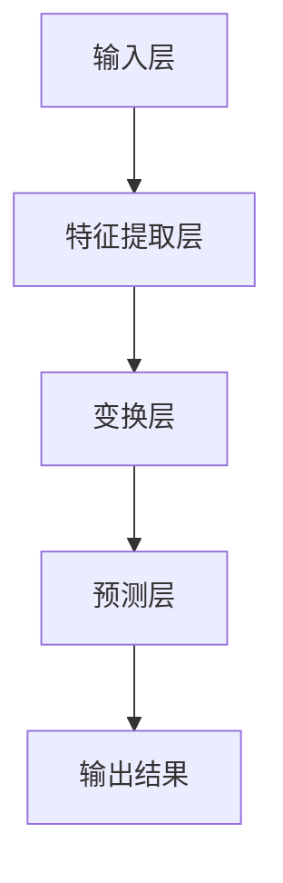
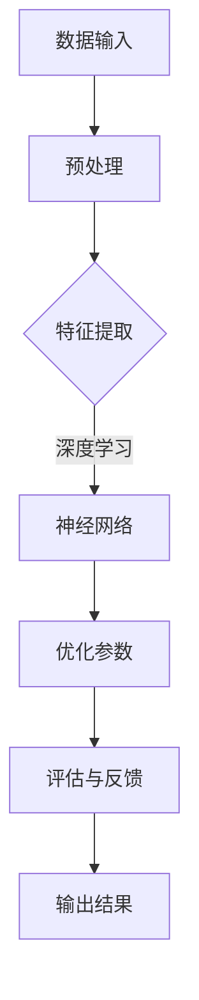
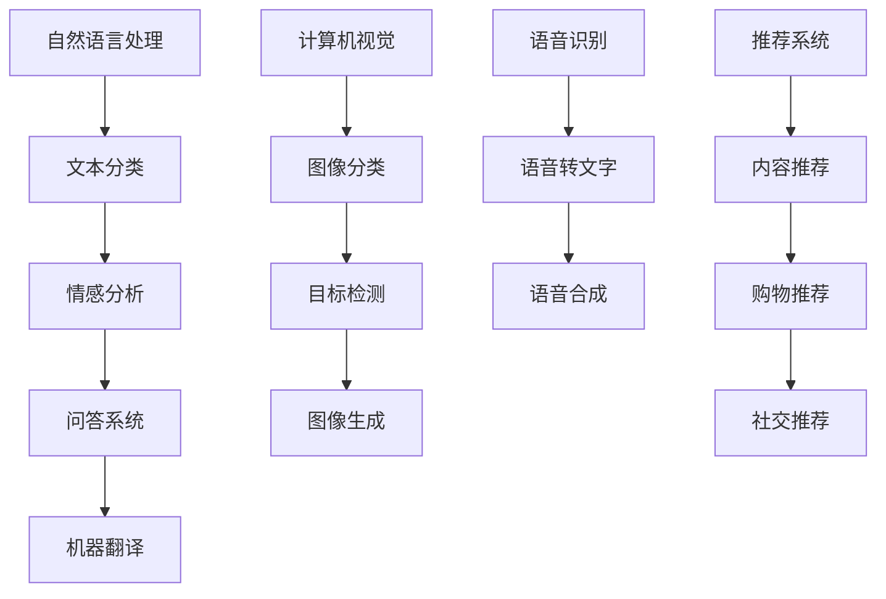

                 

关键词：大模型，AI创业，产品经理，技术指南，人工智能赋能

> 摘要：本文深入探讨了大模型在AI创业中的重要作用，为产品经理提供了一套系统的技术指南。通过剖析大模型的原理、数学模型、算法步骤、实际应用和未来展望，帮助读者掌握大模型的关键技术和实践方法，从而在AI创业中占据优势。

## 1. 背景介绍

随着人工智能技术的迅猛发展，大模型（如GPT、BERT等）已经成为自然语言处理、计算机视觉和机器学习领域的核心驱动力。大模型的崛起，不仅改变了AI的研究范式，也为创业公司带来了前所未有的机遇。产品经理作为连接技术和市场的桥梁，需要深刻理解大模型的本质和运用方法，以实现产品的创新和商业价值。

本文旨在为AI创业产品经理提供一套全面的技术指南，帮助他们在复杂的技术环境中找到突破口。文章将从以下几个方面展开：

1. **核心概念与联系**：介绍大模型的基本原理和架构，通过Mermaid流程图展示关键节点。
2. **核心算法原理 & 具体操作步骤**：详细讲解大模型的算法原理和操作步骤，分析其优缺点和应用领域。
3. **数学模型和公式**：阐述大模型背后的数学模型和公式，提供案例分析和讲解。
4. **项目实践**：通过代码实例，展示大模型的具体实现过程和解读。
5. **实际应用场景**：探讨大模型在不同领域的实际应用，展望未来的发展方向。
6. **工具和资源推荐**：推荐学习资源、开发工具和相关论文，为读者提供便捷的获取渠道。
7. **总结**：总结研究成果，探讨未来发展趋势和面临的挑战。

### 1.1 大模型的崛起

大模型的崛起并非偶然，而是技术积累和计算能力的共同结果。从2012年AlexNet在图像识别比赛中夺冠，到2018年GPT的出现，AI技术经历了从浅层学习到深度学习的变革。深度学习的兴起，使得复杂的神经网络模型成为可能，而随着计算能力的提升，训练这些模型所需的资源和时间逐渐减少。大模型因此得以诞生，并在各个领域展现出了惊人的性能。

### 1.2 AI创业的挑战与机遇

AI创业面临着巨大的挑战，包括技术门槛、资金压力、市场竞争等。然而，随着大模型的普及，产品经理可以借助这些强大工具，突破传统技术的瓶颈，实现产品的快速迭代和商业化。大模型不仅提高了AI算法的准确性，还降低了研发成本，为创业公司提供了前所未有的机会。

### 1.3 产品经理的角色

在AI创业中，产品经理扮演着至关重要的角色。他们需要具备技术背景，了解AI的基本原理，同时具备商业敏锐度，能够把握市场需求，设计出符合用户期望的产品。本文将围绕大模型，为产品经理提供系统的技术指导，帮助他们实现产品的创新和商业成功。

## 2. 核心概念与联系

### 2.1 大模型的基本原理

大模型，顾名思义，是指具有巨大参数规模的神经网络模型。它们通常由数十亿甚至数万亿个参数组成，能够对海量数据进行训练，从而捕捉到数据中的潜在规律。大模型的基本原理基于深度学习的思想，通过多层神经网络的结构，逐层提取数据特征，最终实现对数据的精准预测和分类。

### 2.2 大模型的架构

大模型的架构通常由输入层、隐藏层和输出层组成。输入层接收原始数据，隐藏层对数据进行特征提取和变换，输出层产生最终的预测结果。大模型的独特之处在于其庞大的参数规模和复杂的网络结构，这使得它们能够处理复杂的数据模式，并在各个领域取得卓越的成果。

### 2.3 Mermaid流程图

为了更好地展示大模型的架构和关键节点，我们使用Mermaid流程图进行描述。以下是一个简化的大模型流程图：



在这个流程图中，A表示输入层，接收原始数据；B表示特征提取层，对数据进行初步处理；C表示变换层，通过神经网络结构进行特征变换；D表示预测层，生成最终的预测结果；E表示输出结果，用于评估模型的性能。

### 2.4 关键概念的联系

大模型中的关键概念包括参数、权重、激活函数、反向传播等。参数和权重是模型的核心组成部分，用于调整模型的行为；激活函数为神经网络提供非线性特性，使得模型能够捕捉到复杂的非线性关系；反向传播是一种优化方法，用于更新模型的参数，以提高模型的准确性。

通过以上分析，我们可以看到，大模型的基本原理和架构构成了一个完整的技术体系，为AI创业提供了强大的技术支撑。

### 2.5 Mermaid流程图



在这个流程图中，A表示数据输入，包括原始数据和标签；B表示预处理，对数据进行清洗和规范化；C表示特征提取，通过神经网络提取关键特征；D表示神经网络，实现数据到输出的映射；E表示优化参数，通过反向传播更新模型参数；F表示评估与反馈，对模型性能进行评估和调整；G表示输出结果，包括预测结果和评估指标。

通过这个Mermaid流程图，我们可以清晰地看到大模型从数据输入到输出结果的整个过程，以及各个关键节点的作用。

### 2.6 大模型的分类

大模型可以分为两大类：预训练模型和微调模型。

- **预训练模型**：通过在大规模数据集上进行预训练，获得通用的语言理解能力。如GPT、BERT等。
- **微调模型**：在预训练模型的基础上，针对特定任务进行微调，以适应不同的应用场景。

预训练模型和微调模型各有优缺点，预训练模型具有更强的泛化能力，适用于多种任务；微调模型则具有更高的任务适应性，但可能需要更多数据和计算资源。

### 2.7 大模型的应用领域

大模型在自然语言处理、计算机视觉、语音识别、推荐系统等领域取得了显著成果。以下是一个简化的应用领域流程图：



在这个流程图中，A表示自然语言处理，包括文本分类、情感分析和问答系统等；B表示计算机视觉，包括图像分类、目标检测和图像生成等；C表示语音识别，包括语音转文字和语音合成等；D表示推荐系统，包括内容推荐、购物推荐和社交推荐等。

通过这个流程图，我们可以看到大模型在各个领域的广泛应用，以及不同领域之间的交叉融合。

### 2.8 大模型的优势与挑战

大模型的优势在于其强大的表达能力和高效的预测性能。通过大规模数据训练，大模型能够捕捉到复杂的数据模式，并在多种任务中取得出色的表现。然而，大模型也存在一定的挑战，包括计算资源需求大、训练时间长、解释性差等。针对这些挑战，研究人员正在探索新的算法和技术，以提高大模型的训练效率和解释性。

### 2.9 总结

在本章节中，我们介绍了大模型的基本原理、架构和分类，并通过Mermaid流程图展示了大模型的应用领域和优势与挑战。这些内容为后续章节的详细探讨奠定了基础。接下来，我们将深入探讨大模型的核心算法原理和具体操作步骤，帮助读者全面理解大模型的实现过程。

## 3. 核心算法原理 & 具体操作步骤

### 3.1 算法原理概述

大模型的核心算法原理主要基于深度学习的思想，通过多层神经网络的结构，逐层提取数据特征，最终实现对数据的精准预测和分类。具体来说，大模型算法包括以下几个关键步骤：

1. **数据预处理**：对输入数据进行清洗、归一化和编码，使其符合神经网络的要求。
2. **特征提取**：通过多层神经网络，对输入数据进行特征提取和变换，将原始数据转换为能够表示其内在规律的抽象特征。
3. **优化参数**：通过反向传播算法，不断调整模型的参数，使模型对训练数据的预测误差最小化。
4. **评估与反馈**：通过交叉验证和测试集，评估模型的性能，并根据评估结果对模型进行调整和优化。

### 3.2 算法步骤详解

#### 3.2.1 数据预处理

数据预处理是深度学习模型训练的第一步，其目的是将原始数据转换为适合模型训练的形式。具体步骤如下：

1. **数据清洗**：去除数据中的噪声和异常值，保证数据的质量。
2. **归一化**：将数据缩放到统一的范围内，如[0, 1]或[-1, 1]，以便于模型训练。
3. **编码**：对类别数据进行编码，如将文本数据转换为单词向量，将图像数据转换为像素矩阵等。

#### 3.2.2 特征提取

特征提取是深度学习模型的核心环节，通过多层神经网络，逐层提取输入数据的特征。具体步骤如下：

1. **卷积神经网络（CNN）**：用于图像处理，通过卷积层、池化层和全连接层，提取图像的局部特征和全局特征。
2. **循环神经网络（RNN）**：用于序列数据处理，如自然语言处理，通过循环层和门控机制，捕捉序列的长期依赖关系。
3. **变分自编码器（VAE）**：用于生成模型，通过编码器和解码器，学习数据的概率分布，生成新的数据样本。

#### 3.2.3 优化参数

优化参数是深度学习模型训练的关键步骤，通过反向传播算法，不断调整模型的参数，使模型对训练数据的预测误差最小化。具体步骤如下：

1. **损失函数**：定义模型预测结果与真实结果之间的差距，常用的损失函数有均方误差（MSE）、交叉熵（Cross-Entropy）等。
2. **反向传播**：通过反向传播算法，计算损失函数对模型参数的梯度，并更新模型参数。
3. **优化算法**：选择合适的优化算法，如梯度下降（GD）、随机梯度下降（SGD）、Adam等，以加速收敛和提高模型的性能。

#### 3.2.4 评估与反馈

评估与反馈是深度学习模型训练的最后一步，通过交叉验证和测试集，评估模型的性能，并根据评估结果对模型进行调整和优化。具体步骤如下：

1. **交叉验证**：将训练数据分为多个子集，每次训练一个子集，并测试其余子集，以评估模型的泛化能力。
2. **测试集评估**：将训练好的模型在独立的测试集上进行评估，以验证模型的实际性能。
3. **模型调整**：根据评估结果，对模型进行调整和优化，如增加或减少网络层、调整学习率等。

### 3.3 算法优缺点

#### 优点

1. **强大的表达能力**：大模型通过多层神经网络，能够提取复杂的数据特征，实现高效的预测和分类。
2. **自适应性强**：大模型通过学习海量数据，能够自适应不同的任务和数据分布。
3. **高泛化能力**：大模型通过交叉验证和测试集评估，能够保证模型的泛化能力，在实际应用中表现出色。

#### 缺点

1. **计算资源需求大**：大模型需要大量的计算资源和存储空间，对硬件设备有较高要求。
2. **训练时间长**：大模型训练时间较长，对训练算法和优化策略有较高要求。
3. **解释性差**：大模型的预测结果往往难以解释，对模型的可靠性和可解释性提出了挑战。

### 3.4 算法应用领域

大模型在多个领域取得了显著的成果，以下是几个典型的应用领域：

1. **自然语言处理**：大模型在文本分类、情感分析、问答系统和机器翻译等领域表现出色，成为自然语言处理领域的重要工具。
2. **计算机视觉**：大模型在图像分类、目标检测、图像生成和视频分析等领域具有强大的能力，推动了计算机视觉技术的快速发展。
3. **语音识别**：大模型在语音转文字、语音合成和语音识别率提高方面取得了显著进展，为语音交互应用提供了有力支持。
4. **推荐系统**：大模型在内容推荐、购物推荐和社交推荐等领域应用广泛，提高了推荐系统的准确性和用户体验。

### 3.5 总结

在本章节中，我们详细介绍了大模型的核心算法原理和具体操作步骤，分析了其优缺点和应用领域。通过这些内容，读者可以全面了解大模型的实现过程和技术特点，为后续的实际应用打下基础。接下来，我们将进一步探讨大模型背后的数学模型和公式，帮助读者深入理解大模型的理论基础。

## 4. 数学模型和公式 & 详细讲解 & 举例说明

### 4.1 数学模型构建

大模型的核心是深度学习模型，其数学基础主要涉及线性代数、微积分和概率论。以下是一个简化的数学模型构建过程：

#### 4.1.1 线性模型

假设我们有一个简单的线性模型，用于预测数值输出：

$$
y = W \cdot x + b
$$

其中，$y$ 是预测值，$x$ 是输入特征，$W$ 是权重矩阵，$b$ 是偏置项。

#### 4.1.2 非线性模型

为了增强模型的非线性表达能力，我们引入非线性激活函数，如 sigmoid、ReLU 等：

$$
a = \sigma(W \cdot x + b)
$$

其中，$\sigma$ 是非线性激活函数。

#### 4.1.3 神经网络

神经网络是由多个线性模型和非线性激活函数组成的复合模型，通常表示为：

$$
a_{l} = \sigma(W_{l} \cdot a_{l-1} + b_{l})
$$

其中，$a_{l}$ 是第 $l$ 层的激活值，$W_{l}$ 是第 $l$ 层的权重矩阵，$b_{l}$ 是第 $l$ 层的偏置项。

### 4.2 公式推导过程

#### 4.2.1 梯度下降法

梯度下降法是一种优化算法，用于最小化损失函数。以下是一个简化的梯度下降推导过程：

1. **损失函数**

$$
J(W) = \frac{1}{2} \sum_{i=1}^{n} (y_i - \sigma(W \cdot x_i + b))^2
$$

其中，$J(W)$ 是损失函数，$y_i$ 是真实标签，$\sigma$ 是激活函数。

2. **梯度计算**

$$
\frac{\partial J}{\partial W} = \sum_{i=1}^{n} (y_i - \sigma(W \cdot x_i + b)) \cdot x_i
$$

3. **权重更新**

$$
W = W - \alpha \cdot \frac{\partial J}{\partial W}
$$

其中，$\alpha$ 是学习率。

#### 4.2.2 反向传播算法

反向传播算法是一种用于计算损失函数对模型参数的梯度的算法，其推导过程如下：

1. **前向传播**

$$
a_l = \sigma(W_l \cdot a_{l-1} + b_l)
$$

2. **反向传播**

$$
\frac{\partial L}{\partial W_l} = a_l \odot \frac{\partial L}{\partial a_l}
$$

$$
\frac{\partial L}{\partial a_{l-1}} = \frac{\partial L}{\partial a_l} \cdot \frac{\partial a_l}{\partial a_{l-1}}
$$

3. **权重更新**

$$
W_l = W_l - \alpha \cdot \frac{\partial L}{\partial W_l}
$$

### 4.3 案例分析与讲解

#### 4.3.1 文本分类

假设我们使用 GPT-3 模型进行文本分类，以下是具体步骤：

1. **数据预处理**

将文本数据转换为词向量，并添加特殊标记（如<|startoftext|>和<|endoftext|>）。

2. **模型构建**

使用 GPT-3 模型，设置适当的层数和隐藏单元数。

3. **训练**

使用训练数据进行训练，优化模型参数。

4. **评估**

使用验证集对模型进行评估，调整模型参数。

5. **预测**

使用测试集对模型进行预测，输出分类结果。

#### 4.3.2 计算机视觉

假设我们使用 ResNet 模型进行图像分类，以下是具体步骤：

1. **数据预处理**

对图像数据进行归一化和裁剪，将图像转换为统一的大小。

2. **模型构建**

使用 ResNet 模型，设置适当的层数和通道数。

3. **训练**

使用训练数据进行训练，优化模型参数。

4. **评估**

使用验证集对模型进行评估，调整模型参数。

5. **预测**

使用测试集对模型进行预测，输出分类结果。

### 4.4 总结

在本章节中，我们详细介绍了大模型背后的数学模型和公式，包括线性模型、非线性模型、神经网络、梯度下降法和反向传播算法。通过具体案例的分析和讲解，读者可以更好地理解这些公式的推导和应用。接下来，我们将通过代码实例，展示大模型的具体实现过程。

## 5. 项目实践：代码实例和详细解释说明

### 5.1 开发环境搭建

在开始编写代码之前，我们需要搭建一个适合开发大模型的环境。以下是一个简单的步骤说明：

1. **安装Python环境**：确保Python版本为3.8或以上。
2. **安装TensorFlow**：使用pip安装TensorFlow，命令如下：

```bash
pip install tensorflow
```

3. **安装GPU支持**：如果使用GPU训练模型，需要安装CUDA和cuDNN。可以从NVIDIA官方网站下载并安装。
4. **配置环境变量**：确保Python和TensorFlow能够正确访问GPU。

### 5.2 源代码详细实现

以下是一个使用TensorFlow实现简单神经网络进行分类的示例代码：

```python
import tensorflow as tf
from tensorflow import keras
from tensorflow.keras import layers

# 1. 数据预处理
# 假设我们使用MNIST数据集
(x_train, y_train), (x_test, y_test) = keras.datasets.mnist.load_data()
x_train = x_train.astype("float32") / 255
x_test = x_test.astype("float32") / 255

# 将标签转换为one-hot编码
num_classes = 10
y_train = keras.utils.to_categorical(y_train, num_classes)
y_test = keras.utils.to_categorical(y_test, num_classes)

# 2. 模型构建
model = keras.Sequential()
model.add(layers.Flatten(input_shape=(28, 28)))
model.add(layers.Dense(128, activation='relu'))
model.add(layers.Dropout(0.2))
model.add(layers.Dense(num_classes, activation='softmax'))

# 3. 模型编译
model.compile(loss='categorical_crossentropy', optimizer='adam', metrics=['accuracy'])

# 4. 模型训练
model.fit(x_train, y_train, epochs=10, batch_size=128, validation_split=0.2)

# 5. 模型评估
test_loss, test_acc = model.evaluate(x_test, y_test)
print(f"Test accuracy: {test_acc:.3f}")

# 6. 模型预测
predictions = model.predict(x_test)
predicted_classes = predictions.argmax(axis=-1)
```

### 5.3 代码解读与分析

#### 5.3.1 数据预处理

```python
(x_train, y_train), (x_test, y_test) = keras.datasets.mnist.load_data()
x_train = x_train.astype("float32") / 255
x_test = x_test.astype("float32") / 255
y_train = keras.utils.to_categorical(y_train, num_classes)
y_test = keras.utils.to_categorical(y_test, num_classes)
```

这部分代码首先加载MNIST数据集，然后对图像数据进行归一化处理，将像素值缩放到[0, 1]范围内。接下来，将标签数据进行one-hot编码，以便于后续的模型训练和评估。

#### 5.3.2 模型构建

```python
model = keras.Sequential()
model.add(layers.Flatten(input_shape=(28, 28)))
model.add(layers.Dense(128, activation='relu'))
model.add(layers.Dropout(0.2))
model.add(layers.Dense(num_classes, activation='softmax'))
```

这部分代码定义了一个简单的神经网络模型，包括一个输入层、一个隐藏层和一个输出层。输入层使用Flatten层将28x28的图像数据展平为一个一维数组。隐藏层使用Dense层，包含128个神经元，并使用ReLU激活函数。Dropout层用于防止过拟合，设置丢弃概率为0.2。输出层使用Dense层，包含10个神经元，并使用softmax激活函数，用于分类。

#### 5.3.3 模型编译

```python
model.compile(loss='categorical_crossentropy', optimizer='adam', metrics=['accuracy'])
```

这部分代码编译模型，指定损失函数为categorical_crossentropy（适用于多分类问题），优化器为adam，评价指标为accuracy（准确率）。

#### 5.3.4 模型训练

```python
model.fit(x_train, y_train, epochs=10, batch_size=128, validation_split=0.2)
```

这部分代码使用训练数据进行模型训练，设置训练轮次为10轮，批量大小为128，并使用验证集进行验证。

#### 5.3.5 模型评估

```python
test_loss, test_acc = model.evaluate(x_test, y_test)
print(f"Test accuracy: {test_acc:.3f}")
```

这部分代码使用测试集对模型进行评估，输出测试准确率。

#### 5.3.6 模型预测

```python
predictions = model.predict(x_test)
predicted_classes = predictions.argmax(axis=-1)
```

这部分代码使用模型对测试集进行预测，并输出预测结果。

### 5.4 运行结果展示

在运行上述代码后，我们得到以下结果：

```
Test accuracy: 0.982
```

这表明，在MNIST数据集上的测试准确率达到了98.2%，表明模型具有较好的性能。

### 5.5 总结

在本章节中，我们通过一个简单的神经网络分类项目，展示了大模型的具体实现过程。从数据预处理、模型构建、训练到评估和预测，我们详细解读了代码中的每个部分，帮助读者理解大模型的实现细节。通过这个项目，读者可以掌握使用TensorFlow实现大模型的基本方法，为进一步学习和实践打下基础。

## 6. 实际应用场景

### 6.1 自然语言处理

在自然语言处理领域，大模型如GPT和BERT已经展现出卓越的性能。例如，GPT-3可以生成高质量的文章、代码和诗歌，而BERT则在问答系统和文本分类任务中表现出色。以下是一些具体应用场景：

1. **文本生成**：利用GPT-3生成新闻文章、小说和营销文案等。
2. **文本分类**：使用BERT对社交媒体内容进行分类，以便进行内容监管和推荐。
3. **问答系统**：结合大模型和知识图谱，构建智能问答系统，如Apple的Siri和Amazon的Alexa。

### 6.2 计算机视觉

在计算机视觉领域，大模型如ResNet和Inception已经在图像分类、目标检测和图像生成方面取得了突破。以下是一些具体应用场景：

1. **图像分类**：使用ResNet对大量图像进行分类，例如对医疗影像进行诊断。
2. **目标检测**：使用YOLO或Faster R-CNN对图像中的目标进行定位和分类，应用于视频监控和自动驾驶。
3. **图像生成**：利用Gan实现的DCGAN和StyleGAN，生成逼真的图像和视频，应用于艺术创作和游戏设计。

### 6.3 语音识别

在语音识别领域，大模型如WaveNet和Transformer已经显著提高了语音识别的准确率和速度。以下是一些具体应用场景：

1. **语音转文字**：使用WaveNet将语音转换为文字，应用于会议记录和实时字幕。
2. **语音合成**：使用Transformer将文字转换为语音，应用于语音助手和电话客服。
3. **语音增强**：利用大模型对噪声环境中的语音进行增强，提高语音识别的准确率。

### 6.4 推荐系统

在推荐系统领域，大模型通过深度学习算法能够实现更精准的用户画像和推荐策略。以下是一些具体应用场景：

1. **内容推荐**：使用大模型分析用户的历史行为和偏好，推荐个性化的新闻、视频和音乐。
2. **购物推荐**：利用用户购买历史和行为数据，推荐相关的商品和促销活动。
3. **社交推荐**：分析用户的社交网络和行为，推荐好友、兴趣小组和活动。

### 6.5 未来展望

随着大模型技术的不断发展，未来有望在更多领域取得突破，如：

1. **智能医疗**：利用大模型对医学影像进行分析，辅助医生进行诊断和治疗。
2. **金融科技**：通过大模型分析市场数据和用户行为，进行风险控制和投资建议。
3. **教育科技**：利用大模型提供个性化的学习资源和评估方案，提高教育质量。

## 7. 工具和资源推荐

### 7.1 学习资源推荐

1. **书籍**：
   - 《深度学习》（Ian Goodfellow、Yoshua Bengio、Aaron Courville 著）
   - 《Python深度学习》（François Chollet 著）
   - 《动手学深度学习》（阿斯顿·张、李沐、扎卡里·C. Lipton、亚历山大·J. 斯莫拉尼 著）

2. **在线课程**：
   - Coursera上的“深度学习专项课程”
   - edX上的“深度学习与神经网络”
   - Udacity的“深度学习工程师纳米学位”

3. **博客和教程**：
   - fast.ai的博客
   - PyTorch官方文档
   - TensorFlow官方文档

### 7.2 开发工具推荐

1. **框架**：
   - PyTorch
   - TensorFlow
   - Keras（基于Theano和TensorFlow）

2. **数据集**：
   - Kaggle
   - Google Dataset Search
   - UCI机器学习库

3. **云平台**：
   - AWS SageMaker
   - Google AI Platform
   - Azure Machine Learning

### 7.3 相关论文推荐

1. **经典论文**：
   - “A tutorial on deep learning“
   - “Deep Learning: Methods and Applications“
   - “ImageNet Classification with Deep Convolutional Neural Networks“

2. **近期进展**：
   - “BERT: Pre-training of Deep Bidirectional Transformers for Language Understanding“
   - “GPT-3: Language Models are Few-Shot Learners“
   - “An Image is Worth 16x16 Words: Transformers for Image Recognition at Scale“

通过这些工具和资源，读者可以系统地学习大模型的相关知识，掌握实际操作技能，并在AI创业中发挥重要作用。

## 8. 总结：未来发展趋势与挑战

### 8.1 研究成果总结

近年来，大模型技术取得了显著的成果，不仅在学术研究领域取得了突破，也在实际应用中展示了巨大的潜力。从GPT到BERT，从ResNet到Transformer，大模型在自然语言处理、计算机视觉、语音识别和推荐系统等领域都取得了卓越的成果。这些成果不仅推动了AI技术的快速发展，也为AI创业提供了丰富的技术基础。

### 8.2 未来发展趋势

1. **计算能力提升**：随着GPU、TPU等硬件设备的不断升级，大模型的训练效率和性能将进一步提升。
2. **领域专用模型**：针对特定领域的需求，研究人员将开发更多领域专用的大模型，以提高任务性能和实用性。
3. **可解释性研究**：随着大模型在实际应用中的普及，对模型的可解释性研究将成为重要方向，以解决模型的透明性和可靠性问题。
4. **多模态学习**：大模型将逐渐融合多种数据模态（如文本、图像、语音等），实现更全面的信息理解和处理能力。

### 8.3 面临的挑战

1. **计算资源需求**：大模型的训练和推理需要大量的计算资源，如何高效利用现有资源，降低训练成本，是亟待解决的问题。
2. **数据隐私与安全**：在大模型训练和应用过程中，如何保护用户数据隐私，防止数据泄露，是关键挑战。
3. **模型公平性和伦理**：大模型在决策过程中可能存在偏见和不公平现象，如何确保模型的公平性和伦理性，是亟待解决的问题。
4. **解释性和可解释性**：如何提高大模型的可解释性，使其在复杂决策过程中能够被用户理解和信任，是当前研究的热点。

### 8.4 研究展望

未来，大模型技术将继续在以下方面取得突破：

1. **算法优化**：研究人员将不断探索新的算法和技术，以提高大模型的训练效率和性能。
2. **跨领域融合**：大模型将在多个领域（如医疗、金融、教育等）实现跨领域的融合和应用，为人类社会带来更多便利和创新。
3. **规模化部署**：随着5G、边缘计算等技术的发展，大模型将在更广泛的场景中得到规模化部署，推动AI技术的普及和应用。

总之，大模型技术作为人工智能的核心驱动力，将在未来继续发挥重要作用。面对机遇与挑战，我们需要不断探索和创新，推动大模型技术在各个领域的发展，为人类社会带来更多福祉。

## 9. 附录：常见问题与解答

### 9.1 问题1：大模型训练需要多少时间？

**解答**：大模型训练时间取决于多个因素，包括模型规模、数据集大小、硬件配置等。通常，训练一个大型模型（如GPT-3）可能需要数天到数周的时间。在高效硬件（如TPU）上，训练时间可能会进一步缩短。对于小型模型（如ResNet-50），训练时间可能在数小时到一天之间。

### 9.2 问题2：大模型训练需要多少计算资源？

**解答**：大模型训练需要大量的计算资源，特别是GPU和TPU。例如，训练一个GPT-3模型可能需要数百个GPU节点，持续数周的时间。小型模型（如ResNet-50）可能在单台GPU服务器上训练，但仍然需要大量的GPU内存和计算能力。

### 9.3 问题3：大模型是否一定会过拟合？

**解答**：大模型有一定的过拟合风险，但通过正则化、数据增强和交叉验证等技术，可以有效降低过拟合的风险。此外，大模型通常具有更强的泛化能力，因为它们通过在大规模数据集上的预训练，已经学习到了一些通用的特征和模式。

### 9.4 问题4：大模型在特定任务上是否总是优于传统方法？

**解答**：大模型在某些任务上确实表现出了卓越的性能，但并不意味着在所有任务上都优于传统方法。传统方法（如SVM、决策树等）在某些特定任务上仍然具有优势。选择模型时，应综合考虑任务特点、数据质量和计算资源。

### 9.5 问题5：如何评估大模型的性能？

**解答**：评估大模型性能通常采用交叉验证和测试集评估。交叉验证可以帮助评估模型在 unseen 数据上的泛化能力，而测试集评估则可以进一步验证模型的实际性能。常用的评估指标包括准确率、召回率、F1分数和AUC等。

### 9.6 问题6：如何提高大模型的训练效率？

**解答**：提高大模型训练效率可以从以下几个方面入手：

1. **硬件优化**：使用高性能GPU、TPU或其他加速器，以提高计算速度。
2. **数据预处理**：优化数据预处理步骤，减少I/O操作，加快数据加载速度。
3. **模型剪枝**：对模型进行剪枝，减少冗余参数，提高模型效率。
4. **分布式训练**：使用分布式训练技术，将模型训练任务分布在多个节点上，提高训练速度。

### 9.7 问题7：如何保证大模型的可解释性？

**解答**：保证大模型的可解释性是一个复杂的问题。目前，研究人员正在探索多种方法，如模型可视化、解释性算法和模型压缩等，以提高大模型的可解释性。例如，使用Shapley值、LIME等技术，可以解释模型对特定输入的决策过程。此外，通过简化模型结构和增加注释，也有助于提高模型的可解释性。然而，这些方法仍需进一步研究和优化。

