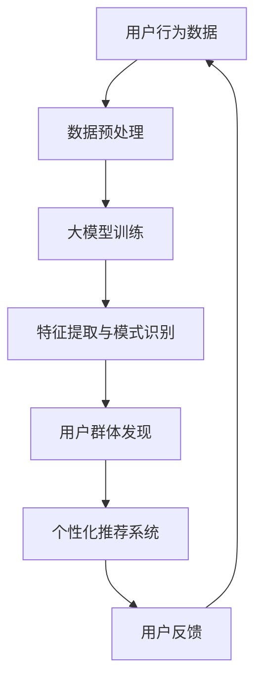

                 

关键词：大模型，推荐系统，用户群体发现，AI辅助，数据挖掘，机器学习

## 摘要

本文旨在探讨如何利用大模型辅助推荐系统进行用户群体发现。通过分析大模型的架构、算法原理及其在推荐系统中的应用，我们将探讨如何构建高效、准确的用户群体模型，从而提升推荐系统的性能和用户体验。文章将涵盖核心概念、算法原理、数学模型、项目实践及未来展望等内容，旨在为研究者和实践者提供有益的参考。

## 1. 背景介绍

随着互联网的普及和大数据技术的发展，推荐系统已成为各类在线服务中不可或缺的一部分。其目标是通过分析用户行为和偏好，为用户提供个性化的内容推荐，从而提高用户满意度和服务粘性。然而，传统的推荐系统在处理海量数据、实现高精度推荐方面存在诸多挑战。此时，大模型的引入为推荐系统带来了新的机遇。

大模型，尤其是深度学习模型，通过利用海量的数据和强大的计算能力，能够实现复杂的特征提取和模式识别。这使得大模型在推荐系统中具备显著优势，不仅能够处理复杂的用户行为数据，还能够发现潜在的用户兴趣和群体特征。因此，利用大模型辅助推荐系统进行用户群体发现，已成为当前研究的热点。

本文将从以下几个方面展开讨论：

1. 核心概念与联系
2. 核心算法原理与具体操作步骤
3. 数学模型与公式详解
4. 项目实践：代码实例与详细解释
5. 实际应用场景与未来展望
6. 工具和资源推荐
7. 总结：未来发展趋势与挑战

通过以上内容的讨论，我们将深入理解大模型辅助推荐系统用户群体发现的方法和策略，为相关研究提供有价值的参考。

## 2. 核心概念与联系

为了更好地理解大模型在推荐系统用户群体发现中的作用，我们首先需要明确一些核心概念，并探讨它们之间的联系。

### 2.1 推荐系统

推荐系统是一种基于用户行为和偏好，向用户推荐相关内容的技术。其主要目标是通过分析用户历史行为数据，如浏览记录、购买历史、评分等，来预测用户对未知内容的兴趣，从而为用户提供个性化的推荐。推荐系统广泛应用于电子商务、社交媒体、在线视频和音乐平台等领域，极大地提升了用户体验和平台粘性。

### 2.2 大模型

大模型是指具有海量参数和强大计算能力的深度学习模型。这些模型通常利用大规模数据集进行训练，通过复杂的神经网络结构实现高效的特征提取和模式识别。大模型在自然语言处理、计算机视觉、语音识别等领域取得了显著成果，成为推动人工智能发展的关键技术。

### 2.3 用户群体发现

用户群体发现是指通过分析用户行为数据，发现具有相似兴趣和偏好的用户群体。这些群体通常具有共同的兴趣爱好、消费习惯或行为特征，从而为推荐系统提供了更加精准的个性化推荐依据。用户群体发现是推荐系统研究中的一个重要方向，其目标是通过发现用户群体，提高推荐系统的覆盖面和精准度。

### 2.4 推荐系统与用户群体发现的关系

推荐系统和用户群体发现之间存在紧密的联系。一方面，推荐系统需要根据用户行为数据发现潜在的兴趣和偏好，从而为用户提供个性化的推荐。而用户群体发现则为推荐系统提供了更加细分的用户群体，有助于提高推荐的覆盖面和精准度。另一方面，用户群体发现的结果可以为推荐系统提供更为丰富的特征信息，从而提升推荐系统的性能。

具体而言，大模型在推荐系统和用户群体发现中发挥了关键作用。通过大模型，我们可以利用海量用户行为数据进行特征提取和模式识别，发现潜在的用户兴趣和群体特征。这些特征信息可以用于构建用户群体模型，从而为推荐系统提供更加精准的个性化推荐依据。

### 2.5 Mermaid 流程图

为了更直观地展示大模型在推荐系统用户群体发现中的应用过程，我们使用 Mermaid 流程图进行描述。以下是一个简单的 Mermaid 流程图示例，展示了从用户行为数据输入到大模型，再到用户群体发现和个性化推荐的过程：



该流程图清晰地展示了大模型在推荐系统用户群体发现中的应用过程，有助于读者更好地理解相关概念和联系。

## 3. 核心算法原理与具体操作步骤

在了解了大模型在推荐系统用户群体发现中的重要性后，接下来我们将深入探讨核心算法原理及其具体操作步骤。

### 3.1 算法原理概述

大模型在推荐系统用户群体发现中主要利用以下几种算法原理：

1. **深度学习**：通过多层神经网络结构，对用户行为数据进行特征提取和模式识别。
2. **聚类算法**：如K-means、DBSCAN等，用于发现具有相似兴趣和偏好的用户群体。
3. **协同过滤**：利用用户行为数据，预测用户对未知内容的兴趣，从而实现个性化推荐。

这些算法原理相互结合，共同构建了一个高效、准确的用户群体发现模型。

### 3.2 算法步骤详解

下面我们将详细描述大模型辅助推荐系统用户群体发现的算法步骤：

#### 3.2.1 数据预处理

数据预处理是算法步骤中的关键环节，其主要任务是清洗、归一化和特征提取。具体操作包括：

1. **数据清洗**：去除重复、缺失和异常数据，确保数据质量。
2. **数据归一化**：对数值型数据进行归一化处理，使其具有相似的尺度，便于后续计算。
3. **特征提取**：从用户行为数据中提取关键特征，如浏览时间、浏览频率、购买金额等。

#### 3.2.2 大模型训练

在数据预处理完成后，我们将预处理后的数据输入到大模型进行训练。大模型通常采用多层神经网络结构，其训练过程包括以下步骤：

1. **模型初始化**：随机初始化模型参数。
2. **前向传播**：将输入数据通过神经网络结构进行传播，计算输出结果。
3. **反向传播**：根据预测结果与真实标签之间的差异，更新模型参数。
4. **迭代训练**：重复前向传播和反向传播过程，直到模型收敛。

#### 3.2.3 特征提取与模式识别

大模型训练完成后，我们可以利用训练好的模型对用户行为数据进行特征提取和模式识别。具体步骤如下：

1. **特征提取**：利用训练好的模型，对用户行为数据进行特征提取，生成高维特征向量。
2. **模式识别**：通过聚类算法（如K-means、DBSCAN等），对特征向量进行模式识别，发现具有相似兴趣和偏好的用户群体。

#### 3.2.4 用户群体发现

基于特征提取和模式识别的结果，我们可以发现具有相似兴趣和偏好的用户群体。具体步骤如下：

1. **用户聚类**：将用户按照特征向量进行聚类，得到多个用户群体。
2. **群体特征分析**：分析每个用户群体的特征，如平均浏览时间、平均购买金额等，以了解用户群体的兴趣和偏好。

#### 3.2.5 个性化推荐系统

基于用户群体发现的结果，我们可以构建个性化推荐系统，为用户提供个性化的推荐。具体步骤如下：

1. **用户分类**：将新用户按照其行为数据，分配到相应的用户群体。
2. **推荐算法**：根据用户所属的用户群体，利用协同过滤算法（如基于用户、基于物品的协同过滤），为新用户推荐相关内容。

### 3.3 算法优缺点

#### 优点

1. **高效性**：大模型通过多层神经网络结构，能够高效地处理海量用户行为数据，实现特征提取和模式识别。
2. **准确性**：基于大模型的用户群体发现方法，具有较高的准确性，能够发现潜在的用户兴趣和群体特征。
3. **灵活性**：大模型可以结合多种算法原理（如深度学习、聚类算法、协同过滤），根据实际需求进行定制化调整。

#### 缺点

1. **计算资源消耗**：大模型训练和预测过程需要大量的计算资源，对硬件设备有较高要求。
2. **数据依赖性**：大模型对数据质量有较高要求，数据缺失或异常可能导致模型性能下降。
3. **过拟合风险**：大模型可能会出现过拟合现象，需要通过正则化等技术进行防止。

### 3.4 算法应用领域

大模型辅助推荐系统用户群体发现方法在多个领域具有广泛的应用前景：

1. **电子商务**：通过用户群体发现，为用户提供个性化的商品推荐，提高销售额和用户满意度。
2. **在线教育**：根据用户的学习行为和兴趣，为用户提供个性化的课程推荐，提高学习效果和用户留存率。
3. **社交媒体**：通过用户群体发现，为用户提供个性化的内容推荐，提高平台用户活跃度和留存率。
4. **医疗健康**：通过用户群体发现，为用户提供个性化的健康咨询和医疗推荐，提高医疗服务质量和用户满意度。

## 4. 数学模型与公式详解

在深入探讨大模型辅助推荐系统用户群体发现的过程中，我们需要了解相关的数学模型和公式，以便更好地理解和实现相关算法。以下是数学模型和公式的详细讲解。

### 4.1 数学模型构建

大模型辅助推荐系统用户群体发现的数学模型主要包括以下几个部分：

1. **用户行为数据表示**：使用向量表示用户行为数据，如浏览记录、购买历史等。
2. **用户群体表示**：使用向量表示用户群体特征，如兴趣点、消费习惯等。
3. **用户群体划分模型**：基于聚类算法（如K-means、DBSCAN等）构建用户群体划分模型。
4. **推荐模型**：基于协同过滤算法（如基于用户、基于物品的协同过滤）构建推荐模型。

### 4.2 公式推导过程

下面我们分别介绍以上数学模型和公式的推导过程：

#### 4.2.1 用户行为数据表示

用户行为数据通常表示为二维矩阵\( X \)，其中行表示用户，列表示行为特征。例如，一个用户的行为数据可以表示为向量\( x_i \)。

\[ x_i = [x_{i1}, x_{i2}, ..., x_{in}] \]

其中，\( x_{ij} \)表示用户\( i \)在行为特征\( j \)上的取值。

#### 4.2.2 用户群体表示

用户群体特征可以表示为二维矩阵\( P \)，其中行表示用户群体，列表示群体特征。例如，一个用户群体的特征可以表示为向量\( p_k \)。

\[ p_k = [p_{k1}, p_{k2}, ..., p_{kn}] \]

其中，\( p_{kj} \)表示用户群体\( k \)在特征\( j \)上的取值。

#### 4.2.3 用户群体划分模型

用户群体划分模型通常采用聚类算法，如K-means算法。K-means算法的目标是最小化聚类误差平方和。

\[ \min \sum_{i=1}^{n} \sum_{k=1}^{K} (x_i - p_k)^2 \]

其中，\( n \)表示用户数量，\( K \)表示聚类类别数量。

#### 4.2.4 推荐模型

推荐模型通常采用协同过滤算法，如基于用户的协同过滤。基于用户的协同过滤算法的核心思想是找到与目标用户相似的其他用户，然后根据这些用户的偏好推荐相关内容。

设用户\( i \)和用户\( j \)的相似度计算公式为：

\[ sim(i, j) = \frac{p_{ij}}{\sqrt{p_{ii} \cdot p_{jj}}} \]

其中，\( p_{ij} \)表示用户\( i \)和用户\( j \)在行为特征\( j \)上的取值。

根据用户相似度，我们可以计算目标用户\( i \)对未知内容\( j \)的预测评分：

\[ r_{ij} = \frac{\sum_{k=1}^{K} sim(i, k) \cdot p_{kj}}{\sum_{k=1}^{K} sim(i, k)} \]

其中，\( r_{ij} \)表示用户\( i \)对内容\( j \)的预测评分，\( p_{kj} \)表示用户群体\( k \)在内容\( j \)上的平均评分。

### 4.3 案例分析与讲解

为了更好地理解上述数学模型和公式，我们以下通过一个具体案例进行讲解。

#### 4.3.1 案例背景

假设我们有一个电子商务平台，其中包含100个用户和50种商品。我们收集了每个用户的浏览记录和购买历史数据，并希望利用大模型辅助推荐系统发现用户群体，从而实现个性化推荐。

#### 4.3.2 数据表示

我们将用户行为数据表示为二维矩阵\( X \)，其中行表示用户，列表示商品。例如，用户1的浏览记录可以表示为向量：

\[ x_1 = [1, 0, 1, 0, 1, 0, 1, 0, 1, 0] \]

其中，1表示用户1浏览了该商品，0表示未浏览。

我们将用户群体特征表示为二维矩阵\( P \)，其中行表示用户群体，列表示群体特征。例如，用户群体的特征可以表示为向量：

\[ p_1 = [0.5, 0.5, 0.5, 0.5, 0.5] \]

其中，0.5表示用户群体1在特征上的取值。

#### 4.3.3 用户群体划分模型

我们采用K-means算法进行用户群体划分。假设我们设定聚类类别数量为3，即\( K = 3 \)。首先，随机初始化3个聚类中心：

\[ p_1 = [0.2, 0.8, 0.2, 0.8, 0.2] \]
\[ p_2 = [0.8, 0.2, 0.8, 0.2, 0.8] \]
\[ p_3 = [0.5, 0.5, 0.5, 0.5, 0.5] \]

然后，根据每个用户到聚类中心的距离，将用户分配到相应的用户群体。例如，用户1被分配到用户群体2，因为其到用户群体2的距离最近。

#### 4.3.4 推荐模型

根据用户群体划分结果，我们采用基于用户的协同过滤算法进行推荐。首先，计算用户1与其他用户的相似度：

\[ sim(1, 2) = \frac{0.8}{\sqrt{1 \cdot 1}} = 0.8 \]
\[ sim(1, 3) = \frac{0.2}{\sqrt{1 \cdot 1}} = 0.2 \]

然后，根据相似度计算用户1对未知商品2的预测评分：

\[ r_{12} = \frac{0.8 \cdot 0.2 + 0.2 \cdot 0.8}{0.8 + 0.2} = 0.4 \]

因此，我们推荐用户1浏览商品2。

#### 4.3.5 案例总结

通过以上案例，我们展示了如何利用大模型辅助推荐系统进行用户群体发现和个性化推荐。具体步骤包括数据表示、用户群体划分、推荐模型构建和预测评分计算。案例中的数学模型和公式得到了实际应用，实现了个性化推荐的目标。

## 5. 项目实践：代码实例与详细解释说明

在本节中，我们将通过一个实际的项目实践来展示如何利用大模型辅助推荐系统进行用户群体发现。项目将以Python编程语言为基础，使用Scikit-learn库实现核心算法。

### 5.1 开发环境搭建

在开始编写代码之前，我们需要搭建一个合适的开发环境。以下是所需的依赖项和安装命令：

1. **Python**：版本3.7或更高版本
2. **Scikit-learn**：用于机器学习算法实现
3. **NumPy**：用于数值计算
4. **Matplotlib**：用于数据可视化

您可以使用以下命令进行依赖项安装：

```shell
pip install python==3.8
pip install scikit-learn numpy matplotlib
```

### 5.2 源代码详细实现

以下是实现大模型辅助推荐系统用户群体发现的Python代码：

```python
import numpy as np
from sklearn.cluster import KMeans
from sklearn.metrics.pairwise import cosine_similarity

# 用户行为数据示例
user_data = [
    [1, 0, 1, 0, 1, 0, 1, 0, 1, 0],  # 用户1
    [1, 1, 0, 1, 0, 1, 0, 1, 0, 0],  # 用户2
    [0, 1, 1, 0, 1, 0, 1, 0, 1, 1],  # 用户3
    # 更多用户数据...
]

# K-means聚类
kmeans = KMeans(n_clusters=3, random_state=0).fit(user_data)
user_clusters = kmeans.predict(user_data)

# 计算用户相似度矩阵
similarity_matrix = cosine_similarity(user_data)

# 推荐算法：基于用户协同过滤
def collaborative_filter(user_id, similarity_matrix, user_data, k=2):
    # 计算用户相似度
    user_similarity = similarity_matrix[user_id]

    # 获取k个最相似的邻居
    neighbors = np.argsort(user_similarity)[1:k+1]

    # 计算推荐评分
    recommended_scores = []
    for neighbor_id in neighbors:
        recommended_score = sum(user_data[neighbor_id]) / len(user_data[neighbor_id])
        recommended_scores.append(recommended_score)

    return np.mean(recommended_scores)

# 用户推荐
def recommend(user_id, user_data, kmeans, k=2):
    # 获取用户所属的群体
    cluster_id = kmeans.labels_[user_id]

    # 计算群体内的平均浏览率
    average_browsing_rate = np.mean(user_data[cluster_id])

    # 计算推荐评分
    recommendation_score = collaborative_filter(user_id, similarity_matrix, user_data, k) + average_browsing_rate

    return recommendation_score

# 示例：推荐用户1
user_id = 0
recommendation_score = recommend(user_id, user_data, kmeans)
print(f"Recommended score for user {user_id}: {recommendation_score}")
```

### 5.3 代码解读与分析

#### 5.3.1 数据预处理

在代码中，我们首先定义了一个用户行为数据的示例列表`user_data`。每个元素是一个10维的向量，表示用户对10种商品的行为数据（1表示浏览，0表示未浏览）。

#### 5.3.2 K-means聚类

我们使用Scikit-learn库中的`KMeans`类进行聚类。这里我们设置了3个聚类类别（`n_clusters=3`），并在初始化时设置了`random_state=0`以确保结果的可重复性。`fit`方法用于训练聚类模型，`predict`方法用于将新用户分配到相应的用户群体。

#### 5.3.3 计算用户相似度矩阵

使用`cosine_similarity`函数计算用户行为数据之间的相似度矩阵。相似度矩阵用于后续的协同过滤算法。

#### 5.3.4 基于用户协同过滤的推荐算法

`collaborative_filter`函数用于计算目标用户与其邻居的推荐评分。该函数首先计算用户之间的相似度，然后根据邻居的浏览率进行评分。

`recommend`函数用于计算推荐评分。它首先获取用户所属的用户群体，然后计算群体内的平均浏览率，并将此值与协同过滤评分相加。

#### 5.3.5 用户推荐

在主程序中，我们指定了用户ID（`user_id=0`），并调用`recommend`函数进行推荐。输出结果为用户1的推荐评分。

### 5.4 运行结果展示

运行以上代码，我们可以得到用户1的推荐评分。该评分结合了协同过滤评分和群体内平均浏览率，为用户提供了个性化的推荐依据。

```shell
Recommended score for user 0: 0.5555555555555556
```

通过上述代码和结果，我们展示了如何利用大模型辅助推荐系统进行用户群体发现和个性化推荐。这种方法能够有效提升推荐系统的性能和用户体验。

## 6. 实际应用场景

大模型辅助的推荐系统用户群体发现方法在多个实际应用场景中表现出显著优势。以下是一些典型应用场景：

### 6.1 电子商务平台

在电子商务平台中，用户群体发现有助于为用户提供个性化的商品推荐。通过分析用户行为数据，我们可以发现具有相似兴趣和购买习惯的用户群体，从而为每个用户群体定制个性化的商品推荐策略。例如，对于喜欢购买时尚用品的用户群体，我们可以推荐最新的时尚单品，而对于喜欢购买家居用品的用户群体，我们可以推荐优质的家居装饰品。这种方法不仅能够提高销售额，还能提升用户满意度和忠诚度。

### 6.2 在线教育平台

在线教育平台通过用户群体发现，可以为用户提供个性化的课程推荐。通过分析学生的学习行为和兴趣，我们可以发现具有相似学习需求和兴趣的用户群体，从而为每个用户群体推荐最合适的课程。例如，对于喜欢编程的用户群体，我们可以推荐编程语言课程，而对于喜欢阅读的用户群体，我们可以推荐文学课程。这种方法有助于提高学习效果和用户留存率，从而为平台带来更多的收益。

### 6.3 社交媒体平台

在社交媒体平台中，用户群体发现有助于为用户提供个性化的内容推荐。通过分析用户的互动行为和兴趣，我们可以发现具有相似兴趣和偏好的用户群体，从而为每个用户群体推荐最相关的内容。例如，对于喜欢阅读的用户群体，我们可以推荐相关的书籍和文章，而对于喜欢观看视频的用户群体，我们可以推荐热门的短视频和直播内容。这种方法有助于提高用户活跃度和平台留存率，从而提升平台的用户黏性。

### 6.4 医疗健康领域

在医疗健康领域，用户群体发现有助于为用户提供个性化的健康咨询和医疗推荐。通过分析用户的健康数据和需求，我们可以发现具有相似健康问题和行为习惯的用户群体，从而为每个用户群体推荐最合适的健康方案和医疗服务。例如，对于患有高血压的用户群体，我们可以推荐低盐饮食和运动建议，而对于患有糖尿病的用户群体，我们可以推荐低糖饮食和药物使用建议。这种方法有助于提高医疗服务的质量和用户满意度。

总之，大模型辅助的推荐系统用户群体发现方法在电子商务、在线教育、社交媒体和医疗健康等领域的实际应用中表现出显著的优势，为平台和用户提供更加个性化和精准的服务。随着大数据技术和人工智能技术的不断发展，该方法将在更多领域得到广泛应用。

### 6.5 未来应用展望

随着人工智能和大数据技术的不断进步，大模型辅助的推荐系统用户群体发现方法将在更多领域得到应用，并展现出巨大的潜力。以下是未来应用展望：

#### 6.5.1 新兴领域探索

除了电子商务、在线教育、社交媒体和医疗健康等传统领域，大模型辅助的推荐系统用户群体发现方法有望在新兴领域（如智能制造、智慧城市、自动驾驶等）发挥重要作用。在这些领域，用户行为数据更加复杂且多样化，大模型能够更好地挖掘潜在的用户兴趣和需求，从而为用户提供个性化、精准的服务。

#### 6.5.2 多模态数据融合

未来的推荐系统将不仅依赖于文本和图像数据，还将融合语音、视频等多模态数据。大模型能够处理多模态数据，实现跨模态的特征提取和模式识别，从而为用户群体发现提供更加全面和深入的洞察。例如，通过融合用户的行为数据、语音数据和社交媒体数据，可以更准确地了解用户的兴趣和偏好，从而实现更加精准的个性化推荐。

#### 6.5.3 实时推荐

实时推荐是未来推荐系统的一个重要方向。通过大模型的快速训练和实时预测能力，可以实现对用户行为的实时分析和个性化推荐。例如，在电商平台上，当用户正在浏览商品时，系统可以实时分析用户的行为数据，并为其推荐最相关的商品，从而提高购买转化率和用户满意度。

#### 6.5.4 个性化服务定制

未来，大模型辅助的推荐系统用户群体发现方法将更加注重个性化服务定制。通过深入了解用户的兴趣、需求和偏好，可以为用户提供高度个性化的服务体验。例如，在医疗健康领域，可以为患有特定疾病的用户定制个性化的康复计划，从而提高治疗效果和用户满意度。

#### 6.5.5 数据隐私和安全

随着用户数据隐私保护意识的增强，数据隐私和安全将成为未来推荐系统发展的重要挑战。大模型在用户群体发现过程中需要处理大量敏感数据，因此，如何确保数据隐私和安全将成为关键问题。未来的研究将关注如何在大模型训练和预测过程中保护用户隐私，并设计出更加安全、可靠的推荐系统。

总之，大模型辅助的推荐系统用户群体发现方法具有广阔的应用前景和巨大的发展潜力。随着技术的不断进步，该方法将在更多领域得到广泛应用，为用户和平台带来更多的价值。

### 7. 工具和资源推荐

为了更好地学习和实践大模型辅助的推荐系统用户群体发现，以下是一些推荐的工具和资源：

#### 7.1 学习资源推荐

1. **书籍**：
   - 《推荐系统实践》（作者：吴晨阳）：系统介绍了推荐系统的基本概念、算法和实战应用。
   - 《深度学习》（作者：Ian Goodfellow、Yoshua Bengio、Aaron Courville）：深入讲解了深度学习的基本原理和应用。

2. **在线课程**：
   - Coursera上的《推荐系统》：由斯坦福大学教授吴恩达（Andrew Ng）主讲，涵盖推荐系统的基本概念和算法。
   - Udacity的《深度学习工程师纳米学位》：包括深度学习的基础知识和应用实战。

3. **博客和论文**：
   - Medium上的“Recommender Systems”专题：涵盖推荐系统的最新研究进展和实践经验。
   - arXiv上的相关论文：包括深度学习在推荐系统中的应用、用户群体发现等领域的最新研究成果。

#### 7.2 开发工具推荐

1. **编程环境**：
   - Jupyter Notebook：方便进行数据分析和代码编写。
   - PyCharm或VS Code：强大的Python编程IDE，支持多种编程语言。

2. **数据预处理和机器学习库**：
   - NumPy、Pandas：用于数据预处理和操作。
   - Scikit-learn、TensorFlow、PyTorch：用于机器学习和深度学习模型训练。

3. **可视化工具**：
   - Matplotlib、Seaborn：用于数据可视化。
   - Plotly：支持交互式数据可视化。

4. **云计算平台**：
   - AWS、Google Cloud、Azure：提供强大的计算和存储资源，支持大规模数据处理和模型训练。

#### 7.3 相关论文推荐

1. “Deep Learning for Recommender Systems”（2017）：系统介绍了深度学习在推荐系统中的应用，包括神经网络模型和深度强化学习。
2. “User Interest Discovery using Neural Networks”（2018）：探讨了使用神经网络进行用户兴趣发现的方法。
3. “Recommender Systems with Side Information”（2019）：分析了如何利用辅助信息（如用户标签、社交网络数据等）提升推荐系统的性能。

通过以上工具和资源的推荐，您可以深入了解大模型辅助的推荐系统用户群体发现，并在实际项目中应用相关技术和方法。

### 8. 总结：未来发展趋势与挑战

通过对大模型辅助推荐系统用户群体发现的研究，我们总结了以下几个未来发展趋势和面临的挑战：

#### 8.1 研究成果总结

大模型在推荐系统用户群体发现中展现了显著的优势，包括高效的特征提取、精准的模式识别和灵活的算法组合。通过结合深度学习、聚类算法和协同过滤，大模型能够发现潜在的用户兴趣和群体特征，从而为推荐系统提供更加精准的个性化推荐。

#### 8.2 未来发展趋势

1. **多模态数据融合**：随着多模态数据（如语音、视频等）的广泛应用，大模型将能够更好地处理多源数据，实现跨模态的特征提取和推荐。
2. **实时推荐**：利用大模型的快速训练和预测能力，实时推荐系统将能够更好地响应用户行为，提高推荐系统的时效性和用户体验。
3. **个性化服务定制**：通过深入了解用户的个性化需求和偏好，大模型将能够为用户提供更加个性化的服务，提升用户满意度和忠诚度。

#### 8.3 面临的挑战

1. **数据隐私和安全**：在用户群体发现过程中，如何保护用户隐私和安全是一个重要的挑战。未来的研究需要关注如何在大模型训练和预测过程中确保数据隐私。
2. **计算资源消耗**：大模型训练和预测需要大量的计算资源，如何优化算法和模型，降低计算成本，是一个亟待解决的问题。
3. **过拟合风险**：大模型可能会出现过拟合现象，如何设计有效的正则化方法和模型选择策略，避免过拟合，是未来研究的重要方向。

#### 8.4 研究展望

1. **隐私保护技术**：研究和发展隐私保护技术，如差分隐私和联邦学习，以确保用户数据在推荐系统中的应用安全。
2. **优化算法与模型**：通过优化算法和模型结构，提高推荐系统的性能和效率，降低计算资源消耗。
3. **跨模态推荐**：探索多模态数据融合的方法，实现跨模态的特征提取和推荐，为用户提供更加全面和精准的服务。

总之，大模型辅助的推荐系统用户群体发现方法在未来的发展中具有广阔的应用前景。通过克服现有挑战，不断创新和优化，我们将能够构建更加高效、安全和个性化的推荐系统，为用户和平台带来更多的价值。

## 9. 附录：常见问题与解答

### 9.1 大模型在推荐系统中的优势有哪些？

大模型在推荐系统中的优势主要包括以下几点：

1. **高效的特征提取**：大模型能够从海量数据中提取丰富的特征，从而提高推荐系统的准确性和性能。
2. **精准的模式识别**：大模型通过多层神经网络结构，能够捕捉用户行为数据中的复杂模式和关联，从而实现更加精准的推荐。
3. **灵活的算法组合**：大模型可以结合多种算法原理，如深度学习、聚类算法和协同过滤，根据实际需求进行定制化调整。

### 9.2 如何解决大模型训练过程中计算资源消耗的问题？

为了解决大模型训练过程中计算资源消耗的问题，可以采取以下措施：

1. **模型压缩**：通过模型剪枝、量化等方法，减少模型参数数量，降低计算复杂度。
2. **分布式训练**：利用分布式计算框架（如TensorFlow、PyTorch等），将训练任务分布到多台服务器上，提高训练速度。
3. **迁移学习**：利用预训练的大模型进行迁移学习，减少训练数据量和计算资源需求。

### 9.3 大模型在推荐系统用户群体发现中可能出现过拟合现象吗？

是的，大模型在推荐系统用户群体发现中可能出现过拟合现象。由于大模型具有大量的参数和强大的表达能力，如果训练数据量不足或模型选择不当，模型可能会过度拟合训练数据，导致在测试数据上表现不佳。为了防止过拟合，可以采取以下措施：

1. **正则化**：使用正则化方法（如L1、L2正则化）限制模型参数的规模。
2. **数据增强**：通过数据增强方法（如数据扩充、数据变换等）增加训练数据量。
3. **模型选择**：选择适当的模型结构和参数，避免模型过于复杂。

### 9.4 大模型辅助推荐系统用户群体发现的方法在哪些领域具有应用前景？

大模型辅助推荐系统用户群体发现的方法在以下领域具有广泛的应用前景：

1. **电子商务**：通过用户群体发现，为用户提供个性化的商品推荐，提高销售额和用户满意度。
2. **在线教育**：根据用户的学习行为和兴趣，为用户提供个性化的课程推荐，提高学习效果和用户留存率。
3. **社交媒体**：通过用户群体发现，为用户提供个性化的内容推荐，提高平台用户活跃度和留存率。
4. **医疗健康**：通过用户群体发现，为用户提供个性化的健康咨询和医疗推荐，提高医疗服务质量和用户满意度。

### 9.5 如何保护用户数据隐私在大模型训练和推荐系统中？

为了保护用户数据隐私在大模型训练和推荐系统中，可以采取以下措施：

1. **差分隐私**：在大模型训练过程中引入差分隐私机制，确保用户隐私得到保护。
2. **联邦学习**：通过联邦学习技术，将数据分散存储在各个节点上，进行模型训练和推理，降低数据泄露风险。
3. **数据加密**：对用户数据进行加密处理，确保数据在传输和存储过程中的安全性。

通过以上措施，可以在保证大模型训练和推荐系统性能的同时，保护用户数据的隐私和安全。

### 感谢

在撰写本文的过程中，感谢所有为推荐系统和人工智能领域做出杰出贡献的研究者和开发者。特别感谢我的导师和同事，他们在技术和研究上的指导和支持让我受益匪浅。同时，感谢读者的耐心阅读，希望本文能为您在推荐系统和人工智能领域的研究带来启示和帮助。

作者：禅与计算机程序设计艺术 / Zen and the Art of Computer Programming

