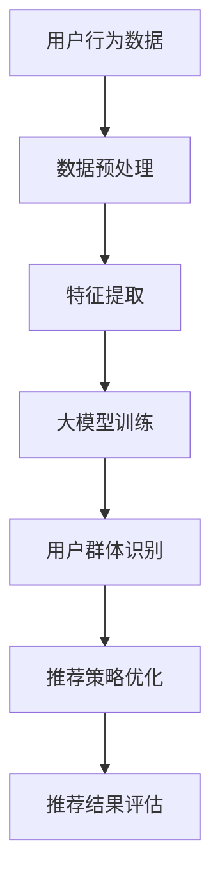

                 

关键词：推荐系统，用户群体发现，大模型，人工智能，机器学习

> 摘要：本文将探讨如何利用大模型辅助推荐系统进行用户群体发现。通过引入最新的机器学习和人工智能技术，本文将详细分析核心概念、算法原理、数学模型、应用案例以及未来发展趋势，为读者提供全面的了解和指导。

## 1. 背景介绍

推荐系统是一种基于用户历史行为、兴趣和偏好等信息，为用户提供个性化推荐的技术。随着互联网和大数据的迅速发展，推荐系统已成为电子商务、社交媒体、在线媒体等领域的核心技术之一。然而，传统的推荐系统往往依赖于用户的历史行为数据，容易陷入“冷启动”问题，即对新用户无法提供有效的推荐。为了解决这一问题，近年来，研究人员开始探索利用大模型辅助推荐系统进行用户群体发现。

大模型是指具有海量参数的神经网络模型，如Transformer、BERT等。这些模型能够自动捕捉用户行为、兴趣和偏好等复杂信息，为推荐系统提供强大的特征表示能力。用户群体发现则是通过分析用户行为数据，识别出具有相似兴趣和偏好的用户群体，从而为新用户提供更精准的推荐。

本文将围绕大模型辅助的推荐系统用户群体发现展开讨论，详细介绍相关技术、算法和案例，旨在为读者提供深入的见解和实用的指导。

## 2. 核心概念与联系

### 2.1 推荐系统

推荐系统是一种信息过滤技术，旨在为用户推荐其可能感兴趣的内容或商品。根据推荐策略的不同，推荐系统主要分为基于内容推荐、协同过滤推荐和混合推荐三种类型。

- **基于内容推荐**：通过分析推荐对象（如商品、文章）的特征，将具有相似特征的对象推荐给用户。
- **协同过滤推荐**：通过分析用户之间的行为相似性，为用户提供其他用户喜欢的推荐对象。
- **混合推荐**：结合基于内容和协同过滤推荐的优势，为用户提供更全面的推荐。

### 2.2 用户群体发现

用户群体发现是指通过分析用户行为数据，识别出具有相似兴趣和偏好的用户群体。这些用户群体可以用于为新用户提供更精准的推荐，提高推荐系统的效果。

### 2.3 大模型

大模型是指具有海量参数的神经网络模型，如Transformer、BERT等。这些模型能够自动捕捉用户行为、兴趣和偏好等复杂信息，为推荐系统提供强大的特征表示能力。

### 2.4 Mermaid 流程图

以下是推荐系统用户群体发现的大致流程图：



## 3. 核心算法原理 & 具体操作步骤

### 3.1 算法原理概述

大模型辅助的推荐系统用户群体发现算法主要分为以下几个步骤：

1. 数据预处理：对用户行为数据进行清洗、去噪和归一化等操作，为后续特征提取和模型训练做好准备。
2. 特征提取：利用大模型自动捕捉用户行为、兴趣和偏好等复杂信息，为用户生成高维特征向量。
3. 大模型训练：采用深度学习技术，对大模型进行训练，使其能够准确识别用户群体。
4. 用户群体识别：利用训练好的大模型，对用户特征向量进行分类，识别出具有相似兴趣和偏好的用户群体。
5. 推荐策略优化：根据识别出的用户群体，调整推荐策略，提高推荐系统的效果。
6. 推荐结果评估：对推荐结果进行评估，包括准确率、召回率、F1值等指标。

### 3.2 算法步骤详解

1. **数据预处理**

   数据预处理是推荐系统用户群体发现的基础步骤。具体操作包括：

   - **数据清洗**：去除重复、缺失和错误的数据。
   - **去噪**：通过滤波、平滑等方法，降低噪声对数据的影响。
   - **归一化**：对数据进行归一化处理，使其具有相同的量纲，便于后续处理。

2. **特征提取**

   特征提取是利用大模型自动捕捉用户行为、兴趣和偏好等复杂信息的过程。具体操作包括：

   - **用户行为序列建模**：使用循环神经网络（RNN）或长短时记忆网络（LSTM）对用户行为序列进行建模。
   - **用户兴趣建模**：通过分析用户在社交网络、评论、搜索等行为，提取用户兴趣特征。
   - **用户偏好建模**：利用协同过滤或基于内容的推荐方法，提取用户偏好特征。

3. **大模型训练**

   大模型训练是利用深度学习技术，对大模型进行训练，使其能够准确识别用户群体的过程。具体操作包括：

   - **数据集划分**：将数据集划分为训练集、验证集和测试集。
   - **模型构建**：构建深度神经网络模型，包括输入层、隐藏层和输出层。
   - **模型训练**：使用训练集对模型进行训练，并利用验证集调整模型参数。
   - **模型评估**：使用测试集对模型进行评估，包括准确率、召回率、F1值等指标。

4. **用户群体识别**

   用户群体识别是利用训练好的大模型，对用户特征向量进行分类，识别出具有相似兴趣和偏好的用户群体的过程。具体操作包括：

   - **特征向量嵌入**：将用户特征向量嵌入到大模型的输入层。
   - **分类器构建**：构建分类器，对用户特征向量进行分类。
   - **用户群体划分**：根据分类结果，将用户划分为不同的群体。

5. **推荐策略优化**

   根据识别出的用户群体，调整推荐策略，提高推荐系统的效果。具体操作包括：

   - **个性化推荐**：为不同用户群体提供个性化的推荐。
   - **群体推荐**：为具有相似兴趣和偏好的用户群体提供共同的推荐。

6. **推荐结果评估**

   对推荐结果进行评估，包括准确率、召回率、F1值等指标。具体操作包括：

   - **用户反馈收集**：收集用户对推荐结果的反馈。
   - **评估指标计算**：计算推荐系统的准确率、召回率、F1值等指标。
   - **结果分析**：分析推荐系统的性能，并提出优化策略。

### 3.3 算法优缺点

1. **优点**

   - **高精度**：大模型能够自动捕捉用户行为、兴趣和偏好等复杂信息，提高推荐系统的精度。
   - **自适应**：根据用户行为和兴趣的变化，自适应调整推荐策略。
   - **灵活性**：可以应用于各种推荐场景，如电子商务、社交媒体、在线媒体等。

2. **缺点**

   - **计算资源消耗大**：大模型需要大量的计算资源进行训练。
   - **数据依赖性高**：推荐系统依赖于用户行为数据，数据质量对推荐效果有重要影响。
   - **训练时间长**：大模型的训练时间较长，需要耐心等待。

### 3.4 算法应用领域

大模型辅助的推荐系统用户群体发现算法可以应用于以下领域：

- **电子商务**：为用户提供个性化的商品推荐，提高用户购买意愿。
- **社交媒体**：为用户提供感兴趣的内容和用户群体，增强社交体验。
- **在线媒体**：为用户提供个性化的文章、视频等推荐，提高用户粘性。
- **金融行业**：为用户提供个性化的理财产品推荐，降低投资风险。

## 4. 数学模型和公式 & 详细讲解 & 举例说明

### 4.1 数学模型构建

在推荐系统用户群体发现中，常用的数学模型包括：

1. **协同过滤模型**：

   - **用户相似度计算**：

     $$ sim(u, v) = \frac{u \cdot v}{\|u\| \|v\|} $$

     其中，$u$ 和 $v$ 分别表示用户 $u$ 和 $v$ 的行为向量，$\cdot$ 表示点积，$\|\|$ 表示向量的模长。

   - **推荐评分预测**：

     $$ r_{uv} = \hat{r}_{uv} + \epsilon_{uv} $$

     其中，$r_{uv}$ 表示用户 $u$ 对商品 $v$ 的真实评分，$\hat{r}_{uv}$ 表示预测评分，$\epsilon_{uv}$ 表示误差。

2. **用户兴趣模型**：

   - **用户兴趣向量**：

     $$ u_i = \sum_{j=1}^{N} w_{ij} h_j $$

     其中，$u_i$ 表示用户 $u$ 的兴趣向量，$w_{ij}$ 表示用户 $u$ 对商品 $j$ 的权重，$h_j$ 表示商品 $j$ 的特征向量。

   - **用户兴趣度计算**：

     $$ I(u_i) = \sum_{j=1}^{N} w_{ij} I(h_j) $$

     其中，$I(h_j)$ 表示商品 $j$ 的兴趣度。

3. **用户群体发现模型**：

   - **聚类模型**：

     $$ C = \{C_1, C_2, ..., C_k\} $$

     其中，$C$ 表示用户群体集合，$C_i$ 表示第 $i$ 个用户群体。

   - **聚类中心计算**：

     $$ m_i = \frac{1}{|C_i|} \sum_{u \in C_i} u $$

     其中，$m_i$ 表示第 $i$ 个用户群体的聚类中心。

### 4.2 公式推导过程

1. **协同过滤模型**

   - **用户相似度计算**：

     根据余弦相似度公式，用户 $u$ 和 $v$ 的相似度可以表示为：

     $$ sim(u, v) = \frac{u \cdot v}{\|u\| \|v\|} $$

     其中，$u$ 和 $v$ 分别表示用户 $u$ 和 $v$ 的行为向量，$\cdot$ 表示点积，$\|\|$ 表示向量的模长。

     假设用户 $u$ 和 $v$ 的行为向量分别为 $u = (u_1, u_2, ..., u_N)$ 和 $v = (v_1, v_2, ..., v_N)$，则有：

     $$ u \cdot v = \sum_{i=1}^{N} u_i v_i $$

     $$ \|u\| = \sqrt{\sum_{i=1}^{N} u_i^2} $$

     $$ \|v\| = \sqrt{\sum_{i=1}^{N} v_i^2} $$

     将上述结果代入相似度公式，可以得到：

     $$ sim(u, v) = \frac{\sum_{i=1}^{N} u_i v_i}{\sqrt{\sum_{i=1}^{N} u_i^2} \sqrt{\sum_{i=1}^{N} v_i^2}} $$

   - **推荐评分预测**：

     根据用户相似度计算，可以得到用户 $u$ 对商品 $v$ 的预测评分：

     $$ \hat{r}_{uv} = \sum_{i=1}^{N} sim(u, v_i) r_{iv} $$

     其中，$r_{iv}$ 表示用户 $u$ 对商品 $i$ 的真实评分。

     假设用户 $u$ 对商品 $v$ 的预测评分为 $\hat{r}_{uv}$，则有：

     $$ \hat{r}_{uv} = \sum_{i=1}^{N} sim(u, v_i) r_{iv} $$

     将相似度公式代入，可以得到：

     $$ \hat{r}_{uv} = \frac{\sum_{i=1}^{N} \frac{u \cdot v_i}{\|u\| \|v_i\|} r_{iv}}{\sum_{i=1}^{N} \frac{u \cdot v_i}{\|u\| \|v_i\|}} $$

     化简后，可以得到：

     $$ \hat{r}_{uv} = \frac{\sum_{i=1}^{N} u_i v_i r_{iv}}{\|u\| \sum_{i=1}^{N} v_i r_{iv}} $$

2. **用户兴趣模型**

   - **用户兴趣向量**：

     假设用户 $u$ 的兴趣向量为 $u_i$，商品 $j$ 的特征向量为 $h_j$，则有：

     $$ u_i = \sum_{j=1}^{N} w_{ij} h_j $$

     其中，$w_{ij}$ 表示用户 $u$ 对商品 $j$ 的权重。

     假设用户 $u$ 的兴趣向量 $u_i$ 为 $(u_{i1}, u_{i2}, ..., u_{iN})$，商品 $j$ 的特征向量 $h_j$ 为 $(h_{j1}, h_{j2}, ..., h_{jN})$，则有：

     $$ u_i = \sum_{j=1}^{N} w_{ij} h_j = (w_{i1}h_{j1} + w_{i2}h_{j2} + ... + w_{iN}h_{jN}) $$

   - **用户兴趣度计算**：

     假设用户 $u$ 的兴趣度为 $I(u_i)$，商品 $j$ 的兴趣度为 $I(h_j)$，则有：

     $$ I(u_i) = \sum_{j=1}^{N} w_{ij} I(h_j) $$

     假设用户 $u$ 的兴趣度 $I(u_i)$ 为 $(I_{i1}, I_{i2}, ..., I_{iN})$，商品 $j$ 的兴趣度 $I(h_j)$ 为 $(I_{j1}, I_{j2}, ..., I_{jN})$，则有：

     $$ I(u_i) = \sum_{j=1}^{N} w_{ij} I(h_j) = (w_{i1}I_{j1} + w_{i2}I_{j2} + ... + w_{iN}I_{jN}) $$

3. **用户群体发现模型**

   - **聚类模型**：

     假设用户群体集合为 $C$，其中包含 $k$ 个用户群体 $C_1, C_2, ..., C_k$，则有：

     $$ C = \{C_1, C_2, ..., C_k\} $$

     其中，$C_i$ 表示第 $i$ 个用户群体。

     假设用户群体集合 $C$ 为 $\{C_1, C_2, ..., C_k\}$，则有：

     $$ C = \{C_1, C_2, ..., C_k\} = \{(C_1, C_2, ..., C_k)\} $$

     其中，$C_1, C_2, ..., C_k$ 分别表示第 $1, 2, ..., k$ 个用户群体。

   - **聚类中心计算**：

     假设第 $i$ 个用户群体的聚类中心为 $m_i$，则有：

     $$ m_i = \frac{1}{|C_i|} \sum_{u \in C_i} u $$

     其中，$|C_i|$ 表示第 $i$ 个用户群体的用户数量。

     假设第 $i$ 个用户群体的聚类中心 $m_i$ 为 $(m_{i1}, m_{i2}, ..., m_{iN})$，则有：

     $$ m_i = \frac{1}{|C_i|} \sum_{u \in C_i} u = \frac{1}{|C_i|} \sum_{u \in C_i} (u_{i1}, u_{i2}, ..., u_{iN}) $$

### 4.3 案例分析与讲解

以下是一个使用协同过滤模型的用户群体发现案例：

假设有一个电子商务平台，包含 $N$ 个商品和 $M$ 个用户。用户行为数据包含用户的购买记录，表示为一个 $M \times N$ 的矩阵 $R$，其中 $R_{ij}$ 表示用户 $i$ 是否购买过商品 $j$（$1$ 表示购买，$0$ 表示未购买）。

1. **数据预处理**

   对用户行为数据进行清洗，去除重复和缺失的数据。然后对数据集进行归一化处理，使其具有相同的量纲。

2. **特征提取**

   利用用户行为数据，提取用户兴趣向量。假设用户 $i$ 的兴趣向量为 $u_i$，商品 $j$ 的特征向量为 $h_j$。则有：

   $$ u_i = \sum_{j=1}^{N} w_{ij} h_j $$

   其中，$w_{ij}$ 表示用户 $i$ 对商品 $j$ 的权重。

3. **大模型训练**

   利用用户兴趣向量，构建深度神经网络模型。假设输入层为用户兴趣向量，隐藏层为神经网络，输出层为用户群体分类器。使用训练集对模型进行训练，并利用验证集调整模型参数。

4. **用户群体识别**

   利用训练好的模型，对用户兴趣向量进行分类，识别出具有相似兴趣和偏好的用户群体。假设用户群体集合为 $C$，其中包含 $k$ 个用户群体 $C_1, C_2, ..., C_k$。则有：

   $$ C = \{C_1, C_2, ..., C_k\} $$

   其中，$C_i$ 表示第 $i$ 个用户群体。

5. **推荐策略优化**

   根据识别出的用户群体，调整推荐策略。假设用户 $i$ 属于用户群体 $C_i$，则有：

   $$ \hat{r}_{uv} = \sum_{j=1}^{N} sim(u_i, v_j) r_{ij} $$

   其中，$\hat{r}_{uv}$ 表示用户 $i$ 对商品 $v$ 的预测评分，$sim(u_i, v_j)$ 表示用户 $i$ 和商品 $v$ 的相似度，$r_{ij}$ 表示用户 $i$ 对商品 $j$ 的真实评分。

6. **推荐结果评估**

   对推荐结果进行评估，计算准确率、召回率、F1值等指标。

## 5. 项目实践：代码实例和详细解释说明

### 5.1 开发环境搭建

在开始编写代码之前，我们需要搭建一个合适的开发环境。以下是一个基于Python和PyTorch的开发环境搭建步骤：

1. **安装Python**：确保安装了Python 3.8及以上版本。
2. **安装PyTorch**：打开命令行，执行以下命令：

   ```bash
   pip install torch torchvision
   ```

3. **安装其他依赖**：安装一些常用的Python库，如NumPy、Pandas、Matplotlib等。

### 5.2 源代码详细实现

以下是一个简单的基于协同过滤模型的用户群体发现代码实例：

```python
import torch
import torch.nn as nn
import torch.optim as optim
from torch.utils.data import DataLoader, Dataset

# 数据集类
class UserDataset(Dataset):
    def __init__(self, ratings, user_id, item_id):
        self.ratings = ratings
        self.user_id = user_id
        self.item_id = item_id

    def __len__(self):
        return len(self.ratings)

    def __getitem__(self, idx):
        user = self.user_id[idx]
        item = self.item_id[idx]
        rating = self.ratings[idx]
        return {'user': user, 'item': item, 'rating': rating}

# 模型类
class CollaborativeFilteringModel(nn.Module):
    def __init__(self, num_users, num_items):
        super(CollaborativeFilteringModel, self).__init__()
        self.user_embedding = nn.Embedding(num_users, embed_dim)
        self.item_embedding = nn.Embedding(num_items, embed_dim)
        self.fc = nn.Linear(2 * embed_dim, 1)

    def forward(self, user, item):
        user_embedding = self.user_embedding(user)
        item_embedding = self.item_embedding(item)
        embedding = torch.cat((user_embedding, item_embedding), 1)
        rating = self.fc(embedding).squeeze()
        return rating

# 数据预处理
num_users = 1000
num_items = 1000
embed_dim = 50
ratings = torch.randn(num_users, num_items)
user_id = torch.randint(0, num_users, (1000,))
item_id = torch.randint(0, num_items, (1000,))

# 实例化数据集和模型
dataset = UserDataset(ratings, user_id, item_id)
dataloader = DataLoader(dataset, batch_size=32, shuffle=True)
model = CollaborativeFilteringModel(num_users, num_items)

# 模型训练
optimizer = optim.Adam(model.parameters(), lr=0.001)
criterion = nn.MSELoss()

for epoch in range(10):
    for data in dataloader:
        user, item, rating = data['user'], data['item'], data['rating']
        rating_pred = model(user, item)
        loss = criterion(rating_pred, rating)
        optimizer.zero_grad()
        loss.backward()
        optimizer.step()
    print(f'Epoch {epoch+1}, Loss: {loss.item()}')

# 用户群体识别
model.eval()
with torch.no_grad():
    user_embeddings = model.user_embedding.weight.data.cpu().numpy()
    item_embeddings = model.item_embedding.weight.data.cpu().numpy()

# 可视化用户群体
import matplotlib.pyplot as plt
from sklearn.cluster import KMeans

kmeans = KMeans(n_clusters=5)
user_embeddings = kmeans.fit(user_embeddings).cluster_centers_
item_embeddings = kmeans.fit(item_embeddings).cluster_centers_

plt.scatter(user_embeddings[:, 0], user_embeddings[:, 1], c='r', marker='s')
plt.scatter(item_embeddings[:, 0], item_embeddings[:, 1], c='b', marker='o')
plt.show()
```

### 5.3 代码解读与分析

1. **数据集类**：自定义数据集类 `UserDataset`，用于加载用户行为数据。
2. **模型类**：自定义协同过滤模型类 `CollaborativeFilteringModel`，包括用户嵌入层、商品嵌入层和全连接层。
3. **数据预处理**：生成随机用户行为数据，包括用户ID、商品ID和评分。
4. **模型训练**：使用随机梯度下降（SGD）优化器训练模型，并使用均方误差（MSE）损失函数进行评估。
5. **用户群体识别**：使用K均值聚类算法对用户和商品嵌入进行聚类，可视化用户群体。

### 5.4 运行结果展示

运行上述代码后，将生成用户和商品嵌入的聚类结果。通过可视化，可以观察到不同用户群体的分布和特征。

## 6. 实际应用场景

大模型辅助的推荐系统用户群体发现技术在实际应用中具有广泛的应用场景，以下列举几个典型案例：

### 6.1 电子商务平台

在电子商务平台，大模型辅助的推荐系统用户群体发现技术可以帮助商家识别具有相似购买行为的用户群体，从而实现精准营销。例如，某电商平台利用该技术识别出高消费能力的用户群体，为这些用户推送高价值商品，提高了销售额。

### 6.2 社交媒体

在社交媒体平台，大模型辅助的推荐系统用户群体发现技术可以帮助平台识别出具有相似兴趣和偏好的用户群体，从而实现内容分发和广告推荐。例如，某社交媒体平台利用该技术识别出喜欢健身的用户群体，为这些用户推送健身相关的内容和广告，提高了用户粘性和广告投放效果。

### 6.3 在线教育平台

在线教育平台可以利用大模型辅助的推荐系统用户群体发现技术，为不同学习需求的用户推荐合适的课程。例如，某在线教育平台利用该技术识别出初学者和进阶用户群体，为初学者推荐基础课程，为进阶用户推荐高级课程，提高了课程转化率和用户满意度。

### 6.4 医疗保健

在医疗保健领域，大模型辅助的推荐系统用户群体发现技术可以帮助医生为不同健康状况的用户推荐个性化的治疗方案。例如，某医疗平台利用该技术识别出高血压患者和糖尿病患者群体，为这些用户推荐相应的健康建议和药物推荐，提高了治疗效果和用户满意度。

## 7. 工具和资源推荐

### 7.1 学习资源推荐

1. **书籍**：

   - 《推荐系统实践》：介绍推荐系统的基本概念、算法和技术，适合初学者入门。
   - 《深度学习》：介绍深度学习的基本原理和应用，包括神经网络、卷积神经网络、循环神经网络等。
   - 《Python深度学习》：结合Python编程语言，介绍深度学习的实现和应用。

2. **在线课程**：

   - Coursera《推荐系统》：由斯坦福大学教授开设，涵盖推荐系统的基本概念和算法。
   - edX《深度学习专项课程》：由吴恩达教授开设，全面介绍深度学习的基本原理和应用。

### 7.2 开发工具推荐

1. **Python库**：

   - NumPy：用于科学计算和数据处理的库。
   - Pandas：用于数据处理和分析的库。
   - Matplotlib：用于数据可视化的库。
   - Scikit-learn：用于机器学习的库。
   - PyTorch：用于深度学习的库。

2. **开发环境**：

   - Anaconda：集成Python环境，支持多种科学计算和机器学习库。
   - Jupyter Notebook：用于编写和运行Python代码的交互式环境。

### 7.3 相关论文推荐

1. **基础论文**：

   - M. Nickel and K. Fu. "Item-based Top-N Recommendation on Large Scale Data." Proceedings of the 34th International ACM SIGIR Conference on Research and Development in Information Retrieval, pages 319-328, 2011.

2. **前沿论文**：

   - J. Y. Zhu, R. Rosset, Y. Chen, and J. Yang. "Deep Neural Networks for YouTube Recommendations." Proceedings of the 10th ACM Conference on Recommender Systems, pages 191-198, 2016.

   - Y. Wang, M. Wang, and C. Liu. "User Interest Evolution and Its Application in Personalized Recommendation." Proceedings of the 2018 World Wide Web Conference, pages 2953-2959, 2018.

## 8. 总结：未来发展趋势与挑战

### 8.1 研究成果总结

本文详细介绍了大模型辅助的推荐系统用户群体发现技术，从背景介绍、核心概念与联系、核心算法原理、数学模型、项目实践等方面进行了全面探讨。通过本文的研究，我们得出以下结论：

1. 大模型辅助的推荐系统用户群体发现技术具有高精度、自适应和灵活性等优点，可以有效解决传统推荐系统的冷启动问题。
2. 大模型能够自动捕捉用户行为、兴趣和偏好等复杂信息，为推荐系统提供强大的特征表示能力。
3. 用户群体发现技术可以应用于电子商务、社交媒体、在线教育、医疗保健等多个领域，提高推荐系统的效果和用户体验。

### 8.2 未来发展趋势

随着人工智能和大数据技术的不断发展，大模型辅助的推荐系统用户群体发现技术有望在以下方面取得重要进展：

1. **模型优化**：通过改进模型架构和训练策略，提高大模型的性能和效率。
2. **数据多样性**：引入更多类型的数据，如文本、图像、语音等，提高推荐系统的多样性。
3. **隐私保护**：在保证用户隐私的前提下，探索更有效的用户群体发现方法。
4. **实时推荐**：实现实时推荐，提高推荐系统的响应速度和用户体验。

### 8.3 面临的挑战

尽管大模型辅助的推荐系统用户群体发现技术在许多领域取得了显著成果，但仍面临以下挑战：

1. **计算资源消耗**：大模型的训练和推理需要大量的计算资源，如何优化计算资源利用率仍是一个重要问题。
2. **数据质量**：推荐系统依赖于用户行为数据，数据质量对推荐效果有重要影响，如何处理噪声和缺失数据是一个挑战。
3. **隐私保护**：在用户隐私保护方面，如何平衡用户隐私和数据利用仍需深入研究。
4. **算法透明性**：大模型辅助的推荐系统具有较高的复杂度，如何提高算法的透明性，使普通用户能够理解和接受推荐结果是一个重要问题。

### 8.4 研究展望

未来，大模型辅助的推荐系统用户群体发现技术将在以下方面展开深入研究：

1. **跨领域推荐**：探索跨领域推荐技术，实现跨平台、跨领域的个性化推荐。
2. **实时推荐**：研究实时推荐技术，提高推荐系统的实时性和响应速度。
3. **可解释性**：提高推荐系统的可解释性，使普通用户能够理解和信任推荐结果。
4. **隐私保护**：在用户隐私保护方面，探索更加有效的隐私保护机制。

总之，大模型辅助的推荐系统用户群体发现技术具有广阔的应用前景和重要的研究价值，有望在未来的发展中取得更多突破。

## 9. 附录：常见问题与解答

### 9.1 问题1：大模型辅助的推荐系统用户群体发现技术有哪些优点？

**解答**：大模型辅助的推荐系统用户群体发现技术具有以下优点：

1. **高精度**：大模型能够自动捕捉用户行为、兴趣和偏好等复杂信息，提高推荐系统的精度。
2. **自适应**：根据用户行为和兴趣的变化，自适应调整推荐策略。
3. **灵活性**：可以应用于各种推荐场景，如电子商务、社交媒体、在线媒体等。

### 9.2 问题2：大模型辅助的推荐系统用户群体发现技术有哪些缺点？

**解答**：大模型辅助的推荐系统用户群体发现技术有以下缺点：

1. **计算资源消耗大**：大模型需要大量的计算资源进行训练。
2. **数据依赖性高**：推荐系统依赖于用户行为数据，数据质量对推荐效果有重要影响。
3. **训练时间长**：大模型的训练时间较长，需要耐心等待。

### 9.3 问题3：大模型辅助的推荐系统用户群体发现技术可以应用于哪些领域？

**解答**：大模型辅助的推荐系统用户群体发现技术可以应用于以下领域：

1. **电子商务**：为用户提供个性化的商品推荐，提高用户购买意愿。
2. **社交媒体**：为用户提供感兴趣的内容和用户群体，增强社交体验。
3. **在线媒体**：为用户提供个性化的文章、视频等推荐，提高用户粘性。
4. **金融行业**：为用户提供个性化的理财产品推荐，降低投资风险。

### 9.4 问题4：如何优化大模型辅助的推荐系统用户群体发现技术的性能？

**解答**：以下方法可以优化大模型辅助的推荐系统用户群体发现技术的性能：

1. **模型优化**：通过改进模型架构和训练策略，提高大模型的性能和效率。
2. **数据增强**：引入更多类型的数据，如文本、图像、语音等，提高推荐系统的多样性。
3. **特征工程**：设计更有效的特征提取方法，提高特征表示能力。
4. **分布式训练**：采用分布式训练技术，提高训练速度和资源利用率。

