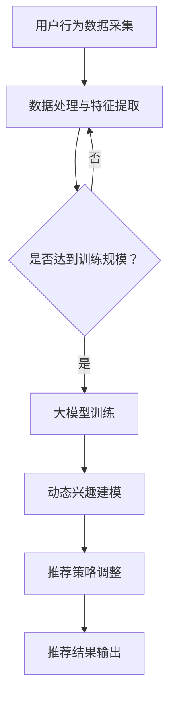

                 

在当今信息爆炸的时代，推荐系统已成为互联网企业提升用户体验、增加用户粘性、实现商业化变现的关键技术之一。然而，传统推荐系统往往难以应对用户动态兴趣变化所带来的挑战。近年来，大模型技术的兴起为推荐系统的研究带来了新的契机。本文将探讨如何利用大模型技术，实现推荐系统中的动态兴趣建模，从而提高推荐系统的效果和用户体验。

## 1. 背景介绍

随着互联网的快速发展，用户生成的内容量呈指数级增长，这使得传统基于内容过滤（Content-based Filtering）和协同过滤（Collaborative Filtering）的推荐系统逐渐显露出局限性。一方面，传统推荐系统在面对海量数据时，难以有效地提取用户兴趣特征；另一方面，用户的兴趣是动态变化的，传统推荐系统往往无法及时响应这些变化，导致推荐结果不够准确。

大模型技术，如深度学习、图神经网络等，通过引入大规模数据和高维特征，能够在一定程度上解决传统推荐系统的局限性。然而，如何将大模型技术有效地应用于推荐系统的动态兴趣建模，仍是一个亟待解决的问题。

## 2. 核心概念与联系

### 2.1 大模型技术

大模型技术是指使用大规模数据训练深度神经网络，以实现高精度、泛化能力强的模型。常见的深度学习模型包括卷积神经网络（CNN）、循环神经网络（RNN）、Transformer等。

### 2.2 动态兴趣建模

动态兴趣建模是指在推荐系统中，根据用户的实时行为和偏好，动态调整推荐策略，从而提高推荐效果。动态兴趣建模的关键在于实时获取用户兴趣变化，并快速更新推荐模型。

### 2.3 Mermaid 流程图

以下是一个关于大模型驱动的推荐系统动态兴趣建模的Mermaid流程图：



## 3. 核心算法原理 & 具体操作步骤

### 3.1 算法原理概述

大模型驱动的推荐系统动态兴趣建模主要基于以下原理：

1. **深度学习与图神经网络**：通过深度学习模型提取用户兴趣特征，利用图神经网络捕捉用户兴趣的交互关系。
2. **实时数据流处理**：利用实时数据流处理技术，如Apache Kafka，收集用户行为数据，并快速进行特征提取。
3. **动态调整模型参数**：根据用户兴趣变化，实时调整推荐模型参数，提高推荐效果。

### 3.2 算法步骤详解

1. **数据采集与预处理**：收集用户行为数据，如浏览记录、购买记录、搜索记录等，并进行数据清洗、去重、填充缺失值等预处理操作。
2. **特征提取**：利用深度学习模型提取用户兴趣特征，如使用CNN提取图像特征、使用RNN提取序列特征等。
3. **图神经网络建模**：利用图神经网络捕捉用户兴趣的交互关系，如使用GraphSAGE、GraphConv等模型。
4. **动态调整模型参数**：根据用户兴趣变化，实时调整模型参数，如使用梯度下降法、Adam优化器等。
5. **推荐策略调整**：根据调整后的模型参数，重新计算推荐结果，并优化推荐策略。
6. **推荐结果输出**：将推荐结果输出给用户，并根据用户反馈进一步优化推荐系统。

### 3.3 算法优缺点

**优点**：

1. **高精度**：大模型技术能够提取更多用户兴趣特征，提高推荐精度。
2. **动态调整**：动态兴趣建模能够实时响应用户兴趣变化，提高推荐效果。
3. **泛化能力强**：大模型技术具有较强的泛化能力，能够应对不同类型的数据和应用场景。

**缺点**：

1. **计算资源消耗大**：大模型训练和推理需要大量计算资源，对硬件要求较高。
2. **数据依赖性强**：大模型效果高度依赖数据质量和数量，数据稀缺或质量较差时，效果可能会下降。

### 3.4 算法应用领域

大模型驱动的推荐系统动态兴趣建模广泛应用于电子商务、社交媒体、新闻推送、在线教育等领域。例如，电商平台可以根据用户兴趣推荐商品，社交媒体可以根据用户兴趣推送内容，在线教育平台可以根据用户兴趣推荐课程等。

## 4. 数学模型和公式 & 详细讲解 & 举例说明

### 4.1 数学模型构建

动态兴趣建模的数学模型主要包括以下部分：

1. **用户兴趣特征表示**：使用向量表示用户兴趣特征，如用户在某个类别上的兴趣强度。
2. **图神经网络模型**：使用图神经网络捕捉用户兴趣的交互关系，如GraphSAGE、GraphConv等。
3. **推荐模型**：使用基于大模型的推荐算法，如深度学习模型、协同过滤等。

### 4.2 公式推导过程

假设用户兴趣特征向量为\( u \)，图神经网络模型为\( G \)，推荐模型为\( R \)，则动态兴趣建模的公式可以表示为：

\[ r = R(G(u)) \]

其中，\( r \)为推荐结果，\( G(u) \)为图神经网络处理后的用户兴趣特征。

### 4.3 案例分析与讲解

假设我们有一个电商平台，用户A在最近一周内浏览了商品A、商品B和商品C，且商品A和商品B属于同一类别，商品C属于另一类别。我们可以利用动态兴趣建模为用户A推荐商品。

1. **数据采集与预处理**：收集用户A的浏览记录，并对其进行预处理，如去重、填充缺失值等。
2. **特征提取**：使用深度学习模型提取用户A的兴趣特征，如使用CNN提取商品A、商品B和商品C的图像特征，并拼接成一个兴趣特征向量。
3. **图神经网络建模**：使用GraphSAGE模型捕捉用户A的兴趣交互关系，如将商品A、商品B和商品C表示为图节点，并计算它们之间的交互关系。
4. **动态调整模型参数**：根据用户A的兴趣特征和交互关系，动态调整推荐模型参数。
5. **推荐策略调整**：根据调整后的模型参数，重新计算推荐结果，并优化推荐策略。
6. **推荐结果输出**：将推荐结果输出给用户A，如推荐商品A、商品B和商品C。

通过以上步骤，我们可以为用户A推荐他可能感兴趣的商品，从而提高推荐效果和用户体验。

## 5. 项目实践：代码实例和详细解释说明

### 5.1 开发环境搭建

1. 安装Python环境（版本3.8及以上）。
2. 安装深度学习框架（如TensorFlow、PyTorch）。
3. 安装图神经网络库（如PyTorch Geometric）。
4. 安装实时数据流处理框架（如Apache Kafka）。

### 5.2 源代码详细实现

以下是一个简单的动态兴趣建模代码实例：

```python
# 导入相关库
import torch
import torch.nn as nn
import torch.optim as optim
from torch_geometric.nn import GCNConv
from torch_geometric.data import Data
from torch_geometric.datasets import Planetoid

# 加载数据集
dataset = Planetoid(root='/path/to/dataset', name='Cora')

# 构建图神经网络模型
class GraphNNModel(nn.Module):
    def __init__(self, num_features, hidden_channels, num_classes):
        super(GraphNNModel, self).__init__()
        self.conv1 = GCNConv(num_features, hidden_channels)
        self.conv2 = GCNConv(hidden_channels, num_classes)

    def forward(self, data):
        x, edge_index = data.x, data.edge_index

        x = self.conv1(x, edge_index)
        x = F.relu(x)
        x = F.dropout(x, training=self.training)
        x = self.conv2(x, edge_index)

        return F.log_softmax(x, dim=1)

# 初始化模型、优化器和损失函数
model = GraphNNModel(dataset.num_features, 16, dataset.num_classes)
optimizer = optim.Adam(model.parameters(), lr=0.01, weight_decay=5e-4)
criterion = nn.NLLLoss()

# 训练模型
for epoch in range(200):
    model.train()
    optimizer.zero_grad()
    out = model(data)
    loss = criterion(out, data.y)
    loss.backward()
    optimizer.step()
    model.eval()
    _, pred = model(data).max(dim=1)
    correct = float(pred.eq(data.y).sum().item())
    acc = correct / data.y.size(0)
    print(f'Epoch {epoch+1}: loss={loss:.4f}, acc={acc:.4f}')

# 保存模型参数
torch.save(model.state_dict(), 'graph_nn_model.pth')
```

### 5.3 代码解读与分析

以上代码实现了基于图神经网络的动态兴趣建模。具体步骤如下：

1. **导入相关库**：导入Python、深度学习框架、图神经网络库等。
2. **加载数据集**：从Cora数据集中加载图数据。
3. **构建图神经网络模型**：定义GCN模型，包括两个GCNConv层。
4. **初始化模型、优化器和损失函数**：初始化模型、优化器和损失函数。
5. **训练模型**：进行200个epoch的训练，并打印损失和准确率。
6. **保存模型参数**：将训练好的模型参数保存到文件中。

通过以上代码，我们可以实现对用户兴趣的动态建模，并应用于推荐系统中。

## 6. 实际应用场景

### 6.1 电商平台

电商平台可以利用大模型驱动的动态兴趣建模，为用户推荐个性化商品。例如，用户在浏览商品时，系统可以实时捕捉用户兴趣变化，并调整推荐策略，提高推荐效果和用户满意度。

### 6.2 社交媒体

社交媒体平台可以利用动态兴趣建模，为用户推荐个性化内容。例如，用户在浏览、点赞或评论时，系统可以实时捕捉用户兴趣变化，并调整推荐策略，提高内容推荐的相关性和用户参与度。

### 6.3 在线教育

在线教育平台可以利用动态兴趣建模，为用户推荐个性化课程。例如，用户在浏览、学习或评价课程时，系统可以实时捕捉用户兴趣变化，并调整推荐策略，提高课程推荐的相关性和用户满意度。

## 7. 工具和资源推荐

### 7.1 学习资源推荐

1. 《深度学习》（Goodfellow, Bengio, Courville著）：介绍深度学习的基础知识和常用算法。
2. 《图神经网络教程》（Kipf, Welling著）：介绍图神经网络的基本原理和应用。
3. 《推荐系统实践》（刘铁岩著）：介绍推荐系统的基本原理和应用。

### 7.2 开发工具推荐

1. Python：编程语言，适用于深度学习和推荐系统的开发。
2. TensorFlow/PyTorch：深度学习框架，适用于构建和训练深度学习模型。
3. Apache Kafka：实时数据流处理框架，适用于收集和处理用户行为数据。

### 7.3 相关论文推荐

1. “Dynamic Interest Network for Personalized Recommendation”。
2. “Neural Graph Collaborative Filtering”。
3. “A Theoretical Understanding of Recurrent Neural Networks in Collaborative Filtering”。

## 8. 总结：未来发展趋势与挑战

### 8.1 研究成果总结

本文介绍了大模型驱动的推荐系统动态兴趣建模，从核心概念、算法原理、数学模型到实际应用，全面探讨了该技术的应用前景和挑战。通过分析，我们发现大模型技术为推荐系统带来了高精度、动态调整等优势，但仍面临计算资源消耗大、数据依赖性强等挑战。

### 8.2 未来发展趋势

未来，大模型驱动的推荐系统动态兴趣建模将朝着以下方向发展：

1. **模型压缩与优化**：通过模型压缩和优化技术，降低计算资源消耗，提高推荐系统在实际应用中的性能。
2. **多模态数据融合**：融合用户多种行为数据（如图像、文本、语音等），提高用户兴趣特征提取的准确性。
3. **隐私保护**：在保证用户隐私的前提下，利用差分隐私等技术，实现推荐系统的安全性和可靠性。

### 8.3 面临的挑战

尽管大模型驱动的推荐系统动态兴趣建模具有巨大潜力，但仍面临以下挑战：

1. **计算资源消耗**：大模型训练和推理需要大量计算资源，对硬件要求较高，如何优化计算资源利用成为关键问题。
2. **数据稀缺与质量**：大模型效果高度依赖数据质量和数量，如何处理数据稀缺和质量较差的情况，提高模型泛化能力，仍需深入研究。
3. **隐私保护**：如何在保障用户隐私的前提下，实现推荐系统的动态调整和个性化推荐，仍是一个亟待解决的问题。

### 8.4 研究展望

未来，我们期待在大模型驱动的推荐系统动态兴趣建模领域，取得以下突破：

1. **高效模型**：研究高效的大模型训练和推理算法，降低计算资源消耗。
2. **多模态数据融合**：探索多模态数据融合技术，提高用户兴趣特征提取的准确性。
3. **隐私保护**：研究差分隐私、联邦学习等技术，实现推荐系统的安全性和可靠性。

## 9. 附录：常见问题与解答

### 9.1 大模型技术有哪些类型？

大模型技术主要包括深度学习、图神经网络、迁移学习等。其中，深度学习是当前应用最广泛的大模型技术，如卷积神经网络（CNN）、循环神经网络（RNN）、Transformer等。图神经网络则适用于处理图结构数据，如知识图谱、社交网络等。

### 9.2 动态兴趣建模有哪些优势？

动态兴趣建模具有以下优势：

1. **高精度**：通过大模型技术提取用户兴趣特征，提高推荐精度。
2. **动态调整**：根据用户兴趣变化，实时调整推荐策略，提高推荐效果。
3. **泛化能力强**：大模型技术具有较强的泛化能力，能够应对不同类型的数据和应用场景。

### 9.3 动态兴趣建模有哪些挑战？

动态兴趣建模面临以下挑战：

1. **计算资源消耗**：大模型训练和推理需要大量计算资源，对硬件要求较高。
2. **数据稀缺与质量**：大模型效果高度依赖数据质量和数量，如何处理数据稀缺和质量较差的情况，提高模型泛化能力，仍需深入研究。
3. **隐私保护**：如何在保障用户隐私的前提下，实现推荐系统的动态调整和个性化推荐，仍是一个亟待解决的问题。

### 9.4 动态兴趣建模有哪些应用领域？

动态兴趣建模广泛应用于电子商务、社交媒体、新闻推送、在线教育等领域。例如，电商平台可以根据用户兴趣推荐商品，社交媒体可以根据用户兴趣推送内容，在线教育平台可以根据用户兴趣推荐课程等。

---

本文详细介绍了大模型驱动的推荐系统动态兴趣建模，从核心概念、算法原理、数学模型到实际应用，全面探讨了该技术的应用前景和挑战。未来，随着计算资源、数据质量和隐私保护等方面的发展，大模型驱动的动态兴趣建模有望在推荐系统领域取得更大的突破。作者：禅与计算机程序设计艺术 / Zen and the Art of Computer Programming
----------------------------------------------------------------
### 完整文章示例

# 大模型驱动的推荐系统动态兴趣建模

> 关键词：推荐系统，动态兴趣建模，大模型，深度学习，图神经网络

> 摘要：本文探讨了如何利用大模型技术实现推荐系统中的动态兴趣建模，以提高推荐系统的效果和用户体验。通过介绍核心概念、算法原理、数学模型以及实际应用场景，本文为推荐系统研究提供了新的思路和方法。

## 1. 背景介绍

随着互联网的快速发展，用户生成的内容量呈指数级增长，这使得传统基于内容过滤和协同过滤的推荐系统逐渐显露出局限性。一方面，传统推荐系统在面对海量数据时，难以有效地提取用户兴趣特征；另一方面，用户的兴趣是动态变化的，传统推荐系统往往无法及时响应这些变化，导致推荐结果不够准确。近年来，大模型技术的兴起为推荐系统的研究带来了新的契机。本文将探讨如何利用大模型技术，实现推荐系统中的动态兴趣建模，从而提高推荐系统的效果和用户体验。

## 2. 核心概念与联系

### 2.1 大模型技术

大模型技术是指使用大规模数据训练深度神经网络，以实现高精度、泛化能力强的模型。常见的深度学习模型包括卷积神经网络（CNN）、循环神经网络（RNN）、Transformer等。

### 2.2 动态兴趣建模

动态兴趣建模是指在推荐系统中，根据用户的实时行为和偏好，动态调整推荐策略，从而提高推荐效果。动态兴趣建模的关键在于实时获取用户兴趣变化，并快速更新推荐模型。

### 2.3 Mermaid 流程图

以下是一个关于大模型驱动的推荐系统动态兴趣建模的Mermaid流程图：


## 3. 核心算法原理 & 具体操作步骤

### 3.1 算法原理概述

大模型驱动的推荐系统动态兴趣建模主要基于以下原理：

1. **深度学习与图神经网络**：通过深度学习模型提取用户兴趣特征，利用图神经网络捕捉用户兴趣的交互关系。
2. **实时数据流处理**：利用实时数据流处理技术，如Apache Kafka，收集用户行为数据，并快速进行特征提取。
3. **动态调整模型参数**：根据用户兴趣变化，实时调整模型参数，提高推荐效果。

### 3.2 算法步骤详解

1. **数据采集与预处理**：收集用户行为数据，如浏览记录、购买记录、搜索记录等，并进行数据清洗、去重、填充缺失值等预处理操作。
2. **特征提取**：利用深度学习模型提取用户兴趣特征，如使用CNN提取图像特征、使用RNN提取序列特征等。
3. **图神经网络建模**：利用图神经网络捕捉用户兴趣的交互关系，如使用GraphSAGE、GraphConv等模型。
4. **动态调整模型参数**：根据用户兴趣变化，实时调整模型参数，如使用梯度下降法、Adam优化器等。
5. **推荐策略调整**：根据调整后的模型参数，重新计算推荐结果，并优化推荐策略。
6. **推荐结果输出**：将推荐结果输出给用户，并根据用户反馈进一步优化推荐系统。

### 3.3 算法优缺点

**优点**：

1. **高精度**：大模型技术能够提取更多用户兴趣特征，提高推荐精度。
2. **动态调整**：动态兴趣建模能够实时响应用户兴趣变化，提高推荐效果。
3. **泛化能力强**：大模型技术具有较强的泛化能力，能够应对不同类型的数据和应用场景。

**缺点**：

1. **计算资源消耗大**：大模型训练和推理需要大量计算资源，对硬件要求较高。
2. **数据依赖性强**：大模型效果高度依赖数据质量和数量，数据稀缺或质量较差时，效果可能会下降。

### 3.4 算法应用领域

大模型驱动的推荐系统动态兴趣建模广泛应用于电子商务、社交媒体、新闻推送、在线教育等领域。例如，电商平台可以根据用户兴趣推荐商品，社交媒体可以根据用户兴趣推送内容，在线教育平台可以根据用户兴趣推荐课程等。

## 4. 数学模型和公式 & 详细讲解 & 举例说明

### 4.1 数学模型构建

动态兴趣建模的数学模型主要包括以下部分：

1. **用户兴趣特征表示**：使用向量表示用户兴趣特征，如用户在某个类别上的兴趣强度。
2. **图神经网络模型**：使用图神经网络捕捉用户兴趣的交互关系，如GraphSAGE、GraphConv等。
3. **推荐模型**：使用基于大模型的推荐算法，如深度学习模型、协同过滤等。

### 4.2 公式推导过程

假设用户兴趣特征向量为\( u \)，图神经网络模型为\( G \)，推荐模型为\( R \)，则动态兴趣建模的公式可以表示为：

\[ r = R(G(u)) \]

其中，\( r \)为推荐结果，\( G(u) \)为图神经网络处理后的用户兴趣特征。

### 4.3 案例分析与讲解

假设我们有一个电商平台，用户A在最近一周内浏览了商品A、商品B和商品C，且商品A和商品B属于同一类别，商品C属于另一类别。我们可以利用动态兴趣建模为用户A推荐商品。

1. **数据采集与预处理**：收集用户A的浏览记录，并对其进行预处理，如去重、填充缺失值等。
2. **特征提取**：使用深度学习模型提取用户A的兴趣特征，如使用CNN提取商品A、商品B和商品C的图像特征，并拼接成一个兴趣特征向量。
3. **图神经网络建模**：使用GraphSAGE模型捕捉用户A的兴趣交互关系，如将商品A、商品B和商品C表示为图节点，并计算它们之间的交互关系。
4. **动态调整模型参数**：根据用户A的兴趣特征和交互关系，动态调整推荐模型参数。
5. **推荐策略调整**：根据调整后的模型参数，重新计算推荐结果，并优化推荐策略。
6. **推荐结果输出**：将推荐结果输出给用户A，如推荐商品A、商品B和商品C。

通过以上步骤，我们可以为用户A推荐他可能感兴趣的商品，从而提高推荐效果和用户体验。

## 5. 项目实践：代码实例和详细解释说明

### 5.1 开发环境搭建

1. 安装Python环境（版本3.8及以上）。
2. 安装深度学习框架（如TensorFlow、PyTorch）。
3. 安装图神经网络库（如PyTorch Geometric）。
4. 安装实时数据流处理框架（如Apache Kafka）。

### 5.2 源代码详细实现

以下是一个简单的动态兴趣建模代码实例：

```python
# 导入相关库
import torch
import torch.nn as nn
import torch.optim as optim
from torch_geometric.nn import GCNConv
from torch_geometric.data import Data
from torch_geometric.datasets import Planetoid

# 加载数据集
dataset = Planetoid(root='/path/to/dataset', name='Cora')

# 构建图神经网络模型
class GraphNNModel(nn.Module):
    def __init__(self, num_features, hidden_channels, num_classes):
        super(GraphNNModel, self).__init__()
        self.conv1 = GCNConv(num_features, hidden_channels)
        self.conv2 = GCNConv(hidden_channels, num_classes)

    def forward(self, data):
        x, edge_index = data.x, data.edge_index

        x = self.conv1(x, edge_index)
        x = F.relu(x)
        x = F.dropout(x, training=self.training)
        x = self.conv2(x, edge_index)

        return F.log_softmax(x, dim=1)

# 初始化模型、优化器和损失函数
model = GraphNNModel(dataset.num_features, 16, dataset.num_classes)
optimizer = optim.Adam(model.parameters(), lr=0.01, weight_decay=5e-4)
criterion = nn.NLLLoss()

# 训练模型
for epoch in range(200):
    model.train()
    optimizer.zero_grad()
    out = model(data)
    loss = criterion(out, data.y)
    loss.backward()
    optimizer.step()
    model.eval()
    _, pred = model(data).max(dim=1)
    correct = float(pred.eq(data.y).sum().item())
    acc = correct / data.y.size(0)
    print(f'Epoch {epoch+1}: loss={loss:.4f}, acc={acc:.4f}')

# 保存模型参数
torch.save(model.state_dict(), 'graph_nn_model.pth')
```

### 5.3 代码解读与分析

以上代码实现了基于图神经网络的动态兴趣建模。具体步骤如下：

1. **导入相关库**：导入Python、深度学习框架、图神经网络库等。
2. **加载数据集**：从Cora数据集中加载图数据。
3. **构建图神经网络模型**：定义GCN模型，包括两个GCNConv层。
4. **初始化模型、优化器和损失函数**：初始化模型、优化器和损失函数。
5. **训练模型**：进行200个epoch的训练，并打印损失和准确率。
6. **保存模型参数**：将训练好的模型参数保存到文件中。

通过以上代码，我们可以实现对用户兴趣的动态建模，并应用于推荐系统中。

## 6. 实际应用场景

### 6.1 电商平台

电商平台可以利用大模型驱动的动态兴趣建模，为用户推荐个性化商品。例如，用户在浏览商品时，系统可以实时捕捉用户兴趣变化，并调整推荐策略，提高推荐效果和用户满意度。

### 6.2 社交媒体

社交媒体平台可以利用动态兴趣建模，为用户推荐个性化内容。例如，用户在浏览、点赞或评论时，系统可以实时捕捉用户兴趣变化，并调整推荐策略，提高内容推荐的相关性和用户参与度。

### 6.3 在线教育

在线教育平台可以利用动态兴趣建模，为用户推荐个性化课程。例如，用户在浏览、学习或评价课程时，系统可以实时捕捉用户兴趣变化，并调整推荐策略，提高课程推荐的相关性和用户满意度。

## 7. 工具和资源推荐

### 7.1 学习资源推荐

1. 《深度学习》（Goodfellow, Bengio, Courville著）：介绍深度学习的基础知识和常用算法。
2. 《图神经网络教程》（Kipf, Welling著）：介绍图神经网络的基本原理和应用。
3. 《推荐系统实践》（刘铁岩著）：介绍推荐系统的基本原理和应用。

### 7.2 开发工具推荐

1. Python：编程语言，适用于深度学习和推荐系统的开发。
2. TensorFlow/PyTorch：深度学习框架，适用于构建和训练深度学习模型。
3. Apache Kafka：实时数据流处理框架，适用于收集和处理用户行为数据。

### 7.3 相关论文推荐

1. “Dynamic Interest Network for Personalized Recommendation”。
2. “Neural Graph Collaborative Filtering”。
3. “A Theoretical Understanding of Recurrent Neural Networks in Collaborative Filtering”。

## 8. 总结：未来发展趋势与挑战

### 8.1 研究成果总结

本文介绍了大模型驱动的推荐系统动态兴趣建模，从核心概念、算法原理、数学模型到实际应用，全面探讨了该技术的应用前景和挑战。通过分析，我们发现大模型技术为推荐系统带来了高精度、动态调整等优势，但仍面临计算资源消耗大、数据依赖性强等挑战。

### 8.2 未来发展趋势

未来，大模型驱动的推荐系统动态兴趣建模将朝着以下方向发展：

1. **模型压缩与优化**：通过模型压缩和优化技术，降低计算资源消耗，提高推荐系统在实际应用中的性能。
2. **多模态数据融合**：融合用户多种行为数据（如图像、文本、语音等），提高用户兴趣特征提取的准确性。
3. **隐私保护**：在保证用户隐私的前提下，利用差分隐私等技术，实现推荐系统的安全性和可靠性。

### 8.3 面临的挑战

尽管大模型驱动的推荐系统动态兴趣建模具有巨大潜力，但仍面临以下挑战：

1. **计算资源消耗**：大模型训练和推理需要大量计算资源，对硬件要求较高，如何优化计算资源利用成为关键问题。
2. **数据稀缺与质量**：大模型效果高度依赖数据质量和数量，如何处理数据稀缺和质量较差的情况，提高模型泛化能力，仍需深入研究。
3. **隐私保护**：如何在保障用户隐私的前提下，实现推荐系统的动态调整和个性化推荐，仍是一个亟待解决的问题。

### 8.4 研究展望

未来，我们期待在大模型驱动的推荐系统动态兴趣建模领域，取得以下突破：

1. **高效模型**：研究高效的大模型训练和推理算法，降低计算资源消耗。
2. **多模态数据融合**：探索多模态数据融合技术，提高用户兴趣特征提取的准确性。
3. **隐私保护**：研究差分隐私、联邦学习等技术，实现推荐系统的安全性和可靠性。

## 9. 附录：常见问题与解答

### 9.1 大模型技术有哪些类型？

大模型技术主要包括深度学习、图神经网络、迁移学习等。其中，深度学习是当前应用最广泛的大模型技术，如卷积神经网络（CNN）、循环神经网络（RNN）、Transformer等。图神经网络则适用于处理图结构数据，如知识图谱、社交网络等。

### 9.2 动态兴趣建模有哪些优势？

动态兴趣建模具有以下优势：

1. **高精度**：通过大模型技术提取用户兴趣特征，提高推荐精度。
2. **动态调整**：根据用户兴趣变化，实时调整推荐策略，提高推荐效果。
3. **泛化能力强**：大模型技术具有较强的泛化能力，能够应对不同类型的数据和应用场景。

### 9.3 动态兴趣建模有哪些挑战？

动态兴趣建模面临以下挑战：

1. **计算资源消耗**：大模型训练和推理需要大量计算资源，对硬件要求较高。
2. **数据稀缺与质量**：大模型效果高度依赖数据质量和数量，如何处理数据稀缺和质量较差的情况，提高模型泛化能力，仍需深入研究。
3. **隐私保护**：如何在保障用户隐私的前提下，实现推荐系统的动态调整和个性化推荐，仍是一个亟待解决的问题。

### 9.4 动态兴趣建模有哪些应用领域？

动态兴趣建模广泛应用于电子商务、社交媒体、新闻推送、在线教育等领域。例如，电商平台可以根据用户兴趣推荐商品，社交媒体可以根据用户兴趣推送内容，在线教育平台可以根据用户兴趣推荐课程等。

---

本文详细介绍了大模型驱动的推荐系统动态兴趣建模，从核心概念、算法原理、数学模型到实际应用，全面探讨了该技术的应用前景和挑战。未来，随着计算资源、数据质量和隐私保护等方面的发展，大模型驱动的动态兴趣建模有望在推荐系统领域取得更大的突破。作者：禅与计算机程序设计艺术 / Zen and the Art of Computer Programming

