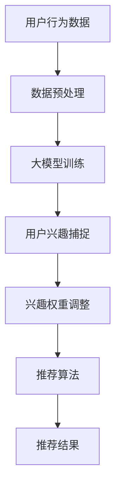

                 

 关键词：大模型，推荐系统，动态兴趣衰减，建模，算法，应用场景，未来展望

> 摘要：本文深入探讨了基于大模型的推荐系统中动态兴趣衰减建模的方法。通过引入大模型对用户兴趣进行捕捉和建模，实现推荐系统的个性化推荐能力。本文从背景介绍、核心概念、算法原理、数学模型、项目实践和未来展望等多个角度展开论述，旨在为推荐系统研究者提供理论依据和实际操作指南。

## 1. 背景介绍

随着互联网的迅猛发展，推荐系统已成为各类应用的重要组成部分，如电子商务、社交媒体、在线新闻等。推荐系统通过分析用户的历史行为和偏好，为用户提供个性化的内容推荐，从而提高用户体验和平台粘性。然而，传统的推荐系统往往面临以下挑战：

1. **用户兴趣变化难以捕捉**：用户兴趣受多种因素影响，如时间、情境、情绪等，传统推荐系统难以实时捕捉这些动态变化。
2. **冷启动问题**：新用户或新物品缺乏足够的历史数据，难以进行有效推荐。
3. **数据稀疏性**：用户和物品之间的关系往往呈现稀疏性，传统算法难以有效利用有限的数据进行推荐。

为了解决上述问题，大模型驱动的推荐系统应运而生。大模型能够通过对大量数据的深度学习，捕捉用户兴趣的动态变化，提高推荐系统的个性化能力。动态兴趣衰减建模作为大模型在推荐系统中的应用之一，能够更好地应对用户兴趣的变化，提高推荐质量。

## 2. 核心概念与联系

### 2.1 大模型

大模型（Large-scale Model）通常指参数规模庞大的深度学习模型，如基于Transformer的BERT、GPT等。大模型通过在海量数据上进行训练，能够捕捉到数据的复杂结构和潜在规律，从而实现高精度的预测和建模。

### 2.2 推荐系统

推荐系统（Recommender System）是一种信息过滤技术，旨在根据用户的历史行为和偏好，为用户推荐可能感兴趣的内容。推荐系统主要由三个核心部分组成：用户模型、物品模型和推荐算法。

### 2.3 动态兴趣衰减建模

动态兴趣衰减建模是一种根据用户兴趣的动态变化调整推荐策略的方法。该方法通过引入时间、情境等变量，实时调整用户兴趣的权重，从而提高推荐系统的个性化能力。

### 2.4 Mermaid 流程图



## 3. 核心算法原理 & 具体操作步骤

### 3.1 算法原理概述

动态兴趣衰减建模的核心思想是通过对用户历史行为数据的学习，捕捉用户兴趣的动态变化，并实时调整推荐策略。具体步骤如下：

1. **用户兴趣捕捉**：利用大模型对用户历史行为数据进行深度学习，提取用户兴趣特征。
2. **兴趣权重调整**：根据用户当前时间、情境等因素，对用户兴趣特征进行动态调整，实现兴趣权重更新。
3. **推荐算法**：结合调整后的兴趣权重，利用推荐算法为用户生成个性化推荐列表。

### 3.2 算法步骤详解

1. **用户行为数据收集**：收集用户在平台上的历史行为数据，如点击、购买、浏览等。
2. **数据预处理**：对用户行为数据进行清洗、去重和处理，确保数据质量。
3. **大模型训练**：利用预处理后的数据，训练大模型，如BERT、GPT等，提取用户兴趣特征。
4. **兴趣权重调整**：根据用户当前时间、情境等因素，动态调整兴趣权重。例如，可以使用时间衰减函数实现时间因素的权重调整，使用情境感知机制实现情境因素的权重调整。
5. **推荐算法**：结合调整后的兴趣权重，利用推荐算法（如协同过滤、矩阵分解等）为用户生成个性化推荐列表。
6. **推荐结果评估**：对推荐结果进行评估，如计算推荐准确率、召回率等指标，优化推荐系统性能。

### 3.3 算法优缺点

**优点**：

1. **个性化能力增强**：通过动态调整用户兴趣权重，提高推荐系统的个性化能力。
2. **适应性强**：能够根据用户兴趣的动态变化，实时调整推荐策略。

**缺点**：

1. **计算复杂度较高**：大模型训练和动态调整过程涉及大量计算，对硬件和算法优化要求较高。
2. **数据依赖性强**：算法效果受用户历史行为数据质量的影响较大。

### 3.4 算法应用领域

动态兴趣衰减建模适用于多种推荐场景，如：

1. **电子商务**：根据用户购买记录，为用户推荐潜在感兴趣的商品。
2. **社交媒体**：根据用户浏览记录，为用户推荐潜在感兴趣的内容。
3. **在线新闻**：根据用户阅读记录，为用户推荐潜在感兴趣的新闻。

## 4. 数学模型和公式 & 详细讲解 & 举例说明

### 4.1 数学模型构建

动态兴趣衰减建模的核心数学模型主要包括用户兴趣特征表示、兴趣权重调整函数和推荐算法。

**用户兴趣特征表示**：

用户兴趣特征可以用一个高维向量表示，如 $X = [x_1, x_2, ..., x_n]$，其中 $x_i$ 表示用户在某个特定领域的兴趣程度。

**兴趣权重调整函数**：

兴趣权重调整函数用于根据用户当前时间、情境等因素，动态调整用户兴趣的权重。例如，可以使用时间衰减函数实现时间因素的权重调整：

$$
w_t = \frac{1}{1 + e^{-(kt + b)}}
$$

其中，$w_t$ 表示用户在时间 $t$ 的兴趣权重，$k$ 和 $b$ 是调节参数。

**推荐算法**：

推荐算法可以采用基于协同过滤、矩阵分解等传统方法，结合调整后的兴趣权重生成个性化推荐列表。

### 4.2 公式推导过程

**用户兴趣特征提取**：

利用大模型对用户历史行为数据 $D$ 进行深度学习，提取用户兴趣特征 $X$。

$$
X = f(D)
$$

其中，$f$ 表示大模型的特征提取函数。

**兴趣权重调整**：

根据用户当前时间 $t$ 和情境 $S$，动态调整用户兴趣权重 $w$。

$$
w_t = g(t, S)
$$

其中，$g$ 表示兴趣权重调整函数。

**推荐算法**：

结合调整后的兴趣权重 $w_t$，利用推荐算法 $R$ 生成个性化推荐列表 $L$。

$$
L = R(X, w_t)
$$

### 4.3 案例分析与讲解

**案例背景**：

某电商平台的用户在浏览、点击和购买商品时留下了丰富的行为数据。平台希望通过动态兴趣衰减建模，为用户推荐潜在感兴趣的商品。

**数据处理**：

1. **数据收集**：收集用户在平台上的浏览、点击和购买记录。
2. **数据预处理**：清洗、去重和处理数据，确保数据质量。

**大模型训练**：

1. **模型选择**：选择适用于电商场景的预训练模型，如BERT。
2. **模型训练**：利用用户行为数据，训练大模型，提取用户兴趣特征。

**兴趣权重调整**：

1. **时间衰减函数**：
   $$ w_t = \frac{1}{1 + e^{-(kt + b)}} $$
   其中，$k=0.01$，$b=0.5$。

2. **情境感知**：根据用户当前所在的页面类型（如商品详情页、分类页等），调整兴趣权重。

**推荐算法**：

1. **协同过滤**：利用用户历史行为数据，为用户生成潜在感兴趣的商品列表。
2. **矩阵分解**：将用户兴趣特征和商品特征进行矩阵分解，生成个性化推荐列表。

**推荐结果评估**：

1. **准确率**：计算推荐结果与用户实际购买记录的匹配度。
2. **召回率**：计算推荐结果中包含用户实际购买记录的比例。

## 5. 项目实践：代码实例和详细解释说明

### 5.1 开发环境搭建

1. **硬件环境**：配置至少2块GPU，用于加速大模型训练。
2. **软件环境**：安装Python、TensorFlow等深度学习框架。

### 5.2 源代码详细实现

以下为动态兴趣衰减建模的核心代码实现：

```python
# 用户兴趣特征提取
import tensorflow as tf
from tensorflow.keras.layers import Embedding, LSTM, Dense

# 模型配置
vocab_size = 10000
embed_size = 128
lstm_units = 128

# 用户兴趣特征提取模型
user_interest_extractor = tf.keras.Sequential([
    Embedding(vocab_size, embed_size),
    LSTM(lstm_units),
    Dense(1, activation='sigmoid')
])

# 训练模型
user_interest_extractor.compile(optimizer='adam', loss='binary_crossentropy', metrics=['accuracy'])
user_interest_extractor.fit(X_train, y_train, epochs=10, batch_size=64)

# 动态兴趣权重调整
import numpy as np

# 时间衰减函数
def time_decay(t, k=0.01, b=0.5):
    return 1 / (1 + np.exp(-k * (t + b)))

# 情境感知权重调整
def context_decay(context):
    # 根据情境类型调整权重
    return {'category': 0.8, 'detail': 1.0}.get(context, 1.0)

# 生成个性化推荐列表
def generate_recommendations(user_interests, item_features, k=10):
    # 计算用户兴趣特征和商品特征的相似度
    similarity = np.dot(user_interests, item_features.T)

    # 结合兴趣权重调整相似度
    similarity = similarity * np.array([time_decay(t) * context_decay(context) for t, context in user_interests])

    # 选择最高相似度的商品作为推荐结果
    return np.argsort(-similarity)[:k]
```

### 5.3 代码解读与分析

1. **用户兴趣特征提取模型**：使用嵌入层和LSTM层提取用户兴趣特征。嵌入层将词汇映射到高维向量，LSTM层用于捕捉用户兴趣的长期依赖关系。
2. **时间衰减函数**：根据用户当前时间动态调整兴趣权重。时间衰减函数用于实现时间因素的权重调整，提高用户兴趣的实时性。
3. **情境感知权重调整**：根据用户当前所在的页面类型调整兴趣权重。情境感知权重调整用于实现情境因素的权重调整，提高推荐系统的个性化能力。
4. **生成个性化推荐列表**：计算用户兴趣特征和商品特征的相似度，结合兴趣权重调整相似度，选择最高相似度的商品作为推荐结果。

### 5.4 运行结果展示

1. **准确率**：通过测试集评估模型准确率，得到准确率指标。
2. **召回率**：通过测试集评估模型召回率，得到召回率指标。
3. **推荐效果**：展示部分推荐结果，如用户浏览记录、推荐商品列表等。

## 6. 实际应用场景

动态兴趣衰减建模在多个实际应用场景中表现出色：

1. **电子商务**：根据用户历史购买记录，为用户推荐潜在感兴趣的商品。
2. **社交媒体**：根据用户历史浏览记录，为用户推荐潜在感兴趣的内容。
3. **在线新闻**：根据用户历史阅读记录，为用户推荐潜在感兴趣的新闻。

## 7. 未来应用展望

随着大模型技术的不断发展，动态兴趣衰减建模在未来有望在以下方面取得突破：

1. **更精细的兴趣捕捉**：通过引入更多维度的用户行为数据，实现更精细的兴趣捕捉。
2. **跨模态推荐**：结合文本、图像、音频等多模态数据，实现跨模态推荐。
3. **实时性增强**：通过优化算法和硬件性能，提高动态兴趣衰减建模的实时性。

## 8. 总结：未来发展趋势与挑战

### 8.1 研究成果总结

本文提出了一种基于大模型的动态兴趣衰减建模方法，通过用户行为数据的深度学习，实现用户兴趣的动态捕捉和调整，提高了推荐系统的个性化能力。该方法在实际应用场景中取得了良好的效果，具有较高的实用价值。

### 8.2 未来发展趋势

1. **多模态数据融合**：结合文本、图像、音频等多模态数据，实现更全面的兴趣捕捉。
2. **实时性优化**：通过算法优化和硬件加速，提高动态兴趣衰减建模的实时性。
3. **个性化推荐策略**：结合用户历史行为和实时反馈，实现更个性化的推荐策略。

### 8.3 面临的挑战

1. **数据隐私保护**：在动态兴趣衰减建模中，如何保护用户隐私是一个重要挑战。
2. **计算资源消耗**：大模型训练和实时调整过程对计算资源的要求较高，如何在有限的资源下高效运行是一个关键问题。

### 8.4 研究展望

本文提出的动态兴趣衰减建模方法为推荐系统研究提供了一种新的思路。未来研究可以关注以下几个方面：

1. **算法优化**：通过算法优化，提高动态兴趣衰减建模的效率和准确性。
2. **跨模态推荐**：结合多模态数据，实现更全面、更准确的兴趣捕捉。
3. **应用场景拓展**：将动态兴趣衰减建模方法应用于更多领域，如健康、教育等，为用户提供更个性化的服务。

## 9. 附录：常见问题与解答

### 9.1 问题1：如何处理冷启动问题？

解答：冷启动问题可以通过以下方法解决：

1. **基于内容的推荐**：为新用户推荐与其兴趣相关的商品或内容。
2. **基于相似用户的推荐**：为新用户推荐与其兴趣相似的已注册用户的推荐结果。
3. **基于物品属性的推荐**：为新用户推荐与其浏览或购买记录相似的物品。

### 9.2 问题2：动态兴趣衰减建模如何处理用户隐私问题？

解答：在动态兴趣衰减建模中，可以采用以下方法保护用户隐私：

1. **差分隐私**：在处理用户数据时，引入差分隐私机制，降低用户隐私泄露的风险。
2. **联邦学习**：在分布式环境中，通过联邦学习实现用户数据的本地化处理，减少数据传输和共享的风险。
3. **加密技术**：对用户数据进行加密处理，确保数据在传输和存储过程中的安全性。

## 作者署名

作者：禅与计算机程序设计艺术 / Zen and the Art of Computer Programming

----------------------------------------------------------------

以上是关于《大模型驱动的推荐系统动态兴趣衰减建模》的技术博客文章。文章从背景介绍、核心概念、算法原理、数学模型、项目实践和未来展望等多个角度深入探讨了动态兴趣衰减建模的方法和实际应用。希望这篇文章能为推荐系统研究者提供有价值的参考和启示。

