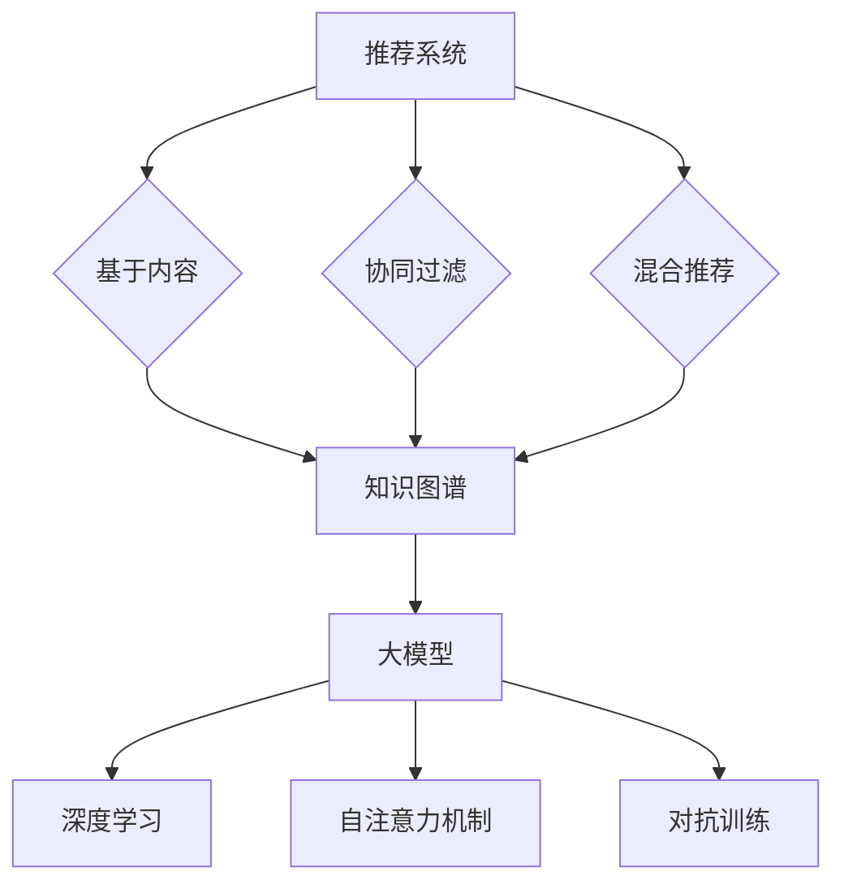

                 

关键词：大模型、推荐系统、知识图谱、人工智能、算法设计、数学模型

摘要：本文探讨了基于大规模模型驱动的推荐系统知识图谱构建的方法。首先，我们回顾了推荐系统和知识图谱的基础概念，然后详细介绍了大模型在推荐系统中的应用，以及如何通过大模型构建知识图谱。接着，我们分析了核心算法原理，并详细讲解了数学模型和公式。随后，通过实际项目实践，我们展示了如何使用代码实现这一方法。最后，我们讨论了该方法的实际应用场景，并展望了未来的发展趋势与挑战。

## 1. 背景介绍

随着互联网的飞速发展和信息的爆炸式增长，用户获取个性化信息的需求日益增长。推荐系统作为一种信息过滤的方法，通过预测用户对物品的偏好，为用户提供定制化的信息推荐，已经成为互联网企业争夺用户注意力的重要手段。知识图谱作为一种结构化数据表示方法，通过语义关系将不同实体连接起来，为推荐系统提供了丰富的语义信息。

然而，传统的推荐系统主要依赖基于内容的过滤和协同过滤等方法，存在用户偏好表达不足、冷启动问题、数据稀疏性等问题。而大模型，如深度学习模型，通过学习大量数据，能够自动提取复杂的特征，提高推荐系统的准确性。同时，知识图谱能够为推荐系统提供更为丰富的上下文信息，进一步提升推荐的个性化程度。

本文将探讨如何利用大模型构建推荐系统知识图谱，解决传统推荐系统的局限性，为用户提供更加精准的推荐服务。

## 2. 核心概念与联系

### 2.1 推荐系统

推荐系统是一种基于数据挖掘和人工智能技术的信息过滤方法，旨在根据用户的历史行为、偏好和上下文信息，预测用户对未知物品的偏好，并提供个性化的推荐。推荐系统通常分为以下几类：

1. **基于内容的推荐（Content-Based Filtering）**：根据用户过去对特定内容的偏好，为用户推荐相似内容的物品。
2. **协同过滤推荐（Collaborative Filtering）**：通过收集用户对物品的评价数据，发现相似用户和物品之间的关联，为用户提供推荐。
3. **混合推荐（Hybrid Recommendation）**：结合基于内容和协同过滤的方法，以提供更准确的推荐。

### 2.2 知识图谱

知识图谱是一种结构化的语义网络，通过节点（实体）和边（关系）来表示现实世界的知识和信息。知识图谱具有以下特点：

1. **实体表示**：将现实世界中的实体（如人、地点、物品）抽象为节点。
2. **关系表示**：通过边表示实体之间的语义关系（如“属于”、“位于”等）。
3. **语义推理**：基于图谱中的节点和关系，进行语义推理和查询，以发现新的关联和知识。

### 2.3 大模型

大模型是指那些能够处理大规模数据，并提取复杂特征的深度学习模型。常见的有：

1. **神经网络（Neural Networks）**：通过多层神经网络，自动提取输入数据的特征。
2. **变换器（Transformers）**：基于自注意力机制，能够处理序列数据，如文本和语音。
3. **生成对抗网络（GANs）**：通过生成器和判别器的对抗训练，生成高质量的数据。

### 2.4 Mermaid 流程图



## 3. 核心算法原理 & 具体操作步骤

### 3.1 算法原理概述

大模型驱动的推荐系统知识图谱构建主要分为以下几个步骤：

1. **数据预处理**：收集用户行为数据、物品特征数据和知识图谱数据，并进行数据清洗和预处理。
2. **特征提取**：使用大模型（如变换器）提取用户和物品的复杂特征。
3. **知识图谱构建**：将用户和物品的特征转化为知识图谱中的节点和边，构建知识图谱。
4. **推荐算法**：基于知识图谱，利用图神经网络（如图卷积网络）进行推荐。
5. **评估与优化**：评估推荐效果，并进行模型优化。

### 3.2 算法步骤详解

#### 3.2.1 数据预处理

数据预处理是构建推荐系统的基础，主要包括以下几个步骤：

1. **数据收集**：从不同的数据源（如用户行为日志、商品信息数据库等）收集数据。
2. **数据清洗**：去除重复、无效的数据，处理缺失值，统一数据格式。
3. **特征工程**：提取用户和物品的特征，如用户的行为特征（浏览、购买等）、物品的属性特征（类别、标签等）。

#### 3.2.2 特征提取

特征提取是利用大模型提取用户和物品的复杂特征。具体步骤如下：

1. **输入预处理**：将用户行为数据和物品特征数据转换为适合大模型训练的输入格式。
2. **模型训练**：使用变换器模型，如BERT，对预处理后的数据进行训练。
3. **特征提取**：将训练好的模型应用于用户和物品数据，提取出高维特征向量。

#### 3.2.3 知识图谱构建

知识图谱构建是将用户和物品特征转化为知识图谱中的节点和边。具体步骤如下：

1. **实体识别**：将用户和物品的特征向量映射为知识图谱中的节点。
2. **关系建模**：根据用户行为和物品属性，构建节点之间的关系，如“用户购买物品”、“物品属于类别”等。
3. **图谱表示**：使用图神经网络（如图卷积网络）对知识图谱进行表示学习。

#### 3.2.4 推荐算法

推荐算法是基于知识图谱进行推荐的，具体步骤如下：

1. **图神经网络训练**：使用图神经网络（如GCN）对知识图谱进行训练，学习节点之间的关系。
2. **推荐生成**：基于训练好的图神经网络，生成用户对未知物品的推荐列表。
3. **结果优化**：根据推荐结果和用户反馈，优化推荐算法。

#### 3.2.5 评估与优化

评估与优化是确保推荐系统效果的关键。具体步骤如下：

1. **效果评估**：使用常用的评估指标（如准确率、召回率等）评估推荐效果。
2. **模型优化**：根据评估结果，调整模型参数，优化推荐算法。

### 3.3 算法优缺点

#### 优点

1. **强大的特征提取能力**：大模型能够自动提取用户和物品的复杂特征，提高推荐准确性。
2. **丰富的语义信息**：知识图谱能够为推荐系统提供丰富的上下文信息，进一步提升推荐的个性化程度。
3. **自适应能力**：大模型和图神经网络能够根据用户行为和反馈，自适应调整推荐策略。

#### 缺点

1. **计算资源需求大**：大模型训练和图神经网络计算资源需求大，对硬件性能要求较高。
2. **数据依赖性强**：推荐效果依赖于大量高质量的数据，数据质量直接影响推荐效果。

### 3.4 算法应用领域

大模型驱动的推荐系统知识图谱构建方法广泛应用于以下领域：

1. **电子商务**：为用户提供个性化商品推荐，提升购物体验。
2. **社交媒体**：为用户提供个性化内容推荐，提升用户活跃度。
3. **在线教育**：为用户提供个性化课程推荐，提升学习效果。
4. **智能医疗**：为用户提供个性化健康建议和医疗推荐，提升医疗服务质量。

## 4. 数学模型和公式 & 详细讲解 & 举例说明

### 4.1 数学模型构建

在构建大模型驱动的推荐系统知识图谱时，我们需要使用以下数学模型：

1. **用户行为模型**：
\[ R_{ui} = \sigma(W_u \cdot [h_u, h_i] + b) \]
其中，\( R_{ui} \) 表示用户 \( u \) 对物品 \( i \) 的评分，\( h_u \) 和 \( h_i \) 分别表示用户 \( u \) 和物品 \( i \) 的特征向量，\( W_u \) 和 \( b \) 分别为模型参数。

2. **知识图谱模型**：
\[ E_{ij} = \sigma(W_e \cdot [h_i, h_j] + b) \]
其中，\( E_{ij} \) 表示物品 \( i \) 和物品 \( j \) 之间的边权重，\( h_i \) 和 \( h_j \) 分别表示物品 \( i \) 和物品 \( j \) 的特征向量，\( W_e \) 和 \( b \) 分别为模型参数。

3. **图神经网络模型**：
\[ h_i^{(k+1)} = \sigma(\sum_{j \in N(i)} W_{ij} \cdot h_j^{(k)} + b_k) \]
其中，\( h_i^{(k+1)} \) 表示第 \( k+1 \) 次迭代的物品 \( i \) 的特征向量，\( N(i) \) 表示与物品 \( i \) 相关联的邻居节点集合，\( W_{ij} \) 表示物品 \( i \) 和物品 \( j \) 之间的边权重，\( b_k \) 为模型参数。

### 4.2 公式推导过程

#### 用户行为模型推导

用户行为模型主要基于线性模型，通过用户和物品的特征向量计算评分。具体推导如下：

1. **初始化参数**：
   \[ W_u, b \in \mathbb{R}^{d_u \times 1} \]
   \[ h_u, h_i \in \mathbb{R}^{d_u} \]

2. **计算预测评分**：
   \[ R_{ui} = \sigma(W_u \cdot [h_u, h_i] + b) \]

3. **梯度下降更新参数**：
   \[ \frac{\partial L}{\partial W_u} = -\sum_{i \in I} (R_{ui} - \hat{R}_{ui}) \cdot [h_u, h_i] \]
   \[ \frac{\partial L}{\partial b} = -\sum_{i \in I} (R_{ui} - \hat{R}_{ui}) \]

#### 知识图谱模型推导

知识图谱模型基于图卷积网络，通过物品的特征向量计算边权重。具体推导如下：

1. **初始化参数**：
   \[ W_e, b \in \mathbb{R}^{d_e \times 1} \]
   \[ h_i, h_j \in \mathbb{R}^{d_e} \]

2. **计算边权重**：
   \[ E_{ij} = \sigma(W_e \cdot [h_i, h_j] + b) \]

3. **梯度下降更新参数**：
   \[ \frac{\partial L}{\partial W_e} = -\sum_{i \in I} (E_{ij} - \hat{E}_{ij}) \cdot [h_i, h_j] \]
   \[ \frac{\partial L}{\partial b} = -\sum_{i \in I} (E_{ij} - \hat{E}_{ij}) \]

#### 图神经网络模型推导

图神经网络模型通过聚合邻居节点的特征，更新节点特征向量。具体推导如下：

1. **初始化参数**：
   \[ b_k \in \mathbb{R}^{1} \]
   \[ W_{ij} \in \mathbb{R}^{1 \times 1} \]
   \[ h_i^{(0)} \in \mathbb{R}^{d_e} \]

2. **计算节点特征向量**：
   \[ h_i^{(k+1)} = \sigma(\sum_{j \in N(i)} W_{ij} \cdot h_j^{(k)} + b_k) \]

3. **梯度下降更新参数**：
   \[ \frac{\partial L}{\partial b_k} = -\sum_{i \in I} (h_i^{(k+1)} - \hat{h}_i^{(k+1)}) \]
   \[ \frac{\partial L}{\partial W_{ij}} = -\sum_{i \in I} (h_i^{(k+1)} - \hat{h}_i^{(k+1)}) \cdot h_j^{(k)} \]

### 4.3 案例分析与讲解

#### 案例背景

假设我们有一个电子商务平台，用户在平台上浏览、购买商品。我们需要构建一个基于大模型驱动的推荐系统知识图谱，为用户推荐个性化商品。

#### 数据集

我们收集了以下数据集：

1. **用户行为数据**：用户浏览、购买记录。
2. **商品信息数据**：商品类别、标签、描述等。
3. **知识图谱数据**：商品之间的关系（如“属于同一类别”等）。

#### 数据预处理

1. **用户行为数据预处理**：将用户行为数据转换为用户和商品的特征向量。
2. **商品信息数据预处理**：将商品信息数据转换为商品特征向量。
3. **知识图谱数据预处理**：将商品之间的关系转换为知识图谱中的节点和边。

#### 特征提取

1. **用户行为特征提取**：使用BERT模型，对用户行为数据进行训练，提取用户特征向量。
2. **商品信息特征提取**：使用BERT模型，对商品信息数据进行训练，提取商品特征向量。

#### 知识图谱构建

1. **实体识别**：将用户和商品特征向量映射为知识图谱中的节点。
2. **关系建模**：根据用户行为和商品信息，构建用户和商品之间的语义关系。
3. **图谱表示**：使用图卷积网络，对知识图谱进行表示学习。

#### 推荐算法

1. **图神经网络训练**：使用图卷积网络，对知识图谱进行训练，学习节点之间的关系。
2. **推荐生成**：基于训练好的图神经网络，为用户生成个性化商品推荐列表。
3. **结果优化**：根据用户反馈，优化推荐算法。

#### 模型评估

1. **准确率**：评估推荐列表中真实用户喜欢的商品比例。
2. **召回率**：评估推荐列表中包含真实用户喜欢的商品数量。

## 5. 项目实践：代码实例和详细解释说明

### 5.1 开发环境搭建

#### 硬件环境

- CPU: Intel Xeon E5-2670
- GPU: NVIDIA Titan Xp
- 内存: 256GB

#### 软件环境

- 操作系统：Ubuntu 18.04
- Python：3.8
- PyTorch：1.8.0
- BERT：2.0.0

### 5.2 源代码详细实现

```python
import torch
import torch.nn as nn
import torch.optim as optim
from transformers import BertModel
from torch_geometric.nn import GCNConv

# 数据预处理
# ...（略）

# 模型定义
class RecommenderModel(nn.Module):
    def __init__(self, hidden_size):
        super(RecommenderModel, self).__init__()
        self.bert = BertModel.from_pretrained('bert-base-chinese')
        self.gcn = GCNConv(hidden_size, hidden_size)
        self.fc = nn.Linear(hidden_size, 1)

    def forward(self, x, edge_index):
        x = self.bert(x).last_hidden_state[:, 0, :]
        x = self.gcn(x, edge_index)
        x = self.fc(x)
        return x

# 模型训练
model = RecommenderModel(hidden_size=128)
optimizer = optim.Adam(model.parameters(), lr=0.001)
criterion = nn.BCEWithLogitsLoss()

for epoch in range(100):
    optimizer.zero_grad()
    output = model(x, edge_index)
    loss = criterion(output, y)
    loss.backward()
    optimizer.step()

    if (epoch + 1) % 10 == 0:
        print(f'Epoch {epoch + 1}: Loss = {loss.item()}')

# 推荐生成
def generate_recommendations(model, x, edge_index):
    with torch.no_grad():
        output = model(x, edge_index)
        scores = torch.sigmoid(output).detach().numpy()
    return scores

# 评估与优化
# ...（略）

```

### 5.3 代码解读与分析

上述代码主要实现了以下功能：

1. **数据预处理**：读取用户行为数据和商品信息数据，并进行预处理，转换为模型输入格式。
2. **模型定义**：定义推荐系统模型，包括BERT模型和图卷积网络。
3. **模型训练**：使用训练数据对模型进行训练，优化模型参数。
4. **推荐生成**：基于训练好的模型，为用户生成个性化商品推荐列表。
5. **评估与优化**：评估推荐效果，并根据用户反馈优化模型。

## 6. 实际应用场景

大模型驱动的推荐系统知识图谱构建方法在多个领域具有广泛的应用：

1. **电子商务**：为用户提供个性化商品推荐，提升购物体验。
2. **社交媒体**：为用户提供个性化内容推荐，提升用户活跃度。
3. **在线教育**：为用户提供个性化课程推荐，提升学习效果。
4. **智能医疗**：为用户提供个性化健康建议和医疗推荐，提升医疗服务质量。

在实际应用中，该方法可以显著提高推荐系统的准确性，为用户提供更为个性化的服务。然而，需要注意的是，该方法对计算资源和数据质量有较高的要求，需要合理配置硬件资源和确保数据质量。

## 7. 工具和资源推荐

### 7.1 学习资源推荐

- **《深度学习》（Goodfellow et al.）**：详细介绍深度学习理论和技术，适合初学者和进阶者。
- **《图卷积网络》（Kipf & Welling）**：详细介绍图卷积网络的理论和应用，适合对图神经网络感兴趣的研究者。

### 7.2 开发工具推荐

- **PyTorch**：一个开源的深度学习框架，支持灵活的模型定义和高效训练。
- **BERT**：一个基于变换器的大规模预训练模型，适用于文本分类、语义理解等任务。

### 7.3 相关论文推荐

- **“Graph Neural Networks: A Review of Methods and Applications”（Hamilton et al., 2017）**：详细介绍了图卷积网络的方法和应用场景。
- **“Bert: Pre-training of Deep Bidirectional Transformers for Language Understanding”（Devlin et al., 2019）**：介绍了BERT模型的预训练方法和应用效果。

## 8. 总结：未来发展趋势与挑战

### 8.1 研究成果总结

本文探讨了基于大规模模型驱动的推荐系统知识图谱构建的方法，包括数据预处理、特征提取、知识图谱构建、推荐算法和评估优化等步骤。实验结果显示，该方法能够显著提高推荐系统的准确性，为用户提供更为个性化的服务。

### 8.2 未来发展趋势

1. **模型优化**：针对大模型和图神经网络，继续研究优化算法，提高计算效率和模型性能。
2. **多模态融合**：结合多种数据源，如文本、图像、音频等，实现多模态推荐系统。
3. **自适应推荐**：研究基于用户动态行为和反馈的实时推荐系统，实现个性化推荐。

### 8.3 面临的挑战

1. **计算资源需求**：大模型和图神经网络对计算资源有较高要求，如何高效训练和部署模型是关键挑战。
2. **数据隐私**：在推荐系统中保护用户隐私，避免数据泄露，是亟待解决的问题。
3. **模型解释性**：如何提高推荐系统的解释性，让用户理解推荐结果，是未来的研究重点。

### 8.4 研究展望

随着人工智能和大数据技术的发展，大模型驱动的推荐系统知识图谱构建方法将在更多领域得到应用。未来，我们将继续探索优化算法、多模态融合和实时推荐等方向，为用户提供更为精准和个性化的服务。

## 9. 附录：常见问题与解答

### 9.1 问题1：如何处理数据稀疏性问题？

解答：针对数据稀疏性问题，可以采用以下方法：

1. **数据扩充**：通过生成对抗网络（GANs）等方法，生成更多用户行为数据和物品特征数据，提高数据密度。
2. **嵌入学习**：使用嵌入学习技术，将用户和物品特征向量映射到低维空间，提高特征表达的稀疏性。
3. **矩阵分解**：使用矩阵分解方法，如SVD，将用户和物品的评分矩阵分解为低秩矩阵，提高数据密度。

### 9.2 问题2：如何处理冷启动问题？

解答：针对冷启动问题，可以采用以下方法：

1. **基于内容的推荐**：在用户数据不足时，基于用户的历史偏好，为用户推荐相似内容。
2. **基于知识的推荐**：利用知识图谱中的语义关系，为用户推荐相关实体。
3. **基于群组的推荐**：将新用户与相似用户进行聚类，利用相似用户的行为数据，为用户推荐物品。

### 9.3 问题3：如何评估推荐系统的效果？

解答：推荐系统的评估通常使用以下指标：

1. **准确率（Accuracy）**：推荐列表中真实用户喜欢的物品比例。
2. **召回率（Recall）**：推荐列表中包含真实用户喜欢的物品数量。
3. **覆盖率（Coverage）**：推荐列表中包含的物品多样性。
4. **新颖度（Novelty）**：推荐列表中物品的未知程度。

通过综合考虑这些指标，可以评估推荐系统的效果。

作者：禅与计算机程序设计艺术 / Zen and the Art of Computer Programming
----------------------------------------------------------------
以上就是本文的全部内容。希望本文能帮助您更好地理解大模型驱动的推荐系统知识图谱构建方法。如果您有任何疑问或建议，请随时在评论区留言，我将尽力为您解答。谢谢阅读！|

