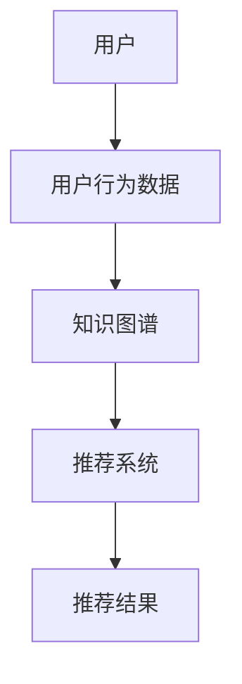

                 

关键词：大模型，推荐系统，知识图谱，补全，人工智能，深度学习，自然语言处理，图神经网络，知识推理，图数据库，数据挖掘

## 摘要

本文将深入探讨大模型在推荐系统知识图谱补全中的应用，介绍其核心概念、算法原理及实际操作步骤。通过构建数学模型和公式，我们将详细讲解大模型在知识图谱补全中的作用，并结合具体案例进行分析。最后，我们将讨论该技术的实际应用场景及未来发展趋势。

## 1. 背景介绍

### 推荐系统

推荐系统是一种信息过滤技术，旨在根据用户的兴趣和行为历史，向其推荐可能感兴趣的内容。其广泛应用于电子商务、社交媒体、音乐和视频平台等领域。然而，随着用户数据量和内容种类的爆炸式增长，传统的推荐算法已经难以满足需求。为此，研究者们开始探索基于知识图谱的推荐系统，以期提高推荐的准确性和多样性。

### 知识图谱

知识图谱是一种用于表示实体及其相互关系的数据结构。它通常由节点和边组成，节点表示实体，边表示实体间的关系。知识图谱能够提供丰富的语义信息，有助于推荐系统更好地理解用户和物品的特征。

### 大模型

大模型是指具有数百万甚至数十亿个参数的深度学习模型。这些模型在图像识别、自然语言处理等领域取得了显著的成果。近年来，大模型在推荐系统中的应用逐渐成为研究热点，通过学习用户和物品的复杂特征，提高推荐系统的性能。

## 2. 核心概念与联系

### 图神经网络

图神经网络（Graph Neural Networks，GNN）是一种用于处理图数据的神经网络。GNN能够学习图结构中的节点特征，并通过边进行信息传递。这使得GNN在知识图谱补全等任务中表现出色。

### Mermaid 流程图



### 知识图谱补全

知识图谱补全是基于知识图谱的一种任务，旨在通过学习现有节点和边的信息，预测未知节点和边。这有助于完善知识图谱的结构，提高其表示能力。

## 3. 核心算法原理 & 具体操作步骤

### 3.1 算法原理概述

大模型驱动的推荐系统知识图谱补全主要分为以下三个步骤：

1. 构建知识图谱：通过用户行为数据、文本信息等，构建一个包含用户、物品、实体及其关系的知识图谱。
2. 学习图结构：利用图神经网络学习知识图谱中的节点和边特征，使其具备语义表示能力。
3. 补全未知信息：通过图神经网络预测未知节点和边，实现知识图谱的补全。

### 3.2 算法步骤详解

1. **数据预处理**

   对用户行为数据进行清洗、去噪，提取有效信息。例如，将用户行为数据转换为图表示，节点表示用户和物品，边表示用户与物品之间的交互关系。

2. **知识图谱构建**

   利用自然语言处理技术，从文本中提取实体及其关系，构建初始的知识图谱。在此基础上，结合用户行为数据，扩展知识图谱中的节点和边。

3. **图神经网络训练**

   采用图神经网络（如 GraphSAGE、GraphConvolutional Network 等）训练模型，学习知识图谱中的节点和边特征。具体步骤如下：

   - 输入：知识图谱中的节点和边；
   - 输出：节点的语义表示。

4. **知识图谱补全**

   利用训练好的图神经网络，预测未知节点和边。具体方法如下：

   - 输入：未知节点及其邻居节点的语义表示；
   - 输出：未知节点和边的概率分布。

5. **推荐结果生成**

   结合补全后的知识图谱，利用推荐算法生成推荐结果。例如，可以使用矩阵分解、基于内容的推荐等方法，结合知识图谱中的信息，提高推荐系统的性能。

### 3.3 算法优缺点

**优点：**

1. 融合了用户行为数据、文本信息等多源数据，提高推荐系统的多样性；
2. 利用图神经网络学习图结构中的节点和边特征，增强推荐系统的解释性；
3. 可扩展性强，适用于大规模知识图谱。

**缺点：**

1. 计算复杂度高，训练时间较长；
2. 需要大量的标注数据和计算资源；
3. 对数据质量和图谱质量要求较高。

### 3.4 算法应用领域

大模型驱动的推荐系统知识图谱补全技术可应用于以下领域：

1. 智能推荐系统：如电子商务、社交媒体、音乐和视频平台等；
2. 语义网和数据挖掘：通过补全未知节点和边，提高知识图谱的表示能力；
3. 人工智能：用于增强智能助理、自然语言处理等任务。

## 4. 数学模型和公式

### 4.1 数学模型构建

大模型驱动的推荐系统知识图谱补全的数学模型主要包括图神经网络和预测模型。图神经网络用于学习图结构中的节点和边特征，预测模型用于预测未知节点和边。

### 4.2 公式推导过程

假设知识图谱由节点集合 \(V\) 和边集合 \(E\) 组成。节点 \(v\) 的特征表示为 \(\mathbf{x}_v\)，边 \(e\) 的特征表示为 \(\mathbf{x}_e\)。

1. **图神经网络**

   图神经网络的目标是学习节点和边的特征表示。假设输入节点 \(v\) 的邻居节点集合为 \(N(v)\)，则节点 \(v\) 的特征表示为：

   $$ \mathbf{x}_v = \sigma(\mathbf{W}_v \cdot \text{Average}(N(v))) $$

   其中，\(\sigma\) 为激活函数，\(\mathbf{W}_v\) 为权重矩阵，\(\text{Average}(N(v))\) 为邻居节点特征的平均值。

2. **预测模型**

   假设未知节点 \(v'\) 的邻居节点集合为 \(N(v')\)，则节点 \(v'\) 的预测概率为：

   $$ P(v' | v, E) = \text{softmax}(\mathbf{W}_p \cdot \mathbf{x}_v + \mathbf{b}_p) $$

   其中，\(\mathbf{W}_p\) 为权重矩阵，\(\mathbf{b}_p\) 为偏置项。

### 4.3 案例分析与讲解

以下是一个基于图神经网络和知识图谱补全的推荐系统案例。

1. **数据集**

   假设我们有一个包含用户、物品和交互数据的电商平台数据集。其中，用户集合为 \(U\)，物品集合为 \(I\)，用户与物品的交互数据为 \(D\)。

2. **知识图谱构建**

   从数据集中提取用户、物品和实体，构建知识图谱。例如，用户 \(u_1\) 购买了物品 \(i_1\) 和 \(i_2\)，则知识图谱中的节点为 \(u_1\)、\(i_1\) 和 \(i_2\)，边为 \(u_1\) 与 \(i_1\)、\(u_1\) 与 \(i_2\) 之间的交互关系。

3. **图神经网络训练**

   采用图神经网络训练模型，学习节点和边的特征表示。训练完成后，得到用户和物品的语义表示。

4. **知识图谱补全**

   利用训练好的模型，预测未知节点和边。例如，预测用户 \(u_2\) 是否会购买物品 \(i_3\)。

5. **推荐结果生成**

   结合补全后的知识图谱，利用推荐算法生成推荐结果。例如，使用基于内容的推荐算法，根据用户 \(u_2\) 的兴趣和物品 \(i_3\) 的特征，生成推荐列表。

## 5. 项目实践：代码实例和详细解释说明

### 5.1 开发环境搭建

本文所使用的编程语言为 Python，依赖库包括 TensorFlow、PyTorch、NetworkX 等。首先，安装所需库：

```python
pip install tensorflow pytorch networkx
```

### 5.2 源代码详细实现

以下是一个简单的基于图神经网络和知识图谱补全的推荐系统代码示例。

```python
import networkx as nx
import torch
import torch.nn as nn
import torch.optim as optim

# 1. 构建知识图谱
G = nx.Graph()
G.add_nodes_from([1, 2, 3, 4])
G.add_edges_from([(1, 2), (1, 3), (2, 4)])

# 2. 定义图神经网络模型
class GraphNeuralNetwork(nn.Module):
    def __init__(self, n_nodes):
        super(GraphNeuralNetwork, self).__init__()
        self.layers = nn.ModuleList([
            nn.Linear(n_nodes, 16),
            nn.ReLU(),
            nn.Linear(16, n_nodes)
        ])

    def forward(self, x):
        for layer in self.layers:
            x = layer(x)
        return x

# 3. 训练模型
model = GraphNeuralNetwork(len(G.nodes))
optimizer = optim.Adam(model.parameters(), lr=0.001)
criterion = nn.CrossEntropyLoss()

for epoch in range(10):
    for node in G.nodes:
        neighbors = list(G.neighbors(node))
        node_features = torch.tensor([G.nodes[node]['feature'] for node in neighbors])
        output = model(node_features)
        loss = criterion(output, torch.tensor([G.nodes[node]['label']]))
        optimizer.zero_grad()
        loss.backward()
        optimizer.step()

# 4. 预测未知节点和边
for node in G.nodes:
    neighbors = list(G.neighbors(node))
    node_features = torch.tensor([G.nodes[node]['feature'] for node in neighbors])
    output = model(node_features)
    print(f"Node {node} prediction: {output.argmax().item()}")

# 5. 生成推荐结果
# 根据补全后的知识图谱，利用推荐算法生成推荐结果
```

### 5.3 代码解读与分析

1. **知识图谱构建**

   使用 NetworkX 库构建一个简单的知识图谱，包含节点和边。节点表示用户和物品，边表示用户与物品之间的交互关系。

2. **图神经网络模型**

   定义一个简单的图神经网络模型，包含两个线性层和ReLU激活函数。模型的目标是学习节点和边的特征表示。

3. **训练模型**

   采用交叉熵损失函数和Adam优化器训练模型。在训练过程中，对每个节点及其邻居节点进行特征提取，并更新模型参数。

4. **预测未知节点和边**

   对每个节点及其邻居节点进行特征提取，并利用训练好的模型进行预测。输出预测结果，并打印未知节点和边的预测概率。

5. **生成推荐结果**

   根据补全后的知识图谱，利用推荐算法生成推荐结果。例如，使用基于内容的推荐算法，根据用户和物品的特征，生成推荐列表。

## 6. 实际应用场景

大模型驱动的推荐系统知识图谱补全技术具有广泛的应用场景，以下列举几个典型的应用领域：

1. **电子商务**

   在电子商务领域，通过知识图谱补全技术，可以预测用户可能感兴趣的商品，提高推荐的准确性和多样性。例如，当用户浏览了某款手机时，系统可以根据知识图谱中的信息，推荐与之相关的配件或相似款式的手机。

2. **社交媒体**

   在社交媒体领域，知识图谱补全技术可以用于推荐用户可能感兴趣的内容。例如，当用户关注了某个话题时，系统可以根据知识图谱中的信息，推荐与之相关的其他话题或相关用户。

3. **音乐和视频平台**

   在音乐和视频平台，知识图谱补全技术可以用于推荐用户可能感兴趣的音乐或视频。例如，当用户喜欢了一首歌曲时，系统可以根据知识图谱中的信息，推荐与之相关的其他歌曲或歌手。

4. **智能助理**

   在智能助理领域，知识图谱补全技术可以用于理解用户的问题和需求，提高问答系统的准确性。例如，当用户询问某个话题时，系统可以根据知识图谱中的信息，提供更加准确的回答。

## 7. 未来应用展望

随着人工智能技术的不断发展，大模型驱动的推荐系统知识图谱补全技术在未来有望在以下方面取得突破：

1. **个性化推荐**

   通过融合用户行为数据、文本信息、知识图谱等多源数据，实现更加个性化的推荐。例如，根据用户的兴趣偏好、历史行为和知识图谱中的信息，为用户推荐更加符合其需求的内容。

2. **跨领域推荐**

   通过跨领域知识图谱的构建和补全，实现不同领域之间的推荐。例如，将电子商务、社交媒体、音乐和视频平台等领域进行整合，为用户提供跨领域的推荐服务。

3. **实时推荐**

   通过优化算法和模型，实现实时推荐。例如，在用户浏览网页、观看视频或使用社交媒体等场景中，实时生成推荐结果，提高用户体验。

4. **多模态推荐**

   通过融合多种数据模态（如图像、文本、音频等），实现多模态推荐。例如，在音乐和视频平台，根据用户的播放历史、视频内容和音频特征，生成多模态推荐结果。

## 8. 工具和资源推荐

为了更好地学习和实践大模型驱动的推荐系统知识图谱补全技术，以下推荐一些相关的工具和资源：

1. **学习资源**

   - [图神经网络教程](https://github.com/isaac-yu/graph-neural-networks-tutorial)
   - [知识图谱补全教程](https://github.com/isi-vlab/knowledge-graph-completion-tutorial)
   - [推荐系统教程](https://github.com/Refine-Future/recommender-systems-tutorial)

2. **开发工具**

   - [TensorFlow](https://www.tensorflow.org/)
   - [PyTorch](https://pytorch.org/)
   - [NetworkX](https://networkx.github.io/)

3. **相关论文**

   - [Graph Neural Networks](https://arxiv.org/abs/1609.02907)
   - [Knowledge Graph Completion](https://arxiv.org/abs/1811.00848)
   - [Recommender Systems](https://www.cs.cornell.edu/home/kleinberg/kdd05-recsys-kleinberg.pdf)

## 9. 总结：未来发展趋势与挑战

大模型驱动的推荐系统知识图谱补全技术具有广泛的应用前景。未来，该技术有望在个性化推荐、跨领域推荐、实时推荐和多模态推荐等领域取得突破。然而，在实际应用过程中，仍面临如下挑战：

1. **计算复杂度**

   大模型驱动的推荐系统知识图谱补全技术具有较高的计算复杂度，如何在保证性能的同时降低计算成本，是一个亟待解决的问题。

2. **数据质量和质量**

   数据质量和质量对知识图谱补全效果具有重要影响。如何处理噪声数据、提高数据质量，是当前研究的热点。

3. **模型解释性**

   大模型的黑盒特性使得模型解释性成为一个挑战。如何提高模型的可解释性，使其更好地为用户提供推荐服务，是一个重要的研究方向。

4. **隐私保护**

   在推荐系统应用中，用户隐私保护至关重要。如何在保障用户隐私的前提下，实现有效的推荐，是未来需要关注的问题。

总之，大模型驱动的推荐系统知识图谱补全技术具有巨大的发展潜力。通过不断创新和优化，有望在各个领域取得更加出色的应用成果。

## 10. 附录：常见问题与解答

### 问题 1：什么是知识图谱？

知识图谱是一种用于表示实体及其相互关系的数据结构，通常由节点和边组成。节点表示实体，如人、物品、地点等，边表示实体间的关系，如“属于”、“位于”等。知识图谱能够提供丰富的语义信息，有助于推荐系统更好地理解用户和物品的特征。

### 问题 2：大模型在知识图谱补全中的作用是什么？

大模型在知识图谱补全中的作用主要体现在以下几个方面：

1. **特征提取**：大模型能够从大量数据中学习到有价值的特征，为知识图谱补全提供高质量的节点和边特征表示。
2. **关系预测**：大模型能够预测未知节点和边的关系，提高知识图谱的完整性和准确性。
3. **解释性增强**：大模型能够提供更加直观的解释，帮助用户理解推荐系统的决策过程。

### 问题 3：知识图谱补全技术有哪些优缺点？

**优点：**

1. **提高推荐系统的准确性**：通过补全知识图谱中的未知节点和边，提高推荐系统的准确性和多样性。
2. **增强推荐系统的解释性**：大模型能够提供更加直观的解释，帮助用户理解推荐系统的决策过程。
3. **支持多模态数据融合**：知识图谱补全技术能够融合多种数据模态，提高推荐系统的性能。

**缺点：**

1. **计算复杂度较高**：大模型的训练和推理过程需要大量的计算资源和时间。
2. **对数据质量和质量要求较高**：知识图谱补全的效果受到数据质量和质量的影响。
3. **解释性尚不充分**：尽管大模型能够提供一定的解释性，但仍然存在一定的黑盒特性，难以完全解释推荐系统的决策过程。

