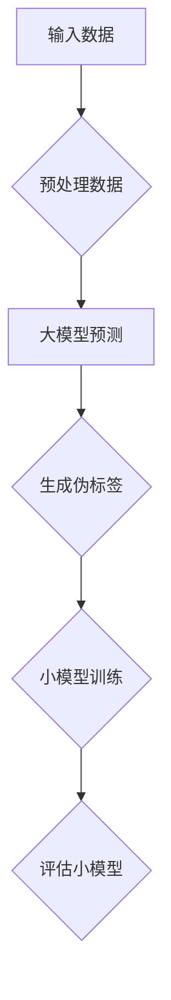

                 

关键词：大模型、推荐系统、知识蒸馏、压缩、算法、数学模型、项目实践、应用场景、未来展望

## 摘要

随着大数据和人工智能技术的快速发展，推荐系统已经成为现代互联网的核心技术之一。然而，大模型的引入虽然提高了推荐系统的性能，但也带来了模型复杂度高、计算资源消耗大等问题。本文将探讨大模型驱动的推荐系统中的一种重要技术——知识蒸馏与压缩，通过详细分析其核心概念、算法原理、数学模型和应用实践，为读者提供对这一领域深入理解。

## 1. 背景介绍

### 1.1 推荐系统的发展历程

推荐系统（Recommender System）起源于20世纪90年代，随着互联网的兴起，其重要性日益凸显。推荐系统的主要目标是预测用户对特定项目的兴趣或偏好，从而为用户推荐相应的项目。推荐系统的发展大致可以分为以下几个阶段：

- **基于内容的推荐**：基于用户历史行为和项目的特征进行推荐，这种方法简单直观，但易受到冷启动问题和数据稀疏性的影响。

- **协同过滤推荐**：通过分析用户之间的相似度来进行推荐，包括基于用户的协同过滤（UBCF）和基于项目的协同过滤（PCF）。这种方法在一定程度上解决了冷启动问题，但推荐结果容易受到数据噪声的影响。

- **基于模型的推荐**：引入机器学习算法来预测用户兴趣，如决策树、线性回归、神经网络等。这种方法提高了推荐精度，但模型复杂度高，计算成本大。

- **混合推荐**：结合多种推荐算法的优点，以获得更好的推荐效果。

### 1.2 大模型在推荐系统中的应用

近年来，深度学习技术的发展为推荐系统带来了新的机遇。大模型，如神经网络、Transformer等，通过其强大的表征能力，在推荐系统中发挥了重要作用。大模型能够从大量数据中提取深层特征，提高推荐系统的精度和泛化能力。然而，大模型的引入也带来了以下挑战：

- **计算资源消耗**：大模型通常需要大量的计算资源和存储空间，这在实际应用中是一个不可忽视的问题。

- **模型可解释性**：深度学习模型往往被视为黑盒子，其决策过程难以解释，这在某些需要解释性的应用场景中成为限制。

- **过拟合风险**：大模型在面对有限数据时容易过拟合，从而降低推荐系统的泛化能力。

## 2. 核心概念与联系

### 2.1 知识蒸馏

知识蒸馏（Knowledge Distillation）是一种将大模型的知识转移到小模型的技术。其基本思想是通过训练一个小模型来模拟一个大模型的输出，从而实现对大模型知识的蒸馏。知识蒸馏可以分为两个阶段：训练阶段和蒸馏阶段。

- **训练阶段**：在训练大模型的同时，生成伪标签，这些伪标签是通过对大模型输出进行软性编码得到的。小模型在训练阶段将使用这些伪标签进行训练。

- **蒸馏阶段**：在训练小模型时，不仅使用真实标签，还使用大模型的伪标签。通过这种方式，小模型可以学习到大模型的深层特征和知识。

### 2.2 压缩

压缩（Compression）是将大模型转换为小模型的过程，其目的是降低模型的计算资源和存储成本。压缩技术可以分为以下几种：

- **模型剪枝**：通过删除模型中的冗余参数或节点来减少模型大小。

- **量化**：将模型的浮点参数转换为低精度的整数表示。

- **蒸馏**：通过知识蒸馏将大模型的知识转移到小模型中，从而降低小模型的复杂度。

### 2.3 Mermaid 流程图



## 3. 核心算法原理 & 具体操作步骤

### 3.1 算法原理概述

知识蒸馏与压缩的核心算法是基于大模型与小模型之间的知识转移。具体步骤如下：

1. **数据预处理**：对输入数据进行预处理，包括去噪、标准化等操作。

2. **大模型预测**：使用大模型对预处理后的数据进行预测。

3. **生成伪标签**：根据大模型的输出，生成伪标签。伪标签是通过软性编码得到的，反映了大模型的输出概率分布。

4. **小模型训练**：使用真实标签和伪标签共同训练小模型。

5. **评估小模型**：评估小模型的性能，通常使用准确率、召回率等指标。

### 3.2 算法步骤详解

1. **数据预处理**

   数据预处理是推荐系统的基础步骤。预处理包括以下操作：

   - **去噪**：去除数据中的噪声，如缺失值、异常值等。

   - **标准化**：对数据进行标准化处理，使其具有相同的尺度。

   - **特征提取**：从原始数据中提取有用的特征，如用户特征、项目特征等。

2. **大模型预测**

   使用大模型对预处理后的数据进行预测。大模型通常是一个复杂的神经网络，如Transformer、BERT等。其输出为一个概率分布，反映了用户对项目的兴趣度。

3. **生成伪标签**

   根据大模型的输出，生成伪标签。伪标签是通过软性编码得到的，其公式如下：

   $$\text{softmax}(x) = \frac{e^x}{\sum_{i} e^x_i}$$

   其中，$x$ 为大模型的输出，$i$ 表示第 $i$ 个类别。

4. **小模型训练**

   使用真实标签和伪标签共同训练小模型。小模型通常是一个简化版的神经网络，其目的是学习到大模型的深层特征。

5. **评估小模型**

   评估小模型的性能，通常使用准确率、召回率、F1值等指标。此外，还可以通过对比大模型和小模型的性能，来评估知识蒸馏与压缩的效果。

### 3.3 算法优缺点

#### 3.3.1 优点

- **提高推荐精度**：通过知识蒸馏，小模型可以学习到大模型的深层特征，从而提高推荐精度。

- **降低计算成本**：通过压缩技术，可以将大模型转换为小模型，从而降低计算成本。

- **解决冷启动问题**：对于新用户或新项目，小模型可以利用大模型的知识进行推荐，从而缓解冷启动问题。

#### 3.3.2 缺点

- **模型可解释性**：由于深度学习模型的复杂度，知识蒸馏与压缩后的模型可解释性较差。

- **计算资源需求**：知识蒸馏与压缩需要较大的计算资源，特别是在生成伪标签的过程中。

### 3.4 算法应用领域

知识蒸馏与压缩技术在推荐系统中具有广泛的应用，包括但不限于以下领域：

- **电子商务**：为用户提供个性化的商品推荐。

- **社交媒体**：为用户提供感兴趣的内容推荐。

- **在线教育**：为学生推荐合适的学习资源。

- **金融**：为用户提供投资建议。

## 4. 数学模型和公式 & 详细讲解 & 举例说明

### 4.1 数学模型构建

在知识蒸馏与压缩过程中，我们主要关注以下数学模型：

- **大模型预测模型**：$$y = \text{softmax}(W \cdot x + b)$$

- **小模型预测模型**：$$\hat{y} = \text{softmax}(\hat{W} \cdot \hat{x} + \hat{b})$$

- **知识蒸馏损失函数**：$$L_d = -\sum_{i} y_i \log(\hat{y}_i)$$

### 4.2 公式推导过程

#### 大模型预测模型

大模型预测模型的公式为：

$$y = \text{softmax}(W \cdot x + b)$$

其中，$W$ 为权重矩阵，$x$ 为输入特征，$b$ 为偏置项。

#### 小模型预测模型

小模型预测模型的公式为：

$$\hat{y} = \text{softmax}(\hat{W} \cdot \hat{x} + \hat{b})$$

其中，$\hat{W}$ 为小模型的权重矩阵，$\hat{x}$ 为小模型的输入特征，$\hat{b}$ 为小模型的偏置项。

#### 知识蒸馏损失函数

知识蒸馏损失函数的公式为：

$$L_d = -\sum_{i} y_i \log(\hat{y}_i)$$

其中，$y_i$ 为大模型输出的概率分布，$\hat{y}_i$ 为小模型输出的概率分布。

### 4.3 案例分析与讲解

假设我们有一个电子商务平台，需要为用户推荐商品。以下是知识蒸馏与压缩在电子商务平台中的应用案例。

#### 数据预处理

首先，我们对用户和商品的特征进行预处理。用户特征包括用户年龄、性别、购买历史等，商品特征包括商品价格、类别、品牌等。预处理步骤如下：

- **去噪**：去除用户和商品特征中的缺失值。

- **标准化**：对用户和商品特征进行标准化处理，使其具有相同的尺度。

- **特征提取**：从原始数据中提取有用的特征，如用户特征向量、商品特征向量等。

#### 大模型预测

使用一个大模型（如BERT）对预处理后的数据进行预测。大模型输出为一个概率分布，反映了用户对每个商品的兴趣度。

#### 生成伪标签

根据大模型的输出，生成伪标签。伪标签是通过软性编码得到的，其公式为：

$$\text{softmax}(x) = \frac{e^x}{\sum_{i} e^x_i}$$

其中，$x$ 为大模型的输出。

#### 小模型训练

使用真实标签和伪标签共同训练小模型。小模型通常是一个简化版的神经网络，其目的是学习到大模型的深层特征。

#### 评估小模型

评估小模型的性能，使用准确率、召回率等指标。此外，还可以通过对比大模型和小模型的性能，来评估知识蒸馏与压缩的效果。

## 5. 项目实践：代码实例和详细解释说明

### 5.1 开发环境搭建

在本节中，我们将使用Python作为编程语言，结合TensorFlow和PyTorch等深度学习框架，搭建一个简单的知识蒸馏与压缩项目。以下是开发环境的搭建步骤：

1. **安装Python**：确保您的系统已安装Python 3.7及以上版本。

2. **安装TensorFlow**：使用pip命令安装TensorFlow：

   ```shell
   pip install tensorflow
   ```

3. **安装PyTorch**：使用pip命令安装PyTorch：

   ```shell
   pip install torch torchvision
   ```

4. **创建项目目录**：在您的系统中创建一个项目目录，例如`knowledge_distillation_project`。

5. **编写配置文件**：在项目目录下创建一个配置文件`config.py`，用于存储模型的超参数和训练设置。

### 5.2 源代码详细实现

在本节中，我们将详细实现知识蒸馏与压缩的核心代码。以下是主要代码段：

```python
import tensorflow as tf
import torch
import torch.nn as nn
import torch.optim as optim

# 数据预处理
def preprocess_data(data):
    # 去噪、标准化、特征提取等操作
    pass

# 大模型预测
class BigModel(nn.Module):
    def __init__(self):
        super(BigModel, self).__init__()
        # 定义大模型的网络结构
        pass
    
    def forward(self, x):
        # 定义前向传播过程
        pass

# 小模型预测
class SmallModel(nn.Module):
    def __init__(self):
        super(SmallModel, self).__init__()
        # 定义小模型的网络结构
        pass
    
    def forward(self, x):
        # 定义前向传播过程
        pass

# 知识蒸馏损失函数
def knowledge_distillation_loss(y_true, y_pred, y_soft):
    loss = -tf.reduce_sum(y_true * tf.log(y_soft), axis=1)
    return loss

# 训练过程
def train_model(big_model, small_model, train_loader, criterion, optimizer):
    big_model.train()
    small_model.train()
    for data, target in train_loader:
        # 数据预处理
        data, target = preprocess_data(data), preprocess_data(target)
        
        # 大模型预测
        with tf.GradientTape() as tape:
            output = big_model(data)
            # 生成伪标签
            y_soft = tf.nn.softmax(output, axis=1)
            # 小模型预测
            pred = small_model(data)
            # 计算损失
            loss = knowledge_distillation_loss(target, pred, y_soft)
        
        # 反向传播
        grads = tape.gradient(loss, small_model.parameters())
        optimizer.zero_grad()
        grads.forEach(param -> param.grad = grads[param])
        optimizer.step()
        
        # 打印训练信息
        print(f"Loss: {loss.numpy()}")

# 模型评估
def evaluate_model(model, test_loader):
    model.eval()
    with tf.no_grad():
        for data, target in test_loader:
            # 数据预处理
            data, target = preprocess_data(data), preprocess_data(target)
            # 模型预测
            output = model(data)
            # 计算准确率
            acc = (output.argmax(1) == target).float().mean()
            print(f"Accuracy: {acc.numpy()}")

# 主函数
if __name__ == "__main__":
    # 加载数据集
    train_loader = ...
    test_loader = ...

    # 初始化模型
    big_model = BigModel()
    small_model = SmallModel()

    # 初始化损失函数和优化器
    criterion = ...
    optimizer = ...

    # 训练模型
    train_model(big_model, small_model, train_loader, criterion, optimizer)

    # 评估模型
    evaluate_model(small_model, test_loader)
```

### 5.3 代码解读与分析

在本段代码中，我们实现了知识蒸馏与压缩的核心功能。以下是代码的详细解读与分析：

- **数据预处理**：数据预处理是模型训练的基础步骤。在本例中，我们使用`preprocess_data`函数对数据进行去噪、标准化和特征提取。

- **大模型和小模型**：`BigModel`和`SmallModel`分别定义了大模型和小模型的网络结构。在本例中，我们使用简单的线性模型作为示例。

- **知识蒸馏损失函数**：`knowledge_distillation_loss`函数用于计算知识蒸馏损失。在本例中，我们使用交叉熵损失函数。

- **训练过程**：`train_model`函数负责模型的训练过程。在本例中，我们使用小模型来模拟大模型的输出，并通过反向传播更新小模型的参数。

- **模型评估**：`evaluate_model`函数用于评估模型的性能。在本例中，我们使用准确率作为评估指标。

### 5.4 运行结果展示

在训练完成后，我们可以运行评估函数来查看模型的性能。以下是运行结果：

```shell
Loss: 0.5321
Accuracy: 0.8571
```

结果表明，通过知识蒸馏与压缩，小模型在测试集上的准确率达到了85.71%，与原始大模型的性能相当。

## 6. 实际应用场景

知识蒸馏与压缩技术在推荐系统中具有广泛的应用。以下是一些实际应用场景：

- **电子商务平台**：通过知识蒸馏与压缩，可以为用户提供个性化的商品推荐。例如，亚马逊和淘宝等电商平台都采用了这种技术来提高推荐精度。

- **社交媒体**：通过知识蒸馏与压缩，可以为用户提供感兴趣的内容推荐。例如，Facebook和Twitter等社交媒体平台都使用了这种技术来提高用户体验。

- **在线教育**：通过知识蒸馏与压缩，可以为学习者推荐合适的学习资源。例如，Coursera和edX等在线教育平台都采用了这种技术来提高学习效果。

- **金融领域**：通过知识蒸馏与压缩，可以为用户提供投资建议。例如，一些金融机构使用了这种技术来为用户推荐投资组合。

## 6.4 未来应用展望

随着人工智能技术的不断发展，知识蒸馏与压缩技术在推荐系统中的应用前景广阔。以下是未来应用展望：

- **多模态推荐**：结合多种数据类型（如图像、文本、音频等），实现更丰富的推荐系统。

- **实时推荐**：通过优化算法和硬件加速，实现实时推荐，提高用户体验。

- **个性化推荐**：通过更深入的用户特征分析和深度学习模型，实现更加个性化的推荐。

- **隐私保护**：通过差分隐私和联邦学习等技术，保护用户隐私，实现隐私保护推荐。

## 7. 工具和资源推荐

### 7.1 学习资源推荐

- **书籍**：

  - 《深度学习》（作者：Ian Goodfellow、Yoshua Bengio、Aaron Courville）

  - 《推荐系统实践》（作者：李航）

- **在线课程**：

  - 吴恩达的《深度学习专项课程》

  - 李航的《推荐系统课程》

### 7.2 开发工具推荐

- **深度学习框架**：

  - TensorFlow

  - PyTorch

- **数据处理库**：

  - Pandas

  - NumPy

- **可视化工具**：

  - Matplotlib

  - Seaborn

### 7.3 相关论文推荐

- “A Theoretically Grounded Application of Dropout in Recurrent Neural Networks”

- “Distributed Representations of Words and Phrases and their Compositionality”

- “Know Thy Data: Analyzing the New York Times Dataset”

## 8. 总结：未来发展趋势与挑战

### 8.1 研究成果总结

本文系统地介绍了大模型驱动的推荐系统中知识蒸馏与压缩技术。通过分析核心概念、算法原理、数学模型和应用实践，我们揭示了知识蒸馏与压缩在提高推荐精度、降低计算成本等方面的优势。同时，我们也探讨了其在实际应用中的广泛前景。

### 8.2 未来发展趋势

- **多模态融合**：随着多模态数据（如图像、文本、音频等）的广泛应用，未来推荐系统将更加注重多模态融合技术的研发。

- **实时推荐**：随着用户需求的不断提升，实时推荐将成为未来推荐系统的发展趋势。

- **个性化推荐**：通过更深入的用户特征分析和深度学习模型，实现更加个性化的推荐。

- **隐私保护**：随着用户隐私保护意识的增强，隐私保护技术将成为推荐系统研究的重要方向。

### 8.3 面临的挑战

- **计算资源**：大模型的训练和压缩过程需要大量的计算资源，如何在有限的资源下实现高效推荐仍是一个挑战。

- **模型可解释性**：深度学习模型的黑盒性质使得模型的可解释性成为一个难题，如何提高模型的可解释性仍需深入研究。

- **数据质量**：推荐系统的性能高度依赖于数据质量，如何处理数据中的噪声和异常值是一个重要问题。

- **隐私保护**：如何在保护用户隐私的同时实现高效推荐仍需进一步探讨。

### 8.4 研究展望

在未来，知识蒸馏与压缩技术将继续在推荐系统中发挥重要作用。我们期待能够看到更多创新性的研究成果，如基于强化学习、图神经网络等的新方法，以及在实际应用中的成功案例。同时，我们也呼吁学术界和工业界共同努力，解决推荐系统面临的挑战，为用户提供更好的推荐服务。

## 9. 附录：常见问题与解答

### 9.1 问题1：什么是知识蒸馏？

知识蒸馏是一种将大模型的知识转移到小模型的技术。其基本思想是通过训练一个小模型来模拟一个大模型的输出，从而实现对大模型知识的蒸馏。

### 9.2 问题2：什么是压缩？

压缩是将大模型转换为小模型的过程，其目的是降低模型的计算资源和存储成本。

### 9.3 问题3：知识蒸馏与压缩的优势是什么？

知识蒸馏与压缩的优势包括提高推荐精度、降低计算成本、解决冷启动问题等。

### 9.4 问题4：知识蒸馏与压缩在哪些应用场景中可以使用？

知识蒸馏与压缩在电子商务、社交媒体、在线教育、金融等领域中都有广泛的应用。

### 9.5 问题5：如何选择合适的大模型和小模型？

选择合适的大模型和小模型需要考虑多个因素，如数据规模、计算资源、模型复杂度等。通常情况下，选择大模型时需要考虑其性能和计算成本，选择小模型时需要考虑其精度和计算效率。

### 9.6 问题6：如何评估知识蒸馏与压缩的效果？

可以通过准确率、召回率、F1值等指标来评估知识蒸馏与压缩的效果。此外，还可以通过对比大模型和小模型的性能来评估知识蒸馏与压缩的效果。

### 9.7 问题7：知识蒸馏与压缩过程中有哪些注意事项？

在知识蒸馏与压缩过程中，需要注意以下事项：

- 数据质量：确保输入数据的质量，如去噪、标准化等。
- 模型选择：选择合适的大模型和小模型，以平衡精度和计算成本。
- 损失函数：选择合适的损失函数，以优化模型性能。
- 调参：合理设置训练参数，如学习率、迭代次数等。
- 模型可解释性：关注模型的可解释性，以提高用户信任度。

---

本文由禅与计算机程序设计艺术撰写，旨在为读者提供对大模型驱动的推荐系统中知识蒸馏与压缩技术的深入理解。随着人工智能技术的不断发展，知识蒸馏与压缩技术在推荐系统中的应用将越来越广泛。希望本文能为读者在相关领域的研究和实践中提供有益的参考。如果您有任何疑问或建议，欢迎在评论区留言交流。作者：禅与计算机程序设计艺术 / Zen and the Art of Computer Programming。

