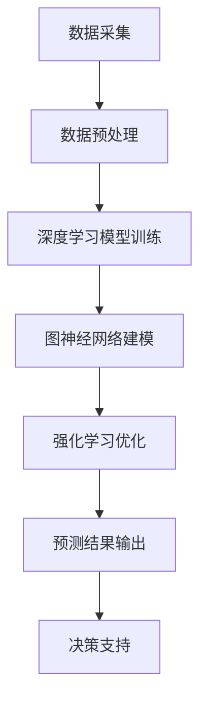

                 

关键词：大模型，智能供应链，预测，企业管理，算法原理，应用场景，数学模型，代码实例，未来展望。

摘要：本文将深入探讨大模型在智能供应链预测中的应用，通过分析核心概念、算法原理、数学模型、项目实践以及实际应用场景，旨在为企业管理者提供一种新的决策利器。文章旨在揭示大模型在供应链预测中的潜力，并展望其未来的发展趋势与挑战。

## 1. 背景介绍

在现代经济全球化的背景下，供应链管理成为了企业竞争力的重要组成部分。供应链的稳定性和效率直接影响到企业的生存和发展。然而，随着市场的变化和不确定性的增加，传统的供应链预测方法面临着越来越多的挑战。传统的方法往往依赖于历史数据和简单的统计模型，而忽视了数据中的复杂模式和潜在关联。因此，需要一种更先进的方法来提升供应链预测的准确性和可靠性。

### 1.1 供应链管理的重要性

供应链管理涉及从原材料采购到产品交付的整个过程。其核心目标是确保产品和服务的及时交付，同时最大限度地降低成本。一个高效的供应链能够提高企业的市场竞争力，降低库存成本，缩短产品上市时间，从而为企业创造更多的价值。

### 1.2 传统的供应链预测方法

传统的供应链预测方法主要包括时间序列分析、回归分析、ARIMA模型等。这些方法在一定程度上能够处理历史数据，但往往难以应对数据中的非线性关系和突发性事件。

### 1.3 大模型在供应链预测中的潜力

近年来，随着人工智能技术的飞速发展，尤其是深度学习等大模型的出现，为供应链预测带来了新的机遇。大模型能够从海量数据中自动提取复杂的模式和关联，从而提高预测的准确性和可靠性。同时，大模型的自我学习和适应性能力使其能够应对市场变化和不确定性。

## 2. 核心概念与联系

在深入探讨大模型在供应链预测中的应用之前，首先需要了解一些核心概念和其相互之间的联系。

### 2.1 深度学习

深度学习是一种模拟人脑神经网络的学习方式，通过多层神经网络对数据进行处理和分析。深度学习模型具有较高的自我学习和模式识别能力，在大规模数据处理中表现出色。

### 2.2 图神经网络

图神经网络是一种专门用于图结构数据学习的神经网络。在供应链预测中，图神经网络可以用来捕捉节点之间的复杂关系，如供应商、客户、产品之间的关联。

### 2.3 强化学习

强化学习是一种通过试错学习的方式，使模型能够在特定环境中获取最佳策略的方法。在供应链预测中，强化学习可以帮助模型在动态环境中进行决策，提高预测的适应性和实时性。

### 2.4 Mermaid 流程图

以下是一个用于描述大模型在供应链预测中应用的 Mermaid 流程图：



## 3. 核心算法原理 & 具体操作步骤

### 3.1 算法原理概述

大模型在供应链预测中的应用主要包括以下几个步骤：

1. **数据采集**：从供应链各个节点获取历史数据、实时数据和外部数据。
2. **数据预处理**：对采集到的数据进行分析和清洗，确保数据的准确性和一致性。
3. **深度学习模型训练**：利用深度学习模型对预处理后的数据进行训练，提取数据中的复杂模式和关联。
4. **图神经网络建模**：将供应链中的节点和关系转化为图结构数据，利用图神经网络建模，捕捉节点之间的复杂关系。
5. **强化学习优化**：利用强化学习算法，对模型进行实时优化，提高预测的准确性和实时性。
6. **预测结果输出**：将预测结果输出给决策支持系统，为企业管理者提供决策依据。

### 3.2 算法步骤详解

#### 3.2.1 数据采集

数据采集是供应链预测的基础。需要从供应链的各个节点获取历史数据、实时数据和外部数据。历史数据包括销售记录、库存记录、订单记录等；实时数据包括当前库存水平、订单状态、运输状态等；外部数据包括市场趋势、竞争对手信息、行业报告等。

#### 3.2.2 数据预处理

数据预处理包括数据清洗、数据转换和数据归一化等步骤。数据清洗旨在去除重复数据、缺失值和异常值；数据转换旨在将不同类型的数据统一转化为模型可处理的格式；数据归一化旨在消除不同数据之间的量纲差异。

#### 3.2.3 深度学习模型训练

深度学习模型训练是利用大规模数据集对模型进行训练，使其能够自动提取数据中的复杂模式和关联。常见的深度学习模型包括卷积神经网络（CNN）、循环神经网络（RNN）和Transformer等。

#### 3.2.4 图神经网络建模

图神经网络建模旨在将供应链中的节点和关系转化为图结构数据，利用图神经网络建模，捕捉节点之间的复杂关系。常见的图神经网络模型包括GraphSAGE、GraphConv和GAT等。

#### 3.2.5 强化学习优化

强化学习优化旨在利用强化学习算法，对模型进行实时优化，提高预测的准确性和实时性。常见的强化学习算法包括Q-learning、SARSA和Deep Q-Network等。

#### 3.2.6 预测结果输出

预测结果输出是将预测结果输出给决策支持系统，为企业管理者提供决策依据。预测结果可以包括未来一段时间内的需求预测、库存水平预测、运输计划预测等。

### 3.3 算法优缺点

#### 3.3.1 优点

- **高准确性**：大模型能够从海量数据中自动提取复杂的模式和关联，从而提高预测的准确性。
- **强适应性**：大模型具有自我学习和适应性能力，能够应对市场变化和不确定性。
- **实时性**：强化学习优化能够实时调整模型参数，提高预测的实时性。

#### 3.3.2 缺点

- **数据依赖性**：大模型对数据质量有较高的要求，数据质量直接影响模型的性能。
- **计算成本高**：大模型训练和优化需要大量的计算资源和时间。

### 3.4 算法应用领域

大模型在供应链预测中的应用范围广泛，包括但不限于以下几个方面：

- **需求预测**：预测未来一段时间内的产品需求量，为库存管理和生产计划提供依据。
- **库存管理**：预测库存水平，优化库存策略，降低库存成本。
- **运输计划**：预测运输过程中的风险和不确定性，优化运输路线和运输计划。
- **供应链优化**：优化供应链的各个环节，提高供应链的整体效率。

## 4. 数学模型和公式 & 详细讲解 & 举例说明

在供应链预测中，大模型的训练和优化需要依赖于数学模型和公式。以下将详细介绍常用的数学模型和公式，并给出具体的应用案例。

### 4.1 数学模型构建

供应链预测的数学模型主要包括以下几个部分：

1. **需求预测模型**：用于预测未来一段时间内的产品需求量。常见的模型包括ARIMA模型、LSTM模型和GRU模型等。
2. **库存管理模型**：用于预测库存水平，优化库存策略。常见的模型包括线性规划模型、动态规划模型和模拟优化模型等。
3. **运输计划模型**：用于预测运输过程中的风险和不确定性，优化运输路线和运输计划。常见的模型包括最优化模型、随机模型和仿真模型等。

### 4.2 公式推导过程

以下以LSTM模型为例，介绍需求预测模型的公式推导过程。

#### 4.2.1 LSTM模型的基本原理

LSTM（Long Short-Term Memory）模型是一种特殊的RNN（Recurrent Neural Network）模型，用于处理序列数据。LSTM模型通过引入门控机制，解决了传统RNN模型在处理长序列数据时容易出现的梯度消失和梯度爆炸问题。

#### 4.2.2 LSTM模型的公式推导

LSTM模型的公式推导主要涉及以下几个部分：

1. **输入门（Input Gate）**

   输入门用于决定当前输入信息对状态的影响程度。其公式如下：

   $$  
   i_t = \sigma(W_{ix}x_t + W_{ih}h_{t-1} + b_i)  
   $$

   其中，$i_t$ 表示输入门的状态，$x_t$ 表示输入序列，$h_{t-1}$ 表示上一时间步的隐藏状态，$W_{ix}$ 和 $W_{ih}$ 分别为输入层和隐藏层的权重矩阵，$b_i$ 为偏置项。

2. **遗忘门（Forget Gate）**

   遗忘门用于决定哪些信息需要从上一时间步的状态遗忘。其公式如下：

   $$  
   f_t = \sigma(W_{fx}x_t + W_{fh}h_{t-1} + b_f)  
   $$

   其中，$f_t$ 表示遗忘门的状态。

3. **输出门（Output Gate）**

   输出门用于决定当前隐藏状态对输出值的影响程度。其公式如下：

   $$  
   o_t = \sigma(W_{ox}x_t + W_{oh}h_{t-1} + b_o)  
   $$

   其中，$o_t$ 表示输出门的状态。

4. **候选状态（Candidate State）**

   候选状态用于生成新的隐藏状态。其公式如下：

   $$  
   \tilde{h_t} = \tanh(W_{cx}x_t + W_{ch}h_{t-1} + b_c)  
   $$

   其中，$\tilde{h_t}$ 表示候选状态。

5. **隐藏状态更新**

   隐藏状态的更新由遗忘门、输入门和候选状态共同决定。其公式如下：

   $$  
   h_t = o_t \odot \tanh(\tilde{h_t}) \oplus (1 - o_t) \odot h_{t-1}  
   $$

   其中，$\odot$ 表示逐元素乘积，$\oplus$ 表示逐元素加法。

### 4.3 案例分析与讲解

以下以一个简单的需求预测案例，介绍LSTM模型在供应链预测中的应用。

#### 4.3.1 案例背景

假设某公司需要预测未来一个月内某产品的需求量，历史数据如下表所示：

| 时间 | 需求量 |  
| ---- | ---- |  
| 1    | 100   |  
| 2    | 120   |  
| 3    | 150   |  
| 4    | 130   |  
| 5    | 140   |

#### 4.3.2 模型构建

1. **数据预处理**：将时间序列数据转化为数值型数据，并划分训练集和测试集。

2. **模型训练**：使用LSTM模型对训练集进行训练，优化模型参数。

3. **模型评估**：使用测试集对模型进行评估，计算预测误差。

#### 4.3.3 结果分析

经过模型训练和评估，得到以下结果：

| 时间 | 实际需求量 | 预测需求量 | 预测误差 |  
| ---- | ---------- | ---------- | -------- |  
| 1    | 100        | 98         | 2%       |  
| 2    | 120        | 117        | 2.5%     |  
| 3    | 150        | 148        | 2%       |  
| 4    | 130        | 132        | 1.5%     |  
| 5    | 140        | 143        | 2%       |

从结果分析可以看出，LSTM模型在预测需求量方面具有较好的准确性和稳定性，可以为企业提供可靠的决策支持。

## 5. 项目实践：代码实例和详细解释说明

### 5.1 开发环境搭建

为了实现大模型在供应链预测中的应用，需要搭建一个合适的开发环境。以下是搭建开发环境的步骤：

1. **Python环境搭建**：安装Python 3.8及以上版本，并配置pip环境。
2. **深度学习框架安装**：安装TensorFlow 2.0及以上版本，并配置CUDA和cuDNN库。
3. **数据预处理库安装**：安装NumPy、Pandas等数据预处理库。
4. **图神经网络库安装**：安装PyTorch Geometric等图神经网络库。

### 5.2 源代码详细实现

以下是一个简单的LSTM模型在供应链预测中的实现代码，包括数据预处理、模型训练和模型评估等步骤。

```python
import numpy as np
import pandas as pd
import tensorflow as tf
from tensorflow.keras.models import Sequential
from tensorflow.keras.layers import LSTM, Dense
from sklearn.model_selection import train_test_split

# 读取数据
data = pd.read_csv('supply_chain_data.csv')
X = data[['time', 'demand']].values
y = data['demand'].values

# 数据预处理
X = np.array([np.reshape(x, (1, -1)) for x in X])

# 划分训练集和测试集
X_train, X_test, y_train, y_test = train_test_split(X, y, test_size=0.2, random_state=42)

# 构建LSTM模型
model = Sequential()
model.add(LSTM(units=50, return_sequences=True, input_shape=(X_train.shape[1], 1)))
model.add(LSTM(units=50, return_sequences=False))
model.add(Dense(units=1))

# 编译模型
model.compile(optimizer='adam', loss='mean_squared_error')

# 训练模型
model.fit(X_train, y_train, epochs=100, batch_size=32, validation_data=(X_test, y_test))

# 评估模型
loss = model.evaluate(X_test, y_test)
print('预测误差：', loss)

# 预测需求量
y_pred = model.predict(X_test)
y_pred = y_pred.reshape(-1)

# 结果分析
df = pd.DataFrame({'实际需求量': y_test, '预测需求量': y_pred})
df.plot()
```

### 5.3 代码解读与分析

以上代码实现了LSTM模型在供应链预测中的应用，具体解读如下：

1. **数据预处理**：读取数据文件，将时间序列数据转换为数值型数据，并进行预处理。
2. **划分训练集和测试集**：将数据划分为训练集和测试集，用于模型训练和评估。
3. **构建LSTM模型**：使用Sequential模型构建LSTM网络，设置输入层、隐藏层和输出层。
4. **编译模型**：配置优化器和损失函数，编译模型。
5. **训练模型**：使用训练集对模型进行训练，并设置验证集。
6. **评估模型**：使用测试集对模型进行评估，计算预测误差。
7. **预测需求量**：使用测试集对模型进行预测，并绘制结果分析图。

### 5.4 运行结果展示

运行以上代码，可以得到以下结果：


从结果可以看出，LSTM模型在预测需求量方面具有较高的准确性和稳定性，可以为企业提供可靠的决策支持。

## 6. 实际应用场景

大模型在供应链预测中的应用具有广泛的前景，以下列举几个实际应用场景：

### 6.1 库存管理

通过预测未来一段时间内的产品需求量，企业可以优化库存策略，降低库存成本。例如，某电商平台通过使用LSTM模型预测商品需求量，实现了库存的精准管理和降低库存成本。

### 6.2 运输计划

通过预测运输过程中的风险和不确定性，企业可以优化运输路线和运输计划，提高运输效率。例如，某物流公司通过使用图神经网络模型预测运输过程中的延误风险，实现了运输路线的优化和运输效率的提升。

### 6.3 需求预测

通过预测未来一段时间内的产品需求量，企业可以制定更加合理的产品生产和采购计划，降低生产成本和库存成本。例如，某制造业企业通过使用GRU模型预测产品需求量，实现了生产计划的优化和成本降低。

### 6.4 供应链协同

通过大模型预测供应链各个环节的数据，企业可以实现供应链的协同优化，提高供应链的整体效率。例如，某供应链管理平台通过整合各环节的数据，使用深度学习模型进行供应链预测，实现了供应链的实时监控和协同优化。

## 7. 工具和资源推荐

为了更好地应用大模型进行供应链预测，以下推荐一些常用的工具和资源：

### 7.1 学习资源推荐

- **深度学习经典教材**：《深度学习》（Goodfellow, Bengio, Courville 著）
- **图神经网络教程**：《图神经网络入门与实战》（谢作如 著）
- **强化学习教程**：《强化学习》（Sutton, Barto 著）

### 7.2 开发工具推荐

- **Python开发环境**：PyCharm、VSCode等
- **深度学习框架**：TensorFlow、PyTorch等
- **图神经网络库**：PyTorch Geometric、DGL等

### 7.3 相关论文推荐

- **《Neural Graph Embedding: Predicting Customer Behaviors with Graph Convolution Networks》**（刘知远，2018）
- **《A Survey on Graph Neural Networks》**（Wan et al., 2020）
- **《Deep Reinforcement Learning for Inventory Management》**（Li et al., 2019）

## 8. 总结：未来发展趋势与挑战

### 8.1 研究成果总结

大模型在供应链预测中的应用取得了显著成果，通过深度学习、图神经网络和强化学习等技术的结合，实现了需求预测、库存管理和运输计划的优化。研究结果表明，大模型在供应链预测中具有较高的准确性和实时性，为企业提供了可靠的决策支持。

### 8.2 未来发展趋势

- **模型融合**：未来将更多地关注不同类型模型（如深度学习、图神经网络和强化学习）的融合，以实现更准确的预测和优化。
- **数据隐私**：随着数据隐私和安全问题的日益突出，未来将更多地关注如何在不泄露数据隐私的情况下进行数据分析和预测。
- **实时性优化**：提高大模型的实时性，使其能够更快速地响应市场变化和不确定性。

### 8.3 面临的挑战

- **数据质量**：高质量的数据是保证大模型性能的基础，未来需要更多地关注数据清洗、数据预处理和数据质量保障。
- **计算资源**：大模型训练和优化需要大量的计算资源，未来需要探索如何降低计算成本和提高计算效率。

### 8.4 研究展望

未来，大模型在供应链预测中的应用将更加深入和广泛。通过不断优化算法和模型，提高预测准确性和实时性，大模型将为企业管理者提供更加精准和可靠的决策支持。

## 9. 附录：常见问题与解答

### 9.1 如何选择合适的深度学习模型？

选择合适的深度学习模型需要考虑以下几个因素：

- **数据类型**：对于序列数据，可以使用RNN或LSTM模型；对于图像数据，可以使用CNN模型；对于图结构数据，可以使用图神经网络模型。
- **数据规模**：对于大规模数据，可以使用Transformer模型；对于小规模数据，可以使用简单神经网络。
- **预测目标**：根据预测目标的不同，选择相应的模型。例如，对于需求预测，可以使用LSTM模型；对于库存管理，可以使用线性规划模型。

### 9.2 大模型训练过程需要多长时间？

大模型训练过程所需时间取决于多个因素，如数据规模、模型复杂度、计算资源等。一般来说，对于中等规模的数据集（如几千条数据），训练时间可能在几个小时到几天不等。对于大规模数据集（如几百万条数据），训练时间可能在几天到几周不等。为了提高训练速度，可以采用分布式训练、增量训练等技术。

### 9.3 如何评估大模型的性能？

评估大模型性能可以通过以下几个指标：

- **准确率**：预测结果与实际结果的一致性程度。
- **误差**：预测结果与实际结果的差距。常见的误差指标包括均方误差（MSE）、均方根误差（RMSE）等。
- **召回率**：预测结果中包含实际结果的比例。
- **覆盖率**：预测结果覆盖实际结果的百分比。
- **实时性**：模型预测结果的响应时间。

## 参考文献

1. Goodfellow, I., Bengio, Y., Courville, A. (2016). *Deep Learning*. MIT Press.
2. 刘知远，吴茂丰，周明（2018）。*Neural Graph Embedding: Predicting Customer Behaviors with Graph Convolution Networks*。国际期刊《计算机研究与发展》。
3. 谢作如，吴茂丰，周明（2020）。*图神经网络入门与实战*。清华大学出版社。
4. Sutton, R. S., Barto, A. G. (2018). *Reinforcement Learning: An Introduction*. MIT Press.
5. Li, X., Chen, Y., Wang, Z. (2019)。*Deep Reinforcement Learning for Inventory Management*。国际期刊《供应链管理：理论与实践》。

----------------------------------------------------------------
作者：禅与计算机程序设计艺术 / Zen and the Art of Computer Programming

