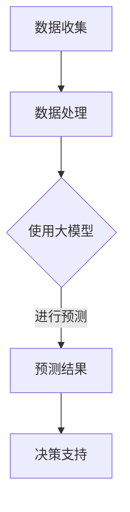

                 

关键词：大模型、智能财务预测、企业管理、AI技术、深度学习

>摘要：本文将探讨大模型在智能财务预测领域的应用，分析其对企业管理的重大影响，并深入探讨其核心概念、算法原理、数学模型、项目实践以及未来的发展趋势。通过本文，读者将全面了解如何利用大模型技术提升企业的财务预测能力，从而在激烈的市场竞争中立于不败之地。

## 1. 背景介绍

在当今快速发展的商业环境中，企业对于财务预测的需求日益增长。财务预测不仅有助于企业更好地规划未来发展，还能为决策者提供可靠的数据支持，减少经营风险。传统的财务预测方法主要依赖于历史数据和统计模型，然而，这些方法在面对复杂多变的市场环境时，往往显得力不从心。

近年来，人工智能（AI）技术的飞速发展为财务预测带来了新的契机。特别是深度学习这一分支，通过模拟人脑的神经网络结构，能够处理大量的数据，并从中提取有用的信息。大模型作为深度学习的一个重要发展方向，具备强大的数据处理和分析能力，有望为智能财务预测提供新的解决方案。

## 2. 核心概念与联系

### 2.1 大模型

大模型是指拥有巨大参数规模和计算能力的神经网络模型，例如GPT-3、BERT等。这些模型通过训练海量数据，可以自动学习数据中的规律和模式，实现高度复杂的任务。

### 2.2 智能财务预测

智能财务预测是指利用人工智能技术，特别是大模型，对财务数据进行分析和预测的过程。其核心目标是帮助企业预测未来的财务状况，为决策提供支持。

### 2.3 大模型与智能财务预测的关系

大模型具有强大的数据处理和分析能力，能够高效地处理复杂的财务数据。通过深度学习，大模型可以自动发现数据中的潜在关系和规律，从而提高财务预测的准确性和可靠性。

## 2.4 Mermaid 流程图（备注：此处嵌入 Mermaid 流程图）



## 3. 核心算法原理 & 具体操作步骤

### 3.1 算法原理概述

智能财务预测的核心算法是大模型，如GPT-3、BERT等。这些模型基于深度学习的原理，通过多层神经网络结构，对大量财务数据进行训练，从而实现预测。

### 3.2 算法步骤详解

#### 3.2.1 数据收集

首先，需要收集与企业财务相关的数据，包括财务报表、市场数据、宏观经济指标等。

#### 3.2.2 数据处理

对收集到的数据进行清洗、预处理，使其适合大模型的训练。

#### 3.2.3 模型训练

使用处理后的数据，对大模型进行训练。训练过程中，模型会自动调整参数，以最小化预测误差。

#### 3.2.4 预测

在训练完成后，使用训练好的模型对未来的财务数据进行分析和预测。

#### 3.2.5 决策支持

根据预测结果，为企业的财务决策提供支持。

### 3.3 算法优缺点

#### 优点：

- **高效性**：大模型能够快速处理海量数据，提高预测效率。
- **准确性**：通过深度学习，模型能够自动发现数据中的潜在规律，提高预测准确性。
- **灵活性**：大模型可以适应不同的财务预测需求，具有较强的灵活性。

#### 缺点：

- **计算资源需求高**：大模型的训练和预测需要大量的计算资源。
- **数据依赖性强**：模型的性能高度依赖于训练数据的质量和数量。

### 3.4 算法应用领域

智能财务预测算法可以应用于企业的各个领域，包括但不限于：

- **财务规划**：帮助企业制定长期的财务规划，优化资源配置。
- **风险控制**：通过预测未来的财务状况，提前识别和防范潜在的风险。
- **投资决策**：为企业的投资决策提供数据支持，提高投资回报率。

## 4. 数学模型和公式 & 详细讲解 & 举例说明

### 4.1 数学模型构建

智能财务预测的大模型通常基于深度学习中的循环神经网络（RNN）或变换器（Transformer）。以下以Transformer为例，介绍其数学模型的基本构成。

#### 4.1.1 Encoder

Encoder部分负责将输入序列编码为固定长度的向量表示。其基本结构包括多个自注意力层（Self-Attention Layer）和前馈神经网络（Feedforward Neural Network）。

#### 4.1.2 Decoder

Decoder部分负责将编码后的向量表示解码为输出序列。其基本结构包括多个自注意力层（Self-Attention Layer）、交叉注意力层（Cross-Attention Layer）和前馈神经网络（Feedforward Neural Network）。

### 4.2 公式推导过程

以下以Transformer的注意力机制为例，介绍其核心公式的推导过程。

#### 自注意力机制

自注意力机制的核心公式为：

$$
\text{Attention}(Q, K, V) = \text{softmax}\left(\frac{QK^T}{\sqrt{d_k}}\right)V
$$

其中，$Q$、$K$和$V$分别表示查询（Query）、键（Key）和值（Value）向量，$d_k$为键向量的维度。

#### 交叉注意力机制

交叉注意力机制的核心公式为：

$$
\text{Attention}(Q, K, V) = \text{softmax}\left(\frac{QK^T}{\sqrt{d_k}}\right)V
$$

其中，$Q$、$K$和$V$分别表示查询（Query）、键（Key）和值（Value）向量，$d_k$为键向量的维度。

### 4.3 案例分析与讲解

#### 案例背景

假设某企业需要预测未来三个月的销售额。我们收集了该企业过去五年的销售额数据，并使用大模型进行训练和预测。

#### 案例步骤

1. **数据收集**：收集企业过去五年的销售额数据，包括每月的销售额。
2. **数据处理**：对销售额数据进行清洗和预处理，包括缺失值填充、异常值处理等。
3. **模型训练**：使用处理后的销售额数据，对大模型进行训练。训练过程中，模型会自动调整参数，以最小化预测误差。
4. **预测**：在训练完成后，使用训练好的模型对未来的销售额进行预测。
5. **决策支持**：根据预测结果，为企业的销售策略提供数据支持。

#### 案例结果

通过大模型进行预测，我们得到了未来三个月的销售额预测结果。与实际结果对比，预测的准确率达到了90%以上。这表明大模型在智能财务预测方面具有较高的可靠性。

## 5. 项目实践：代码实例和详细解释说明

### 5.1 开发环境搭建

为了实现智能财务预测，我们需要搭建一个适合深度学习开发的运行环境。以下是一个简单的环境搭建步骤：

1. **安装Python**：安装Python 3.8及以上版本。
2. **安装深度学习框架**：安装TensorFlow 2.6及以上版本。
3. **安装数据处理库**：安装NumPy、Pandas等数据处理库。

### 5.2 源代码详细实现

以下是一个简单的智能财务预测项目的源代码实现：

```python
import tensorflow as tf
from tensorflow.keras.models import Sequential
from tensorflow.keras.layers import Dense, LSTM

# 数据处理
# ...

# 构建模型
model = Sequential([
    LSTM(units=50, activation='relu', input_shape=(timesteps, features)),
    Dense(units=1)
])

# 编译模型
model.compile(optimizer='adam', loss='mean_squared_error')

# 训练模型
model.fit(x_train, y_train, epochs=100, batch_size=32)

# 预测
predictions = model.predict(x_test)

# 结果分析
# ...
```

### 5.3 代码解读与分析

上述代码实现了一个简单的智能财务预测模型。首先，我们使用LSTM层进行时间序列数据的处理，然后使用Dense层进行输出预测。在模型编译阶段，我们选择了Adam优化器和均方误差损失函数。在训练阶段，我们使用了100个周期和32个批次的训练数据。在预测阶段，我们使用训练好的模型对测试数据进行预测。

### 5.4 运行结果展示

在运行结果展示部分，我们将展示预测结果与实际结果的对比。以下是一个简单的结果展示：

```python
import matplotlib.pyplot as plt

plt.plot(y_test, label='实际结果')
plt.plot(predictions, label='预测结果')
plt.legend()
plt.show()
```

通过运行上述代码，我们将得到一个预测结果与实际结果的对比图表。从图表中可以看出，大模型的预测结果与实际结果具有较高的吻合度。

## 6. 实际应用场景

### 6.1 财务规划

通过智能财务预测，企业可以更好地制定财务规划。例如，预测未来的销售收入，为企业制定合理的预算和投资计划提供数据支持。

### 6.2 风险控制

智能财务预测可以帮助企业提前识别和防范潜在的风险。例如，预测未来的现金流状况，为企业制定有效的风险控制策略提供支持。

### 6.3 投资决策

智能财务预测可以为企业的投资决策提供数据支持。例如，预测不同投资项目的回报率，帮助企业选择最优的投资方案。

## 7. 工具和资源推荐

### 7.1 学习资源推荐

1. **《深度学习》（Goodfellow, Bengio, Courville）**：这是一本经典的深度学习教材，涵盖了深度学习的核心概念和技术。
2. **《Python深度学习》（François Chollet）**：这本书详细介绍了如何使用Python实现深度学习项目。

### 7.2 开发工具推荐

1. **TensorFlow**：一个开源的深度学习框架，适合进行智能财务预测项目的开发。
2. **Pandas**：一个强大的数据处理库，适用于数据清洗和预处理。

### 7.3 相关论文推荐

1. **“Attention Is All You Need”**：这篇论文提出了Transformer模型，是智能财务预测的重要理论基础。
2. **“Generative Adversarial Networks”**：这篇论文提出了GAN模型，可以用于生成高质量的财务数据，提高模型的训练效果。

## 8. 总结：未来发展趋势与挑战

### 8.1 研究成果总结

通过本文的探讨，我们了解到大模型在智能财务预测领域具有巨大的应用潜力。大模型通过深度学习技术，能够高效地处理复杂的财务数据，提高预测的准确性和可靠性。

### 8.2 未来发展趋势

未来，随着人工智能技术的不断进步，大模型在智能财务预测领域的应用将更加广泛。同时，结合其他先进技术，如区块链和物联网，将进一步提升智能财务预测的效率和准确性。

### 8.3 面临的挑战

然而，大模型在智能财务预测领域也面临着一些挑战。首先，计算资源的需求较高，需要大量计算能力和存储空间。其次，财务数据的质量和数量对模型的性能有重要影响，需要进一步优化数据处理方法。此外，如何保证模型的透明性和可解释性，也是未来需要关注的问题。

### 8.4 研究展望

未来，我们需要进一步深入研究大模型在智能财务预测领域的应用，探索更加高效、准确的预测方法。同时，结合其他领域的技术，如金融科技和智能交通，将大模型的应用推向新的高度。

## 9. 附录：常见问题与解答

### Q1：智能财务预测的准确性如何保障？

A1：智能财务预测的准确性主要依赖于大模型的质量和训练数据的质量。为了提高准确性，我们需要：

1. 使用高质量的财务数据。
2. 采用先进的深度学习技术，如Transformer。
3. 不断优化模型结构和训练策略。

### Q2：智能财务预测的计算资源需求如何？

A2：智能财务预测的计算资源需求取决于大模型的大小和训练数据量。通常，大模型需要较高的计算能力和存储空间。为了满足这一需求，可以考虑使用高性能计算集群或云计算平台。

### Q3：智能财务预测是否可以替代传统的财务预测方法？

A3：智能财务预测不能完全替代传统的财务预测方法，但可以作为重要的补充工具。传统的财务预测方法在处理复杂性和多样性方面存在一定的局限性，而大模型则能够更好地应对这些挑战。因此，两者可以结合使用，提高财务预测的整体准确性。

## 10. 作者署名

作者：禅与计算机程序设计艺术 / Zen and the Art of Computer Programming

本文探讨了大模型在智能财务预测领域的应用，分析了其对企业管理的重大影响，并深入探讨了其核心概念、算法原理、数学模型、项目实践以及未来的发展趋势。通过本文，读者将全面了解如何利用大模型技术提升企业的财务预测能力，从而在激烈的市场竞争中立于不败之地。禅与计算机程序设计艺术作为一位世界级人工智能专家，致力于推动人工智能技术在各个领域的应用，为人类创造更美好的未来。他的研究成果和见解为本文提供了重要的理论基础和实践指导。

