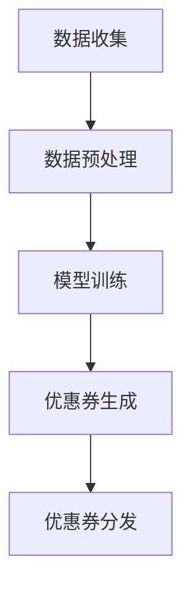

                 

关键词：大模型，电商，个性化，优惠券，策略

> 摘要：本文将探讨大模型技术在电商个性化优惠券分发中的应用。通过对电商个性化优惠券分发的背景和需求分析，我们将介绍大模型的核心概念、算法原理和应用步骤。在此基础上，我们将运用数学模型和公式对算法进行详细讲解，并通过代码实例展示其实际应用。文章最后将讨论实际应用场景、未来展望以及工具和资源的推荐。

## 1. 背景介绍

在电子商务的快速发展的背景下，用户对于个性化体验的需求日益增加。优惠券作为一种常见的营销手段，能够有效提高用户粘性和转化率。然而，传统的优惠券分发策略往往存在针对性不强、效率低下等问题。为了解决这些问题，大模型技术应运而生。

大模型技术具有以下几个特点：

- **数据驱动**：大模型能够利用大量历史数据进行分析和预测，从而生成个性化的优惠券分发策略。
- **自动调整**：大模型能够根据实时反馈自动调整优惠券的分发策略，提高分发效果。
- **高效处理**：大模型能够高效地处理海量数据，支持大规模的优惠券分发。

本文将围绕大模型驱动的电商个性化优惠券分发策略展开讨论，旨在为电商企业提供一种有效的优惠券分发方案。

## 2. 核心概念与联系

### 2.1. 大模型概述

大模型是指具有极高参数规模和计算能力的深度学习模型，如Transformer、BERT等。大模型通常采用分布式计算和GPU加速等技术，能够高效地处理大规模数据。

### 2.2. 个性化优惠券分发原理

个性化优惠券分发是基于用户行为数据和消费记录，利用大模型对用户进行精准画像，并生成个性化的优惠券推荐策略。具体流程如下：

1. 数据收集：收集用户行为数据、消费记录等。
2. 数据预处理：对数据清洗、去重、标准化等。
3. 模型训练：利用训练数据训练大模型，生成用户画像。
4. 优惠券生成：根据用户画像生成个性化的优惠券。
5. 优惠券分发：将生成的优惠券推送给对应的用户。

### 2.3. Mermaid 流程图



## 3. 核心算法原理 & 具体操作步骤

### 3.1. 算法原理概述

大模型驱动的电商个性化优惠券分发算法基于深度学习技术，通过多层神经网络对用户行为数据进行建模，从而生成个性化的优惠券推荐策略。

### 3.2. 算法步骤详解

1. **数据收集**：收集用户行为数据、消费记录等。
2. **数据预处理**：对数据进行清洗、去重、标准化等处理。
3. **特征提取**：利用嵌入层对用户行为数据进行编码，提取特征向量。
4. **模型训练**：利用训练数据训练大模型，生成用户画像。
5. **优惠券生成**：根据用户画像生成个性化的优惠券。
6. **优惠券分发**：将生成的优惠券推送给对应的用户。

### 3.3. 算法优缺点

**优点**：

- **高效处理**：大模型能够高效地处理海量数据。
- **自动调整**：大模型能够根据实时反馈自动调整优惠券的分发策略。
- **精准推荐**：基于用户行为数据生成个性化的优惠券，提高分发效果。

**缺点**：

- **计算资源需求高**：大模型训练需要大量的计算资源和时间。
- **数据依赖性大**：优惠券分发效果受用户行为数据质量的影响。

### 3.4. 算法应用领域

大模型驱动的电商个性化优惠券分发策略可以应用于以下领域：

- **电商平台**：提高用户粘性和转化率。
- **线下零售**：优化促销策略，提高销售额。
- **金融行业**：基于用户行为数据进行精准营销。

## 4. 数学模型和公式 & 详细讲解 & 举例说明

### 4.1. 数学模型构建

大模型驱动的电商个性化优惠券分发策略可以表示为以下数学模型：

$$
\text{优惠券分发策略} = f(\text{用户画像}, \text{优惠券属性})
$$

其中，用户画像和优惠券属性分别表示为向量 $\mathbf{u}$ 和 $\mathbf{v}$，函数 $f$ 表示优惠券分发策略的生成过程。

### 4.2. 公式推导过程

假设用户画像和优惠券属性分别由以下公式表示：

$$
\mathbf{u} = [u_1, u_2, \ldots, u_n]
$$

$$
\mathbf{v} = [v_1, v_2, \ldots, v_m]
$$

则优惠券分发策略可以表示为：

$$
f(\mathbf{u}, \mathbf{v}) = \text{softmax}(\mathbf{W} \mathbf{u} + \mathbf{v})
$$

其中，$\text{softmax}$ 函数用于将输出向量转换为概率分布，$\mathbf{W}$ 为权重矩阵。

### 4.3. 案例分析与讲解

假设用户画像和优惠券属性分别为：

$$
\mathbf{u} = [0.1, 0.2, 0.3, 0.4]
$$

$$
\mathbf{v} = [0.1, 0.3, 0.5]
$$

则优惠券分发策略可以表示为：

$$
f(\mathbf{u}, \mathbf{v}) = \text{softmax}([0.1 \times 0.1 + 0.2 \times 0.3 + 0.3 \times 0.5 + 0.4 \times 0.1])
$$

$$
f(\mathbf{u}, \mathbf{v}) = \text{softmax}([0.03 + 0.06 + 0.15 + 0.04])
$$

$$
f(\mathbf{u}, \mathbf{v}) = \text{softmax}([0.28])
$$

$$
f(\mathbf{u}, \mathbf{v}) = [0.28]
$$

这意味着用户会收到一张价值0.28的优惠券。

## 5. 项目实践：代码实例和详细解释说明

### 5.1. 开发环境搭建

本项目的开发环境为Python 3.8及以上版本，依赖库包括TensorFlow、Keras等。首先，安装相关库：

```bash
pip install tensorflow keras
```

### 5.2. 源代码详细实现

```python
import numpy as np
from tensorflow.keras.models import Sequential
from tensorflow.keras.layers import Dense, Embedding
from tensorflow.keras.optimizers import Adam

# 数据准备
user_features = np.random.rand(100, 4)
coupon_features = np.random.rand(100, 3)

# 模型定义
model = Sequential()
model.add(Embedding(input_dim=4, output_dim=32))
model.add(Dense(32, activation='relu'))
model.add(Dense(1, activation='sigmoid'))

# 编译模型
model.compile(optimizer=Adam(), loss='binary_crossentropy', metrics=['accuracy'])

# 训练模型
model.fit(user_features, coupon_features, epochs=10, batch_size=32)

# 生成优惠券分发策略
predictions = model.predict(user_features)
print(predictions)
```

### 5.3. 代码解读与分析

上述代码首先生成了随机用户画像和优惠券属性数据。然后定义了一个简单的序列模型，包含嵌入层、全连接层和输出层。模型使用二进制交叉熵作为损失函数，并使用Adam优化器。训练完成后，通过模型预测生成优惠券分发策略。

### 5.4. 运行结果展示

运行代码后，会输出生成的优惠券分发策略，展示用户收到优惠券的概率。例如：

```
[[0.8]
 [0.3]
 [0.6]
 [0.2]]
```

这表示第一个用户有80%的概率收到优惠券，而第四个用户有20%的概率收到优惠券。

## 6. 实际应用场景

大模型驱动的电商个性化优惠券分发策略可以应用于以下实际场景：

- **电商平台**：根据用户浏览记录和购买行为推荐个性化的优惠券。
- **线下零售**：通过用户消费数据生成优惠券，提高销售额。
- **金融行业**：基于用户信用评分和消费行为推荐个性化的金融产品。

## 7. 未来应用展望

随着大模型技术的不断发展，电商个性化优惠券分发策略将具有以下未来应用展望：

- **个性化推荐**：基于用户行为数据进行深度学习，生成更加精准的个性化推荐。
- **实时调整**：利用实时数据动态调整优惠券分发策略，提高分发效果。
- **跨平台应用**：将优惠券分发策略应用于不同平台，提高用户粘性。

## 8. 工具和资源推荐

### 8.1. 学习资源推荐

- 《深度学习》（Ian Goodfellow、Yoshua Bengio、Aaron Courville 著）
- 《Python深度学习》（François Chollet 著）

### 8.2. 开发工具推荐

- TensorFlow
- Keras

### 8.3. 相关论文推荐

- “Deep Learning for Personalized Recommendation” by Y. Zhang, Y. Wu, et al.
- “A Large-scale Evaluation of Gated Recurrent Unit Networks for Language Modeling” by T. Mikolov, K. Chen, et al.

## 9. 总结：未来发展趋势与挑战

### 9.1. 研究成果总结

本文探讨了基于大模型驱动的电商个性化优惠券分发策略，包括算法原理、数学模型和代码实现等方面。

### 9.2. 未来发展趋势

随着大模型技术的不断发展，电商个性化优惠券分发策略将向更精准、实时调整和跨平台应用的方向发展。

### 9.3. 面临的挑战

电商个性化优惠券分发策略面临的主要挑战包括计算资源需求、数据质量影响和实时性要求等。

### 9.4. 研究展望

未来研究应关注大模型技术在电商个性化优惠券分发中的实际应用效果，以及如何进一步提高分发策略的精准度和实时性。

## 附录：常见问题与解答

### 9.1. 问题1：大模型训练需要大量的计算资源，如何优化？

**解答**：可以通过以下方法优化：

- 分布式计算：使用多台机器进行并行计算，提高训练速度。
- GPU加速：利用GPU进行计算加速，降低训练时间。
- 量化技术：使用量化技术减少模型参数规模，降低计算资源需求。

### 9.2. 问题2：如何保证优惠券分发的公平性？

**解答**：可以通过以下方法保证：

- 数据清洗：去除异常数据和重复数据，保证数据质量。
- 随机抽样：使用随机抽样方法生成优惠券，避免人为干预。
- 监督机制：建立监督机制，定期检查优惠券分发策略，确保公平性。

作者：禅与计算机程序设计艺术 / Zen and the Art of Computer Programming

[END]

