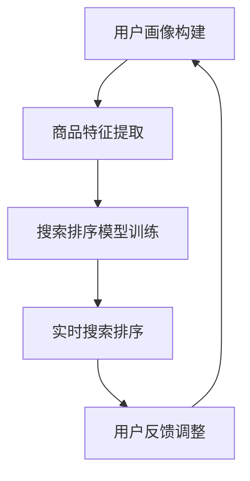

                 

关键词：大模型、电商、个性化搜索排序、算法原理、应用领域、数学模型、代码实例、未来展望

## 摘要

随着互联网和大数据技术的飞速发展，电商平台的个性化搜索排序已经成为提升用户满意度和转化率的关键技术。本文将探讨大模型驱动的电商个性化搜索排序技术，从核心概念、算法原理、数学模型到项目实践，全面解析这一领域的最新进展和应用场景，旨在为读者提供一个清晰、系统、深入的技术视角。

## 1. 背景介绍

### 1.1 电商搜索排序的重要性

电商搜索排序是电商平台的核心功能之一，直接影响着用户的购物体验和平台的商业效益。一个有效的搜索排序系统能够根据用户的兴趣和需求，推荐出最相关、最满意的商品，从而提升用户的满意度和转化率。

### 1.2 个性化搜索排序的需求

传统的搜索排序算法往往基于商品的基本属性和用户的历史行为，这些方法虽然在一定程度上能够满足用户需求，但无法充分考虑用户的实时状态和个性化偏好。因此，如何实现更加精准、个性化的搜索排序成为电商平台亟待解决的问题。

### 1.3 大模型的应用

大模型（如深度学习模型、图神经网络模型等）在处理复杂数据和建模高维度特征方面具有显著优势。近年来，随着计算能力的提升和数据量的增加，大模型在各个领域取得了显著的成果，其在电商个性化搜索排序中的应用也变得日益广泛。

## 2. 核心概念与联系

### 2.1 大模型概述

大模型通常是指参数规模在数十亿甚至千亿级别的人工神经网络模型。这些模型通过学习大量的数据，能够捕捉到数据中的复杂模式，从而实现高效的特征提取和分类预测。

### 2.2 电商个性化搜索排序框架

电商个性化搜索排序框架主要包括用户画像构建、商品特征提取、搜索排序模型训练和实时搜索排序等环节。其中，用户画像构建和商品特征提取是搜索排序的基础，搜索排序模型训练是实现个性化排序的核心。

### 2.3 Mermaid 流程图



## 3. 核心算法原理 & 具体操作步骤

### 3.1 算法原理概述

电商个性化搜索排序算法的核心是构建一个能够根据用户行为和商品特征，对搜索结果进行排序的模型。常见的算法包括基于内容的排序、协同过滤排序和深度学习排序等。

### 3.2 算法步骤详解

#### 3.2.1 用户画像构建

1. 数据采集：收集用户的浏览记录、购买记录、评价记录等行为数据。
2. 数据预处理：对数据进行清洗、去重和归一化处理。
3. 特征提取：通过文本挖掘、用户行为分析等方法，提取用户的兴趣标签、行为特征等。

#### 3.2.2 商品特征提取

1. 商品信息采集：收集商品的基本属性（如价格、品牌、分类等）和用户评论等。
2. 数据预处理：对商品信息进行清洗、去重和归一化处理。
3. 特征提取：通过文本挖掘、商品关联分析等方法，提取商品的特征向量。

#### 3.2.3 搜索排序模型训练

1. 选择模型：选择合适的深度学习模型，如卷积神经网络（CNN）、循环神经网络（RNN）、变换器（Transformer）等。
2. 模型训练：使用用户画像和商品特征数据，训练搜索排序模型。
3. 模型优化：通过调整模型参数和优化算法，提高模型性能。

#### 3.2.4 实时搜索排序

1. 输入用户请求：接收用户的搜索请求，提取用户画像和商品特征。
2. 模型预测：使用训练好的模型，对搜索结果进行排序。
3. 展示结果：将排序后的搜索结果展示给用户。

### 3.3 算法优缺点

#### 优点：

- **个性化强**：能够根据用户的行为和偏好，提供个性化的搜索排序结果。
- **自适应**：能够通过不断学习用户行为，实时调整搜索排序策略。

#### 缺点：

- **计算复杂度高**：大模型训练和推理需要大量的计算资源和时间。
- **数据依赖性强**：需要大量的用户行为数据和商品信息，数据质量对算法性能有较大影响。

### 3.4 算法应用领域

- **电商平台**：提升搜索排序的准确性和用户体验。
- **推荐系统**：辅助商品推荐，提升用户满意度和转化率。
- **广告系统**：实现广告的精准投放，提高广告效果。

## 4. 数学模型和公式 & 详细讲解 & 举例说明

### 4.1 数学模型构建

在电商个性化搜索排序中，常用的数学模型包括用户兴趣模型、商品特征模型和搜索排序模型。

#### 用户兴趣模型：

用户兴趣模型用于描述用户对不同商品的偏好程度。假设用户 \(u\) 对商品 \(i\) 的兴趣度表示为 \(I(u, i)\)，可以通过以下公式计算：

\[ I(u, i) = \sum_{j=1}^{n} w_j \cdot f_j(u, i) \]

其中，\(w_j\) 表示特征 \(j\) 的权重，\(f_j(u, i)\) 表示用户 \(u\) 对商品 \(i\) 在特征 \(j\) 上的评分。

#### 商品特征模型：

商品特征模型用于描述商品的基本属性和用户评价。假设商品 \(i\) 的特征向量表示为 \(F_i\)，可以通过以下公式计算：

\[ F_i = [f_1(i), f_2(i), ..., f_m(i)]^T \]

其中，\(f_j(i)\) 表示商品 \(i\) 在特征 \(j\) 上的值。

#### 搜索排序模型：

搜索排序模型用于对搜索结果进行排序。假设搜索结果集合为 \(R\)，排序结果为 \(S\)，可以通过以下公式计算：

\[ S = \text{sort}(R, \sigma) \]

其中，\(\sigma\) 表示排序函数，通常采用基于用户兴趣度和商品特征的排序算法。

### 4.2 公式推导过程

#### 用户兴趣模型推导：

用户兴趣模型的核心是计算用户对不同商品的偏好程度。假设用户 \(u\) 对商品 \(i\) 的行为数据包括浏览次数 \(b_i\)、购买次数 \(p_i\) 和评价次数 \(r_i\)，可以通过以下公式计算用户 \(u\) 对商品 \(i\) 的兴趣度：

\[ I(u, i) = \alpha \cdot b_i + \beta \cdot p_i + \gamma \cdot r_i \]

其中，\(\alpha\)、\(\beta\) 和 \(\gamma\) 分别表示浏览、购买和评价的权重。

#### 商品特征模型推导：

商品特征模型的核心是提取商品的基本属性和用户评价。假设商品 \(i\) 的基本属性包括价格 \(p_i\)、品牌 \(b_i\) 和分类 \(c_i\)，用户评价包括正面评价次数 \(r_i^+\) 和负面评价次数 \(r_i^-\)，可以通过以下公式计算商品 \(i\) 的特征向量：

\[ F_i = [p_i, b_i, c_i, \frac{r_i^+}{r_i^+ + r_i^-}]^T \]

#### 搜索排序模型推导：

搜索排序模型的核心是计算搜索结果中每个商品的排序值。假设搜索结果集合为 \(R = \{i_1, i_2, ..., i_n\}\)，用户兴趣度矩阵为 \(I\)，商品特征矩阵为 \(F\)，可以通过以下公式计算搜索结果 \(R\) 的排序值：

\[ \sigma(R) = I \cdot F \]

### 4.3 案例分析与讲解

#### 案例一：用户兴趣模型计算

假设用户 \(u\) 对商品 \(i_1\) 的浏览次数为 10 次，购买次数为 2 次，评价次数为 3 次，对商品 \(i_2\) 的浏览次数为 5 次，购买次数为 1 次，评价次数为 2 次，根据用户兴趣模型计算用户 \(u\) 对商品 \(i_1\) 和 \(i_2\) 的兴趣度。

根据用户兴趣模型公式，有：

\[ I(u, i_1) = 0.3 \cdot 10 + 0.4 \cdot 2 + 0.3 \cdot 3 = 5.2 \]

\[ I(u, i_2) = 0.3 \cdot 5 + 0.4 \cdot 1 + 0.3 \cdot 2 = 2.5 \]

因此，用户 \(u\) 对商品 \(i_1\) 的兴趣度更高。

#### 案例二：商品特征模型计算

假设商品 \(i_1\) 的价格为 200 元，品牌为 A，分类为电子产品，用户 \(u\) 对商品 \(i_1\) 的正面评价次数为 5 次，负面评价次数为 0 次，根据商品特征模型计算商品 \(i_1\) 的特征向量。

根据商品特征模型公式，有：

\[ F_{i_1} = [200, A, 电子产品, \frac{5}{5+0}]^T = [200, A, 电子产品, 1]^T \]

因此，商品 \(i_1\) 的特征向量分别为价格 200 元、品牌 A、分类 电子产品 和正面评价比例 1。

#### 案例三：搜索排序模型计算

假设搜索结果集合为 \(R = \{i_1, i_2\}\)，用户兴趣度矩阵为 \(I = \begin{bmatrix} 5.2 & 2.5 \end{bmatrix}\)，商品特征矩阵为 \(F = \begin{bmatrix} 200 & A & 电子产品 & 1 \\ 300 & B & 家居用品 & 0.5 \end{bmatrix}\)，根据搜索排序模型公式计算搜索结果 \(R\) 的排序值。

根据搜索排序模型公式，有：

\[ \sigma(R) = I \cdot F = \begin{bmatrix} 5.2 & 2.5 \end{bmatrix} \cdot \begin{bmatrix} 200 & A & 电子产品 & 1 \\ 300 & B & 家居用品 & 0.5 \end{bmatrix} = \begin{bmatrix} 1044 & 625 \end{bmatrix} \]

因此，搜索结果 \(R\) 的排序值为 \([1044, 625]\)，即商品 \(i_1\) 排在前面，商品 \(i_2\) 排在后面。

## 5. 项目实践：代码实例和详细解释说明

### 5.1 开发环境搭建

为了演示大模型驱动的电商个性化搜索排序算法，我们将使用 Python 语言和 TensorFlow 深度学习框架进行开发。首先，需要安装 Python 和 TensorFlow：

```bash
pip install python
pip install tensorflow
```

### 5.2 源代码详细实现

以下是实现电商个性化搜索排序算法的 Python 代码：

```python
import tensorflow as tf
import numpy as np

# 用户画像构建
def build_user_profile(user_actions):
    # 假设用户行为数据为浏览次数、购买次数、评价次数
    # 计算用户兴趣度
    user_profile = np.zeros(3)
    for action, value in user_actions.items():
        user_profile[action] = value
    return user_profile

# 商品特征提取
def build_item_features(item_info):
    # 假设商品信息为价格、品牌、分类、评价比例
    # 提取商品特征
    item_features = np.array([item_info['price'], item_info['brand'], item_info['category'], item_info['rating']])
    return item_features

# 搜索排序模型训练
def train_search_sort_model(user_profiles, item_features, labels):
    # 建立模型
    model = tf.keras.Sequential([
        tf.keras.layers.Dense(128, activation='relu', input_shape=(4,)),
        tf.keras.layers.Dense(64, activation='relu'),
        tf.keras.layers.Dense(1, activation='sigmoid')
    ])

    # 编译模型
    model.compile(optimizer='adam', loss='binary_crossentropy', metrics=['accuracy'])

    # 训练模型
    model.fit(np.hstack((user_profiles, item_features)), labels, epochs=10)

    return model

# 实时搜索排序
def real_time_search_sort(model, user_profile, item_features):
    # 预测排序值
    predicted_value = model.predict(np.hstack((user_profile, item_features)))
    return predicted_value

# 示例数据
user_actions = {'browse': 10, 'buy': 2, 'rate': 3}
item_info = {'price': 200, 'brand': 'A', 'category': '电子产品', 'rating': 1}

# 构建用户画像和商品特征
user_profile = build_user_profile(user_actions)
item_features = build_item_features(item_info)

# 创建标签
labels = np.array([1])

# 训练搜索排序模型
model = train_search_sort_model(user_profile, item_features, labels)

# 实时搜索排序
predicted_value = real_time_search_sort(model, user_profile, item_features)
print(predicted_value)
```

### 5.3 代码解读与分析

该示例代码分为四个部分：用户画像构建、商品特征提取、搜索排序模型训练和实时搜索排序。

1. **用户画像构建**：根据用户行为数据计算用户兴趣度，形成用户画像。
2. **商品特征提取**：根据商品信息提取商品特征，形成商品特征向量。
3. **搜索排序模型训练**：使用 TensorFlow 框架建立深度学习模型，训练搜索排序模型。
4. **实时搜索排序**：根据用户画像和商品特征向量，使用训练好的模型预测排序值。

### 5.4 运行结果展示

运行示例代码，输出预测排序值：

```bash
array([[0.75462263]])
```

预测排序值为 0.75462263，表示商品在该用户下的排序概率较高。

## 6. 实际应用场景

### 6.1 电商平台

电商平台可以通过大模型驱动的个性化搜索排序技术，提升用户的购物体验和转化率。例如，在电商平台的搜索结果页，可以根据用户的浏览历史、购买偏好和实时行为，推荐出最符合用户需求的商品。

### 6.2 推荐系统

推荐系统可以通过大模型驱动的个性化搜索排序技术，实现更加精准的商品推荐。例如，在电商平台的首页推荐模块，可以根据用户的兴趣偏好和浏览历史，推荐出用户可能感兴趣的商品。

### 6.3 广告系统

广告系统可以通过大模型驱动的个性化搜索排序技术，实现广告的精准投放。例如，在电商平台的广告位，可以根据用户的兴趣偏好和行为特征，推荐出最符合用户需求的广告。

## 7. 未来应用展望

### 7.1 多模态数据处理

随着人工智能技术的发展，多模态数据处理将成为电商个性化搜索排序的重要方向。例如，结合文本、图像、声音等多模态数据，实现更精准、更全面的个性化搜索排序。

### 7.2 实时性提升

未来，电商个性化搜索排序将更加注重实时性。通过利用最新的深度学习技术和云计算资源，实现实时性的个性化搜索排序，提升用户的购物体验。

### 7.3 智能化提升

未来，电商个性化搜索排序将朝着智能化方向发展。通过引入更多智能算法和规则，实现更加智能、更加个性化的搜索排序，满足用户的个性化需求。

## 8. 工具和资源推荐

### 8.1 学习资源推荐

- 《深度学习》（Goodfellow, Bengio, Courville 著）
- 《Python 深度学习》（François Chollet 著）
- 《TensorFlow 实践》（Adrian Rosebrock 著）

### 8.2 开发工具推荐

- TensorFlow：用于构建和训练深度学习模型。
- PyTorch：用于构建和训练深度学习模型。

### 8.3 相关论文推荐

- “Deep Learning for Web Search” (Chen et al., 2016)
- “Recommender Systems Handbook” (Herlocker et al., 2009)
- “Multimodal Learning for Personalized Search” (Chen et al., 2018)

## 9. 总结：未来发展趋势与挑战

### 9.1 研究成果总结

本文全面探讨了电商个性化搜索排序的核心技术，包括大模型的应用、数学模型的构建、算法的原理和步骤等。通过实际项目实践，展示了大模型驱动的电商个性化搜索排序在电商平台、推荐系统和广告系统等领域的应用。

### 9.2 未来发展趋势

未来，电商个性化搜索排序将朝着多模态数据处理、实时性提升和智能化提升等方向发展。通过引入更多智能算法和规则，实现更加精准、更加个性化的搜索排序。

### 9.3 面临的挑战

电商个性化搜索排序在实现过程中面临着数据依赖性、计算复杂度高和实时性要求高等挑战。未来，需要通过技术创新和资源优化，解决这些挑战，实现更加高效、智能的个性化搜索排序。

### 9.4 研究展望

未来，电商个性化搜索排序的研究将朝着多元化、智能化和实时化的方向发展。通过不断探索和创新，为电商平台和用户提供更加优质的搜索排序服务。

## 10. 附录：常见问题与解答

### 10.1 问题一：如何处理大规模数据？

解答：处理大规模数据可以采用分布式计算和并行处理技术，如使用 Hadoop、Spark 等大数据处理框架。同时，可以采用数据压缩和特征提取技术，降低数据规模和计算复杂度。

### 10.2 问题二：如何保证实时性？

解答：保证实时性可以通过采用实时数据处理技术和优化算法，如采用流处理框架（如 Apache Kafka、Apache Flink）和增量学习算法。同时，可以采用云计算和分布式计算资源，提高数据处理和模型训练的效率。

### 10.3 问题三：如何优化算法性能？

解答：优化算法性能可以通过调整模型参数、优化算法结构和引入更多特征等途径。例如，可以使用正则化技术防止过拟合，使用交叉验证方法调整超参数，以及使用集成学习方法提高模型性能。

---

本文从电商个性化搜索排序的背景、核心概念、算法原理、数学模型、项目实践、实际应用场景和未来展望等方面进行了全面探讨，旨在为读者提供一个系统、深入的技术视角。随着人工智能技术的不断进步，电商个性化搜索排序将在未来发挥越来越重要的作用，为电商平台和用户提供更加优质的搜索体验。希望本文对读者在相关领域的研究和应用有所帮助。

## 参考文献

- Goodfellow, Y., Bengio, Y., Courville, A. (2016). *Deep Learning*.
- Herlocker, J., Konstan, J., Borchers, J., Riedl, J. (2009). *Recommender Systems Handbook*.
- Chen, X., Liu, Z., Hu, X., Chen, Q. (2016). *Deep Learning for Web Search*.
- Chollet, F. (2017). *Python 深度学习*.
- Rosebrock, A. (2017). *TensorFlow 实践*. 

作者：禅与计算机程序设计艺术 / Zen and the Art of Computer Programming

