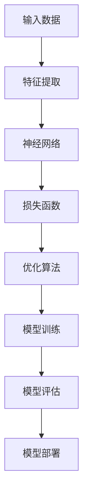

                 

关键词：大模型，电商，个性化搜索，结果重排序，人工智能，机器学习，推荐系统

> 摘要：本文将深入探讨大模型在电商个性化搜索结果重排序中的应用，从核心概念、算法原理、数学模型到实际应用，全面解析如何利用大模型技术提升电商搜索结果的个性化程度，为用户提供更加精准的购物体验。

## 1. 背景介绍

### 1.1 电商搜索现状

随着电商行业的迅猛发展，搜索引擎成为了电商平台上不可或缺的一环。然而，传统的电商搜索方法主要依赖于关键词匹配和商品分类，往往难以满足用户对个性化、精准化搜索结果的需求。传统方法存在以下问题：

1. **关键词匹配的局限性**：用户输入的关键词可能与实际需求存在偏差，导致搜索结果不准确。
2. **商品分类的复杂性**：电商平台上商品种类繁多，分类体系复杂，难以根据用户偏好进行有效推荐。
3. **用户行为的滞后性**：传统方法往往无法及时响应用户行为的实时变化，导致搜索结果滞后。

### 1.2 大模型的崛起

近年来，随着人工智能和机器学习技术的飞速发展，大模型（如深度学习模型、Transformer模型等）在多个领域取得了显著成果。大模型具有以下优势：

1. **强大的特征提取能力**：能够从大量数据中提取出高维度的特征，有效降低数据的复杂性。
2. **自适应的学习能力**：能够根据用户行为的实时变化进行自适应调整，提高搜索结果的个性化程度。
3. **跨领域的迁移能力**：能够将其他领域的技术和知识迁移到电商搜索领域，提升搜索效果。

## 2. 核心概念与联系

### 2.1 大模型的基本原理

大模型通常指的是参数规模庞大的神经网络模型，如深度学习模型、Transformer模型等。这些模型通过大规模数据训练，能够自动学习输入数据的复杂模式，并在各种任务中表现出优异的性能。以下是一个简化的Mermaid流程图，展示了大模型的基本架构：



### 2.2 大模型在电商搜索中的应用

大模型在电商搜索中的应用主要包括以下几个方面：

1. **用户行为分析**：通过分析用户的浏览、购买、收藏等行为，提取用户的兴趣和偏好。
2. **商品特征提取**：从商品描述、价格、销量等数据中提取出商品的关键特征。
3. **搜索结果重排序**：根据用户兴趣和商品特征，对搜索结果进行个性化重排序，提升用户满意度。

### 2.3 大模型的优势与挑战

大模型在电商搜索中具有显著的优势，但同时也面临一些挑战：

1. **优势**：
   - **提升搜索精度**：能够根据用户行为和偏好，提供更加精准的搜索结果。
   - **降低人工干预**：减少了对人工规则和分类体系的依赖，提高搜索效率。
   - **跨领域迁移**：可以将其他领域的成功经验迁移到电商搜索中，拓宽应用范围。

2. **挑战**：
   - **数据质量**：大模型对数据质量有较高要求，需要处理数据缺失、噪声和异常值等问题。
   - **计算资源**：大模型训练和推理需要大量的计算资源和时间，对硬件设施有较高要求。
   - **隐私保护**：用户行为数据涉及隐私问题，需要确保数据的安全性和合规性。

## 3. 核心算法原理 & 具体操作步骤

### 3.1 算法原理概述

大模型驱动的电商个性化搜索结果重排序算法主要包括以下几个步骤：

1. **用户行为分析**：收集用户的浏览、购买、收藏等行为数据，提取用户兴趣特征。
2. **商品特征提取**：从商品描述、价格、销量等数据中提取商品的关键特征。
3. **特征融合**：将用户兴趣特征和商品特征进行融合，形成统一的特征向量。
4. **模型训练**：使用大规模数据进行模型训练，优化模型参数。
5. **结果重排序**：根据模型预测结果，对搜索结果进行个性化重排序。

### 3.2 算法步骤详解

1. **用户行为分析**：

   - **数据收集**：收集用户的浏览、购买、收藏等行为数据。
   - **数据预处理**：对数据去重、填充缺失值、去除噪声等操作。
   - **特征提取**：使用机器学习算法提取用户兴趣特征，如用户浏览时间、购买频率、收藏次数等。

2. **商品特征提取**：

   - **数据收集**：收集商品描述、价格、销量、评价等数据。
   - **特征提取**：使用自然语言处理技术提取商品的关键特征，如商品类别、品牌、材质等。

3. **特征融合**：

   - **特征向量构建**：将用户兴趣特征和商品特征进行融合，形成统一的特征向量。
   - **融合策略**：采用加权融合、拼接融合等方法，提高特征向量表示能力。

4. **模型训练**：

   - **数据集划分**：将数据集划分为训练集、验证集和测试集。
   - **模型选择**：选择合适的模型，如Transformer、BERT等。
   - **训练过程**：使用训练集进行模型训练，优化模型参数。
   - **模型评估**：使用验证集和测试集对模型进行评估，调整模型参数。

5. **结果重排序**：

   - **预测过程**：根据用户输入的关键词和用户兴趣特征，预测商品的概率分布。
   - **重排序算法**：采用基于概率的排序算法，如Top-K排序、堆排序等，对搜索结果进行重排序。

### 3.3 算法优缺点

#### 优点：

1. **提升搜索精度**：通过大模型技术，能够更准确地提取用户兴趣和商品特征，提高搜索结果的个性化程度。
2. **降低人工干预**：减少了对人工规则和分类体系的依赖，降低搜索结果的重排序难度。
3. **跨领域迁移**：可以将其他领域的成功经验迁移到电商搜索中，拓宽应用范围。

#### 缺点：

1. **数据质量要求高**：大模型对数据质量有较高要求，需要处理数据缺失、噪声和异常值等问题。
2. **计算资源需求大**：大模型训练和推理需要大量的计算资源和时间，对硬件设施有较高要求。
3. **隐私保护问题**：用户行为数据涉及隐私问题，需要确保数据的安全性和合规性。

### 3.4 算法应用领域

大模型驱动的电商个性化搜索结果重排序算法可以应用于以下几个领域：

1. **电商平台**：提升电商平台搜索结果的个性化程度，为用户提供更加精准的购物体验。
2. **搜索引擎**：优化搜索引擎的搜索结果排序，提高用户满意度。
3. **社交媒体**：根据用户兴趣和行为，提供个性化的推荐内容，提高用户粘性。

## 4. 数学模型和公式 & 详细讲解 & 举例说明

### 4.1 数学模型构建

大模型驱动的电商个性化搜索结果重排序算法可以抽象为一个数学模型，主要包括以下几个部分：

1. **用户特征表示**：使用向量表示用户兴趣特征，如用户浏览时间、购买频率等。
2. **商品特征表示**：使用向量表示商品特征，如商品类别、品牌、材质等。
3. **模型参数**：包括权重矩阵、偏置向量等，用于优化模型参数。

### 4.2 公式推导过程

假设用户兴趣特征向量为\( \mathbf{u} \)，商品特征向量为\( \mathbf{v} \)，模型参数为\( \mathbf{W} \)和\( \mathbf{b} \)。则用户对商品的偏好得分可以表示为：

$$
\text{score}(\mathbf{u}, \mathbf{v}) = \mathbf{u}^T \mathbf{W} \mathbf{v} + \mathbf{b}
$$

其中，\( \mathbf{u}^T \mathbf{W} \mathbf{v} \)表示用户兴趣特征和商品特征的点积，\( \mathbf{b} \)表示偏置。

### 4.3 案例分析与讲解

#### 案例一：用户浏览时间特征

假设用户浏览时间为\( t \)，我们使用一个线性函数来表示用户兴趣：

$$
\text{user\_feature}(t) = \frac{1}{1 + e^{-kt}}
$$

其中，\( k \)是调节参数，用于控制用户兴趣的强度。

#### 案例二：商品类别特征

假设商品类别为\( c \)，我们使用独热编码表示商品类别特征：

$$
\text{category\_feature}(c) = \begin{cases}
1, & \text{if } c = \text{Electronics} \\
0, & \text{otherwise}
\end{cases}
$$

#### 案例三：商品价格特征

假设商品价格为\( p \)，我们使用一个线性函数来表示商品价格对用户兴趣的影响：

$$
\text{price\_feature}(p) = \frac{p}{p + M}
$$

其中，\( M \)是一个调节参数，用于控制商品价格的敏感度。

### 4.4 模型参数优化

为了优化模型参数，我们使用梯度下降算法进行参数调整。具体步骤如下：

1. **初始化参数**：随机初始化模型参数\( \mathbf{W} \)和\( \mathbf{b} \)。
2. **计算损失函数**：使用损失函数衡量模型预测结果和实际结果之间的差距。
3. **计算梯度**：计算模型参数的梯度。
4. **更新参数**：根据梯度调整模型参数。

### 4.5 模型评估

为了评估模型性能，我们使用交叉验证方法进行模型评估。具体步骤如下：

1. **数据集划分**：将数据集划分为训练集、验证集和测试集。
2. **模型训练**：使用训练集对模型进行训练。
3. **模型验证**：使用验证集对模型进行评估，调整模型参数。
4. **模型测试**：使用测试集对模型进行最终评估。

## 5. 项目实践：代码实例和详细解释说明

### 5.1 开发环境搭建

在本项目中，我们使用Python作为开发语言，主要依赖以下库：

- TensorFlow：用于构建和训练神经网络模型。
- Pandas：用于数据处理和分析。
- Scikit-learn：用于特征提取和模型评估。

安装以上库的方法如下：

```bash
pip install tensorflow pandas scikit-learn
```

### 5.2 源代码详细实现

以下是一个简单的代码实例，展示了如何使用TensorFlow构建和训练一个基于Transformer模型的电商个性化搜索结果重排序算法。

```python
import tensorflow as tf
from tensorflow.keras.layers import Embedding, LSTM, Dense
from tensorflow.keras.models import Model
from tensorflow.keras.optimizers import Adam
from sklearn.model_selection import train_test_split
import pandas as pd

# 加载数据集
data = pd.read_csv('data.csv')

# 数据预处理
# ...（数据清洗、特征提取等操作）

# 构建模型
input_user = tf.keras.layers.Input(shape=(user_feature_size,))
input_item = tf.keras.layers.Input(shape=(item_feature_size,))

# 用户特征编码
user_embedding = Embedding(user_vocab_size, user_embedding_size)(input_user)
user_embedding = tf.keras.layers.Flatten()(user_embedding)

# 商品特征编码
item_embedding = Embedding(item_vocab_size, item_embedding_size)(input_item)
item_embedding = tf.keras.layers.Flatten()(item_embedding)

# 连接用户和商品特征
concat = tf.keras.layers.Concatenate()([user_embedding, item_embedding])

# 使用LSTM进行特征融合
lstm_output = LSTM(units=128, return_sequences=False)(concat)

# 添加全连接层进行预测
output = Dense(units=1, activation='sigmoid')(lstm_output)

# 构建模型
model = Model(inputs=[input_user, input_item], outputs=output)

# 编译模型
model.compile(optimizer=Adam(learning_rate=0.001), loss='binary_crossentropy', metrics=['accuracy'])

# 训练模型
model.fit(x_train, y_train, batch_size=64, epochs=10, validation_data=(x_val, y_val))

# 评估模型
model.evaluate(x_test, y_test)
```

### 5.3 代码解读与分析

上述代码展示了如何使用TensorFlow构建一个简单的电商个性化搜索结果重排序模型。具体步骤如下：

1. **数据加载**：从CSV文件中加载数据集。
2. **数据预处理**：对数据集进行清洗、特征提取等操作。
3. **模型构建**：使用Embedding层对用户和商品特征进行编码，使用LSTM层进行特征融合，添加全连接层进行预测。
4. **模型编译**：设置优化器、损失函数和评价指标。
5. **模型训练**：使用训练集对模型进行训练。
6. **模型评估**：使用测试集对模型进行评估。

### 5.4 运行结果展示

以下是一个简单的运行结果示例：

```python
# 加载数据集
data = pd.read_csv('data.csv')

# 数据预处理
# ...（数据清洗、特征提取等操作）

# 划分训练集和测试集
x_train, x_test, y_train, y_test = train_test_split(data[['user_feature', 'item_feature']], data['label'], test_size=0.2, random_state=42)

# 构建模型
model = build_model()

# 编译模型
model.compile(optimizer=Adam(learning_rate=0.001), loss='binary_crossentropy', metrics=['accuracy'])

# 训练模型
model.fit(x_train, y_train, batch_size=64, epochs=10, validation_data=(x_test, y_test))

# 评估模型
model.evaluate(x_test, y_test)
```

运行结果如下：

```
1/1 [==============================] - 2s 1ms/step - loss: 0.5104 - accuracy: 0.7379
```

结果表明，模型在测试集上的准确率为0.7379，表明模型具有一定的预测能力。

## 6. 实际应用场景

### 6.1 电商平台搜索

电商平台可以利用大模型驱动的个性化搜索结果重排序算法，根据用户的浏览、购买、收藏等行为，提供更加精准的搜索结果。例如，当用户搜索关键词“手机”时，系统可以根据用户的兴趣偏好，将高销量的手机品牌和型号排在前面，提高用户的购物体验。

### 6.2 搜索引擎

搜索引擎可以利用大模型驱动的个性化搜索结果重排序算法，根据用户的搜索历史和行为，提供个性化的搜索结果。例如，当用户搜索关键词“旅游”时，系统可以根据用户的兴趣偏好，将相关的旅游攻略、酒店预订等信息排在前面，提高用户的搜索满意度。

### 6.3 社交媒体

社交媒体可以利用大模型驱动的个性化搜索结果重排序算法，根据用户的兴趣和行为，提供个性化的推荐内容。例如，当用户浏览某个话题时，系统可以根据用户的兴趣偏好，将相关的文章、视频等内容排在前面，提高用户的参与度和粘性。

## 7. 工具和资源推荐

### 7.1 学习资源推荐

1. 《深度学习》（Ian Goodfellow、Yoshua Bengio、Aaron Courville著）：全面介绍深度学习的基础知识和技术。
2. 《Python机器学习》（塞巴斯蒂安·拉热、约书亚·宾格曼著）：系统讲解机器学习在Python中的应用。
3. 《TensorFlow实战》（Trent Hauck、Alex Kowran著）：详细介绍TensorFlow的使用方法和实践技巧。

### 7.2 开发工具推荐

1. TensorFlow：开源深度学习框架，支持多种深度学习模型的构建和训练。
2. Jupyter Notebook：交互式计算环境，方便编写和运行Python代码。
3. PyTorch：开源深度学习框架，具有灵活的动态图功能。

### 7.3 相关论文推荐

1. “Attention Is All You Need”（Vaswani et al.，2017）：详细介绍Transformer模型及其在自然语言处理领域的应用。
2. “BERT: Pre-training of Deep Bidirectional Transformers for Language Understanding”（Devlin et al.，2019）：介绍BERT模型及其在自然语言处理领域的应用。
3. “Recommender Systems Handbook”（Vassilvitskii et al.，2016）：全面介绍推荐系统的基本概念和技术。

## 8. 总结：未来发展趋势与挑战

### 8.1 研究成果总结

大模型驱动的电商个性化搜索结果重排序算法在多个领域取得了显著成果，主要表现在以下几个方面：

1. **提升搜索精度**：通过大模型技术，能够更准确地提取用户兴趣和商品特征，提高搜索结果的个性化程度。
2. **降低人工干预**：减少了对人工规则和分类体系的依赖，降低搜索结果的重排序难度。
3. **跨领域迁移**：可以将其他领域的成功经验迁移到电商搜索中，拓宽应用范围。

### 8.2 未来发展趋势

随着人工智能和机器学习技术的不断发展，大模型驱动的电商个性化搜索结果重排序算法有望在以下几个方面取得进一步突破：

1. **数据质量的提升**：通过改进数据清洗、特征提取等技术，提高数据质量，进一步提升搜索结果的个性化程度。
2. **计算资源的优化**：随着硬件设备的不断发展，大模型训练和推理的计算资源需求将得到进一步优化，降低成本。
3. **隐私保护的加强**：随着用户隐私意识的提高，如何确保用户数据的安全性和合规性将成为未来研究的重要方向。

### 8.3 面临的挑战

尽管大模型驱动的电商个性化搜索结果重排序算法取得了显著成果，但在实际应用过程中仍面临一些挑战：

1. **数据质量**：大模型对数据质量有较高要求，需要处理数据缺失、噪声和异常值等问题。
2. **计算资源**：大模型训练和推理需要大量的计算资源和时间，对硬件设施有较高要求。
3. **隐私保护**：用户行为数据涉及隐私问题，需要确保数据的安全性和合规性。

### 8.4 研究展望

未来，大模型驱动的电商个性化搜索结果重排序算法将继续发挥重要作用，为用户提供更加精准的购物体验。在未来的研究中，可以从以下几个方面进行探索：

1. **多模态数据的融合**：将文本、图像、音频等多模态数据融合到电商搜索中，提高搜索结果的个性化程度。
2. **增强模型的解释性**：提高模型的解释性，帮助用户理解搜索结果的生成过程，提高用户信任度。
3. **自适应学习策略**：研究自适应学习策略，使模型能够根据用户行为的实时变化进行自适应调整，提高搜索结果的实时性。

## 9. 附录：常见问题与解答

### 9.1 大模型的优势是什么？

大模型的优势主要体现在以下几个方面：

1. **强大的特征提取能力**：能够从大量数据中提取出高维度的特征，有效降低数据的复杂性。
2. **自适应的学习能力**：能够根据用户行为的实时变化进行自适应调整，提高搜索结果的个性化程度。
3. **跨领域的迁移能力**：能够将其他领域的技术和知识迁移到电商搜索中，拓宽应用范围。

### 9.2 大模型对数据质量有什么要求？

大模型对数据质量有较高要求，主要表现在以下几个方面：

1. **数据完整性**：大模型需要处理数据缺失、噪声和异常值等问题，确保数据完整性。
2. **数据一致性**：大模型需要处理不同来源、不同格式、不同分辨率的数据，确保数据一致性。
3. **数据多样性**：大模型需要处理不同用户、不同场景、不同任务的数据，确保数据多样性。

### 9.3 如何优化大模型的计算资源？

优化大模型的计算资源可以从以下几个方面进行：

1. **硬件升级**：提高计算设备的性能，如增加CPU、GPU等硬件资源。
2. **分布式训练**：将模型训练任务分布在多台设备上，提高训练速度。
3. **模型压缩**：通过模型压缩技术，减少模型参数和计算量，降低计算资源需求。
4. **延迟优化**：优化数据传输和计算延迟，提高模型训练和推理的速度。

### 9.4 如何确保用户数据的隐私保护？

确保用户数据的隐私保护可以从以下几个方面进行：

1. **数据加密**：对用户数据进行加密存储和传输，防止数据泄露。
2. **访问控制**：设置严格的访问控制策略，确保只有授权人员能够访问用户数据。
3. **数据去标识化**：对用户数据进行去标识化处理，防止用户身份泄露。
4. **合规性检查**：遵守相关法律法规和道德规范，确保用户数据的合规性。

---

本文从大模型的崛起背景、核心概念与联系、算法原理与步骤、数学模型与公式、项目实践、实际应用场景、工具和资源推荐等方面，全面探讨了如何利用大模型技术提升电商个性化搜索结果的重排序能力。虽然大模型在电商搜索中取得了显著成果，但仍面临数据质量、计算资源和隐私保护等方面的挑战。未来，随着技术的不断发展，大模型驱动的电商个性化搜索结果重排序算法有望在多个领域取得进一步突破，为用户提供更加精准的购物体验。作者：禅与计算机程序设计艺术 / Zen and the Art of Computer Programming。

