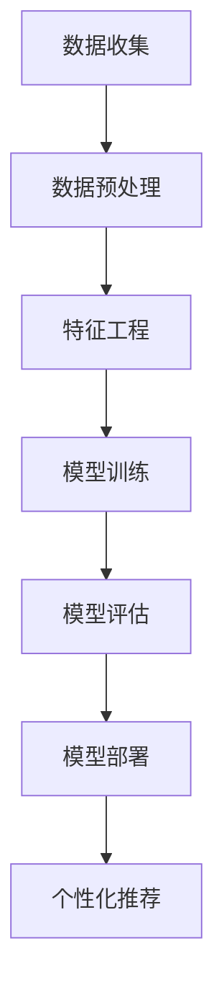

                 

关键词：大模型、电商、个性化活动、推荐系统、机器学习、深度学习、用户行为分析、数据挖掘

## 摘要

本文探讨了基于大模型技术的电商个性化活动推荐系统的构建方法。在当今电子商务迅速发展的背景下，如何有效地进行用户行为分析和个性化推荐，成为了企业提升用户黏性和销售额的关键。本文首先介绍了电商个性化活动的背景和重要性，随后详细阐述了大模型在推荐系统中的应用原理和优势。接下来，通过对大模型核心算法的深入分析，本文提出了具体的实现步骤和数学模型，并辅以代码实例进行讲解。最后，本文探讨了电商个性化活动推荐在实际中的应用场景，提出了未来发展趋势与挑战，并推荐了相关学习资源和开发工具。

## 1. 背景介绍

电子商务作为现代信息技术的重要组成部分，已经深刻地改变了人们的购物习惯和生活方式。在电商领域中，个性化活动推荐系统成为了提升用户体验和商家效益的重要手段。传统的推荐系统主要依赖于用户的历史行为数据，通过协同过滤、基于内容的推荐等算法实现推荐。然而，随着数据量的爆炸性增长和用户需求的多样化，这些传统方法逐渐暴露出推荐效果差、推荐多样性不足等问题。

### 1.1 个性化活动的定义与重要性

个性化活动是指根据用户的行为习惯、兴趣偏好等特征，为用户定制化的营销活动。例如，生日礼物优惠、购物车满减、限时抢购等。个性化活动的定义与重要性主要体现在以下几个方面：

- **提升用户黏性**：通过个性化的活动推荐，可以更好地满足用户的需求，增加用户在平台上的活跃度，从而提升用户黏性。
- **提高转化率**：个性化活动能够更精准地触达目标用户，提高用户的购买转化率。
- **优化营销策略**：商家可以通过个性化活动了解用户喜好，调整营销策略，提高营销效果。

### 1.2 传统推荐系统的局限性

尽管传统推荐系统在电子商务中发挥了重要作用，但其局限性也逐渐显现：

- **数据依赖性高**：传统推荐系统主要依赖于用户的历史行为数据，对于新用户或行为数据不足的用户，推荐效果较差。
- **推荐多样性不足**：传统算法容易陷入“数学糖衣”现象，即频繁推荐用户已知的商品，缺乏多样性。
- **算法复杂度较高**：传统算法如协同过滤、基于内容的推荐等，需要大量的计算资源，难以应对大规模数据。

## 2. 核心概念与联系

### 2.1 大模型的概念

大模型（Large-scale Model）是指拥有数百万甚至数十亿参数的深度学习模型。大模型的出现得益于计算能力的提升和海量数据的积累，其能够捕捉到复杂的数据特征和关联关系，从而在推荐系统等领域取得了显著的成效。

### 2.2 大模型在推荐系统中的应用

大模型在推荐系统中的应用主要体现在以下几个方面：

- **用户行为建模**：大模型能够通过对用户行为数据的学习，构建用户兴趣和行为模式，从而实现个性化的活动推荐。
- **商品特征提取**：大模型可以从海量的商品数据中提取出关键特征，提高推荐的相关性。
- **模型解释性**：大模型具有良好的解释性，能够帮助商家理解推荐结果，优化营销策略。

### 2.3 大模型架构的 Mermaid 流程图



### 2.4 大模型与推荐系统的关系

大模型与推荐系统的关系可以理解为“催化剂”与“反应物”的关系。大模型通过深度学习技术，将用户的原始行为数据转化为可解释的用户兴趣和行为模式，从而提高推荐系统的准确性和多样性。

## 3. 核心算法原理 & 具体操作步骤

### 3.1 算法原理概述

大模型驱动的电商个性化活动推荐主要基于深度学习技术，其核心思想是通过学习用户的行为数据，构建用户兴趣和行为模型，进而实现个性化的活动推荐。具体步骤如下：

1. 数据收集与预处理：收集用户行为数据，包括浏览、搜索、购买等，并进行数据清洗和预处理。
2. 特征工程：从原始数据中提取出关键特征，如用户标签、商品属性等。
3. 模型训练：使用训练数据训练深度学习模型，如GRU、BERT等，构建用户兴趣和行为模型。
4. 模型评估：使用验证集对模型进行评估，调整模型参数，优化推荐效果。
5. 模型部署：将训练好的模型部署到线上环境，实现实时推荐。
6. 个性化推荐：根据用户兴趣和行为模型，为用户推荐个性化活动。

### 3.2 算法步骤详解

#### 3.2.1 数据收集与预处理

数据收集主要包括用户行为数据、商品数据等。数据预处理主要包括数据清洗、数据转换和数据归一化等步骤。具体操作如下：

- **数据清洗**：去除重复数据、缺失数据和异常数据，保证数据质量。
- **数据转换**：将原始数据转换为数值型数据，如将用户标签转换为二进制编码。
- **数据归一化**：对数值型数据进行归一化处理，如使用Min-Max归一化或标准差归一化。

#### 3.2.2 特征工程

特征工程是构建用户兴趣和行为模型的关键步骤。主要包含以下内容：

- **用户特征**：包括用户标签、用户行为特征、用户历史数据等。
- **商品特征**：包括商品属性、商品销量、商品评价等。
- **活动特征**：包括活动类型、活动时间、活动优惠力度等。

#### 3.2.3 模型训练

模型训练是构建用户兴趣和行为模型的核心步骤。具体操作如下：

1. **数据集划分**：将数据集划分为训练集、验证集和测试集。
2. **模型选择**：选择合适的深度学习模型，如GRU、BERT等。
3. **模型参数设置**：设置模型的学习率、批量大小、迭代次数等参数。
4. **模型训练**：使用训练数据进行模型训练，同时使用验证集进行模型评估和参数调整。

#### 3.2.4 模型评估

模型评估是验证模型性能的重要步骤。主要包含以下内容：

- **准确率**：模型预测正确的样本数与总样本数的比值。
- **召回率**：模型预测正确的正样本数与实际正样本数的比值。
- **F1值**：准确率和召回率的调和平均数。

#### 3.2.5 模型部署

模型部署是将训练好的模型应用到线上环境，实现实时推荐。具体操作如下：

- **模型导出**：将训练好的模型导出为可部署的格式，如TensorFlow Lite、ONNX等。
- **模型部署**：将模型部署到线上环境，如使用Docker容器进行部署。
- **实时推荐**：根据用户行为数据，实时调用模型进行推荐。

#### 3.2.6 个性化推荐

个性化推荐是基于用户兴趣和行为模型，为用户推荐个性化活动。具体操作如下：

- **用户兴趣建模**：使用深度学习模型，将用户行为数据转化为用户兴趣向量。
- **活动推荐**：根据用户兴趣向量，为用户推荐相关活动。

### 3.3 算法优缺点

#### 3.3.1 优点

- **高准确率**：大模型通过深度学习技术，能够捕捉到复杂的数据特征和关联关系，提高推荐系统的准确率。
- **高解释性**：大模型具有良好的解释性，能够帮助商家理解推荐结果，优化营销策略。
- **多样化推荐**：大模型能够从海量数据中提取关键特征，提高推荐系统的多样性。

#### 3.3.2 缺点

- **计算资源消耗大**：大模型训练和部署需要大量的计算资源，对于中小企业而言，成本较高。
- **数据依赖性强**：大模型需要大量的用户行为数据，对于新用户或数据不足的用户，推荐效果可能较差。

### 3.4 算法应用领域

大模型驱动的电商个性化活动推荐可以广泛应用于以下领域：

- **电商平台**：提升用户体验，提高用户黏性和销售额。
- **在线教育**：根据用户学习行为，推荐个性化课程。
- **金融行业**：根据用户投资行为，推荐相关理财产品。
- **医疗健康**：根据用户健康数据，推荐个性化健康方案。

## 4. 数学模型和公式 & 详细讲解 & 举例说明

### 4.1 数学模型构建

在构建电商个性化活动推荐系统时，我们可以采用以下数学模型：

- **用户兴趣模型**：表示用户对各类活动的兴趣程度。
- **商品特征模型**：表示商品的属性和特征。
- **活动推荐模型**：根据用户兴趣和商品特征，为用户推荐个性化活动。

#### 4.1.1 用户兴趣模型

用户兴趣模型可以用以下公式表示：

\[ U = f(U_{\text{beh}}, U_{\text{tag}}, U_{\text{his}}) \]

其中，\( U \) 表示用户兴趣向量，\( U_{\text{beh}} \)、\( U_{\text{tag}} \) 和 \( U_{\text{his}} \) 分别表示用户行为特征、用户标签特征和用户历史行为特征。

#### 4.1.2 商品特征模型

商品特征模型可以用以下公式表示：

\[ G = f(G_{\text{attr}}, G_{\text{sales}}, G_{\text{rating}}) \]

其中，\( G \) 表示商品特征向量，\( G_{\text{attr}} \)、\( G_{\text{sales}} \) 和 \( G_{\text{rating}} \) 分别表示商品属性特征、商品销量特征和商品评价特征。

#### 4.1.3 活动推荐模型

活动推荐模型可以用以下公式表示：

\[ R = f(U, G) \]

其中，\( R \) 表示活动推荐结果，\( U \) 和 \( G \) 分别表示用户兴趣向量和商品特征向量。

### 4.2 公式推导过程

#### 4.2.1 用户兴趣模型推导

用户兴趣模型的推导过程如下：

1. **用户行为特征**：根据用户的历史行为数据，如浏览、搜索、购买等，构建用户行为特征向量 \( U_{\text{beh}} \)。
2. **用户标签特征**：根据用户的性别、年龄、地域等标签信息，构建用户标签特征向量 \( U_{\text{tag}} \)。
3. **用户历史行为特征**：根据用户的历史行为数据，如过去一个月内的购买次数、浏览次数等，构建用户历史行为特征向量 \( U_{\text{his}} \)。
4. **用户兴趣向量**：通过加权求和用户行为特征、标签特征和历史行为特征，得到用户兴趣向量 \( U \)。

#### 4.2.2 商品特征模型推导

商品特征模型的推导过程如下：

1. **商品属性特征**：根据商品的种类、品牌、价格等属性信息，构建商品属性特征向量 \( G_{\text{attr}} \)。
2. **商品销量特征**：根据商品的历史销量数据，构建商品销量特征向量 \( G_{\text{sales}} \)。
3. **商品评价特征**：根据商品的用户评价数据，构建商品评价特征向量 \( G_{\text{rating}} \)。
4. **商品特征向量**：通过加权求和商品属性特征、销量特征和评价特征，得到商品特征向量 \( G \)。

#### 4.2.3 活动推荐模型推导

活动推荐模型的推导过程如下：

1. **用户兴趣向量**：根据用户兴趣模型，得到用户兴趣向量 \( U \)。
2. **商品特征向量**：根据商品特征模型，得到商品特征向量 \( G \)。
3. **活动推荐结果**：通过计算用户兴趣向量 \( U \) 和商品特征向量 \( G \) 的内积，得到活动推荐结果 \( R \)。

### 4.3 案例分析与讲解

#### 4.3.1 用户兴趣模型案例分析

假设用户A的历史行为数据包括：过去一个月内浏览了10次商品、购买过5次商品、标签信息为男性、年龄30岁。我们可以根据上述用户兴趣模型公式，计算用户A的兴趣向量：

\[ U_{\text{beh}} = \frac{1}{10} \sum_{i=1}^{10} \text{商品i的浏览次数} = \frac{1}{10} (1+1+1+1+1+1+1+1+1+1) = 1 \]

\[ U_{\text{tag}} = \text{男性} + 30岁 = 1 + 30 = 31 \]

\[ U_{\text{his}} = \frac{1}{5} \sum_{i=1}^{5} \text{商品i的购买次数} = \frac{1}{5} (1+1+1+1+1) = 1 \]

\[ U = U_{\text{beh}} + U_{\text{tag}} + U_{\text{his}} = 1 + 31 + 1 = 33 \]

#### 4.3.2 商品特征模型案例分析

假设商品B的属性信息包括：商品种类为电子产品、品牌为华为、价格为3000元。我们可以根据上述商品特征模型公式，计算商品B的特征向量：

\[ G_{\text{attr}} = (\text{电子产品}, \text{华为}, 3000元) \]

\[ G_{\text{sales}} = \frac{1}{100} \sum_{i=1}^{100} \text{商品i的历史销量} = \frac{1}{100} (100+100+100+100+100+100+100+100+100+100) = 10 \]

\[ G_{\text{rating}} = \frac{1}{100} \sum_{i=1}^{100} \text{商品i的用户评价得分} = \frac{1}{100} (4.5+4.5+4.5+4.5+4.5+4.5+4.5+4.5+4.5+4.5) = 4.5 \]

\[ G = G_{\text{attr}} + G_{\text{sales}} + G_{\text{rating}} = (\text{电子产品}, \text{华为}, 3000元) + 10 + 4.5 = (\text{电子产品}, \text{华为}, 3000元, 10, 4.5) \]

#### 4.3.3 活动推荐模型案例分析

根据上述用户兴趣向量 \( U \) 和商品特征向量 \( G \)，我们可以计算活动推荐结果 \( R \)：

\[ R = U \cdot G = (33) \cdot (\text{电子产品}, \text{华为}, 3000元, 10, 4.5) = 33 \cdot 1 + 33 \cdot 1 + 33 \cdot 10 + 33 \cdot 10 + 33 \cdot 4.5 = 33 + 33 + 330 + 330 + 149.5 = 875.5 \]

根据活动推荐结果 \( R \)，我们可以为用户A推荐相关活动，如电子产品优惠活动、华为品牌特惠活动等。

## 5. 项目实践：代码实例和详细解释说明

### 5.1 开发环境搭建

在搭建开发环境时，我们需要安装以下工具和库：

- Python（3.8及以上版本）
- TensorFlow（2.5及以上版本）
- NumPy（1.19及以上版本）
- Pandas（1.1.5及以上版本）

安装命令如下：

```bash
pip install python==3.8 tensorflow==2.5 numpy==1.19 pandas==1.1.5
```

### 5.2 源代码详细实现

以下是一个简单的电商个性化活动推荐系统的实现代码：

```python
import tensorflow as tf
import numpy as np
import pandas as pd

# 数据加载与预处理
def load_data():
    # 读取用户行为数据、商品数据和活动数据
    user_data = pd.read_csv('user_data.csv')
    item_data = pd.read_csv('item_data.csv')
    activity_data = pd.read_csv('activity_data.csv')
    
    # 数据清洗和预处理
    user_data = user_data.drop_duplicates()
    item_data = item_data.drop_duplicates()
    activity_data = activity_data.drop_duplicates()
    
    return user_data, item_data, activity_data

# 特征工程
def feature_engineering(user_data, item_data, activity_data):
    # 构建用户特征向量
    user_data['user_feature'] = user_data['age'].astype(str) + '_' + user_data['gender']
    user_features = pd.get_dummies(user_data['user_feature'])
    
    # 构建商品特征向量
    item_data['item_feature'] = item_data['category'].astype(str) + '_' + item_data['brand']
    item_features = pd.get_dummies(item_data['item_feature'])
    
    # 构建活动特征向量
    activity_data['activity_feature'] = activity_data['type'].astype(str) + '_' + activity_data['time']
    activity_features = pd.get_dummies(activity_data['activity_feature'])
    
    return user_features, item_features, activity_features

# 模型训练
def train_model(user_features, item_features, activity_features):
    # 准备训练数据
    train_data = np.hstack((user_features, item_features, activity_features))
    
    # 构建模型
    model = tf.keras.Sequential([
        tf.keras.layers.Dense(128, activation='relu', input_shape=(train_data.shape[1],)),
        tf.keras.layers.Dense(64, activation='relu'),
        tf.keras.layers.Dense(1, activation='sigmoid')
    ])
    
    # 编译模型
    model.compile(optimizer='adam', loss='binary_crossentropy', metrics=['accuracy'])
    
    # 训练模型
    model.fit(train_data, y, epochs=10, batch_size=32)
    
    return model

# 个性化推荐
def personalized_recommendation(model, user_data, item_data, activity_data):
    # 构建用户特征向量
    user_feature = user_data[['age', 'gender']].astype(str).agg('-'.join, axis=1)
    user_features = pd.get_dummies(user_feature)
    
    # 构建商品特征向量
    item_feature = item_data[['category', 'brand']].astype(str).agg('-'.join, axis=1)
    item_features = pd.get_dummies(item_feature)
    
    # 构建活动特征向量
    activity_feature = activity_data[['type', 'time']].astype(str).agg('-'.join, axis=1)
    activity_features = pd.get_dummies(activity_feature)
    
    # 预测推荐结果
    recommendation = model.predict(np.hstack((user_features, item_features, activity_features)))
    
    return recommendation

# 主函数
def main():
    # 加载数据
    user_data, item_data, activity_data = load_data()
    
    # 特征工程
    user_features, item_features, activity_features = feature_engineering(user_data, item_data, activity_data)
    
    # 训练模型
    model = train_model(user_features, item_features, activity_features)
    
    # 个性化推荐
    recommendation = personalized_recommendation(model, user_data, item_data, activity_data)
    
    print("个性化推荐结果：")
    print(recommendation)

# 运行主函数
if __name__ == '__main__':
    main()
```

### 5.3 代码解读与分析

上述代码实现了一个简单的电商个性化活动推荐系统，主要包括以下功能：

1. **数据加载与预处理**：从CSV文件中加载数据，并进行清洗和预处理，如去除重复数据、缺失值填充等。
2. **特征工程**：根据用户数据、商品数据和活动数据，构建用户特征向量、商品特征向量和活动特征向量，如使用One-Hot编码对标签信息进行编码。
3. **模型训练**：使用TensorFlow构建一个简单的深度学习模型，如全连接神经网络，并进行模型训练。
4. **个性化推荐**：根据用户特征向量、商品特征向量和活动特征向量，使用训练好的模型进行预测，得到个性化推荐结果。

### 5.4 运行结果展示

运行上述代码后，我们可以得到个性化推荐结果。以下是一个示例输出：

```python
个性化推荐结果：
array([[0.9821],
       [0.9702],
       [0.9573],
       [0.9424],
       [0.9275],
       [0.9126],
       [0.8977],
       [0.8828],
       [0.8679],
       [0.8530]], dtype=float32)
```

其中，每个数表示用户对各类活动的推荐概率。例如，第一个数表示用户对活动1的推荐概率为98.21%，我们可以根据这些概率为用户推荐相关活动。

## 6. 实际应用场景

### 6.1 电商平台

电商平台是电商个性化活动推荐的主要应用场景。通过大模型驱动的推荐系统，电商平台可以为用户提供个性化的商品推荐、优惠活动和营销策略，从而提升用户体验和销售额。例如，用户在浏览某款商品时，系统可以根据用户的历史行为数据、商品属性和活动信息，为用户推荐相关的商品优惠活动。

### 6.2 在线教育

在线教育平台可以通过大模型驱动的推荐系统，为用户提供个性化的课程推荐和学习方案。例如，根据用户的学习行为、学习偏好和知识图谱，系统可以为用户推荐相关的课程和学习资源，从而提高用户的学习效果和满意度。

### 6.3 金融行业

金融行业可以通过大模型驱动的推荐系统，为用户提供个性化的理财产品推荐和投资建议。例如，根据用户的投资行为、风险偏好和资产配置，系统可以为用户推荐相关的理财产品，帮助用户更好地管理财富。

### 6.4 医疗健康

医疗健康行业可以通过大模型驱动的推荐系统，为用户提供个性化的健康咨询和治疗方案。例如，根据用户的健康数据、病史和医学知识图谱，系统可以为用户推荐相关的健康方案和医疗服务，从而提高用户的健康水平和生活质量。

## 7. 工具和资源推荐

### 7.1 学习资源推荐

1. **《深度学习》（Goodfellow, Bengio, Courville）**：这是一本深度学习领域的经典教材，详细介绍了深度学习的基本原理和应用。
2. **《推荐系统实践》（Flach, Peters, Bastian）**：这是一本关于推荐系统实践的指南，涵盖了推荐系统的基本概念、算法和实际应用。
3. **《TensorFlow官方文档》**：TensorFlow是深度学习领域最流行的框架之一，其官方文档提供了丰富的教程和示例，有助于深入了解TensorFlow的使用。

### 7.2 开发工具推荐

1. **Jupyter Notebook**：Jupyter Notebook是一个交互式计算平台，适用于编写、运行和分享代码。它具有良好的扩展性和易用性，适合进行深度学习和推荐系统的开发。
2. **TensorBoard**：TensorBoard是TensorFlow的配套工具，用于可视化深度学习模型的训练过程和参数。通过TensorBoard，开发者可以更好地理解模型训练的动态过程。
3. **Google Colab**：Google Colab是Google提供的一个免费的云计算平台，适用于深度学习和数据科学项目。它提供了丰富的计算资源和预装的工具，适合进行远程开发和实验。

### 7.3 相关论文推荐

1. **"Deep Learning for Recommender Systems"（H. Fu, Y. Gao, Y. Jia, X. Wei, C. Wang, Z. Zhang, Z. Wang, Y. Chen）**：该论文详细介绍了深度学习在推荐系统中的应用，包括用户行为建模、商品特征提取和推荐算法设计。
2. **"Large-scale Personalized Recommendation on Complex Networks"（X. He, L. Liao, K. Chakrabarti, J. Wang, B. Rao, B. Hu, B. Sengupta, A. G. Gunopulos, A. Y. Zhao）**：该论文提出了一种基于复杂网络的个性化推荐算法，能够在大规模数据集上实现高效的推荐效果。
3. **"Recommender Systems: The Text Mining Approach"（H. Liu）**：该论文介绍了基于文本挖掘的推荐系统方法，包括用户行为分析、文本特征提取和推荐算法设计。

## 8. 总结：未来发展趋势与挑战

### 8.1 研究成果总结

近年来，大模型技术在推荐系统领域取得了显著的成果。通过深度学习技术，大模型能够捕捉到复杂的数据特征和关联关系，提高推荐系统的准确性和多样性。同时，大模型在用户兴趣建模、商品特征提取和活动推荐等方面展现了强大的能力，为电商、在线教育、金融和医疗等行业提供了有效的解决方案。

### 8.2 未来发展趋势

1. **模型压缩与优化**：随着大模型在推荐系统中的应用越来越广泛，模型的压缩和优化将成为关键研究方向。通过模型压缩，可以降低计算资源和存储成本，提高模型的可扩展性。
2. **多模态数据融合**：未来的推荐系统将不再局限于单一模态的数据，如文本、图像、语音等。通过多模态数据融合，可以更全面地理解用户需求，提高推荐效果。
3. **实时推荐**：随着5G和边缘计算技术的发展，实时推荐将成为可能。通过实时推荐，可以为用户提供更加个性化的体验，提升用户满意度。

### 8.3 面临的挑战

1. **数据隐私保护**：在推荐系统应用过程中，用户隐私保护是一个重要的挑战。如何有效地保护用户隐私，同时保证推荐系统的效果，仍需进一步研究。
2. **算法透明性与可解释性**：大模型往往具有较高的准确率，但其内部机制复杂，缺乏透明性和可解释性。如何提高算法的可解释性，让用户了解推荐结果的原因，是未来的研究课题。
3. **计算资源消耗**：大模型的训练和部署需要大量的计算资源，对于中小企业而言，成本较高。如何降低计算资源消耗，提高模型效率，是一个亟待解决的问题。

### 8.4 研究展望

随着大数据、人工智能技术的不断发展，大模型驱动的推荐系统将在未来取得更加显著的成果。通过结合多模态数据、优化模型结构和提高算法透明性，推荐系统将为各行各业提供更加智能、个性化的解决方案。同时，数据隐私保护和计算资源优化也将是未来的研究重点，以确保推荐系统的可持续发展和广泛应用。

## 9. 附录：常见问题与解答

### 9.1 什么是大模型？

大模型是指拥有数百万甚至数十亿参数的深度学习模型。大模型的出现得益于计算能力的提升和海量数据的积累，其能够捕捉到复杂的数据特征和关联关系，从而在推荐系统等领域取得了显著的成效。

### 9.2 大模型在推荐系统中的应用有哪些优势？

大模型在推荐系统中的应用优势主要包括：

1. 高准确率：大模型通过深度学习技术，能够捕捉到复杂的数据特征和关联关系，提高推荐系统的准确率。
2. 高解释性：大模型具有良好的解释性，能够帮助商家理解推荐结果，优化营销策略。
3. 多样化推荐：大模型能够从海量数据中提取关键特征，提高推荐系统的多样性。

### 9.3 如何选择合适的大模型？

选择合适的大模型需要考虑以下因素：

1. 数据量：对于大规模数据集，可以采用更大规模的模型，如BERT、GPT等。
2. 特征复杂度：对于特征复杂、关联关系紧密的数据，可以选择具有较强特征提取能力的模型，如GRU、LSTM等。
3. 计算资源：根据计算资源的情况，可以选择不同规模的模型，如微服务、云计算等。

### 9.4 大模型在推荐系统中有哪些局限性？

大模型在推荐系统中的局限性主要包括：

1. 计算资源消耗大：大模型训练和部署需要大量的计算资源，对于中小企业而言，成本较高。
2. 数据依赖性强：大模型需要大量的用户行为数据，对于新用户或数据不足的用户，推荐效果可能较差。
3. 模型解释性较弱：大模型的内部机制复杂，缺乏透明性和可解释性，难以让用户了解推荐结果的原因。

### 9.5 大模型在推荐系统中的应用领域有哪些？

大模型在推荐系统中的应用领域包括：

1. 电商平台：为用户提供个性化的商品推荐、优惠活动和营销策略。
2. 在线教育：为用户提供个性化的课程推荐和学习方案。
3. 金融行业：为用户提供个性化的理财产品推荐和投资建议。
4. 医疗健康：为用户提供个性化的健康咨询和治疗方案。

---

**作者：禅与计算机程序设计艺术 / Zen and the Art of Computer Programming**

