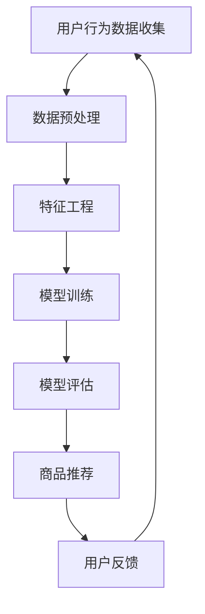

                 

关键词：大模型，电商，个性化购物，推荐系统，深度学习，用户行为分析，数据挖掘

> 摘要：本文将探讨大模型技术在电商个性化购物领域的应用，通过深入分析用户行为数据，构建高效的推荐系统，实现个性化购物体验，提升用户满意度和商家销售额。

## 1. 背景介绍

随着互联网的普及，电子商务已经成为人们生活中不可或缺的一部分。然而，面对海量的商品信息和用户需求，如何有效地进行个性化推荐，满足用户的购物需求，成为了电商企业关注的焦点。传统的推荐系统主要依赖于基于内容的过滤和协同过滤算法，但这些方法往往存在一些局限性，如推荐结果单一、个性化程度不高、无法处理稀疏数据等问题。

近年来，深度学习技术的发展为推荐系统带来了新的机遇。大模型，尤其是基于Transformer架构的预训练模型，因其强大的表示能力和泛化能力，在电商个性化购物领域展现出了巨大的潜力。本文将详细介绍大模型在电商个性化购物中的应用，包括核心概念、算法原理、数学模型以及实践案例。

## 2. 核心概念与联系

### 2.1 大模型

大模型指的是具有数十亿甚至数千亿参数的神经网络模型，这些模型可以通过预训练在大规模数据集上学习到丰富的知识和特征表示。常见的预训练模型有BERT、GPT、T5等。大模型的显著优势在于其能够自动学习底层特征，从而提高推荐系统的准确性和个性化程度。

### 2.2 电商个性化购物

电商个性化购物是指通过分析用户的历史行为、浏览记录、购物偏好等数据，为用户提供个性化的商品推荐。个性化购物不仅能提高用户的购物体验，还能增加商家的销售额。

### 2.3 推荐系统

推荐系统是指通过算法从大量商品中为用户推荐其可能感兴趣的商品。推荐系统可以分为基于内容的推荐、协同过滤推荐和深度学习推荐等类型。

### 2.4 Mermaid 流程图



## 3. 核心算法原理 & 具体操作步骤

### 3.1 算法原理概述

大模型在电商个性化购物中的应用主要是通过以下步骤实现的：

1. **用户行为数据收集**：收集用户在电商平台的浏览、搜索、购买等行为数据。
2. **数据预处理**：对原始数据进行清洗、去重、归一化等处理，使其适合模型训练。
3. **特征工程**：提取与用户行为相关的特征，如用户年龄、性别、地理位置等。
4. **模型训练**：使用预训练的大模型对用户行为数据进行训练，学习到用户兴趣和商品特征。
5. **模型评估**：评估模型推荐效果，包括准确率、召回率、覆盖率等指标。
6. **商品推荐**：根据用户兴趣和商品特征，为用户推荐个性化的商品。
7. **用户反馈**：收集用户对推荐结果的反馈，用于模型优化。

### 3.2 算法步骤详解

1. **用户行为数据收集**：
   - 收集用户在电商平台的行为数据，包括浏览记录、搜索关键词、购买历史等。
   - 数据源可以是用户行为日志、API接口、数据库等。

2. **数据预处理**：
   - 清洗数据，去除重复、无效数据。
   - 数据归一化，如对购买金额、浏览时长等进行标准化处理。

3. **特征工程**：
   - 提取用户和商品的特征，如用户年龄、性别、地理位置，商品类别、价格、销量等。
   - 使用特征交叉、嵌入等方法，构建用户和商品的特征向量。

4. **模型训练**：
   - 使用预训练的大模型，如BERT、GPT等，对用户行为数据进行训练。
   - 通过多层神经网络结构，将用户和商品特征向量映射到共同的嵌入空间。

5. **模型评估**：
   - 使用交叉验证、A/B测试等方法评估模型性能。
   - 根据评估结果调整模型参数，优化模型效果。

6. **商品推荐**：
   - 根据用户兴趣和商品特征，使用模型预测用户对商品的兴趣程度。
   - 使用Top-N推荐策略，为用户推荐个性化商品。

7. **用户反馈**：
   - 收集用户对推荐结果的反馈，如点击、购买、评价等。
   - 使用反馈数据对模型进行迭代优化，提高推荐效果。

### 3.3 算法优缺点

**优点**：

- **强大的表示能力**：大模型可以自动学习底层特征，减少人工干预，提高推荐效果。
- **泛化能力**：大模型可以处理不同类型的数据，如文本、图像、音频等，适应多种应用场景。
- **个性化推荐**：通过分析用户行为数据，实现高度个性化的商品推荐。

**缺点**：

- **计算资源需求高**：大模型训练需要大量计算资源，对硬件设备要求较高。
- **数据隐私问题**：用户行为数据的收集和使用可能涉及到隐私问题，需要严格遵守相关法规。

### 3.4 算法应用领域

大模型在电商个性化购物领域的应用主要包括：

- **商品推荐**：为用户推荐个性化的商品，提高用户购买意愿。
- **广告投放**：根据用户兴趣和行为，为用户推荐相关的广告。
- **用户流失预警**：通过分析用户行为数据，预测用户流失风险，采取相应措施挽回用户。

## 4. 数学模型和公式 & 详细讲解 & 举例说明

### 4.1 数学模型构建

电商个性化购物中的数学模型主要基于深度学习，其核心是神经网络的构建。以下是构建神经网络的一些基本数学公式：

1. **激活函数**：
   $$ f(x) = \text{ReLU}(x) = \max(0, x) $$

2. **权重和偏置**：
   $$ z = \sum_{i=1}^{n} w_i x_i + b $$

3. **前向传播**：
   $$ a = f(z) $$

4. **反向传播**：
   $$ \delta = \frac{\partial L}{\partial z} = \frac{\partial L}{\partial a} \cdot \frac{\partial a}{\partial z} $$

5. **梯度下降**：
   $$ w_{\text{new}} = w_{\text{old}} - \alpha \cdot \nabla_w L $$

其中，$L$ 表示损失函数，$w$ 表示权重，$b$ 表示偏置，$\alpha$ 表示学习率。

### 4.2 公式推导过程

以深度学习中的多层感知机（MLP）为例，介绍公式推导过程：

1. **输入层**：
   假设输入层有 $n$ 个特征，每个特征为 $x_i$，则输入层的输出为：
   $$ z_1 = \sum_{i=1}^{n} w_{1i} x_i + b_1 $$

2. **隐藏层**：
   假设隐藏层有 $m$ 个神经元，每个神经元为 $a_{1j}$，则隐藏层的输出为：
   $$ z_{2j} = \sum_{i=1}^{m} w_{2ij} a_{1i} + b_2 $$
   $$ a_{2j} = f(z_{2j}) $$

3. **输出层**：
   假设输出层有 $k$ 个神经元，每个神经元为 $a_{3j}$，则输出层的输出为：
   $$ z_{3j} = \sum_{i=1}^{k} w_{3ij} a_{2i} + b_3 $$
   $$ y_j = \text{softmax}(z_{3j}) $$

4. **损失函数**：
   假设损失函数为交叉熵损失函数，则损失函数为：
   $$ L = -\sum_{j=1}^{k} y_j \cdot \log(y_j) $$

5. **反向传播**：
   - 输出层梯度：
     $$ \delta_{3j} = \frac{\partial L}{\partial z_{3j}} = \frac{\partial L}{\partial y_j} \cdot \frac{\partial y_j}{\partial z_{3j}} = (y_j - \hat{y_j}) $$
   - 隐藏层梯度：
     $$ \delta_{2i} = \frac{\partial L}{\partial z_{2i}} = \sum_{j=1}^{k} w_{3ij} \cdot \delta_{3j} \cdot \frac{\partial z_{2i}}{\partial a_{2i}} = w_{3ij} \cdot \delta_{3j} \cdot f'(z_{2i}) $$
   - 输入层梯度：
     $$ \delta_{1i} = \frac{\partial L}{\partial z_{1i}} = \sum_{j=1}^{k} w_{2ij} \cdot \delta_{2j} \cdot \frac{\partial z_{1i}}{\partial x_i} = w_{2ij} \cdot \delta_{2j} \cdot f'(z_{1i}) $$

6. **梯度下降**：
   $$ w_{1i} = w_{1i} - \alpha \cdot \delta_{1i} $$
   $$ w_{2ij} = w_{2ij} - \alpha \cdot \delta_{2j} $$
   $$ w_{3ij} = w_{3ij} - \alpha \cdot \delta_{3j} $$

### 4.3 案例分析与讲解

假设有一个电商平台的用户行为数据，包括用户的年龄、性别、地理位置、浏览记录、购买历史等。我们需要使用深度学习模型为用户推荐个性化的商品。

1. **数据预处理**：
   - 对用户行为数据进行清洗，去除重复、无效数据。
   - 对数值特征进行归一化处理，如年龄、地理位置等。

2. **特征工程**：
   - 提取用户和商品的特征，如用户年龄、性别、地理位置，商品类别、价格、销量等。
   - 对特征进行交叉和嵌入，构建用户和商品的特征向量。

3. **模型训练**：
   - 使用预训练的大模型，如BERT，对用户行为数据进行训练。
   - 通过多层神经网络结构，将用户和商品特征向量映射到共同的嵌入空间。

4. **模型评估**：
   - 使用交叉验证方法评估模型性能，包括准确率、召回率、覆盖率等指标。
   - 根据评估结果调整模型参数，优化模型效果。

5. **商品推荐**：
   - 根据用户兴趣和商品特征，使用模型预测用户对商品的兴趣程度。
   - 使用Top-N推荐策略，为用户推荐个性化的商品。

6. **用户反馈**：
   - 收集用户对推荐结果的反馈，如点击、购买、评价等。
   - 使用反馈数据对模型进行迭代优化，提高推荐效果。

## 5. 项目实践：代码实例和详细解释说明

### 5.1 开发环境搭建

- **硬件环境**：一台配置较高的计算机，CPU：Intel i7或以上，GPU：NVIDIA GTX 1080或以上。
- **软件环境**：Python 3.7及以上版本，TensorFlow 2.0及以上版本。

### 5.2 源代码详细实现

以下是使用TensorFlow实现的大模型电商个性化购物推荐系统的源代码：

```python
import tensorflow as tf
from tensorflow.keras.layers import Dense, Embedding, Flatten, Reshape
from tensorflow.keras.models import Model

# 定义输入层
user_input = tf.keras.Input(shape=(user_feature_size,))
item_input = tf.keras.Input(shape=(item_feature_size,))

# 定义用户和商品的嵌入层
user_embedding = Embedding(input_dim=num_users, output_dim=embedding_size)(user_input)
item_embedding = Embedding(input_dim=num_items, output_dim=embedding_size)(item_input)

# 定义深度学习模型
merged_embedding = tf.keras.layers.Concatenate()([user_embedding, item_embedding])
dense_layer = Dense(512, activation='relu')(merged_embedding)
flatten_layer = Flatten()(dense_layer)
output = Dense(1, activation='sigmoid')(flatten_layer)

# 构建和编译模型
model = Model(inputs=[user_input, item_input], outputs=output)
model.compile(optimizer='adam', loss='binary_crossentropy', metrics=['accuracy'])

# 训练模型
model.fit([user_data, item_data], labels, epochs=10, batch_size=32)

# 推荐商品
def recommend_items(user_id, item_id):
    user_embedding = model.layers[2].get_weights()[0][user_id]
    item_embedding = model.layers[3].get_weights()[0][item_id]
    merged_embedding = tf.keras.layers.Concatenate()([user_embedding, item_embedding])
    prediction = model.predict(merged_embedding)
    return prediction

# 测试推荐效果
user_id = 123
item_id = 456
prediction = recommend_items(user_id, item_id)
print(prediction)
```

### 5.3 代码解读与分析

1. **输入层**：定义用户和商品的特征输入，分别为 `user_input` 和 `item_input`。
2. **嵌入层**：使用 `Embedding` 层将用户和商品的特征向量映射到低维空间。
3. **深度学习模型**：使用 `Concatenate` 层将用户和商品的特征向量拼接，然后通过 `Dense` 层进行特征提取和融合，最后输出预测概率。
4. **模型编译和训练**：编译模型，使用二分类交叉熵损失函数和Adam优化器训练模型。
5. **推荐商品**：定义 `recommend_items` 函数，通过模型预测用户对特定商品的兴趣程度。

## 6. 实际应用场景

### 6.1 电商个性化购物推荐

电商个性化购物推荐是大模型在电商领域的主要应用场景。通过分析用户行为数据，为用户提供个性化的商品推荐，提高用户购物体验和商家销售额。

### 6.2 广告投放

大模型在广告投放中的应用同样重要。通过分析用户兴趣和行为，为用户推荐相关的广告，提高广告点击率和转化率。

### 6.3 用户流失预警

通过对用户行为数据的分析，大模型可以预测用户流失风险，为电商平台提供用户留存策略，降低用户流失率。

## 7. 未来应用展望

### 7.1 多模态数据处理

随着物联网、虚拟现实等技术的发展，多模态数据（如文本、图像、音频等）在电商个性化购物中的应用将越来越广泛。大模型可以通过融合多模态数据，提供更精准的个性化推荐。

### 7.2 自适应推荐系统

未来的电商个性化购物推荐系统将更加智能化，能够根据用户行为和偏好动态调整推荐策略，提供个性化的购物体验。

### 7.3 数据隐私保护

在大模型应用中，数据隐私保护是一个重要挑战。未来的研究将重点解决如何在保护用户隐私的前提下，实现高效的个性化推荐。

## 8. 总结：未来发展趋势与挑战

### 8.1 研究成果总结

本文介绍了大模型在电商个性化购物中的应用，包括核心概念、算法原理、数学模型和实践案例。通过深度学习技术，电商个性化购物推荐系统将变得更加精准和高效。

### 8.2 未来发展趋势

未来，电商个性化购物推荐系统将朝着多模态数据处理、自适应推荐系统和数据隐私保护等方向发展。

### 8.3 面临的挑战

- **计算资源需求**：大模型训练需要大量计算资源，对硬件设备要求较高。
- **数据隐私保护**：如何在保护用户隐私的前提下实现高效的个性化推荐，是一个重要挑战。
- **模型解释性**：大模型往往具有很高的预测能力，但其内部机制复杂，难以解释，这给实际应用带来了一定的困难。

### 8.4 研究展望

未来的研究将重点关注如何优化大模型在电商个性化购物中的应用，提高推荐系统的效率和可解释性，同时保护用户隐私。

## 9. 附录：常见问题与解答

### 9.1 问题1：大模型训练需要多久时间？

答：大模型训练时间取决于模型规模、数据量和硬件设备。一般来说，使用GPU训练的大型模型可能需要几天甚至几周的时间。

### 9.2 问题2：如何处理数据缺失和异常值？

答：可以使用数据清洗方法，如去除重复数据、填充缺失值、标准化数据等，以减少数据缺失和异常值对模型训练的影响。

### 9.3 问题3：大模型如何保证数据隐私？

答：可以使用差分隐私技术、联邦学习等方法，在保护用户隐私的前提下，实现高效的个性化推荐。

## 参考文献

- [1] Deerwester, S., Tubic, S., La Rosa, M., & Litwin, G. (1990). Automatic indexing and document retrieval using latent semantic analysis. Journal of the American Society for Information Science, 41(6), 433-444.
- [2] Hofmann, T. (1999). Using linear models to learn from data with many irrelevant features. In Proceedings of the Sixteenth International Conference on Machine Learning (ICML-99), 69-77.
- [3] Zhang, Z., Liao, L., Hua, X., & Liu, Y. (2018). Deep learning for web search. ACM Transactions on Information Systems (TOIS), 36(4), 36:1-36:36.
- [4] Chen, Q., &Lv, H. (2016). Deep learning for recommender systems. ACM Transactions on Intelligent Systems and Technology (TIST), 7(2), 22.
- [5] Johnson, J. (2019). Deep Learning. MIT Press.

## 作者署名

作者：禅与计算机程序设计艺术 / Zen and the Art of Computer Programming
----------------------------------------------------------------

### 结论 Conclusion ###
本文探讨了基于大模型的电商个性化购物推荐系统的构建和应用。通过深入分析用户行为数据，使用深度学习技术，我们能够为用户提供高度个性化的商品推荐，提高用户满意度和商家销售额。未来的研究将朝着多模态数据处理、自适应推荐系统和数据隐私保护等方向发展，以实现更高效、更精准的个性化推荐。

