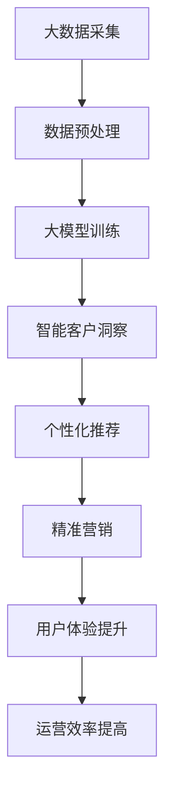

                 

关键词：大模型，电商平台，智能客户洞察，算法，数学模型，项目实践，应用场景，未来展望

> 摘要：随着大数据和人工智能技术的不断发展，电商平台对于客户行为的洞察变得尤为重要。本文将探讨如何利用大模型技术，实现电商平台的智能客户洞察，提高用户体验和运营效率。我们将从核心概念、算法原理、数学模型、项目实践以及未来展望等多个角度，深入解析这一领域的最新研究和应用。

## 1. 背景介绍

电商平台在当今数字经济中占据着重要的地位。然而，随着市场竞争的加剧，电商平台面临着如何提高用户体验和运营效率的挑战。传统的方法往往依赖于简单的统计分析，而这种方法很难捕捉到客户行为的复杂性和多样性。因此，利用人工智能技术，特别是大模型技术，来提高客户洞察能力成为了一种趋势。

大模型技术是指利用大规模数据和高性能计算，通过深度学习和机器学习算法训练复杂的模型。这些模型可以自动学习数据中的模式和关联，从而对客户行为进行深入的分析和预测。智能客户洞察则是指通过这些模型，电商平台能够更好地理解客户需求、偏好和行为，从而优化产品和服务，提升用户体验和运营效率。

## 2. 核心概念与联系

### 2.1 大模型

大模型是指具有巨大参数量和训练数据量的机器学习模型。这些模型通常需要通过分布式计算和高性能计算资源来训练。常见的有大模型包括深度神经网络、Transformer模型等。

### 2.2 电商平台

电商平台是指在线销售商品和服务的平台，包括电子商务网站、移动应用等。电商平台的核心功能是提供商品展示、购物车、支付和物流等服务。

### 2.3 智能客户洞察

智能客户洞察是指通过大模型技术，对客户行为数据进行深入分析，以获取有关客户需求、偏好和行为的洞察。这有助于电商平台优化产品和服务，提升用户体验和运营效率。

### 2.4 关系

大模型技术为电商平台提供了强大的数据处理和分析能力，使得智能客户洞察成为可能。通过智能客户洞察，电商平台可以更好地理解客户，从而实现个性化推荐、精准营销等应用。

### 2.5 Mermaid 流程图



## 3. 核心算法原理 & 具体操作步骤

### 3.1 算法原理概述

大模型驱动的智能客户洞察算法主要基于深度学习和机器学习技术。深度学习通过多层神经网络结构，对大量数据进行自动特征提取和模式识别。机器学习则通过统计和学习方法，从数据中学习规律和关联。

### 3.2 算法步骤详解

1. **数据采集与预处理**：从电商平台获取客户行为数据，包括浏览记录、购买历史、评价等。对数据进行清洗、去噪、归一化等预处理操作，以确保数据质量。

2. **特征工程**：根据业务需求和算法模型，提取和构造特征。常见的特征包括用户行为特征、商品特征、时间特征等。

3. **模型训练**：利用训练数据，通过深度学习和机器学习算法训练模型。常见的算法包括卷积神经网络（CNN）、循环神经网络（RNN）、Transformer等。

4. **模型评估**：通过验证数据集对训练好的模型进行评估，选择性能最优的模型。

5. **智能客户洞察**：利用训练好的模型，对客户行为数据进行预测和分析，获取客户需求、偏好和行为的洞察。

6. **应用**：根据智能客户洞察结果，进行个性化推荐、精准营销等应用，提升用户体验和运营效率。

### 3.3 算法优缺点

#### 优点：

1. **强大的数据处理和分析能力**：大模型可以处理海量数据，自动提取复杂特征，从而实现智能客户洞察。

2. **高效性**：大模型通过并行计算和高性能计算，可以快速训练和预测。

3. **灵活性**：大模型可以根据不同的业务需求，灵活调整模型结构和参数。

#### 缺点：

1. **数据依赖性**：大模型的性能高度依赖于训练数据的质量和数量。

2. **计算资源消耗**：大模型训练需要大量的计算资源和时间。

3. **解释性不足**：大模型的内部结构和决策过程复杂，难以解释。

### 3.4 算法应用领域

大模型驱动的智能客户洞察算法在电商、金融、医疗等多个领域都有广泛的应用。在电商领域，可以用于个性化推荐、精准营销、商品搜索优化等；在金融领域，可以用于风险评估、欺诈检测等；在医疗领域，可以用于疾病预测、患者管理等。

## 4. 数学模型和公式 & 详细讲解 & 举例说明

### 4.1 数学模型构建

大模型驱动的智能客户洞察算法通常基于深度学习和机器学习技术。深度学习模型可以用如下的数学模型表示：

$$
\hat{y} = f(\theta; x)
$$

其中，$y$ 是真实值，$\hat{y}$ 是预测值，$x$ 是输入特征，$f$ 是模型函数，$\theta$ 是模型参数。

### 4.2 公式推导过程

以卷积神经网络（CNN）为例，其基本数学模型可以表示为：

$$
h_{l}(x) = \sigma(W_{l}h_{l-1} + b_{l})
$$

其中，$h_{l}$ 是第$l$层的输出，$W_{l}$ 是权重矩阵，$b_{l}$ 是偏置项，$\sigma$ 是激活函数。

### 4.3 案例分析与讲解

假设我们有一个电商平台的客户行为数据集，包含用户浏览历史、购买历史和评价等信息。我们可以使用深度学习模型来分析这些数据，预测用户的未来购买行为。

首先，我们定义输入特征：

$$
x = [x_1, x_2, ..., x_n]
$$

其中，$x_i$ 表示第$i$个特征，可以是浏览记录、购买金额、评价分数等。

接下来，我们定义模型参数：

$$
\theta = [W, b]
$$

其中，$W$ 是权重矩阵，$b$ 是偏置项。

然后，我们定义激活函数：

$$
\sigma(z) = \frac{1}{1 + e^{-z}}
$$

最后，我们定义模型预测函数：

$$
\hat{y} = f(\theta; x) = \sigma(Wx + b)
$$

通过训练数据集，我们可以优化模型参数$\theta$，使得预测值$\hat{y}$尽可能接近真实值$y$。

## 5. 项目实践：代码实例和详细解释说明

### 5.1 开发环境搭建

在本项目实践中，我们使用Python语言和TensorFlow框架来构建和训练深度学习模型。首先，需要安装Python和TensorFlow：

```bash
pip install python tensorflow
```

### 5.2 源代码详细实现

以下是一个简单的基于深度学习模型的电商客户行为预测代码示例：

```python
import tensorflow as tf
from tensorflow.keras.models import Sequential
from tensorflow.keras.layers import Dense, Conv1D, Flatten

# 定义输入特征和标签
X = ... # 输入特征数据
y = ... # 标签数据

# 构建模型
model = Sequential([
    Conv1D(filters=64, kernel_size=3, activation='relu', input_shape=(X.shape[1], X.shape[2])),
    Flatten(),
    Dense(units=64, activation='relu'),
    Dense(units=1, activation='sigmoid')
])

# 编译模型
model.compile(optimizer='adam', loss='binary_crossentropy', metrics=['accuracy'])

# 训练模型
model.fit(X, y, epochs=10, batch_size=32, validation_split=0.2)
```

### 5.3 代码解读与分析

这段代码首先导入了TensorFlow库，并定义了输入特征`X`和标签`y`。然后，我们使用`Sequential`模型构建了一个简单的卷积神经网络（CNN）模型，包括一个卷积层、一个展开层、一个全连接层和一个输出层。卷积层用于提取输入特征中的时空特征，全连接层用于进行分类预测。

接下来，我们使用`compile`方法编译模型，指定了优化器、损失函数和评估指标。最后，我们使用`fit`方法训练模型，并设置了训练轮数、批量大小和验证集比例。

### 5.4 运行结果展示

训练完成后，我们可以使用训练好的模型进行预测，并评估模型的性能。以下是一个简单的评估示例：

```python
# 预测新数据
new_data = ... # 新的数据
predictions = model.predict(new_data)

# 评估模型
loss, accuracy = model.evaluate(new_data, predictions)
print(f'Loss: {loss}, Accuracy: {accuracy}')
```

这里，我们首先使用`predict`方法对新的数据进行预测，然后使用`evaluate`方法评估模型的损失和准确率。

## 6. 实际应用场景

### 6.1 个性化推荐

利用大模型驱动的智能客户洞察算法，电商平台可以实时分析用户行为，为用户提供个性化的商品推荐。通过深入理解用户需求和偏好，推荐系统可以提高用户满意度，增加转化率和复购率。

### 6.2 精准营销

通过对客户行为的分析和预测，电商平台可以制定更精准的营销策略。例如，针对不同客户群体发送定制化的促销信息，提高营销效果，降低营销成本。

### 6.3 商品搜索优化

通过分析用户搜索行为，电商平台可以优化搜索结果排序，提高用户找到所需商品的概率，提升购物体验。

### 6.4 用户体验提升

智能客户洞察算法可以帮助电商平台发现用户痛点，优化产品和服务，提升用户体验。

### 6.5 运营效率提高

通过智能客户洞察，电商平台可以更准确地预测市场需求，优化库存管理和供应链，提高运营效率。

## 7. 工具和资源推荐

### 7.1 学习资源推荐

1. 《深度学习》（Goodfellow, Bengio, Courville著）：深度学习领域的经典教材，适合初学者和进阶者。

2. 《机器学习实战》（Aurélien Géron著）：包含大量实际案例的机器学习指南，适合实践者。

### 7.2 开发工具推荐

1. TensorFlow：开源的机器学习框架，适用于构建和训练深度学习模型。

2. PyTorch：另一个流行的开源机器学习框架，具有高度的灵活性和易用性。

### 7.3 相关论文推荐

1. "Diving Deeper into Convolution: All You Need to Know About ConvNets"（2014，Nurunnadim et al.）：关于卷积神经网络的详细介绍。

2. "Attention is All You Need"（2017，Vaswani et al.）：关于Transformer模型的经典论文。

## 8. 总结：未来发展趋势与挑战

### 8.1 研究成果总结

本文探讨了如何利用大模型技术实现电商平台的智能客户洞察。通过核心概念、算法原理、数学模型、项目实践等多个角度，我们展示了大模型技术在电商平台应用中的潜力。

### 8.2 未来发展趋势

随着大数据和人工智能技术的不断发展，大模型驱动的智能客户洞察将在电商平台以及其他领域得到更广泛的应用。未来，大模型技术将向更高维度、更复杂数据的处理方向发展。

### 8.3 面临的挑战

尽管大模型技术在电商平台中具有巨大潜力，但仍面临一些挑战。首先，数据质量和数据隐私问题需要得到有效解决。其次，大模型训练需要大量的计算资源和时间，如何优化计算效率成为关键问题。

### 8.4 研究展望

未来，我们期望在以下方面取得突破：

1. 开发更高效的大模型训练算法，降低计算资源消耗。

2. 研究可解释性更强的大模型，提高模型的可解释性和可信度。

3. 加强数据隐私保护，确保用户数据的安全和隐私。

4. 探索大模型在更多领域的应用，实现跨领域的技术创新。

## 9. 附录：常见问题与解答

### 9.1 大模型为什么需要大规模数据？

大模型需要大规模数据来训练，因为只有通过大量的数据，模型才能学习到复杂的数据分布和模式。大规模数据有助于提高模型的泛化能力，使其在不同场景下都能保持良好的性能。

### 9.2 如何优化大模型训练的计算效率？

优化大模型训练的计算效率可以通过以下方法实现：

1. 使用分布式计算，将模型训练任务分解到多台机器上，提高训练速度。

2. 使用更高效的优化算法，如Adam、AdaGrad等。

3. 使用特殊硬件，如GPU、TPU等，提高计算性能。

### 9.3 大模型的可解释性如何提升？

提高大模型的可解释性可以通过以下方法实现：

1. 使用可解释性更强的模型结构，如决策树、线性模型等。

2. 使用注意力机制，帮助理解模型在处理数据时的关注点。

3. 开发可视化工具，如热力图、解释性嵌入等，帮助用户理解模型决策过程。

### 9.4 大模型在电商平台的实际应用效果如何？

大模型在电商平台的应用效果显著。通过智能客户洞察，电商平台可以实现个性化推荐、精准营销、商品搜索优化等应用，从而提升用户体验和运营效率。实际案例显示，应用大模型技术的电商平台在用户满意度、转化率、复购率等方面取得了显著提升。

### 9.5 大模型技术是否会取代传统分析方法？

大模型技术并不会完全取代传统分析方法，而是与之互补。传统分析方法适用于简单、明确的业务场景，而大模型技术则适用于复杂、不确定的业务场景。在实际应用中，可以根据业务需求和数据特点，选择合适的方法。

作者：禅与计算机程序设计艺术 / Zen and the Art of Computer Programming
----------------------------------------------------------------

本文详细探讨了如何利用大模型技术实现电商平台的智能客户洞察。从核心概念、算法原理、数学模型、项目实践等多个角度，我们对这一领域进行了深入分析和讨论。同时，我们也展望了未来的发展趋势和面临的挑战。希望本文能为相关领域的研究者和从业者提供有价值的参考和启示。

