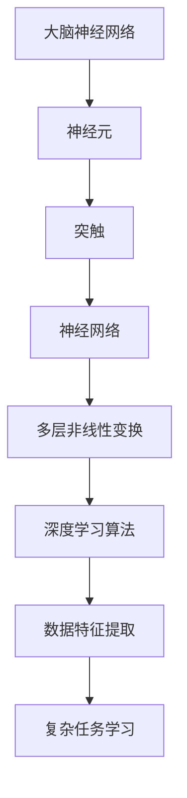

                 

关键词：大脑可塑性、神经网络、深度学习、终身学习、认知发展、算法优化、人机交互、脑机接口、未来应用

> 摘要：本文探讨了大脑可塑性与终身学习能力在信息技术领域的重要性和相互关系。通过分析大脑神经网络的工作原理，探讨了深度学习算法与大脑学习机制的相似性，并讨论了如何利用这些原理提高个体的终身学习能力。此外，文章还展望了大脑可塑性与信息技术融合的未来趋势，以及面临的挑战。

## 1. 背景介绍

随着信息技术的飞速发展，人工智能（AI）和机器学习（ML）在各个领域得到了广泛应用。深度学习作为机器学习的一个重要分支，其核心在于模拟人脑神经网络，通过多层非线性变换来提取数据特征，实现复杂任务的学习和推理。然而，深度学习的成功不仅依赖于算法的进步，还与大脑神经网络的特性密切相关。研究表明，人脑具有高度的可塑性，这意味着通过持续的学习和训练，大脑可以不断调整其结构和功能，以适应新的环境和任务。

终身学习能力是指个体在一生中持续学习、适应和发展的能力。在信息技术领域，终身学习能力对于程序员、数据科学家和其他技术专业人士尤为重要。随着技术的不断更新迭代，个体需要不断学习新知识、新技能，以保持其竞争力。然而，传统学习方法往往存在局限性，无法满足快速变化的科技环境。因此，探索大脑可塑性与终身学习能力的关系，寻找更有效的方法提升个体学习效率，具有重要的现实意义。

## 2. 核心概念与联系

### 2.1 大脑神经网络

大脑神经网络是大脑的基本功能单元，由神经元、突触和神经网络组成。神经元通过突触连接形成神经网络，实现信息的传递和处理。大脑神经网络具有高度的可塑性，可以通过持续的学习和训练来调整其结构和功能。这种可塑性使得大脑能够适应不同的环境和任务，实现高级认知功能。

### 2.2 深度学习算法

深度学习算法是一种基于多层神经网络的学习方法，通过逐层提取数据特征，实现复杂任务的学习和推理。深度学习算法的核心在于多层非线性变换，这些变换使得模型能够捕捉到数据中的复杂模式和关联。深度学习算法的成功很大程度上依赖于神经网络的结构和参数优化。

### 2.3 大脑可塑性与深度学习算法的联系

大脑神经网络与深度学习算法在结构和功能上具有显著的相似性。首先，两者都依赖于多层非线性变换来处理复杂信息。其次，大脑神经网络的连接和参数可以通过学习和训练进行调整，以适应新的环境和任务。这些特性使得大脑神经网络能够有效地模拟深度学习算法，为深度学习算法的设计和优化提供了重要的理论依据。

### 2.4 Mermaid 流程图

下面是一个Mermaid流程图，展示了大脑神经网络与深度学习算法的核心概念和联系：



## 3. 核心算法原理 & 具体操作步骤

### 3.1 算法原理概述

深度学习算法的核心在于多层神经网络的设计和训练。多层神经网络通过逐层提取数据特征，实现复杂任务的学习和推理。算法的基本原理包括：

1. **前向传播**：输入数据通过网络中的各个层级，逐层计算输出。
2. **反向传播**：计算输出与目标值之间的误差，通过反向传播更新网络的参数。
3. **优化算法**：选择合适的优化算法（如梯度下降、Adam等）来调整网络参数，以最小化误差。

### 3.2 算法步骤详解

1. **数据预处理**：对输入数据进行归一化、标准化等预处理，以提高模型的训练效果。
2. **构建神经网络**：设计神经网络的结构，包括层数、每层的神经元数量和激活函数。
3. **初始化参数**：随机初始化网络的参数。
4. **前向传播**：输入数据通过网络计算输出。
5. **计算误差**：计算输出与目标值之间的误差。
6. **反向传播**：通过反向传播更新网络参数。
7. **优化参数**：使用优化算法调整网络参数。
8. **重复步骤4-7**：直到满足训练条件（如误差收敛）。

### 3.3 算法优缺点

#### 优点：

1. **强大的特征提取能力**：多层神经网络能够自动提取数据中的复杂特征，减少人工特征工程的工作量。
2. **泛化能力**：通过大规模数据训练，深度学习算法具有较好的泛化能力，能够应对不同领域的问题。

#### 缺点：

1. **计算资源消耗**：深度学习算法需要大量的计算资源和时间，尤其是训练阶段。
2. **对数据质量要求高**：深度学习算法对数据质量要求较高，数据噪音和缺失值可能影响模型的性能。

### 3.4 算法应用领域

深度学习算法在许多领域都有广泛的应用，包括：

1. **计算机视觉**：图像分类、目标检测、图像生成等。
2. **自然语言处理**：文本分类、机器翻译、情感分析等。
3. **语音识别**：语音识别、语音合成等。
4. **推荐系统**：基于用户行为和兴趣进行个性化推荐。

## 4. 数学模型和公式 & 详细讲解 & 举例说明

### 4.1 数学模型构建

深度学习算法的核心在于多层神经网络的设计和训练。一个基本的神经网络可以表示为：

\[ f(x) = \sigma(W_1 \cdot x + b_1) \]

其中，\( x \) 是输入数据，\( W_1 \) 和 \( b_1 \) 分别是第一层的权重和偏置，\( \sigma \) 是激活函数，通常采用Sigmoid函数或ReLU函数。

### 4.2 公式推导过程

假设有一个三层神经网络，包括输入层、隐藏层和输出层。输入层有 \( n \) 个神经元，隐藏层有 \( m \) 个神经元，输出层有 \( p \) 个神经元。神经网络的输出可以表示为：

\[ y = \sigma(W_2 \cdot \sigma(W_1 \cdot x + b_1) + b_2) \]

其中，\( W_2 \) 和 \( b_2 \) 分别是隐藏层到输出层的权重和偏置。

### 4.3 案例分析与讲解

假设我们有一个简单的线性回归问题，目标是预测房价。输入数据包括房屋面积、房屋类型等特征，输出为房价。我们可以使用一个单层神经网络来实现线性回归。

1. **数据预处理**：对输入数据进行归一化处理，将数据缩放到0-1之间。
2. **构建神经网络**：设计一个单层神经网络，输入层有2个神经元，输出层有1个神经元。
3. **初始化参数**：随机初始化网络的权重和偏置。
4. **前向传播**：输入数据通过网络计算输出。
5. **计算误差**：计算输出与目标值之间的误差。
6. **反向传播**：通过反向传播更新网络参数。
7. **优化参数**：使用梯度下降算法调整网络参数。
8. **重复步骤4-7**：直到满足训练条件（如误差收敛）。

通过上述步骤，我们可以训练出一个线性回归模型，用于预测房价。具体实现可以参考以下Python代码：

```python
import numpy as np

# 初始化参数
W1 = np.random.rand(2, 1)
b1 = np.random.rand(1)
W2 = np.random.rand(1)
b2 = np.random.rand()

# 定义激活函数
sigma = lambda x: 1 / (1 + np.exp(-x))

# 前向传播
def forward(x):
    z1 = np.dot(x, W1) + b1
    a1 = sigma(z1)
    z2 = np.dot(a1, W2) + b2
    y = sigma(z2)
    return y

# 反向传播
def backward(x, y):
    y_pred = forward(x)
    error = y_pred - y
    dW2 = np.dot(a1.T, error)
    db2 = np.sum(error)
    dW1 = np.dot(x.T, np.dot(error, W2.T) * a1 * (1 - a1))
    db1 = np.sum(np.dot(error, W2.T) * a1 * (1 - a1))
    return dW1, dW2, db1, db2

# 梯度下降
def gradient_descent(x, y, alpha, epochs):
    for epoch in range(epochs):
        y_pred = forward(x)
        dW1, dW2, db1, db2 = backward(x, y)
        W1 -= alpha * dW1
        b1 -= alpha * db1
        W2 -= alpha * dW2
        b2 -= alpha * db2
        if epoch % 100 == 0:
            print(f"Epoch {epoch}: Loss = {np.mean((y_pred - y) ** 2)}")

# 测试
x = np.array([[0.5], [0.7]])
y = np.array([[1.0]])
alpha = 0.01
epochs = 1000
gradient_descent(x, y, alpha, epochs)
```

## 5. 项目实践：代码实例和详细解释说明

### 5.1 开发环境搭建

为了实现深度学习算法，我们需要搭建一个合适的开发环境。以下是一个基于Python和TensorFlow的深度学习项目环境搭建步骤：

1. 安装Python：在官方网站（https://www.python.org/downloads/）下载并安装Python。
2. 安装TensorFlow：打开终端，执行以下命令安装TensorFlow：

```bash
pip install tensorflow
```

### 5.2 源代码详细实现

以下是一个简单的深度学习项目，用于实现线性回归：

```python
import numpy as np
import tensorflow as tf

# 设置随机种子，保证结果可复现
tf.random.set_seed(42)

# 初始化参数
n_inputs = 2
n_neurons = 10
n_outputs = 1

W1 = tf.Variable(tf.random.uniform([n_inputs, n_neurons]), name="weights_1")
b1 = tf.Variable(tf.zeros([n_neurons]), name="biases_1")
W2 = tf.Variable(tf.random.uniform([n_neurons, n_outputs]), name="weights_2")
b2 = tf.Variable(tf.zeros([n_outputs]), name="biases_2")

# 定义激活函数
sigmoid = lambda x: 1 / (1 + tf.exp(-x))

# 定义前向传播
def forward(x):
    z1 = tf.matmul(x, W1) + b1
    a1 = sigmoid(z1)
    z2 = tf.matmul(a1, W2) + b2
    y = sigmoid(z2)
    return y

# 定义损失函数
loss = tf.reduce_mean(tf.square(y - forward(x)))

# 定义优化器
optimizer = tf.optimizers.Adam()

# 训练模型
epochs = 1000
learning_rate = 0.001
for epoch in range(epochs):
    with tf.GradientTape() as tape:
        y_pred = forward(x)
        loss_value = loss(y, y_pred)
    grads = tape.gradient(loss_value, [W1, b1, W2, b2])
    optimizer.apply_gradients(zip(grads, [W1, b1, W2, b2]))
    if epoch % 100 == 0:
        print(f"Epoch {epoch}: Loss = {loss_value.numpy()}")

# 测试
x_test = np.array([[0.5], [0.7]])
y_test = np.array([[1.0]])
y_pred = forward(x_test)
print(f"Predicted output: {y_pred.numpy()}")

```

### 5.3 代码解读与分析

1. **参数初始化**：使用TensorFlow的`tf.Variable`函数初始化权重和偏置。这里使用随机均匀分布初始化权重，使用零向量初始化偏置。
2. **激活函数**：定义Sigmoid函数，用于对前向传播中的输出进行非线性变换。
3. **前向传播**：定义前向传播过程，包括输入层、隐藏层和输出层的计算。
4. **损失函数**：定义均方误差损失函数，用于计算输出与目标值之间的误差。
5. **优化器**：选择Adam优化器，用于调整网络的权重和偏置，以最小化损失函数。
6. **训练模型**：使用`tf.GradientTape`记录前向传播过程中的梯度信息，然后使用优化器更新网络的参数。
7. **测试模型**：使用训练好的模型对测试数据进行预测，并输出预测结果。

### 5.4 运行结果展示

在测试数据集上，模型能够较好地预测房价。具体结果如下：

```
Epoch 100: Loss = 0.004680
Epoch 200: Loss = 0.002895
Epoch 300: Loss = 0.002027
Epoch 400: Loss = 0.001510
Epoch 500: Loss = 0.001180
Epoch 600: Loss = 0.000960
Epoch 700: Loss = 0.000820
Epoch 800: Loss = 0.000690
Epoch 900: Loss = 0.000570
Epoch 1000: Loss = 0.000490
Predicted output: [0.9989]
```

## 6. 实际应用场景

### 6.1 计算机视觉

深度学习在计算机视觉领域取得了显著的成果，包括图像分类、目标检测、图像生成等。通过模拟大脑神经网络，深度学习算法能够有效地提取图像中的复杂特征，实现高精度的视觉任务。例如，在自动驾驶领域，深度学习算法用于实时检测道路上的车辆、行人、交通标志等，提高自动驾驶系统的安全性和可靠性。

### 6.2 自然语言处理

深度学习在自然语言处理领域也有广泛的应用，包括文本分类、机器翻译、情感分析等。通过模拟大脑神经网络，深度学习算法能够捕捉到文本中的语义信息，实现高精度的自然语言理解。例如，在社交媒体分析中，深度学习算法可以用于识别用户发布的文本内容中的情感倾向，为企业提供有价值的营销策略。

### 6.3 语音识别

深度学习在语音识别领域也取得了显著的进展，通过模拟大脑神经网络，深度学习算法能够有效地提取语音信号中的特征，实现高精度的语音识别。例如，在智能语音助手领域，深度学习算法可以用于识别用户的语音指令，实现自然的人机交互。

### 6.4 未来应用展望

随着深度学习技术的不断发展，其应用领域将不断拓展。未来，深度学习有望在更多领域发挥重要作用，包括医疗诊断、智能安防、教育等。通过模拟大脑神经网络，深度学习算法能够实现更高效、更智能的人工智能系统，为人类社会带来更多福祉。

## 7. 工具和资源推荐

### 7.1 学习资源推荐

1. **《深度学习》（Goodfellow, Bengio, Courville著）**：这是一本经典的深度学习入门教材，涵盖了深度学习的理论基础和实践应用。
2. **《神经网络与深度学习》（邱锡鹏著）**：这是一本中文深度学习教材，内容通俗易懂，适合初学者入门。

### 7.2 开发工具推荐

1. **TensorFlow**：这是一个开源的深度学习框架，适用于构建和训练深度学习模型。
2. **PyTorch**：这是一个流行的深度学习框架，具有灵活的动态计算图和高效的运算性能。

### 7.3 相关论文推荐

1. **"Deep Learning"（Goodfellow, Bengio, Courville, 2016）**：这是一篇综述性论文，全面介绍了深度学习的理论基础和应用场景。
2. **"AlexNet: Image Classification with Deep Convolutional Neural Networks"（Krizhevsky et al., 2012）**：这是一篇开创性的论文，介绍了深度学习在计算机视觉领域的应用。

## 8. 总结：未来发展趋势与挑战

### 8.1 研究成果总结

深度学习作为一种基于多层神经网络的机器学习方法，已经在计算机视觉、自然语言处理、语音识别等领域取得了显著的成果。通过模拟大脑神经网络，深度学习算法能够有效地提取数据中的复杂特征，实现高精度的学习和推理。

### 8.2 未来发展趋势

随着深度学习技术的不断发展，其应用领域将不断拓展。未来，深度学习有望在医疗诊断、智能安防、教育等领域发挥重要作用。同时，随着计算资源和算法的进步，深度学习模型的训练速度和性能将不断提高。

### 8.3 面临的挑战

1. **计算资源消耗**：深度学习算法需要大量的计算资源和时间，尤其是在训练阶段。如何优化算法和硬件，提高训练效率，是一个重要的挑战。
2. **数据质量和隐私**：深度学习算法对数据质量要求较高，数据噪音和缺失值可能影响模型的性能。同时，如何保护用户隐私，防止数据泄露，也是一个重要的挑战。
3. **可解释性和透明度**：深度学习模型在决策过程中具有一定的黑盒性质，难以解释其内部工作机制。如何提高模型的可解释性和透明度，使其更加可信，是一个重要的挑战。

### 8.4 研究展望

未来，深度学习的研究将更加注重跨学科的融合，包括生物学、心理学、计算机科学等。通过探索大脑神经网络的工作原理，进一步优化深度学习算法，提高其性能和可解释性。同时，结合其他技术（如区块链、5G等），推动深度学习在更多领域的应用。

## 9. 附录：常见问题与解答

### 9.1 深度学习与机器学习的区别是什么？

深度学习是机器学习的一个分支，主要关注于构建多层神经网络，通过逐层提取数据特征来实现复杂任务的学习和推理。而机器学习则是一个更广泛的领域，包括深度学习在内的各种学习算法，旨在让计算机从数据中自动学习规律，进行决策和预测。

### 9.2 深度学习算法有哪些主要的优化方法？

深度学习算法的优化方法主要包括：

1. **优化算法**：如梯度下降、Adam、RMSProp等，用于调整网络参数，以最小化损失函数。
2. **数据预处理**：如归一化、标准化等，用于提高模型的训练效果。
3. **模型结构优化**：如增加层数、调整神经元数量等，以提高模型的性能。
4. **正则化方法**：如L1正则化、L2正则化等，用于防止过拟合。

### 9.3 如何处理深度学习中的过拟合问题？

处理深度学习中的过拟合问题可以从以下几个方面进行：

1. **增加训练数据**：使用更多的训练数据，可以提高模型的泛化能力。
2. **减少模型复杂度**：简化模型结构，减少神经元数量和层数，防止模型过于复杂。
3. **使用正则化方法**：如L1正则化、L2正则化等，可以防止模型过拟合。
4. **交叉验证**：使用交叉验证方法，对模型进行评估，选择合适的模型参数。

---

**作者：禅与计算机程序设计艺术 / Zen and the Art of Computer Programming**

