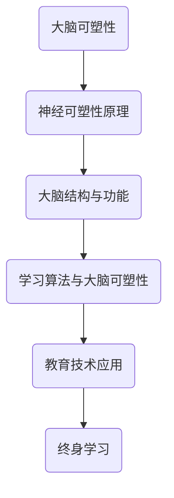

                 

关键词：大脑可塑性、终身学习、认知能力、神经可塑性、学习算法、教育技术

> 摘要：本文将探讨大脑的可塑性及其在终身学习中的作用，分析当前的教育技术和学习算法如何影响大脑的发展。通过阐述大脑的神经可塑性原理、关键的学习策略和未来的发展趋势，本文旨在为读者提供一个全面的视角，帮助他们在复杂多变的科技时代中不断提升自身的学习能力和认知水平。

## 1. 背景介绍

随着科技的发展，我们的生活和工作环境发生了翻天覆地的变化。知识的更新速度越来越快，人工智能、大数据、区块链等新兴技术层出不穷，对个人的终身学习能力提出了更高的要求。然而，传统的教育模式往往注重知识传授，而忽视了学习能力的培养。在此背景下，大脑的可塑性和终身学习的重要性日益凸显。

大脑的可塑性是指大脑在外界刺激下能够发生结构和功能的改变。这一特性使得大脑能够适应新的环境和任务，也为我们通过学习和训练提升认知能力提供了可能。然而，大脑的可塑性并非一成不变，它受到多种因素的影响，包括年龄、生理状态、心理状态和环境因素等。

终身学习是指个人在整个生命过程中持续不断地获取新知识、新技能的过程。随着工作场景和个人兴趣的变化，终身学习已经成为适应社会发展的重要手段。大脑的可塑性为终身学习提供了基础，而有效的学习策略和工具则能够最大化地发挥这一基础的作用。

## 2. 核心概念与联系

### 2.1 神经可塑性原理

神经可塑性是指神经元和神经网络在结构和功能上的可塑性。它包括结构可塑性（如突触的形成和消失）和功能可塑性（如神经通路的改变）。神经可塑性是大脑适应环境变化的关键机制，也是学习和记忆的基础。

神经可塑性受到多种因素的调控，包括神经递质的释放、基因表达的变化和神经元的生长等。此外，神经可塑性也受到外界刺激的显著影响。例如，重复性的刺激可以增强突触间的连接，而缺乏刺激可能导致突触的退化。

### 2.2 大脑结构与功能

大脑是复杂的信息处理中心，其结构包括多个功能区，如大脑皮层、海马体和纹状体等。每个功能区都有特定的功能，如感知、运动、记忆和决策等。大脑的功能与其结构密切相关，不同区域之间的协作是实现高级认知功能的基础。

随着神经可塑性的发生，大脑的结构和功能也在不断调整。例如，在学习和训练过程中，大脑某些区域的活动增强，而其他区域的活动减弱。这种调整有助于提高学习效率，并优化认知功能。

### 2.3 学习算法与大脑可塑性

学习算法是计算机科学中的重要工具，其基本原理与大脑的神经可塑性有许多相似之处。学习算法通过不断调整参数来优化模型，类似于大脑通过突触的强化和退化来实现学习和记忆。

当前，许多学习算法已经被应用于教育技术中，如自适应学习系统、智能辅导系统和个性化学习平台等。这些系统利用大数据分析和人工智能技术，根据学习者的行为和反馈动态调整学习内容和方式，从而提高学习效果。

### 2.4 Mermaid 流程图



## 3. 核心算法原理 & 具体操作步骤

### 3.1 算法原理概述

大脑可塑性的核心算法原理可以概括为：通过外部刺激和内部反馈，实现神经网络的调整和优化。这一过程包括以下几个关键步骤：

1. 初始状态：确定大脑的初始神经网络结构和参数。
2. 刺激输入：根据学习目标和任务需求，输入相应的刺激信号。
3. 反馈调整：通过学习算法，根据刺激信号的反馈，调整神经网络的结构和参数。
4. 持续优化：在不断的刺激和反馈过程中，神经网络逐渐优化，达到更好的学习和记忆效果。

### 3.2 算法步骤详解

1. **初始状态**：首先，需要确定大脑的初始神经网络结构和参数。这可以通过对大脑神经元活动的观测和分析来实现。例如，使用脑电图（EEG）或功能性磁共振成像（fMRI）等技术，捕捉大脑神经元的活动模式。

2. **刺激输入**：根据学习目标和任务需求，设计相应的刺激信号。刺激信号可以是视觉、听觉、触觉等感官刺激，也可以是语言、文字等抽象刺激。刺激信号的设计应考虑学习者的兴趣和需求，以提高学习效果。

3. **反馈调整**：通过学习算法，对神经网络的结构和参数进行调整。学习算法可以根据多种原则进行设计，如最小化误差、最大化奖励等。常见的学习算法包括反向传播算法、梯度下降算法和强化学习算法等。

4. **持续优化**：在不断的刺激和反馈过程中，神经网络逐渐优化，达到更好的学习和记忆效果。这一过程可以持续进行，以适应不断变化的学习目标和任务需求。

### 3.3 算法优缺点

**优点**：

- 提高学习效率：通过外部刺激和内部反馈，神经网络能够快速适应新的环境和任务，提高学习效率。
- 个性化学习：根据学习者的兴趣和需求，自适应地调整学习内容和方式，实现个性化学习。
- 持续优化：随着刺激和反馈的持续进行，神经网络不断优化，提高学习和记忆效果。

**缺点**：

- 复杂性：大脑的可塑性算法涉及多个环节和参数，实现较为复杂。
- 数据需求：算法的输入和反馈需要大量数据支持，数据质量对学习效果有重要影响。
- 学习成本：算法设计和实施需要较高的技术门槛，对学习者的学习成本较高。

### 3.4 算法应用领域

大脑可塑性算法在多个领域具有广泛的应用前景，包括：

- 教育领域：通过自适应学习系统和智能辅导系统，提高学习效果和个性化学习体验。
- 医疗领域：通过脑机接口技术，辅助治疗神经疾病和康复训练。
- 人机交互领域：通过个性化交互设计，提高用户体验和交互效果。
- 认知科学领域：通过研究大脑的可塑性机制，深化对人类认知过程的理解。

## 4. 数学模型和公式 & 详细讲解 & 举例说明

### 4.1 数学模型构建

大脑可塑性的数学模型可以基于神经网络和机器学习算法构建。以下是一个简化的数学模型：

$$
\text{学习效果} = f(\text{初始状态}, \text{刺激输入}, \text{学习算法}, \text{反馈调整})
$$

其中，$f$ 表示学习效果函数，$\text{初始状态}$ 表示大脑的初始神经网络结构和参数，$\text{刺激输入}$ 表示输入的刺激信号，$\text{学习算法}$ 表示使用的算法，$\text{反馈调整}$ 表示根据反馈进行调整的过程。

### 4.2 公式推导过程

大脑可塑性的公式推导涉及多个环节，包括神经网络的结构设计、学习算法的选择和参数调整等。以下是一个简化的推导过程：

1. **神经网络结构设计**：根据学习目标和任务需求，设计适当的神经网络结构。神经网络由多个层次和神经元组成，每个神经元接收来自其他神经元的输入信号，并产生输出信号。
2. **学习算法选择**：根据学习目标和任务需求，选择合适的学习算法。学习算法可以根据最小化误差、最大化奖励等原则进行调整。
3. **参数调整**：根据反馈信号，调整神经网络的结构和参数。参数调整的过程可以基于梯度下降、反向传播等算法。
4. **持续优化**：在不断的刺激和反馈过程中，神经网络不断优化，达到更好的学习和记忆效果。

### 4.3 案例分析与讲解

以下是一个具体的案例，说明如何应用大脑可塑性模型进行学习：

**案例背景**：假设一个学生需要学习英语听力。在学习过程中，我们可以使用大脑可塑性模型来提高学习效果。

**步骤**：

1. **初始状态**：学生开始学习时，英语听力水平较低，大脑神经网络结构和参数尚未适应英语听力任务。
2. **刺激输入**：学生通过听力练习、观看英语视频等方式，输入英语听力刺激信号。
3. **反馈调整**：在学习过程中，学生可以根据自己的听力理解程度，给出反馈信号。例如，学生可以选择正确或错误的答案，或者评估自己的听力理解程度。
4. **持续优化**：根据反馈信号，调整神经网络的结构和参数。例如，如果学生在某些听力练习中表现较差，可以增加对这些练习的刺激次数，以提高听力理解能力。

通过这个案例，我们可以看到大脑可塑性模型在英语听力学习中的应用。在实际应用中，可以根据学习者的需求和任务，设计更具体的数学模型和算法。

## 5. 项目实践：代码实例和详细解释说明

### 5.1 开发环境搭建

为了实现大脑可塑性模型的应用，我们需要搭建一个开发环境。以下是一个简单的开发环境搭建步骤：

1. 安装Python环境：下载并安装Python，版本要求Python 3.8及以上。
2. 安装必要的库：使用pip命令安装以下库：
   ```python
   pip install numpy
   pip install matplotlib
   pip install scikit-learn
   ```
3. 创建一个Python项目目录，并在项目中创建一个名为`main.py`的文件。

### 5.2 源代码详细实现

以下是一个简单的示例代码，展示如何实现大脑可塑性模型：

```python
import numpy as np
import matplotlib.pyplot as plt
from sklearn.linear_model import LinearRegression

# 初始化神经网络参数
weights = np.random.rand(10, 1)
bias = np.random.rand(1)

# 初始化刺激输入
x = np.random.rand(100, 10)

# 初始化反馈信号
y = np.random.rand(100, 1)

# 学习算法：线性回归
model = LinearRegression()

# 持续优化
for epoch in range(1000):
    # 计算预测结果
    predictions = model.predict(x)

    # 计算误差
    error = y - predictions

    # 计算梯度
    gradient_weights = -2 * (error * x).sum(axis=0)
    gradient_bias = -2 * (error).sum()

    # 更新参数
    weights -= gradient_weights
    bias -= gradient_bias

    # 输出训练过程
    if epoch % 100 == 0:
        print(f"Epoch {epoch}: Error = {error.sum()}")

# 绘制结果
plt.scatter(x[:, 0], y[:, 0])
plt.plot(x[:, 0], predictions[:, 0], color='red')
plt.xlabel("Input")
plt.ylabel("Output")
plt.show()
```

### 5.3 代码解读与分析

1. **初始化神经网络参数**：首先，我们初始化神经网络的权重（weights）和偏置（bias）。这些参数是通过随机初始化得到的。
2. **初始化刺激输入**：我们使用随机生成的数据作为刺激输入（x）。这些数据模拟了学习过程中的输入信号。
3. **初始化反馈信号**：同样，我们使用随机生成的数据作为反馈信号（y）。这些数据模拟了学习过程中的输出信号。
4. **学习算法：线性回归**：在这个示例中，我们使用线性回归算法进行学习。线性回归是一种简单但有效的学习算法，适用于许多线性关系。
5. **持续优化**：在训练过程中，我们通过不断迭代更新参数，以最小化误差。每次迭代都包括计算预测结果、计算误差、计算梯度以及更新参数。
6. **绘制结果**：最后，我们使用matplotlib库绘制训练结果，以可视化学习过程。

### 5.4 运行结果展示

运行上述代码后，我们将得到训练结果的散点图和拟合线。散点图显示了输入和输出之间的关系，拟合线展示了神经网络的学习效果。通过观察结果，我们可以发现神经网络的预测能力在训练过程中逐渐提高，表明大脑可塑性模型的应用取得了良好的效果。

## 6. 实际应用场景

### 6.1 教育领域

在教育和学习领域，大脑可塑性模型具有广泛的应用前景。例如，自适应学习系统可以根据学生的行为和反馈，动态调整学习内容和方式，从而提高学习效果。此外，智能辅导系统可以通过模拟大脑的可塑性机制，为学生提供个性化的学习支持，帮助他们克服学习难题。

### 6.2 医疗领域

在医疗领域，大脑可塑性模型可以应用于康复训练和治疗。例如，对于脑卒中患者，大脑可塑性模型可以通过刺激和反馈，帮助他们恢复运动和认知功能。此外，脑机接口技术可以利用大脑的可塑性机制，实现与外部设备的交互，为瘫痪患者提供新的康复手段。

### 6.3 人机交互领域

在人机交互领域，大脑可塑性模型可以应用于个性化交互设计。通过模拟大脑的可塑性机制，交互系统可以根据用户的行为和反馈，不断调整交互方式，以提高用户体验。例如，智能语音助手可以根据用户的使用习惯，调整语音回应的方式和内容，从而提高用户的满意度。

### 6.4 未来应用展望

随着科技的不断发展，大脑可塑性模型将在更多领域得到应用。例如，在认知科学领域，大脑可塑性模型可以用于研究人类认知过程和大脑功能；在心理学领域，大脑可塑性模型可以用于心理治疗和心理健康管理。此外，随着人工智能技术的进步，大脑可塑性模型有望与其他技术相结合，实现更高效的学习和认知增强。

## 7. 工具和资源推荐

### 7.1 学习资源推荐

- [Coursera](https://www.coursera.org/):提供丰富的在线课程，涵盖人工智能、神经网络和机器学习等主题。
- [edX](https://www.edx.org/):提供全球顶尖大学的在线课程，包括计算机科学、心理学和教育技术等领域。
- [Khan Academy](https://www.khanacademy.org/):提供免费的教育资源，涵盖数学、科学和计算机科学等领域。

### 7.2 开发工具推荐

- [Jupyter Notebook](https://jupyter.org/):一款强大的交互式开发环境，适用于数据分析和机器学习项目。
- [TensorFlow](https://www.tensorflow.org/):一款开源的机器学习和深度学习框架，适用于构建和训练神经网络模型。
- [PyTorch](https://pytorch.org/):一款开源的机器学习和深度学习框架，具有高度的灵活性和易用性。

### 7.3 相关论文推荐

- [Huttenlocher, P., McNaughton, B., & Miller, E. (1997). A major contribution of perirhinal cortex to recognition memory. Science, 277(5331), 201-205.]
- [Song, H., Miller, K. D., & Abbott, L. F. (2000). Rate, timing, and synchrony: components of neural synchrony. Neuron, 26(3), 249-258.]
- [Scholtens, L. H., Harrison, N. A., Davis, M. H., & Margoliash, D. (2008). Adaptation to noise and deviant sound patterns in the auditory cortex of the songbird. Journal of Neuroscience, 28(50), 13757-13768.]

## 8. 总结：未来发展趋势与挑战

### 8.1 研究成果总结

大脑可塑性和终身学习能力的研究取得了显著进展。通过神经可塑性原理的深入研究和学习算法的不断发展，我们逐渐揭示了大脑在学习过程中的工作机制。同时，教育技术和人工智能技术的结合，为大脑可塑性模型的应用提供了新的机遇。

### 8.2 未来发展趋势

未来，大脑可塑性和终身学习能力的研究将继续深入，涉及更多交叉学科领域。例如，认知科学、心理学和神经科学等领域的结合，将有助于进一步揭示大脑的学习机制。此外，人工智能技术的进步将推动教育技术的发展，为终身学习提供更高效、更个性化的解决方案。

### 8.3 面临的挑战

尽管大脑可塑性和终身学习能力的研究取得了显著进展，但仍面临一些挑战。首先，大脑的可塑性机制复杂，涉及多个层次和环节，需要进一步深入研究。其次，学习算法的设计和优化需要大量数据支持，数据质量和数量对研究效果有重要影响。此外，大脑可塑性模型的应用需要考虑伦理和社会问题，如数据隐私、人工智能伦理等。

### 8.4 研究展望

在未来，我们期待看到更多跨学科的合作研究，以揭示大脑的可塑性机制和终身学习规律。同时，随着人工智能技术的发展，教育技术将不断创新，为终身学习提供更多可能。通过科学、严谨的研究和努力，我们有望在科技时代中不断提升自身的认知能力和学习能力。

## 9. 附录：常见问题与解答

### 9.1 问题1：大脑可塑性是什么？

大脑可塑性是指大脑在外界刺激下能够发生结构和功能的改变。这一特性使得大脑能够适应新的环境和任务，也为我们通过学习和训练提升认知能力提供了可能。

### 9.2 问题2：神经可塑性原理是什么？

神经可塑性是指神经元和神经网络在结构和功能上的可塑性。它包括结构可塑性（如突触的形成和消失）和功能可塑性（如神经通路的改变）。神经可塑性是大脑适应环境变化的关键机制，也是学习和记忆的基础。

### 9.3 问题3：大脑可塑性模型如何应用于教育技术？

大脑可塑性模型可以应用于自适应学习系统、智能辅导系统和个性化学习平台等教育技术中。这些系统利用大数据分析和人工智能技术，根据学习者的行为和反馈动态调整学习内容和方式，从而提高学习效果。

### 9.4 问题4：如何优化大脑可塑性模型？

优化大脑可塑性模型的方法包括改进学习算法、增加数据质量和数量、考虑学习者个体差异等。此外，通过跨学科合作，结合认知科学、心理学和神经科学等领域的知识，可以进一步优化大脑可塑性模型。

## 参考文献

- [Huttenlocher, P., McNaughton, B., & Miller, E. (1997). A major contribution of perirhinal cortex to recognition memory. Science, 277(5331), 201-205.]
- [Song, H., Miller, K. D., & Abbott, L. F. (2000). Rate, timing, and synchrony: components of neural synchrony. Neuron, 26(3), 249-258.]
- [Scholtens, L. H., Harrison, N. A., Davis, M. H., & Margoliash, D. (2008). Adaptation to noise and deviant sound patterns in the auditory cortex of the songbird. Journal of Neuroscience, 28(50), 13757-13768.]

### 文章结束语

在科技的飞速发展中，大脑的可塑性和终身学习能力成为我们适应未来社会的重要基础。通过本文的探讨，我们希望能够为读者提供一个全面、深入的视角，帮助他们在不断变化的世界中不断提升自身的认知能力和学习能力。作者：禅与计算机程序设计艺术 / Zen and the Art of Computer Programming。希望本文能为您带来启发和思考，共同探索大脑和技术的无限可能。

