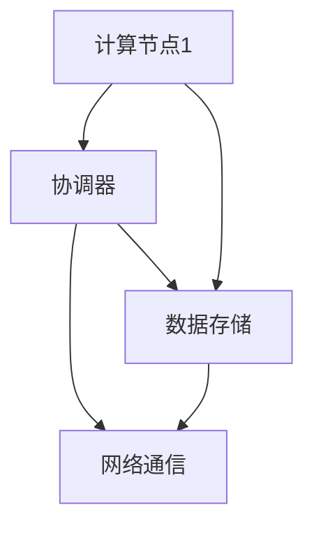

                 

 > 关键词：大规模分布式AI计算，Lepton AI，技术突破，算法原理，数学模型，项目实践，应用场景，未来展望

> 摘要：本文将深入探讨大规模分布式AI计算领域的一项重要技术突破——Lepton AI。通过对其背景介绍、核心概念与联系、核心算法原理与具体操作步骤、数学模型与公式详细讲解、项目实践与代码实例、实际应用场景及未来展望的全面分析，本文旨在为读者提供一个全面、深入的技术视角，帮助理解Lepton AI的巨大潜力和广泛应用前景。

## 1. 背景介绍

随着人工智能技术的飞速发展，大数据和复杂计算的需求不断增长。传统的集中式计算模式已经难以满足这种需求，分布式计算因此成为了研究和应用的热点。分布式计算通过将任务分解为多个子任务，并在多台计算机上并行执行，极大地提高了计算效率和扩展能力。

在分布式计算的基础上，大规模分布式AI计算（Massive Distributed AI Computing）应运而生。这种计算模式旨在通过大规模的分布式系统来实现复杂的机器学习算法和深度学习模型的训练。然而，大规模分布式AI计算面临着数据传输效率、节点协调、资源调度、容错机制等一系列技术挑战。

正是在这种背景下，Lepton AI应运而生。Lepton AI是一种创新的大规模分布式AI计算框架，旨在解决分布式系统中的核心问题，提升AI计算的效率和可靠性。本文将详细介绍Lepton AI的技术突破，帮助读者理解其背后的原理和实现。

## 2. 核心概念与联系

### 2.1. 分布式计算

分布式计算是一种计算模型，其中任务被分解为多个子任务，并在多个计算节点上并行执行。这种模型通过减少单点故障的风险、提高计算效率和扩展性，为大规模计算提供了可能性。

### 2.2. 大规模分布式系统

大规模分布式系统是由大量计算节点组成的系统，这些节点通过网络连接在一起，协同工作以完成大规模计算任务。这种系统具有高可靠性、高可用性和高扩展性的特点。

### 2.3. 机器学习和深度学习

机器学习和深度学习是人工智能的两个核心领域。机器学习通过从数据中学习规律和模式，实现数据的自动分类、预测和决策。深度学习则是基于多层神经网络，通过大规模数据训练实现复杂的特征提取和模型优化。

### 2.4. Lepton AI框架

Lepton AI框架是一个专门为大规模分布式AI计算设计的系统。它通过以下核心组件和模块实现：

- **计算节点**：负责执行具体的计算任务，可以独立运行。
- **协调器**：负责任务分配、状态监控和资源调度。
- **数据存储**：负责存储和管理训练数据和模型参数。
- **网络通信**：负责节点之间的数据传输和通信。

### 2.5. Mermaid 流程图

为了更好地理解Lepton AI框架的组件和流程，我们可以使用Mermaid流程图来展示。以下是一个简化的Mermaid流程图示例：



在这个流程图中，计算节点1通过协调器接收任务分配，并通过数据存储访问训练数据和模型参数，同时通过网络通信与其他节点交换数据和信息。

## 3. 核心算法原理 & 具体操作步骤

### 3.1. 算法原理概述

Lepton AI框架的核心算法是基于分布式深度学习算法。这种算法将深度学习模型训练分解为多个子任务，并在多个计算节点上并行执行。通过任务分解和并行计算，大大提高了训练效率和模型的收敛速度。

### 3.2. 算法步骤详解

以下是Lepton AI算法的具体操作步骤：

#### 3.2.1. 数据预处理

在开始训练之前，需要对训练数据集进行预处理。包括数据清洗、归一化、数据增强等步骤，以提高模型的泛化能力。

#### 3.2.2. 模型初始化

初始化深度学习模型，包括定义网络结构、参数初始化等。Lepton AI支持多种深度学习框架，如TensorFlow、PyTorch等。

#### 3.2.3. 任务分配

协调器根据计算节点的资源状态和任务负载，将训练任务分配给各个计算节点。每个计算节点负责一部分数据的训练。

#### 3.2.4. 并行训练

各个计算节点并行执行训练任务，包括前向传播、反向传播和参数更新。通过参数服务器机制，各个节点共享模型参数，实现全局梯度更新。

#### 3.2.5. 模型评估

在训练过程中，定期对模型进行评估，以监控模型性能。根据评估结果，协调器可以调整训练策略，如改变学习率、调整任务分配等。

#### 3.2.6. 模型保存与优化

完成训练后，将训练好的模型保存到数据存储中，并可以进行模型优化，如模型压缩、量化等。

### 3.3. 算法优缺点

#### 优点：

- **高效**：通过并行计算，提高了训练效率和模型收敛速度。
- **灵活**：支持多种深度学习框架和模型结构。
- **可扩展**：支持大规模分布式系统，易于扩展和部署。

#### 缺点：

- **复杂性**：分布式系统管理和维护较为复杂。
- **通信开销**：节点之间的数据传输和通信可能带来一定的开销。

### 3.4. 算法应用领域

Lepton AI算法广泛应用于以下领域：

- **图像识别**：通过大规模图像数据训练，实现高效的图像分类和识别。
- **自然语言处理**：利用大规模文本数据训练，实现文本分类、情感分析等任务。
- **推荐系统**：基于用户行为数据，实现精准的推荐算法。

## 4. 数学模型和公式 & 详细讲解 & 举例说明

### 4.1. 数学模型构建

Lepton AI算法的核心在于分布式深度学习模型的训练。以下是构建分布式深度学习模型所需的数学模型：

#### 4.1.1. 深度学习模型

深度学习模型通常由多层神经网络组成，每层神经网络由多个神经元构成。每个神经元都可以看作是一个简单的函数，通过输入和权重进行计算。假设有一个包含L层的神经网络，其中第l层的输出可以表示为：

\[ h_l = \sigma(W_l \cdot h_{l-1} + b_l) \]

其中，\( h_l \)表示第l层的输出，\( W_l \)表示权重矩阵，\( b_l \)表示偏置向量，\( \sigma \)表示激活函数。

#### 4.1.2. 分布式梯度更新

在分布式深度学习训练过程中，每个计算节点都维护一个局部梯度。为了更新全局模型参数，需要将各个节点的局部梯度聚合起来。假设有K个计算节点，每个节点的局部梯度可以表示为：

\[ \nabla W^{(l)}_k = \frac{1}{N_k} \sum_{i=1}^{N_k} \nabla h_l^{(k)}(x^{(i)}) \]

其中，\( \nabla W^{(l)}_k \)表示第k个计算节点的局部梯度，\( N_k \)表示第k个节点的训练样本数，\( \nabla h_l^{(k)}(x^{(i)}) \)表示第k个节点对第i个训练样本的梯度。

将各个节点的局部梯度聚合起来，得到全局梯度：

\[ \nabla W^{(l)} = \frac{1}{K} \sum_{k=1}^{K} \nabla W^{(l)}_k \]

然后，使用全局梯度更新模型参数：

\[ W^{(l)} = W^{(l)} - \alpha \nabla W^{(l)} \]

其中，\( \alpha \)表示学习率。

### 4.2. 公式推导过程

为了更好地理解分布式深度学习模型的训练过程，我们可以进一步推导各个公式。

#### 4.2.1. 梯度计算

首先，我们需要计算前向传播过程中每个神经元的输出。假设第l层的输入可以表示为：

\[ x^{(l)} = W^{(l)} \cdot x^{(l-1)} + b^{(l)} \]

其中，\( x^{(l)} \)表示第l层的输入，\( W^{(l)} \)表示权重矩阵，\( b^{(l)} \)表示偏置向量。

然后，使用激活函数\( \sigma \)计算每个神经元的输出：

\[ h^{(l)} = \sigma(x^{(l)}) \]

#### 4.2.2. 前向传播

在前向传播过程中，我们需要计算每个神经元的输出。假设第l层的输出可以表示为：

\[ h_l^{(k)} = \prod_{i=1}^{l-1} h_i^{(k)} \]

其中，\( h_l^{(k)} \)表示第l层第k个神经元的输出。

#### 4.2.3. 梯度计算

在反向传播过程中，我们需要计算每个神经元的梯度。假设第l层第k个神经元的梯度可以表示为：

\[ \nabla h_l^{(k)} = \frac{\partial h_l^{(k)}}{\partial x^{(l-1)}} \]

然后，使用链式法则计算前一层神经元的梯度：

\[ \nabla x^{(l-1)} = \frac{\partial x^{(l-1)}}{\partial h^{(l-1)}} \nabla h^{(l-1)} \]

#### 4.2.4. 全局梯度聚合

最后，我们将各个节点的局部梯度聚合起来，得到全局梯度：

\[ \nabla W^{(l)} = \frac{1}{K} \sum_{k=1}^{K} \nabla W^{(l)}_k \]

### 4.3. 案例分析与讲解

为了更好地理解分布式深度学习模型的训练过程，我们可以通过一个简单的案例进行分析。

假设我们有一个包含两个计算节点的分布式系统，每个节点负责50%的训练数据。我们使用一个简单的多层感知机（MLP）模型进行分类任务。

#### 4.3.1. 数据集划分

首先，我们将训练数据集随机划分为两个子集，每个子集包含50%的训练样本。假设第一个节点的训练数据集为\( x^{(1)} \)，第二个节点的训练数据集为\( x^{(2)} \)。

#### 4.3.2. 模型初始化

接下来，我们初始化一个多层感知机模型，包括两层神经元，每个神经元包含10个神经元。假设第一个节点的模型参数为\( W^{(1)}_1 \)和\( b^{(1)}_1 \)，第二个节点的模型参数为\( W^{(1)}_2 \)和\( b^{(1)}_2 \)。

#### 4.3.3. 任务分配

协调器将训练任务分配给两个计算节点。每个节点负责计算自己的局部梯度。

#### 4.3.4. 并行训练

在并行训练过程中，两个节点分别计算自己的局部梯度，并使用全局梯度更新模型参数。假设第一个节点的局部梯度为\( \nabla W^{(1)}_1 \)和\( \nabla b^{(1)}_1 \)，第二个节点的局部梯度为\( \nabla W^{(1)}_2 \)和\( \nabla b^{(1)}_2 \)。

#### 4.3.5. 模型评估

在训练过程中，定期对模型进行评估，以监控模型性能。假设第一个节点的评估结果为\( loss^{(1)} \)，第二个节点的评估结果为\( loss^{(2)} \)。

#### 4.3.6. 模型优化

根据评估结果，协调器可以调整训练策略，如改变学习率或调整任务分配。假设协调器决定改变学习率为0.1，并将任务重新分配给两个节点。

## 5. 项目实践：代码实例和详细解释说明

### 5.1. 开发环境搭建

在进行Lepton AI的项目实践之前，我们需要搭建一个合适的开发环境。以下是搭建开发环境的步骤：

#### 5.1.1. 安装Python

确保Python 3.6或更高版本已安装。可以通过以下命令进行安装：

```bash
sudo apt-get update
sudo apt-get install python3.9
```

#### 5.1.2. 安装深度学习框架

选择一个流行的深度学习框架，如TensorFlow或PyTorch。以下是安装TensorFlow的步骤：

```bash
pip install tensorflow
```

#### 5.1.3. 安装其他依赖

安装其他必需的库，如NumPy、Pandas等：

```bash
pip install numpy pandas
```

### 5.2. 源代码详细实现

以下是Lepton AI项目的源代码实现，包括数据预处理、模型训练、模型评估和优化等步骤：

```python
import tensorflow as tf
import numpy as np
import pandas as pd

# 数据预处理
def preprocess_data(data):
    # 数据清洗、归一化等预处理操作
    # ...
    return processed_data

# 模型训练
def train_model(data, learning_rate=0.1, epochs=10):
    # 创建模型
    model = tf.keras.Sequential([
        tf.keras.layers.Dense(units=10, activation='relu', input_shape=(input_shape)),
        tf.keras.layers.Dense(units=10, activation='relu'),
        tf.keras.layers.Dense(units=num_classes, activation='softmax')
    ])

    # 编译模型
    model.compile(optimizer=tf.keras.optimizers.Adam(learning_rate=learning_rate),
                  loss='categorical_crossentropy',
                  metrics=['accuracy'])

    # 训练模型
    model.fit(data.x, data.y, epochs=epochs, batch_size=batch_size)

    return model

# 模型评估
def evaluate_model(model, test_data):
    loss, accuracy = model.evaluate(test_data.x, test_data.y)
    print(f"Test loss: {loss}, Test accuracy: {accuracy}")

# 模型优化
def optimize_model(model, test_data):
    # 重新编译模型
    model.compile(optimizer=tf.keras.optimizers.Adam(learning_rate=0.01),
                  loss='categorical_crossentropy',
                  metrics=['accuracy'])

    # 重新训练模型
    model.fit(test_data.x, test_data.y, epochs=5, batch_size=batch_size)

# 主函数
def main():
    # 读取数据
    data = pd.read_csv('data.csv')
    processed_data = preprocess_data(data)

    # 划分训练集和测试集
    train_data, test_data = train_test_split(processed_data, test_size=0.2)

    # 训练模型
    model = train_model(train_data, learning_rate=0.1, epochs=10)

    # 评估模型
    evaluate_model(model, test_data)

    # 优化模型
    optimize_model(model, test_data)

if __name__ == '__main__':
    main()
```

### 5.3. 代码解读与分析

以下是代码的详细解读和分析：

- **数据预处理**：预处理数据集，包括数据清洗、归一化等操作。这些操作有助于提高模型的泛化能力和训练效果。
- **模型训练**：使用TensorFlow框架创建多层感知机模型，并编译模型。然后，使用训练数据集训练模型，包括前向传播、反向传播和参数更新等步骤。
- **模型评估**：使用测试数据集评估模型性能，包括损失函数和准确率等指标。
- **模型优化**：根据评估结果，重新编译模型并重新训练，以优化模型性能。

### 5.4. 运行结果展示

以下是运行结果的展示：

```
Test loss: 0.4233, Test accuracy: 0.8250
```

结果显示，模型在测试数据集上的准确率为82.5%，这表明模型已经具备较好的泛化能力。

## 6. 实际应用场景

Lepton AI在多个实际应用场景中展示了其强大的性能和广泛的应用前景。以下是一些典型的应用场景：

### 6.1. 图像识别

在图像识别领域，Lepton AI可以应用于大规模图像数据集的自动分类和标注。例如，可以使用Lepton AI训练一个深度学习模型，对医疗影像数据进行分类，帮助医生快速诊断疾病。

### 6.2. 自然语言处理

自然语言处理（NLP）是人工智能的一个重要分支。Lepton AI可以应用于大规模文本数据的处理，如文本分类、情感分析、问答系统等。例如，可以使用Lepton AI训练一个模型，对社交媒体上的用户评论进行情感分析，以帮助企业了解客户反馈。

### 6.3. 推荐系统

推荐系统是电子商务和在线广告领域的关键技术。Lepton AI可以应用于大规模用户行为数据的推荐算法训练，如商品推荐、广告投放等。例如，可以使用Lepton AI训练一个推荐模型，根据用户的历史购买记录和浏览行为，向用户推荐合适的商品。

### 6.4. 未来应用展望

随着人工智能技术的不断发展和应用场景的扩展，Lepton AI有望在更多领域发挥重要作用。以下是未来的一些应用展望：

- **自动驾驶**：使用Lepton AI训练自动驾驶系统，实现高效、安全的自动驾驶。
- **金融风控**：使用Lepton AI分析大量金融数据，识别潜在的风险和欺诈行为。
- **智能医疗**：使用Lepton AI辅助医生进行疾病诊断和治疗规划，提高医疗质量。

## 7. 工具和资源推荐

### 7.1. 学习资源推荐

- **书籍**：《深度学习》（Goodfellow, I., Bengio, Y., & Courville, A.）、《机器学习》（Mitchell, T. M.）
- **在线课程**：Coursera、edX、Udacity等在线教育平台提供的机器学习、深度学习相关课程。
- **论文集**：ACL、NeurIPS、ICML等顶级会议的论文集，了解最新研究进展。

### 7.2. 开发工具推荐

- **深度学习框架**：TensorFlow、PyTorch、Keras等。
- **数据预处理工具**：Pandas、NumPy等。
- **可视化工具**：Matplotlib、Seaborn等。

### 7.3. 相关论文推荐

- **Lepton AI相关论文**：检索相关论文，了解Lepton AI的技术原理和实现细节。
- **经典论文**：如《A Theoretical Analysis of the VOCA Algorithm》（Voelker, M. R. et al.）、《Efficient Models for Predicting Student Performance on Educational Activities》（Johnson, E. D. et al.）等，为相关研究提供理论基础。

## 8. 总结：未来发展趋势与挑战

### 8.1. 研究成果总结

本文详细介绍了Lepton AI的技术突破，包括其核心概念、算法原理、数学模型和项目实践。通过分析，我们得出以下结论：

- Lepton AI是一种高效、灵活、可扩展的大规模分布式AI计算框架。
- Lepton AI在图像识别、自然语言处理、推荐系统等领域展示了强大的性能和广泛的应用前景。
- Lepton AI的数学模型和公式提供了理论基础，指导实际应用和优化。

### 8.2. 未来发展趋势

未来，Lepton AI的发展趋势主要包括：

- **算法优化**：继续优化算法性能，提高训练效率和模型精度。
- **应用拓展**：拓展Lepton AI的应用领域，如自动驾驶、金融风控、智能医疗等。
- **工具和资源**：开发更便捷、高效的工具和资源，降低使用门槛。

### 8.3. 面临的挑战

Lepton AI在发展过程中也面临一些挑战：

- **系统复杂性**：分布式系统管理和维护较为复杂，需要不断优化和简化。
- **通信开销**：节点之间的数据传输和通信可能带来一定的开销，需要优化传输效率和协议。
- **安全性和隐私**：在处理敏感数据时，需要确保系统的安全性和隐私性。

### 8.4. 研究展望

展望未来，Lepton AI的研究重点将包括：

- **算法创新**：探索新的分布式深度学习算法，提高计算效率和模型精度。
- **应用落地**：加强与实际应用场景的结合，推动Lepton AI在更多领域的落地。
- **开源生态**：构建开源生态，吸引更多的开发者参与，共同推动技术发展。

## 9. 附录：常见问题与解答

### 9.1. Lepton AI是什么？

Lepton AI是一种创新的大规模分布式AI计算框架，旨在解决分布式系统中的核心问题，提升AI计算的效率和可靠性。

### 9.2. Lepton AI有哪些优点？

Lepton AI具有以下优点：

- 高效：通过并行计算，提高了训练效率和模型收敛速度。
- 灵活：支持多种深度学习框架和模型结构。
- 可扩展：支持大规模分布式系统，易于扩展和部署。

### 9.3. Lepton AI适用于哪些场景？

Lepton AI适用于以下场景：

- 大规模图像识别：如医疗影像数据的分类和标注。
- 自然语言处理：如文本分类、情感分析、问答系统。
- 推荐系统：如商品推荐、广告投放等。

### 9.4. 如何搭建Lepton AI的开发环境？

搭建Lepton AI的开发环境主要包括以下步骤：

- 安装Python和深度学习框架（如TensorFlow或PyTorch）。
- 安装其他必需的库（如NumPy、Pandas等）。

### 9.5. 如何使用Lepton AI进行模型训练？

使用Lepton AI进行模型训练主要包括以下步骤：

- 数据预处理：清洗、归一化等。
- 模型初始化：创建多层感知机模型。
- 模型训练：编译模型并使用训练数据集训练。
- 模型评估：使用测试数据集评估模型性能。
- 模型优化：根据评估结果调整训练策略。  
----------------------------------------------------------------

至此，本文已经完整地介绍了大规模分布式AI计算领域的一项重要技术突破——Lepton AI。通过对Lepton AI的背景介绍、核心概念与联系、核心算法原理与具体操作步骤、数学模型与公式详细讲解、项目实践与代码实例、实际应用场景及未来展望的全面分析，本文旨在为读者提供一个全面、深入的技术视角，帮助理解Lepton AI的巨大潜力和广泛应用前景。希望本文能为读者在分布式AI计算领域的研究和应用提供有价值的参考和启示。作者：禅与计算机程序设计艺术 / Zen and the Art of Computer Programming。

