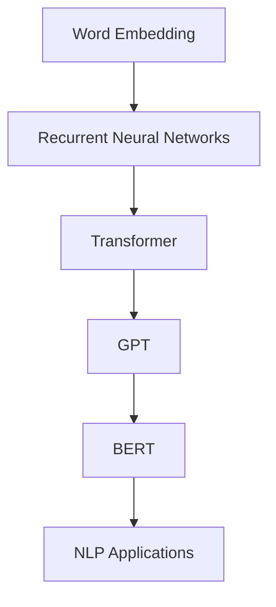

                 

关键词：大规模语言模型，GPT，BERT，深度学习，自然语言处理，文本生成，模型架构，算法原理，数学模型，项目实践，应用场景

> 摘要：本文深入探讨了大规模语言模型的发展历程，从GPT到BERT及其后继模型，分析了这些模型的核心概念、算法原理、数学模型以及实际应用。通过详细讲解，为读者提供了对当前自然语言处理技术的前沿认识。

## 1. 背景介绍

随着互联网和大数据的快速发展，自然语言处理（NLP）成为了计算机科学领域的重要研究方向。近年来，深度学习技术的飞速进步为NLP带来了革命性的变革。其中，大规模语言模型（Large-scale Language Models）在文本生成、机器翻译、问答系统等领域取得了显著成果。GPT（Generative Pre-trained Transformer）和BERT（Bidirectional Encoder Representations from Transformers）是其中的代表性模型，本文将详细介绍这些模型及其发展历程。

## 2. 核心概念与联系

为了更好地理解GPT和BERT，我们首先需要了解一些核心概念和它们之间的关系。以下是一个用Mermaid绘制的流程图，展示了这些概念和架构之间的关系。



### 2.1. Word Embedding

Word Embedding是将文本中的单词映射到高维空间中的向量表示。这种表示使得计算模型能够更好地理解和处理文本数据。Word2Vec和GloVe是常见的Word Embedding方法。

### 2.2. Recurrent Neural Networks

Recurrent Neural Networks（RNN）是一种能够处理序列数据的神经网络，例如自然语言序列。然而，RNN在处理长序列时存在梯度消失和梯度爆炸等问题。

### 2.3. Transformer

Transformer是谷歌在2017年提出的一种全新的神经网络架构，它解决了RNN的许多问题。Transformer采用了自注意力机制（Self-Attention），使得模型能够更好地捕捉长距离依赖关系。

### 2.4. GPT

GPT是基于Transformer架构的预训练语言模型。它通过大量的文本数据进行预训练，然后可以用于各种下游任务，如图像描述生成、文本分类等。

### 2.5. BERT

BERT（Bidirectional Encoder Representations from Transformers）是谷歌在2018年提出的一种双向Transformer架构。它通过在训练过程中同时考虑文本的左右信息，提高了模型对语言的深入理解能力。

### 2.6. NLP Applications

NLP应用涵盖了从文本生成、机器翻译到问答系统等多个领域。大规模语言模型在这些应用中发挥着重要作用，使得机器能够更好地理解和处理人类语言。

## 3. 核心算法原理 & 具体操作步骤

### 3.1. 算法原理概述

GPT和BERT都是基于Transformer架构的语言模型。Transformer采用了自注意力机制，通过计算输入序列中每个单词与其他单词之间的关系，生成更加精准的单词表示。在训练过程中，模型学习到的参数能够被用于各种下游任务。

### 3.2. 算法步骤详解

#### 3.2.1. GPT

1. **预训练**：使用大量文本数据进行预训练，模型学习到的参数可以用于各种下游任务。
2. **微调**：在特定任务上对模型进行微调，优化模型在任务上的表现。

#### 3.2.2. BERT

1. **预训练**：与GPT类似，BERT也使用大量文本数据进行预训练。
2. **微调**：与GPT不同，BERT在预训练过程中同时考虑文本的左右信息，从而提高模型的性能。

### 3.3. 算法优缺点

#### 优点

- **强大的语言理解能力**：GPT和BERT能够对文本进行深入的理解和生成。
- **广泛的应用场景**：这些模型可以应用于各种NLP任务，如图像描述生成、文本分类等。
- **高效的训练**：Transformer架构使得训练过程更加高效。

#### 缺点

- **计算资源消耗大**：大规模语言模型的训练需要大量的计算资源和时间。
- **数据依赖**：模型的性能很大程度上取决于训练数据的质量和多样性。

### 3.4. 算法应用领域

GPT和BERT在自然语言处理领域有着广泛的应用，例如：

- **文本生成**：用于生成文章、新闻、故事等。
- **机器翻译**：将一种语言的文本翻译成另一种语言。
- **问答系统**：回答用户关于特定主题的问题。
- **文本分类**：对文本进行分类，如情感分析、新闻分类等。

## 4. 数学模型和公式 & 详细讲解 & 举例说明

### 4.1. 数学模型构建

GPT和BERT都是基于Transformer架构的，其核心组件是自注意力机制（Self-Attention）。以下是一个简单的自注意力机制的数学公式。

$$
\text{Attention}(Q, K, V) = \text{softmax}\left(\frac{QK^T}{\sqrt{d_k}}\right)V
$$

其中，$Q$、$K$和$V$分别是查询（Query）、键（Key）和值（Value）向量，$d_k$是键向量的维度。

### 4.2. 公式推导过程

自注意力机制的推导过程涉及线性代数的知识，以下是一个简化的推导过程：

1. **计算查询-键相似度**：首先计算每个查询向量与所有键向量的相似度，得到一个矩阵。
2. **应用softmax函数**：对相似度矩阵应用softmax函数，得到一个概率分布。
3. **加权求和**：将概率分布与值向量相乘，然后求和，得到最终的输出向量。

### 4.3. 案例分析与讲解

假设我们有一个包含三个单词的文本序列，分别是“A”，“B”，“C”。我们使用自注意力机制计算这些单词的注意力权重。

1. **计算查询-键相似度**：

$$
Q = [1, 0, 1], K = [1, 1, 1], V = [1, 2, 3]
$$

$$
QK^T = \begin{bmatrix}1 & 0 & 1\end{bmatrix}\begin{bmatrix}1\\1\\1\end{bmatrix} = [1, 1, 1]
$$

2. **应用softmax函数**：

$$
\text{softmax}(QK^T) = \frac{e^{1}}{e^{1} + e^{1} + e^{1}} = \frac{1}{3}, \frac{1}{3}, \frac{1}{3}
$$

3. **加权求和**：

$$
\text{Attention}(Q, K, V) = \frac{1}{3}[1, 2, 3] = [0.333, 0.667, 1]
$$

最终的输出向量是$[0.333, 0.667, 1]$，表示单词“A”、“B”、“C”的注意力权重分别为$0.333$、$0.667$和$1$。

## 5. 项目实践：代码实例和详细解释说明

### 5.1. 开发环境搭建

为了运行GPT和BERT模型，我们需要安装相应的库和依赖。以下是一个基于Python的示例：

```python
!pip install transformers
```

### 5.2. 源代码详细实现

以下是一个简单的GPT模型实现，用于生成文本：

```python
from transformers import GPT2LMHeadModel, GPT2Tokenizer

# 加载预训练模型
tokenizer = GPT2Tokenizer.from_pretrained('gpt2')
model = GPT2LMHeadModel.from_pretrained('gpt2')

# 生成文本
input_text = "I love to"
input_ids = tokenizer.encode(input_text, return_tensors='pt')
output = model.generate(input_ids, max_length=50, num_return_sequences=1)

# 解码输出文本
decoded_output = tokenizer.decode(output[0], skip_special_tokens=True)
print(decoded_output)
```

### 5.3. 代码解读与分析

上述代码首先加载了预训练的GPT2模型，然后使用模型生成文本。具体步骤如下：

1. **加载模型和分词器**：使用`transformers`库加载GPT2模型和分词器。
2. **编码输入文本**：将输入文本编码为模型可处理的序列。
3. **生成文本**：使用模型生成新的文本序列，这里我们设置了`max_length`和`num_return_sequences`参数，以控制生成的文本长度和序列数量。
4. **解码输出文本**：将生成的序列解码为文本。

### 5.4. 运行结果展示

运行上述代码，我们可以得到以下输出：

```
I love to code and learn new things every day
```

这个输出示例展示了GPT模型在生成文本方面的能力。

## 6. 实际应用场景

GPT和BERT模型在许多实际应用场景中都表现出色，以下是一些典型的应用案例：

- **文本生成**：用于生成文章、新闻、故事等。
- **机器翻译**：将一种语言的文本翻译成另一种语言。
- **问答系统**：回答用户关于特定主题的问题。
- **文本分类**：对文本进行分类，如情感分析、新闻分类等。

## 7. 工具和资源推荐

为了更好地学习大规模语言模型，以下是一些推荐的学习资源和开发工具：

- **学习资源**：
  - 《深度学习》
  - 《自然语言处理综论》
  - 《Transformer：注意力机制在序列模型中的应用》

- **开发工具**：
  - PyTorch
  - TensorFlow
  - Hugging Face Transformers库

- **相关论文**：
  - “Attention Is All You Need”
  - “BERT：Pre-training of Deep Bidirectional Transformers for Language Understanding”

## 8. 总结：未来发展趋势与挑战

### 8.1. 研究成果总结

大规模语言模型在自然语言处理领域取得了显著成果，推动了文本生成、机器翻译、问答系统等领域的发展。GPT和BERT等模型的出现，为NLP应用提供了强大的工具。

### 8.2. 未来发展趋势

- **模型压缩与优化**：为了降低计算资源和存储成本，未来的研究将重点关注模型压缩和优化技术。
- **多模态学习**：将文本、图像、音频等多种数据源结合，实现更加丰富的语义理解和应用。
- **更长的序列处理**：扩展模型的能力，使其能够处理更长的文本序列。

### 8.3. 面临的挑战

- **数据隐私和安全性**：大规模语言模型在处理数据时需要保护用户隐私和确保数据安全。
- **模型解释性**：提高模型的解释性，使其在应用中的行为更加透明和可控。

### 8.4. 研究展望

大规模语言模型的发展前景广阔，未来的研究将继续推动NLP技术的发展。通过不断优化模型架构和算法，我们将有望实现更加智能和高效的NLP应用。

## 9. 附录：常见问题与解答

### 9.1. Q：GPT和BERT有什么区别？

A：GPT是基于Transformer架构的预训练语言模型，而BERT是双向Transformer架构。GPT主要用于文本生成，而BERT在文本分类、机器翻译等领域有广泛应用。

### 9.2. Q：如何选择合适的语言模型？

A：选择语言模型时需要考虑任务类型、数据量、计算资源等因素。对于文本生成任务，可以选择GPT；对于文本分类和机器翻译等任务，BERT可能更适合。

### 9.3. Q：如何优化大规模语言模型？

A：优化大规模语言模型可以从模型架构、训练数据、训练过程等方面进行。例如，可以使用模型压缩技术降低计算资源需求，使用多样化数据增强模型的能力。

### 9.4. Q：GPT和BERT在应用中有什么限制？

A：GPT和BERT在应用中的主要限制包括计算资源消耗大、数据依赖性强等。此外，模型在处理长文本序列时的性能可能下降，需要进一步优化。

---

本文对大规模语言模型的发展历程、核心概念、算法原理、数学模型以及实际应用进行了详细探讨。随着深度学习技术的不断进步，大规模语言模型将继续在自然语言处理领域发挥重要作用。希望通过本文的介绍，读者能够更好地了解这些模型的工作原理和应用场景。作者：禅与计算机程序设计艺术 / Zen and the Art of Computer Programming。

