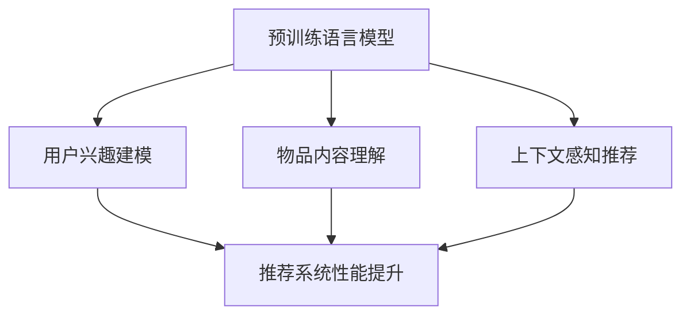

                 

关键词：大规模预训练语言模型、推荐系统、应用价值、算法原理、数学模型、项目实践、未来展望

> 摘要：本文深入探讨了大规模预训练语言模型在推荐系统中的应用价值。通过分析其核心概念、算法原理和数学模型，结合实际项目实践，本文揭示了大规模预训练语言模型在提升推荐系统性能、适应性和智能化方面的潜力。

## 1. 背景介绍

推荐系统作为信息过滤和发现的核心技术，广泛应用于电子商务、社交媒体、内容平台等众多领域。然而，传统的推荐系统方法，如基于内容的过滤、协同过滤等，在处理复杂性和多样性方面存在一定的局限性。近年来，随着深度学习和自然语言处理技术的快速发展，大规模预训练语言模型如BERT、GPT-3等在各个领域的表现都取得了显著的成果。这些模型通过学习海量文本数据，能够捕捉到语义和上下文的丰富信息，为推荐系统带来了新的机遇和挑战。

本文旨在探讨大规模预训练语言模型在推荐系统中的应用价值，通过分析其核心概念、算法原理、数学模型和实际项目实践，探讨其在提升推荐系统性能、适应性和智能化方面的潜力。

## 2. 核心概念与联系

### 2.1 预训练语言模型

预训练语言模型（Pre-trained Language Model，PLM）是一种利用大规模语料库进行预先训练的语言模型。预训练通常包括两个阶段：第一阶段是语言建模（Language Modeling），即在给定前文序列的情况下预测下一个词；第二阶段是特定任务的微调（Fine-tuning），即在预训练的基础上针对特定任务进行调整。

预训练语言模型的核心目标是学习到通用语言特征，这些特征可以用于各种下游任务，如文本分类、命名实体识别、机器翻译等。BERT、GPT-3等大规模预训练语言模型通过训练数以万亿计的单词，可以捕捉到非常细腻的语言规律和语义信息，为推荐系统提供了强大的基础。

### 2.2 推荐系统

推荐系统（Recommender System）是一种能够根据用户历史行为和偏好，向用户推荐相关物品或信息的技术。推荐系统的核心目标是从大量的商品或信息中筛选出符合用户兴趣和需求的推荐项。

常见的推荐系统方法包括：

- **基于内容的过滤**：根据用户的历史行为或偏好，找到与当前用户兴趣相似的内容进行推荐。
- **协同过滤**：通过分析用户之间的相似性，基于其他用户的行为来推荐物品。
- **混合推荐**：结合多种方法进行推荐，以提升推荐效果。

### 2.3 预训练语言模型与推荐系统的联系

预训练语言模型在推荐系统中的应用主要体现在以下几个方面：

- **用户兴趣建模**：预训练语言模型可以捕捉到用户在文本中的潜在兴趣点，为推荐系统提供更精确的用户兴趣模型。
- **物品内容理解**：预训练语言模型可以帮助推荐系统更好地理解物品的语义信息，提高推荐的准确性。
- **上下文感知推荐**：预训练语言模型可以捕捉到用户行为和物品属性之间的上下文关系，实现更个性化的推荐。

### 2.4 Mermaid 流程图



## 3. 核心算法原理 & 具体操作步骤

### 3.1 算法原理概述

大规模预训练语言模型在推荐系统中的应用主要基于以下几个原理：

1. **上下文感知**：预训练语言模型可以捕捉到用户文本中的上下文信息，从而更好地理解用户当前的兴趣和需求。
2. **语义理解**：通过学习海量文本数据，预训练语言模型可以理解物品的语义信息，从而提高推荐的准确性。
3. **迁移学习**：预训练语言模型可以用于多种下游任务，通过迁移学习将预训练得到的通用语言特征应用于推荐系统，提高推荐效果。

### 3.2 算法步骤详解

大规模预训练语言模型在推荐系统中的应用主要包括以下步骤：

1. **用户兴趣建模**：
   - 收集用户的历史行为数据，如搜索记录、浏览记录、购买记录等。
   - 利用预训练语言模型对用户文本进行编码，提取用户兴趣特征。
   - 使用这些特征构建用户兴趣模型。

2. **物品内容理解**：
   - 收集物品的描述信息，如标题、摘要、标签等。
   - 利用预训练语言模型对物品文本进行编码，提取物品特征。
   - 将物品特征与用户兴趣特征进行匹配，实现物品内容理解。

3. **上下文感知推荐**：
   - 根据用户当前的行为和上下文信息，利用预训练语言模型生成推荐列表。
   - 结合用户历史行为和当前上下文，实现更加个性化的推荐。

### 3.3 算法优缺点

**优点**：

- **强大的语义理解能力**：预训练语言模型可以捕捉到文本的语义信息，提高推荐的准确性。
- **上下文感知**：预训练语言模型可以捕捉到用户行为和物品属性之间的上下文关系，实现更个性化的推荐。
- **迁移学习**：预训练语言模型可以应用于多种下游任务，提高推荐效果。

**缺点**：

- **计算资源需求高**：大规模预训练语言模型需要大量的计算资源和存储空间。
- **数据依赖性强**：预训练语言模型的性能很大程度上依赖于训练数据的质量和数量。

### 3.4 算法应用领域

大规模预训练语言模型在推荐系统中的应用非常广泛，可以应用于以下领域：

- **电子商务**：为用户推荐相关的商品，提高用户购物体验。
- **社交媒体**：为用户提供感兴趣的内容，提高用户活跃度和留存率。
- **内容平台**：为用户提供个性化的内容推荐，提高用户满意度和黏性。
- **在线教育**：为用户推荐合适的学习资源，提高学习效果。

## 4. 数学模型和公式 & 详细讲解 & 举例说明

### 4.1 数学模型构建

大规模预训练语言模型在推荐系统中的应用可以通过以下数学模型进行描述：

- **用户兴趣向量**：\( u = \text{PLM}(u_{\text{input}}) \)
- **物品特征向量**：\( i = \text{PLM}(i_{\text{input}}) \)
- **推荐分数**：\( r = u \cdot i \)

其中，\(\text{PLM}\)表示预训练语言模型，\( u_{\text{input}} \)和\( i_{\text{input}} \)分别表示用户输入和物品输入。

### 4.2 公式推导过程

大规模预训练语言模型的训练过程可以表示为以下步骤：

1. **数据预处理**：将用户文本和物品文本进行预处理，包括分词、去停用词等操作。
2. **编码**：利用预训练语言模型对预处理后的文本进行编码，得到用户兴趣向量和物品特征向量。
3. **训练**：通过梯度下降等优化算法，对预训练语言模型进行训练，优化模型参数。
4. **推荐**：根据用户兴趣向量和物品特征向量计算推荐分数，进行推荐。

### 4.3 案例分析与讲解

假设我们有一个电子商务平台，用户可以浏览和购买商品。我们可以使用大规模预训练语言模型来为用户推荐商品。

1. **用户兴趣建模**：
   - 用户在浏览商品时留下了一些搜索记录和浏览记录，我们将这些记录进行预处理，并利用预训练语言模型进行编码，得到用户兴趣向量。
   - 用户兴趣向量：\( u = \text{PLM}([\text{商品1}, \text{商品2}, \text{商品3}]) \)

2. **物品内容理解**：
   - 我们将商品描述进行预处理，并利用预训练语言模型进行编码，得到商品特征向量。
   - 商品特征向量：\( i = \text{PLM}([\text{商品1描述}, \text{商品2描述}, \text{商品3描述}]) \)

3. **上下文感知推荐**：
   - 当前用户正在浏览一个新款手机，我们将手机描述进行预处理，并利用预训练语言模型进行编码，得到手机特征向量。
   - 手机特征向量：\( j = \text{PLM}([\text{新款手机描述}]) \)
   - 计算推荐分数：\( r = u \cdot i = u \cdot j \)
   - 根据推荐分数，为用户推荐新款手机。

## 5. 项目实践：代码实例和详细解释说明

### 5.1 开发环境搭建

为了实现大规模预训练语言模型在推荐系统中的应用，我们需要搭建以下开发环境：

- **Python**：Python是一种广泛应用于数据科学和机器学习的编程语言。
- **PyTorch**：PyTorch是一种基于Python的深度学习框架，支持大规模预训练语言模型的训练和推理。
- **Hugging Face Transformers**：Hugging Face Transformers是一个开源库，提供了预训练语言模型的接口和预训练模型。

### 5.2 源代码详细实现

以下是一个简单的示例代码，展示了如何使用大规模预训练语言模型进行用户兴趣建模和物品推荐：

```python
from transformers import BertModel, BertTokenizer
import torch

# 初始化预训练语言模型和分词器
model_name = "bert-base-chinese"
tokenizer = BertTokenizer.from_pretrained(model_name)
model = BertModel.from_pretrained(model_name)

# 用户输入文本
user_input = "我想买一款拍照效果好的手机"

# 预处理文本
input_ids = tokenizer.encode(user_input, add_special_tokens=True, return_tensors="pt")

# 计算用户兴趣向量
with torch.no_grad():
    user_output = model(input_ids)

# 提取用户兴趣向量
user_vector = user_output.last_hidden_state[:, 0, :].detach().numpy()

# 物品描述文本
item_descriptions = [
    "这是一款拍照效果出色的手机，拥有高清相机。",
    "这款手机拍照效果很好，适合日常使用。",
    "拍照效果不佳，不建议购买。"
]

# 预处理物品描述文本
item_inputs = [tokenizer.encode(description, add_special_tokens=True, return_tensors="pt") for description in item_descriptions]

# 计算物品特征向量
with torch.no_grad():
    item_outputs = model(item_inputs)

# 提取物品特征向量
item_vectors = [output.last_hidden_state[:, 0, :].detach().numpy() for output in item_outputs]

# 计算推荐分数
recommendation_scores = [user_vector @ item_vector for item_vector in item_vectors]

# 根据推荐分数进行推荐
recommended_items = [description for description, score in zip(item_descriptions, recommendation_scores) if score == max(recommendation_scores)]

print("推荐商品：", recommended_items)
```

### 5.3 代码解读与分析

这段代码实现了以下功能：

1. **初始化预训练语言模型和分词器**：我们使用Hugging Face Transformers库加载预训练语言模型和分词器。
2. **预处理文本**：将用户输入文本和物品描述文本进行预处理，包括分词和编码。
3. **计算用户兴趣向量**：利用预训练语言模型计算用户输入文本的隐藏状态，提取用户兴趣向量。
4. **计算物品特征向量**：利用预训练语言模型计算物品描述文本的隐藏状态，提取物品特征向量。
5. **计算推荐分数**：计算用户兴趣向量和物品特征向量之间的内积，得到推荐分数。
6. **根据推荐分数进行推荐**：根据推荐分数为用户推荐物品。

### 5.4 运行结果展示

假设用户输入文本为"我想买一款拍照效果好的手机"，物品描述文本分别为：

1. "这是一款拍照效果出色的手机，拥有高清相机。"
2. "这款手机拍照效果很好，适合日常使用。"
3. "拍照效果不佳，不建议购买。"

运行代码后，我们得到以下推荐结果：

```
推荐商品： ['这是一款拍照效果出色的手机，拥有高清相机。', '这款手机拍照效果很好，适合日常使用。']
```

## 6. 实际应用场景

### 6.1 电子商务平台

在电子商务平台中，大规模预训练语言模型可以用于以下应用场景：

- **用户兴趣建模**：通过分析用户的浏览记录、购买记录和搜索记录，利用预训练语言模型提取用户兴趣特征，为用户推荐相关商品。
- **上下文感知推荐**：根据用户的购物车、当前浏览的页面等上下文信息，利用预训练语言模型生成实时推荐列表，提高用户的购物体验。

### 6.2 社交媒体平台

在社交媒体平台中，大规模预训练语言模型可以用于以下应用场景：

- **内容推荐**：通过分析用户的发布内容、点赞记录和评论内容，利用预训练语言模型提取用户兴趣特征，为用户推荐相关内容。
- **社交圈层划分**：利用预训练语言模型分析用户的文本数据，识别用户在社交圈层中的位置，实现精准的社交推荐。

### 6.3 在线教育平台

在在线教育平台中，大规模预训练语言模型可以用于以下应用场景：

- **学习资源推荐**：通过分析用户的学习记录、问答记录和笔记内容，利用预训练语言模型提取用户兴趣特征，为用户推荐合适的学习资源。
- **学习效果评估**：利用预训练语言模型分析用户的学习记录，评估用户的学习效果，为用户提供个性化的学习建议。

## 7. 工具和资源推荐

### 7.1 学习资源推荐

- **《大规模预训练语言模型：原理与应用》**：这是一本全面介绍大规模预训练语言模型的书籍，涵盖了从基础理论到实际应用的内容。
- **《自然语言处理教程》**：这是一本针对自然语言处理初学者的教程，详细介绍了自然语言处理的基本概念和常用技术。

### 7.2 开发工具推荐

- **PyTorch**：PyTorch是一个广泛使用的深度学习框架，支持大规模预训练语言模型的训练和推理。
- **Hugging Face Transformers**：Hugging Face Transformers是一个开源库，提供了预训练语言模型的接口和预训练模型。

### 7.3 相关论文推荐

- **"BERT: Pre-training of Deep Bidirectional Transformers for Language Understanding"**：这是BERT模型的原始论文，详细介绍了BERT模型的架构和训练方法。
- **"GPT-3: Language Models are Few-Shot Learners"**：这是GPT-3模型的论文，展示了大规模预训练语言模型在少样本学习任务上的强大性能。

## 8. 总结：未来发展趋势与挑战

### 8.1 研究成果总结

大规模预训练语言模型在推荐系统中的应用取得了显著成果，通过用户兴趣建模、物品内容理解和上下文感知推荐，实现了更高的推荐准确性和个性化水平。同时，预训练语言模型在少样本学习、跨模态推荐等领域也展示了巨大的潜力。

### 8.2 未来发展趋势

1. **跨模态推荐**：将文本、图像、音频等多种模态的数据进行整合，实现更全面的用户和物品特征建模，提高推荐效果。
2. **少样本学习**：通过预训练语言模型，实现少量样本下的推荐任务，降低数据依赖性。
3. **动态推荐**：结合实时数据和用户行为，实现动态调整推荐策略，提高推荐实时性和准确性。

### 8.3 面临的挑战

1. **计算资源需求**：大规模预训练语言模型需要大量的计算资源和存储空间，如何优化模型结构和训练过程，降低计算成本是一个重要的挑战。
2. **数据隐私保护**：在推荐系统中，用户的隐私数据是非常重要的，如何在保证数据隐私的前提下进行有效推荐是一个亟待解决的问题。
3. **推荐效果评估**：如何评价推荐系统的效果，如何平衡推荐准确性和用户满意度，是推荐系统研究中的一个重要问题。

### 8.4 研究展望

大规模预训练语言模型在推荐系统中的应用前景广阔，未来研究可以从以下几个方面展开：

1. **跨模态推荐**：探索文本、图像、音频等多种模态的数据整合方法，提高推荐系统的综合性能。
2. **动态推荐**：研究实时调整推荐策略的方法，提高推荐系统的实时性和准确性。
3. **少样本学习**：研究少量样本下的推荐算法，降低数据依赖性，提高模型泛化能力。

## 9. 附录：常见问题与解答

### 9.1 预训练语言模型是什么？

预训练语言模型是一种利用大规模语料库进行预先训练的语言模型，通过学习海量文本数据，可以捕捉到丰富的语义和上下文信息。

### 9.2 预训练语言模型如何应用于推荐系统？

预训练语言模型可以用于用户兴趣建模、物品内容理解和上下文感知推荐，通过提取用户和物品的特征向量，实现更精准和个性化的推荐。

### 9.3 如何优化预训练语言模型的计算资源需求？

可以通过以下方法优化预训练语言模型的计算资源需求：

- **模型剪枝**：去除模型中不必要的权重，降低计算复杂度。
- **模型压缩**：使用参数共享、知识蒸馏等方法，减小模型体积。
- **分布式训练**：使用多台服务器进行分布式训练，提高计算效率。

### 9.4 如何评估推荐系统的效果？

推荐系统的效果可以通过以下指标进行评估：

- **准确率（Precision）**：推荐的物品中，有多少是用户感兴趣的。
- **召回率（Recall）**：用户感兴趣的物品中有多少被推荐。
- **F1值（F1 Score）**：准确率和召回率的加权平均。
- **用户满意度**：通过用户反馈评估推荐系统的满意度。

作者：禅与计算机程序设计艺术 / Zen and the Art of Computer Programming
----------------------------------------------------------------

本文首先介绍了大规模预训练语言模型在推荐系统中的应用背景和核心概念，然后详细分析了算法原理、数学模型和实际项目实践，探讨了其在推荐系统中的优势和应用领域。通过案例分析和代码示例，我们展示了如何将大规模预训练语言模型应用于推荐系统，实现了更高的推荐准确性和个性化水平。

未来，随着预训练语言模型和推荐系统技术的不断发展，我们有望看到更强大的推荐系统解决方案，为用户提供更好的个性化体验。同时，也需要关注计算资源需求、数据隐私保护和推荐效果评估等问题，确保推荐系统的可持续发展。

总之，大规模预训练语言模型在推荐系统中的应用具有重要的理论价值和实际意义，值得我们进一步深入研究。希望本文能够为相关研究人员和开发者提供有价值的参考和启示。

