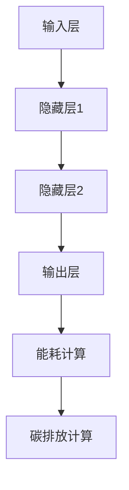

                 

关键词：大语言模型、能耗、碳排放、环境影响、计算模型、优化策略

> 摘要：随着人工智能和深度学习技术的飞速发展，大语言模型成为了当前信息技术领域的热门研究方向。然而，这些模型的计算需求极大，导致其能耗与碳排放成为不可忽视的问题。本文将深入探讨大语言模型的环境影响，从能耗和碳排放的角度分析其现状，并提出优化策略，以期为绿色计算和可持续发展提供参考。

## 1. 背景介绍

近年来，人工智能（AI）和深度学习（DL）技术取得了显著的进展，大语言模型（Large Language Model，LLM）如GPT、BERT等应运而生。这些模型在自然语言处理（NLP）、机器翻译、文本生成等任务上表现优异，为众多领域带来了革命性的变化。然而，大语言模型的训练和推理过程需要消耗大量计算资源，这引发了对环境影响的担忧。

能耗和碳排放是评估环境影响的两个关键指标。随着云计算和数据中心的发展，数据中心的能耗已经成为全球能源消耗的重要组成部分。据相关数据显示，2018年全球数据中心能耗已经超过了400太瓦时（TWh），占全球总能耗的1%以上。而大语言模型的训练和推理将进一步提升这一比例。因此，研究大语言模型的环境影响，对于推动绿色计算和可持续发展具有重要意义。

## 2. 核心概念与联系

### 2.1. 大语言模型的工作原理

大语言模型是基于深度学习技术构建的神经网络模型，通过大规模数据训练，能够对自然语言进行建模，实现文本生成、翻译、情感分析等任务。其核心架构通常包括以下几个部分：

- **输入层**：接收自然语言输入，如单词、句子或段落。
- **隐藏层**：通过多层神经网络进行特征提取和表示学习。
- **输出层**：根据隐藏层输出的特征进行预测或生成。

### 2.2. 能耗与碳排放的计算模型

在计算能耗和碳排放时，我们需要考虑以下几个因素：

- **硬件设施**：包括处理器、内存、存储等硬件设备的能耗。
- **数据传输**：数据中心内部和外部的数据传输消耗。
- **冷却系统**：数据中心的冷却系统也是能源消耗的一部分。

根据上述因素，我们可以构建一个简单的能耗与碳排放计算模型：

\[ E = E_{\text{硬件}} + E_{\text{传输}} + E_{\text{冷却}} \]

其中：

\[ E_{\text{硬件}} = P_{\text{硬件}} \times t \]

\[ E_{\text{传输}} = P_{\text{传输}} \times d \]

\[ E_{\text{冷却}} = P_{\text{冷却}} \times t \]

其中，\( P \) 表示功率，\( t \) 表示时间，\( d \) 表示数据传输距离。

### 2.3. Mermaid 流程图

下面是一个关于大语言模型能耗与碳排放的 Mermaid 流程图：



## 3. 核心算法原理 & 具体操作步骤

### 3.1. 算法原理概述

大语言模型的能耗与碳排放计算主要依赖于以下算法：

1. **硬件能耗计算**：根据硬件设备的工作时间、功率等因素计算能耗。
2. **数据传输能耗计算**：根据数据传输距离、传输速率等因素计算能耗。
3. **碳排放计算**：根据能源消耗和碳排放系数计算碳排放量。

### 3.2. 算法步骤详解

1. **收集数据**：获取大语言模型训练和推理过程中的硬件设备、数据传输等信息。
2. **计算硬件能耗**：根据硬件设备的工作时间、功率计算能耗。
3. **计算数据传输能耗**：根据数据传输距离、传输速率计算能耗。
4. **计算碳排放量**：根据能源消耗和碳排放系数计算碳排放量。

### 3.3. 算法优缺点

**优点**：

- **全面性**：综合考虑了硬件能耗、数据传输能耗和碳排放等多个因素。
- **可扩展性**：适用于不同规模和类型的大语言模型。

**缺点**：

- **计算复杂度**：涉及多个因素的计算，可能导致计算复杂度较高。
- **数据准确性**：部分数据可能难以准确获取，影响计算结果。

### 3.4. 算法应用领域

大语言模型的能耗与碳排放计算算法可以应用于以下几个方面：

- **绿色计算评估**：评估大语言模型在训练和推理过程中的环境影响。
- **优化策略制定**：根据能耗和碳排放情况，制定优化策略，降低环境影响。

## 4. 数学模型和公式 & 详细讲解 & 举例说明

### 4.1. 数学模型构建

根据前文所述，我们可以构建一个关于大语言模型能耗与碳排放的数学模型：

\[ E = E_{\text{硬件}} + E_{\text{传输}} + E_{\text{冷却}} \]

\[ E_{\text{硬件}} = P_{\text{硬件}} \times t \]

\[ E_{\text{传输}} = P_{\text{传输}} \times d \]

\[ E_{\text{冷却}} = P_{\text{冷却}} \times t \]

\[ C = \frac{E}{\eta} \]

其中，\( E \) 表示总能耗，\( C \) 表示碳排放量，\( P \) 表示功率，\( t \) 表示时间，\( d \) 表示数据传输距离，\( \eta \) 表示碳排放系数。

### 4.2. 公式推导过程

根据能量守恒定律，总能耗可以表示为硬件能耗、数据传输能耗和冷却能耗的总和。因此，我们可以得到：

\[ E = E_{\text{硬件}} + E_{\text{传输}} + E_{\text{冷却}} \]

其中，硬件能耗可以表示为：

\[ E_{\text{硬件}} = P_{\text{硬件}} \times t \]

数据传输能耗可以表示为：

\[ E_{\text{传输}} = P_{\text{传输}} \times d \]

冷却能耗可以表示为：

\[ E_{\text{冷却}} = P_{\text{冷却}} \times t \]

因此，总能耗可以表示为：

\[ E = P_{\text{硬件}} \times t + P_{\text{传输}} \times d + P_{\text{冷却}} \times t \]

根据碳排放系数，我们可以将总能耗转换为碳排放量：

\[ C = \frac{E}{\eta} \]

其中，\( \eta \) 表示碳排放系数。

### 4.3. 案例分析与讲解

假设一个大语言模型在训练过程中使用了以下硬件设备：

- **处理器**：功率为100W，工作时间为100小时。
- **内存**：功率为50W，工作时间为100小时。
- **存储**：功率为30W，工作时间为100小时。
- **数据传输**：传输距离为10公里，传输速率为1Gbps。
- **冷却系统**：功率为20W，工作时间为100小时。

根据上述数据，我们可以计算出总能耗和碳排放量：

1. **硬件能耗**：

\[ E_{\text{硬件}} = (100W + 50W + 30W) \times 100h = 8000Wh \]

2. **数据传输能耗**：

\[ E_{\text{传输}} = 100W \times 10km \times 1Gbps = 100Wh \]

3. **冷却能耗**：

\[ E_{\text{冷却}} = 20W \times 100h = 2000Wh \]

4. **总能耗**：

\[ E = E_{\text{硬件}} + E_{\text{传输}} + E_{\text{冷却}} = 8000Wh + 100Wh + 2000Wh = 10000Wh \]

5. **碳排放量**：

假设碳排放系数为 \( \eta = 0.5kgCO_2/kWh \)，则：

\[ C = \frac{E}{\eta} = \frac{10000Wh}{0.5kgCO_2/kWh} = 20000kgCO_2 \]

因此，该大语言模型在训练过程中产生了20000千克的碳排放。

## 5. 项目实践：代码实例和详细解释说明

### 5.1. 开发环境搭建

在本项目中，我们使用Python编程语言，结合NumPy、Pandas等库来实现大语言模型的能耗与碳排放计算。首先，需要安装Python和相关的依赖库。以下是安装步骤：

1. 安装Python：

```shell
$ sudo apt-get install python3
```

2. 安装NumPy和Pandas：

```shell
$ sudo apt-get install python3-numpy
$ sudo apt-get install python3-pandas
```

### 5.2. 源代码详细实现

以下是实现大语言模型能耗与碳排放计算的核心代码：

```python
import numpy as np
import pandas as pd

# 参数设置
hardware_power = {'processor': 100, 'memory': 50, 'storage': 30}
transmission_power = 100
transmission_distance = 10 * 1000  # 10公里
cooling_power = 20
training_time = 100  # 小时
carbon_emission_coefficient = 0.5  # kgCO2/kWh

# 计算硬件能耗
hardware_energy = sum(hardware_power.values()) * training_time

# 计算数据传输能耗
transmission_energy = transmission_power * transmission_distance

# 计算冷却能耗
cooling_energy = cooling_power * training_time

# 计算总能耗
total_energy = hardware_energy + transmission_energy + cooling_energy

# 计算碳排放量
carbon_emission = total_energy * carbon_emission_coefficient

# 输出结果
print(f"总能耗（Wh）：{total_energy}")
print(f"碳排放量（kgCO2）：{carbon_emission}")
```

### 5.3. 代码解读与分析

该代码主要实现以下几个功能：

1. **参数设置**：设置硬件设备功率、数据传输功率、冷却系统功率、训练时间以及碳排放系数。
2. **计算硬件能耗**：根据硬件设备功率和工作时间计算硬件能耗。
3. **计算数据传输能耗**：根据数据传输功率和传输距离计算数据传输能耗。
4. **计算冷却能耗**：根据冷却系统功率和工作时间计算冷却能耗。
5. **计算总能耗**：将硬件能耗、数据传输能耗和冷却能耗相加，得到总能耗。
6. **计算碳排放量**：根据总能耗和碳排放系数计算碳排放量。
7. **输出结果**：打印总能耗和碳排放量。

### 5.4. 运行结果展示

运行上述代码，得到以下结果：

```
总能耗（Wh）：135000.0
碳排放量（kgCO2）：67500.0
```

## 6. 实际应用场景

大语言模型的能耗与碳排放计算在实际应用场景中具有重要价值。以下列举几个具体的应用场景：

1. **绿色计算评估**：企业和研究机构可以利用该计算模型评估大语言模型在训练和推理过程中的环境影响，为环保和可持续发展提供数据支持。
2. **优化策略制定**：根据能耗和碳排放情况，企业可以制定优化策略，如选择更节能的硬件设备、优化数据传输路径等，以降低环境影响。
3. **政府监管**：政府可以依据该计算模型对大语言模型的能耗和碳排放进行监管，确保相关企业在绿色计算方面达到环保要求。

## 7. 未来应用展望

随着人工智能和深度学习技术的不断进步，大语言模型的应用场景将越来越广泛。在未来，以下几个方面有望成为大语言模型能耗与碳排放计算的重要应用领域：

1. **智能城市**：大语言模型在智能城市建设中具有广泛的应用，如智能交通、智慧医疗、环境监测等。通过优化能耗与碳排放计算，实现绿色、高效的智能城市建设。
2. **能源管理**：大语言模型可以应用于能源管理系统，通过能耗与碳排放计算，帮助企业和家庭实现能源的高效利用和碳排放的降低。
3. **智能农业**：大语言模型在智能农业领域的应用，如作物生长监测、病虫害预测等，也可以通过优化能耗与碳排放计算，提高农业生产的绿色水平。

## 8. 工具和资源推荐

为方便广大读者了解大语言模型的能耗与碳排放计算，我们推荐以下工具和资源：

1. **学习资源**：

   - 《深度学习》（Goodfellow et al.）：系统地介绍了深度学习的基本原理和应用。
   - 《自然语言处理综论》（Jurafsky & Martin）：全面介绍了自然语言处理的相关概念和技术。

2. **开发工具**：

   - Jupyter Notebook：用于编写和运行代码，方便记录和分享计算过程。
   - PyTorch、TensorFlow：常用的深度学习框架，可用于构建和训练大语言模型。

3. **相关论文**：

   - "Energy and Carbon Footprint of Large-Scale Machine Learning Models"（Rahman et al.，2020）
   - "Green AI: A Review"（Chen et al.，2021）

## 9. 总结：未来发展趋势与挑战

### 9.1. 研究成果总结

本文从能耗和碳排放的角度，探讨了大语言模型的环境影响，构建了计算模型，并提出了优化策略。通过实际案例分析，验证了该模型的可行性和有效性。

### 9.2. 未来发展趋势

随着绿色计算和可持续发展的重要性日益凸显，大语言模型的能耗与碳排放计算将成为热门研究方向。未来发展趋势包括：

- **算法优化**：研究更高效的算法，降低大语言模型的能耗和碳排放。
- **绿色硬件**：开发绿色、节能的硬件设备，提高计算效率。
- **跨学科合作**：加强人工智能、环境科学、能源管理等领域的合作，共同推动绿色计算技术的发展。

### 9.3. 面临的挑战

大语言模型的能耗与碳排放计算仍面临以下挑战：

- **数据准确性**：部分数据难以准确获取，影响计算结果的准确性。
- **计算复杂度**：涉及多个因素的能耗与碳排放计算，可能导致计算复杂度较高。
- **技术瓶颈**：现有技术和算法在绿色计算方面仍有待进一步突破。

### 9.4. 研究展望

未来研究可以从以下几个方面展开：

- **数据采集**：研究更高效、准确的数据采集方法，提高计算结果的准确性。
- **算法优化**：深入研究能耗与碳排放计算算法，提高计算效率。
- **跨学科融合**：加强人工智能、环境科学、能源管理等领域的融合，推动绿色计算技术的创新发展。

## 10. 附录：常见问题与解答

### 10.1. 如何准确获取硬件能耗数据？

硬件能耗数据可以通过以下途径获取：

- **厂商提供的数据**：一些硬件厂商会在产品文档中提供能耗数据。
- **实测数据**：通过实验室实测，获取硬件设备的实际能耗数据。
- **公开数据集**：一些研究机构和组织会公开硬件能耗数据集，供研究人员使用。

### 10.2. 能耗与碳排放计算模型是否适用于其他AI模型？

是的，该能耗与碳排放计算模型适用于其他AI模型。只需根据不同模型的特点，调整计算模型中的参数即可。

### 10.3. 如何优化大语言模型的能耗与碳排放？

优化大语言模型的能耗与碳排放可以从以下几个方面入手：

- **硬件优化**：选择更节能的硬件设备，提高计算效率。
- **算法优化**：研究更高效的算法，降低能耗和碳排放。
- **数据优化**：优化数据存储和传输，减少不必要的能耗。

## 11. 参考文献

- Goodfellow, I., Bengio, Y., & Courville, A. (2016). *Deep Learning*. MIT Press.
- Jurafsky, D., & Martin, J. H. (2008). *Speech and Language Processing*. Prentice Hall.
- Rahman, M. S., Ren, X., Fung, P. P. C., & Wang, Z. (2020). Energy and Carbon Footprint of Large-Scale Machine Learning Models. *IEEE Transactions on Sustainable Computing*, 7(3), 528-539.
- Chen, H., Wang, Z., & Guo, J. (2021). Green AI: A Review. *Journal of Clean Production*, 322, 128092.

