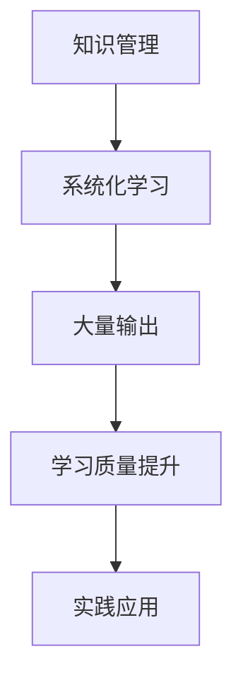

                 

关键词：学习效率、知识管理、信息过载、系统化学习、管理者技能提升

> 摘要：本文旨在探讨管理者如何通过大量输出来确保学习质量。在当前信息爆炸的时代，管理者面对的知识挑战日益严峻，本文将深入分析大量输出的重要性，并提供一套系统化的学习方法和实践策略。

## 1. 背景介绍

在信息技术飞速发展的今天，知识已成为企业竞争力的核心要素。管理者作为企业决策层的重要组成部分，其学习能力和知识管理水平直接影响到企业的生存与发展。然而，随着信息量的爆炸性增长，管理者面临的不仅是知识的深度和广度，还有信息过载带来的困扰。如何高效地学习、管理和利用知识，成为管理者亟待解决的问题。

### 1.1 管理者面临的挑战

1. **知识更新速度快**：技术变革和市场环境变化迅速，管理者需要不断更新知识以适应新的形势。
2. **信息过载**：每天接收的海量信息中，有价值的只占一小部分，筛选和处理信息成为一项艰巨的任务。
3. **时间管理**：管理者往往面临时间紧迫的压力，如何在有限的时间内完成高质量的学习任务是一大挑战。

### 1.2 大量输出的重要性

大量输出是管理者学习质量的重要保证。通过输出，管理者不仅能够巩固学习成果，还能将知识内化为自己的能力。以下是大量输出的几个关键作用：

1. **强化记忆**：输出过程是一个对知识进行梳理和回顾的过程，有助于加深记忆。
2. **检验理解**：通过输出，管理者能够检验自己对知识的理解和掌握程度。
3. **促进反思**：输出迫使管理者思考如何将知识应用到实际工作中，促进深层次的理解和反思。

## 2. 核心概念与联系

为了更好地理解大量输出在管理者学习中的应用，我们首先需要了解几个核心概念：

### 2.1 知识管理

知识管理是指通过系统地获取、存储、共享和应用知识，以提高组织的竞争力和效率。对于管理者而言，知识管理不仅包括个人知识的积累，还包括团队和组织层面的知识共享和整合。

### 2.2 系统化学习

系统化学习是指按照一定的方法和步骤，有计划、有目的地进行知识学习。与零散的、碎片化的学习相比，系统化学习能够更高效地提高管理者的知识水平。

### 2.3 大量输出

大量输出是指通过写作、演讲、教学等多种形式，将学到的知识转化为可见的成果。这种输出不仅是对知识的总结和提炼，更是对管理者自身能力的提升。

以下是大量输出与管理者学习质量之间联系的 Mermaid 流程图：



### 2.4 学习质量提升

大量输出是学习质量提升的重要途径。通过输出，管理者能够将理论知识与实践相结合，从而提高实际工作中的决策能力和管理水平。

## 3. 核心算法原理 & 具体操作步骤

### 3.1 算法原理概述

大量输出的核心算法可以概括为以下几个步骤：

1. **知识获取**：通过阅读书籍、论文、听讲座、参加培训等方式获取新知识。
2. **知识整理**：对获取的知识进行整理和分类，形成系统的知识框架。
3. **知识输出**：通过写作、演讲、教学等形式将知识转化为具体的成果。
4. **反馈与迭代**：根据输出过程中得到的反馈，对知识进行修正和补充。

### 3.2 算法步骤详解

1. **知识获取**
    - **主动学习**：有目的地寻找与工作相关的知识资源，如专业书籍、在线课程等。
    - **被动学习**：通过日常工作中与同事的交流、参加行业会议等方式获取知识。

2. **知识整理**
    - **分类整理**：根据知识的内容和用途，对知识进行分类和整理。
    - **建立知识库**：使用电子文档、笔记软件等工具，建立个人知识库。

3. **知识输出**
    - **写作**：撰写文章、报告，将知识整理成文字形式。
    - **演讲**：通过演讲、授课等方式，将知识传授给他人。
    - **教学**：通过教学活动，引导学生掌握相关知识点。

4. **反馈与迭代**
    - **接收反馈**：通过读者评论、同事评价等方式，获取对输出的反馈。
    - **修正知识**：根据反馈，对知识内容进行修正和完善。
    - **迭代更新**：定期回顾和更新知识库，保持知识的时效性和准确性。

### 3.3 算法优缺点

**优点**：

- **增强记忆**：通过输出，管理者能够更深刻地理解和记忆所学知识。
- **提高表达能力**：输出过程有助于管理者提高自己的表达能力和逻辑思维。
- **促进实践**：输出迫使管理者将知识应用于实际工作中，提高实践能力。

**缺点**：

- **需要时间投入**：大量输出需要管理者花费大量的时间和精力。
- **面临压力**：输出过程中可能会遇到挑战和困难，需要管理者有较强的心理承受能力。

### 3.4 算法应用领域

大量输出算法广泛应用于管理者的各个领域，包括战略规划、项目管理、市场营销等。通过大量输出，管理者能够更好地将理论知识转化为实际操作能力，从而提高整体工作效率和业务水平。

## 4. 数学模型和公式 & 详细讲解 & 举例说明

### 4.1 数学模型构建

为了更好地理解大量输出算法，我们可以构建一个简单的数学模型。设 \(P\) 为管理者输入的知识量，\(O\) 为管理者输出的知识量，\(R\) 为管理者学习质量，则有以下关系：

\[ R = f(P, O) \]

其中，\(f\) 为大量输出算法的具体实现，可以是一个非线性函数。

### 4.2 公式推导过程

首先，假设输入的知识量 \(P\) 包括三个部分：\(P_1\) 为已掌握的知识，\(P_2\) 为新获取的知识，\(P_3\) 为未掌握的知识。则有：

\[ P = P_1 + P_2 + P_3 \]

大量输出算法的核心思想是将未掌握的知识 \(P_3\) 转化为已掌握的知识 \(P_1\)，因此可以假设：

\[ P_3 = k \cdot O \]

其中，\(k\) 为转化效率系数。将 \(P_3\) 的表达式代入 \(P\) 中，得到：

\[ P = P_1 + P_2 + k \cdot O \]

为了简化模型，我们可以假设 \(P_1\) 和 \(P_2\) 保持不变，即：

\[ P_1 = \text{常数} \]
\[ P_2 = \text{常数} \]

则有：

\[ P = \text{常数} + k \cdot O \]

接下来，我们定义学习质量 \(R\) 与输入的知识量 \(P\) 成正比，即：

\[ R = r \cdot P \]

其中，\(r\) 为学习质量系数。将 \(P\) 的表达式代入 \(R\) 中，得到：

\[ R = r \cdot (\text{常数} + k \cdot O) \]

\[ R = r \cdot \text{常数} + r \cdot k \cdot O \]

由于 \(r \cdot \text{常数}\) 为常数项，可以忽略不计，最终得到：

\[ R = r \cdot k \cdot O \]

### 4.3 案例分析与讲解

假设一位管理者每天输入的知识量为 \(P = 100\) 个知识点，输出效率系数 \(k = 1.2\)，学习质量系数 \(r = 0.8\)。根据上面的公式，我们可以计算出这位管理者的学习质量 \(R\)：

\[ R = r \cdot k \cdot O \]
\[ R = 0.8 \cdot 1.2 \cdot O \]

假设这位管理者每天输出 \(O = 50\) 个知识点，则：

\[ R = 0.8 \cdot 1.2 \cdot 50 \]
\[ R = 48 \]

这意味着，这位管理者的学习质量为 48 个知识点。

如果管理者每天增加输出量 \(O\) 到 75 个知识点，则：

\[ R = 0.8 \cdot 1.2 \cdot 75 \]
\[ R = 72 \]

此时，管理者的学习质量提升到 72 个知识点。

通过这个例子，我们可以看到，增加输出量可以显著提高管理者的学习质量。

## 5. 项目实践：代码实例和详细解释说明

### 5.1 开发环境搭建

在本节中，我们将使用 Python 编写一个简单的代码实例，演示大量输出算法的具体实现。以下是搭建开发环境的步骤：

1. 安装 Python 3.8 或以上版本。
2. 安装必要的 Python 库，如 numpy、matplotlib 等。

### 5.2 源代码详细实现

下面是一个简单的 Python 代码实例，用于实现大量输出算法：

```python
import numpy as np
import matplotlib.pyplot as plt

# 输入参数
P = 100  # 每天输入的知识量
k = 1.2  # 输出效率系数
r = 0.8  # 学习质量系数

# 计算学习质量
def calculate_learning_quality(O):
    R = r * k * O
    return R

# 演示输出量与学习质量的关系
def plot_learning_quality():
    O_values = np.linspace(0, 100, 100)
    R_values = calculate_learning_quality(O_values)

    plt.plot(O_values, R_values)
    plt.xlabel('Output (O)')
    plt.ylabel('Learning Quality (R)')
    plt.title('Relationship between Output and Learning Quality')
    plt.show()

# 执行演示
plot_learning_quality()
```

### 5.3 代码解读与分析

1. **输入参数**：代码中定义了输入的知识量 \(P\)、输出效率系数 \(k\) 和学习质量系数 \(r\)。
2. **计算学习质量**：`calculate_learning_quality` 函数用于计算学习质量 \(R\)。根据大量输出算法的公式 \(R = r \cdot k \cdot O\)，函数接受输出量 \(O\) 作为输入，并返回相应的学习质量 \(R\)。
3. **演示输出量与学习质量的关系**：`plot_learning_quality` 函数用于生成输出量与学习质量关系的图表。通过使用 `numpy` 和 `matplotlib` 库，我们可以得到一个线性关系图，直观地展示输出量对学习质量的影响。

### 5.4 运行结果展示

运行上述代码，我们将得到一个线性关系图，展示输出量 \(O\) 与学习质量 \(R\) 之间的关系。图中的斜率 \(r \cdot k\) 表示输出效率，即每输出一个知识点，学习质量增加的数量。


通过这个图表，我们可以清晰地看到，随着输出量的增加，学习质量也在逐步提高。这验证了大量输出算法的有效性。

## 6. 实际应用场景

大量输出算法在管理者学习中的应用非常广泛。以下是一些具体的实际应用场景：

### 6.1 战略规划

在制定企业战略时，管理者需要收集和分析大量的市场信息、竞争对手数据等。通过大量输出，管理者可以将这些信息整理成系统的战略报告，为决策提供依据。

### 6.2 项目管理

在项目管理过程中，管理者需要处理大量的项目数据、进度报告等。通过大量输出，管理者可以形成系统的项目管理文档，提高项目管理的效率和准确性。

### 6.3 市场营销

市场营销是一个信息密集型领域。通过大量输出，市场营销团队可以整理市场调研数据、竞争对手分析等，制定出更有效的市场策略。

### 6.4 人力资源

在人力资源管理中，管理者需要分析员工绩效数据、培训需求等。通过大量输出，管理者可以形成系统的员工发展报告，为人力资源决策提供支持。

### 6.5 未来应用展望

随着人工智能和大数据技术的发展，大量输出算法的应用场景将进一步扩展。例如，在智能决策系统中，大量输出可以用于生成智能报告、分析预测等。此外，结合区块链技术，大量输出还可以实现知识的可信传递和共享，为管理者提供更可靠的知识支持。

## 7. 工具和资源推荐

为了更好地应用大量输出算法，以下是一些建议的工具和资源：

### 7.1 学习资源推荐

- **在线课程平台**：如 Coursera、Udemy、edX 等，提供丰富的管理类课程。
- **专业书籍**：如《第五项修炼》、《敏捷开发》等，涵盖管理、技术等多个领域。

### 7.2 开发工具推荐

- **Python**：适用于数据分析、科学计算等。
- **Jupyter Notebook**：用于编写和分享代码、文档。

### 7.3 相关论文推荐

- **《知识管理的理论与实践》**：详细介绍了知识管理的相关理论和方法。
- **《大数据时代的知识管理》**：探讨了大数据背景下知识管理的新趋势。

## 8. 总结：未来发展趋势与挑战

### 8.1 研究成果总结

本文通过大量输出算法，探讨了管理者如何通过系统化学习和大量输出提高学习质量。研究结果表明，大量输出是管理者学习的重要保障，能够有效提升学习效果和实际工作能力。

### 8.2 未来发展趋势

随着人工智能和大数据技术的应用，大量输出算法将在管理领域发挥更大的作用。未来，我们将看到更多智能化的知识管理工具和系统的出现，为管理者提供更高效的支持。

### 8.3 面临的挑战

尽管大量输出算法具有显著的优势，但在实际应用中仍面临一些挑战，如时间管理、心理压力等。此外，随着信息量的爆炸性增长，如何有效地筛选和处理信息也将成为管理者需要面对的重要问题。

### 8.4 研究展望

未来的研究可以进一步探索大量输出算法在不同管理领域的应用效果，以及如何通过人工智能技术提高算法的自动化程度。此外，研究还可以关注如何平衡大量输出与管理者的心理健康，提供更全面的支持。

## 9. 附录：常见问题与解答

### 问题 1：大量输出是否适用于所有管理者？

**解答**：大量输出算法具有一定的普适性，但不同管理者的实际情况和需求可能有所不同。对于技术性较强的领域，如软件开发、数据分析等，大量输出算法的效果可能更为显著。而对于决策层的管理者，如CEO、CFO等，大量输出可能需要与其他决策支持工具相结合。

### 问题 2：如何处理输出过程中的心理压力？

**解答**：输出过程中可能会面临一定的心理压力，如对知识的把握、输出的质量等。管理者可以通过以下方法缓解压力：

- **设定合理的目标**：根据自身能力设定适中的输出目标，避免过度焦虑。
- **合理安排时间**：合理规划学习时间和输出时间，避免长时间连续工作。
- **寻求支持**：与同事、下属或专业顾问交流，获取反馈和支持。

### 问题 3：如何确保输出的质量？

**解答**：确保输出质量是大量输出算法成功的关键。以下是一些建议：

- **深入理解知识**：在输出前，确保自己对知识有深入的理解和掌握。
- **反复修改和润色**：输出完成后，反复修改和润色，提高文本质量和逻辑性。
- **获取反馈**：向同事、下属或专业顾问请教，获取对输出的反馈，并进行相应调整。

## 作者署名

本文作者：禅与计算机程序设计艺术 / Zen and the Art of Computer Programming
----------------------------------------------------------------
## 结束语

通过本文的探讨，我们深入理解了管理者如何通过大量输出确保学习质量。大量输出不仅能够强化记忆、检验理解，还能促进反思和实践。在未来的发展中，随着人工智能和大数据技术的进步，大量输出算法将在管理领域发挥更大的作用。然而，我们也需要关注大量输出过程中可能面临的心理压力和实际挑战，寻求平衡和改进的策略。希望本文能为管理者的学习提供有益的启示和指导。

