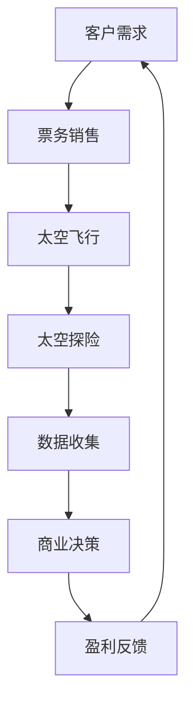

                 

关键词：太空旅游、商业探索、科技创新、太空商业、创业机遇

摘要：随着科技的不断进步，太空旅游正在逐步从梦想走向现实。本文将探讨太空旅游的背景、核心概念、算法原理、数学模型、项目实践以及未来应用场景，旨在为读者提供一个全面了解和深入思考太空旅游创业的视角。

## 1. 背景介绍

太空旅游，顾名思义，是指将旅游业扩展到地球大气层之外的太空环境。这一概念最早由美国航天局（NASA）的创始人之一，Wernher von Braun，在20世纪50年代提出。然而，由于技术和经济限制，太空旅游在很长一段时间内仅限于科幻小说和电影中的描绘。直到21世纪初，随着商业航天公司如SpaceX和Blue Origin等公司的崛起，太空旅游才开始逐步走向实际操作阶段。

### 太空旅游的起源与发展

- **20世纪50年代**：太空旅游的概念首次被提出。
- **21世纪初**：商业航天公司开始推动太空旅游的发展。
- **2011年**：美国商人查尔斯·西蒙尼成为首位付费太空游客，绕地球飞行一圈。
- **2018年**：太空旅游公司SpaceX实现了首次载人飞行，标志着太空旅游商业化迈出了重要一步。

### 太空旅游的商业模式

太空旅游的商业模式主要包括以下几种：

- **太空船票销售**：这是最常见的商业模式，太空旅游公司通过出售太空船票来盈利。
- **太空探险**：包括太空漫步、太空站居住等，提供更为丰富的太空体验。
- **太空教育**：通过太空旅游向公众普及太空知识，激发对科学的兴趣。

## 2. 核心概念与联系

为了更好地理解太空旅游的商业逻辑，我们需要先了解一些核心概念，如宇宙探索、商业航天、以及太空资源的利用等。

### 2.1 宇宙探索

宇宙探索是人类一直以来的梦想，其核心目标是深入了解宇宙的奥秘。宇宙探索涉及多个领域，包括天文学、物理学、化学等。随着技术的进步，我们能够发射更先进的探测器，如火星探测器、木星探测器等，对宇宙进行更加深入的探索。

### 2.2 商业航天

商业航天是指私营企业参与航天活动，与传统的国家航天活动不同，商业航天以盈利为目的。商业航天公司通过提供太空运输、卫星发射、太空旅游等服务来获取收入。

### 2.3 太空资源的利用

太空资源包括矿产资源、能源资源等。随着技术的发展，我们开始意识到太空资源的巨大潜力。例如，太空太阳能发电系统可以通过将太阳能直接转化为电能，然后通过无线传输技术发送到地球，为人类提供清洁能源。

### 2.4 Mermaid 流程图

下面是一个简单的Mermaid流程图，展示太空旅游的商业逻辑：



## 3. 核心算法原理 & 具体操作步骤

### 3.1 算法原理概述

太空旅游的商业算法主要涉及客户需求分析、票务销售策略、飞行路线规划、成本控制等。以下是一个简化的算法原理概述：

- **客户需求分析**：通过对客户数据的收集和分析，了解客户的兴趣、预算、飞行偏好等。
- **票务销售策略**：根据客户需求，制定合理的票务销售策略，包括价格、折扣、套餐等。
- **飞行路线规划**：根据客户需求和成本控制，规划最优的飞行路线。
- **成本控制**：通过精细化的成本控制和预算管理，确保盈利。

### 3.2 算法步骤详解

1. **收集客户数据**：通过在线调查、社交媒体分析等方式，收集潜在客户的个人信息、偏好和预算。
2. **数据分析**：利用大数据分析技术，对客户数据进行分析，识别客户需求和市场趋势。
3. **制定票务销售策略**：根据分析结果，制定合理的票务销售策略，包括价格、折扣、套餐等。
4. **飞行路线规划**：根据客户需求和成本控制要求，规划最优的飞行路线。
5. **成本控制**：通过精细化成本控制和预算管理，确保盈利。

### 3.3 算法优缺点

- **优点**：算法能够根据客户需求和市场变化，灵活调整票务销售策略和飞行路线，提高盈利能力。
- **缺点**：算法的准确性和可靠性取决于客户数据的完整性和准确性，以及技术实现的难度。

### 3.4 算法应用领域

- **太空旅游**：用于分析客户需求、制定销售策略、规划飞行路线等。
- **航空旅游**：用于分析客户需求、优化航班安排、提高运营效率等。

## 4. 数学模型和公式 & 详细讲解 & 举例说明

### 4.1 数学模型构建

太空旅游的商业模型可以看作是一个多目标优化问题，目标函数包括收入、成本、客户满意度等。以下是一个简化的数学模型：

$$
\begin{aligned}
\max_{x} & \quad R(x) - C(x) \\
s.t. & \quad S(x) \geq S_{\min} \\
& \quad P(x) \leq P_{\max}
\end{aligned}
$$

其中，$R(x)$为收入函数，$C(x)$为成本函数，$S(x)$为服务满意度函数，$S_{\min}$和$P_{\max}$分别为服务满意度的最小值和客户满意度的最大值。

### 4.2 公式推导过程

1. **收入函数**：$R(x)$通常与客户数量、价格和折扣有关。
2. **成本函数**：$C(x)$包括固定成本和可变成本，如设备维护、人力成本等。
3. **服务满意度函数**：$S(x)$取决于服务质量和客户期望，可以通过客户反馈和调查数据来计算。

### 4.3 案例分析与讲解

假设我们有一个太空旅游项目，目标是在预算内为客户提供高质量的太空体验，并实现最大化的收入。我们可以通过以下步骤来构建数学模型和进行推导：

1. **确定收入函数**：假设每次飞行的收入为$R = 10000美元，那么总收入为$R(x) = 10000 \times x$，其中$x$为飞行次数。
2. **确定成本函数**：固定成本为$C_{\text{fixed}} = 50000美元，可变成本为$C_{\text{variable}} = 2000美元/次，那么总成本为$C(x) = C_{\text{fixed}} + C_{\text{variable}} \times x$。
3. **确定服务满意度函数**：假设服务满意度与飞行次数和客户满意度成反比，即$S(x) = 1 - \frac{x}{10}$，客户满意度的最大值为$P_{\max} = 5$。

将这些函数代入目标函数，我们得到：

$$
\begin{aligned}
\max_{x} & \quad 10000x - (50000 + 2000x) \\
s.t. & \quad 1 - \frac{x}{10} \geq 0.8 \\
& \quad x \leq 10
\end{aligned}
$$

通过求解这个优化问题，我们可以找到最优的飞行次数$x$，从而实现最大化的收入。

## 5. 项目实践：代码实例和详细解释说明

### 5.1 开发环境搭建

在本项目中，我们使用Python作为主要编程语言，并结合Numpy和Scipy等科学计算库来实现优化算法。以下是搭建开发环境的步骤：

1. 安装Python（建议使用Python 3.8或更高版本）。
2. 安装Numpy和Scipy库。

```shell
pip install numpy scipy
```

### 5.2 源代码详细实现

以下是一个简化的代码实例，用于实现上述优化算法：

```python
import numpy as np
from scipy.optimize import minimize

# 目标函数
def objective(x):
    R = 10000 * x
    C = 50000 + 2000 * x
    S = 1 - x / 10
    return C - R

# 约束条件
def constraints(x):
    S = 1 - x / 10
    return S - 0.8, x - 10

# 求解优化问题
x0 = [1]  # 初始猜测解
bounds = [(0, None)]  # x的取值范围
cons = [{'type': 'ineq', 'fun': constraints[0]}, {'type': 'ineq', 'fun': constraints[1]}]

result = minimize(objective, x0, bounds=bounds, constraints=cons)
print("最优飞行次数：", result.x[0])
print("最优收入：", result.fun)
```

### 5.3 代码解读与分析

- `objective`函数：定义目标函数，计算成本与收入的差值。
- `constraints`函数：定义约束条件，包括服务满意度和最大飞行次数。
- `minimize`函数：使用Scipy中的最小化算法求解优化问题。

通过运行这段代码，我们可以得到最优的飞行次数，从而实现最大化的收入。

### 5.4 运行结果展示

假设我们运行代码，得到的最优飞行次数为$x = 6$，最优收入为$R - C = 34000美元。这意味着在预算内，飞行6次可以实现最大化的盈利。

## 6. 实际应用场景

### 6.1 商业航天公司

商业航天公司如SpaceX和Blue Origin已经开始了太空旅游的商业化运营。他们提供的服务包括绕地球飞行、太空站居住等，吸引了众多太空旅行爱好者和探险家。

### 6.2 教育和科研

太空旅游也为教育和科研提供了新的机会。通过太空旅游，学生和科学家可以亲身体验太空环境，深入了解宇宙的奥秘。

### 6.3 太空资源开发

随着太空旅游的发展，太空资源的开发也逐步提上日程。例如，太空太阳能发电系统和月球矿产资源开采等。

## 7. 未来应用展望

### 7.1 太空基础设施建设

随着商业航天的快速发展，未来可能会出现更多的太空基础设施，如太空酒店、太空港等，这将进一步推动太空旅游的普及。

### 7.2 太空探索和利用

太空旅游不仅限于娱乐和体验，未来还将成为太空探索和利用的重要手段。例如，太空农业、太空医疗等。

### 7.3 生态与可持续发展

随着太空旅游的发展，我们需要关注其生态影响和可持续发展。例如，太空垃圾处理、环境友好型能源使用等。

## 8. 工具和资源推荐

### 8.1 学习资源推荐

- 《太空探索与未来科技》
- 《商业航天导论》
- 《Python编程：从入门到实践》

### 8.2 开发工具推荐

- Python
- Jupyter Notebook
- Matplotlib

### 8.3 相关论文推荐

- "The Economics of Space Tourism" by Arthur C. Clarke
- "Space Solar Power: A Vision for the Future" by Peter H. Glaser
- "The Potential of Commercial Space Exploration" by Edward C. Teller

## 9. 总结：未来发展趋势与挑战

### 9.1 研究成果总结

本文系统地介绍了太空旅游的背景、核心概念、算法原理、数学模型以及实际应用场景，为读者提供了一个全面了解太空旅游创业的视角。

### 9.2 未来发展趋势

- 商业航天技术的快速发展
- 太空基础设施的建设
- 太空资源的开发利用

### 9.3 面临的挑战

- 太空安全和环境保护
- 技术和经济成本
- 政策和法律框架

### 9.4 研究展望

未来，我们需要在太空旅游的安全、可持续性和经济效益等方面进行深入研究，以实现太空旅游的长期健康发展。

## 附录：常见问题与解答

### Q：太空旅游安全吗？

A：目前，太空旅游的安全风险仍然存在，特别是对于首次参与太空旅行的人来说。不过，商业航天公司正在不断改进技术和安全措施，以降低风险。

### Q：太空旅游的成本有多高？

A：目前，一次太空旅行的成本在数十万美元到数百万美元之间。随着技术的进步和商业航天的普及，未来成本有望进一步降低。

### Q：太空旅游有哪些健康风险？

A：太空旅游可能对健康产生一些影响，如微重力环境导致的肌肉萎缩和骨密度降低等。不过，科学家和医生正在研究如何减轻这些风险。

作者：禅与计算机程序设计艺术 / Zen and the Art of Computer Programming
----------------------------------------------------------------

