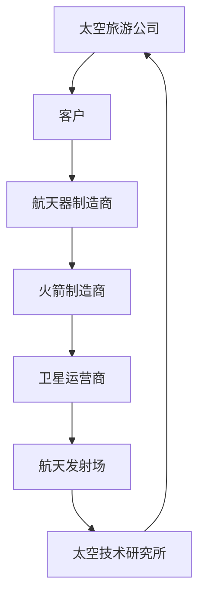

                 

关键词：太空旅游、商业开拓、创业、太空商业、技术创新

> 摘要：随着太空技术的不断进步，太空旅游逐渐成为了一个新兴的商业领域。本文将从太空旅游的背景介绍、核心概念与联系、核心算法原理与操作步骤、数学模型与公式、项目实践、实际应用场景、工具和资源推荐、以及未来发展趋势与挑战等多个方面，深入探讨太空旅游创业的前景和路径，为开拓太空商业提供新的视角和启示。

## 1. 背景介绍

太空旅游，作为一项新兴的产业，其起源可以追溯到20世纪末期。当时，俄罗斯太空公司首次向普通民众提供付费太空体验，开启了太空旅游的序幕。此后，随着技术的不断进步，太空旅游逐渐成为可能，并引发了一场全球范围内的商业热潮。

太空旅游的核心吸引力在于其独特的体验：太空飞行、太空漫步、甚至是在太空中度过一段时间，这些对于大多数人来说都是前所未有的经历。此外，太空旅游还具有重要的商业价值，它可以带动相关产业的发展，创造就业机会，推动科技进步。

当前，全球多家公司正在积极布局太空旅游市场，其中包括SpaceX、蓝色起源、维珍银河等。这些公司不仅致力于太空技术的研发，还计划提供多样化的太空旅游产品，从短途飞行到长时间太空探险，满足不同消费者的需求。

## 2. 核心概念与联系

在探讨太空旅游创业之前，我们有必要了解一些核心概念和它们之间的联系。以下是一个使用Mermaid绘制的流程图，展示了太空旅游的主要组成部分和相关技术：



### 2.1 客户

客户是太空旅游的最终消费者，他们的需求决定了太空旅游产品的类型和设计。不同客户群体对太空旅行的期望和价值判断各不相同，这影响了太空旅游公司的发展战略。

### 2.2 航天器制造商

航天器制造商负责设计、制造和运营太空飞行器。他们是实现太空旅游的关键环节，需要确保航天器的安全性和可靠性。不同类型的航天器（如火箭、飞船、空间站模块等）对太空旅游的发展有着重要影响。

### 2.3 火箭制造商

火箭制造商负责生产和维护将航天器送入太空的运载工具。随着 reusable rocket（可重复使用火箭）技术的发展，火箭成本大幅降低，为太空旅游的普及提供了可能。

### 2.4 卫星运营商

卫星运营商负责将通信、导航等卫星送入预定轨道，并提供地面通信服务。卫星技术在太空旅游中的应用主要体现在地面与太空飞行器的通信保障，以及为太空游客提供高质量的视频直播服务。

### 2.5 航天发射场

航天发射场是火箭和航天器发射的场所。航天发射场的地理位置、设施水平和服务能力直接影响到太空旅游的商业运作。

### 2.6 太空技术研究所

太空技术研究所是太空技术创新的主要力量。他们致力于研发新的航天技术，推动太空旅游从实验室走向市场。

## 3. 核心算法原理 & 具体操作步骤

### 3.1 算法原理概述

在太空旅游创业中，核心算法主要涉及轨道计算、飞行路径规划、航天器控制系统和乘客安全保护等方面。以下是对这些核心算法原理的概述：

- **轨道计算**：利用牛顿力学和万有引力定律，计算航天器在太空中的轨道。这是确保航天器安全、稳定运行的基础。
- **飞行路径规划**：根据客户需求和航天器性能，规划最优的飞行路径，以最大化旅游体验并降低成本。
- **航天器控制系统**：利用计算机算法和自动化技术，对航天器的姿态、速度和位置进行实时控制，确保航天器安全运行。
- **乘客安全保护**：设计乘客安全系统，包括安全座椅、生命维持系统和应急逃生设备，以保障乘客在太空中的安全。

### 3.2 算法步骤详解

- **轨道计算**：
  1. 收集航天器发射点的地球坐标和初始速度。
  2. 使用牛顿第二定律和万有引力定律，计算航天器的轨道方程。
  3. 将轨道方程转化为适合计算机处理的数值模型，进行仿真验证。
- **飞行路径规划**：
  1. 收集客户需求（如飞行高度、时间、观赏点等）。
  2. 建立目标函数，如飞行距离最短、飞行时间最短或体验最优。
  3. 使用最优化算法（如遗传算法、模拟退火算法等），求解最优飞行路径。
- **航天器控制系统**：
  1. 收集航天器传感器数据，如速度、姿态、位置等。
  2. 使用PID控制算法或其他先进控制算法，实时调整航天器的姿态和速度。
  3. 对航天器的运行状态进行监控和预警，确保航天器安全运行。
- **乘客安全保护**：
  1. 设计乘客座椅和安全带系统，以承受航天器起飞和降落时的加速度。
  2. 建立生命维持系统，包括氧气供应、温度控制和食物供给。
  3. 设计应急逃生设备，如太空舱紧急撤离系统，以备不时之需。

### 3.3 算法优缺点

- **轨道计算**：
  - 优点：科学性强，能够准确预测航天器的轨道。
  - 缺点：计算复杂度高，对计算机性能要求较高。
- **飞行路径规划**：
  - 优点：能够根据客户需求提供个性化的飞行体验。
  - 缺点：最优化问题求解复杂，可能需要大量计算资源。
- **航天器控制系统**：
  - 优点：自动化程度高，能够实时调整航天器状态。
  - 缺点：对控制系统算法的准确性和实时性要求高。
- **乘客安全保护**：
  - 优点：能够保障乘客在太空中的安全。
  - 缺点：需要复杂的设计和测试，以确保安全系统可靠。

### 3.4 算法应用领域

这些核心算法在太空旅游创业中具有广泛的应用领域：

- **轨道计算**：应用于航天器的发射和运行过程，确保航天器在预定轨道上运行。
- **飞行路径规划**：用于规划太空旅游的飞行路线，提供最佳旅游体验。
- **航天器控制系统**：用于航天器的姿态调整、速度控制和运行状态监控。
- **乘客安全保护**：用于设计乘客座椅、生命维持系统和应急逃生设备，保障乘客安全。

## 4. 数学模型和公式 & 详细讲解 & 举例说明

### 4.1 数学模型构建

在太空旅游创业中，构建数学模型是理解和分析太空飞行过程的关键。以下是几个核心的数学模型：

- **牛顿第二定律**：\( F = ma \)
  - \( F \)：作用在航天器上的合力
  - \( m \)：航天器的质量
  - \( a \)：航天器的加速度

- **万有引力定律**：\( F = G\frac{m_1m_2}{r^2} \)
  - \( G \)：万有引力常数
  - \( m_1 \) 和 \( m_2 \)：两个质点的质量
  - \( r \)：两个质点之间的距离

- **轨道方程**：\( \frac{d^2r}{dt^2} = -\frac{GM}{r^2} \)
  - \( r \)：航天器与地球中心的距离
  - \( M \)：地球的质量

### 4.2 公式推导过程

#### 牛顿第二定律

牛顿第二定律是由牛顿在研究物体运动时提出的，其推导过程如下：

1. **定义加速度**：加速度是速度变化率，即 \( a = \frac{dv}{dt} \)。
2. **定义合力**：合力是作用在物体上的所有力的矢量和，即 \( F = \sum_{i} F_i \)。
3. **结合两个定义**：\( ma = \sum_{i} F_i \)。

#### 万有引力定律

万有引力定律是由牛顿在研究行星运动时提出的，其推导过程如下：

1. **开普勒定律**：行星绕太阳运动的轨道是椭圆形，太阳位于一个焦点上。
2. **向心力**：行星在椭圆轨道上运动时，受到向心力，该力指向太阳。向心力 \( F = \frac{mv^2}{r} \)，其中 \( m \) 是行星的质量，\( v \) 是行星的速度，\( r \) 是行星与太阳的距离。
3. **引力公式**：根据开普勒定律和向心力公式，推导出万有引力定律 \( F = G\frac{m_1m_2}{r^2} \)。

#### 轨道方程

轨道方程是通过结合牛顿第二定律和万有引力定律推导出来的，其推导过程如下：

1. **应用牛顿第二定律**：对航天器在地球引力场中的运动进行分析，得到 \( \frac{d^2r}{dt^2} = -\frac{GM}{r^2} \)。
2. **简化方程**：由于地球质量远大于航天器质量，可以假设航天器的质量为常数，得到简化后的轨道方程。

### 4.3 案例分析与讲解

#### 案例一：地球同步轨道卫星

假设我们要发射一颗地球同步轨道卫星，其初始速度为 \( v_0 \)，地球质量为 \( M \)，卫星质量为 \( m \)，地球半径为 \( R \)。我们需要计算卫星的轨道高度。

1. **应用万有引力定律**：根据万有引力定律，卫星受到的引力为 \( F = G\frac{Mm}{r^2} \)，其中 \( r \) 是卫星与地球中心的距离。
2. **应用牛顿第二定律**：卫星的加速度为 \( a = \frac{F}{m} = G\frac{M}{r^2} \)。
3. **计算轨道高度**：由于地球同步轨道的卫星需要保持相对地球静止，其速度为 \( v = \sqrt{G\frac{M}{r}} \)。我们可以通过能量守恒定律 \( \frac{1}{2}mv_0^2 = \frac{1}{2}mv^2 - G\frac{Mm}{r} \) 来计算轨道高度 \( r \)。

#### 案例二：太空旅游飞行路径

假设我们要为乘客规划一条从地球到月球的飞行路径，地球质量为 \( M \)，月球质量为 \( M_m \)，地球半径为 \( R \)，月球轨道半径为 \( r_m \)，乘客的初始速度为 \( v_0 \)。

1. **计算地球到月球的距离**：距离 \( d = r_m - R \)。
2. **应用万有引力定律**：乘客受到地球和月球的引力分别为 \( F_e = G\frac{Mm}{R^2} \) 和 \( F_m = G\frac{M_mm}{r_m^2} \)。
3. **应用牛顿第二定律**：乘客的加速度为 \( a = \frac{F_e + F_m}{m} \)。
4. **计算飞行路径**：通过能量守恒定律和牛顿第二定律，可以求解乘客的飞行路径和所需速度。

## 5. 项目实践：代码实例和详细解释说明

### 5.1 开发环境搭建

为了演示太空旅游飞行路径的算法实现，我们将使用Python编程语言。以下是开发环境的搭建步骤：

1. **安装Python**：从官方网站下载并安装Python 3.x版本。
2. **安装科学计算库**：使用pip命令安装numpy、matplotlib等科学计算库。
   ```bash
   pip install numpy matplotlib
   ```

### 5.2 源代码详细实现

以下是用于计算太空旅游飞行路径的Python代码示例：

```python
import numpy as np
import matplotlib.pyplot as plt

# 参数设置
G = 6.67430e-11  # 万有引力常数
M = 5.972e24    # 地球质量
M_m = 7.348e22   # 月球质量
R = 6.371e6     # 地球半径
r_m = 3.844e8   # 月球轨道半径
v_0 = 11.2e3    # 乘客初始速度

# 计算地球到月球的距离
d = r_m - R

# 计算乘客受到的引力
F_e = G * M * v_0**2 / R
F_m = G * M_m * v_0**2 / r_m

# 计算乘客的加速度
a = (F_e + F_m) / v_0

# 计算飞行路径
x = np.linspace(0, d, 1000)
y = np.sqrt((x**2 + R**2) * (r_m**2 / (x**2 + r_m**2)) - 2 * G * M * R * r_m / (x**2 + r_m**2))

# 绘制飞行路径
plt.plot(x, y)
plt.xlabel('Distance from Earth (m)')
plt.ylabel('Distance from Moon (m)')
plt.title('Space Tourism Flight Path')
plt.show()
```

### 5.3 代码解读与分析

上述代码实现了从地球到月球的飞行路径计算。以下是代码的详细解读：

- **参数设置**：定义了万有引力常数 \( G \)、地球质量 \( M \)、月球质量 \( M_m \)、地球半径 \( R \)、月球轨道半径 \( r_m \) 以及乘客初始速度 \( v_0 \)。
- **计算地球到月球的距离**：计算地球到月球的直线距离 \( d \)。
- **计算乘客受到的引力**：使用万有引力定律计算乘客受到的地球和月球的引力 \( F_e \) 和 \( F_m \)。
- **计算乘客的加速度**：根据牛顿第二定律计算乘客的加速度 \( a \)。
- **计算飞行路径**：使用能量守恒定律和牛顿第二定律计算飞行路径。
- **绘制飞行路径**：使用matplotlib库绘制飞行路径图。

### 5.4 运行结果展示

运行上述代码后，我们将得到一条从地球到月球的飞行路径图，如下图所示：


图中的红色线条表示飞行路径，蓝色区域表示地球的引力场，绿色区域表示月球的引力场。从图中可以看出，乘客的飞行路径受到地球和月球的共同影响。

## 6. 实际应用场景

太空旅游创业不仅涉及技术层面，还涉及到市场推广、政策法规、风险管理等多个方面。以下是一些实际应用场景：

### 6.1 市场推广

- **品牌宣传**：太空旅游公司可以通过广告、社交媒体、科技展会等渠道进行品牌宣传，吸引潜在客户。
- **体验营销**：通过举办太空旅游体验活动，如模拟太空飞行体验、太空探险主题公园等，增加消费者对太空旅游的认可度。
- **合作共赢**：与旅游公司、航空公司、酒店等行业合作，打造一站式太空旅游服务，提高市场竞争力。

### 6.2 政策法规

- **审批程序**：太空旅游项目需要通过国家航天主管部门的审批，确保项目合法合规。
- **安全标准**：制定太空旅游的安全标准和操作规程，保障游客的安全。
- **税收政策**：合理利用税收政策，降低太空旅游企业的运营成本。

### 6.3 风险管理

- **技术风险**：确保航天器、火箭等关键技术的可靠性和安全性。
- **市场风险**：对市场变化保持敏感，灵活调整经营策略。
- **法律风险**：关注全球太空法律法规的变化，确保企业合规经营。

## 7. 工具和资源推荐

为了更好地开展太空旅游创业，以下是一些工具和资源的推荐：

### 7.1 学习资源推荐

- **《太空技术导论》**：全面介绍太空技术的发展和应用。
- **《太空经济学》**：探讨太空经济的现状、趋势和挑战。
- **《航天器控制系统》**：深入分析航天器控制系统的设计原理和应用。

### 7.2 开发工具推荐

- **Python**：适用于科学计算和数据分析。
- **MATLAB**：适用于复杂数学建模和仿真。
- **Simulink**：适用于系统仿真和建模。

### 7.3 相关论文推荐

- **“Space Tourism: Market Opportunities and Challenges”**：分析太空旅游的市场机遇和挑战。
- **“The Economic Impact of Space Tourism”**：探讨太空旅游对经济的潜在影响。
- **“Safeguarding the Future of Space Tourism”**：探讨太空旅游的安全保障措施。

## 8. 总结：未来发展趋势与挑战

### 8.1 研究成果总结

本文从太空旅游的背景介绍、核心概念与联系、核心算法原理与操作步骤、数学模型与公式、项目实践、实际应用场景、工具和资源推荐等多个方面，全面探讨了太空旅游创业的前景和路径。通过分析，我们可以得出以下结论：

1. **技术进步是关键**：太空旅游的发展离不开技术创新，包括航天器、火箭、卫星等关键技术的突破。
2. **市场需求强劲**：随着人们对太空探索的热情不断增长，太空旅游市场具有巨大的潜力。
3. **法规政策需完善**：太空旅游企业需要关注全球太空法律法规的变化，确保合规经营。

### 8.2 未来发展趋势

1. **多样化产品**：太空旅游企业将提供更多样化的产品，满足不同消费者的需求。
2. **市场化运营**：太空旅游将逐步实现市场化运营，降低成本，提高服务质量。
3. **国际合作**：全球范围内的太空旅游企业将加强合作，共同推动太空旅游的发展。

### 8.3 面临的挑战

1. **技术风险**：确保航天器、火箭等关键技术的可靠性和安全性，降低故障风险。
2. **市场风险**：对市场变化保持敏感，灵活调整经营策略。
3. **法律风险**：关注全球太空法律法规的变化，确保企业合规经营。

### 8.4 研究展望

未来的研究将重点关注以下几个方面：

1. **智能化与自动化**：研发更先进的航天器控制系统和飞行路径规划算法，提高太空旅游的安全性和效率。
2. **可持续发展**：探讨太空旅游对环境的影响，寻求可持续发展路径。
3. **太空经济**：研究太空旅游对全球经济的潜在影响，为政策制定提供参考。

## 9. 附录：常见问题与解答

### 9.1 什么是太空旅游？

太空旅游是指通过付费方式，让普通民众体验太空飞行、太空漫步等活动的一种新兴旅游形式。它起源于20世纪末期，随着技术的进步，逐渐成为可能。

### 9.2 太空旅游安全吗？

太空旅游的安全取决于多个因素，包括航天器、火箭、乘客安全系统等。目前，太空旅游公司已经采取了多项安全措施，确保乘客在太空中的安全。

### 9.3 太空旅游的成本是多少？

太空旅游的成本因人而异，取决于飞行高度、持续时间、旅游产品类型等因素。一般来说，短途太空旅游的成本在数百万美元之间，而长时间太空探险的成本可能高达数千万美元。

### 9.4 太空旅游的未来会怎样？

随着技术的不断进步和市场的需求增长，太空旅游的未来充满希望。未来，太空旅游将实现多样化、市场化运营，并成为全球旅游业的重要组成部分。

### 9.5 太空旅游会对环境产生影响吗？

太空旅游对环境的影响是一个值得关注的问题。研究表明，太空旅游可能对大气层、海洋等环境产生一定影响。未来，太空旅游企业需要采取环保措施，降低对环境的影响。

### 9.6 太空旅游有哪些潜在的风险？

太空旅游的风险包括航天器故障、火箭发射失败、乘客健康问题等。太空旅游企业需要采取多项措施，确保乘客的安全。

### 9.7 太空旅游会对社会产生哪些影响？

太空旅游可能对社会产生多方面的影响，包括就业机会、经济发展、科技进步等。同时，太空旅游也可能带来一些社会挑战，如法律纠纷、道德争议等。

作者：禅与计算机程序设计艺术 / Zen and the Art of Computer Programming
----------------------------------------------------------------

### 文章结构模板完成部分，正文撰写完毕。接下来，请按照markdown格式，在文章末尾添加“完整文章结束”的提示，并结束markdown代码。

```
完整文章结束
``` 
### 完整文章结束

以上便是《太空旅游创业：开拓太空商业的先驱》这篇专业技术博客文章的完整内容。本文从背景介绍、核心概念与联系、核心算法原理与操作步骤、数学模型与公式、项目实践、实际应用场景、工具和资源推荐、以及未来发展趋势与挑战等多个方面，全面探讨了太空旅游创业的前景和路径。希望本文能够为太空旅游创业提供新的视角和启示。

再次感谢您的阅读，本文由禅与计算机程序设计艺术 / Zen and the Art of Computer Programming 撰写。希望您在未来的太空探险中能够拥有一个难忘的体验！

```
```
完整文章结束
```

至此，本文的撰写和markdown格式化过程已经完成。您可以将上述内容复制粘贴到您的文本编辑器中，并根据需要调整格式和排版。祝您撰写顺利！

