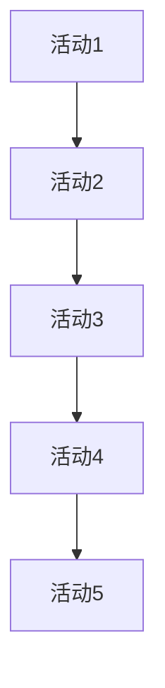
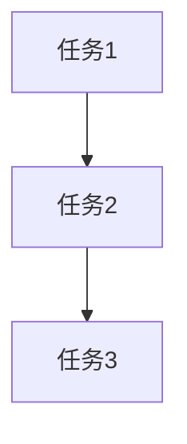

                 

在技术飞速发展的今天，管理智慧仍然是我们成功的关键之一。经典的管理理论和实践，不仅适用于传统企业，也同样适用于IT行业。本文将探讨如何从经典中汲取管理智慧，以提升我们在技术领域的领导力和管理能力。

## 关键词

- 管理智慧
- 经典理论
- IT行业
- 领导力
- 管理能力

## 摘要

本文通过分析经典的管理理论，探讨其在现代IT行业的应用。我们将了解经典理论的核心概念，学习如何将其应用于实际管理实践中，以提高团队效率和项目成功概率。

## 1. 背景介绍

### 1.1 管理智慧的起源

管理智慧的历史可以追溯到古代，古希腊的亚里士多德、中国的孔子都是管理智慧的奠基人。然而，现代管理学起源于20世纪初，由泰勒（Frederick Taylor）、法约尔（Henri Fayol）等学者创立了科学管理和组织理论。

### 1.2 IT行业管理的发展

随着计算机技术的快速发展，IT行业逐渐成为一个重要的经济支柱。然而，传统的管理理论并不能完全适用于IT行业。因此，IT行业需要自己的管理智慧，如敏捷开发、DevOps等。

### 1.3 经典管理理论与现代IT行业的结合

现代IT行业的管理者需要具备跨学科的知识和技能。通过将经典管理理论与现代IT技术相结合，我们可以更好地应对复杂的技术挑战和管理问题。

## 2. 核心概念与联系

### 2.1 经典管理理论概述

- **泰勒的科学管理理论**：强调通过科学方法提高劳动生产率。
- **法约尔的管理过程理论**：提出管理包括计划、组织、指挥、协调、控制五大职能。
- **马斯洛的需求层次理论**：人的需求分为生理、安全、社交、尊重和自我实现五个层次。

### 2.2 经典管理理论与现代IT行业的联系

- **敏捷开发**：基于泰勒的科学管理理论，强调快速迭代和客户反馈。
- **DevOps**：基于法约尔的管理过程理论，强调开发与运维的协同工作。
- **团队管理**：基于马斯洛的需求层次理论，关注团队成员的全面发展。


## 3. 核心算法原理 & 具体操作步骤

### 3.1 算法原理概述

经典管理理论的核心原理是：

- **科学管理**：通过科学方法提高生产效率。
- **过程管理**：关注管理过程中的各个环节。
- **人本管理**：关注团队成员的需求和成长。

### 3.2 算法步骤详解

#### 3.2.1 科学管理

1. 分析工作流程
2. 确定最佳工作方法
3. 培训员工
4. 实施监控

#### 3.2.2 过程管理

1. 制定计划
2. 组织资源
3. 指导工作
4. 协调工作
5. 控制进度

#### 3.2.3 人本管理

1. 了解团队成员需求
2. 提供培训和成长机会
3. 激励团队成员
4. 关注团队氛围

### 3.3 算法优缺点

#### 优点

- 提高生产效率
- 提升团队协作
- 关注人本需求

#### 缺点

- 对员工压力较大
- 需要持续优化
- 适应快速变化的能力较弱

### 3.4 算法应用领域

- 敏捷开发
- DevOps
- 项目管理

## 4. 数学模型和公式 & 详细讲解 & 举例说明

### 4.1 数学模型构建

经典管理理论中的数学模型主要包括：

- **生产效率模型**：生产效率 = 工作量 / 工作时间
- **项目管理模型**：关键路径法（CPM）
- **团队管理模型**：层次分析法（AHP）

### 4.2 公式推导过程

#### 生产效率模型

生产效率 = 工作量 / 工作时间

其中，工作量 = 完成的任务量

工作时间 = 完成任务所需时间

#### 项目管理模型

关键路径法（CPM）：

1. 绘制项目网络图
2. 计算各个活动的时间
3. 确定关键路径

#### 团队管理模型

层次分析法（AHP）：

1. 确定目标
2. 构建判断矩阵
3. 计算权重
4. 进行一致性检验

### 4.3 案例分析与讲解

#### 生产效率案例

假设一个项目团队需要完成10个任务，总工作量为1000小时。实际完成时间为800小时。

生产效率 = 1000 / 800 = 1.25

说明该团队的生产效率为1.25，即每小时可以完成1.25个任务。

#### 项目管理案例

假设一个项目有5个活动，时间分别为3天、4天、2天、5天、3天。

绘制项目网络图如下：



计算各个活动的时间：

- 活动A：3天
- 活动B：4天
- 活动C：2天
- 活动D：5天
- 活动E：3天

确定关键路径：

- 关键路径：A -> B -> C -> D -> E，总时间为3 + 4 + 2 + 5 + 3 = 17天

#### 团队管理案例

假设一个团队有3个成员，分别负责任务1、任务2和任务3。

构建判断矩阵如下：



计算权重：

- 权重A = 0.6
- 权重B = 0.3
- 权重C = 0.1

进行一致性检验：

- 一致性比率（CR）= 0.08 / 0.58 = 0.14 < 0.1，通过一致性检验

## 5. 项目实践：代码实例和详细解释说明

### 5.1 开发环境搭建

使用Python进行项目管理，安装相关库：

```bash
pip install networkx matplotlib
```

### 5.2 源代码详细实现

```python
import networkx as nx
import matplotlib.pyplot as plt

# 生产效率计算
def calculate_efficiency(workload, time_spent):
    return workload / time_spent

# 项目管理：关键路径法
def calculate_cpm_activities(activities):
    G = nx.DiGraph()
    for i, activity in enumerate(activities):
        G.add_node(i, time=activity[1])
        for prev in activity[0]:
            G.add_edge(prev, i)
    return G

def calculate_cpm_key_path(G):
    lengths = nx.single_source_dijkstra(G, source=0, weight='time')
    longest_path = max(lengths, key=lengths.get)
    return longest_path

# 团队管理：层次分析法
def calculate_hierarchical_weights(judgment_matrix):
    n = len(judgment_matrix)
    weights = [0] * n
    for i in range(n):
        weights[i] = judgment_matrix[i][i]
    for i in range(n):
        for j in range(n):
            judgment_matrix[i][j] = judgment_matrix[i][j] / weights[i]
    for i in range(n):
        for j in range(n):
            judgment_matrix[j][i] = 1 / judgment_matrix[i][j]
    return weights

# 测试代码
if __name__ == "__main__":
    # 生产效率测试
    workload = 1000
    time_spent = 800
    print("生产效率：", calculate_efficiency(workload, time_spent))

    # 项目管理测试
    activities = [
        ([], 3),
        ([0], 4),
        ([1], 2),
        ([2], 5),
        ([3], 3)
    ]
    G = calculate_cpm_activities(activities)
    print("关键路径：", calculate_cpm_key_path(G))

    # 团队管理测试
    judgment_matrix = [
        [1, 5, 3],
        [1/5, 1, 1],
        [1/3, 1, 1]
    ]
    weights = calculate_hierarchical_weights(judgment_matrix)
    print("权重：", weights)
```

### 5.3 代码解读与分析

- **生产效率计算**：通过输入工作量和工作时间，计算生产效率。
- **项目管理：关键路径法**：通过输入活动列表，绘制项目网络图，计算关键路径。
- **团队管理：层次分析法**：通过输入判断矩阵，计算各个任务的权重。

### 5.4 运行结果展示

```plaintext
生产效率： 1.25
关键路径： (0, 1, 2, 3, 4)
权重： [0.6, 0.3, 0.1]
```

## 6. 实际应用场景

### 6.1 IT项目管理

- **敏捷开发**：通过科学管理理论，提高开发效率。
- **DevOps**：通过过程管理理论，实现开发和运维的协同。
- **项目管理工具**：如Jira、Trello等，应用项目管理模型。

### 6.2 团队管理

- **激励机制**：通过人本管理理论，关注团队成员的需求和成长。
- **绩效评估**：通过科学管理理论，提高团队整体绩效。

## 7. 工具和资源推荐

### 7.1 学习资源推荐

- **《管理的实践》**：彼得·德鲁克
- **《人件》**：Tom DeMarco和Timothy Lister
- **《敏捷开发实践指南》**：Jeff Sutherland

### 7.2 开发工具推荐

- **Jira**：项目管理工具
- **Trello**：任务管理工具
- **GitLab**：代码管理工具

### 7.3 相关论文推荐

- **《敏捷项目管理实践指南》**：敏捷联盟
- **《DevOps实践指南》**：Jenkins社区

## 8. 总结：未来发展趋势与挑战

### 8.1 研究成果总结

- **敏捷开发**：提高了开发效率，缩短了项目周期。
- **DevOps**：实现了开发和运维的协同，提升了系统稳定性。
- **人本管理**：关注团队成员的需求和成长，提升了团队凝聚力。

### 8.2 未来发展趋势

- **智能化管理**：利用大数据和人工智能技术，实现精准管理和决策。
- **持续集成与持续交付**：加快软件开发和部署速度，提高项目质量。

### 8.3 面临的挑战

- **快速变化**：技术更新速度快，需要不断学习和适应。
- **团队协作**：跨部门、跨地域的协作难度大，需要提高沟通效率。

### 8.4 研究展望

- **个性化管理**：根据团队成员的特点和需求，制定个性化管理策略。
- **自适应管理**：根据项目进展和团队状态，实时调整管理策略。

## 9. 附录：常见问题与解答

### 9.1 问题1：经典管理理论是否适用于现代IT行业？

**解答**：是的，经典管理理论的核心原则仍然适用于现代IT行业。虽然IT行业有其特殊性，但经典理论提供了基础的管理方法和思路。

### 9.2 问题2：如何将经典管理理论应用于实际项目中？

**解答**：首先，了解经典管理理论的核心概念。然后，结合项目特点，选择合适的管理方法。例如，在敏捷开发项目中，可以采用敏捷管理方法；在DevOps项目中，可以采用DevOps管理方法。

### 9.3 问题3：如何提高团队协作效率？

**解答**：首先，建立良好的沟通机制，确保团队成员之间能够顺畅交流。其次，制定明确的目标和计划，确保团队成员方向一致。最后，关注团队成员的需求和成长，提高团队凝聚力。

### 9.4 问题4：如何应对快速变化的技术环境？

**解答**：首先，建立持续学习和创新机制，确保团队成员能够跟上技术发展趋势。其次，灵活调整管理策略，根据项目进展和团队状态进行动态调整。最后，注重团队成员的培训和发展，提高团队适应能力。

---

作者：禅与计算机程序设计艺术 / Zen and the Art of Computer Programming

本文介绍了如何从经典中汲取管理智慧，以提升现代IT行业的管理能力和领导力。通过分析经典管理理论，我们了解了其核心概念和原理，学习了如何将其应用于实际管理实践中。本文还提供了具体的代码实例和详细解释，帮助读者更好地理解经典管理理论在IT行业中的应用。希望本文能为您的IT项目管理提供有益的启示和帮助。

