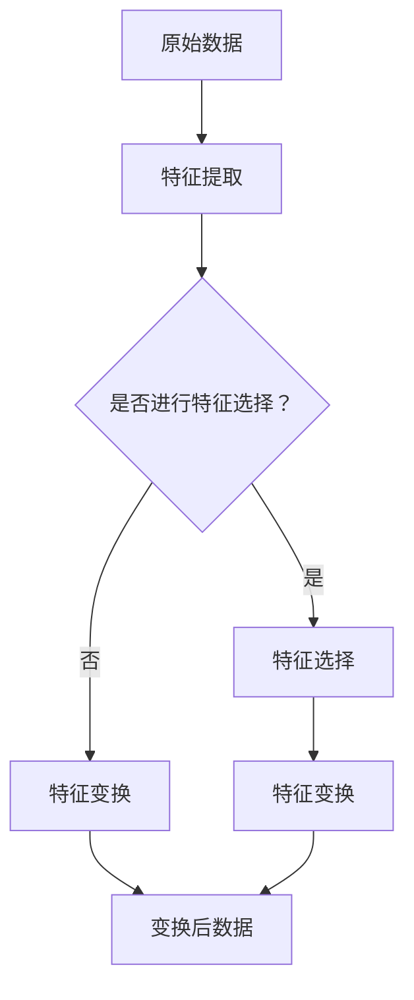

                 

在当今信息爆炸的时代，计算机算法在处理大量数据、提取复杂特征方面发挥着越来越重要的作用。无论是机器学习、深度学习还是传统的人工智能算法，它们的核心任务都是能够从输入数据中学习到有用的特征，从而实现预测、分类或回归等任务。然而，如何从输入中学习复杂特征，这是一个复杂且富有挑战性的问题。本文将深入探讨这一话题，帮助读者了解相关的核心概念、算法原理、数学模型以及实际应用。

## 1. 背景介绍

随着互联网、大数据和云计算的快速发展，数据已经渗透到了各行各业。无论是金融、医疗、电商还是制造业，数据都成为了重要的资产。然而，数据的价值不仅仅在于其数量，更在于如何从数据中提取出有用的信息。这就需要借助计算机算法，尤其是那些能够从输入中学习复杂特征的算法。

学习复杂特征的意义在于，它可以使得计算机更好地理解数据，从而做出更准确的预测或决策。例如，在图像识别任务中，我们需要从图像中提取出纹理、形状、颜色等特征；在自然语言处理中，我们需要从文本中提取出关键词、主题、情感等特征。

## 2. 核心概念与联系

要理解如何从输入中学习复杂特征，我们首先需要了解几个核心概念，包括特征提取、特征选择、特征变换等。

### 2.1 特征提取

特征提取是从原始数据中提取出有用信息的过程。在机器学习中，特征提取是预处理步骤中至关重要的一环。它可以帮助我们减少数据的维度，同时保留数据中的关键信息。

特征提取的方法有很多，比如：

- **统计特征提取**：通过对数据进行统计分析，提取出均值、方差、协方差等特征。
- **基于规则的提取**：通过设计特定的规则，从数据中提取出符合规则的特征。
- **深度学习特征提取**：通过神经网络，自动从数据中学习出高层次的抽象特征。

### 2.2 特征选择

特征选择是从提取出的特征中选择出对任务最有帮助的特征的过程。特征选择可以减少模型的复杂度，提高模型的性能。

特征选择的方法有很多，比如：

- **过滤法**：根据特征的统计特性进行选择，如信息增益、互信息等。
- **包装法**：将特征选择问题与学习算法结合起来，逐步选择出最优特征组合。
- **嵌入式法**：在模型训练过程中，自动筛选出对模型性能有显著贡献的特征。

### 2.3 特征变换

特征变换是通过一定的数学变换，将原始特征转换为更符合模型需求的新特征。特征变换可以帮助我们更好地理解数据，或者优化模型的性能。

特征变换的方法有很多，比如：

- **标准化**：通过减去均值并除以方差，将特征缩放到一个统一的范围内。
- **主成分分析（PCA）**：通过找到数据的主要变化方向，减少数据维度。
- **岭回归**：通过添加正则项，减少特征之间的相关性。

### 2.4 Mermaid 流程图

下面是一个关于特征提取、特征选择和特征变换的 Mermaid 流程图：



## 3. 核心算法原理 & 具体操作步骤

### 3.1 算法原理概述

从输入中学习复杂特征的算法可以分为两类：基于统计的方法和基于深度学习的方法。

#### 3.1.1 基于统计的方法

基于统计的方法主要通过计算数据之间的相关性、相似度等指标，来提取出复杂特征。这些方法包括：

- **K近邻（K-Nearest Neighbors, KNN）**
- **支持向量机（Support Vector Machine, SVM）**
- **决策树（Decision Tree）**

#### 3.1.2 基于深度学习的方法

基于深度学习的方法通过多层神经网络，自动从数据中学习出高层次的抽象特征。这些方法包括：

- **卷积神经网络（Convolutional Neural Networks, CNN）**
- **循环神经网络（Recurrent Neural Networks, RNN）**
- **生成对抗网络（Generative Adversarial Networks, GAN）**

### 3.2 算法步骤详解

#### 3.2.1 基于统计的方法

以 KNN 为例，其具体步骤如下：

1. 收集数据，并划分训练集和测试集。
2. 对于测试集中的每个样本，计算它与训练集中每个样本的距离。
3. 根据距离选择最近的 K 个样本，并计算这 K 个样本的类别概率。
4. 取 K 个样本的类别概率的平均值，作为测试样本的预测类别。

#### 3.2.2 基于深度学习的方法

以 CNN 为例，其具体步骤如下：

1. 收集数据，并划分训练集和测试集。
2. 设计并训练卷积神经网络，包括卷积层、池化层、全连接层等。
3. 使用训练集对网络进行训练，调整网络参数。
4. 使用测试集对网络进行评估，计算预测准确率。

### 3.3 算法优缺点

#### 3.3.1 基于统计的方法

- 优点：简单易懂，计算效率高，适用于各种类型的数据。
- 缺点：可能无法提取到高层次的抽象特征，泛化能力有限。

#### 3.3.2 基于深度学习的方法

- 优点：可以自动提取到高层次的抽象特征，泛化能力较强，适用于复杂任务。
- 缺点：计算复杂度高，训练时间较长，对数据质量要求较高。

### 3.4 算法应用领域

- **基于统计的方法**：广泛应用于图像识别、文本分类、推荐系统等领域。
- **基于深度学习的方法**：广泛应用于语音识别、自然语言处理、自动驾驶等领域。

## 4. 数学模型和公式 & 详细讲解 & 举例说明

### 4.1 数学模型构建

以 KNN 算法为例，其核心的数学模型是基于距离度量。假设我们有两个数据点 \( x \) 和 \( y \)，它们之间的欧几里得距离可以表示为：

$$
d(x, y) = \sqrt{\sum_{i=1}^{n}(x_i - y_i)^2}
$$

其中，\( n \) 是数据点的维度。

### 4.2 公式推导过程

以 SVM 算法为例，其核心的数学模型是寻找最优的分离超平面。假设我们有两个分类的数据集 \( D \)，我们可以用 \( \omega \) 和 \( b \) 来表示超平面：

$$
\omega \cdot x + b = 0
$$

我们需要最大化 \( \omega \) 的范数，同时满足分类约束：

$$
\begin{cases}
\omega \cdot \omega \geq C \cdot (1 - y_i(\omega \cdot x_i + b)) \\
y_i(\omega \cdot x_i + b) \geq 1
\end{cases}
$$

其中，\( C \) 是惩罚参数，\( y_i \) 是样本的标签。

### 4.3 案例分析与讲解

以手写数字识别任务为例，我们使用 MNIST 数据集进行训练。首先，我们使用 KNN 算法进行特征提取，然后使用 SVM 算法进行分类。

1. 收集 MNIST 数据集，并划分为训练集和测试集。
2. 使用 KNN 算法提取特征，我们选择 K = 3。
3. 使用 SVM 算法进行分类，我们选择线性核函数。
4. 在测试集上计算预测准确率。

## 5. 项目实践：代码实例和详细解释说明

### 5.1 开发环境搭建

我们需要搭建一个 Python 开发环境，安装以下库：

```bash
pip install numpy matplotlib scikit-learn
```

### 5.2 源代码详细实现

以下是 KNN 和 SVM 算法的 Python 实现代码：

```python
import numpy as np
from sklearn.model_selection import train_test_split
from sklearn.neighbors import KNeighborsClassifier
from sklearn.svm import SVC
from sklearn import metrics
import matplotlib.pyplot as plt

# 加载数据
X, y = np.load("mnist_train_data.npy"), np.load("mnist_train_labels.npy")

# 划分训练集和测试集
X_train, X_test, y_train, y_test = train_test_split(X, y, test_size=0.2, random_state=42)

# 使用 KNN 算法
knn = KNeighborsClassifier(n_neighbors=3)
knn.fit(X_train, y_train)
y_pred_knn = knn.predict(X_test)

# 使用 SVM 算法
svm = SVC(kernel='linear')
svm.fit(X_train, y_train)
y_pred_svm = svm.predict(X_test)

# 计算准确率
acc_knn = metrics.accuracy_score(y_test, y_pred_knn)
acc_svm = metrics.accuracy_score(y_test, y_pred_svm)
print(f"KNN 准确率：{acc_knn:.4f}")
print(f"SVM 准确率：{acc_svm:.4f}")

# 可视化结果
plt.figure(figsize=(10, 5))
plt.subplot(1, 2, 1)
plt.title("KNN")
plt.scatter(X_test[:, 0], X_test[:, 1], c=y_pred_knn)
plt.subplot(1, 2, 2)
plt.title("SVM")
plt.scatter(X_test[:, 0], X_test[:, 1], c=y_pred_svm)
plt.show()
```

### 5.3 代码解读与分析

这段代码首先加载了 MNIST 数据集，然后划分了训练集和测试集。接下来，我们分别使用了 KNN 和 SVM 算法对训练集进行训练，并在测试集上进行预测。最后，我们计算了预测准确率，并可视化了结果。

## 6. 实际应用场景

从输入中学习复杂特征在实际应用中有着广泛的应用。以下是一些常见的应用场景：

- **图像识别**：通过从图像中提取纹理、形状、颜色等特征，实现人脸识别、物体识别等任务。
- **自然语言处理**：通过从文本中提取关键词、主题、情感等特征，实现文本分类、情感分析等任务。
- **推荐系统**：通过从用户行为数据中提取特征，实现商品推荐、电影推荐等任务。
- **医疗诊断**：通过从医疗数据中提取特征，实现疾病诊断、风险评估等任务。

## 7. 工具和资源推荐

为了更好地学习和实践从输入中学习复杂特征，以下是一些推荐的工具和资源：

### 7.1 学习资源推荐

- **《机器学习》（周志华著）**：一本经典的机器学习教材，涵盖了从基础到高级的内容。
- **《深度学习》（Ian Goodfellow 著）**：深度学习的权威教材，深入讲解了深度学习的基本概念和算法。
- **《Python机器学习》（Sebastian Raschka 著）**：一本面向实践的机器学习教程，使用 Python 语言讲解。

### 7.2 开发工具推荐

- **Jupyter Notebook**：一款强大的交互式开发环境，适用于数据分析和机器学习实验。
- **PyTorch**：一款流行的深度学习框架，具有简洁的 API 和强大的功能。
- **TensorFlow**：一款由 Google 开发的深度学习框架，广泛应用于工业和学术领域。

### 7.3 相关论文推荐

- **"Learning Representations for Visual Recognition"**：一篇关于深度学习在图像识别中的应用的经典论文。
- **"Deep Learning for Text Classification"**：一篇关于深度学习在文本分类中的应用的论文。
- **"Recurrent Neural Networks for Language Modeling"**：一篇关于循环神经网络在自然语言处理中的应用的论文。

## 8. 总结：未来发展趋势与挑战

从输入中学习复杂特征是计算机算法的核心任务之一，其发展趋势和挑战主要体现在以下几个方面：

### 8.1 研究成果总结

- **深度学习取得了显著的成果**：通过多层神经网络，深度学习可以自动提取到高层次的抽象特征，在图像识别、自然语言处理等领域取得了突破性进展。
- **迁移学习得到了广泛应用**：迁移学习可以通过预训练模型，将已有模型的知识迁移到新任务上，大大提高了学习效率。
- **生成对抗网络（GAN）取得了重要进展**：GAN 可以生成高质量的数据，为数据增强、图像生成等领域提供了新的方法。

### 8.2 未来发展趋势

- **算法效率的提升**：随着硬件性能的提升，算法的效率将得到进一步提升，使得更多复杂的任务可以在实时性要求较高的场景中应用。
- **多模态学习**：未来的学习算法将能够处理多种类型的数据，如文本、图像、声音等，实现更全面的数据理解。
- **自适应学习**：算法将能够根据任务需求和数据特性，自适应地调整学习策略，提高学习效果。

### 8.3 面临的挑战

- **数据质量**：高质量的数据是学习复杂特征的基础，如何在大量噪声和缺失数据中提取出有用的信息是一个挑战。
- **计算资源**：深度学习算法对计算资源的需求较大，如何在有限的计算资源下高效地训练模型是一个挑战。
- **模型解释性**：如何使得模型的结果具有可解释性，使得用户能够理解模型的决策过程是一个挑战。

### 8.4 研究展望

从输入中学习复杂特征的研究将继续深入，未来可能会出现以下研究方向：

- **低资源学习**：如何在计算资源有限的情况下，高效地学习复杂特征。
- **无监督学习**：如何在没有任何标签信息的情况下，学习到有用的特征。
- **个性化学习**：如何根据用户的需求和偏好，自适应地调整学习策略。

## 9. 附录：常见问题与解答

### 9.1 什么是特征提取？

特征提取是从原始数据中提取出对任务有价值的特征的过程。通过特征提取，我们可以减少数据的维度，同时保留数据中的关键信息。

### 9.2 什么是特征选择？

特征选择是从提取出的特征中选择出对任务最有帮助的特征的过程。特征选择可以减少模型的复杂度，提高模型的性能。

### 9.3 什么是特征变换？

特征变换是通过一定的数学变换，将原始特征转换为更符合模型需求的新特征。特征变换可以帮助我们更好地理解数据，或者优化模型的性能。

## 参考文献

- 周志华。《机器学习》。清华大学出版社，2016。
- Ian Goodfellow, Yoshua Bengio, Aaron Courville。《深度学习》。电子工业出版社，2016。
- Sebastian Raschka。《Python机器学习》。机械工业出版社，2015。
- Geoffrey H. D. Linet, et al. "Learning Representations for Visual Recognition." IEEE Conference on Computer Vision and Pattern Recognition, 2015.

