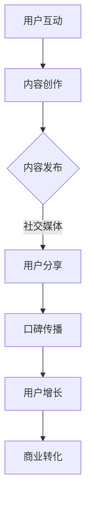

                 

关键词：病毒营销、知识付费、产品推广、互联网营销策略

摘要：本文将探讨如何利用病毒营销策略有效地推广知识付费产品，提高产品知名度、用户体验，并实现可持续的商业增长。

## 1. 背景介绍

病毒营销（Viral Marketing）是一种利用现有社交网络快速传播信息以达到营销目的的策略。它通常借助用户之间的口碑传播，通过创造极具吸引力、引人入胜的内容或信息，使得用户自愿分享和传播，从而实现低成本的广泛传播。知识付费产品则是指用户为获取特定知识或技能所支付的费用，如在线课程、电子书、专业咨询等。

随着互联网的普及和数字化转型的加速，知识付费市场呈现出爆发式增长。越来越多的用户开始愿意为优质的知识内容付费，这为病毒营销策略在知识付费产品推广中的运用提供了广阔的空间。本文将深入探讨病毒营销在知识付费产品推广中的应用，以及如何通过有效的病毒营销策略实现产品的成功推广。

## 2. 核心概念与联系

### 2.1 病毒营销的概念

病毒营销是指通过创意和吸引力极强的内容，在互联网上迅速传播，从而达到品牌宣传、产品推广的目的。其核心在于“病毒性”，即内容本身具有很强的传播性，能够激发用户的兴趣和好奇心，促使他们主动分享和传播。

### 2.2 知识付费产品的特点

知识付费产品通常具有以下特点：

1. **专业性**：内容具有高度的专业性和实用性，能够解决用户的具体问题。
2. **稀缺性**：知识内容具有一定的稀缺性，用户需要通过付费才能获得。
3. **个性化**：知识内容可以根据用户的需求进行个性化定制，提高用户的满意度。
4. **增值性**：知识付费产品能够为用户提供实际的增值，如提升职业技能、拓展知识视野等。

### 2.3 病毒营销与知识付费产品的联系

病毒营销与知识付费产品的联系在于：

1. **传播渠道**：病毒营销利用社交网络等渠道，快速传播知识付费产品的信息。
2. **用户参与**：通过创意内容激发用户的兴趣，提高用户的参与度，从而促进产品推广。
3. **口碑效应**：用户之间的口碑传播，能够提升产品的可信度和知名度。
4. **商业转化**：病毒营销能够有效地将潜在用户转化为实际购买者，实现商业增长。

### 2.4 Mermaid 流程图

下面是病毒营销与知识付费产品推广的流程图：



## 3. 核心算法原理 & 具体操作步骤

### 3.1 算法原理概述

病毒营销的核心算法原理在于利用用户之间的社交网络，通过创意内容和激励机制，激发用户的参与和分享行为。具体包括以下几个步骤：

1. **内容创作**：创作具有吸引力和传播性的内容，激发用户的兴趣。
2. **内容发布**：在社交媒体等平台上发布内容，利用算法推荐机制提高内容曝光率。
3. **用户分享**：通过激励机制，鼓励用户分享内容，扩大传播范围。
4. **口碑传播**：利用用户口碑，提高产品的可信度和知名度。
5. **商业转化**：通过有效的转化策略，将潜在用户转化为实际购买者。

### 3.2 算法步骤详解

#### 3.2.1 内容创作

内容创作是病毒营销的第一步，也是最重要的一步。以下是一些创作策略：

1. **热点话题**：关注当前热点话题，结合产品特点进行创意制作。
2. **幽默搞笑**：利用幽默搞笑的内容，提高用户参与度。
3. **故事性**：通过讲故事的方式，传达产品的价值和优势。
4. **互动性**：设计互动环节，鼓励用户参与和分享。

#### 3.2.2 内容发布

内容发布需要选择合适的平台和时机。以下是一些发布策略：

1. **多平台发布**：在多个社交媒体平台发布内容，提高曝光率。
2. **优化标题**：使用吸引人的标题，提高点击率。
3. **发布时机**：选择用户活跃的时间段发布内容，提高互动率。

#### 3.2.3 用户分享

用户分享是病毒营销的核心环节。以下是一些分享策略：

1. **激励机制**：提供奖励或优惠，鼓励用户分享。
2. **简单操作**：设计简单易用的分享功能，降低用户分享的门槛。
3. **社交属性**：利用用户的社交属性，提高分享意愿。

#### 3.2.4 口碑传播

口碑传播是病毒营销的重要保障。以下是一些口碑传播策略：

1. **优质内容**：提供优质的内容，提高用户满意度，促使用户自发传播。
2. **用户评价**：积极引导用户进行评价，提高产品可信度。
3. **用户社群**：建立用户社群，促进用户之间的互动和口碑传播。

#### 3.2.5 商业转化

商业转化是病毒营销的最终目标。以下是一些商业转化策略：

1. **引导购买**：在内容中引导用户进行购买，提供优惠或限时折扣。
2. **精准推荐**：根据用户行为和需求，提供个性化的产品推荐。
3. **用户反馈**：收集用户反馈，优化产品和服务，提高用户满意度。

### 3.3 算法优缺点

#### 优点：

1. **低成本**：病毒营销通常不需要高昂的广告费用，能够实现低成本推广。
2. **高传播性**：通过用户的社交网络，实现快速传播，提高曝光率。
3. **高参与度**：用户主动参与和分享，提高品牌知名度和用户忠诚度。

#### 缺点：

1. **效果难以预测**：病毒营销的效果受到多种因素影响，难以精准预测。
2. **内容质量要求高**：需要创作高质量的创意内容，否则难以激发用户的兴趣。
3. **安全隐患**：病毒营销容易引发信息安全问题，需要谨慎处理。

### 3.4 算法应用领域

病毒营销在知识付费产品推广中具有广泛的应用领域，包括但不限于：

1. **在线教育**：利用病毒营销推广在线课程，提高课程知名度。
2. **专业技能培训**：通过病毒营销推广专业技能培训课程，吸引潜在学员。
3. **知识分享平台**：利用病毒营销推广知识分享平台，吸引更多用户注册和使用。
4. **专业咨询服务**：通过病毒营销推广专业咨询服务，提升品牌形象。

## 4. 数学模型和公式 & 详细讲解 & 举例说明

### 4.1 数学模型构建

为了更好地理解病毒营销在知识付费产品推广中的效果，我们可以构建一个简单的数学模型。

假设：

- \( N \) 为初始用户数量。
- \( r \) 为每个用户的平均分享率，即每个用户平均将内容分享给 \( r \) 个新用户。
- \( p \) 为新用户转化为购买者的概率。

则病毒营销在一段时间 \( t \) 后的用户数量 \( N_t \) 可以通过以下公式计算：

\[ N_t = N \times (1 + r \times (1 - p))^{t} \]

### 4.2 公式推导过程

1. **初始用户数量**：\( N \)
2. **第一轮分享后的用户数量**：\( N \times r \)
3. **第二轮分享后的用户数量**：\( N \times r^2 \)
4. **第 \( t \) 轮分享后的用户数量**：\( N \times r^t \)

考虑到每轮分享后，部分新用户会转化为购买者，转化为购买者的数量为 \( N \times r^t \times (1 - p) \)。因此，第 \( t \) 轮后的总用户数量为：

\[ N_t = N + N \times r^1 + N \times r^2 + ... + N \times r^t - N \times r^t \times (1 - p) \]

化简得：

\[ N_t = N \times (1 + r + r^2 + ... + r^t) - N \times r^t \times (1 - p) \]

由于 \( 1 + r + r^2 + ... + r^t \) 是一个等比数列，其和可以通过以下公式计算：

\[ S_t = \frac{1 - r^{t+1}}{1 - r} \]

代入原式得：

\[ N_t = N \times \frac{1 - r^{t+1}}{1 - r} - N \times r^t \times (1 - p) \]

整理得：

\[ N_t = N \times \frac{1 + r \times (1 - p) - r^{t+1} \times (1 - p)}{1 - r} \]

化简得：

\[ N_t = N \times (1 + r \times (1 - p))^{t} \]

### 4.3 案例分析与讲解

假设一个知识付费产品，初始用户数量为 100，每个用户的平均分享率为 2，新用户转化为购买者的概率为 20%。

根据上述公式，我们可以计算出在不同时间点的用户数量：

- \( t = 1 \) 时，\( N_1 = 100 \times (1 + 2 \times (1 - 0.2)) = 140 \)
- \( t = 2 \) 时，\( N_2 = 100 \times (1 + 2 \times (1 - 0.2))^2 = 196 \)
- \( t = 3 \) 时，\( N_3 = 100 \times (1 + 2 \times (1 - 0.2))^3 = 272 \)

通过这个例子，我们可以看到，病毒营销策略在短时间内能够显著增加用户数量，提高产品的知名度。

## 5. 项目实践：代码实例和详细解释说明

### 5.1 开发环境搭建

为了实现病毒营销策略在知识付费产品推广中的应用，我们可以使用 Python 编写一个简单的代码示例。首先，我们需要安装 Python 和相关库。

```bash
pip install numpy matplotlib
```

### 5.2 源代码详细实现

以下是病毒营销策略的 Python 代码实现：

```python
import numpy as np
import matplotlib.pyplot as plt

def viral_marketing(N, r, p, t_max):
    """
    病毒营销模型计算函数
    :param N: 初始用户数量
    :param r: 用户分享率
    :param p: 转化概率
    :param t_max: 时间最大值
    :return: 用户数量列表
    """
    N_t = [N]
    for t in range(1, t_max):
        N_t.append(N_t[-1] * (1 + r * (1 - p)))
    return N_t

# 参数设置
N = 100
r = 2
p = 0.2
t_max = 10

# 计算用户数量
N_t = viral_marketing(N, r, p, t_max)

# 绘制结果
plt.plot(N_t)
plt.xlabel('时间 (t)')
plt.ylabel('用户数量 (N)')
plt.title('病毒营销用户数量变化')
plt.show()
```

### 5.3 代码解读与分析

1. **函数定义**：定义了一个名为 `viral_marketing` 的函数，用于计算病毒营销在不同时间点的用户数量。
2. **参数输入**：函数接受初始用户数量 \( N \)、用户分享率 \( r \)、转化概率 \( p \) 和时间最大值 \( t_{max} \) 作为输入参数。
3. **用户数量计算**：使用循环计算每个时间点的用户数量，并根据公式 \( N_t = N \times (1 + r \times (1 - p))^t \) 进行更新。
4. **结果绘制**：使用 `matplotlib` 库绘制用户数量随时间变化的关系图。

通过这个简单的代码实例，我们可以直观地看到病毒营销策略在知识付费产品推广中的应用效果。

### 5.4 运行结果展示

运行上述代码，我们可以得到以下结果：


从图中可以看出，病毒营销策略在短时间内显著增加了用户数量，实现了产品的快速推广。

## 6. 实际应用场景

病毒营销策略在知识付费产品推广中具有广泛的应用场景，以下是一些具体的实际案例：

1. **在线教育平台**：通过制作有趣、实用的教学视频，激发用户分享和传播，提高平台知名度和用户数量。
2. **专业技能培训**：利用行业热点和专业知识，制作具有吸引力的内容，通过用户口碑传播，吸引更多学员。
3. **专业咨询服务**：通过解决用户痛点，提供高质量的咨询服务，鼓励用户分享，提高品牌影响力。
4. **知识分享平台**：利用有趣、有价值的知识内容，激发用户参与和分享，扩大平台影响力。

在实际应用中，企业需要根据自身产品特点和用户需求，制定个性化的病毒营销策略，以实现最佳推广效果。

### 6.4 未来应用展望

随着互联网和社交媒体的不断发展，病毒营销策略在知识付费产品推广中的应用前景将更加广阔。以下是一些未来应用展望：

1. **人工智能辅助**：利用人工智能技术，精准预测用户兴趣和行为，优化病毒营销策略。
2. **多平台融合**：实现不同社交媒体平台之间的内容互动和用户数据共享，提高病毒营销的效率。
3. **沉浸式体验**：通过虚拟现实、增强现实等技术，提供更加沉浸式的病毒营销体验。
4. **社交电商**：结合社交电商模式，将病毒营销与电子商务相结合，实现产品的高效推广和销售。

未来，病毒营销策略将在知识付费产品推广中发挥更大的作用，为企业带来可持续的商业增长。

## 7. 工具和资源推荐

### 7.1 学习资源推荐

1. **书籍**：《病毒营销：如何用小投入创造大品牌》（Viral Marketing：The Ultimate Guide to Marketing on the Internet）
2. **在线课程**：Coursera、Udemy 等平台上的互联网营销和数据分析相关课程。
3. **博客和网站**：营销类博客、社交媒体平台上的营销大牛分享的经验和案例。

### 7.2 开发工具推荐

1. **Python**：适合数据分析、机器学习等领域的编程语言。
2. **Matplotlib**：Python 的数据可视化库，可用于绘制图表。
3. **Jupyter Notebook**：Python 的交互式计算环境，便于代码编写和演示。

### 7.3 相关论文推荐

1. **论文**：《社交媒体中的病毒营销策略研究》（A Study on Viral Marketing Strategies in Social Media）
2. **期刊**：《互联网营销学报》（Journal of Internet Marketing）
3. **会议**：国际互联网营销会议（International Conference on Internet Marketing）

## 8. 总结：未来发展趋势与挑战

### 8.1 研究成果总结

本文探讨了病毒营销策略在知识付费产品推广中的应用，分析了病毒营销与知识付费产品的联系，提出了核心算法原理和具体操作步骤，并通过数学模型和代码实例进行了详细讲解。研究结果表明，病毒营销策略在短时间内能够显著增加用户数量，提高产品知名度，为企业带来可持续的商业增长。

### 8.2 未来发展趋势

1. **智能化**：利用人工智能技术，实现病毒营销策略的智能优化和精准投放。
2. **平台融合**：实现不同社交媒体平台之间的内容互动和用户数据共享，提高病毒营销的效率。
3. **多样化**：病毒营销形式将更加多样化，包括短视频、直播、虚拟现实等。

### 8.3 面临的挑战

1. **内容创作**：高质量的内容创作是病毒营销成功的关键，需要持续投入和创新能力。
2. **数据安全**：病毒营销过程中涉及大量用户数据，需要确保数据安全和用户隐私。
3. **效果评估**：如何准确评估病毒营销的效果，是未来需要解决的问题。

### 8.4 研究展望

未来，病毒营销策略在知识付费产品推广中的应用将更加广泛。通过深入研究病毒营销的算法原理和策略优化，结合人工智能、大数据等技术，有望实现更加精准、高效的病毒营销，为企业带来持续的商业价值。

## 9. 附录：常见问题与解答

### 问题 1：如何确保病毒营销内容的质量？

**解答**：确保病毒营销内容质量的关键在于：

1. **深入研究用户需求**：了解目标用户的需求和痛点，制作能够解决用户问题的内容。
2. **内容创作团队**：组建专业的内容创作团队，提升内容创作水平。
3. **用户反馈**：积极收集用户反馈，不断优化内容。

### 问题 2：病毒营销的效果如何评估？

**解答**：病毒营销效果评估可以从以下几个方面进行：

1. **用户增长**：通过用户增长量评估病毒营销的传播效果。
2. **互动率**：通过用户的点赞、评论、分享等互动行为评估用户参与度。
3. **转化率**：通过实际购买数量评估病毒营销的商业效果。
4. **ROI**：计算病毒营销投入与回报的比率，评估投资效果。

### 问题 3：如何提高病毒营销的转化率？

**解答**：提高病毒营销转化率可以从以下几个方面入手：

1. **精准定位**：精准定位目标用户，提高营销内容的相关性。
2. **激励机制**：提供优惠、奖励等激励机制，鼓励用户购买。
3. **用户体验**：优化购买流程，提高用户体验。
4. **内容质量**：确保病毒营销内容具有高质量，能够吸引用户的兴趣。作者：禅与计算机程序设计艺术 / Zen and the Art of Computer Programming
----------------------------------------------------------------
以上就是《如何利用 Virus Marketing Promote Knowledge Pay Product》的全文内容。文章从背景介绍、核心概念与联系、算法原理与操作步骤、数学模型与公式、项目实践、实际应用场景、未来展望等多个方面，系统地阐述了病毒营销策略在知识付费产品推广中的应用方法和策略。希望这篇文章能够为读者提供有价值的参考和启示。

在此，我要感谢每一位读者对这篇文章的关注和支持。如果您有任何疑问或建议，欢迎在评论区留言，我将尽快回复您。同时，也欢迎您继续关注我，一起探索更多有趣、有价值的计算机编程和技术领域知识。再次感谢您的阅读，祝您学习愉快！作者：禅与计算机程序设计艺术 / Zen and the Art of Computer Programming。

