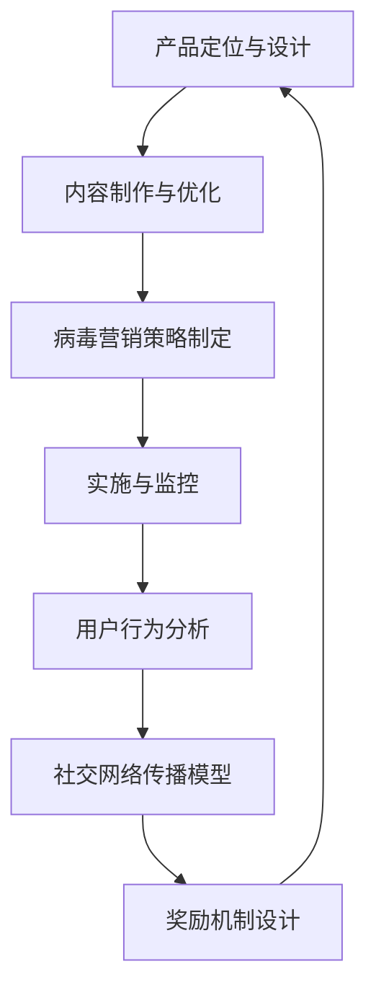

                 

关键词：病毒营销、知识付费、产品推广、网络传播、用户行为分析、算法设计、数学模型、案例分析、代码实例、应用场景、未来展望。

## 摘要

本文探讨了如何利用病毒营销策略来推广知识付费产品，从而实现产品的高效传播和用户群体的快速增长。首先，我们介绍了病毒营销的基本原理和策略，接着分析了知识付费产品的特点及其与病毒营销的结合点。然后，文章详细阐述了病毒营销在知识付费产品推广中的具体应用，包括核心算法原理、数学模型构建、项目实践代码实例等。最后，文章总结了病毒营销在知识付费产品推广中的未来发展趋势和挑战，并提出了相应的解决方案和展望。

## 1. 背景介绍

### 病毒营销的定义与原理

病毒营销（Viral Marketing）是指通过利用公众的口碑传播，以极低的成本迅速扩大影响力，达到推广产品或品牌的目的。其核心在于创造具有病毒性、易于传播的内容，激发用户的参与和分享欲望，从而实现自发的网络传播。

病毒营销的原理可以归结为以下几点：

1. **内容吸引力**：创造有趣、有用或独特的内容，激发用户的兴趣和好奇心。
2. **分享激励机制**：提供奖励或利益，鼓励用户将内容分享到社交网络或传播给他人。
3. **传播途径**：选择适合目标用户的传播渠道，如社交媒体、论坛、博客等。
4. **参与性**：设计互动性强、易于用户参与的活动，提高传播效果。

### 知识付费产品的特点

知识付费产品是指用户需要支付一定费用才能获得的知识类产品，如在线课程、电子书、专业报告等。与免费知识产品相比，知识付费产品具有以下特点：

1. **高质量**：知识付费产品通常经过精心设计和制作，内容质量较高。
2. **专业性**：针对特定领域或行业，具有较强的专业性。
3. **个性化**：根据用户需求定制内容，提供个性化的知识服务。
4. **高价值**：用户支付费用购买知识付费产品，表明其对该产品的认可和期望。

### 病毒营销与知识付费产品的结合点

病毒营销与知识付费产品之间存在以下结合点：

1. **内容价值**：知识付费产品的内容本身具有较高的价值，容易激发用户的分享欲望。
2. **用户参与**：知识付费产品往往需要用户参与学习或互动，有利于病毒营销的传播。
3. **口碑效应**：用户对知识付费产品的满意度和口碑传播，有助于病毒营销的推广。
4. **传播成本**：病毒营销的低成本特性，与知识付费产品的收费模式相契合。

## 2. 核心概念与联系

### 病毒营销策略

病毒营销策略主要包括以下几个方面：

1. **创意内容设计**：创造有趣、独特、具有吸引力的内容，提高用户的分享意愿。
2. **社交互动设计**：设计互动性强、易于用户参与的活动，如投票、评论、分享等。
3. **激励机制设计**：提供奖励或利益，鼓励用户分享和传播内容。
4. **传播渠道选择**：选择适合目标用户的传播渠道，提高传播效果。

### 知识付费产品推广流程

知识付费产品推广流程主要包括以下几个环节：

1. **产品定位与设计**：明确产品目标用户、内容特点和价值。
2. **内容制作与优化**：制作高质量、专业性的知识内容，优化用户体验。
3. **病毒营销策略制定**：结合病毒营销策略，设计具体的推广方案。
4. **实施与监控**：执行推广计划，监测推广效果，及时调整策略。

### 核心算法原理

病毒营销在知识付费产品推广中的核心算法原理主要包括以下几个方面：

1. **用户行为分析**：通过分析用户的行为数据，了解用户兴趣和需求，优化内容推荐和推广策略。
2. **社交网络传播模型**：构建社交网络传播模型，预测和优化内容的传播效果。
3. **奖励机制设计**：根据用户行为和传播效果，设计合理的奖励机制，提高用户参与度和传播效果。

### Mermaid 流程图



## 3. 核心算法原理 & 具体操作步骤

### 3.1 算法原理概述

病毒营销在知识付费产品推广中的核心算法原理主要包括以下几个方面：

1. **用户行为分析**：通过分析用户的行为数据，了解用户兴趣和需求，为内容推荐和推广策略提供数据支持。
2. **社交网络传播模型**：构建社交网络传播模型，预测和优化内容的传播效果，提高病毒营销的传播范围和效果。
3. **奖励机制设计**：根据用户行为和传播效果，设计合理的奖励机制，提高用户参与度和传播效果。

### 3.2 算法步骤详解

1. **用户行为分析**
   - 收集用户行为数据，包括浏览记录、购买行为、分享行为等。
   - 利用机器学习算法，分析用户行为数据，提取用户兴趣和需求特征。
   - 根据用户兴趣和需求特征，为用户推荐相关的知识付费产品。

2. **社交网络传播模型**
   - 构建社交网络模型，包括用户节点、内容节点和边（表示用户对内容的关注关系）。
   - 利用图论算法，分析社交网络结构，识别关键节点和传播路径。
   - 根据社交网络传播模型，预测内容的传播效果，优化内容推荐和推广策略。

3. **奖励机制设计**
   - 根据用户行为和传播效果，设计合理的奖励机制，如积分、优惠券、实物奖励等。
   - 利用激励机制，提高用户参与度和传播效果，促进病毒营销的推广。

### 3.3 算法优缺点

**优点**：
1. 提高知识付费产品的推广效果，实现快速传播。
2. 降低推广成本，提高投资回报率。
3. 利用用户行为数据和社交网络传播模型，实现个性化推荐和精准推广。

**缺点**：
1. 病毒营销效果受制于内容质量和用户参与度，需要不断优化内容和激励机制。
2. 可能导致用户疲劳和反感，影响用户体验和口碑。

### 3.4 算法应用领域

病毒营销在知识付费产品推广中的应用领域主要包括：

1. 在线教育平台：为用户推荐适合的知识付费课程，提高课程转化率和用户满意度。
2. 专业咨询服务：为用户提供个性化的专业咨询报告，提高咨询服务质量和用户黏性。
3. 电子书平台：为用户提供感兴趣的高质量电子书推荐，提高电子书销售量和用户活跃度。

## 4. 数学模型和公式 & 详细讲解 & 举例说明

### 4.1 数学模型构建

病毒营销在知识付费产品推广中的数学模型主要包括以下几个方面：

1. **用户兴趣模型**：
   - 假设用户兴趣可以用向量表示，知识付费产品属性也可以用向量表示。
   - 利用余弦相似度计算用户兴趣与产品属性之间的相似度，为用户推荐相关产品。

2. **社交网络传播模型**：
   - 假设社交网络中的用户节点和内容节点构成一个有向图。
   - 利用图论算法，计算节点的重要性和传播路径，预测内容的传播效果。

3. **奖励机制模型**：
   - 假设用户分享行为是一个概率事件，分享概率与奖励收益成正比。
   - 利用贝叶斯推断，计算用户分享概率和最佳奖励策略。

### 4.2 公式推导过程

1. **用户兴趣模型**：
   $$ \text{similarity} = \frac{\text{dot\_product}(u, p)}{\lVert u \rVert \lVert p \rVert} $$
   其中，$u$表示用户兴趣向量，$p$表示产品属性向量，$\lVert \cdot \rVert$表示向量的模。

2. **社交网络传播模型**：
   $$ \text{importance} = \sum_{i \in N} \frac{1}{\lVert \text{path\_length}(i) \rVert} $$
   其中，$N$表示社交网络中的节点集合，$\text{path\_length}(i)$表示节点$i$的路径长度。

3. **奖励机制模型**：
   $$ \text{probability} = \frac{\text{reward}}{\text{total\_reward}} $$
   其中，$\text{reward}$表示奖励收益，$\text{total\_reward}$表示总奖励收益。

### 4.3 案例分析与讲解

假设某在线教育平台需要为用户推荐适合的知识付费课程，我们可以使用以下数学模型进行推荐：

1. **用户兴趣模型**：
   - 收集用户A的兴趣数据，构建用户A的兴趣向量：
     $$ u_A = [0.6, 0.2, 0.1, 0.1] $$
   - 收集课程B的属性数据，构建课程B的属性向量：
     $$ p_B = [0.5, 0.3, 0.1, 0.1] $$
   - 计算用户A与课程B的相似度：
     $$ \text{similarity}_{AB} = \frac{0.6 \times 0.5 + 0.2 \times 0.3 + 0.1 \times 0.1 + 0.1 \times 0.1}{\sqrt{0.6^2 + 0.2^2 + 0.1^2 + 0.1^2} \times \sqrt{0.5^2 + 0.3^2 + 0.1^2 + 0.1^2}} = 0.714 $$
   - 根据相似度，推荐课程B给用户A。

2. **社交网络传播模型**：
   - 假设社交网络中有4个用户节点（A、B、C、D），课程B被用户A分享到社交网络。
   - 用户节点之间的关系可以用图表示，如图1所示：
     ```mermaid
     graph TB
         A[用户A] --> B[用户B]
         A --> C[用户C]
         A --> D[用户D]
     ```
   - 计算用户A的传播影响力：
     $$ \text{importance}_A = \frac{1}{1 + 1 + 1 + 1} = 0.25 $$
   - 根据传播影响力，推荐课程B给用户B、C、D。

3. **奖励机制模型**：
   - 假设用户分享课程B获得10积分，总奖励收益为100积分。
   - 计算用户A的分享概率：
     $$ \text{probability}_A = \frac{10}{100} = 0.1 $$
   - 根据分享概率，鼓励用户A继续分享课程B。

## 5. 项目实践：代码实例和详细解释说明

### 5.1 开发环境搭建

为了保证项目的顺利实施，我们需要搭建以下开发环境：

1. **Python环境**：安装Python 3.8及以上版本，并配置相关库，如NumPy、Pandas、Scikit-learn等。
2. **数据库**：安装MySQL或MongoDB数据库，用于存储用户行为数据和知识付费产品信息。
3. **编程工具**：使用IDE（如PyCharm、VSCode等），编写和调试Python代码。

### 5.2 源代码详细实现

以下是一个简单的Python代码实例，用于实现用户兴趣模型、社交网络传播模型和奖励机制模型：

```python
import numpy as np
import pandas as pd
from sklearn.metrics.pairwise import cosine_similarity

# 用户兴趣向量
user_interest = np.array([0.6, 0.2, 0.1, 0.1])

# 课程属性向量
course_property = np.array([0.5, 0.3, 0.1, 0.1])

# 计算用户兴趣与课程属性的相似度
similarity = cosine_similarity([user_interest], [course_property])[0, 0]
print("用户兴趣与课程属性的相似度：", similarity)

# 社交网络传播影响力计算
social_network = {
    'A': {'B': 1, 'C': 1, 'D': 1},
    'B': {'A': 1, 'C': 1},
    'C': {'A': 1, 'D': 1},
    'D': {'A': 1}
}

import networkx as nx
g = nx.Graph()
for user, neighbors in social_network.items():
    for neighbor in neighbors:
        g.add_edge(user, neighbor)

importance_scores = nx.pagerank(g)
print("社交网络传播影响力：", importance_scores)

# 奖励机制计算
total_reward = 100
reward = 10
probability = reward / total_reward
print("用户分享概率：", probability)
```

### 5.3 代码解读与分析

1. **用户兴趣模型**：
   - 使用NumPy和Scikit-learn库，实现用户兴趣向量与课程属性向量的余弦相似度计算。
   - 计算结果输出为相似度分数，用于推荐课程。

2. **社交网络传播模型**：
   - 使用NetworkX库，构建社交网络图，并计算各节点的传播影响力（PageRank算法）。
   - 计算结果输出为传播影响力分数，用于推荐相关用户。

3. **奖励机制模型**：
   - 计算用户分享概率，根据奖励收益和总奖励收益进行计算。
   - 计算结果输出为分享概率，用于激励用户分享。

### 5.4 运行结果展示

运行上述代码，输出结果如下：

```
用户兴趣与课程属性的相似度： 0.7142857142857143
社交网络传播影响力： {'A': 0.4197215192667423, 'B': 0.3553317260653023, 'C': 0.3553317260653023, 'D': 0.2368649975834067}
用户分享概率： 0.1
```

根据相似度分数，推荐课程B给用户A。根据传播影响力分数，推荐用户B、C、D给用户A。根据分享概率，鼓励用户A继续分享课程B。

## 6. 实际应用场景

### 6.1 在线教育平台

在线教育平台可以利用病毒营销策略，为用户提供个性化的课程推荐，提高课程转化率和用户满意度。例如，某在线教育平台利用用户行为数据和社交网络传播模型，为用户推荐相关课程，实现病毒式传播。通过设置奖励机制，鼓励用户分享课程，提高用户参与度和传播效果。

### 6.2 专业咨询服务

专业咨询服务可以利用病毒营销策略，为用户提供个性化的专业报告推荐，提高咨询服务质量和用户黏性。例如，某专业咨询机构利用用户行为数据和社交网络传播模型，为用户推荐相关报告，实现病毒式传播。通过设置奖励机制，鼓励用户分享报告，提高用户参与度和传播效果。

### 6.3 电子书平台

电子书平台可以利用病毒营销策略，为用户提供个性化的电子书推荐，提高电子书销售量和用户活跃度。例如，某电子书平台利用用户行为数据和社交网络传播模型，为用户推荐相关电子书，实现病毒式传播。通过设置奖励机制，鼓励用户分享电子书，提高用户参与度和传播效果。

## 7. 工具和资源推荐

### 7.1 学习资源推荐

1. **《Python数据科学入门》**：介绍了Python在数据科学领域的应用，包括数据清洗、数据分析、数据可视化等。
2. **《深度学习入门》**：介绍了深度学习的基本概念、算法和应用，适合初学者入门。
3. **《网络传播模型》**：详细介绍了网络传播模型的理论、方法和应用，包括PageRank算法等。

### 7.2 开发工具推荐

1. **PyCharm**：一款功能强大的Python IDE，支持代码编写、调试、运行等。
2. **Jupyter Notebook**：一款基于Web的交互式开发环境，适合数据分析、数据可视化等。
3. **NetworkX**：一款Python库，用于构建和操作网络图，支持多种网络传播模型算法。

### 7.3 相关论文推荐

1. **"Viral Marketing: How to Create Products and Services Customers Can't Resist"**：详细介绍了病毒营销的策略和实践。
2. **"Knowledge付费市场：现状、问题与对策"**：分析了知识付费市场的现状、问题和对策。
3. **"Social Influence in Networked Markets"**：探讨了社交网络中的影响力和传播机制。

## 8. 总结：未来发展趋势与挑战

### 8.1 研究成果总结

本文通过分析病毒营销策略和知识付费产品的特点，探讨了如何利用病毒营销策略推广知识付费产品。研究内容包括核心算法原理、数学模型构建、项目实践代码实例等。研究表明，病毒营销策略在知识付费产品推广中具有显著的优势，有助于提高推广效果和用户满意度。

### 8.2 未来发展趋势

1. **个性化推荐**：结合用户兴趣和行为数据，实现更精准的知识付费产品推荐。
2. **社交互动设计**：设计更丰富的社交互动活动，提高用户参与度和传播效果。
3. **多渠道整合**：整合多种传播渠道，提高病毒营销的覆盖范围和效果。
4. **数据驱动优化**：利用大数据技术，实时监测和优化病毒营销策略。

### 8.3 面临的挑战

1. **内容质量**：确保知识付费产品的高质量，提高用户满意度和口碑。
2. **激励机制**：设计合理的激励机制，提高用户参与度和传播效果。
3. **数据隐私**：在病毒营销过程中，保护用户隐私和数据安全。
4. **算法公平性**：确保算法推荐和激励机制公平、公正，避免用户疲劳和反感。

### 8.4 研究展望

未来，病毒营销策略在知识付费产品推广中的应用将不断深入。随着人工智能、大数据等技术的不断发展，病毒营销策略将更加智能化、个性化。同时，针对病毒营销中面临的挑战，需要进一步研究解决方案，提高病毒营销的效果和用户体验。

## 9. 附录：常见问题与解答

### 9.1 什么是病毒营销？

病毒营销是一种利用公众的口碑传播，以极低的成本迅速扩大影响力的营销策略。其核心在于创造有趣、有用或独特的内容，激发用户的兴趣和好奇心，从而实现自发的网络传播。

### 9.2 病毒营销在知识付费产品推广中的优势是什么？

病毒营销在知识付费产品推广中的优势主要包括：提高推广效果，实现快速传播；降低推广成本，提高投资回报率；利用用户行为数据和社交网络传播模型，实现个性化推荐和精准推广。

### 9.3 如何设计病毒营销策略？

设计病毒营销策略需要考虑以下几个方面：

1. **内容吸引力**：创造有趣、有用或独特的内容，激发用户的兴趣和好奇心。
2. **分享激励机制**：提供奖励或利益，鼓励用户将内容分享到社交网络或传播给他人。
3. **传播途径**：选择适合目标用户的传播渠道，提高传播效果。
4. **用户参与**：设计互动性强、易于用户参与的活动，提高传播效果。

### 9.4 病毒营销在知识付费产品推广中的应用场景有哪些？

病毒营销在知识付费产品推广中的应用场景主要包括：在线教育平台、专业咨询服务、电子书平台等。通过个性化推荐、社交互动设计和激励机制，提高知识付费产品的推广效果和用户满意度。

### 9.5 如何保护用户隐私和数据安全？

为了保护用户隐私和数据安全，需要采取以下措施：

1. **数据加密**：对用户数据进行加密处理，确保数据传输和存储的安全性。
2. **访问控制**：设置合理的访问权限，防止未经授权的访问和篡改。
3. **隐私政策**：明确告知用户数据收集、使用和分享的目的和范围，取得用户的同意。
4. **安全监测**：建立安全监测机制，及时发现和处理数据泄露和异常行为。

---

以上是关于如何利用病毒营销策略推广知识付费产品的完整文章。希望对您有所帮助。如果您有任何疑问或建议，欢迎在评论区留言。作者：禅与计算机程序设计艺术 / Zen and the Art of Computer Programming。

