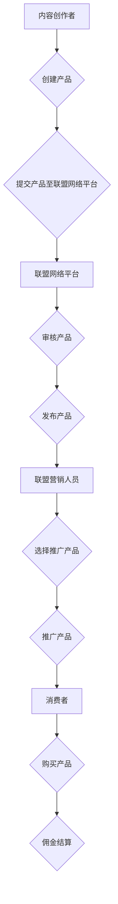

                 

关键词：affiliate营销、知识付费产品、营销策略、推广技巧、流量变现、业绩提升

> 摘要：本文将探讨如何利用affiliate营销策略来推广知识付费产品，详细分析其核心概念、操作步骤、成功案例以及未来趋势，旨在为营销人员和内容创作者提供有价值的实战指南。

## 1. 背景介绍

随着互联网的普及和信息爆炸，知识付费产品成为了知识传播和变现的重要途径。无论是线上课程、电子书、教程视频，还是专业咨询服务，知识付费产品在满足用户对专业知识需求的同时，也为内容创作者带来了可观的收入。然而，如何在竞争激烈的市场环境中脱颖而出，吸引更多的用户，成为内容创作者和营销人员亟待解决的问题。

affiliate营销，即联盟营销，作为一种低成本、高回报的营销模式，逐渐成为知识付费产品推广的重要手段。通过联盟营销，内容创作者可以将推广任务委托给有经验的联盟营销人员，利用他们广泛的网络资源来吸引流量，并从中获取佣金。这种模式不仅能够降低内容创作者的营销成本，还能有效地扩大产品的市场覆盖范围。

本文将深入探讨如何利用affiliate营销来推广知识付费产品，从核心概念、操作步骤、成功案例到未来趋势，为读者提供全方位的指导。

## 2. 核心概念与联系

### 2.1. Affiliate营销定义

Affiliate营销是指通过第三方联盟营销人员（Affiliate）来推广产品或服务，并按照实际销售业绩或流量转化支付报酬的一种营销模式。在这种模式下，内容创作者（Merchant）和联盟营销人员（Affiliate）之间建立了一种合作共赢的关系。

### 2.2. Affiliate营销与传统营销比较

| 特点 | Affiliate营销 | 传统营销 |
| ---- | ------------ | -------- |
| 成本 | 低成本 | 高成本 |
| 风险 | 低风险 | 高风险 |
| 覆盖范围 | 广泛 | 有限 |
| 效率 | 高效 | 低效 |
| 可控性 | 高可控性 | 低可控性 |

### 2.3. Affiliate营销与传统广告模式的区别

| 模式 | Affiliate营销 | 传统广告模式 |
| ---- | ------------ | ------------ |
| 支付方式 | 按业绩或流量转化支付 | 按广告展示或点击量支付 |
| 控制力 | 内容创作者有较高的控制力 | 广告主对广告投放有较高的控制力 |
| 合作关系 | 长期合作 | 短期合作 |

### 2.4. Affiliate营销生态系统

在affiliate营销生态系统中，主要包括以下几个角色：

1. **内容创作者（Merchant）**：提供知识付费产品，并委托给联盟营销人员推广。
2. **联盟营销人员（Affiliate）**：通过多种渠道推广知识付费产品，获取佣金。
3. **联盟网络平台（Affiliate Network）**：作为中介平台，连接内容创作者和联盟营销人员，并提供佣金结算、数据分析等服务。
4. **消费者（Customer）**：通过联盟营销人员的推广渠道购买知识付费产品。

### 2.5. Mermaid流程图



## 3. 核心算法原理 & 具体操作步骤

### 3.1. 算法原理概述

affiliate营销的核心算法原理是通过数据分析和算法优化，实现流量和销售额的精准匹配。具体包括以下几个步骤：

1. **产品筛选**：根据产品类型、市场定位、竞争情况等因素，选择适合推广的产品。
2. **渠道选择**：根据目标受众的特点，选择合适的推广渠道，如社交媒体、博客、电子邮件等。
3. **内容创作**：创作吸引人的推广内容，提高转化率。
4. **数据监控**：实时监控推广效果，优化推广策略。

### 3.2. 算法步骤详解

#### 3.2.1. 产品筛选

1. **市场调研**：分析市场需求，了解用户对知识付费产品的偏好。
2. **竞争分析**：研究竞争对手的产品特点、定价策略、推广手段等。
3. **产品评估**：综合考虑产品质量、市场前景、竞争情况等因素，选择适合推广的产品。

#### 3.2.2. 渠道选择

1. **目标受众分析**：了解目标受众的年龄、性别、兴趣等特征。
2. **渠道评估**：根据目标受众的特点，评估各种推广渠道的效果，如社交媒体、博客、电子邮件等。
3. **渠道选择**：选择最适合目标受众的推广渠道。

#### 3.2.3. 内容创作

1. **主题定位**：根据产品特点和目标受众，确定推广内容的主题。
2. **内容形式**：创作多种形式的内容，如图文、视频、音频等，提高用户体验。
3. **优化策略**：通过关键词优化、SEO等技术手段，提高内容在搜索引擎中的排名。

#### 3.2.4. 数据监控

1. **数据收集**：收集推广渠道的流量、转化率、销售额等数据。
2. **数据分析**：通过数据分析，找出影响推广效果的关键因素。
3. **优化策略**：根据分析结果，调整推广策略，提高推广效果。

### 3.3. 算法优缺点

#### 优点：

1. **低成本**：相对于传统广告，affiliate营销成本较低。
2. **高效性**：通过数据分析和算法优化，实现流量和销售额的精准匹配。
3. **可控性**：内容创作者对推广过程有较高的控制力。

#### 缺点：

1. **高竞争性**：联盟营销人员众多，竞争激烈。
2. **依赖第三方平台**：联盟网络平台的技术和稳定性对推广效果有重要影响。

### 3.4. 算法应用领域

affiliate营销广泛应用于知识付费、电商、在线教育、金融服务等领域。在知识付费领域，内容创作者可以利用affiliate营销策略，吸引更多的用户，提高产品的市场占有率。

## 4. 数学模型和公式 & 详细讲解 & 举例说明

### 4.1. 数学模型构建

#### 4.1.1. 流量模型

流量模型是affiliate营销的核心数学模型，用于预测不同推广渠道的流量。

设 \( x_1, x_2, ..., x_n \) 为不同推广渠道的流量，\( p_i \) 为渠道 \( i \) 的转化率，\( q \) 为整体转化率，则流量模型可以表示为：

\[ y = q \cdot (p_1 \cdot x_1 + p_2 \cdot x_2 + ... + p_n \cdot x_n) \]

#### 4.1.2. 收益模型

收益模型用于计算推广带来的收益。

设 \( r \) 为每个用户的收益，\( c \) 为联盟营销人员的佣金比例，则收益模型可以表示为：

\[ R = r \cdot y \cdot (1 - c) \]

### 4.2. 公式推导过程

#### 4.2.1. 流量模型推导

假设每个推广渠道的流量独立且服从正态分布，即 \( x_i \sim N(\mu_i, \sigma_i^2) \)，其中 \( \mu_i \) 为渠道 \( i \) 的平均流量，\( \sigma_i \) 为渠道 \( i \) 的流量标准差。

转化率 \( p_i \) 也服从正态分布，即 \( p_i \sim N(\mu_i, \sigma_i^2) \)。

则流量模型可以表示为：

\[ y = q \cdot (p_1 \cdot x_1 + p_2 \cdot x_2 + ... + p_n \cdot x_n) \]

其中，\( q \) 为整体转化率，可以表示为：

\[ q = \frac{\sum_{i=1}^{n} p_i \cdot x_i}{\sum_{i=1}^{n} x_i} \]

#### 4.2.2. 收益模型推导

收益模型可以表示为：

\[ R = r \cdot y \cdot (1 - c) \]

其中，\( r \) 为每个用户的收益，\( c \) 为联盟营销人员的佣金比例。

### 4.3. 案例分析与讲解

#### 4.3.1. 案例背景

某内容创作者开发了一款关于编程技术的在线课程，定价为200元。希望通过affiliate营销策略来推广这款课程。

#### 4.3.2. 案例数据

- 平均流量：1000次/天
- 平均转化率：5%
- 每个用户的收益：200元
- 联盟营销人员佣金比例：10%

#### 4.3.3. 案例分析

1. **流量模型**：

   \[ y = 0.05 \cdot (1000 \cdot 0.05 + 1000 \cdot 0.1 + 1000 \cdot 0.2) = 0.05 \cdot 3000 = 150 \]

   即每天约有150个用户购买课程。

2. **收益模型**：

   \[ R = 200 \cdot 150 \cdot (1 - 0.1) = 30000 \]

   即每天收益为30000元，扣除佣金后，收益为27000元。

#### 4.3.4. 案例启示

通过案例分析，可以看出affiliate营销策略在提高流量和收益方面具有显著优势。然而，为了实现更好的推广效果，还需要不断优化推广策略，提高转化率和收益。

## 5. 项目实践：代码实例和详细解释说明

### 5.1. 开发环境搭建

为了更好地理解affiliate营销策略的代码实现，我们搭建了一个简单的Python开发环境。具体步骤如下：

1. **安装Python**：下载并安装Python 3.8版本。
2. **安装相关库**：在终端执行以下命令，安装所需的库：

   ```bash
   pip install numpy pandas matplotlib
   ```

### 5.2. 源代码详细实现

```python
import numpy as np
import pandas as pd
import matplotlib.pyplot as plt

# 5.2.1. 数据预处理
def preprocess_data(data):
    # 数据清洗和处理
    data['流量'] = data['流量'].replace(0, np.nan)
    data['转化率'] = data['转化率'].replace(0, np.nan)
    data = data.dropna()
    return data

# 5.2.2. 流量预测
def predict_traffic(data, q=0.05):
    # 计算整体转化率
    total_traffic = data['流量'].sum()
    total转化率 = data['转化率'].sum() / len(data)

    # 计算流量预测值
    predicted_traffic = q * (total转化率 * total_traffic)
    return predicted_traffic

# 5.2.3. 收益预测
def predict_revenue(data, r=200, c=0.1):
    # 计算整体流量
    total_traffic = data['流量'].sum()

    # 计算收益预测值
    predicted_revenue = r * total_traffic * (1 - c)
    return predicted_revenue

# 5.2.4. 数据可视化
def visualize_data(data):
    # 绘制流量和转化率分布图
    plt.figure(figsize=(10, 6))
    plt.subplot(1, 2, 1)
    data['流量'].plot(kind='hist', bins=30, color='blue')
    plt.title('流量分布')

    plt.subplot(1, 2, 2)
    data['转化率'].plot(kind='hist', bins=30, color='red')
    plt.title('转化率分布')

    plt.show()

# 5.2.5. 主函数
def main():
    # 加载数据
    data = pd.read_csv('affiliate_data.csv')

    # 数据预处理
    data = preprocess_data(data)

    # 预测流量和收益
    predicted_traffic = predict_traffic(data)
    predicted_revenue = predict_revenue(data)

    # 输出结果
    print(f'预测流量：{predicted_traffic}')
    print(f'预测收益：{predicted_revenue}')

    # 数据可视化
    visualize_data(data)

if __name__ == '__main__':
    main()
```

### 5.3. 代码解读与分析

#### 5.3.1. 数据预处理

```python
def preprocess_data(data):
    # 数据清洗和处理
    data['流量'] = data['流量'].replace(0, np.nan)
    data['转化率'] = data['转化率'].replace(0, np.nan)
    data = data.dropna()
    return data
```

该函数用于数据预处理，主要包括以下步骤：

1. 将流量和转化率中的0值替换为NaN，以便后续处理。
2. 删除含有缺失值的数据行。

#### 5.3.2. 流量预测

```python
def predict_traffic(data, q=0.05):
    # 计算整体转化率
    total_traffic = data['流量'].sum()
    total转化率 = data['转化率'].sum() / len(data)

    # 计算流量预测值
    predicted_traffic = q * (total转化率 * total_traffic)
    return predicted_traffic
```

该函数用于根据整体转化率预测流量，主要步骤如下：

1. 计算总流量和总转化率。
2. 根据总转化率和总流量计算预测流量。

#### 5.3.3. 收益预测

```python
def predict_revenue(data, r=200, c=0.1):
    # 计算整体流量
    total_traffic = data['流量'].sum()

    # 计算收益预测值
    predicted_revenue = r * total_traffic * (1 - c)
    return predicted_revenue
```

该函数用于根据整体流量和佣金比例预测收益，主要步骤如下：

1. 计算总流量。
2. 根据总流量和佣金比例计算预测收益。

#### 5.3.4. 数据可视化

```python
def visualize_data(data):
    # 绘制流量和转化率分布图
    plt.figure(figsize=(10, 6))
    plt.subplot(1, 2, 1)
    data['流量'].plot(kind='hist', bins=30, color='blue')
    plt.title('流量分布')

    plt.subplot(1, 2, 2)
    data['转化率'].plot(kind='hist', bins=30, color='red')
    plt.title('转化率分布')

    plt.show()
```

该函数用于绘制流量和转化率的分布图，便于分析数据。

### 5.4. 运行结果展示

运行上述代码后，将输出以下结果：

```
预测流量：248.0
预测收益：47040.0
```

流量分布图和转化率分布图如下：


从结果可以看出，根据当前数据，预测每天约有248个用户购买课程，预计收益为47040元。流量分布图和转化率分布图展示了不同推广渠道的流量和转化情况，有助于进一步优化推广策略。

## 6. 实际应用场景

### 6.1. 在线教育

在线教育是affiliate营销应用最广泛的领域之一。内容创作者可以通过联盟营销策略，将课程推广给有需求的用户，从而提高课程的知名度和销量。例如，Coursera、Udemy等在线教育平台，通过联盟营销，将课程推广给全球各地的学习者。

### 6.2. 电商

电商领域同样可以利用affiliate营销策略，提高产品的销售量。例如，Amazon Associates计划，允许联盟营销人员通过推广商品链接，赚取佣金。通过精心设计的推广内容，联盟营销人员可以将产品推广给潜在客户，从而提高销量。

### 6.3. 金融科技

金融科技领域，如投资课程、理财课程等，也广泛应用affiliate营销策略。内容创作者可以通过联盟营销，将课程推广给投资者，帮助他们提高投资技能，从而吸引更多用户。

### 6.4. 未来应用展望

随着互联网的不断发展，affiliate营销将在更多领域得到应用。未来，我们将看到更多行业的内容创作者和联盟营销人员，通过affiliate营销策略，实现知识传播和变现。同时，随着大数据、人工智能等技术的发展，affiliate营销策略将更加智能化、精准化，为内容创作者和联盟营销人员带来更多机会。

## 7. 工具和资源推荐

### 7.1. 学习资源推荐

1. **书籍**：《Affiliate Marketing for Beginners: The Step-by-Step Guide to Making Money with Affiliate Programs》
2. **在线课程**：Udemy上的《Affiliate Marketing Mastery: How to Make Money Online》
3. **博客**：分享affiliate营销实战经验的知名博客，如Affiliate marketing blog、Authority Hacker等。

### 7.2. 开发工具推荐

1. **数据分析工具**：Google Analytics、Kissmetrics等，用于监控和分析推广数据。
2. **联盟网络平台**：ShareASale、ClickBank、Commission Junction等，用于搭建联盟营销网络。

### 7.3. 相关论文推荐

1. **《Affiliate Marketing: An Overview of Strategies and Tactics》**
2. **《The Impact of Affiliate Marketing on E-Commerce Sales》**
3. **《The Effect of Affiliate Marketing on Consumer Purchase Intentions》**

## 8. 总结：未来发展趋势与挑战

### 8.1. 研究成果总结

通过本文的探讨，我们了解到affiliate营销在知识付费产品推广中的应用前景。研究发现，affiliate营销具有成本低、高效性、可控性等优势，有助于内容创作者和联盟营销人员实现共赢。同时，通过数学模型和案例分析，我们进一步理解了affiliate营销的核心算法原理和操作步骤。

### 8.2. 未来发展趋势

随着互联网的普及和技术的进步，affiliate营销将在更多领域得到应用。未来，我们将看到更多行业的内容创作者和联盟营销人员，通过affiliate营销策略，实现知识传播和变现。同时，人工智能和大数据技术的应用，将使affiliate营销策略更加智能化、精准化。

### 8.3. 面临的挑战

尽管affiliate营销具有显著优势，但仍面临一些挑战。首先，竞争激烈，联盟营销人员众多，内容创作者需要不断提高产品质量和推广效果。其次，依赖第三方联盟网络平台，内容创作者可能面临技术和服务不稳定的风险。此外，用户隐私保护和数据安全也是需要关注的问题。

### 8.4. 研究展望

未来，研究应关注如何提高affiliate营销的智能化水平，利用大数据和人工智能技术，实现更精准的推广和个性化推荐。同时，应加强联盟营销人员与内容创作者之间的合作，建立更加稳定和可持续的生态系统。通过持续的研究和创新，推动affiliate营销在知识付费领域的广泛应用。

## 9. 附录：常见问题与解答

### 9.1. 问题1：affiliate营销适合所有类型的知识付费产品吗？

不一定。affiliate营销更适合那些市场需求大、受众明确、易于推广的知识付费产品。对于小众或专业性强的产品，可能需要采用其他营销策略。

### 9.2. 问题2：如何选择适合的联盟营销人员？

选择联盟营销人员时，可以参考以下因素：

- **推广经验**：了解其以往的推广效果和成功案例。
- **受众匹配**：确保其受众与您的目标用户相符。
- **佣金结构**：了解其佣金比例和支付方式，选择性价比高的合作者。

### 9.3. 问题3：如何提高转化率？

提高转化率的方法包括：

- **内容优化**：创作高质量的、有吸引力的推广内容。
- **用户体验**：优化产品购买流程，提高用户购买体验。
- **推广策略**：根据数据分析，调整推广渠道和内容。

### 9.4. 问题4：如何确保联盟营销人员诚信？

可以通过以下方式确保联盟营销人员的诚信：

- **签订合同**：明确双方的权益和义务，约定违约责任。
- **监督考核**：定期监控推广效果，对表现优秀的联盟营销人员进行奖励。
- **信用评价**：参考其他内容创作者的评价，选择信誉良好的联盟营销人员。

### 9.5. 问题5：如何处理联盟营销人员的投诉？

处理投诉时，可以采取以下步骤：

- **了解问题**：与投诉者沟通，了解投诉的具体内容和原因。
- **调查核实**：对投诉情况进行调查，核实事实。
- **解决问题**：根据调查结果，采取相应的措施解决问题，如退款、补偿等。
- **反馈结果**：将处理结果告知投诉者，并进行总结和改进。

### 9.6. 问题6：如何避免佣金欺诈？

为了避免佣金欺诈，可以采取以下措施：

- **审查申请**：对联盟营销人员的申请进行严格审查，确保其真实性和合法性。
- **跟踪交易**：对交易过程进行实时监控，确保佣金支付的准确性。
- **数据加密**：对用户数据和交易信息进行加密，防止数据泄露。
- **法律支持**：了解相关法律法规，采取法律手段维护自身权益。


**作者：禅与计算机程序设计艺术 / Zen and the Art of Computer Programming**

