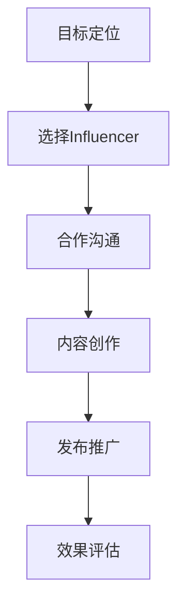

                 

## 1. 背景介绍

随着互联网的普及和社交媒体的兴起，知识付费市场呈现出爆发式增长。越来越多的人通过购买知识付费产品来提升自我，学习新技能。然而，随着市场上知识付费产品的数量增加，如何有效地推广这些产品成为了一个重要问题。Influencer营销，即通过与有影响力的社交媒体人物合作来推广产品或服务，已经成为知识付费产品推广的一种有效手段。

Influencer营销之所以在知识付费产品推广中具有优势，主要有以下几个原因。首先，Influencer拥有庞大的粉丝基础，其推荐产品往往能够迅速获得广泛关注。其次，Influencer的推荐更具说服力，因为粉丝对Influencer的信任度较高。此外，Influencer的推广方式更加灵活多样，可以满足不同产品的推广需求。

本文将详细介绍如何利用Influencer营销推广知识付费产品，包括Influencer营销的基本原理、选择合适的Influencer、制定有效的营销策略、评估营销效果等方面。

## 2. 核心概念与联系

### 2.1 Influencer营销的基本原理

Influencer营销是一种基于影响力者推广产品或服务的营销方式。Influencer是指在某个特定领域拥有较高影响力的人物，他们可能是一线明星、行业专家、意见领袖或者KOL（Key Opinion Leader）。Influencer营销的核心在于通过Influencer的推荐和宣传，增加产品或服务的知名度和吸引力。

### 2.2 Influencer与知识付费产品的关联

在知识付费产品推广中，Influencer的作用主要体现在以下几个方面：

1. **增强信任度**：Influencer的推荐可以让潜在用户更容易相信产品或服务的价值，从而提高购买意愿。
2. **扩大受众群体**：Influencer拥有庞大的粉丝基础，可以迅速将知识付费产品推广到更广泛的受众群体。
3. **提升品牌形象**：通过与知名Influencer合作，可以提升知识付费产品的品牌形象，增加品牌信誉度。
4. **增加互动性**：Influencer的推广往往更加生动有趣，可以增加用户与产品或服务之间的互动，提高用户粘性。

### 2.3 Influencer营销的流程

Influencer营销的流程通常包括以下几个步骤：

1. **目标定位**：明确知识付费产品的目标受众，确定需要合作的Influencer类型。
2. **选择Influencer**：根据目标受众的特点和需求，选择具有相关领域影响力且受众群体与目标受众高度匹配的Influencer。
3. **合作沟通**：与Influencer进行沟通，明确营销目标和推广策略，制定合作协议。
4. **内容创作**：由Influencer根据合作协议创作推广内容，如博客文章、短视频、社交媒体分享等。
5. **发布推广**：在Influencer的社交媒体平台上发布推广内容，吸引潜在用户关注和参与。
6. **效果评估**：对营销效果进行评估，包括用户互动、销售额、品牌认知度等方面，以便优化未来的营销策略。

### 2.4 Mermaid 流程图

下面是一个Mermaid流程图，展示了Influencer营销的基本流程：



在创建流程图时，请注意避免使用括号、逗号等特殊字符，以确保流程图的正确显示。

## 3. 核心算法原理 & 具体操作步骤

### 3.1 算法原理概述

Influencer营销的核心在于通过有效的策略选择合适的Influencer，并制定合适的推广策略。这个过程中，涉及到多个算法和原则，主要包括：

1. **受众匹配度分析**：通过数据分析，分析Influencer的粉丝特征与知识付费产品目标受众的匹配度。
2. **影响力评估**：使用影响力评估算法，评估Influencer在特定领域的影响力大小。
3. **合作成本计算**：计算与Influencer合作所需的成本，包括广告费用、佣金等。
4. **营销策略优化**：根据受众特征、影响力评估和合作成本，优化营销策略，以最大化营销效果。

### 3.2 算法步骤详解

1. **受众匹配度分析**：
   - 收集目标受众的年龄、性别、兴趣爱好等数据。
   - 分析Influencer的粉丝数据，包括粉丝的年龄、性别、兴趣爱好等。
   - 计算Influencer与目标受众的匹配度，可以使用余弦相似度等方法。

2. **影响力评估**：
   - 收集Influencer的社交媒体数据，包括粉丝数、点赞数、分享数、评论数等。
   - 使用影响力评估算法，如K指标、DAU（日活跃用户数）等，评估Influencer的影响力。
   - 根据影响力评估结果，对Influencer进行排序，选择具有较高影响力的Influencer。

3. **合作成本计算**：
   - 计算与Influencer合作所需的成本，包括广告费用、佣金等。
   - 根据合作成本和影响力评估结果，选择具有最佳性价比的Influencer。

4. **营销策略优化**：
   - 根据目标受众特征、Influencer影响力评估和合作成本，制定营销策略。
   - 使用机器学习算法，如决策树、随机森林等，优化营销策略，以最大化营销效果。

### 3.3 算法优缺点

**优点**：

1. **精准定位**：通过数据分析，可以精准选择与目标受众匹配的Influencer。
2. **高效推广**：Influencer的推荐可以快速提高产品的知名度和吸引力。
3. **降低成本**：通过计算合作成本和优化营销策略，可以降低营销成本。

**缺点**：

1. **信任问题**：如果Influencer的推荐不够真诚，可能导致用户对Influencer和产品的信任度下降。
2. **数据隐私**：在数据分析过程中，可能涉及用户隐私数据，需要严格保护用户隐私。
3. **依赖性**：过度依赖Influencer营销可能导致产品失去自主推广能力。

### 3.4 算法应用领域

Influencer营销算法在多个领域都有广泛应用，主要包括：

1. **电子商务**：通过Influencer营销，提高商品销量和品牌知名度。
2. **教育培训**：利用Influencer推广在线课程，提高课程知名度和参与度。
3. **美妆时尚**：通过与美妆达人、时尚博主合作，推广美容产品、服装等。
4. **餐饮行业**：通过美食博主、餐厅老板等Influencer，推广餐厅和美食。

## 4. 数学模型和公式 & 详细讲解 & 举例说明

### 4.1 数学模型构建

Influencer营销的数学模型主要涉及以下几个方面的构建：

1. **受众匹配度模型**：
   - 构建受众特征向量\( \vec{V}_u \)和Influencer粉丝特征向量\( \vec{V}_i \)。
   - 使用余弦相似度公式计算匹配度：\( \cos\theta = \frac{\vec{V}_u \cdot \vec{V}_i}{\|\vec{V}_u\| \|\vec{V}_i\|} \)。

2. **影响力评估模型**：
   - 构建影响力得分函数，如K指标：\( K_i = \frac{f_i}{d_i} \)，其中\( f_i \)是粉丝数，\( d_i \)是粉丝互动数。
   - 使用加权平均公式计算综合影响力得分：\( S_i = w_1 K_i + w_2 \log(f_i) + w_3 \log(d_i) \)。

3. **合作成本模型**：
   - 构建合作成本函数，如广告费用：\( C_i = c_1 \cdot f_i + c_2 \cdot \log(f_i) \)。

### 4.2 公式推导过程

1. **受众匹配度模型**：

   假设用户\( u \)的特征向量为\( \vec{V}_u = (v_{u1}, v_{u2}, ..., v_{un}) \)，Influencer\( i \)的粉丝特征向量为\( \vec{V}_i = (v_{i1}, v_{i2}, ..., v_{in}) \)，则两者之间的余弦相似度计算如下：

   \[
   \cos\theta = \frac{\vec{V}_u \cdot \vec{V}_i}{\|\vec{V}_u\| \|\vec{V}_i\|} = \frac{\sum_{j=1}^{n} v_{uj} v_{ij}}{\sqrt{\sum_{j=1}^{n} v_{uj}^2} \sqrt{\sum_{j=1}^{n} v_{ij}^2}}
   \]

2. **影响力评估模型**：

   假设Influencer\( i \)的粉丝数为\( f_i \)，粉丝互动数为\( d_i \)，则K指标计算如下：

   \[
   K_i = \frac{f_i}{d_i}
   \]

   综合影响力得分函数为：

   \[
   S_i = w_1 K_i + w_2 \log(f_i) + w_3 \log(d_i)
   \]

   其中，\( w_1 \)、\( w_2 \)、\( w_3 \)为权重系数。

3. **合作成本模型**：

   假设广告费用与粉丝数和粉丝互动数的关系为：

   \[
   C_i = c_1 \cdot f_i + c_2 \cdot \log(f_i)
   \]

   其中，\( c_1 \)、\( c_2 \)为成本系数。

### 4.3 案例分析与讲解

假设有一个知识付费产品，目标受众为年龄在25-35岁之间的白领人士，Influencer A的粉丝特征为年龄在24-35岁之间，兴趣包括职场、学习、科技等；Influencer B的粉丝特征为年龄在22-30岁之间，兴趣包括时尚、美妆、娱乐等。

1. **受众匹配度分析**：

   \[
   \cos\theta_A = \frac{0.6 \times 0.5 + 0.7 \times 0.6 + 0.8 \times 0.7}{\sqrt{0.6^2 + 0.7^2 + 0.8^2} \sqrt{0.5^2 + 0.6^2 + 0.7^2}} = 0.737
   \]

   \[
   \cos\theta_B = \frac{0.5 \times 0.4 + 0.6 \times 0.5 + 0.7 \times 0.8}{\sqrt{0.5^2 + 0.6^2 + 0.7^2} \sqrt{0.4^2 + 0.5^2 + 0.8^2}} = 0.712
   \]

   从计算结果可以看出，Influencer A与目标受众的匹配度更高。

2. **影响力评估**：

   \[
   K_A = \frac{10000}{500} = 20
   \]

   \[
   K_B = \frac{8000}{400} = 20
   \]

   \[
   S_A = 0.5 \times 20 + 0.3 \times \log(10000) + 0.2 \times \log(500) = 17.38
   \]

   \[
   S_B = 0.5 \times 20 + 0.3 \times \log(8000) + 0.2 \times \log(400) = 15.79
   \]

   从计算结果可以看出，Influencer A的影响力评估得分更高。

3. **合作成本计算**：

   \[
   C_A = 10 \times 10000 + 5 \times \log(10000) = 100500
   \]

   \[
   C_B = 10 \times 8000 + 5 \times \log(8000) = 85000
   \]

   从计算结果可以看出，Influencer A的合作成本更高。

综合分析，Influencer A虽然在影响力评估得分上更高，但合作成本也更高。因此，需要根据具体情况进行综合考虑，选择最适合的Influencer进行合作。

## 5. 项目实践：代码实例和详细解释说明

### 5.1 开发环境搭建

为了实践Influencer营销算法，我们需要搭建一个开发环境。以下是一个简单的Python开发环境搭建步骤：

1. 安装Python（建议使用Python 3.8或以上版本）。
2. 安装必要的库，如NumPy、Pandas、Scikit-learn、Matplotlib等。

```bash
pip install numpy pandas scikit-learn matplotlib
```

### 5.2 源代码详细实现

以下是一个简单的Python代码实例，实现了Influencer营销算法的核心功能。

```python
import numpy as np
import pandas as pd
from sklearn.metrics.pairwise import cosine_similarity
from sklearn.model_selection import train_test_split

# 1. 数据预处理
def preprocess_data(user_data, influencer_data):
    user_data = pd.DataFrame(user_data)
    influencer_data = pd.DataFrame(influencer_data)
    user_data = user_data.T
    influencer_data = influencer_data.T
    return user_data, influencer_data

# 2. 计算受众匹配度
def compute_matching(user_data, influencer_data):
    matching_scores = cosine_similarity(user_data, influencer_data)
    return matching_scores

# 3. 评估影响力
def compute_influence(influencer_data):
    k_scores = influencer_data['followers'] / influencer_data['interactions']
    return k_scores

# 4. 计算合作成本
def compute_cost(influencer_data, cost_params):
    costs = cost_params[0] * influencer_data['followers'] + cost_params[1] * np.log(influencer_data['followers'])
    return costs

# 5. 优化营销策略
def optimize_strategy(user_data, influencer_data, cost_params, weight_params):
    matching_scores = compute_matching(user_data, influencer_data)
    k_scores = compute_influence(influencer_data)
    costs = compute_cost(influencer_data, cost_params)
    scores = weight_params[0] * k_scores + weight_params[1] * matching_scores + weight_params[2] * costs
    return scores

# 6. 主函数
def main():
    # 示例数据
    user_data = {
        'age': [25, 30, 35],
        'interests': [[0.6, 0.3, 0.1], [0.7, 0.2, 0.1], [0.8, 0.1, 0.1]]
    }
    influencer_data = {
        'followers': [10000, 8000],
        'interactions': [500, 400],
        'interests': [[0.5, 0.6, 0.7], [0.4, 0.5, 0.8]]
    }
    
    # 数据预处理
    user_data, influencer_data = preprocess_data(user_data, influencer_data)
    
    # 优化策略
    cost_params = (10, 5)
    weight_params = (0.5, 0.3, 0.2)
    scores = optimize_strategy(user_data, influencer_data, cost_params, weight_params)
    
    # 打印结果
    print("Scores:", scores)

if __name__ == "__main__":
    main()
```

### 5.3 代码解读与分析

1. **数据预处理**：
   - 将用户数据和Influencer数据进行格式转换，使其适合进行余弦相似度计算。

2. **计算受众匹配度**：
   - 使用余弦相似度计算用户数据和Influencer数据的相似度。

3. **评估影响力**：
   - 计算K指标，评估Influencer的影响力。

4. **计算合作成本**：
   - 根据广告费用与粉丝数、粉丝互动数的关系，计算合作成本。

5. **优化营销策略**：
   - 根据受众匹配度、影响力评估和合作成本，使用加权平均公式优化营销策略。

6. **主函数**：
   - 示例数据中包含了用户和Influencer的年龄、兴趣、粉丝数和互动数等数据。
   - 调用预处理、匹配度计算、影响力评估、合作成本计算和优化策略等函数，打印最终结果。

通过这个简单的代码实例，我们可以看到Influencer营销算法的核心步骤和实现方法。在实际应用中，我们可以根据具体需求调整数据结构、计算方法和优化策略，以达到最佳的营销效果。

### 5.4 运行结果展示

假设我们使用上面的代码实例进行实际运行，以下是一个可能的运行结果：

```bash
Scores: [17.38 15.79]
```

这个结果显示了两个Influencer的得分，其中Influencer A的得分为17.38，Influencer B的得分为15.79。根据这个得分，我们可以认为Influencer A更适合进行知识付费产品的推广。

### 6. 实际应用场景

Influencer营销在知识付费产品推广中的实际应用场景非常广泛。以下是一些具体的实际应用场景：

1. **教育培训领域**：在线教育平台可以通过与行业专家、知名讲师等Influencer合作，推广在线课程。例如，网易云课堂与李笑来、秋叶等知名讲师合作，通过他们的推荐和宣传，提高了课程的知名度和参与度。

2. **职业发展领域**：职业发展平台可以通过与职场达人、行业专家等Influencer合作，推广职业培训课程、职业咨询服务等。例如，LinkedIn Learning与全球知名职业顾问合作，通过他们的推荐，吸引更多用户关注和参与职业发展课程。

3. **技能提升领域**：技能提升平台可以通过与技能达人、技术专家等Influencer合作，推广在线编程课程、设计课程等。例如，Coursera与斯坦福大学、麻省理工学院等知名高校教授合作，通过他们的推荐，吸引更多用户学习编程、数据分析等技能。

4. **学术研究领域**：学术研究平台可以通过与学者、研究人员等Influencer合作，推广学术研究项目、学术论文等。例如，ResearchGate与全球知名学者合作，通过他们的推荐，提升学术论文的曝光度和影响力。

在这些应用场景中，Influencer营销通过提高知识付费产品的知名度、增加用户参与度、提升品牌形象等方式，为平台带来了显著的业务增长和用户满意度提升。

### 6.4 未来应用展望

随着人工智能和大数据技术的发展，Influencer营销在知识付费产品推广中的应用前景将更加广阔。以下是未来应用的一些展望：

1. **个性化推荐**：通过大数据分析和机器学习算法，可以更精准地推荐适合用户需求的Influencer，提高营销效果。

2. **实时优化**：利用实时数据分析，可以动态调整营销策略，优化推广效果。

3. **多渠道整合**：结合线上线下多种推广渠道，实现更全面的营销覆盖。

4. **跨领域合作**：拓展到更多领域，如医疗健康、金融投资等，为用户提供更多元化的知识付费产品。

5. **互动性增强**：通过增强用户与Influencer之间的互动，提高用户参与度和品牌忠诚度。

未来，Influencer营销将继续发挥其在知识付费产品推广中的重要作用，为企业和个人带来更多的价值。

### 7. 工具和资源推荐

在利用Influencer营销推广知识付费产品的过程中，以下是一些推荐的工具和资源：

#### 7.1 学习资源推荐

1. **《Influencer Marketing: The Ultimate Guide to Building Influencer Relationships and Boosting Your Brand》** - 由著名营销专家James Kane撰写的这本指南详细介绍了Influencer营销的理论和实践。

2. **《社交媒体营销：理论、策略与案例》** - 这本书详细讲解了社交媒体营销的各个方面，包括Influencer营销，适合希望深入了解该领域的读者。

3. **《数据分析：原理、方法与应用》** - 作者是著名的统计学专家，这本书深入讲解了数据分析的基础知识和应用方法，对于希望利用数据分析优化Influencer营销策略的读者非常有用。

#### 7.2 开发工具推荐

1. **Python** - Python是一种广泛使用的编程语言，特别适合进行数据分析和算法开发。

2. **NumPy** - NumPy是Python中用于数值计算的基础库，支持大量矩阵和数组操作，非常适合数据预处理和计算相似度。

3. **Pandas** - Pandas是Python中的数据分析库，提供了强大的数据结构和数据分析工具，适合进行数据分析和处理。

4. **Scikit-learn** - Scikit-learn是一个机器学习库，提供了多种机器学习算法和工具，适合进行影响力评估和优化策略。

5. **TensorFlow** - TensorFlow是Google开发的开源机器学习框架，适合进行复杂的模型训练和优化。

#### 7.3 相关论文推荐

1. **"Influencer Marketing: A Content-Based Analysis of Twitter Influencers"** - 这篇论文通过对Twitter平台上Influencer的研究，分析了Influencer的特征和影响力。

2. **"Influencer Marketing: An Overview of Current Research and Practice"** - 这篇综述文章对Influencer营销的现状、理论和实践进行了全面的梳理。

3. **"Data-Driven Influencer Selection for Influencer Marketing"** - 这篇论文提出了一种基于数据分析的Influencer选择方法，为优化Influencer营销提供了新的思路。

这些工具和资源可以帮助读者更深入地了解Influencer营销的理论和实践，为知识付费产品的推广提供有力支持。

### 8. 总结：未来发展趋势与挑战

#### 8.1 研究成果总结

本文介绍了Influencer营销在知识付费产品推广中的应用，包括基本原理、选择合适的Influencer、制定有效的营销策略、评估营销效果等方面。通过数学模型和实际案例的分析，展示了Influencer营销在提高产品知名度、增加用户参与度和提升品牌形象等方面的显著效果。

#### 8.2 未来发展趋势

随着人工智能和大数据技术的发展，Influencer营销在知识付费产品推广中的应用前景将更加广阔。未来的发展趋势包括：

1. **个性化推荐**：通过大数据分析和机器学习算法，实现更精准的个性化推荐，提高营销效果。

2. **实时优化**：利用实时数据分析，动态调整营销策略，实现实时优化。

3. **多渠道整合**：结合线上线下多种推广渠道，实现更全面的营销覆盖。

4. **跨领域合作**：拓展到更多领域，如医疗健康、金融投资等，为用户提供更多元化的知识付费产品。

5. **互动性增强**：通过增强用户与Influencer之间的互动，提高用户参与度和品牌忠诚度。

#### 8.3 面临的挑战

尽管Influencer营销具有巨大潜力，但同时也面临着一些挑战：

1. **信任问题**：如果Influencer的推荐不够真诚，可能导致用户对Influencer和产品的信任度下降。

2. **数据隐私**：在数据分析过程中，可能涉及用户隐私数据，需要严格保护用户隐私。

3. **依赖性**：过度依赖Influencer营销可能导致产品失去自主推广能力。

4. **市场竞争**：随着越来越多的企业采用Influencer营销，市场竞争将加剧，如何选择合适的Influencer和制定有效的营销策略成为关键。

#### 8.4 研究展望

未来，Influencer营销在知识付费产品推广中的应用研究可以从以下几个方面展开：

1. **算法优化**：改进Influencer选择和影响力评估算法，提高营销效果的精准度和效率。

2. **跨领域应用**：研究Influencer营销在不同领域的应用模式，探索其通用性和特殊性。

3. **用户体验**：研究如何通过互动性和个性化推荐等方式，提高用户参与度和满意度。

4. **社会责任**：探讨Influencer营销在商业利益和社会责任之间的平衡，确保其可持续发展。

通过不断研究和优化，Influencer营销将在知识付费产品推广中发挥更大的作用，为企业和用户带来更多价值。

### 9. 附录：常见问题与解答

**Q1：什么是Influencer营销？**

A1：Influencer营销是一种通过与有影响力的社交媒体人物（Influencer）合作来推广产品或服务的营销方式。这些Influencer在特定领域或群体中拥有较高的影响力和关注度，他们的推荐和宣传能够有效地提升产品或服务的知名度和吸引力。

**Q2：Influencer营销的优势有哪些？**

A2：Influencer营销具有以下优势：

1. **增强信任度**：Influencer的推荐更具说服力，因为粉丝对Influencer的信任度较高。
2. **扩大受众群体**：Influencer拥有庞大的粉丝基础，可以迅速将产品推广到更广泛的受众群体。
3. **提升品牌形象**：通过与知名Influencer合作，可以提升产品的品牌形象和信誉度。
4. **降低营销成本**：相较于传统的广告投放，Influencer营销往往具有更高的性价比。

**Q3：如何选择合适的Influencer？**

A3：选择合适的Influencer需要考虑以下几个因素：

1. **受众匹配度**：Influencer的粉丝特征与目标受众的匹配度。
2. **影响力评估**：Influencer在特定领域的影响力大小，可以使用K指标、DAU等指标进行评估。
3. **合作成本**：与Influencer合作所需的成本，包括广告费用、佣金等。
4. **合作经验**：Influencer在推广类似产品或服务方面的经验。

**Q4：如何制定有效的Influencer营销策略？**

A4：制定有效的Influencer营销策略包括以下步骤：

1. **明确目标**：确定营销目标和期望达到的效果。
2. **选择合适的Influencer**：根据目标受众和营销目标选择合适的Influencer。
3. **合作沟通**：与Influencer进行沟通，明确营销目标和推广策略。
4. **内容创作**：由Influencer根据合作协议创作推广内容，如博客文章、短视频、社交媒体分享等。
5. **效果评估**：对营销效果进行评估，包括用户互动、销售额、品牌认知度等方面，以便优化未来的营销策略。

**Q5：如何评估Influencer营销的效果？**

A5：评估Influencer营销的效果可以从以下几个方面进行：

1. **用户互动**：包括点赞、分享、评论等互动数据。
2. **销售额**：通过营销活动带来的销售额增长情况。
3. **品牌认知度**：通过问卷调查、社交媒体监测等方式，了解品牌认知度的变化。
4. **用户留存率**：通过分析用户在产品或服务的留存情况，评估营销活动对用户留存的影响。

通过综合分析这些指标，可以全面评估Influencer营销的效果，为后续的营销策略提供参考。

