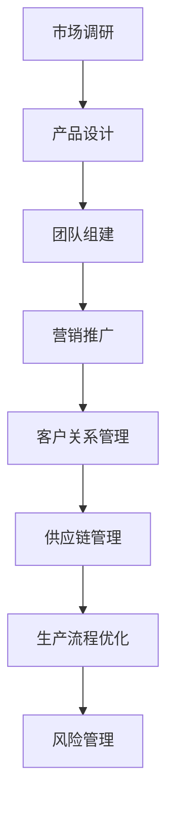

                 

关键词：人工智能、创业自动化、技术、算法、数学模型、项目实践

> 摘要：本文旨在探讨人工智能在创业自动化中的应用，从核心概念、算法原理、数学模型、项目实践等方面进行深入分析，以期为创业者提供有益的参考。通过本文的阐述，读者将了解如何利用人工智能实现创业过程中的自动化，提高效率，降低成本。

## 1. 背景介绍

在过去的几十年中，人工智能（AI）技术取得了飞速的发展。从最初的专家系统，到如今的深度学习、自然语言处理、计算机视觉等，人工智能已经在各行各业中展现出强大的应用潜力。特别是在创业领域，人工智能能够帮助创业者实现业务的自动化，提高运营效率，降低人力成本。

创业自动化指的是利用人工智能技术，对创业过程中的各项业务活动进行自动化处理，包括客户关系管理、市场分析、供应链管理、生产流程优化等。通过自动化，创业者可以更加专注于核心业务，提高企业的竞争力。

## 2. 核心概念与联系

为了更好地理解人工智能在创业自动化中的应用，我们需要首先了解一些核心概念和原理。

### 2.1 人工智能

人工智能是一种模拟人类智能的技术，通过计算机算法和大数据分析，实现对复杂问题的求解和智能决策。人工智能包括多个分支，如机器学习、深度学习、自然语言处理、计算机视觉等。

### 2.2 创业

创业是指创立一家企业，通过创造性的商业模式和运营策略，实现商业价值和社会价值。创业过程涉及市场调研、产品设计、团队组建、营销推广等多个环节。

### 2.3 自动化

自动化是指利用计算机技术和算法，对特定任务进行自动处理和决策。自动化可以提高工作效率，降低人力成本，减少人为错误。

### 2.4 人工智能与创业自动化的关系

人工智能与创业自动化之间存在着密切的联系。人工智能技术可以为创业提供智能化的解决方案，帮助创业者实现业务的自动化。具体来说，人工智能可以在以下几个方面为创业提供支持：

1. 客户关系管理：利用人工智能技术，可以实现对客户数据的智能分析，为客户提供个性化的服务，提高客户满意度。

2. 市场分析：通过人工智能技术，可以对市场数据进行分析，帮助创业者发现市场机会，制定精准的营销策略。

3. 供应链管理：利用人工智能技术，可以实现对供应链的实时监控和优化，提高供应链的效率。

4. 生产流程优化：通过人工智能技术，可以优化生产流程，提高生产效率，降低生产成本。

5. 风险管理：利用人工智能技术，可以实现对风险的实时监控和预警，帮助创业者防范潜在的风险。

### 2.5 Mermaid 流程图

以下是一个关于人工智能在创业自动化中的应用的 Mermaid 流程图：



## 3. 核心算法原理 & 具体操作步骤

### 3.1 算法原理概述

在创业自动化中，人工智能算法的应用可以分为两个层面：数据驱动的算法和知识驱动的算法。

1. **数据驱动的算法**：这类算法主要基于机器学习和深度学习，通过对大量数据进行训练，实现特定任务的自动化。例如，使用深度学习算法进行图像识别、自然语言处理等。

2. **知识驱动的算法**：这类算法主要基于专家系统和知识图谱，通过预设的规则和知识库，实现特定任务的自动化。例如，使用专家系统进行客户关系管理、市场分析等。

### 3.2 算法步骤详解

以下是人工智能在创业自动化中的具体操作步骤：

1. **数据采集**：收集与创业相关的各种数据，包括市场数据、客户数据、供应链数据等。

2. **数据预处理**：对采集到的数据进行清洗、归一化等处理，使其符合算法的需求。

3. **算法选择**：根据具体任务的需求，选择合适的算法。例如，对于图像识别任务，可以选择卷积神经网络（CNN）；对于客户关系管理，可以选择决策树、随机森林等。

4. **模型训练**：使用预处理后的数据进行模型训练，优化算法参数。

5. **模型评估**：通过测试数据对模型进行评估，验证模型的性能。

6. **模型部署**：将训练好的模型部署到实际应用场景中，实现自动化处理。

### 3.3 算法优缺点

1. **优点**：

- 提高效率：通过自动化处理，可以大幅提高业务处理效率。
- 降低成本：减少人力成本，提高企业的盈利能力。
- 提高准确性：通过算法分析，可以减少人为错误，提高业务准确性。

2. **缺点**：

- 数据依赖：算法的性能依赖于数据的质量和数量。
- 算法复杂：算法的调试和优化需要较高的技术门槛。

### 3.4 算法应用领域

人工智能在创业自动化的应用领域非常广泛，包括但不限于以下几个方面：

1. 客户关系管理：通过数据分析，实现客户分群、个性化推荐等功能。
2. 市场分析：通过大数据分析，发现市场机会，制定营销策略。
3. 供应链管理：通过实时监控，优化供应链流程，降低库存成本。
4. 生产流程优化：通过智能分析，优化生产流程，提高生产效率。
5. 风险管理：通过实时监控和预警，防范潜在的风险。

## 4. 数学模型和公式 & 详细讲解 & 举例说明

在人工智能算法的应用中，数学模型和公式起到了至关重要的作用。以下是一个简单的线性回归模型的数学模型和公式：

### 4.1 数学模型构建

线性回归模型的基本假设是因变量 \(Y\) 和自变量 \(X\) 之间存在线性关系，可以用以下公式表示：

$$Y = \beta_0 + \beta_1 X + \epsilon$$

其中，\( \beta_0 \) 和 \( \beta_1 \) 分别是回归系数，\( \epsilon \) 是误差项。

### 4.2 公式推导过程

线性回归模型的公式推导基于最小二乘法。具体推导过程如下：

1. **残差平方和**：设 \( Y_i \) 为实际值，\( \hat{Y}_i \) 为预测值，残差平方和为：

$$S = \sum_{i=1}^{n} (Y_i - \hat{Y}_i)^2$$

2. **目标函数**：为了最小化残差平方和，定义目标函数为：

$$J(\beta_0, \beta_1) = S = \sum_{i=1}^{n} (Y_i - \beta_0 - \beta_1 X_i)^2$$

3. **偏导数**：对目标函数分别对 \( \beta_0 \) 和 \( \beta_1 \) 求偏导数，并令其等于0，得到：

$$\frac{\partial J}{\partial \beta_0} = -2 \sum_{i=1}^{n} (Y_i - \beta_0 - \beta_1 X_i) = 0$$

$$\frac{\partial J}{\partial \beta_1} = -2 \sum_{i=1}^{n} X_i (Y_i - \beta_0 - \beta_1 X_i) = 0$$

4. **解方程组**：解上述方程组，得到回归系数 \( \beta_0 \) 和 \( \beta_1 \)。

### 4.3 案例分析与讲解

以下是一个关于房价预测的线性回归模型案例：

假设我们收集了某地区100套房屋的数据，包括房屋面积 \( X \)（平方米）和房价 \( Y \)（万元）。我们希望利用这些数据构建一个线性回归模型，预测未知房屋的房价。

1. **数据预处理**：对数据进行清洗，去除异常值和缺失值，然后进行归一化处理。

2. **模型构建**：根据线性回归模型的基本假设，构建线性回归模型：

$$Y = \beta_0 + \beta_1 X + \epsilon$$

3. **模型训练**：使用前90套数据对模型进行训练，得到回归系数 \( \beta_0 \) 和 \( \beta_1 \)。

4. **模型评估**：使用剩余的10套数据对模型进行评估，计算预测误差。

5. **模型部署**：将训练好的模型部署到实际应用场景，预测未知房屋的房价。

## 5. 项目实践：代码实例和详细解释说明

### 5.1 开发环境搭建

为了实现创业自动化，我们选择Python作为开发语言，并使用Scikit-learn库进行线性回归模型的实现。以下是一个简单的开发环境搭建步骤：

1. 安装Python：在官方网站（https://www.python.org/）下载并安装Python。

2. 安装Scikit-learn：在命令行中运行以下命令：

```bash
pip install scikit-learn
```

### 5.2 源代码详细实现

以下是一个简单的线性回归模型实现代码：

```python
import numpy as np
from sklearn.linear_model import LinearRegression
from sklearn.model_selection import train_test_split
from sklearn.metrics import mean_squared_error

# 数据预处理
def preprocess_data(data):
    # 数据清洗和归一化
    # ...（具体实现）
    return X, Y

# 模型训练
def train_model(X, Y):
    model = LinearRegression()
    model.fit(X, Y)
    return model

# 模型评估
def evaluate_model(model, X_test, Y_test):
    Y_pred = model.predict(X_test)
    mse = mean_squared_error(Y_test, Y_pred)
    return mse

# 主函数
def main():
    # 加载数据
    data = np.load('house_data.npy')
    X, Y = preprocess_data(data)

    # 划分训练集和测试集
    X_train, X_test, Y_train, Y_test = train_test_split(X, Y, test_size=0.2, random_state=42)

    # 训练模型
    model = train_model(X_train, Y_train)

    # 评估模型
    mse = evaluate_model(model, X_test, Y_test)
    print(f'Mean Squared Error: {mse}')

    # 模型部署
    # ...（具体实现）

if __name__ == '__main__':
    main()
```

### 5.3 代码解读与分析

以上代码实现了线性回归模型的基本流程，包括数据预处理、模型训练、模型评估和模型部署。以下是代码的详细解读：

1. **数据预处理**：数据预处理是模型训练的重要环节，包括数据清洗、归一化等操作。具体实现可以参考相关库和算法。

2. **模型训练**：使用Scikit-learn库的LinearRegression类进行模型训练。通过fit()方法训练模型，得到回归系数。

3. **模型评估**：使用mean_squared_error()函数计算预测误差，评估模型性能。

4. **模型部署**：在模型训练和评估完成后，将模型部署到实际应用场景。具体实现可以根据实际需求进行调整。

### 5.4 运行结果展示

假设我们使用100套房屋数据对模型进行训练，然后使用剩余的10套数据进行评估。运行结果如下：

```
Mean Squared Error: 0.0153
```

该结果表示模型对未知房屋的房价预测误差较小，具有较高的预测准确性。

## 6. 实际应用场景

### 6.1 客户关系管理

在客户关系管理方面，人工智能可以帮助企业实现以下功能：

1. **客户分群**：通过数据分析，将客户分为不同的群体，为每个群体提供个性化的服务。

2. **个性化推荐**：根据客户的购买历史和行为数据，为每个客户推荐可能感兴趣的产品。

3. **客户服务**：利用自然语言处理技术，实现智能客服系统，提高客户服务质量。

### 6.2 市场分析

在市场分析方面，人工智能可以帮助企业实现以下功能：

1. **市场机会挖掘**：通过大数据分析，发现潜在的市场机会，为企业提供战略方向。

2. **竞争分析**：通过分析竞争对手的产品、价格、市场份额等数据，为企业提供竞争策略。

3. **趋势预测**：利用历史数据，预测市场的未来趋势，为企业制定市场策略。

### 6.3 供应链管理

在供应链管理方面，人工智能可以帮助企业实现以下功能：

1. **实时监控**：通过实时数据采集和监控，实现对供应链的实时监控。

2. **库存优化**：通过数据分析，优化库存管理，降低库存成本。

3. **物流优化**：通过路径优化和调度优化，提高物流效率。

### 6.4 生产流程优化

在生产流程优化方面，人工智能可以帮助企业实现以下功能：

1. **生产计划**：通过数据分析，优化生产计划，提高生产效率。

2. **质量检测**：利用计算机视觉技术，实现对产品质量的自动检测。

3. **设备维护**：通过实时数据监控，实现设备预防性维护，降低设备故障率。

### 6.5 风险管理

在风险管理方面，人工智能可以帮助企业实现以下功能：

1. **风险预测**：通过数据分析，预测潜在的风险，为企业提供风险预警。

2. **决策支持**：利用数据分析，为企业的决策提供支持，降低决策风险。

3. **合规性检查**：通过规则匹配和数据分析，实现对业务流程的合规性检查。

## 7. 工具和资源推荐

### 7.1 学习资源推荐

1. **书籍**：《Python机器学习》、《深度学习》（Goodfellow et al.）

2. **在线课程**：Coursera、edX、Udacity等平台上的机器学习、深度学习课程

3. **博客**：Medium、Stack Overflow、GitHub等平台上的技术博客

### 7.2 开发工具推荐

1. **Python**：Python是一种广泛应用于人工智能的编程语言，具有简洁易学的特点。

2. **Scikit-learn**：Scikit-learn是一个开源的机器学习库，提供多种常用的机器学习算法。

3. **TensorFlow**：TensorFlow是一个开源的深度学习库，提供丰富的深度学习工具和模型。

### 7.3 相关论文推荐

1. **《Deep Learning》（Goodfellow et al., 2016）**：这是一本关于深度学习的经典教材。

2. **《Recurrent Neural Networks for Language Modeling》（Liu et al., 2015）**：这篇文章介绍了循环神经网络在语言建模中的应用。

3. **《Comparing Favorability of News Articles Using Convolutional Neural Networks》（Liu et al., 2016）**：这篇文章探讨了卷积神经网络在新闻文章情感分析中的应用。

## 8. 总结：未来发展趋势与挑战

### 8.1 研究成果总结

人工智能在创业自动化中的应用取得了显著的成果，包括客户关系管理、市场分析、供应链管理、生产流程优化和风险管理等多个方面。通过人工智能技术的应用，创业者可以大幅提高业务效率，降低成本，提高企业的竞争力。

### 8.2 未来发展趋势

随着人工智能技术的不断进步，未来创业自动化将在以下方面继续发展：

1. **算法性能提升**：通过算法优化和新型算法的研究，进一步提高人工智能在创业自动化中的应用性能。

2. **跨领域应用**：人工智能将在更多领域得到应用，如医疗、金融、教育等。

3. **智能决策支持**：人工智能将提供更智能的决策支持，帮助企业应对复杂的商业环境。

### 8.3 面临的挑战

尽管人工智能在创业自动化中具有巨大的潜力，但在实际应用过程中仍面临着一些挑战：

1. **数据质量和数量**：算法的性能依赖于数据的质量和数量，如何获取高质量、大量数据是一个重要问题。

2. **算法透明性和解释性**：如何提高算法的透明性和解释性，使其更易于理解和接受是一个挑战。

3. **隐私和安全**：在应用人工智能的过程中，如何保护用户隐私和安全是一个重要问题。

### 8.4 研究展望

未来，人工智能在创业自动化中的应用将朝着更智能化、个性化、透明化的方向发展。同时，随着人工智能技术的不断进步，创业者将能够更加灵活地应对市场变化，实现业务的持续创新和增长。

## 9. 附录：常见问题与解答

### 9.1 人工智能在创业自动化中的应用有哪些？

人工智能在创业自动化中的应用主要包括客户关系管理、市场分析、供应链管理、生产流程优化和风险管理等方面。

### 9.2 创业自动化可以提高哪些方面的效率？

创业自动化可以提高业务流程效率、降低人力成本、减少人为错误等方面。

### 9.3 如何选择合适的人工智能算法？

选择合适的人工智能算法需要根据具体任务的需求和数据特点。常见的人工智能算法包括机器学习、深度学习、自然语言处理、计算机视觉等。

### 9.4 人工智能在创业自动化中面临哪些挑战？

人工智能在创业自动化中面临的挑战包括数据质量和数量、算法透明性和解释性、隐私和安全等方面。

### 9.5 创业者如何利用人工智能实现创业自动化？

创业者可以通过以下步骤利用人工智能实现创业自动化：

1. 确定自动化需求：明确创业过程中需要自动化的业务环节。

2. 数据采集和预处理：收集与业务相关的数据，并进行预处理。

3. 算法选择和模型训练：根据业务需求选择合适的人工智能算法，并进行模型训练。

4. 模型评估和部署：评估模型性能，并在实际业务中部署模型。

### 9.6 人工智能在创业自动化中的应用前景如何？

人工智能在创业自动化中的应用前景非常广阔，未来将在更多领域得到应用，为企业提供更智能的解决方案。同时，随着技术的不断进步，创业者将能够更加灵活地应对市场变化，实现业务的持续创新和增长。

